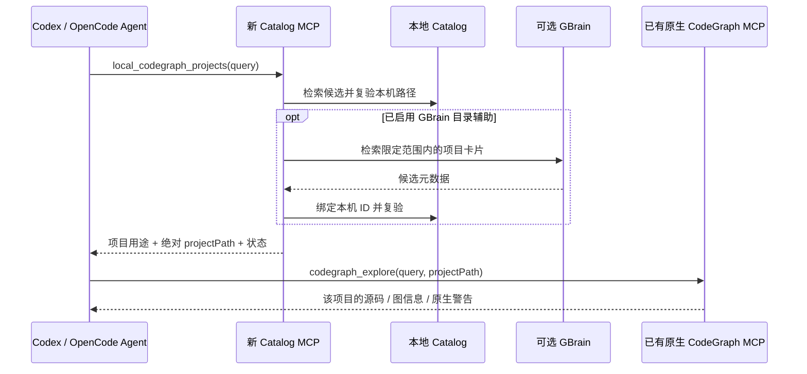

# 本地 CodeGraph Catalog MCP Spec

> [!abstract] 最终定位
> 为本地 Codex 与 OpenCode 独立新增一个目录发现 MCP，自动发现指定本机代码目录下已有的 CodeGraph 索引，将项目用途、状态与可直接使用的绝对 `projectPath` 共享给 Agent。Agent 选择项目后，直接调用宿主中已有的原版 CodeGraph MCP 检索。新服务不代理代码查询，不持有 CodeGraph 后端连接，不修改其源码或工具接口。

> [!info] 状态
> 第 4 版是待实现 spec，替代第 3 版中的“新 MCP 转发 explore”设计。已核对本机 Codex CLI `0.154.0`、OpenCode `1.18.30`、OpenCode 现有 MCP 配置形状及官方配置文档；原生 CodeGraph `projectPath` 能力沿用此前源码和工具声明核对。尚未实现/安装本服务、修改宿主配置或执行双宿主端到端测试。

## 1. 目标、边界与设计变化

用户在主工作区 A 工作，需要借助本机 B/C 项目的已有 CodeGraph 索引理解 SDK、服务、共享库或参考实现。安装时配置代码目录范围后，B/C 应自动发现，无须逐项目登记，也无须切换工作区。

本规范中的 MUST / 必须为验收要求；SHOULD / 应为默认设计；MAY / 可为可选增强。

| 组成 | 职责 |
| --- | --- |
| 新 Catalog MCP | 发现已有索引、维护元数据、筛选相关项目、复验并输出路径 |
| Codex / OpenCode 中的 Agent | 根据当前任务选择候选，调用已有原生 CodeGraph 工具，标注来源 |
| 原版 CodeGraph MCP | 通过现有 projectPath 选择项目，返回源码、图结构及新鲜度提示 |
| 可选本地 GBrain | 存取目录卡片，增强元数据检索与跨会话记忆 |

相较第 3 版，删除 `workspace_codegraph_explore`、CodeGraph MCP Client adapter、查询代理、后端连接池和查询结果封装。新增服务也不统一索引、不建立跨项目图边、不执行 init/index/sync、不为外部项目启动 watcher。

目录既要让 Agent 知道“有什么”，也要让它立即知道“如何查”。因此本版必须返回授权范围内项目的绝对 `projectPath`，只返回逻辑 ID 或隐藏路径不能完成原生 MCP 交接。

## 2. 架构：由 Agent 连接两个 MCP



不存在 Catalog → CodeGraph 调用边。Catalog 不需要获取宿主里另一个 MCP 的连接对象，也不启动额外 CodeGraph 子进程。两个服务只需在同一 Agent 会话中可用。

本地 Codex 与 OpenCode 的 Catalog stdio 进程可同时连接同一机器 Catalog 数据文件；共享的是项目目录，不是会话、权限状态或代码查询结果。各宿主仍独立管理自己的原生 CodeGraph 连接。

## 3. 独立服务与交付物

建议服务别名 `codegraph-catalog`，可执行文件暂名 `codegraph-catalog-mcp`；名称和参数均为拟实现接口，当前不代表 npm 已发布包。

交付包包含：

- 一个标准 MCP stdio server，可在两个宿主中以本地进程启动。
- 自己的配置 schema、本地 Catalog 存储、分片扫描器和可选 GBrain adapter。
- Codex TOML 与当前 OpenCode JSON/JSONC 的配置模板。
- 一段可附加的 Agent 使用说明，以及协议/宿主端到端测试。

不要求编写 OpenCode JS 插件或 Codex 私有插件接口。原生插件包装可以后加；两个宿主直接注册相同 stdio server 是 v1 基线。安装不修改 CodeGraph installer、工具定义、数据库 schema 或上游 agent instructions。

## 4. 本机目录配置

所有路径必须显式、绝对且在当前机器可解析。示例使用占位路径；安装时换成本机实际值，不原样执行。

```json
{
  "version": 1,
  "dataDir": "/LOCAL_DATA/codegraph-catalog",
  "discovery": {
    "roots": ["/CODE/projects", "/CODE/libs"],
    "refreshIntervalSeconds": 600,
    "maxDepth": 6,
    "maxDirectoriesPerSlice": 2000,
    "maxSliceMs": 1000,
    "maxDirectoriesPerRound": 100000,
    "maxRoundMs": 60000,
    "excludeNames": [".git", "node_modules", "dist", "build", ".cache"]
  },
  "sharing": {
    "roots": ["/CODE/projects", "/CODE/libs"],
    "denyRoots": ["/CODE/projects/private-client"],
    "exposeAbsolutePaths": true
  },
  "metadata": {
    "mode": "package-manifests-and-bounded-readme",
    "maxBytesPerFile": 16384,
    "maxBytesPerProject": 65536
  },
  "gbrain": {
    "enabled": false,
    "connectionRef": "local-gbrain-catalog",
    "expectedBrain": "host",
    "expectedSource": "codegraph-catalog",
    "slugPrefix": "catalog/codegraph",
    "projection": "reference-only",
    "semanticSearch": false
  }
}
```

`discovery.roots` 控制发现和约定的元数据读取范围；`sharing.roots` 控制可向 Agent 返回目录与路径的子树。必须同时满足二者，denyRoots 优先。参数 `exposeAbsolutePaths` 在原生交接模式必须为 true；为 false 的隐私展示模式仅可浏览目录，不得宣称能直接查询。

这些字段只控制本服务发现和共享哪些路径，**不是原生 CodeGraph 的查询权限配置**。不要再使用会让人误解的“Catalog 已授权，所以后端访问一定获准”表述；宿主和 OS 权限另行决定是否可读。

没有配置扫描范围时返回 setup_required；不自动遍历 home 或整个磁盘。首次安装批准一组代码目录即可涵盖后续新项目，无须登记每个 `.codegraph/`。

可选 `--workspace /ABS/PRIMARY_PROJECT` 仅固定当前工作区的相关性提示。全局安装可以省略：工具参数 `workspacePath` 可提供当前任务位置，仅用于相关性/去重，不扩大发现或共享范围，也不授权读取范围外文件。缺少工作区信号时仍可列出共享目录。

`codegraph/project.json` 不再是必需文件；可作为人工别名和关系提示。其内容不能修改 sharing policy、执行命令或连接 URL，解析失败不影响自动目录。

## 5. 自动发现与状态语义

服务启动后先返回 MCP 初始化，再后台分片刷新。本地缓存存在时立即可检索；缓存不存在时，在工具调用预算内运行有限扫描片段，返回已发现内容和 running/partial 状态，不等待整轮扫描。

扫描必须：

1. 使用 canonical path，按路径段判断范围，默认不跟随目录 symlink / junction。
2. 查找候选根自身的 `.codegraph/` 与 `.codegraph/codegraph.db`；不把子路径向上解析为父级项目，不扫描 `.codegraph` 内部。
3. 不打开 CodeGraph 数据库、不读取其内部表、不查询源码符号；兼容性检查由实际原生调用验证。
4. 对已发现候选读取有界包清单和 README 元数据，不执行任何项目脚本。
5. 分片保存队列，受深度、单片与整轮预算限制；达到限制返回覆盖缺口。
6. 在进程存活期间周期刷新；可选文件事件只作为加速，不假定事件永不丢失。

存在目录和文件只证明 `indexState: marker_present`；不能证明数据库健康、schema 兼容、索引完整或代码最新。本服务没有收到原生查询结果的通道，因此不维护虚构的 last_query_ok 或自动推导 freshness。

`availability` 取 present / missing / inaccessible / unknown；`freshness` 默认 unknown。未出现在部分扫描里不能认定 missing；只有直接复验确定不存在才更新为 missing。移动硬盘离线、权限不足和扫描截断分别记录，不自动删除原索引或目录历史。

项目身份使用本地生成的稳定 projectId，并绑定规范化根；同根重建索引可保留 ID，移动路径默认作为新记录。不同 worktree、同名包与同 remote 项目不得合并。

## 6. MCP 协议契约

### 6.1 工具面

新增服务固定只暴露两个工具：

| 工具名 | 用途 | 默认调用频率 |
| --- | --- | --- |
| `local_codegraph_projects` | 发现/筛选项目，并直接给出近期复验过的 projectPath | 首次需要外部项目知识时调用 |
| `local_codegraph_resolve` | 根据历史 ID 重新取得当前路径与状态 | 从 GBrain、旧会话或旧结果恢复项目时调用 |

不增加 `explore`、`query_code` 或通用 execute 工具。名称刻意与原生 `codegraph_explore` 区分，避免 Agent 错把目录搜索当代码搜索。

### 6.2 `local_codegraph_projects` 输入

```json
{
  "type": "object",
  "properties": {
    "query": { "type": "string", "maxLength": 1000 },
    "workspacePath": { "type": "string", "maxLength": 4096 },
    "limit": { "type": "integer", "minimum": 1, "maximum": 50, "default": 5 },
    "cursor": { "type": "string", "maxLength": 2048 },
    "refresh": { "type": "boolean", "default": false }
  },
  "additionalProperties": false
}
```

query 只匹配目录元数据，优先精确包名、别名、项目名，其次词法相关性和可选 GBrain 召回。无 query 时按稳定顺序列目录。结果 Top-K 不代表全部本机项目；只有明确分页穷尽且扫描覆盖完成才可描述配置范围内覆盖情况。

refresh 表示安排有界刷新，不代表重建或同步任何 CodeGraph。cursor 为不透明快照游标，绑定过滤条件和调用方视图；查询条件变化或快照过期时返回 cursor_expired，不能混合不同分页结果。

### 6.3 返回给 Agent 的交接数据

```json
{
  "schemaVersion": 1,
  "status": "ok",
  "machineId": "machine_local_01",
  "catalogRevision": 42,
  "scanState": "running",
  "coverage": "partial",
  "projects": [
    {
      "projectId": "cg_sdk_01",
      "recordRevision": 3,
      "name": "order-sdk",
      "description": "订单服务客户端与类型定义",
      "reason": ["包名匹配 @company/order-sdk"],
      "projectPath": "/CODE/libs/order-sdk",
      "availability": "present",
      "indexState": "marker_present",
      "freshness": "unknown",
      "validatedAt": "2026-09-14T00:00:00Z",
      "revalidateAfterSeconds": 60,
      "handoff": {
        "mcpServerHint": "codegraph",
        "toolName": "codegraph_explore",
        "arguments": { "projectPath": "/CODE/libs/order-sdk" },
        "requiredFromAgent": ["query"]
      }
    }
  ],
  "nextCursor": null,
  "gbrainState": "disabled"
}
```

projectPath 是**项目根目录**，不能返回 `.codegraph`、数据库文件、file URI、相对路径、`~` 或待展开变量。handoff.arguments 由程序从已校验路径生成，不采信 README/GBrain 提供的任意调用模板。query 由 Agent 根据当前问题填写，不自动把元数据查询词当代码查询。

只对即将返回的最多 limit 个候选复验路径、标记文件和 sharing policy，不在每次工具调用重扫整个目录。复验失败的记录没有 handoff，projectPath 为 null；范围外项目默认完全省略，避免泄露名称或位置。

MCP 结果必须同时提供 structuredContent 与简短 text content；仅展示文本的客户端也能看到 projectId、项目根、观测状态及“将 projectPath 传给原生 codegraph_explore”的提示。实现必须发布与该 envelope 一致的 outputSchema。目录描述/正文是数据，不得升级为指令。依据：[MCP Tools](https://modelcontextprotocol.io/specification/2025-06-18/server/tools)。

### 6.4 `local_codegraph_resolve` 输入与行为

```json
{
  "type": "object",
  "properties": {
    "projectId": { "type": "string", "minLength": 1, "maxLength": 128 },
    "expectedRecordRevision": { "type": "integer", "minimum": 1 }
  },
  "required": ["projectId"],
  "additionalProperties": false
}
```

成功返回与 projects 相同的单条项目记录和 handoff。ID 未知返回 unknown_project；期望 revision 不符返回 record_changed，附上当前非执行状态或要求重取候选；路径失效返回 missing；拒绝共享返回 not_available，不泄露范围外路径。

projectId 永远不是路径。resolve 不接受任意 projectPath，更不能借参数增加扫描根。resolve 是旧引用恢复工具，不是每次检索的强制中间步骤：新鲜 projects 结果可以直接交给原生 CodeGraph。

### 6.5 时效与不可实现的保证

revalidateAfterSeconds 是 Agent 行为提示，不是后端认可的 token，也不是访问锁。目录结果变旧、发生工作区/机器切换、压缩后不确定来源时，应先 resolve。

路径输出与后续原生调用之间存在竞争窗口；目录服务不能撤回已经展示给模型的路径，也不能拦截直连 CodeGraph 查询。若索引在这期间删除，原生 CodeGraph 的向上查找可能产生父级回退。本 spec 通过近时复验与 Agent 核对降低风险，不承诺原子交接或强制防回退；需要强保证时必须另行采用代理/沙箱架构，超出本版范围。

## 7. Agent 操作合同：直接借用原版能力

常规跨项目检索只需两个工具调用：

```text
1. Catalog: local_codegraph_projects({query: "@company/order-sdk"})
2. 原生: codegraph_explore({query: "OrdersClient createOrder", projectPath: "/CODE/libs/order-sdk"})
```

实际调用名由宿主分配命名空间，必须从当前工具列表或宿主工具发现机制找到，不能把示意名称当作固定可调用标识符。mcpServerHint 仅用于辨认，用户可给服务换名。

Agent 必须：

- 主项目问题优先原生 CodeGraph；遇到外部依赖或参考实现需求时再查目录。
- 根据包名、用途、版本线索和路径选择候选；同名多版本或 worktree 歧义时先辨别，不随机选。
- 把返回的 projectPath 原样传给支持此参数的原生工具；不传 projectId，不把 `.codegraph` 拼接进去。
- 原生工具不可用或缺少 projectPath 时报告缺口，不要求 Catalog 代查、不自动安装/索引。
- 原生返回未索引、安全拒绝或新鲜度警告时尊重其提示；不通过另一个入口绕过拒绝，不把空结果当不存在的证明。
- 在最终答案里注明项目名、文件、符号及重要警告；跨项目 HTTP/类型关联只是接口证据推断，不能伪称图中存在跨仓库边。

可选附加说明（两个宿主共用文本，不注入整份目录）：

> 需要当前仓库之外的本机代码知识时，先用 local_codegraph_projects 找到相关已有索引；将其返回的绝对 projectPath 传给现有 CodeGraph MCP 的 codegraph_explore。历史 projectId 先用 local_codegraph_resolve 复验。目录工具只找项目，代码事实来自原生 CodeGraph；不要自动创建或同步索引。

该说明是安装交付材料；不得覆盖现有 AGENTS.md。工具说明承担基础发现指引，技能/规则片段只增强可发现性，不是正确运行的私有前置依赖。

## 8. Codex 适配

本机观测：`codex --version` 为 `codex-cli 0.154.0`；CLI 提供 `codex mcp add/list/get`。Codex 支持 config.toml 的 `[mcp_servers.<name>]`、stdio command/args 及工具过滤。依据：[Codex 官方 MCP 文档](https://learn.chatgpt.com/docs/extend/mcp?surface=cli)。

以下只新增 Catalog 条目，保留已有原生 CodeGraph 配置。所有占位路径需替换为安装产物路径：

```toml
[mcp_servers.codegraph-catalog]
command = "/ABS/bin/codegraph-catalog-mcp"
args = ["serve", "--config", "/ABS/config/codegraph-catalog.json"]
enabled = true
enabled_tools = ["local_codegraph_projects", "local_codegraph_resolve"]
startup_timeout_sec = 10
tool_timeout_sec = 10
```

CLI 注册等价示例，执行前先确定产物存在：

```sh
codex mcp add codegraph-catalog -- /ABS/bin/codegraph-catalog-mcp serve --config /ABS/config/codegraph-catalog.json
```

模板在用户级 `~/.codex/config.toml` 合并；项目级配置仅在该安装实际支持且受信任时使用。不得用重复表覆盖用户其他 MCP 配置，已有同名服务应先检查再决定更新。

验收需要在本地 Codex 实际会话看到 Catalog 两工具及原生 explore。部分运行时工具可能延迟暴露，使用宿主提供的发现机制加载即可；Catalog 不硬编码本会话的 `mcp__...` 前缀。

## 9. OpenCode 适配：按本机 1.x 配置形状

本机观测：OpenCode `1.18.30`，`/Users/czn/.config/opencode/opencode.json` 当前使用 `mcp.<name>`；原生 codegraph 条目为 type=local、enabled=true。官方文档同样给出该结构。依据：[OpenCode MCP servers](https://opencode.ai/docs/mcp-servers/)。

向现有 JSON/JSONC 的 mcp 对象合并一个 sibling：

```json
{
  "mcp": {
    "codegraph-catalog": {
      "type": "local",
      "command": [
        "/ABS/bin/codegraph-catalog-mcp",
        "serve",
        "--config",
        "/ABS/config/codegraph-catalog.json"
      ],
      "enabled": true
    }
  }
}
```

这是增量配置片段，不是完整配置文件。复用实际存在的 opencode.json 或 opencode.jsonc，保留 comments、其他 MCP、模型配置与权限。不另建一个可能遮蔽现有配置的同级文件。

仓库 AGENTS 中出现的 OpenCode 2 `mcp.servers`、`disabled`、`codemode` 属于另一配置世代，不能直接套在本机 1.18.30。未来升级时，适配器依据已安装版本及其配置 schema 生成新格式；不得同时写两种形式，不能为完成本 spec 擅自升级宿主。

OpenCode 工具可能受全局及 agent 级过滤影响；使用真实注册前缀核对可见性，不无条件开放全部工具。官方说明 MCP 工具使用服务名前缀，具体名称仍以实际会话为准。

安装完成后重启 OpenCode 并创建新会话验收；不能把改完文件等同运行会话已加载。本轮未修改该配置，因此当前无需重启。

## 10. 共同宿主约束与安装验证

| 条件 | 必须满足 |
| --- | --- |
| 路径空间一致 | Catalog、Agent 调用的原生 CodeGraph 位于同机同路径命名空间；本机路径不能交给远程容器后端 |
| 工具可见 | 两个目录工具及原生 codegraph_explore 在当前 agent 权限下可调用 |
| 原生 schema | projectPath 被原生工具接受；否则标记 backend_incompatible，由 Agent 报告 |
| 启动稳定 | command 使用已安装绝对路径，不依赖 GUI PATH、shell alias、npx 临时下载或交互 shell |
| stdio | stdout 只写 MCP 消息，日志写 stderr；扫描不阻塞 initialize |
| 工作区 | 不从任意 cwd 推导扫描范围；workspace 信号缺失不阻塞机器目录 |
| 资源隔离 | Catalog 关闭只结束自己的扫描/可选 GBrain 连接，不终止 CodeGraph |
| 配置保护 | 安装前备份、只修改本服务条目、语法校验、重启/重连后实际验收 |

Catalog 服务不能自行枚举宿主中其他 server 的 tools/list；原生能力检查由安装验证客户端或 Agent 执行。不为此重新引入运行时 CodeGraph adapter。

MCP initialize 协商使用实现所固定 SDK 支持的协议版本；不硬编码宿主私有 rootUri/workspaceFolders，也不要求 MCP resources/prompts UI。v1 只依赖稳定 tools/list 与 tools/call，目录变化不改变工具 schema，不为每个项目生成一个工具。

## 11. GBrain：可选目录存取

保留上一版 GBrain 集成目标，但将其定位为 Catalog 的可选存储/召回 adapter，绝不成为源码查询代理。

本地 Catalog 保存真实 projectId→canonicalRoot 绑定、扫描状态和 sharing policy；GBrain 保存 projectId、machineId、用途、标签、包名、记录版本与 locator。默认 locator 为 `local-codegraph://<machineId>/<projectId>`，是内部引用而非可传给原生 CodeGraph 的 projectPath。

Agent 从 GBrain 命中历史卡片时，调用 local_codegraph_resolve 取得当前真实路径，再调用原生 explore。不同机器卡片不能直接复用路径；GBrain 页不存在于本地 Catalog 的 ID 只是历史候选，不自动授予共享权限。

若要在确认全链路本地的 GBrain 中保存绝对路径，可显式启用 local-paths 投影；使用前仍应 resolve。向本地 Agent 返回路径和向 GBrain 持久化路径是两个独立配置决策。

GBrain 接口限制沿用本机核对：

- `get_page(include_content=true)` 读取完整原页；`put_page` 整页覆盖，当前参数没有 source_id/CAS。
- adapter 必须以固定 brain/source 的专属连接写入，不能自动把本机默认 default source 当目录目标。
- 生成页使用专属 slug/tag，人工说明分开存；读后核对所有权与 hash，再完整写入。
- 本地 outbox 合并过时版本，单写者投影；写入超时先读取确认 hash，不盲目重试。
- `list_pages` 分页用于目录枚举，search/query Top-K 不是全量目录；并发更新时需去重/重扫。
- local-first 默认用本地词法检索。GBrain search/put_page 的 embedding 和 query expansion 是否联网必须单独确认；本地 PostgreSQL 不证明整个链路离线。

GBrain 故障时，目录发现、resolve 和 Agent 直连原生查询继续工作。无 GBrain 配置即无连接；启用时服务自己持有明确配置的 GBrain MCP Client，不假设能复用宿主里的 GBrain 连接。无需为每次目录发现写入 GBrain，只有稳定元数据变化才排队投影。

## 12. 隐私、缓存和错误

把绝对目录共享给 Agent 意味着路径可能进入模型上下文；local-first 描述发现、存储和代码访问的位置，不代表本地 Codex/OpenCode 一定使用本机模型。扫描/共享范围的配置需考虑这一事实，不能声称内容绝不离机。

共享 Catalog 按机器持久化；两个宿主相同 dataDir 使用同一项目 ID。每个前端按其 sharing 配置过滤，不共享可变 activeProject。扫描与 GBrain 投影用本地租约选单写者，崩溃后可接管；网络调用不占数据库写锁。

输出路径前按实时共享策略过滤。路径已经返回后，Catalog 无法撤回 Agent 记忆，也不能保证撤销后的原生调用被拒绝；严格访问控制交由宿主/OS。目录与源码内容永远不改变策略。

| 状态 | 结果 |
| --- | --- |
| 未配置根 | setup_required，无任意磁盘扫描 |
| 扫描进行中/到上限 | ok + running/partial + 覆盖信息 |
| 无匹配项目 | no_matches，并保留覆盖状态，不推断源码不存在 |
| 老 ID 或缺失路径 | unknown_project / missing，无 handoff |
| 当前视图不能共享 | not_available，无路径泄露 |
| 页游标过期 | cursor_expired，要求重新检索 |
| GBrain 不可用 | 本地结果正常 + gbrainState=degraded |
| 服务内部异常 | 明确工具执行错误，避免无止境重试 |

发现和 resolve 可更新自身缓存/目录，因此不能仅凭“不改源码”就无条件声明绝对无副作用。实现应基于实际行为选择 MCP annotations；annotations 不是授权机制。原版检索的磁盘副作用、新鲜度、权限与同步语义由其自身决定，目录服务不重新包装承诺。

## 13. 验收标准与实施顺序

### 13.1 协议及目录测试

- 无 manifest 时可自动发现 B/C；后续新增索引可在刷新与扫描预算内发现。
- spaces、中文路径、嵌套索引、同名包、同 remote 的 worktree 均返回精确独立根。
- 返回前确认根自身有标记；没有标记的候选不得生成 handoff，不打开所有数据库验证。
- 文本结果与 structuredContent 的 projectPath 完全一致；实际交接只携带标准原生参数。
- 缺失、权限不足、扫描中断不等同全部不存在；游标和 lease 恢复符合规范。
- GBrain 离线、历史卡片及篡改 locator 不改变本地绑定和共享策略。

### 13.2 双宿主端到端验收

在 Codex 与 OpenCode 分别执行同一任务：A 为主工作区，B/C 是已经存在、可读取的独立索引。

| 步骤 | 验收证据 |
| --- | --- |
| 服务注册 | 当前宿主实际列出 Catalog 工具与原生 explore，记录宿主版本 |
| 项目发现 | 调用 local_codegraph_projects 能看到 B/C，路径和用途正确 |
| 原生查询 | 将 B 的 projectPath 直接交给原生 CodeGraph，得到 B 的符号/源码 |
| 第二项目 | 连续查询 C，不切 cwd/工作区，不修改原生 MCP 配置 |
| 来源区分 | B/C 同名符号不会混淆，回答标注来源 |
| 历史恢复 | 从 GBrain 或保存的 projectId 经 resolve 重新取得 B 路径 |
| 无代理证明 | Catalog 没有 CodeGraph 客户端连接、子进程或代码查询日志 |
| 回归 | 主工作区原生查询无新增目录前置调用，关闭 Catalog 不破坏原生服务 |

`codex mcp list` / `opencode mcp list` 只证明配置/连接观测，不能替代以上真实工具调用。基础使用目标为“目录一次 + 原生查询一次”；复杂歧义可增加调用，不设伪造硬配额。

本机 CLI 版本与配置已核对不等于上述端到端通过。Codex GUI/IDE 是否与 CLI 使用相同环境必须另测，不能由 CLI 结果自动推定。

### 13.3 实施顺序

1. 新仓库实现自动发现、本地 Catalog 和两个工具，完成纯协议测试。
2. 生成针对本机版本的 Codex / OpenCode 配置增量，完成双宿主原生交接验收。
3. 加入增量刷新、多进程租约、历史 ID 恢复与规模基准。
4. 按需实现 GBrain adapter、专属页面与离线回退测试。

本 spec 的核心完成条件是第二步的真实交接闭环；GBrain 不应阻塞无依赖的基础版本。性能测量包含发现延迟、目录热查询、扫描资源、Agent 选库正确率和调用数，不再测不存在的代码查询代理开销。

## 14. 证据与版本记录

- 本轮本机只读观测：Codex CLI `0.154.0`，OpenCode `1.18.30`；检查 OpenCode MCP 键结构时未输出凭证或修改配置。
- [Codex MCP 官方文档](https://learn.chatgpt.com/docs/extend/mcp?surface=cli)：stdio/TOML 配置与工具过滤。
- [OpenCode MCP 官方文档](https://opencode.ai/docs/mcp-servers/)：mcp.<name> 本地配置与工具可见性。
- 原版能力：此前对本地 CodeGraph `3ed73bc` 的 ToolHandler.getCodeGraph、CodeGraph.openSync 及当前工具 schema 核对；新 spec 不改变该能力。
- GBrain：沿用第 3 版 CLI `0.48.4.0` 和工具声明证据；本轮未执行目录写入或模型数据去向测试。

本版的最终分工：Catalog 发现并把真实项目路径交给 Agent；Codex/OpenCode Agent 选择并调用；原版 CodeGraph 检索；GBrain 可选保存目录。四者职责独立，基础方案无需查询代理或上游源码改动。
