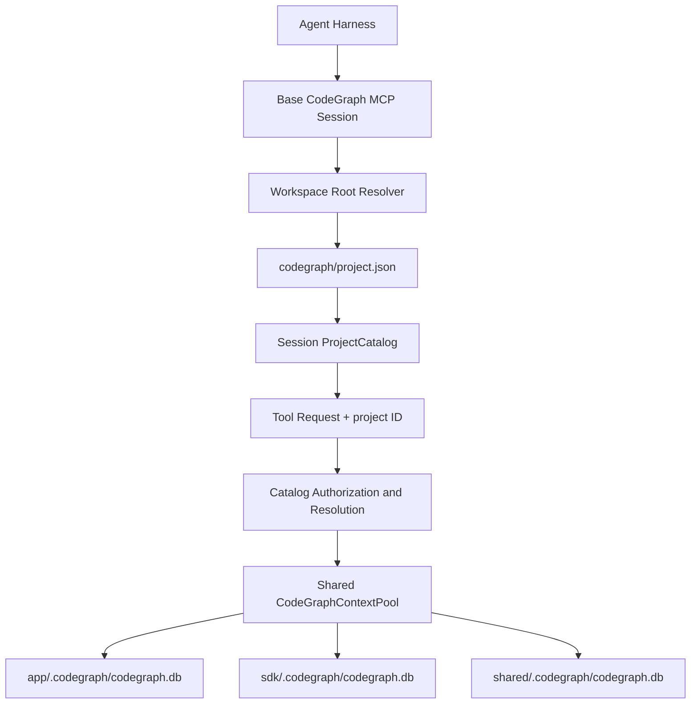
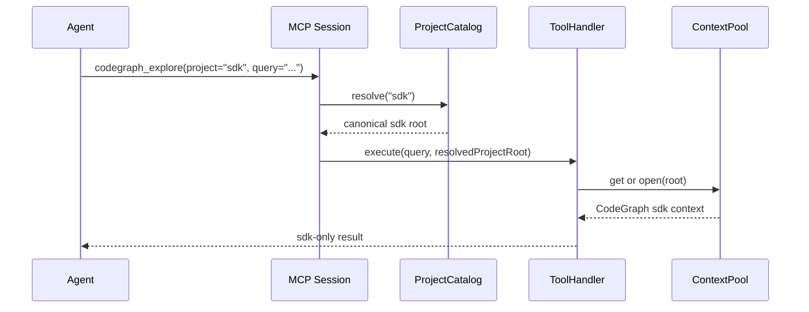

# CodeGraph Workspace Project Context Catalog Design

> [!abstract] 一句话结论
> 一个 Base CodeGraph MCP 从工作区根目录读取 `codegraph/project.json`，把用户显式登记的多个独立 `.codegraph` 项目上下文公布给 Agent Harness；Agent 每次查询显式选择一个项目上下文。系统不建立统一索引、不执行联邦查询，也不生成跨项目图边。

## 1. 背景

一个 Agent 工作区经常只打开主项目，但任务可能需要理解独立目录中的 SDK、共享库、后端服务或基础设施项目。这些项目已经分别运行过 `codegraph init`，各自拥有独立的 `.codegraph/codegraph.db`。

CodeGraph 当前已经具备部分基础能力：

- MCP 会话可从 `rootUri`、`workspaceFolders`、`--path` 或惰性的 `roots/list` 获得工作目录信号；
- `ToolHandler.getCodeGraph(projectPath)` 可以向上定位最近的 `.codegraph/`，并按解析后的项目根目录惰性打开和缓存 `CodeGraph`；
- 同一 MCP 进程可以在不同调用中查询不同项目；
- `ExploreSessionState` 已按项目根目录隔离 explore 调用历史。

当前缺口不是查询引擎能力，而是缺少一个可发现、可授权、对 Agent 友好的项目上下文目录。Agent 只能猜测绝对 `projectPath`，Harness 也不知道当前项目有哪些已登记依赖。

## 2. 设计目标

本设计实现以下能力：

1. Base MCP 能从工作区根目录发现 `codegraph/project.json`；
2. manifest 声明当前项目及其可访问的依赖项目上下文；
3. Agent Harness 能获得结构化项目目录；
4. 现有 CodeGraph 查询工具能通过稳定的逻辑项目 ID 选择一个上下文；
5. 项目上下文按需打开，并复用现有 `.codegraph` 数据库；
6. 授权信息按 MCP 会话隔离，数据库连接可以按规范化项目根复用；
7. 没有 manifest 的工作区保持现有行为和兼容性。

## 3. 非目标

本设计明确不实现：

- 不把多个项目合并为一个索引；
- 不在一次查询中搜索多个 `.codegraph` 数据库；
- 不聚合、排序或去重多个项目的查询结果；
- 不推断查询应该自动转发到哪个依赖项目；
- 不建立跨项目 `calls`、`imports`、`references` 或 impact 边；
- 不自动运行 `codegraph init`、`codegraph index` 或 `codegraph sync`；
- 不为每个项目启动独立 MCP 子进程；
- 不要求 Codex、Claude Code、Cursor 或 OpenCode 提供私有插件接口。

这项能力的准确名称是 **Workspace Project Context Catalog and Explicit Instance Selection**，不是 multi-index federation。

## 4. 术语

| 术语 | 含义 |
| --- | --- |
| Workspace root | MCP 客户端或服务器配置提供的当前工作区根目录 |
| Project manifest | `<workspace-root>/codegraph/project.json` |
| Project ID | manifest 中稳定、对 Agent 可见的逻辑名称，例如 `app`、`sdk` |
| Project context | 一个已经存在的、拥有独立 `.codegraph/` 的 CodeGraph 项目根目录 |
| Current project | 当前 Agent 任务的默认项目上下文 |
| Dependency project | 用户在 manifest 中显式登记、允许 Agent 按需查询的相关项目上下文 |
| Project catalog | 当前 MCP 会话经过解析和校验后的 Project ID 到项目根目录映射 |

“多实例”在本文中始终指多个独立 Project Context，不指多个 MCP 进程。

## 5. 总体架构



架构分为控制面和查询面：

- **控制面**由 `WorkspaceRootResolver` 和会话级 `ProjectCatalog` 组成，负责发现、解析、授权和公布项目；
- **查询面**复用现有 `ToolHandler` 与 `CodeGraph`，一次只对一个已解析的项目根执行原有查询。

Project Catalog 不理解符号、节点或图边；查询层也不解释项目依赖关系。两个边界保持独立。

## 6. Workspace root 与 manifest 发现

### 6.1 保留原始 workspace root

当前 MCP 初始化会把客户端目录信号进一步解析成默认 CodeGraph 项目根。新设计必须同时保留两个概念：

- `workspaceRoot`：用于寻找 `codegraph/project.json`；
- `defaultProjectRoot`：用于执行未指定项目的现有查询。

不能先调用 `resolveServerRoot()` 再寻找 manifest，否则单子项目自动采用可能把工作区父目录信息丢失。

### 6.2 发现顺序

兼容当前实现的目录信号优先级：

1. `initialize.rootUri`；
2. `initialize.workspaceFolders[0].uri`；
3. MCP 启动参数 `--path`；
4. 首次工具调用期间请求 `roots/list`；
5. 最后才使用 `process.cwd()` 作为兼容回退。

Base MCP 对最终选定的 `workspaceRoot` 只检查精确位置：

```text
<workspaceRoot>/codegraph/project.json
```

它不递归扫描磁盘寻找 manifest，也不根据 package manager 文件自动推断外部依赖。

### 6.3 延迟发现

当 root 只能通过 `roots/list` 获得时，manifest 在 MCP `initialize` 响应之后才可用。此时：

- 工具列表保持稳定；
- 第一次工具调用触发一次有界的 root 与 manifest 初始化；
- Project Catalog 在该调用继续执行前准备完成；
- 第一次成功响应可以附带一次简短的“可用项目”提示；
- Harness 可以随时显式调用 `codegraph_projects` 获取完整目录。

## 7. Manifest 契约

### 7.1 示例

```json
{
  "$schema": "https://codegraph.dev/schemas/project-contexts-v1.json",
  "version": 1,
  "defaultProject": "app",
  "projects": {
    "app": {
      "root": ".",
      "description": "Primary application"
    },
    "sdk": {
      "root": "../sdk",
      "description": "Client SDK"
    },
    "shared": {
      "root": "../shared",
      "description": "Shared domain library"
    }
  },
  "dependencies": {
    "app": ["sdk", "shared"]
  }
}
```

### 7.2 字段语义

| 字段 | 必需 | 语义 |
| --- | --- | --- |
| `version` | 是 | manifest 格式版本；v1 只接受整数 `1` |
| `defaultProject` | 是 | 未提供 `project` 时使用的逻辑项目 ID |
| `projects` | 是 | Project ID 到项目声明的映射 |
| `projects.*.root` | 是 | 相对 manifest 所在 workspace root 的路径；也可引用已经由 Harness root 或服务器 allowlist 授权的绝对路径 |
| `projects.*.description` | 否 | 提供给 Agent 的简短用途说明，不参与路由 |
| `dependencies` | 否 | Project ID 之间的提示关系，不参与自动查询或图构建 |
| `$schema` | 否 | 编辑器校验提示 |

### 7.3 校验规则

- Project ID 必须匹配 `^[A-Za-z0-9][A-Za-z0-9._-]{0,63}$`；
- `defaultProject` 必须存在于 `projects`；
- `dependencies` 中的所有 ID 必须存在；
- 相对路径以 `workspaceRoot` 为基准，不以 MCP 进程 cwd 为基准；
- 每个 root 经 `resolve`、`realpath` 和现有敏感路径校验后，必须指向一个已初始化项目；
- workspace root 之外的目标还必须匹配客户端提供的另一个 root 或服务器启动 allowlist；仓库内 manifest 本身不能为任意外部路径授予访问权；
- 多个 ID 解析到同一规范化项目根时拒绝加载，避免权限与展示歧义；
- v1 不展开 glob、环境变量、shell 表达式或命令替换；
- Agent 不得自动创建或修改 manifest。

`dependencies` 只是让 Agent 理解项目关系。例如查询 `app` 时发现 SDK 类型，Agent 可以决定再调用一次 `project: "sdk"`；Base MCP 不会自动执行第二次查询。

## 8. 授权模型

`project.json` 是显式 opt-in 配置，但不能绕过现有敏感目录和路径安全检查。manifest 对 workspace 内项目同时承担发现与选择授权；对于 workspace 外项目，它只承担发现，Harness root 或服务器 allowlist 才是额外授权依据。

每次查询的授权链如下：

```text
tool arguments.project
  -> Session ProjectCatalog lookup
  -> canonical project root
  -> sensitive-path and symlink checks
  -> existing CodeGraph context lookup/open
```

关键约束：

1. 工具不直接把 Agent 提交的 `project` 当文件路径使用；
2. manifest 未登记的 Project ID 不可访问；
3. Catalog 属于 `MCPSession`，不能放在 daemon 共享的 `MCPEngine` 或 `ToolHandler` 中；
4. 共享连接池只缓存 `CodeGraph` 对象，不保存某个会话的授权；
5. manifest 改变后必须重新解析和校验，不能沿用旧授权映射；
6. 原有 `projectPath` 可为兼容性保留，但启用 manifest 后优先要求逻辑 `project`，并在后续版本评估收紧任意跨项目路径访问。

## 9. Agent Harness 接口

### 9.1 项目目录工具

新增一个稳定、只读、无参数工具：

```text
codegraph_projects()
```

示例结果：

```json
{
  "defaultProject": "app",
  "projects": [
    {
      "id": "app",
      "relation": "current",
      "description": "Primary application",
      "indexed": true
    },
    {
      "id": "sdk",
      "relation": "dependency",
      "description": "Client SDK",
      "indexed": true
    }
  ]
}
```

默认结果不向模型暴露 workspace root 或项目绝对路径。需要诊断时可以通过 MCP 日志或显式诊断模式显示经过脱敏的路径信息。

### 9.2 现有查询工具

所有支持 `projectPath` 的现有查询工具增加：

```json
{
  "project": "sdk"
}
```

解析优先级：

1. 如果提供 `project`，必须通过当前会话 Catalog 解析；
2. 如果同时提供 `project` 和 `projectPath`，返回成功形状的参数冲突说明，不猜测优先级；
3. 如果两者都未提供，使用 manifest 的 `defaultProject`；
4. 没有 manifest 时完全保留现有默认项目和 `projectPath` 行为。

工具 schema 使用稳定的字符串字段，不为每个项目动态生成工具，也不把当前 Project ID 集合写成动态 enum。这样工具列表不会随 manifest 内容变化，避免 Harness 缓存失效。

### 9.3 Agent 可见提示

当初始化时已经获得 workspace root，`initialize.instructions` 可包含简短说明：当前工作区有多个已登记 CodeGraph 项目，使用 `codegraph_projects` 查看并通过 `project` 选择。

当 root 延迟发现时，在本会话第一次 CodeGraph 响应中只提示一次。提示不得要求 Agent 使用 Read/Grep，也不得把项目目录重复附加到每个结果。

## 10. 查询与实例生命周期



- Project Catalog 在会话内缓存；
- Catalog 缓存键包含 workspace root 和 manifest 文件状态；
- `CodeGraph` 实例继续按规范化项目根缓存；
- 首次查询某项目时才打开其数据库；
- 一次调用只能解析出一个项目根；
- 结果必须标注实际查询的 `project` ID，防止 Agent 混淆来源；
- `ExploreSessionState` 继续使用项目根隔离预算和去重状态。

v1 不改变 watcher 语义。非默认项目是否自动同步属于独立生命周期问题；本功能只报告当前索引状态，不隐式写入依赖项目。

## 11. 错误处理

CodeGraph 的既有原则是：预期内、可恢复的状态返回成功形状的指导，只有安全拒绝和真实故障使用 MCP error。

| 场景 | 行为 |
| --- | --- |
| manifest 不存在 | 完全回退现有单项目行为 |
| manifest JSON 无效 | 成功形状警告；禁用 Catalog，不影响已有默认项目查询 |
| manifest 版本未知 | 成功形状警告；不猜测兼容格式 |
| `defaultProject` 或依赖 ID 无效 | 成功形状配置诊断，列出字段位置 |
| Project ID 不存在 | 成功形状说明，并列出有效 ID |
| 项目尚未索引 | 成功形状说明；不自动运行 init |
| 同时提供 `project` 与 `projectPath` | 成功形状参数冲突说明 |
| 敏感路径、symlink 逃逸或授权拒绝 | `PathRefusalError` / MCP error |
| 数据库打开失败 | 真实故障；携带 retry-once 指引 |

任何一个依赖项目无效都不应让默认项目的合法查询失效。Catalog 返回逐项目状态，只有被选择的无效项目阻止该次查询。

## 12. 向后兼容

没有 `codegraph/project.json` 时：

- MCP 初始化逻辑不变；
- 默认项目解析不变；
- `projectPath` 行为不变；
- 工具输出不增加多项目噪音；
- 不产生额外磁盘扫描。

存在 manifest 时，`project` 是推荐接口，`projectPath` 是兼容接口。首版不移除或改变 `projectPath`，避免破坏已有客户端和测试。

## 13. 测试策略

### 13.1 Manifest 单元测试

- 有效的相对路径和绝对路径；
- 无效 JSON、未知版本和缺失字段；
- 非法 Project ID；
- 未定义依赖、重复规范化根和循环依赖；
- `..`、symlink 和敏感目录；
- manifest mtime/内容变化后的重载。

循环依赖可以作为元数据报告，但不能导致递归查询，因为 v1 从不自动遍历依赖。

### 13.2 MCP 会话测试

- `rootUri`、`workspaceFolders`、`--path` 和惰性 `roots/list` 都能发现 manifest；
- workspace root 与自动采用的 default project root 保持区分；
- 两个会话共享 daemon 时拥有不同 Catalog；
- 某会话不能使用另一会话授权的 Project ID；
- manifest 缺失时现有初始化与工具列表测试保持不变。

### 13.3 查询路由测试

- `project: "app"` 只访问 app 数据库；
- `project: "sdk"` 只访问 sdk 数据库；
- 一次调用不会打开或查询其他依赖数据库；
- 相同项目的后续调用复用已有 CodeGraph 实例；
- `project` 与 `projectPath` 冲突得到稳定诊断；
- 返回内容标注正确 Project ID；
- explore 的跨调用去重仍按项目隔离。

### 13.4 安全与回归测试

- 恶意 manifest 不能访问敏感系统目录；
- 预先布置的 symlink 不能逃逸校验后的根；
- 无 manifest 的单项目、小型 monorepo 和多候选 workspace 无行为回归；
- 项目目录工具不会输出配置秘密或默认暴露绝对路径；
- 未索引项目不会触发任何写操作。

## 14. 实施边界

建议实现拆成三个可独立审查的阶段：

1. **Project Catalog**：manifest schema、解析、校验和会话级状态；
2. **Harness Discovery**：`codegraph_projects` 与初始化/首次响应提示；
3. **Explicit Selection**：现有工具的 `project` 参数和 Catalog 授权路由。

三个阶段都不修改数据库 schema、extractor、resolver、GraphTraverser 或 ContextBuilder。

## 15. 与上游问题的关系

- [#1822](https://github.com/colbymchenry/codegraph/issues/1822) 描述从父工作区使用多个子项目索引的用户场景；
- [#769](https://github.com/colbymchenry/codegraph/issues/769) 提议项目 registry，但偏向全局项目发现；
- [#1367](https://github.com/colbymchenry/codegraph/issues/1367) 指出任意 `projectPath` 的跨工作区授权风险；
- [#1835](https://github.com/colbymchenry/codegraph/issues/1835) 讨论非默认项目的同步生命周期；
- [#214](https://github.com/colbymchenry/codegraph/pull/214)、[#966](https://github.com/colbymchenry/codegraph/pull/966)、[#1007](https://github.com/colbymchenry/codegraph/pull/1007) 和 [#1614](https://github.com/colbymchenry/codegraph/pull/1614) 已提供 root 发现、无默认根工具暴露、显式项目选择和子项目候选等基础能力。

本设计补齐的是“工作区授权项目目录与逻辑 ID 选择”，不会替代或扩大上述问题的索引与同步范围。

## 16. 验收标准

实现完成需要同时满足：

1. 打开主项目工作区后，Base MCP 能发现 manifest 中所有有效独立项目上下文；
2. `codegraph_projects` 返回当前项目和依赖项目的结构化目录；
3. Agent 能通过 `project` 在连续调用中分别查询不同项目；
4. 每次调用只访问被选择的一个 `.codegraph` 数据库；
5. 未登记的项目不能通过逻辑 ID 访问；
6. 两个 MCP 会话之间不存在授权泄漏；
7. 无 manifest 用户的行为、性能和工具面保持兼容；
8. 系统不创建新索引、不合并结果、不生成跨项目图边。
