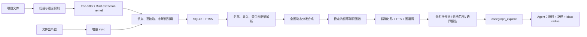

# CodeGraph 深度剖析：从本地代码图谱到 Agent 原生检索的设计哲学与实现机制

> [!abstract] 一句话结论
> CodeGraph 的核心并不是“更快地搜到字符串”，而是把 Agent 每次会话都要重复支付的代码理解成本，提前固化成一个本地、确定、可增量维护的程序知识图谱，再通过一条尽量自足的 `codegraph_explore` 响应同时交付源码、调用路径、影响范围与不确定性边界。它追求的不是检索命中率本身，而是让 Agent 在得到答案后真正停止继续 `Read/Grep`。

本文基于 CodeGraph `v1.6.0`、提交 `3ed73bc` 的当前设计与实现撰写。讨论的是仓库此刻真正运行的机制，而不是把 README 的功能列表重新排列一遍。

---

## 1. CodeGraph 真正在解决什么问题

传统代码搜索把问题理解为：**用户给出一个关键词，系统返回若干文本位置。**

但 Agent 面对的实际任务通常是：

- “一个请求怎样从路由进入服务，再落到数据库？”
- “改这个函数会影响谁，哪些测试应该运行？”
- “这个回调究竟在哪里注册，又由谁触发？”
- “这个组件为什么会重新渲染？”
- “同名方法有多个实现，我现在看到的是哪一个？”

这些都不是单纯的文本匹配问题，而是**程序关系恢复（program relation recovery）**问题。Agent 如果只拥有文件读取和 grep，大致要经历：

```text
猜关键词
  → 搜文件
  → 逐个读取
  → 在上下文中记住符号
  → 手工拼调用关系
  → 发现动态分发断点
  → 换关键词再搜
  → 最后才形成局部心智模型
```

最大的浪费不是某一次磁盘读取，而是这套推理会在每个新会话、每次上下文压缩、每个子 Agent 中重新发生。代码本身没有变化，理解成本却被一遍遍重付。

CodeGraph 的基本判断是：

> **代码结构是可预计算、可复用的资产，不应由语言模型在每次会话中临时重建。**

因此，它把工作拆成两阶段：

1. 索引阶段用确定性的解析器把代码转成节点、边和文件记录；
2. 查询阶段从图中取回与问题相关的源码、路径和影响面，让 Agent 把推理预算用在任务本身，而不是反复侦察仓库。

这是一种典型的**成本前移（shift-left computation）**：一次建立结构，多次低延迟复用。

---

## 2. 宏观架构：从源码到 Agent 可消费答案



从职责上看，系统可以分为五层：

| 层次 | 核心职责 | 关键抽象 |
|---|---|---|
| 提取层 | 从语法树识别程序实体和局部关系 | `Node`、直接 `Edge`、`unresolved_refs` |
| 存储层 | 保存图、全文索引和索引状态 | SQLite、FTS5、WAL |
| 解析层 | 把名字和框架约定解析为真实目标 | import resolver、name matcher、framework resolver |
| 图推导层 | 恢复跨文件、跨语言、动态分发关系 | synthesizer、BFS/DFS、flow、impact |
| 交付层 | 把图结果组织成 Agent 能直接使用的证据 | `codegraph_explore`、MCP、browser viewer |

`src/index.ts` 中的 `CodeGraph` 类是总装配入口。它持有数据库、查询器、提取编排器、引用解析器、图查询器、遍历器和上下文构建器，并负责索引锁、文件锁、WAL 生命周期以及 watcher。这个设计让 CLI、MCP 和 UI 共享同一套底层事实，而不是各自重写一套代码理解逻辑。

---

## 3. 索引机制：如何把源码变成图

### 3.1 第一步：扫描不是“列出所有文件”那么简单

索引首先确定哪些文件属于项目、语言是什么、是否由工具生成、是否被排除或降权。这里的目标不是最大化“扫到的文件数”，而是得到一个**可解释的索引边界**。

项目配置可以排除无关树，也可以把生成代码或外围目录保留在索引中但降低排序权重。后者很重要：完全排除会损失召回率，而仅仅降权可以做到“需要时找得到，默认不抢占真正业务代码的排名”。

全量索引还会记录 `filesDiscovered`、成功、跳过和错误数量。如果中途 worker 崩溃导致文件静默丢失，计数无法闭合，系统就能把索引判为部分完成，而不是把残缺数据库当作真相。

### 3.2 第二步：语法树提取的是程序事实，不是文本摘要

CodeGraph 以 [[Tree-sitter]] 为语法基础。当前主路径使用原生 Rust extraction kernel 处理主要语言，其余语言和文件级回退走可移植提取路径；Svelte、Vue、Astro 等复合格式还有专用提取器。

提取结果的核心不是 embedding，而是结构化事实：

- 节点：文件、类、函数、方法、变量、接口、路由、组件等；
- 边：包含、调用、导入、导出、继承、实现、引用、实例化等；
- 未解析引用：已经看到调用或名字，但必须等全项目符号都写入后才能确定目标。

节点保留文件路径、语言、起止行列、签名、可见性、异步/静态/抽象标记等信息。因此查询结果可以回到**当前源码中的精确位置**，而不仅是给一个语义相近的片段。

这一步的设计重点是**确定性（determinism）**：同一份代码和同一版本的提取器，应产生同一张图。CodeGraph 不让 LLM 在索引时“总结代码”，因为自然语言摘要会引入不可复现、不可逐边审计的判断。

### 3.3 第三步：SQLite 是本地事实库，不只是缓存

每个项目的数据库位于 `.codegraph/codegraph.db`。核心表是：

- `nodes`：程序实体；
- `edges`：实体关系，包含行列、来源和元数据；
- `files`：内容哈希、修改时间、语言、节点数和提取错误；
- `unresolved_refs`：等待解析或解析失败、以后可重试的引用；
- `name_segment_vocab`：把 `OrderStateMachine` 拆成 `order/state/machine`，弥补 FTS 对 camelCase 自然语言命中的不足；
- `project_metadata`：索引状态与构建版本等元信息。

FTS5 覆盖名称、限定名、docstring 和签名；普通 B-Tree 索引覆盖名称、文件、语言以及边的 source/target + kind。边的唯一性不是简单依赖业务代码，而是落在数据库唯一索引上，避免多个解析阶段写出相同边后重复放大调用者和影响范围。

为什么选 SQLite 而不是远程图数据库？因为 CodeGraph 的主要读模式是单机、项目内、读多写少、需要极低启动与运维成本。SQLite 同时提供：

- 本地文件级部署；
- 事务和崩溃恢复；
- FTS5；
- WAL 下读写并发；
- 可被 CLI、MCP、UI 共用的稳定格式。

这不是“图数据库一定不如 SQLite”，而是**问题规模与部署模型决定了 SQLite 更稳**。

### 3.4 第四步：解析把“名字”变成“关系”

解析层处理：

- 函数调用到定义；
- import 到真实文件；
- 路径别名和 workspace package；
- extends / implements / override；
- 框架路由到 handler；
- React Router、Next.js、SvelteKit、Vue/Nuxt 等页面与导航；
- React Native、Swift/Objective-C、Expo 等跨语言桥接。

这里有一个重要分工：

- 单个、具名引用能独立判断时，交给 resolver；
- 必须观察整个图、关联注册点和触发点时，交给 whole-graph synthesizer。

例如 `cb()` 自身没有足够信息说明它会调用谁。只有把“注册回调”“保存回调”“后来遍历并触发回调”放在一起，才能合成 `dispatcher → handler` 的边。这类逻辑不能塞进一个只处理单条引用的 resolver。

### 3.5 第五步：动态分发合成补上静态图最有价值的断点

纯语法提取天然会在以下位置断裂：

- callback / observer；
- EventEmitter；
- interface → implementation；
- React state update → render；
- JSX parent → child；
- 前端 `fetch` → 后端 route；
- queue producer → consumer；
- message bus / socket event → handler；
- React Native JS ↔ native；
- Celery、Spring Event、MediatR、Sidekiq 等框架分发。

CodeGraph 在基础图提交后运行一组独立 synthesis pass。每个 pass 读取已提交图和源码，产出候选边，最后按固定顺序合并；语言 gate 会跳过在当前项目中必然为空的 pass。合成边统一标记为 `provenance: heuristic`，并在 metadata 中记录 `synthesizedBy`、事件名、通道或注册位置。

这体现了一个很成熟的取舍：**启发式关系可以进入图，但不能伪装成语法确定事实。** 使用者既能获得动态链路的召回率，又能知道哪一跳是推导出来的。

---

## 4. 查询机制：`codegraph_explore` 为什么不是普通搜索

### 4.1 混合检索不是“向量 + 关键词”的惯常配方

CodeGraph 的查询首先从问题中提取可能的符号名，然后组合：

1. 精确名称匹配；
2. FTS5 前缀搜索；
3. LIKE 子串回退；
4. 受约束的模糊建议；
5. camelCase 名称分词词表；
6. 同文件共现加权；
7. 从入口节点进行有界图遍历；
8. 补入同文件内连接关键符号的 glue nodes。

这套流程的思想是：自然语言适合帮助找到入口，但**程序结构问题最终仍需落到精确符号和图关系上**。

对于调用流问题，`codegraph_explore` 会把查询中明确命名的符号当作锚点，寻找这些锚点之间的路径。项目规则甚至限制无名桥接的数量，避免路径在“god function”的巨大扇出中游走。对于同名重载，类型名和限定名用于偏置正确定义；如果仍然歧义，系统宁可返回多个候选，也不把一个猜测包装成唯一答案。

### 4.2 一次响应交付四类东西

`codegraph_explore` 不是只返回搜索结果，而是同时组织：

```text
Flow            关键符号之间的执行路径
Blast radius    谁依赖这些符号、修改可能波及哪里
Relationships   calls / references / implements 等关系摘要
Source          当前、逐行编号的真实源码
```

这四部分共同构成“足够继续工作”的最小闭环。只有路径没有函数体，Agent 还会去读文件；只有源码没有路径，Agent 还会自己拼关系；只有相关文件列表，Agent 仍不知道从哪里开始。

因此，CodeGraph 优化的核心指标不是“返回了多少相关项”，而是：

> **这次回答是否足够自洽，让 Agent 不再调用别的检索工具？**

### 4.3 为什么默认 MCP 只暴露一个工具

项目内部仍实现了 search、node、callers、callees、impact、files、status 等工具，但默认 MCP 列表只暴露 `codegraph_explore`。

这是经过 Agent 行为实验得出的结论：工具越多，不代表 Agent 越聪明地选择；相反，模型可能先 search、再 context、再 node、最后仍 Read，增加工具轮次和上下文负担。把最常见需求集中到一个强工具中，能降低“选错工具”的概率。

这是典型的**Agent 原生 API 设计**：API 表面不是按后端模块划分，而是按模型实际会完成任务的方式划分。

需要专门工具时仍可通过 `CODEGRAPH_MCP_TOOLS` 重新暴露，但那是操作员选择，不是默认认知负担。

### 4.4 输出预算也是正确性设计

不同规模仓库使用不同的调用建议和输出上限。重点不是简单“仓库大就多给一点”，而是两个预算都必须随规模单调不减：

- 推荐探索调用数；
- 每次调用的总字符数、文件数和单文件字符数。

如果中型仓库反而得到更小的单文件预算，那么一个超大的核心文件只会返回零碎片段，Agent 必然回退到 Read。换言之，预算不仅影响性能，也直接影响“回答是否足够完整”。

---

## 5. 新鲜度与并发：本地图也必须对抗时间

静态索引最大的风险不是查不到，而是**看起来可信、实际上已经过期**。

CodeGraph 用三层机制处理这个问题：

1. 默认项目由原生文件 watcher 监听，编辑事件经过 debounce 后触发增量 sync；
2. MCP 连接建立后先进行一次 catch-up reconcile，吸收服务器离线期间的修改；
3. 输出源码前再次检查文件的 size、mtime，必要时比较内容哈希，避免拿“当前文件字节”配合“旧索引行号”切出另一个函数的代码。

第三点尤其关键。假设旧索引认为函数 A 位于 100–130 行，文件后来在开头新增 50 行。如果直接按旧范围读取当前文件，返回的可能是函数 B，却仍标成 A。这比明确报 stale 更危险，因为它是一种**自信的错误**。

当前实现对漂移文件采取保守策略：小文件可返回完整当前源码；大文件则省略不可信切片并明确标记。它宁愿少给，也不返回错位代码。

并发方面：

- 进程内 mutex 和跨进程 file lock 保证写入序列化；
- SQLite WAL 允许读者与单写者并行；
- 批量索引时临时调整 journal/checkpoint 策略，减少热页反复回写；
- daemon 共享一个默认项目实例、watcher 和 WAL；
- 多客户端重查询可下放到 worker-thread query pool；
- 索引进行中会写 `index_state=indexing`，崩溃后不会把截断结果伪装成完成状态。

这里的设计哲学是：**性能优化必须保留失败可诊断性。** 快速初始化之所以可以降低崩溃耐久性，是因为新数据库在完成前本来就是可丢弃派生物；已有数据库和增量更新不会走同样的风险路径。

---

## 6. 项目的核心设计哲学

### 6.1 Local-first：代码不需要先离开机器才能被理解

索引、数据库、MCP 服务和 viewer 都运行在本地。项目图位于项目自己的 `.codegraph/` 中，viewer 只监听 `127.0.0.1`。这既是隐私策略，也是延迟策略和可用性策略：没有云端账户、上传、远程向量库和网络往返，代码搜索不会因外部服务不可用而失效。

### 6.2 事实与推断分层，而不是把所有边都画成真理

tree-sitter 直接提取的边、名称解析得到的边、启发式 synthesis 得到的边有不同证据强度。CodeGraph 保留 provenance，并在输出和 UI 中用虚线、注册位置、边界提示表达不确定性。

项目的 UI 原则“honesty in the pixels”其实也是整个系统的哲学：**不确定性不是内部细节，而是用户界面的一部分。**

### 6.3 适配 Agent，而不是教育 Agent

大量工具说明、更多示例、新增一个更专用的工具，看起来都很合理，但真实模型未必会按设计者希望的方式选择。项目从 A/B 结果中形成了一条非常重要的原则：

> 不要求 Agent 改变行为；增强它已经会调用的工具，让相同输入得到更完整的回答。

这就是 `codegraph_explore` 成为唯一默认入口、动态分发覆盖持续扩张、源码和 blast radius 被合并进同一响应的原因。

### 6.4 Sufficiency over retrieval：检索的终点是“停止搜索”

传统搜索系统常用 precision、recall、NDCG 评价结果列表。CodeGraph 更关心任务级指标：

- Agent 后面还读了几个文件？
- 总共发生多少轮工具调用？
- 墙钟时间是否下降？
- 是否在动态分发处再次手工重建链路？

一个命中率很高但迫使 Agent 继续读五个文件的工具，不算成功；一个响应稍大、却一次结束侦察的工具，反而可能更便宜、更快。

### 6.5 错误形状会训练 Agent 的行为

项目观察到，一两个早期 `isError: true` 会让 Agent 在整个会话里放弃 CodeGraph。因此：

- 未索引、符号没找到、文件不在索引中等预期情况，返回成功形状的操作指引；
- 敏感系统路径拒绝和真正内部故障，才返回硬错误；
- 内部故障建议只重试一次，持续失败就回退内置工具。

这不是“隐藏错误”，而是区分**可恢复状态**与**系统故障**。对 Agent API 来说，协议字段本身也是行为引导信号。

### 6.6 不完整的动态链路可能比完全没有更糟

只补上一段动态边，Agent 会沿着它走到下一个断点，然后继续钻取和读文件；结果可能比一开始明确告诉它“图在这里停止”产生更多轮次。因此，新增动态分发覆盖的标准不是“多了一条边”，而是是否关闭了用户真正关心的端到端路径。

这解释了为什么项目要求在小、中、大真实仓库上做 deterministic probe 和 Agent A/B，而不满足于单元测试里的漂亮 fixture。

### 6.7 共享推导必须只有一个真源

当 MCP 和 browser viewer 都需要调用流、动态边界、类型层次或 dead-code 判断时，推导逻辑放在 `src/graph/`，两个表面只负责渲染。否则同一符号可能在 MCP 中被判断为可达，在 UI 中又被判断为断裂。

这是一条可迁移的架构原则：**共享的不是格式化后的结果，而是产生结论的推导过程。**

### 6.8 用户拥有索引决策权

Agent 不会因为发现某个目录未索引就擅自运行 `codegraph init`。未索引项目会得到清晰提示，但是否建立索引由用户决定。这既避免隐式磁盘写入，也保持工具边界可预测。

---

## 7. MCP 能否支持跨工作区 Code Search？

> [!success] 直接答案
> **可以，但准确说是“同一 MCP 会话中按项目路由查询多个已索引工作区”，不是“把多个工作区自动合并成一张图做一次联邦搜索”。**

### 7.1 当前实现支持什么

每个 CodeGraph 工具都有可选的 `projectPath`。它要求绝对路径，也可以指向项目内部任意子目录；服务会向上寻找最近的 `.codegraph/`，以解析后的项目根作为缓存键，按需打开对应数据库。

因此同一个会话可以这样工作：

```json
{
  "query": "OrderService submitPayment PaymentRepository",
  "projectPath": "/absolute/path/to/backend"
}
```

然后再查询另一个仓库：

```json
{
  "query": "checkout submitOrder api client",
  "projectPath": "/absolute/path/to/frontend"
}
```

第二个项目首次访问时打开数据库，之后按解析后的根目录复用连接。即使 MCP 服务器自己的 cwd 没有索引，工具列表仍然存在，Agent 仍可通过 `projectPath` 访问其他已索引项目。

### 7.2 默认工作区如何确定

MCP 会话初始化时，默认项目的信号优先级大致是：

```text
initialize.rootUri
  > initialize.workspaceFolders[0]
  > serve --mcp --path
  > roots/list 返回的第一个 root
  > process.cwd()
```

拿到起点后，CodeGraph 先向上找最近索引。如果没有找到，并且起点像一个真实 workspace 根，它会做一个有界向下扫描：默认深度 4、最多 64 个候选，跳过隐藏目录和典型依赖目录。

- 恰好发现一个已索引子项目：自动把它作为默认项目；
- 发现多个：不擅自猜，返回候选并要求显式传 `projectPath`；
- 一个都没有：保持“无默认项目”，但工具仍可用于其他已索引路径。

注意：虽然 MCP 客户端可能声明多个 `workspaceFolders` 或 `roots`，当前实现只取第一个用于**默认项目发现**。其余工作区仍应通过每次调用的 `projectPath` 明确选择。

### 7.3 当前实现不支持什么

| 能力 | 当前状态 |
|---|---|
| 同一会话查询多个仓库 | 支持，逐次传不同 `projectPath` |
| monorepo 中查询已索引子服务 | 支持 |
| 服务根无索引时访问其他项目 | 支持 |
| 多个项目连接按根目录缓存 | 支持 |
| 一次查询同时搜索 N 个独立 `.codegraph` 数据库 | 不支持 |
| 自动建立跨数据库调用边 | 不支持 |
| 自动对多个 workspace 做统一排名、去重和 blast radius | 不支持 |
| 只靠 `workspaceFolders` 自动遍历所有根 | 不支持，目前只取第一个默认根 |

所以，如果“跨工作区搜索”指的是**在一个 Agent 会话中先查 A，再查 B**，答案是肯定的；如果指的是**一句 query 直接获得 A→B 的统一调用图**，答案是否定的。

### 7.4 二级项目的新鲜度边界

只有默认项目挂载实时 watcher。通过 `projectPath` 临时打开的其他项目会被缓存，但按设计没有 watcher。

为防止返回错位源码，CodeGraph 会在输出时检测磁盘漂移；发现不一致会返回完整小文件或明确省略不可信的大文件切片。但它不会替你重建那个二级项目的新图。

因此，频繁修改的跨工作区项目有三种实践：

1. 查询前运行 `codegraph sync /absolute/path/to/project`；
2. 把当前主要工作的项目作为 MCP 默认根，让 watcher 跟踪它；
3. 若多个仓库共同构成一个静态系统，并且目录布局允许，可在共同父工作区建立一个统一索引，从根本上获得跨目录边。

第三种方式与多个独立索引不是一回事。只有同一数据库中的节点才可能形成真正的跨服务调用、import 和影响范围。

### 7.5 安全边界

`projectPath` 不是任意文件读取后门。敏感系统目录会被拒绝；源码读取还要通过“必须位于项目根内”的路径校验。配置类节点也会避免把值作为源码片段交给 Agent。

---

## 8. 最佳实践：如何让 CodeGraph 真正产生收益

### 8.1 安装一次，逐项目建图

```bash
codegraph install
cd /path/to/project-a && codegraph init
cd /path/to/project-b && codegraph init
```

`install` 负责把 MCP 服务接入 Agent；`init` 负责为具体项目建立图。两者是不同生命周期，不要把“已经安装 CLI”误认为“项目已经索引”。

### 8.2 用符号袋描述结构问题

对于“如何工作”的问题，自然语言足够；对于调用流，最好把已知端点和中间锚点一起给出：

```text
差：支付请求怎么走？
好：POST /payments PaymentController createPayment PaymentService PaymentRepository
```

精确名称给路径搜索更强的约束。限定名如 `PaymentService.create` 比单独的 `create` 更能避免重载歧义。

### 8.3 把返回源码当作已经 Read

如果响应没有 stale 警告，逐行编号源码就是当前可用证据。再用 grep 验证同一个事实，只会重新支付时间和上下文成本。

例外包括：

- 文件明确被标为已漂移；
- 目标是文档、配置或未索引格式；
- 查询结果明确说静态路径在某个动态边界停止；
- 需要编译器、类型检查器或测试验证运行时正确性。

### 8.4 monorepo 先决定你要“隔离”还是“连通”

- 希望看见跨 package/import/route 的整体影响：优先在 monorepo 根建立一个索引；
- 各服务独立、语言环境差异大、只需要局部搜索：每个服务单独索引，用 `projectPath` 路由；
- 根索引因 `.gitignore` 跳过嵌套仓库时，显式配置 `includeIgnored`，不要假设嵌套 repo 自动进入图。

这个选择本质上决定图的边界。数据库之外的关系不会凭空出现。

### 8.5 对启发式边保持“信任但识别来源”

动态分发边解决了 grep 无法跟踪的问题，但它们是静态证据上的保守推导。审查关键改动时，应关注 `synthesizedBy` 和注册位置；如果系统提示 “Where the graph stops”，不要强迫它给出一个不存在的静态答案。

### 8.6 修改后关注新鲜度，而不是盲目全量重建

默认项目通常由 watcher 自动增量同步。只有 watcher 被禁用、脚本环境没有长驻 MCP、或者二级 `projectPath` 项目正在快速变化时，才需要显式 `codegraph sync`。频繁全量 `index` 会丢掉增量设计带来的收益。

### 8.7 图谱不是编译器，也不是测试

CodeGraph 告诉你“结构上谁可能依赖谁”，但不会证明程序行为正确。推荐顺序是：

```text
CodeGraph 确定修改位置与影响面
  → 实施修改
  → 类型检查 / lint
  → 运行受影响测试
  → 必要时做集成验证
```

把它当成编译器会过度信任；把它只当成搜索框又浪费了图结构。

---

## 9. 典型失败模式与边界

### 9.1 反射、计算属性和运行时容器

当目标由运行时值、反射、依赖注入容器状态或任意字符串决定时，静态图可能无法闭合。CodeGraph 的正确行为是报告边界和候选，而不是为了“完整”生成高风险边。

### 9.2 名称匹配不是类型系统

跨文件解析仍有 best-effort name matching。接口、继承和 receiver 证据能提高精度，但不能代替每门语言的完整编译器语义。歧义调用可能产生多个候选。

### 9.3 一个漂亮 fixture 不能证明真实仓库有效

动态分发规则最容易在小样例上成功、在真实仓库中发生扇出爆炸。因此项目要求按小/中/大仓库验证，并观察 Agent 是否真的减少 Read/Grep、是否更快、是否在后续断点再次回退。

### 9.4 “更多图”不等于“更好答案”

错误边会污染 flow、影响范围和 dead-code 判断。项目用语言 gate、事件 fan-out cap、精确名字、receiver 证据和 provenance 约束启发式合成。对于程序分析工具，**安静地遗漏通常优于自信地误连**。

---

## 10. 如何理解 CodeGraph 的项目重点

可以把 CodeGraph 压缩成下面这个公式：

```text
CodeGraph
= 确定性的 AST 提取
+ 可审计的本地程序图
+ 对动态边界的保守合成
+ 面向 Agent 行为设计的单一检索入口
+ 对新鲜度、不确定性和失败形状的显式管理
```

它不是：

- 云端代码 RAG 服务；
- 只按 embedding 相似度找片段的语义搜索；
- 运行时 tracing 系统；
- 完整替代编译器的静态分析器；
- 自动把所有工作区合并的联邦代码图。

它最独特的地方是把“程序分析正确性”和“Agent 是否会使用、是否会停止搜索”放在同一个设计闭环里。前者决定图有没有意义，后者决定图能否真正节省工程时间。

---

## 11. 最终判断

CodeGraph 的架构价值不在某一个 tree-sitter grammar、某一个 SQLite 查询或某一条 MCP 工具定义，而在它把这些部分围绕同一个目标组织起来：

> **让代码结构成为可复用的本地基础设施，让 Agent 的每次会话从“已经理解过”开始。**

它最值得其他 Agent 工具借鉴的经验有四条：

1. 预计算可重复的结构，不要让模型反复重建；
2. 工具的评价标准是任务是否结束，不是返回列表是否丰富；
3. 把不确定性、过期状态和恢复路径设计进协议输出；
4. 通过真实 Agent 行为实验决定 API，而不是仅凭后端模块的优雅程度决定工具表面。

对“跨工作区搜索”的结论也应保持同样精确：当前 CodeGraph 已经能够在同一 MCP 会话里查询任意数量的已索引项目，但需要逐项目传 `projectPath`；它还不是一个跨数据库的联邦调用图。如果目标是跨仓库端到端影响分析，应尽量建立共同根索引，或者接受分项目查询后由 Agent 在更高层做综合。

---

## 源码证据索引

以下链接固定到本文分析使用的提交：

- [总装配与索引生命周期](https://github.com/colbymchenry/codegraph/blob/3ed73bc127323e63153bf6ec8354afa82ce36aaf/src/index.ts)
- [SQLite schema：nodes、edges、files、FTS5 与 unresolved refs](https://github.com/colbymchenry/codegraph/blob/3ed73bc127323e63153bf6ec8354afa82ce36aaf/src/db/schema.sql)
- [提取编排与增量同步](https://github.com/colbymchenry/codegraph/blob/3ed73bc127323e63153bf6ec8354afa82ce36aaf/src/extraction/index.ts)
- [引用解析](https://github.com/colbymchenry/codegraph/blob/3ed73bc127323e63153bf6ec8354afa82ce36aaf/src/resolution/index.ts)
- [动态分发 synthesis passes](https://github.com/colbymchenry/codegraph/blob/3ed73bc127323e63153bf6ec8354afa82ce36aaf/src/resolution/callback-synthesizer.ts)
- [命名符号流](https://github.com/colbymchenry/codegraph/blob/3ed73bc127323e63153bf6ec8354afa82ce36aaf/src/graph/named-symbol-flow.ts)
- [动态边界报告](https://github.com/colbymchenry/codegraph/blob/3ed73bc127323e63153bf6ec8354afa82ce36aaf/src/graph/dynamic-boundary-report.ts)
- [MCP 工具、projectPath 路由、跨项目缓存与 stale 防护](https://github.com/colbymchenry/codegraph/blob/3ed73bc127323e63153bf6ec8354afa82ce36aaf/src/mcp/tools.ts)
- [MCP session：rootUri、workspaceFolders 与 roots/list](https://github.com/colbymchenry/codegraph/blob/3ed73bc127323e63153bf6ec8354afa82ce36aaf/src/mcp/session.ts)
- [默认项目解析与 monorepo 有界向下扫描](https://github.com/colbymchenry/codegraph/blob/3ed73bc127323e63153bf6ec8354afa82ce36aaf/src/directory.ts)
- [Agent-facing MCP 指引](https://github.com/colbymchenry/codegraph/blob/3ed73bc127323e63153bf6ec8354afa82ce36aaf/src/mcp/server-instructions.ts)
- [Agent 调用序列与工具采用实验](https://github.com/colbymchenry/codegraph/blob/3ed73bc127323e63153bf6ec8354afa82ce36aaf/docs/benchmarks/call-sequence-analysis.md)
- [CodeGraph UI 的“honesty in the pixels”设计原则](https://github.com/colbymchenry/codegraph/blob/3ed73bc127323e63153bf6ec8354afa82ce36aaf/docs/design/codegraph-ui-design-spec.md)

---

## 延伸关联

- [[MCP]]
- [[SQLite]]
- [[Tree-sitter]]
- [[AI Agent]]
- [[静态分析]]
