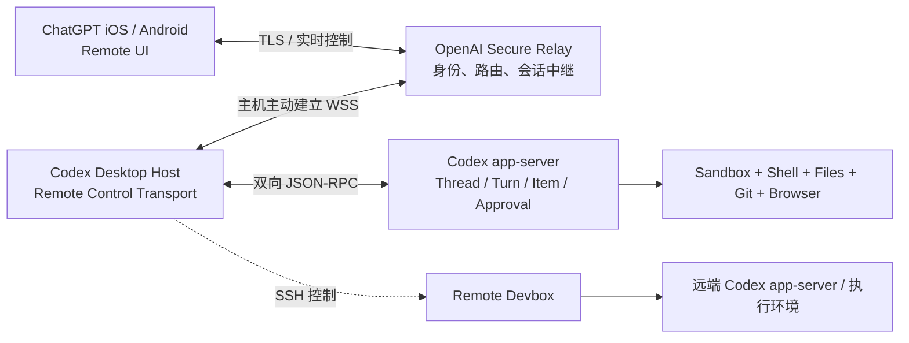
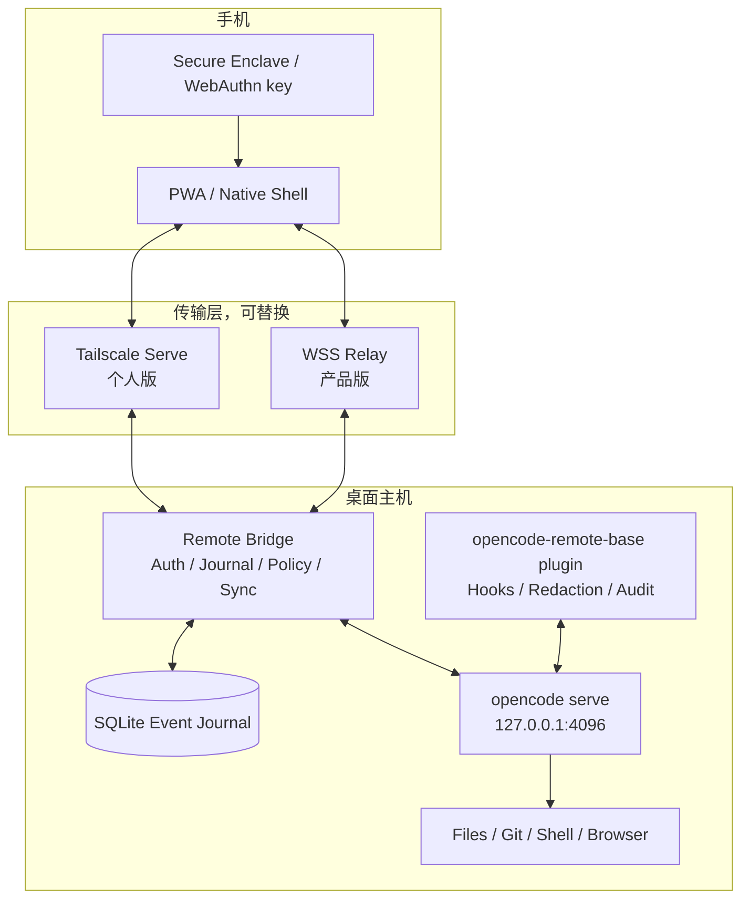

# 从 Codex iOS 远程控制到 OpenCode Remote：架构拆解与 Base Plugin 实现方案

> 面向希望在手机上查看、继续、审批和中断桌面 OpenCode 会话的开发者。研究时间：2026-08-22。

## 先给结论

Codex 的手机远控本质上不是远程桌面，也不是把本机 Agent API 暴露到公网，而是一个“语义级远程控制系统”：模型、文件、凭据、工具和命令仍在桌面主机运行；手机只承载线程列表、增量消息、终端输出、diff、截图、权限审批和控制指令。主机主动连到安全中继，手机也连到中继，因而无需给家庭或公司网络开放入站端口。OpenAI 对外确认了“本地执行、安全中继、实时状态回流”三点；Codex 开源仓库还显示，本地 `app-server` 使用双向 JSON-RPC，支持 thread/turn/item 生命周期与服务端发起的审批请求，并且 Remote Control 会持久化 WebSocket URL、account、server、environment 等 enrollment 信息。([OpenAI Remote Connections](https://developers.openai.com/codex/remote-connections), [OpenAI 产品说明](https://openai.com/index/work-with-codex-from-anywhere/), [Codex app-server README](https://github.com/openai/codex/blob/main/codex-rs/app-server/README.md), [Codex remote-control state](https://github.com/openai/codex/blob/main/codex-rs/state/src/runtime/remote_control.rs))

OpenCode 已经具备构造同类系统的大部分“执行面”：`opencode serve` 是 headless HTTP server，默认只监听 `127.0.0.1:4096`，提供 OpenAPI、会话/消息/diff/abort/permission API，以及 `/event` SSE；插件可以监听 session、message、permission、tool 等事件，并在工具执行前后做策略或审计。([OpenCode Server](https://opencode.ai/docs/server/), [OpenCode Plugins](https://opencode.ai/docs/plugins/))

但推荐方案不是“把所有能力塞进一个 OpenCode 插件”。正确切分是：

1. **薄插件 `opencode-remote-base`**：采集 OpenCode 内部事件、增加策略钩子、做审计和敏感字段净化。
2. **本机 sidecar `opencode-remote-bridge`**：连接 OpenCode loopback API，维护事件日志、设备配对、权限令牌、断线重放和传输连接。
3. **手机端 PWA/原生壳**：线程、消息、diff、terminal、审批和通知 UI。
4. **可替换传输层**：个人 MVP 用 Tailscale Serve；公开产品用主机主动建立的 WSS Relay。

如果只做自用，第一版应选择 **Tailscale + 本机 bridge + PWA**，不要先造云中继。如果准备做多人产品，才实现 **QR 配对 + OIDC/WebAuthn + 出站 WSS relay + 设备级密钥**。

---

## 一、Codex iOS 远控到底控制了什么

### 1. 它控制的是 Agent 会话，不是桌面像素

官方列出的移动能力包括：创建或继续线程、发送后续指令、回答问题、审批命令和其他动作、查看输出/diff/测试结果/终端输出/截图、接收通知、切换主机和线程。文件、凭据、权限、插件与本地工具仍留在运行 Codex 的主机上。([Remote Connections](https://developers.openai.com/codex/remote-connections), [Work with Codex from anywhere](https://openai.com/index/work-with-codex-from-anywhere/))

因此手机收到的是结构化事件和必要的展示数据，而不是持续的视频帧。只有 Computer Use 场景才需要截图等视觉产物。这种设计有三个直接收益：

- 带宽从“屏幕帧率 × 分辨率”降到“事件与增量文本”。
- 手机能原生渲染审批卡片、diff 和线程状态，而不是在小屏幕上点桌面 UI。
- 安全边界仍由桌面端的 sandbox、项目权限、凭据和本地工具决定。

### 2. 可验证的三层架构



这里要区分“事实”和“推断”：

- **官方事实**：使用安全 relay，可信机器无需直接暴露到公网；手机加载主机 live state；本地文件和凭据留在主机；配对由主机展示 QR，双方必须使用同一 ChatGPT account/workspace；主机必须在线、保持唤醒并运行 Codex。([OpenAI 产品说明](https://openai.com/index/work-with-codex-from-anywhere/), [Remote Connections](https://developers.openai.com/codex/remote-connections))
- **开源代码可见事实**：`codex app-server` 是双向 JSON-RPC 2.0 风格接口，正式支持 stdio，实验性支持 WebSocket，还支持 Unix socket；`thread/start`、`turn/start`、`turn/interrupt` 与流式 `item/*` 通知形成完整会话控制面；审批由 server 主动向 client 发 request，client 回 decision。([app-server README](https://github.com/openai/codex/blob/main/codex-rs/app-server/README.md))
- **代码与日志支持的判断**：Remote Control transport 通过 WSS 接入 relay。仓库状态模型持久化 `websocket_url`、`account_id`、`server_id`、`environment_id` 和启用状态；公开 issue 日志出现 `wss://chatgpt.com/backend-api/wham/remote/control/server`。这证明“出站 WebSocket enrollment”存在，但公开资料不足以声称 relay 内部消息封装、端到端加密细节或完整密钥轮换算法。([remote_control.rs](https://github.com/openai/codex/blob/main/codex-rs/state/src/runtime/remote_control.rs), [连接冲突 issue](https://github.com/openai/codex/issues/24024))

### 3. 从 QR 配对到可控主机

公开流程是：桌面端选择 “Set up Codex mobile” → 生成 QR → 手机打开 ChatGPT 完成连接 → 校验同一 account/workspace，并按组织策略完成 MFA、SSO 或 passkey → 桌面端在 Connections 中管理已配对设备。退出 ChatGPT 会关闭 Remote Control，但不会自动删除既有配对。([Remote Connections](https://developers.openai.com/codex/remote-connections))

工程上可以将其抽象为：

```text
host register -> one-time pairing ticket -> mobile claims ticket
-> account/workspace policy check -> bind mobile device to host enrollment
-> issue short-lived connection credentials -> both sides join relay channel
```

QR 不应承载长期 bearer token。它最多承载短期、单次、不可预测的 pairing ticket，以及 relay 地址、host enrollment ID 和可供用户核对的设备指纹。真正的账户登录和设备授权必须在受信任的应用/网页中完成。

### 4. app-server 为什么是关键

桌面端若直接把 TUI 文本镜像给手机，会丢失线程、turn、tool、diff 和审批语义。Codex 的 app-server 则把它们建模为明确的协议对象：

- `Thread`：可持久化、恢复、fork、归档的会话。
- `Turn`：一次用户输入到 Agent 完成/失败/中断的执行周期。
- `Item`：消息增量、命令执行、文件修改、工具调用等可流式呈现对象。
- Server Request：命令、文件修改、权限或用户输入的反向请求。

这也是 OpenCode Remote 应借鉴的重点：**手机端不是终端模拟器，而是 Agent 协议客户端**。

### 5. 第二跳：手机 → 桌面 host → SSH devbox

Codex 将“手机控制主机”和“主机连接远程开发机”分成两条链。Remote Control 解决授权设备控制 Codex host；Remote SSH 由桌面 host 使用 SSH 启动和管理远端 app-server。官方明确建议不要把 app-server transport 直接暴露到共享或公网；跨网络应使用 VPN/mesh network。([Remote Connections](https://developers.openai.com/codex/remote-connections))

这使桌面 host 兼任可信跳板和策略点：手机无需持有 devbox SSH 私钥，远端环境的依赖、凭据与安全策略也不必迁移到手机。

---

## 二、Codex 方案里最值得复用的设计原则

### 原则 1：执行面永远留在可信主机

Relay 只负责身份、路由、连接和有限状态同步；不得拥有项目目录的直接文件系统访问权，也不应保存主机的云 API key、SSH 私钥或模型 provider 凭据。

### 原则 2：只允许主机发起出站连接

家用路由 NAT、公司防火墙和动态 IP 都会让入站连接难以部署。主机主动连 WSS relay 则只需要 443/TLS 出站。更重要的是，本机 Agent API 仍可绑定 loopback。

### 原则 3：审批是一等协议，不是普通消息

审批对象必须包含 session/turn/request 标识、动作类型、命令或路径、工作目录、风险摘要、到期时间以及一次性 nonce。批准操作必须绑定审批对象的规范化哈希：

```text
approval_digest = SHA-256(
  host_id || session_id || turn_id || request_id ||
  action || canonical_resource || cwd || expires_at || nonce
)
```

这样 relay 或客户端就不能把“允许 `git status`”替换成“允许 `git push`”，旧批准也不能重放到新请求。

### 原则 4：先快照，再增量；断线后可重放

手机初次进入线程时获取权威快照，然后订阅带单调序号的增量事件。若收到 `seq=105` 后直接跳到 `108`，客户端必须请求 `resume_after=105`；如果 bridge 已清理该段日志，就重新拉快照。不要把“一条不断开的 SSE/WebSocket”当成可靠性保证。

### 原则 5：远程权限比本地更保守

小屏幕、移动场景与通知跳转更容易误触。远程端默认只提供 Allow once / Reject；“永久允许”“扩大目录范围”“关闭 sandbox”“读取凭据”“安装系统服务”等能力应要求主机本地确认或二次 WebAuthn 验证。

---

## 三、OpenCode 已经提供了哪些积木

### 1. Headless Server

`opencode serve` 暴露 OpenAPI 3.1，并提供项目、session、message、diff、todo、abort、fork、revert 和 permission 等接口；`POST /session/:id/prompt_async` 可异步发起任务，`GET /event` 提供 SSE。默认监听 `127.0.0.1`，这正适合作为 sidecar 的上游，而不是公网入口。HTTP Basic Auth 可以作为本机进程间的额外保护，但不能替代公网设备身份、撤销、审计和抗重放设计。([OpenCode Server](https://opencode.ai/docs/server/))

### 2. 插件事件与策略钩子

插件可监听 `message.*`、`permission.*`、`session.*`、`todo.updated`、`tool.execute.before/after` 等事件，并拿到类型化 SDK client、directory 和 worktree。它还可以在工具执行前检查/修改参数或拒绝操作。([OpenCode Plugins](https://opencode.ai/docs/plugins/))

因此插件最适合做四件事：

- 生成统一的内部事件 envelope，并给敏感字段打标或脱敏。
- 在 `tool.execute.before` 执行远程策略门控。
- 记录本机审计日志与 request → decision → result 关联。
- 向 bridge 汇报插件版本、能力和项目/worktree 上下文。

### 3. 权限系统

OpenCode 权限可以将动作解析为 allow / ask / deny；细粒度规则支持命令、路径、URL 等资源模式，显式 deny 不能被自动批准覆盖。远程控制器应该消费既有 permission request，而不是绕过它直接调用 shell。([OpenCode Permissions](https://opencode.ai/docs/permissions/))

### 4. 需要额外补齐的能力

OpenCode 原生接口并不等于一个完整的 Remote 产品。至少还缺：

- 设备注册、QR 配对、撤销和多主机路由。
- 对移动端安全的 token/key 生命周期。
- 跨断线、跨进程重启的事件 journal 与幂等命令。
- 移动推送通知。
- 远程审批的强绑定和二次验证。
- 对 SSE 版本差异与回归的兼容层。

尤其不要把 `/event` 当成永久可靠日志。2026 年的公开 issue 报告过 SSE 卡死、事件缺失、断流且没有 `Last-Event-ID` 重放等现象；这些是社区复现而非官方保证，但足以说明 bridge 必须自行做重连、对账与 journal。([SSE memory/hang issue](https://github.com/anomalyco/opencode/issues/36739), [SSE reconnect/replay issue](https://github.com/anomalyco/opencode/issues/38458))

---

## 四、推荐的 `opencode-remote-base` 架构



### 组件 A：薄插件

建议包名：`@your-org/opencode-remote-base`。

```ts
import type { Plugin } from "@opencode-ai/plugin"

export const RemoteBasePlugin: Plugin = async (ctx) => ({
  event: async ({ event }) => {
    // 规范化、脱敏、写入本地 bridge socket；禁止直连公网
    await emitLocal(normalize(event, ctx))
  },
  "tool.execute.before": async (input, output) => {
    await enforceHostPolicy({ input, args: output.args, directory: ctx.directory })
  },
  "tool.execute.after": async (input, output) => {
    await appendAuditResult({ input, output })
  },
})
```

插件只连 Unix domain socket 或 loopback bridge，不保存 relay refresh token，不开放 HTTP 端口。即使插件供应链被攻击，其网络与长期凭据权限也应尽可能小。

### 组件 B：Host Bridge

Bridge 是系统核心，建议 Bun/TypeScript 起步，成熟后可迁 Rust/Go。职责包括：

- 管理 `opencode serve` 子进程或连接已存在的 server。
- 从 `/event` 订阅事件，并定期用 session/message/status API 对账。
- 把事件写入 SQLite：`host_id, seq, session_id, type, payload, created_at`。
- 暴露稳定的 Remote Protocol，而不是原样透传 OpenCode API。
- 执行配对、设备撤销、短 token、速率限制、幂等键和审计。
- 把审批 decision 映射回 OpenCode permission endpoint。
- 对路径、命令、diff、terminal output 做脱敏和大小限制。

不建议手机直接调用 OpenCode OpenAPI：那会把上游版本变更、Basic Auth、CORS、SSE 缺陷和高权限接口全部暴露给客户端。

### 组件 C：Remote Protocol

建议 WebSocket 上使用版本化 JSON envelope：

```json
{
  "v": 1,
  "kind": "event",
  "hostId": "host_01",
  "sessionId": "ses_01",
  "seq": 108,
  "eventId": "evt_01J...",
  "type": "approval.requested",
  "occurredAt": "2026-08-22T10:20:30Z",
  "payload": {}
}
```

控制命令统一带：

```json
{
  "commandId": "cmd_01J...",
  "expectedSessionVersion": 17,
  "idempotencyKey": "device_9:cmd_01J...",
  "type": "approval.resolve",
  "payload": {
    "requestId": "perm_123",
    "decision": "once",
    "approvalDigest": "sha256:..."
  }
}
```

Bridge 必须缓存 `idempotencyKey -> result`，避免弱网重试重复发起 prompt、重复批准或重复中断。

### 组件 D：移动端

MVP 用 PWA 即可，优先实现：

1. 主机在线状态与最后心跳。
2. session 列表、状态和未读/待审批计数。
3. 文本/工具/终端输出增量流。
4. diff 查看。
5. 发送 prompt、steer、abort。
6. 审批卡片与风险摘要。
7. push notification 深链到具体 host/session/request。

原生 iOS 壳的真正价值不是 UI，而是 APNs、后台唤醒、Secure Enclave、LocalAuthentication 和更可靠的 device key 存储。如果只是自用，先不要为原生壳支付维护成本。

---

## 五、两种传输方案怎么选

| 方案 | 适用阶段 | 优点 | 代价/限制 |
|---|---|---|---|
| Tailscale Serve + HTTPS | 自用、团队 PoC | 无公网端口；tailnet ACL；部署快；直接反代 loopback bridge | 手机需要 Tailscale；不适合无感面向大众；推送/离线路由仍需补 |
| 自建 WSS Relay | 多用户产品 | 类似 Codex 的设备发现、任意网络可达、多主机路由、统一推送 | 需要完整身份、租户隔离、密钥轮换、可观测性和运维 |
| Cloud tunnel/Zero Trust | 内部团队 | 快速获得出站 tunnel 与身份门禁 | 产品协议仍要自建；供应商绑定；不能把 tunnel 当应用层授权 |
| 直接暴露 `opencode serve` | 不推荐 | 表面最简单 | Basic Auth、CORS、版本变化、API 面过大、缺设备撤销/重放/审计 |

Tailscale Serve 能把仅监听 localhost 的服务通过 tailnet 内 HTTPS 提供给获授权设备，ACL 仍然生效；官方也特别提醒上游应监听 localhost，避免伪造代理注入的身份 header。([Tailscale Serve](https://tailscale.com/docs/features/tailscale-serve))

### 产品版 relay 的最小边界

Relay 只保存：

- 账户/租户与 host/device 的映射。
- 设备公钥、撤销状态、最后在线时间。
- 短期路由状态和加密事件缓存（若需要离线投递）。
- 不包含命令明文的最小审计元数据，或经租户控制的完整审计。

Relay 不应保存：

- provider API key、SSH key、项目文件系统凭据。
- 可长期重放的审批 bearer token。
- 无期限保留的 terminal/diff/message 明文。

---

## 六、身份、配对与审批安全

### 1. 推荐凭据模型

- 用户身份：OIDC；企业版叠加 workspace/tenant policy。
- 浏览器登录：WebAuthn/passkey。WebAuthn 将凭据绑定到 Relying Party origin，并通过公钥签名证明认证器持钥。([W3C WebAuthn Level 3](https://www.w3.org/TR/webauthn-3/))
- 设备身份：每台手机生成不可导出的 P-256/Ed25519 私钥；relay 只存公钥。
- API token：5–10 分钟短期 access token + 可撤销 refresh grant。
- Token 防盗用：可采用 DPoP，把 access/refresh token 绑定到设备公钥；DPoP 的目标正是降低 bearer token 泄露后的重放风险，但它依赖 TLS，且本身不等于完整认证/授权。([RFC 9449](https://www.rfc-editor.org/rfc/rfc9449.html))

### 2. QR 配对

```text
1. Host -> Relay: 创建 2 分钟、单次 pairing ticket
2. Host: 展示 QR(ticket_id, relay_origin, host_fingerprint)
3. Mobile: 已登录用户 claim ticket + 提交 device_pubkey
4. Relay -> Host: 请求用户在桌面核对设备名/指纹（首版建议保留）
5. Host confirm: 建立 host-device grant
6. 双方获得短期 connection credential；ticket 立即失效
```

必须防止：QR 截图转发、ticket 猜测、跨租户 claim、旧 QR 重用、relay 域名替换、同名主机混淆。

### 3. 权限分级

| 等级 | 示例 | 远程策略 |
|---|---|---|
| L0 只读 | 查看线程、日志、diff | 已配对设备可用 |
| L1 可逆控制 | 发 prompt、abort、allow once | 设备解锁后可用，完整审计 |
| L2 高影响 | git push、网络写、外部目录写 | 明确风险卡片 + 生物认证 |
| L3 持久授权 | always allow、改策略、扩大 root | 默认仅主机本地确认 |
| L4 系统级 | full access、安装服务、读取 secrets | 禁止远程或要求独立 break-glass 流程 |

### 4. 不能忽略的威胁

- **混淆代理**：relay 把 A 用户的 approval 投到 B 主机。
- **TOCTOU**：用户看到的命令与最终执行的命令不一致。
- **重放**：弱网重试导致同一批准或 prompt 执行两次。
- **增量注入**：伪造/乱序 event 让手机隐藏真实风险。
- **敏感信息外流**：terminal、diff、截图和 reasoning 中包含 token 或私有代码。
- **手机失窃**：已解锁 session 可批准高风险操作。
- **供应链**：插件更新获取了本不需要的长期 relay 凭据。

对应措施是 tenant/host/session/action 全链路绑定、sequence + event signature/MAC、canonical action digest、幂等键、短 token、设备撤销、内容脱敏、风险分级和本地最终策略兜底。

---

## 七、可靠性设计：移动弱网才是主战场

### 1. 事件一致性

Bridge 为每个 host 维护单调 `seq`，SQLite journal 至少保留最近 24 小时或最近 N 万条。手机存 `last_acked_seq`。重连时：

```text
client -> hello(resume_after=105)
bridge -> replay(106..current)
client -> ack(current)
```

如果 gap 超出 retention：返回 `snapshot_required`，手机重新拉 session snapshot。

### 2. 命令一致性

- `prompt.create`：至少一次传输 + bridge 幂等去重 = 业务上恰好一次。
- `approval.resolve`：只允许 pending → resolved 的单向状态机；重复请求返回原结果。
- `abort`：天然幂等。
- `session.rename`：用 `expectedVersion` 做乐观并发控制。

### 3. 对账循环

插件事件与 SSE 都可能丢。Bridge 每 15–30 秒读取 session status；每次 reconnect 后读取活动 session 的 messages/diff/pending permissions，对照 journal 修复缺口。实时流负责低延迟，OpenAPI 快照负责最终收敛。

### 4. 背压与大对象

- terminal delta 合并为 50–100 ms batch。
- 每条输出设上限，超限落本机 blob，手机按需分页取。
- diff 按文件和 hunk 分页。
- 截图生成缩略图，原图短期签名 URL 拉取。
- 对 inactive session 只推状态摘要，不持续推所有 token delta。

---

## 八、代码组织建议

```text
opencode-remote/
├── packages/
│   ├── plugin/              # @your-org/opencode-remote-base
│   │   ├── src/index.ts
│   │   ├── src/redaction.ts
│   │   └── src/policy.ts
│   ├── bridge/
│   │   ├── src/opencode/    # OpenAPI + SSE adapter
│   │   ├── src/journal/     # SQLite, seq, snapshot
│   │   ├── src/auth/        # pair/device/token/revoke
│   │   ├── src/protocol/    # stable remote protocol
│   │   └── src/transports/  # local, tailscale, relay
│   ├── protocol/            # Zod/JSON Schema + generated clients
│   ├── web/                 # PWA
│   └── relay/               # 第二阶段再实现
├── fixtures/                # 录制的 OpenCode event corpus
├── e2e/                     # reconnect/replay/approval tests
└── docs/
```

协议 schema 与 OpenCode adapter 必须分包：上游 OpenCode API 变化时，只改 adapter，不让手机客户端跟着破坏性升级。

---

## 九、分阶段实施路线

### Phase 0：两天验证

- 启动 `opencode serve` 并录制真实 `/event`。
- 验证 create/list/prompt_async/message/diff/abort/permission reply。
- 建立 event type corpus，确认不同 OpenCode 版本的字段差异。
- 验证插件和 SSE 是否重复发事件，并设计 dedupe key。

**退出标准**：一个本机 CLI client 能完整跟随会话、展示权限请求并批准一次。

### Phase 1：一至两周个人 MVP

- bridge 仅监听 `127.0.0.1`。
- SQLite journal + snapshot/replay。
- PWA：线程、流式消息、diff、prompt、abort、allow once/reject。
- 使用 Tailscale Serve 暴露 bridge；tailnet ACL 只允许自己的手机。
- 禁用远程 always allow 和策略修改。

**退出标准**：切 Wi‑Fi/蜂窝网络、锁屏再打开后不丢事件；重复点击不造成重复 prompt/approval。

### Phase 2：三至六周可分享 Beta

- OIDC + WebAuthn、QR 一次性 pairing ticket、device revoke。
- 出站 WSS relay、多 host 路由、APNs/Web Push。
- DPoP 或等价的设备持钥证明。
- 多租户隔离测试、限流、审计导出、数据保留策略。

**退出标准**：relay 数据库泄漏不能直接伪造已配对设备；跨租户 host/session ID 猜测无效。

### Phase 3：生产化

- 原生 iOS 壳与 Secure Enclave。
- 高风险审批二次生物认证。
- relay 多区域、连接迁移、离线通知、SLO。
- 兼容矩阵、OpenCode adapter contract tests、自动回滚。
- 外部安全审计和威胁建模复审。

---

## 十、最容易走错的五条路

1. **直接把 4096 暴露到公网**：OpenCode Server 是本地可编程接口，不是完整的互联网设备授权产品。
2. **把插件当网络守护进程**：插件生命周期受 OpenCode 控制，崩溃、升级和权限都与远控基础设施耦合。
3. **只转发 SSE，不做 journal**：断线、丢事件和上游回归会让手机状态永久错误。
4. **让 relay 持有主机 secrets**：会把 relay 从路由层升级成最高价值攻击目标。
5. **远程开放永久授权**：移动端最适合短暂介入，不适合无摩擦扩大长期执行权限。

---

## 十一、最终推荐

如果目标是尽快把自己的桌面 OpenCode 放进口袋，推荐组合是：

```text
OpenCode serve(loopback)
  + opencode-remote-base(薄插件)
  + local bridge(SQLite journal + stable protocol)
  + Tailscale Serve
  + PWA
```

这条路线复用了 OpenCode 已有的 session/permission/event 能力，也复用了 Tailscale 的身份网络，工程量最小，且没有公开暴露 Agent API。

如果目标是做一个可分发产品，则沿用同一 bridge/protocol/PWA，只把 transport 换成：

```text
Host outbound WSS
  + multi-tenant relay
  + OIDC/WebAuthn
  + QR one-time pairing
  + device-bound short tokens
  + push notification
```

真正应该“抄”的不是 Codex 的界面，而是它的边界：**本地执行、出站连接、语义事件、审批一等化、凭据不离主机、移动端只做可审计的控制面。**

## 研究限制

- OpenAI 未公开 relay 的完整消息协议、密钥派生、服务端保留策略或是否对所有 payload 做应用层端到端加密。本文不会臆测这些细节。
- Codex 开源仓库能证明 app-server 和 remote-control enrollment 的部分实现，但桌面产品与云 relay 仍包含非公开组件。
- OpenCode v2 SDK/API 正在演进，且公开 issue 显示 SSE 行为曾发生回归；实现前必须锁定目标版本并从其 `/doc` 生成 client/contract tests。
- 本文提供的是架构与安全建议，不等同于完成独立渗透测试或合规认证。

## 主要来源

- OpenAI, [Remote connections – Codex](https://developers.openai.com/codex/remote-connections)，访问于 2026-08-22。
- OpenAI, [Work with Codex from anywhere](https://openai.com/index/work-with-codex-from-anywhere/)，2026-05-14。
- OpenAI Codex repository, [codex-app-server README](https://github.com/openai/codex/blob/main/codex-rs/app-server/README.md)，访问于 2026-08-22。
- OpenAI Codex repository, [remote_control.rs](https://github.com/openai/codex/blob/main/codex-rs/state/src/runtime/remote_control.rs)，访问于 2026-08-22。
- OpenCode, [Server](https://opencode.ai/docs/server/)，访问于 2026-08-22。
- OpenCode, [Plugins](https://opencode.ai/docs/plugins/)，访问于 2026-08-22。
- OpenCode, [Permissions](https://opencode.ai/docs/permissions/)，访问于 2026-08-22。
- Tailscale, [Tailscale Serve](https://tailscale.com/docs/features/tailscale-serve)，验证日期 2026-01-20。
- W3C, [Web Authentication Level 3](https://www.w3.org/TR/webauthn-3/)，Candidate Recommendation Snapshot, 2026-05-26。
- IETF, [RFC 9449: OAuth 2.0 Demonstrating Proof of Possession](https://www.rfc-editor.org/rfc/rfc9449.html)，2023-09。
