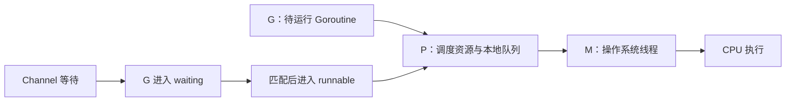
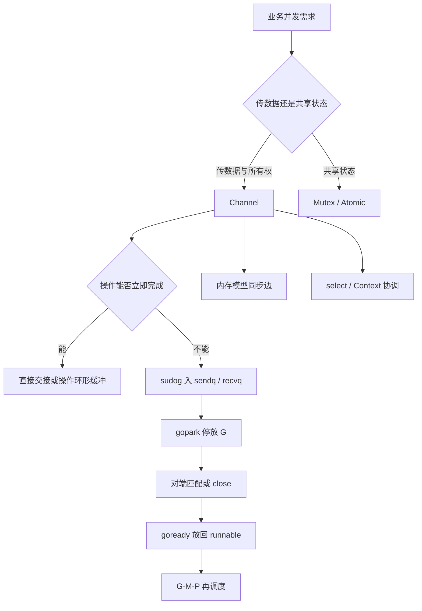

# Go Channel 与 Goroutine：从 CSP 语义到 Runtime 实现

> [!abstract] 核心结论
> Goroutine 解决“如何低成本地并发执行”，Channel 解决“并发单元如何通信与同步”。两者通过 Go Runtime 中的 **G-M-P 调度器、`hchan`、`sudog`、`gopark` 与 `goready`** 连成一个整体。Channel 不是一层普通队列 API，而是通信语义、内存同步与调度机制的交汇点。

> [!important] 三条边界先记住
> 1. **并发不等于并行**：goroutine 可以并发推进，但同一时刻能并行执行多少 Go 代码，仍受 `GOMAXPROCS`、可用 P、CPU 与阻塞行为约束。
> 2. **阻塞不等于占住线程**：普通 Channel 等待会停放 G；但系统调用、cgo、调度器停顿等路径可能涉及 M 的阻塞、解绑或补充。
> 3. **通信不自动消除竞争**：只有被发送、接收、关闭等同步事件建立的 happens-before 链覆盖到的共享内存访问，才获得可见性与顺序保证。

## 1. 为什么 Go 不只提供线程和锁

传统共享内存模型通常是：多个线程访问同一份状态，再用锁约束访问顺序。Go 并未否定锁，而是提供了另一种组织并发的方式：

> **不要通过共享内存来通信；要通过通信来共享内存。**

这句话的重点不是“禁止共享内存”，而是把**所有权转移、同步时机和数据流**显式编码进程序结构。

- **Goroutine**：可被 Go Runtime 调度的轻量执行单元。
- **Channel**：带类型的通信与同步原语。
- **`select`**：多个通信事件之间的协调器。
- **Context**：跨 API 边界传播取消、超时和终止原因。
- **Mutex/Atomic**：适合保护共享状态和实现低层同步。

选择的关键不是“Channel 永远优于锁”，而是状态由谁拥有：

- 如果一个 goroutine 可以独占状态，其他 goroutine 通过消息提出请求，Channel 往往更清晰。
- 如果多个 goroutine 需要频繁读写同一小块状态，`sync.Mutex` 或 `sync/atomic` 通常更直接。

## 2. Goroutine 的本质：被 Runtime 管理的执行上下文

### 2.1 G-M-P 调度模型

Go Runtime 用三类核心对象组织调度：

| 对象 | 含义 | 主要职责 |
|---|---|---|
| **G（Goroutine）** | Go 代码执行上下文 | 保存栈、寄存器状态、等待原因等 |
| **M（Machine）** | 操作系统线程 | 真正执行指令 |
| **P（Processor）** | 执行 Go 代码所需的调度资源 | 持有本地运行队列、分配缓存等 |

运行用户 Go 代码时，需要形成 `G + M + P` 的组合：



Channel 操作无法立即完成时，通常只停放当前 **G**，而不是让整个 OS 线程同步阻塞：

```text
发送或接收暂不可完成
        │
        ▼
构造 sudog，加入 Channel 等待队列
        │
        ▼
gopark：G 从 running 变为 waiting
        │
        ├── 当前 M/P 转去执行其他 G
        │
匹配方到达或 Channel 被关闭
        │
        ▼
goready：G 变为 runnable
        │
        ▼
等待某个 P/M 再次调度
```

因此，“goroutine 阻塞”更准确地说是**逻辑执行单元被停放**，并不等于线程必然被占住。

### 2.2 调度器如何维持吞吐

P 通常优先从自己的本地运行队列取得 G；本地没有工作时，会尝试从全局队列、网络轮询器或其他 P 的队列获取工作。工作窃取（Work Stealing）用于摊平负载，但具体窃取策略属于 Runtime 实现细节，并非语言规范。

还要区分三类“等待”：

| 等待类型 | 典型例子 | Runtime 的主要处理 |
|---|---|---|
| Runtime 可管理等待 | Channel、Mutex、Timer | 停放 G，M/P 可继续调度其他 G |
| 网络等待 | socket I/O | G 进入等待，`netpoll` 在事件就绪后将其恢复为 runnable |
| 阻塞系统调用 | 文件 I/O、部分 syscall、cgo | M 可能阻塞；P 可与该 M 分离并交给其他 M |

现代 Go 还支持协作式检查点与异步抢占，避免纯计算 G 长时间独占执行资源。不过，抢占改善的是调度机会，不替代业务层的取消、超时与背压设计。

### 2.3 动态栈

普通 goroutine 的用户栈通常从约 **2 KiB** 起步，并可按需扩缩。函数入口会检查栈空间，不足时进入 `morestack` 路径迁移栈。

这与 Channel 有直接联系：等待中的 `sudog.elem` 可能指向 goroutine 栈上的发送值或接收目标。Runtime 在栈复制时必须调整这些指针，直接交接数据时也必须协调 GC、写屏障和栈移动。

> [!important]
> “goroutine 很便宜”不等于“免费”。每个泄漏的 goroutine 都会保留栈及其可达对象，还可能长期占用 Channel、Timer、文件描述符或业务资源。

## 3. Channel 的运行时结构：`hchan`

每个 Channel 在当前 Runtime 实现中由 `hchan` 表示。重要字段可抽象为：

| 字段 | 作用 |
|---|---|
| `qcount` | 缓冲区当前元素数量 |
| `dataqsiz` | 环形缓冲区容量 |
| `buf` | 环形缓冲区地址 |
| `sendx` / `recvx` | 下次发送、接收的缓冲索引 |
| `sendq` / `recvq` | 等待发送、接收的 `sudog` 队列 |
| `closed` | 关闭状态 |
| `elemsize` / `elemtype` | 元素大小和类型信息 |
| `lock` | 保护 `hchan` 与关联等待记录的短临界区 |

```text
                  hchan
┌──────────────────────────────────────┐
│ qcount / dataqsiz / closed / lock    │
│                                      │
│ sendq ──▶ sudog ──▶ sudog            │
│ recvq ──▶ sudog ──▶ sudog            │
│                                      │
│ buf: [0][1][2][3]  环形缓冲区         │
│       ▲sendx   ▲recvx                 │
└──────────────────────────────────────┘
```

`hchan.lock` 只保护很短的内部状态变更。Channel 的长期等待不是 goroutine 持锁睡眠，而是通过 **`sudog + gopark`** 完成。

### 3.1 `sudog`：G 与同步对象之间的一次等待关系

`sudog` 不是 goroutine 本身，而是“某个 G 在某个 Channel 上等待一次”的记录。它保存：

- 等待的 G；
- 关联的 Channel；
- 发送源或接收目标 `elem`；
- 等待队列链接；
- 是否来自 `select`；
- 唤醒结果。

一个多 case 阻塞 `select` 会让同一个 G 在多个 Channel 上分别注册 `sudog`；其中一个 case 获胜后，Runtime 清理其他注册。

### 3.2 从语法到 Runtime 的关键入口

理解源码时，可以沿以下主路径阅读：

| 源码入口 | 职责 |
|---|---|
| `makechan` | 分配并初始化 `hchan` 与缓冲区 |
| `chansend` | 发送快路径检查、加锁匹配、入缓冲或阻塞 |
| `chanrecv` | 接收快路径检查、加锁匹配、取缓冲或阻塞 |
| `send` / `recv` | 与已经等待的对端直接完成交接 |
| `closechan` | 标记关闭、清理接收/发送等待队列并唤醒 G |
| `selectgo` | 多 Channel 的轮询、加锁、登记等待与胜出清理 |

Channel 快路径中的无锁检查主要服务于性能：非阻塞失败路径可依据原子读取和状态单调性直接返回；需要修改 Channel 状态或进入阻塞流程的路径，则通常在锁内重新检查并完成提交。源码里的原子读顺序、快照假设和锁策略属于实现证明的一部分，不应单独抽出来当成语言级保证。

### 3.3 关键不变量

Runtime 源码用不变量约束队列和缓冲区状态：

- 除 `select` 让同一个 G 同时登记多个等待关系的特殊情况外，`sendq` 与 `recvq` 至少有一个为空。
- 对有缓冲 Channel，`qcount > 0` 蕴含 `recvq` 为空；已有数据时接收者无需等待。
- 对有缓冲 Channel，`qcount < dataqsiz` 蕴含 `sendq` 为空；尚有空位时发送者无需等待。

`select` 会让等待关系更复杂：同一个 G 可能通过多个 `sudog` 同时挂在不同 Channel 上，所以这些不变量必须结合 `isSelect`、胜出清理和 Channel 锁一起理解。

## 4. 无缓冲 Channel：一次 Rendezvous

```go
ch := make(chan int)
```

无缓冲 Channel 没有存储槽位。发送和接收必须完成一次**会合（Rendezvous）**。

### 4.1 发送方先到

1. 检查 Channel 是否为 nil 或已关闭。
2. `recvq` 没有等待接收者。
3. 当前 G 构造 `sudog`，加入 `sendq`。
4. `gopark` 停放当前 G。
5. 接收者到达后直接复制数据，并通过 `goready` 唤醒发送者。

### 4.2 接收方先到

流程对称：接收者进入 `recvq`，发送者到达后绕过缓冲区，把值直接交给等待接收者。

无缓冲 Channel 的价值不仅是“容量为 0”，更重要的是它建立了双向同步点：发送者与接收者都能知道对方已经参与这次交接。

## 5. 有缓冲 Channel：有限队列与背压

```go
ch := make(chan int, 3)
```

当缓冲未满时，发送方写入 `buf[sendx]`，推进索引并增加 `qcount`；当缓冲非空时，接收方从 `buf[recvx]` 取值并减少 `qcount`。

| 状态 | 发送行为 | 接收行为 |
|---|---|---|
| 缓冲未满 | 写入后返回 | 若有数据则读取 |
| 缓冲已满 | 进入 `sendq` 等待 | 读取并释放容量 |
| 缓冲为空 | 可写入 | 进入 `recvq` 等待 |
| 有等待对端 | 可能直接交接 | 可能直接交接 |

缓冲容量不是随手填写的性能参数，而是系统允许的**积压量、并发配额和延迟预算**：

- 无缓冲：最强背压，生产者必须与消费者同步。
- 小缓冲：吸收短时突发，同时保留速度反馈。
- 大缓冲：可以提高突发容忍度，但也会隐藏慢消费者、扩大内存占用和尾延迟。

### 5.1 满缓冲区遇到等待发送者：不是只做一次出队

一个容易被简化掉的实现细节是：当缓冲区已满、发送者已在 `sendq` 等待时，接收操作可以在同一个锁内完成两件事：

1. 把 `recvx` 指向的旧元素交给当前接收者；
2. 把等待发送者的值写入刚腾出的槽位，再唤醒该发送者。

因此缓冲区可能继续保持“满”状态，只是队首元素被消费、队尾补入新元素。这个路径既保留 FIFO 语义，又避免先减 `qcount`、解锁、再让发送者重新竞争所造成的额外调度。

### 5.2 容量如何从需求推导

可以用近似的排队预算而不是拍脑袋定容量：

```text
所需容量 ≈ 可接受突发期间的生产量 - 同期可消费量
        ≈ (峰值生产速率 - 稳态消费速率) × 可容忍突发时长
```

这只是工程估算，不是稳定性证明。若长期平均生产速率高于消费速率，任何有限 Channel 最终都会满；正确解法应是限流、扩容消费者、丢弃/降级策略或反压，而不是继续增大缓冲。

## 6. `select` 不是简单的 `if-else`

一般多 case `select` 会构造 case 描述并调用 `runtime.selectgo`，而不是简单依源码顺序展开：

1. 生成随机化的轮询顺序，降低固定 case 偏置。
2. 按 Channel 地址建立一致的加锁顺序，避免多 Channel 锁顺序死锁。
3. 扫描可立即执行的 case。
4. 若都不可执行且有 `default`，立即返回。
5. 否则为各 case 创建 `sudog` 并把当前 G 停放。
6. 某个 case 获胜后唤醒 G，并清理其他等待注册。

编译器确实会优化少数特例，例如单个通信 case，或“一个通信 case + default”；但不能据此说所有 `select` 都会被编译成普通 `if-else` 链。

> [!warning]
> `select` 的伪随机选择不等于严格公平；等待队列的当前实现细节也不应被当作语言规范承诺。

关闭 Channel 的接收 case 会持续处于 ready 状态。如果处理一次关闭后仍把它留在循环 `select` 中，它可能反复返回零值并造成忙循环。常见做法是在确认 `ok == false` 后把对应 Channel 变量设为 `nil`，动态禁用该 case。

```go
for left != nil || right != nil {
    select {
    case v, ok := <-left:
        if !ok {
            left = nil
            continue
        }
        consume(v)
    case v, ok := <-right:
        if !ok {
            right = nil
            continue
        }
        consume(v)
    }
}
```

## 7. Channel 与 Go 内存模型

准确理解同步边界，需要区分“开始”“完成”和 **happens-before**。

### 7.1 官方规则

1. 对任意 Channel，发送与对应接收匹配后，**发送 synchronized-before 对应接收完成**。
2. 对无缓冲 Channel，**接收 synchronized-before 对应发送完成**。
3. `close(c)` synchronized-before **因 Channel 已关闭且已无剩余元素而返回零值的接收**。
4. 对容量为 `C` 的 Channel，第 `k` 次接收 synchronized-before 第 `k+C` 次发送完成。

第四条解释了为什么容量 Channel 可实现计数信号量：缓冲满后，后续发送必须等待先前接收释放容量。

### 7.2 常见误解纠正

- ❌ “有缓冲发送 happens-before 接收开始。”
- ✅ 保证对象是对应接收**完成**。

- ❌ “close happens-before 关闭后的所有接收。”
- ✅ 规则针对“因关闭且无剩余元素而返回零值”的接收；缓冲值会先被正常取完。

- ❌ “只要使用 Channel，就不会发生数据竞争。”
- ✅ 只有被 Channel 同步边正确连接的内存访问才受保护；旁路共享变量仍可能竞争。

## 8. nil、打开和关闭状态矩阵

| 操作 | nil Channel | 打开 Channel | 已关闭 Channel |
|---|---|---|---|
| `ch <- v` | 永久阻塞 | 发送或等待 | panic |
| `<-ch` | 永久阻塞 | 接收或等待 | 先读完缓冲，再返回零值 |
| `v, ok := <-ch` | 永久阻塞 | `ok=true` | 缓冲值 `ok=true`；耗尽后 `ok=false` |
| `close(ch)` | panic | 成功一次 | panic |
| `select` 中接收 case | 永不 ready | 依状态竞争 | ready |

把 Channel 变量设为 nil，可以动态禁用某个 `select` 分支；但如果所有分支都为 nil 且没有 `default`，整个 `select` 会永久阻塞。

### 8.1 关闭所有权

`close` 的语义是“以后不会再发送”，因此通常由掌握该事实的发送方或统一协调者执行：

- 不要由任意接收方关闭数据 Channel。
- 多发送者场景应由协调者等待全部发送者退出后统一关闭。
- Channel 不能通过重复关闭实现幂等通知。

### 8.2 `close` 在 Runtime 中做了什么

`closechan` 在锁内把 Channel 标记为关闭，并摘下等待队列中的 `sudog`；随后在锁外把相关 G 置为 runnable：

- 等待接收者被唤醒；缓冲耗尽后接收零值且 `ok=false`。
- 等待发送者也会被唤醒，但恢复执行后以 `panic: send on closed channel` 结束该发送操作。
- 已经进入缓冲区的元素不会被丢弃，接收者仍按顺序取完。

这解释了为什么“关闭是广播通知”只对接收侧成立，却不是一个可以安全唤醒发送者继续工作的协议。若多个发送者可能并发发送，必须先协调它们停止，再关闭数据 Channel。

## 9. 工程设计：防止 Goroutine 泄漏

最典型的泄漏是：下游提前退出，上游永远阻塞在发送。

```go
func produce(ctx context.Context, out chan<- Item) error {
    for {
        item, err := nextItem(ctx)
        if err != nil {
            return err
        }

        select {
        case out <- item:
        case <-ctx.Done():
            return ctx.Err()
        }
    }
}
```

设计检查表：

1. 每个启动的 goroutine 由谁终止？
2. 每个可能阻塞的发送和接收是否有取消路径？
3. 谁负责关闭 Channel，关闭条件是否唯一？
4. 消费者提前返回时，生产者会发生什么？
5. 缓冲容量是根据背压预算设计，还是用来掩盖阻塞？
6. `WithCancel` / `WithTimeout` 创建后是否调用 `cancel()`？
7. 是否把 Channel 当成无限队列使用？

> [!tip] Channel 与 Context 的分工
> Channel 适合传递数据、所有权和完成事件；Context 适合跨调用链传播取消、deadline 与错误原因。Pipeline 的每一层都应监听取消，而不是只在最外层处理。

### 9.1 Pipeline 的关闭顺序

多阶段 Pipeline 应让关闭方向与数据流一致，让取消方向逆着调用链传播：

```text
数据： Source ──▶ Stage A ──▶ Stage B ──▶ Sink
关闭： close(outA) ──▶ drain A ──▶ close(outB) ──▶ drain B
取消： Source ◀──────────── ctx.Done() ◀──────────── Sink
```

每一阶段通常遵守：

1. 只关闭自己创建并拥有的输出 Channel；
2. 输入耗尽或取消后退出；
3. 若有多个 worker 共享一个输出，由协调 goroutine 在 `WaitGroup.Wait()` 后统一关闭；
4. 错误传播与数据传播分开设计，避免某个错误发送因无人接收而再次泄漏。

### 9.2 诊断死锁与泄漏

| 目标 | 常用手段 | 观察重点 |
|---|---|---|
| 判断是否整体死锁 | Runtime 的 `fatal error: all goroutines are asleep - deadlock!` | 仅在 Runtime 判定无可继续执行的 goroutine 时触发，不能覆盖所有业务死锁 |
| 查看 goroutine 堆栈 | `runtime/pprof`、`go tool pprof`、SIGQUIT 堆栈 | 大量 G 是否停在相同 `chan send` / `chan receive` |
| 分析阻塞热点 | Block Profile：`runtime.SetBlockProfileRate` | Channel、锁等阻塞累计时间，而非单纯 goroutine 数量 |
| 检测数据竞争 | `go test -race ./...` | happens-before 链之外的共享内存访问 |
| 防止回归 | `go.uber.org/goleak` 等测试辅助工具 | 测试前后残留 goroutine；需排除 Runtime/依赖的合法后台 G |

> [!warning] 诊断边界
> goroutine 数量稳定不代表没有泄漏：泄漏可能增长缓慢，或 goroutine 数量不变但持有对象持续膨胀。应把堆栈、阻塞画像、堆内存、队列深度和请求延迟放在一起观察。

## 10. 与 Java 并发原语的边界对比

| 维度 | Go Channel | Java `BlockingQueue` | Java `SynchronousQueue` |
|---|---|---|---|
| 定位 | 语言级通信原语 | 集合框架中的阻塞队列 | 零容量交接队列 |
| 等待单元 | Goroutine | Thread / Virtual Thread | Thread / Virtual Thread |
| 零容量交接 | 无缓冲 Channel | 通常不等价 | 最接近 |
| 关闭协议 | 原生 `close`、`ok`、`range` | 接口无 close | 接口无 close |
| 多路等待 | 原生 `select` | 无跨队列原子 select | 无跨队列原子 select |
| 超时/取消 | `select` + Timer/Context | timed API + interruption | timed API + interruption |
| 内存可见性 | Channel 专门同步规则 | Queue 的内存一致性契约 | 继承 `BlockingQueue` 契约 |

对 Java 开发者最有用的认知映射是：

- 无缓冲 Channel ≈ `SynchronousQueue` 的 rendezvous 思路；
- 有缓冲 Channel ≈ 有界 `BlockingQueue`；
- 但 Go Channel 还集成了方向类型、`close`、`range`、`select`、内存模型与 goroutine 调度，因此不能把它简化为“Go 版 BlockingQueue”。

## 11. 选择 Channel、Mutex 还是 Atomic

| 场景 | 优先考虑 |
|---|---|
| 数据流、Pipeline、任务分发、所有权转移 | Channel |
| 保护复杂共享状态、不变量更新 | `sync.Mutex` |
| 单个计数器、状态位、无锁快路径 | `sync/atomic` |
| 限制并发数量 | Channel 信号量或 `x/sync/semaphore` |
| 跨 API 的取消和超时 | `context.Context` |

不要为了“Go 风格”把每个字段访问都包装成 goroutine + Channel；也不要因为锁更熟悉，就把天然的数据流强行改造成共享状态。

## 12. 从设计到实现的完整心智模型



最终可以把 Channel 理解成三层叠加：

1. **语言层**：类型安全的发送、接收、关闭与选择语义。
2. **Runtime 层**：`hchan`、环形缓冲、等待队列、`sudog` 和调度器协作。
3. **内存模型层**：为跨 goroutine 的读写建立可证明的 happens-before 关系。

真正的专家级使用，不是会写 `ch <- v`，而是能回答：**谁拥有数据、谁负责关闭、何时施加背压、阻塞如何取消、同步边保护了哪些内存访问，以及每个 goroutine 最终如何退出。**

## 参考资料

- [The Go Memory Model](https://go.dev/ref/mem)
- [The Go Programming Language Specification](https://go.dev/ref/spec)
- [Go Runtime：chan.go](https://go.dev/src/runtime/chan.go)
- [Go Runtime：select.go](https://go.dev/src/runtime/select.go)
- [Go Compiler：walk/select.go](https://go.dev/src/cmd/compile/internal/walk/select.go)
- [Go Runtime：HACKING](https://go.dev/src/runtime/HACKING)
- [Go Concurrency Patterns: Pipelines and cancellation](https://go.dev/blog/pipelines)
- [Go Concurrency Patterns: Context](https://go.dev/blog/context)
- [context package](https://pkg.go.dev/context)
- [Go Diagnostics](https://go.dev/doc/diagnostics)
- [Data Race Detector](https://go.dev/doc/articles/race_detector)
- [runtime/pprof package](https://pkg.go.dev/runtime/pprof)
- [go.uber.org/goleak](https://pkg.go.dev/go.uber.org/goleak)
- [Java BlockingQueue](https://docs.oracle.com/en/java/javase/26/docs/api/java.base/java/util/concurrent/BlockingQueue.html)
- [Java SynchronousQueue](https://docs.oracle.com/en/java/javase/26/docs/api/java.base/java/util/concurrent/SynchronousQueue.html)

> [!note] 版本边界
> `hchan` 字段、调度细节和编译器优化属于当前 Runtime 实现，未来版本可能变化；语言语义与内存模型应以 Go 官方规范为准。
