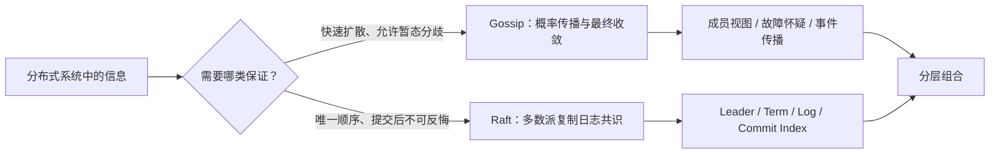
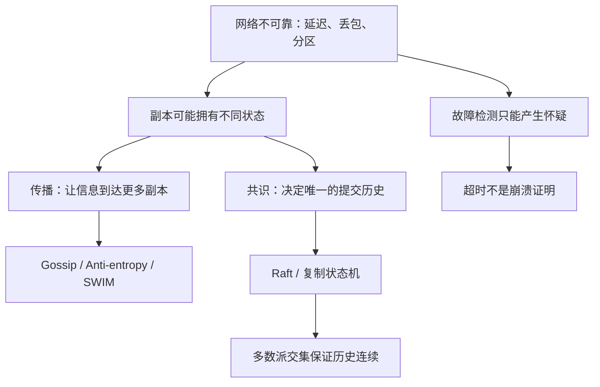
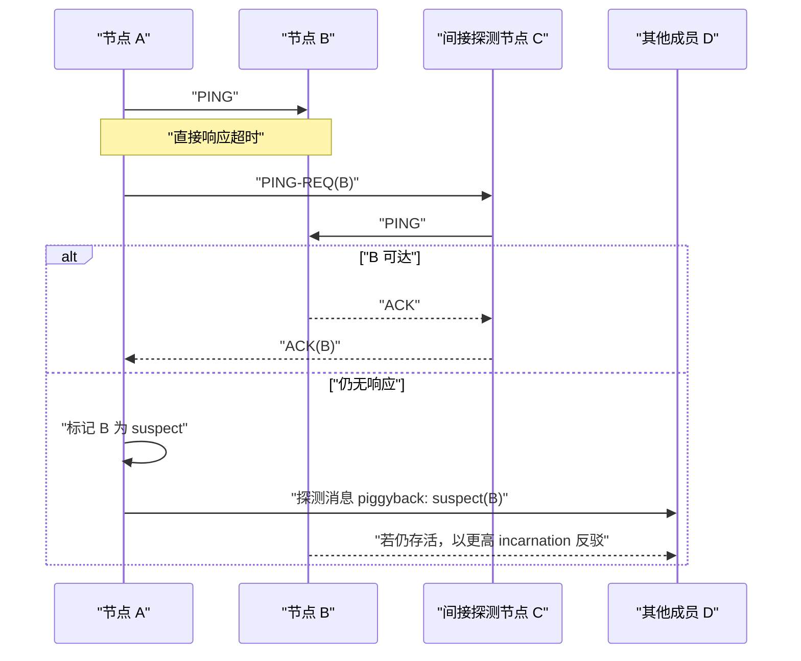
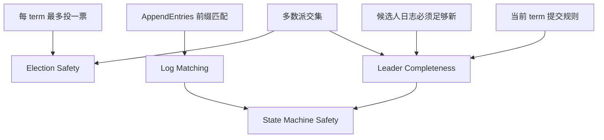

# Gossip 与 Raft：从概率传播到多数派共识的设计哲学与工程实践

> [!abstract] 一句话总览
> **Gossip 用概率传播换规模与韧性，Raft 用多数派约束换确定性与安全。**前者擅长回答“消息怎样扩散、谁可能还活着”，后者擅长回答“哪条命令已经成为不可撤销的共同历史”。它们解决的不是同一个问题，因此常常不是二选一，而是分层组合。

> [!warning] 先纠正三个常见简化
> 1. Gossip 不是一个固定算法，而是一族随机对等传播协议；成员管理、故障检测、反熵修复只是其用途或组成部分。
> 2. “`O(log N)` 轮全网收敛”是理想随机混合模型下的**期望尺度**，不是确定性时限；尾部节点、分区和热点会破坏这一结论。
> 3. Raft 不是“Leader 说了算”，而是“Leader 提议顺序，多数派与日志规则决定能否提交”；它复制的是有序命令日志，不会自动替业务实现 exactly-once 或任意外部副作用的一致性。

## 1. 先从分布式系统的两个根本问题说起

假设有一千个节点。现在分别问两个问题：

1. 节点 A 刚发现节点 B 可能失联，怎样让其余节点尽快知道？
2. 客户端同时提交 `x=1` 与 `x=2`，所有副本最终必须按同一个顺序执行，怎样决定哪个先发生？

第一个问题关心的是**传播与成员视图**。允许不同节点在短时间内看见不同事实，只要系统能快速扩散、最终修复即可。

第二个问题关心的是**决策与历史唯一性**。如果两个节点把同一日志位置提交成不同命令，系统就产生了两段无法同时成立的历史。

这两种问题需要完全不同的工具：

- Gossip 把信息复制到更多地方，降低中心依赖；
- Raft 把可接受的历史限制为一个，拒绝没有多数派授权的进展。



图中的核心不是“弱一致对强一致”这句标签，而是：**两者对错误的容忍方式不同**。Gossip 容忍一段时间的视图差异；Raft 容忍一段时间无法写入，却不容忍已提交历史分叉。

## 2. 最小知识依赖图

理解这两个协议，需要先分清四组概念：



### 2.1 故障检测不等于故障证明

在异步或部分同步网络中，一个节点没有及时回复，至少有四种可能：

- 远端进程崩溃；
- 网络丢包或分区；
- 远端发生长时间 GC、CPU 饥饿或磁盘阻塞；
- 检测者自己过载，根本没有及时处理响应。

因此超时只能产生“我怀疑它失败了”，不能产生数学意义上的“它已经死亡”。这正是 SWIM 引入 `suspect`、间接探测和 incarnation/refutation 的原因。

### 2.2 传播不等于决策

消息被所有人听见，并不表示大家已经对它的含义达成不可撤销的决定；反过来，一条 Raft 日志被多数派提交时，也不要求每个慢节点此刻都已经收到它。

可以把两者压缩为：

```text
传播问题：如何让“知道的人”越来越多？
决策问题：如何让“可提交的答案”最多只有一个？
```

## 3. Gossip：把广播变成概率扩散

### 3.1 最小心智模型

把一条新消息想成流行病：每个已感染节点每轮随机联系固定数量的其他节点。早期大部分联系人还不知道消息，因此感染数量近似倍增：

```text
第 0 轮：1
第 1 轮：2
第 2 轮：4
第 3 轮：8
...
```

这解释了为什么理想条件下覆盖规模呈指数增长、轮数呈 `O(log N)`。但这个类比有明确边界：

- 联系对象不一定均匀随机；
- 节点可能离线或处于网络分区；
- 后期随机联系常常撞到已经知道消息的人，形成长尾；
- 不同实现具有不同的 fanout、抑制、重传和状态合并规则。

所以更严谨的说法是：**在节点大体可达、伙伴采样近似均匀、fanout 固定的随机混合模型下，Gossip 通常以期望 `O(log N)` 轮覆盖绝大多数节点；它不是第 `log N` 轮必然全覆盖的实时保证。**

如果每轮所有 `N` 个节点都联系常数个伙伴，则每轮消息量约为 `O(N)`；持续 `O(log N)` 轮时，粗略系统总量可能达到 `O(N log N)`。piggyback、批处理、去重和停止条件会改变实际成本，不能只背一个复杂度。

### 3.2 Push、Pull 与 Push-Pull

- **Push**：我把自己知道的新状态推给随机伙伴。新消息前期扩散快，但后期容易反复撞到已知节点。
- **Pull**：我向伙伴询问自己缺少的状态。对补齐尾部缺口更有效，但新消息最初只有一个持有者时启动较慢。
- **Push-Pull**：双方交换摘要并补齐差异，通常收敛更快，但单次会话更重。

工程实现常把三者混合，而不是坚持纯粹形式。

## 4. Gossip 的两条经典路径：Anti-entropy 与 Rumor Mongering

### 4.1 反熵：周期性对账，修复状态差异

**反熵 (Anti-entropy)** 的目标不是让一条热点消息跑得最快，而是让副本之间长期存在的差异最终被发现并修复。

典型流程：

1. 周期性随机选择伙伴；
2. 比较版本摘要、Merkle Tree、版本向量或增量游标；
3. 找出缺失或冲突状态；
4. 传输差异并依据确定的冲突规则合并。

它像账务对账：今天漏了一笔不要紧，只要以后仍会公平地相遇，系统就有机会补回来。

> [!important] 最终一致有前提
> Anti-entropy 的“最终”依赖网络最终恢复、节点继续参与、伙伴选择具有公平性、版本信息不会被过早丢弃，并且冲突解决规则正确。永久分区或错误的 Last-Write-Wins 无法被“多跑几轮 Gossip”自动治愈。

### 4.2 谣言传播：让新消息快速扩散

**谣言传播 (Rumor Mongering)** 只追逐“热更新”：节点重复向随机伙伴传播一条新消息；当它连续多次遇到已经知道消息的伙伴，就逐渐停止传播。

它的优势是低延迟和较小的单次负载；代价是总有非零概率遗漏尾部节点。

因此经典组合是：

```text
Rumor Mongering：快速路径，尽快覆盖大多数节点
Anti-entropy：修复路径，低频对账补齐遗漏与长期漂移
```

这体现了一个重要工程哲学：**快速路径追求常见情况，慢速路径守住长期正确性。**

## 5. SWIM：成员管理不是“定时互相 ping”这么简单

**SWIM (Scalable Weakly-consistent Infection-style Process Group Membership Protocol)** 把成员协议拆成两个相对独立的子问题：

1. **故障检测 (Failure Detection)**：随机探测某个成员是否响应；
2. **成员状态传播 (Membership Dissemination)**：把 `join`、`leave`、`suspect`、`failed` 等更新 piggyback 到探测消息上扩散。



### 5.1 为什么需要间接探测

A 到 B 不通，不代表 B 对所有节点都不可达。让 C、D 等节点代为探测，可以降低单链路丢包造成的误判。

### 5.2 为什么先 suspect，不能直接 failed

`suspect` 提供稳定化窗口：如果 B 只是暂时过载，它可以用更高的 **化身编号 (Incarnation Number)** 宣告自己仍存活。只有怀疑在规定窗口内没有被反驳，才升级为失败状态。

### 5.3 为什么检测者的健康也重要

Lifeguard 的关键洞察是：误报不一定来自被检测者，也可能来自检测者自身过载。因而协议应根据本地健康度调整探测与怀疑超时，避免一个“神志不清”的节点污染整个集群视图。

这背后的哲学是：**观察者不是全知的，观察本身也可能出错。**

## 6. Gossip 的不变量、失败模式与安全边界

Gossip 通常没有 Raft 那样“唯一提交日志”的不变量，但工程实现仍必须定义可检验的约束：

- 同一成员的新 incarnation 不得被旧状态覆盖；
- `left`、`failed`、tombstone 的保留时间必须足以阻止旧消息复活；
- 状态合并必须满足幂等性，最好还具备交换性与结合性；
- 消息大小、用户事件和传播队列必须有上限；
- 成员身份必须稳定，重新加入的语义必须明确。

常见失败模式包括：

| 失败模式 | 表象 | 根因 | 典型缓解 |
|---|---|---|---|
| 误判与 flapping | 节点反复 `alive/suspect/failed` | 超时过短、GC、丢包、检测者过载 | 间接探测、稳定化、local health awareness |
| 传播长尾 | 少数节点长期缺状态 | peer sampling 偏斜、分区、队列拥塞 | Push-Pull、低频反熵、传播延迟监控 |
| 旧状态复活 | 已移除节点重新出现 | 版本不足、tombstone 过早回收 | incarnation/版本向量、墓碑保留策略 |
| Gossip 风暴 | 网络和 CPU 被控制消息占满 | 大事件、高 fanout、无批处理与限流 | piggyback、批处理、限流、消息大小上限 |
| 地址不可达 | 节点持续被怀疑 | advertise 地址、NAT 或路由错误 | 启动前连通性检查、真实故障域测试 |
| 投毒与伪造 | 恶意状态污染成员视图 | 缺身份认证、共享密钥滥用 | 加密、认证、授权；高风险场景考虑 BFT |

> [!warning] 加密不等于拜占庭容错
> Gossip 通道加密可以保护机密性和一定程度的来源可信度，但不能自动阻止已获合法凭据的恶意成员发送伪造状态。经典 Gossip/SWIM 与 Raft 主要面向 crash、丢包和灰色故障，不是 Byzantine Fault Tolerance。

## 7. Raft：把共识问题改写成可理解的复制日志

### 7.1 一句话心智模型

Raft 先选出一个受多数派承认的 Leader，由 Leader 为客户端命令安排日志位置；一条日志只有满足提交规则后才成为不可撤销的共同历史。

```text
客户端命令
   ↓
Leader 追加本地日志
   ↓
并行复制给 Followers
   ↓
满足多数派与 term 提交规则
   ↓
推进 commitIndex
   ↓
各节点按日志顺序应用到确定性状态机
```

注意最后一步：Raft 复制的是**命令顺序**。只有当状态机是确定性的、持久化和恢复正确、外部副作用受到约束时，相同命令序列才会产生相同状态。

### 7.2 三种角色与 Term

节点处于 `Follower`、`Candidate`、`Leader` 三种角色之一。**任期 (Term)** 是单调递增的逻辑时代：

- Follower 在选举超时前未收到合法 Leader 心跳，就增加 term 并成为 Candidate；
- Candidate 向其他节点请求投票；
- 获得多数票后成为当前 term 的 Leader；
- 节点看到更高 term，立即承认自己过时并回到 Follower。

Term 的意义不是计时，而是给领导权加上可比较的时代编号，让旧 Leader 无法把过期权威带入新任期。

### 7.3 随机选举超时解决了什么

若所有节点同时超时，可能平票并反复竞争。随机化选举超时让某个节点更可能先发起选举并获得多数票。

它优化的是**活性 (Liveness)**，不是安全性：即使超时配置很差，Raft 仍应避免提交两段冲突历史，只是可能长时间选不出 Leader。

## 8. Raft 日志复制：Leader 也必须服从历史

日志条目至少包含：

- `index`：日志位置；
- `term`：该条目由哪个任期的 Leader 创建；
- `command`：交给状态机执行的命令。

Leader 发送 `AppendEntries(prevLogIndex, prevLogTerm, entries, leaderCommit)`。Follower 只有在自己的前缀与 `prevLogIndex/prevLogTerm` 匹配时才接受后续条目；否则拒绝，Leader 回退匹配点并修复冲突后缀。

### 8.1 最小冲突推演

```text
旧 Leader L1：  [1:a][1:b][2:x]
新 Leader L2：  [1:a][1:b][3:y][3:z]
                         ↑
                 index=3 处 term 不同
```

新 Leader 不会把两条分支“合并”。它寻找最后一个共同前缀，将 Follower 未提交的冲突后缀覆盖为自己的日志。

这不是简单的 Last-Write-Wins，而是由选举资格与已提交日志保护规则保证：新 Leader 必须足够“新”，不能任意丢掉已提交历史。

### 8.2 为什么“复制到多数派”仍需 term 限制

一个旧任期条目即使恰好存在于多数节点，也不能仅靠计数直接宣布提交。Raft 要求 Leader 通过多数复制确认**当前任期**的条目，再借由日志匹配间接提交其之前的条目。这个看似保守的限制堵住了旧日志在后续选举中被覆盖的安全漏洞。

## 9. Raft 的五个核心安全性质

Raft 论文把正确性压缩成五个适合逐一检验的不变量：

1. **选举安全性 (Election Safety)**：一个 term 至多有一个 Leader。
2. **Leader 只追加 (Leader Append-Only)**：Leader 不覆盖或删除自己的日志，只追加新条目。
3. **日志匹配 (Log Matching)**：若两个日志在同一 index 具有同一 term，则此前前缀相同。
4. **Leader 完整性 (Leader Completeness)**：已提交条目会出现在所有更高 term 的 Leader 日志中。
5. **状态机安全性 (State Machine Safety)**：若某节点已在某 index 应用某命令，其他节点不会在该 index 应用不同命令。

这些性质不是由单一规则保证，而是由以下机制共同组成：



### 9.1 多数派交集为何重要

任意两个多数派至少共享一个节点。对于 5 节点集群，多数派为 3；不可能找到两组完全不相交的 3 节点集合。

因此，只要节点遵守“一 term 一票”和日志新旧检查，两个竞争者无法在同一 term 同时获得合法多数派；已提交信息也必然通过多数派交集影响后续选举。

## 10. Raft 在分区时选择什么

假设 5 个节点被切成 `3 + 2`：

- 3 节点一侧可以选主并继续提交；
- 2 节点一侧可能仍保留旧 Leader，但没有多数派，不能提交新条目；
- 分区恢复后，旧 Leader 看到更高 term 会退位，未提交冲突日志被修复。

这说明 Raft 的哲学是：**宁可暂停少数派的进展，也不制造两个都被称为“已提交”的历史。**

如果 5 个节点被切成 `2 + 2 + 1`，没有任何一侧拥有 3 个节点，整个集群停止提交。安全性仍在，可用性下降。

> [!important] Raft 不是 CAP 的魔法逃生门
> 网络分区发生时，Raft 明确选择一致的提交历史而牺牲少数派写可用性。它不能让每个分区都继续接受强一致写入。

## 11. Raft 不会自动替业务解决什么

即使 Raft 实现完全正确，以下问题仍需系统层设计：

- **非确定性状态机**：各副本调用本地时间、随机数或外部 API，可能产生不同结果；
- **重复请求**：命令已提交但响应丢失，客户端重试可能再次扣款；
- **外部副作用**：日志提交与第三方支付、邮件、数据库事务之间没有天然原子性；
- **读一致性**：读取 Leader 本地内存不自动等于线性一致读；
- **应用顺序**：日志已 commit 不代表所有节点都已 apply；
- **磁盘与实现错误**：静默数据损坏、错误 fsync、快照恢复 bug 不在抽象故障模型内；
- **拜占庭节点**：恶意节点伪造消息不是经典 Raft 的目标。

客户端写入通常需要唯一 request ID 与结果缓存，以处理“已提交但响应丢失”；线性一致读应使用 `ReadIndex`、quorum confirmation，或经过严格时钟和租约条件证明的 lease read。

## 12. 成员变更：最危险的不是加节点，而是改变多数派定义

如果旧配置 `C_old` 和新配置 `C_new` 突然切换，不同节点可能依据不同配置各自凑出多数派，产生双 Leader 风险。

Raft 存在两类常见安全方案：

1. **联合共识 (Joint Consensus)**：先进入同时约束旧、新配置的联合阶段，再切换到新配置；
2. **单节点逐次变更**：利用相邻配置必然重叠，每次只改变一个成员，且前一变更提交前不允许下一次变更。

具体实现采用哪一种必须查对应库的版本文档。etcd/raft 等实现具有自己的配置变更契约，不能把所有 Raft 成员变更都描述成同一条消息流程。

生产实践通常是：

```text
加入 learner / non-voter
        ↓
等待日志与快照追平
        ↓
确认延迟和稳定性
        ↓
逐一提升为 voter
        ↓
确认配置已提交和应用后再进行下一次变更
```

## 13. Snapshot：压缩历史，不是随便复制一个目录

日志会无限增长，因此节点把已经提交并应用的前缀压缩为 **快照 (Snapshot)**。快照至少包含：

- 状态机在某一应用点的状态；
- `lastIncludedIndex`；
- `lastIncludedTerm`；
- 实现恢复所需的配置与校验元数据。

落后节点缺少已被 Leader 截断的日志时，通过 `InstallSnapshot` 追赶。

需要同时防范两种极端：

- 快照太频繁：CPU、I/O、暂停和传输成本过高；
- 快照太稀疏：日志过长、重放慢，落后节点更难追平。

“成功生成快照”不等于“灾难恢复可用”。必须测试创建中崩溃、分块传输中断、原子替换失败、校验不一致以及恢复后继续复制。

## 14. Gossip 与 Raft 的机制级对比

| 维度 | Gossip / SWIM | Raft |
|---|---|---|
| 首要问题 | 信息传播、成员视图、故障怀疑 | 复制日志共识、命令全序 |
| 组织方式 | 去中心化、随机对等交互 | Leader 协调、多数派授权 |
| 一致性形态 | 通常最终一致或弱一致，取决于具体协议 | 已提交日志的安全一致 |
| 节点输出 | 局部视图、`suspect/failed`、版本状态 | term、Leader、日志、commit index |
| 分区行为 | 各分区可维持局部视图，恢复后再合并 | 只有多数派分区可以继续提交 |
| 规模成本 | 每成员固定 fanout，适合大成员集合 | 每次提交需多数 voter，通常使用小型 peer set |
| 延迟性质 | 概率传播，有长尾 | 稳态通常一次多数派往返加持久化 |
| 错误代价 | 暂态分歧、误判、状态抖动 | 丢失 quorum 后停止进展 |
| 核心哲学 | 接受局部未知，换取规模与韧性 | 限制合法历史，换取安全与可解释性 |
| 非目标 | 唯一全序、不可撤销提交 | 大规模成员广播、任意业务 exactly-once |

不能简单比较“谁更快”。Gossip 与 Raft 的输出语义不同，就像不能拿 CDN 广播速度与数据库事务提交延迟直接横评。

## 15. 两者如何组合：Consul 的分层思路

Consul 展示了典型分工：

- LAN/WAN Gossip 池承担成员发现、故障检测、服务器发现与事件传播；
- 由少量 Consul server agents 组成的 Raft peer set，复制需要强一致的控制面状态。

因此，数千个 client agent 不必全部进入 Raft quorum。Gossip 提供“谁可能在线、在哪里”的快速软状态；Raft 提供“哪项控制面写入已经权威提交”的硬状态。


### 15.1 最关键的组合边界

安全路径应是：

```text
Gossip observation
  → suspect / health evidence
  → 稳定化与策略检查
  → 提议成员变更
  → 由 Raft 提交配置迁移
```

危险反模式是：

```text
一次 Gossip 超时
  → 立刻删除 Raft voter
```

因为超时只是怀疑。网络分区或灰色故障可能让自动系统错误缩减 peer set，制造 quorum 风险。**软状态可以触发硬决策流程，但不应绕过硬决策协议。**

## 16. 两种协议背后的设计哲学

### 16.1 Gossip：用冗余换去中心化

Gossip 不试图找到一条完美广播树。树虽然消息少，却依赖父子路径；中间节点失败会阻断整棵子树。随机重复传播看似“浪费”，但冗余正是其韧性来源。

其哲学可以总结为：

1. 不要求任何单点掌握完整真相；
2. 接受短暂分歧，把恢复能力内建在持续交互中；
3. 用概率保证和冗余路径换取横向扩展；
4. 快速路径不必完美，必须有慢速修复路径兜底。

### 16.2 Raft：用限制换可证明性

Raft 没有试图让所有节点平等地同时提出顺序，而是把问题分解为 Leader election、log replication 和 safety，并把正常写路径集中到 Leader。

其哲学是：

1. 先把合法状态空间缩小，再谈性能；
2. 用 Leader 把并发排序问题变成单一入口的日志追加；
3. 用多数派交集把上一代历史带入下一代领导权；
4. 分区时宁可不提交，也不允许两个提交历史同时成立；
5. 可理解性不是装饰，而是降低实现和运维错误概率的一种安全机制。

### 16.3 更深一层：软状态与硬状态必须分层

分布式系统中有大量变化快、允许过期的信息：心跳、负载、局部健康、服务位置。把它们全部塞进强共识，代价高且会把抖动放大到控制面。

与此同时，配置版本、所有权、锁、主节点任期、资金变更等状态不能靠“最终大家差不多知道”来决定。

真正成熟的架构通常把两者分层：

- 软状态用 Gossip、缓存、租约和异步传播承载；
- 硬状态用 Raft、事务或其他共识/一致性机制提交；
- 从软到硬之间设置稳定化、策略、幂等和审计边界。

## 17. 生产最佳实践

### 17.1 Gossip / SWIM 检查表

- 区分 `suspect`、`failed` 与主动 `leave`，不要让单次超时触发不可逆动作；
- 依据真实 RTT、丢包、GC、CPU 和队列数据设置 probe、indirect probe 与 suspicion timeout；
- 使用 local health awareness 或同类机制，降低过载检测器产生误报；
- 监控 flapping 次数、suspect 持续时间、成员视图差异、传播 P95/P99、消息队列积压；
- 验证 advertise 地址在所有故障域内真实可路由；
- 约束事件大小、频率、fanout 和 piggyback 队列，防止消息风暴；
- 为 incarnation、版本向量、tombstone、重新加入和同名节点定义明确语义；
- 加密 Gossip 流量并轮换密钥，同时建立独立的身份认证与授权机制；
- 用丢包、延迟、分区、长 GC 和节点重启进行故障注入，而不只测试正常 join/leave。

### 17.2 Raft 检查表

- 生产通常使用 3 或 5 个 voter；增加偶数节点通常不增加相应故障容忍度；
- 把 voter 分散到独立故障域，但要控制多数派之间的 RTT 与 fsync 尾延迟；
- 监控 Leader 变更、选举时长、proposal/commit/apply 延迟、日志差距、fsync 和快照失败；
- 不要用过短 election timeout 掩盖慢盘、GC 或网络抖动，它往往只会制造 Leader churn；
- 新节点先作为 learner 追平，再逐一提升，避免多个落后 voter 同时拖垮 quorum；
- 每次配置变更后确认已提交并应用，再执行下一次变更；
- 客户端使用 request ID、幂等状态机或结果缓存处理未知提交结果；
- 线性一致读采用实现明确支持的 `ReadIndex`、quorum read 或严格 lease read；
- 对 snapshot 进行周期性恢复演练，而不是只检查文件存在；
- 在升级前核对具体实现的 PreVote、CheckQuorum、成员变更和快照兼容语义。

### 17.3 联合系统检查表

- 把 Gossip 事件当证据输入，不当最终权威；
- 对自动扩缩容和 voter 删除设置冷静期、最小存活数和人工/策略门；
- 给软状态与 Raft 配置分别定义版本、审计日志和回滚路径；
- 避免故障反馈环：网络抖动 → Gossip 误判 → 自动删 voter → quorum 丢失；
- 分别压测传播风暴与共识写热点，因为它们的瓶颈完全不同。

## 18. 选型决策：什么时候用谁

| 需求 | 更合适的机制 | 理由 |
|---|---|---|
| 数千节点成员发现 | Gossip/SWIM | 固定 fanout、去中心化、允许弱一致视图 |
| 快速广播缓存失效事件 | Rumor + 反熵兜底 | 常见路径快，遗漏可补 |
| 多副本数据长期修复 | Anti-entropy + 明确冲突模型 | 周期性发现差异并合并 |
| 分布式锁、配置主版本 | Raft 或等价共识 | 需要唯一提交历史 |
| 元数据小集群强一致复制 | Raft | Leader 与多数派模型清晰 |
| 海量工作节点直接进入共识组 | 通常不合适 | 每次提交 fanout 与 quorum 成本过高 |
| 服务发现 + 强一致控制面 | Gossip + Raft 分层 | 软状态扩散与硬状态提交各司其职 |
| 恶意节点环境 | 不能直接套经典二者 | 需要认证、隔离，必要时采用 BFT 设计 |

与 [[一致性哈希-设计理念-算法机制与工程最佳实践-深入讲解]] 类似，这里也要避免“一个算法包打天下”：一致性哈希解决映射稳定性，Gossip 解决传播与弱一致视图，Raft 解决复制日志共识。它们可以同时出现在一个系统中，却守护不同不变量。

## 19. 故障推演：用反例检验理解

### 19.1 场景一：Gossip 已经告诉所有人 B failed，可以直接删掉 B 吗？

不能仅凭这一点。Gossip 的“全体都听到了”只说明传播成功，不说明故障判断绝对正确。还需结合稳定化窗口、健康证据、业务策略，以及删除动作是否属于 Raft 配置等硬状态变更。

### 19.2 场景二：旧 Leader 在少数派继续接受写入，会不会破坏 Raft？

如果实现遵守协议，它可以暂存或拒绝请求，但无法在没有多数派的情况下提交。分区恢复后，未提交冲突日志会被合法新 Leader 修复。若系统在提交前就向客户端承诺成功，则是实现/API 语义错误，不是 Raft 的保证。

### 19.3 场景三：一条日志在 5 节点中的 3 个节点上，是否必然已提交？

不必然。还要考虑是谁在什么 term 复制、Leader 是否依据正确规则推进 commitIndex，以及条目是否属于当前任期。单看磁盘副本计数不足以恢复提交语义。

### 19.4 场景四：Raft commit 后所有节点状态是否立即相同？

不是。commit 表示条目已经成为安全历史；慢 Follower 可能尚未复制或 apply。正确说法是：非故障节点在通信恢复后会追赶，并按同一顺序应用相同命令。

### 19.5 场景五：网络分区恢复后，Gossip 一定自动得到正确业务状态吗？

不一定。它能重新交换状态，但冲突怎样解决取决于版本向量、CRDT、LWW 或应用规则。传播机制不能替代冲突语义。

## 20. 费曼理解检验

### 20.1 白话复述

不使用“最终一致”和“共识”两个词，分别解释 Gossip 与 Raft 在解决什么问题。

参考答案：Gossip 让节点随机转告消息，使信息不依赖一个广播中心也能扩散；Raft 让一群副本只承认一条由多数成员延续下来的命令历史。

### 20.2 逐步推演题

5 个 Raft 节点发生 `2 + 3` 分区，旧 Leader 位于 2 节点一侧：

1. 哪一侧可以提交新日志？
2. 旧 Leader 收到客户端写入时最多能做到什么？
3. 分区恢复后冲突日志如何处理？

### 20.3 边界题

如果一个系统使用 Gossip 把 `x=2` 传播给所有副本，它是否已经实现了 Raft 的语义？为什么“所有人最终收到”仍不等于“唯一顺序已经提交”？

### 20.4 迁移应用题

设计一个 10,000 工作节点、5 控制节点的调度系统：

- 哪些信息应该通过 Gossip 传播？
- 哪些状态应该进入 Raft？
- 从节点健康变化到移除控制节点，中间需要哪些稳定化与授权步骤？

## 21. 最后压缩成十条

1. Gossip 是协议族，不是一个固定成员管理算法。
2. `O(log N)` 是理想随机模型下的期望传播轮数，不是确定性全覆盖 SLA。
3. Rumor Mongering 负责快，Anti-entropy 负责补；两者组合比二选一更常见。
4. SWIM 把故障检测与成员状态传播分离，超时只产生怀疑。
5. Gossip 的核心交易是：以冗余、概率和暂态分歧换规模、去中心化与恢复力。
6. Raft 复制有序命令日志，不直接保证任意业务副作用或 exactly-once。
7. Leader 只负责提出顺序；多数派交集、term 和日志规则共同守护提交安全。
8. Raft 在分区时宁可停止少数派写入，也不产生两个已提交历史。
9. Gossip 软状态不能直接绕过 Raft 配置协议变成硬决策。
10. 最佳架构不是到处强一致或到处最终一致，而是让每类状态采用与其风险匹配的协议。

## 参考资料与证据边界

### 原始论文与权威综述

1. Demers et al., [Epidemic Algorithms for Replicated Database Maintenance](https://www1.icsi.berkeley.edu/pubs/networking/ICSI_epidemicalgorithmsfor87.pdf), PODC 1987 / Xerox CSL report 1989.
2. Das, Gupta, Motivala, [SWIM: Scalable Weakly-consistent Infection-style Process Group Membership Protocol](https://www.cs.cornell.edu/projects/Quicksilver/public_pdfs/SWIM.pdf), DSN 2002.
3. Montresor, [Gossip and Epidemic Protocols](http://disi.unitn.it/~montreso/ds/papers/montresor17.pdf), 2017.
4. Ongaro, Ousterhout, [In Search of an Understandable Consensus Algorithm](https://raft.github.io/raft.pdf), extended version, 2014.
5. [The Raft Consensus Algorithm](https://raft.github.io/)：论文、博士论文、TLA+ 与实现资料索引。
6. Lifeguard authors, [Lifeguard: Local Health Awareness for More Accurate Failure Detection](https://arxiv.org/pdf/1707.00788), 2017.

### 官方工程资料

7. HashiCorp Consul, [Gossip protocol](https://developer.hashicorp.com/consul/docs/concept/gossip).
8. HashiCorp Consul, [Consensus protocol](https://developer.hashicorp.com/consul/docs/concept/consensus).
9. HashiCorp Consul, [Reference architecture](https://developer.hashicorp.com/consul/tutorials/production-vms/reference-architecture).
10. [etcd-io/raft](https://github.com/etcd-io/raft)：主流 Raft 库的实现契约与配置变更说明。
11. HashiCorp Vault, [Raft integrated storage internals](https://developer.hashicorp.com/vault/docs/internals/integrated-storage).

### 证据边界

- 研究与官方资料核对截止 **2026-08-17**。
- 协议原理主要依据原始论文；Consul 的组合方式与生产建议依据 HashiCorp 官方资料。
- `O(log N)`、误报率和延迟均依赖网络、fanout、负载、持久化和具体实现，本文不把理论期望当成生产 SLA。
- Raft 成员变更、PreVote、CheckQuorum、lease read 与 snapshot 格式存在实现差异；落地时必须核对目标库及版本。
- 本文覆盖 crash、网络分区与灰色故障模型，不把经典 Gossip/SWIM 或 Raft 表述为 Byzantine Fault Tolerance。
