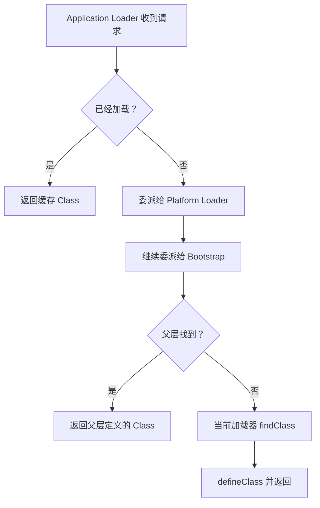
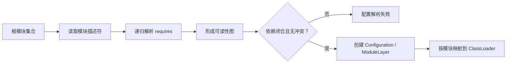
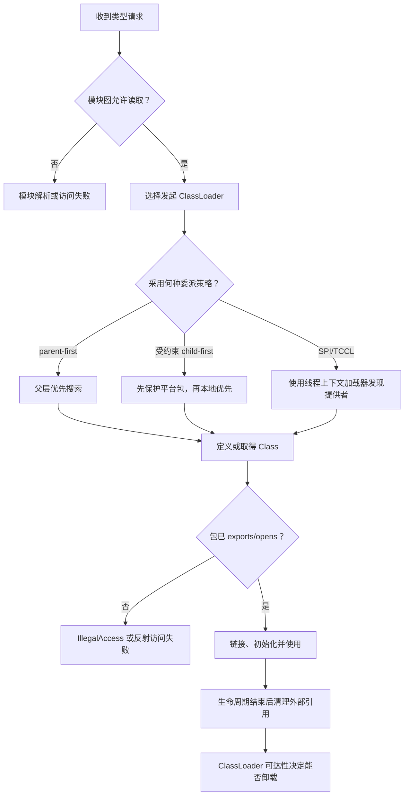

# JVM 类加载机制与 JDK 9–17 演进深度解析

> [!abstract] 核心结论
> 类加载器不只是“从哪里读取 `.class` 文件”的工具，而是 JVM 中用于建立**类型身份、依赖可见性、隔离边界和生命周期边界**的基础设施。双亲委派只是默认搜索策略；Tomcat、SPI、JPMS 与 Hidden Classes 分别从隔离、反向发现、强封装和动态生成等方向扩展了这套模型。

本文由 [[work-docs/daily-reports/2026-07-21#09:00 每日算法知识点 — JVM 深度 类加载机制（双亲委派模型与打破双亲委派）|2026-07-21 每日 JVM 知识点]] 延伸而来，重点补全设计原理、JDK 9–17 演进、生产故障与最佳实践。

> [!info] 阅读主线：四层边界
> 1. **类型层**：名称、定义加载器、运行时包共同决定“它是谁”；
> 2. **搜索层**：委派策略决定“去哪里找、由谁定义”；
> 3. **模块层**：readability、exports、opens 决定“找到后能否访问”；
> 4. **生命周期层**：加载器可达性决定“一组类何时能够卸载”。
>
> 后文的 Tomcat、SPI、JPMS、Hidden Classes、CDS 和热部署，都是在这四层约束上解决不同矛盾，而不是彼此孤立的特性清单。

---

## 1. 先校正几个常见的简化说法

原知识点的主线是正确的，但深入理解时需要增加几个边界：

1. **双亲委派不是 JVM 规范强制规定的唯一算法。** `ClassLoader` 的默认实现通常先委派给父加载器，但用户自定义加载器可以采用其他策略。
2. **“父加载器”不是 Java 对象继承意义上的父类。** 它是一条加载请求的委派关系。
3. **一个类的身份不只由全限定名决定。** JVM 规范使用“二进制名称 + 定义类加载器”标识运行时类型。
4. **Tomcat 不是无条件 child-first。** 它先保护 Java SE 与容器规范 API，再让 Web 应用私有类优先，属于受约束的局部反转。
5. **JPMS 没有取代 ClassLoader。** ClassLoader 决定“由谁定义、从哪里找到”，模块系统进一步决定“模块是否可读、包是否导出或开放”。
6. **JDBC/SPI 的解释不能停留在‘Bootstrap 看不到应用类’。** 更准确的矛盾是：平台或框架代码需要发现由下层应用提供的实现，而普通父优先可见性只天然支持子加载器引用父加载器定义的类型。

> [!warning] 版本语境
> Java 8 常用 `Bootstrap → Extension → Application` 描述内置加载器；JDK 9 模块化后应使用 `Bootstrap → Platform → System/Application`。`rt.jar` 和扩展目录机制也已退出历史舞台。

## 2. 类加载真正解决的四个问题

### 2.1 字节从哪里来

`.class` 可以来自目录、JAR、网络、数据库、加密容器，甚至运行时生成的字节数组。`ClassLoader#defineClass` 把合规字节转换为 JVM 中的 `Class` 对象。

### 2.2 这个类到底是谁

运行时类型身份可以近似写成：

```text
Runtime Type Identity = Binary Name + Defining ClassLoader
```

因此，两个加载器各自定义的 `com.example.User` 即使字节完全相同，JVM 仍把它们视为两个不同类型：

```text
Loader-A ──define──> com.example.User  ┐
                                      ├── 名称相同，类型不同
Loader-B ──define──> com.example.User  ┘
```

这解释了最反直觉的错误：

```text
ClassCastException: com.example.User cannot be cast to com.example.User
```

问题不在类名，而在类型身份两侧的定义加载器不同。

#### 2.2.1 定义加载器与发起加载器

这里还要区分两个容易混淆的角色：

- **定义加载器（Defining Loader）**：真正调用 `defineClass`、把字节定义为运行时类型的加载器；它参与类型身份。
- **发起加载器（Initiating Loader）**：曾经发起某个类加载请求，并最终获得该 `Class` 的加载器；它可能只是把请求委派给父加载器。

例如 Application ClassLoader 请求 `java.lang.String`，最终由 Bootstrap 定义。前者是发起加载器，后者是定义加载器。这个区分解释了为何“请求从某个加载器开始”不等于“类型由它定义”，也解释了 JVM 为什么需要维护加载约束，避免同一符号在调用链两端解析成不兼容的类型。

#### 2.2.2 包也具有运行时身份

在 JVM 语义中，运行时包不只是包名，还与定义它的加载器相关。两个加载器分别定义的 `com.example` 并不是同一个运行时包。因此，Java 的包级访问权限不能跨加载器共享；即使源代码包名相同，也可能出现访问失败。

这条规则维护了隔离边界：否则插件只要伪造相同包名，就可能访问另一个加载器中本应受包级权限保护的实现。

### 2.3 谁能看见谁

默认委派形成一种方向性可见关系：子加载器通常能通过委派使用父加载器定义的类，父加载器却不知道子加载器私有仓库里有什么。

### 2.4 何时能够卸载

类通常不能单独卸载；只有其**定义类加载器不可达**，并且该加载器定义的类和实例也不再被 GC Roots 引用时，整组元数据才有机会被回收。类加载器因此也是插件、Web 应用和热部署单元的生命周期容器。

## 3. 加载、链接与初始化不是一回事

根据 JVMS 第 5 章，一个类进入可执行状态至少经历以下过程：


### 3.1 加载（Loading）

找到类的二进制表示，创建 JVM 内部表示和 `Class` 对象。加载阶段已经确定该类的定义加载器。

### 3.2 验证（Verification）

检查 class 文件格式、字节码结构和类型安全，防止非法字节码破坏 JVM 不变量。

### 3.3 准备（Preparation）

为静态字段分配存储并设置默认值。这里通常还没有执行 Java 源码中的显式赋值表达式。

### 3.4 解析（Resolution）

将运行时常量池中的符号引用转换为直接引用。解析可以按实现和使用时机延后，不必机械理解成一次完成。

### 3.5 初始化（Initialization）

执行类或接口初始化方法 `<clinit>`，即静态字段显式赋值和静态代码块汇总后的逻辑。

> [!tip] `loadClass` 与 `Class.forName`
> `ClassLoader#loadClass` 通常只负责加载，默认不主动初始化；`Class.forName(String)` 默认会触发初始化。需要精确控制时使用带 `initialize` 参数的重载，不要依赖模糊印象。

### 3.6 符号引用为什么允许延迟解析

class 文件在编译时并不知道目标对象最终位于哪个内存地址，因此常量池保存的是类名、字段名、方法名和描述符等**符号引用（Symbolic Reference）**。解析阶段再把符号引用连接到具体运行时结构。

允许延迟解析有三个收益：

1. **按需付费**：从未执行到的代码路径不必提前解析全部依赖；
2. **动态绑定**：实际定义由运行时的加载器命名空间与模块配置决定；
3. **错误定位到使用点**：某些缺失依赖或二进制不兼容可以在相关符号首次主动使用时暴露。

代价是链接错误可能比应用启动更晚出现。因此生产系统不能只把“进程成功启动”当成依赖完整性的证明，还要让关键业务路径在测试或预热阶段真正执行。

### 3.7 初始化锁与失败记忆

JVM 必须保证一个类的初始化在并发环境中只执行一次。可以把初始化状态简化为：

```text
未初始化 → 正在初始化 → 初始化完成
                    └→ 初始化失败
```

当线程 A 执行 `<clinit>` 时，其他需要主动使用该类的线程必须等待；同一线程递归请求正在由自己初始化的类不会再次执行 `<clinit>`。如果初始化抛出异常，JVM 会记住失败状态：首次通常看到 `ExceptionInInitializerError`，后续主动使用往往得到 `NoClassDefFoundError: Could not initialize class ...`。

这揭示了一个工程原则：**静态初始化应短小、确定、少阻塞、少外部 I/O**。把网络调用、复杂配置解析或线程启动放进静态初始化，会把一个普通失败放大成全局类初始化锁等待，且失败后无法靠普通重试恢复。

### 3.8 初始化触发与“不触发”边界

常见主动使用包括：创建实例、调用静态方法、读写非编译期常量静态字段、反射初始化，以及初始化入口类。几个常见反例：

- 通过子类引用父类声明的静态字段，通常只初始化实际声明该字段的父类；
- 读取编译期常量可能在调用方编译时被内联，不触发声明类初始化；
- 创建某类型的数组不会初始化数组元素类型。

这些边界不是语言技巧，而是“仅在真正需要类级副作用时执行 `<clinit>`”的按需原则。

## 4. 双亲委派：真正维护的是不变量

典型加载路径如下：



它维护四个关键不变量：

- **核心类型一致性**：应用不能轻易用自己的 `java.lang.Object` 替换平台定义。
- **共享 API 身份稳定**：公共接口由共同父加载器定义，跨插件传递对象时类型一致。
- **搜索结果可预测**：父层公共依赖优先，减少同名类的随机覆盖。
- **安全边界集中**：基础类和受保护包由可信加载路径提供。

代价也很明确：

- 父加载器天然看不到子加载器的私有实现；
- 父层存在某依赖时，子层可能无法选择自己的版本；
- 一旦把过多应用库放入公共父加载器，隔离和热卸载都会失效。

### 4.1 加载约束：为什么“各自能找到类”仍然不够

当两个由不同加载器定义的类通过方法参数、返回值、字段类型或继承关系发生交互时，JVM 必须确保双方对某个符号类型的解析结果兼容。否则调用方认为参数是 Loader-A 的 `Api`，被调用方却把它理解成 Loader-B 的同名 `Api`，字节码验证与方法分派的类型安全就会崩溃。

可以把约束理解为：

```text
若调用边界要求两侧的符号 T 是同一种类型，
则各自加载器解析 T 后必须得到同一个 Class 身份。
```

违反约束可能产生 `LinkageError` 或 loader constraint violation。它不是“类找不到”，而是**类都找到了，但找到的不是同一个类型**。

这也是“共享接口必须放在共同父层”的底层理由：父层不是为了节省一个 JAR，而是为了让交互双方对 API 类型收敛到同一份定义。

### 4.2 并发加载与每类加载锁

类加载并非天然串行。多个线程可能同时请求不同类，甚至形成 A 加载时请求 B、B 加载时又请求 A 的环路。`ClassLoader` 的默认实现通过加载锁、`findLoadedClass` 和已加载缓存防止重复定义；支持并行加载的自定义加载器还需要正确注册为 parallel-capable。

因此重写 `loadClass` 的风险远高于重写 `findClass`：开发者不仅改变搜索顺序，还接管了缓存检查、锁粒度、委派递归、解析时机和重复定义防护。最佳实践是把“如何取得字节”限制在 `findClass`，只有真正需要改变委派策略时才接管 `loadClass`。

## 5. Tomcat：受约束的 child-first

Tomcat 为每个 Web 应用创建独立的 Webapp ClassLoader，使 `/WEB-INF/classes` 与 `/WEB-INF/lib/*.jar` 只对该应用可见。默认查找顺序可以概括为：

```text
Bootstrap / Java SE
        ↓
WebApp 本地 classes 与 lib
        ↓
System
        ↓
Common
```

这不是“彻底打破双亲委派”，而是有三层设计约束：

1. Java SE 基础类不能由 Web 应用覆盖；
2. Tomcat 实现的 Jakarta EE API（Servlet、JSP、EL、WebSocket 等）保持容器优先；
3. 普通应用类和应用私有库本地优先，从而允许不同 Web 应用使用不同版本。

### 为什么这样设计

如果所有应用都父优先，公共层的一份旧版库可能压制应用自己的新版库；如果所有内容都无条件子优先，应用又可能伪造平台类或容器 API，破坏类型契约。因此正确策略不是“parent-first 和 child-first 二选一”，而是按包和责任建立**委派白名单/隔离规则**。

> [!example] 共享 API、隔离实现
> 插件接口应由共同父加载器定义；每个插件的实现和私有依赖由各自子加载器定义。否则即使插件实现了同名接口，主程序也可能因接口由不同加载器定义而无法转换。

## 6. SPI 与 TCCL：解决反向发现

### 6.1 矛盾

传统依赖方向是：

```text
应用实现（子） ──依赖──> 平台 API（父）
```

SPI 要做的却是：

```text
平台/框架 API（父） ──发现──> 应用提供者（子）
```

父加载器无法沿普通委派链向下搜索，所以需要一个由调用线程携带的“候选加载器”——**线程上下文类加载器（Thread Context Class Loader, TCCL）**。

### 6.2 `ServiceLoader` 的两种部署模型

- **Class Path**：提供者通过 `META-INF/services/<服务接口全名>` 注册。
- **Module Path**：消费者在 `module-info.java` 中声明 `uses`，提供者声明 `provides ... with ...`。

```java
module codec.consumer {
    requires codec.api;
    uses com.example.CodecFactory;
}

module codec.png {
    requires codec.api;
    provides com.example.CodecFactory
        with com.example.png.PngCodecFactory;
}
```

模块化 SPI 的核心收益不是语法变化，而是：服务依赖进入模块图，提供者实现包可以不 `exports`，从而把实现细节封装起来。

#### 6.2.1 `ServiceLoader` 的实际发现链

`ServiceLoader` 可以显式接收 ClassLoader；常用的 `ServiceLoader.load(service)` 则使用当前线程的 TCCL。发现过程可以抽象为：

```text
服务接口 Class
   + 候选 ClassLoader / ModuleLayer
   ↓
读取 META-INF/services 或模块 provides 声明
   ↓
检查提供者是否可见、可赋值、可实例化
   ↓
按需产生 Provider / 实例
```

这里存在三个必须同时成立的不变量：

1. 服务接口对消费者和提供者具有同一个运行时类型身份；
2. 执行发现的加载器或模块层能够看见提供者；
3. 提供者确实可赋值给服务接口，而不是另一加载器定义的同名接口。

因此 SPI 故障不能只检查配置文件是否存在。还应打印服务接口、提供者类各自的 `ClassLoader` 与 `Module`，确认发现路径和类型身份一致。

`ServiceLoader` 具有惰性发现与内部缓存语义，不应假设每次遍历都重新扫描全部来源。动态增删提供者时要明确调用 `reload()` 的时机，并处理提供者构造或工厂方法失败；在并发共享场景下也要遵守其线程安全边界，而不是把单个实例随意当作全局并发注册表。

### 6.3 TCCL 最佳实践

框架临时切换 TCCL 时必须恢复：

```java
Thread thread = Thread.currentThread();
ClassLoader previous = thread.getContextClassLoader();
try {
    thread.setContextClassLoader(pluginLoader);
    // 执行依赖插件可见性的发现或回调
} finally {
    thread.setContextClassLoader(previous);
}
```

不恢复会让长期存活的线程池线程持有 WebApp/插件加载器，阻止类卸载。

> [!note] JDBC 的准确理解
> JDBC 驱动发现是“平台 API 发现应用提供者”的典型案例，但不要把所有版本都简化成“`DriverManager` 必然由 Bootstrap 从 `rt.jar` 加载”。JDK 9 后运行时镜像和模块归属已经变化。稳定不变的是可见性矛盾，以及 SPI/TCCL 为实现发现提供的桥梁。

## 7. JDK 9：模块系统重塑类加载边界

JEP 261 引入 Java 平台模块系统（Java Platform Module System, JPMS），目标是**可靠配置（Reliable Configuration）**和**强封装（Strong Encapsulation）**。

### 7.1 Class Path 与 Module Path 的本质区别

- Class Path 查找单个类型和资源，常出现“谁先出现就用谁”。
- Module Path 查找完整模块；模块解析构建依赖图，并检查模块是否存在、依赖是否闭合。
- JPMS **不负责通用依赖版本选择**。同名模块冲突仍应由 Maven/Gradle 等构建工具解决。

### 7.2 两道门：可读性与可访问性

模块 A 使用模块 B 中的类型，至少要通过：

1. **Readability**：A 是否 `requires B`，即 A 是否读取 B；
2. **Accessibility**：B 是否向 A `exports` 对应包。

反射还涉及：

- `exports`：允许其他模块在普通编译和运行访问中使用公开类型；
- `opens`：允许深反射访问包内成员；
- `open module`：把模块中的包整体开放给反射，便利但封装最弱。

这说明“类已经被加载”不等于“调用方有权访问”。

### 7.3 `jrt:/` 与运行时镜像

JDK 9 采用模块化运行时镜像，`rt.jar`、`tools.jar` 和扩展目录机制不再是运行时组织基础。JDK 类资源可通过 `jrt:/` 文件系统访问。工程上应避免依赖 JDK 8 的物理目录和 JAR 布局。

### 7.4 Platform ClassLoader

Extension ClassLoader 被 Platform ClassLoader 取代。JDK 17 的内置层次通常描述为：

```text
Bootstrap (API 中常表现为 null)
    ↑
Platform ClassLoader
    ↑
System / Application ClassLoader
```

模块关系可能要求更灵活的委派，因此它不应被理解为永远只沿一棵刚性的树查找。

### 7.5 模块解析：先构图，再加载单个类

JPMS 的重要变化，是把一部分错误从“运行到某条路径才发现类缺失”前移到模块层解析阶段。模块解析的主线是：



关键设计理念是**可靠配置优先于偶然命中**：Class Path 主要回答“搜索路径上有没有这个类”，模块解析先回答“完整依赖图是否合法”，然后才让类加载器按已建立的模块—加载器映射查找类型。

但模块图并不会扫描和预加载模块中的全部类。单个类仍按需加载、链接和初始化。因此 JPMS 将配置错误前移，却没有取消 JVM 的惰性类加载。

### 7.6 命名模块、自动模块与未命名模块

迁移期常见三类世界：

- **命名模块（Named Module）**：具有显式或派生的模块名，受 readability、exports、opens 约束；
- **自动模块（Automatic Module）**：普通 JAR 放入 Module Path 后形成的过渡模块，通常导出所有包并读取其他模块；
- **未命名模块（Unnamed Module）**：Class Path 上的代码所属模块，为兼容传统应用而保留宽松可见性。

自动模块降低迁移门槛，却不是理想终态：模块名可能受 JAR 名影响，边界过宽，依赖也不够精确。工程上应把它视为“迁移适配层”，逐步替换为稳定的显式模块描述符。

### 7.7 Split Package 为什么被限制

若多个命名模块同时包含同名包，模块系统难以给包建立唯一、稳定的封装与访问语义。JPMS 因此限制 split package。其设计目标不是形式洁癖，而是维护：

- 一个包的访问控制由明确模块所有；
- 反射开放、资源封装和服务实现不会因来源歧义而漂移；
- 配置阶段能发现错误，而不是依赖 Class Path 顺序碰运气。

迁移时若遇到 split package，应重构包归属、合并模块或升级依赖，而不是试图用搜索顺序掩盖冲突。

## 8. JDK 9–17 值得重点掌握的演进

| 版本 | 关键变化 | 对类加载/框架的意义 |
|---|---|---|
| JDK 9 | JPMS、模块路径、`jlink`、运行时镜像 | 从“找到类”升级为“解析模块图并实施封装” |
| JDK 9 | `MethodHandles.Lookup#defineClass` | 动态框架可在受控访问上下文中定义类，减少依赖 JDK 内部 API |
| JDK 10 | Application CDS（JEP 310） | 应用类可进入共享归档，改善启动和多进程内存占用 |
| JDK 12/13 | 默认 CDS 归档、动态 CDS（JEP 341/350） | CDS 更易默认启用，并可在应用退出时动态生成归档 |
| JDK 15 | Hidden Classes（JEP 371） | 动态生成类可成为不可按名称发现、可独立卸载的实现细节 |
| JDK 16 | 默认强封装（JEP 396） | 非法反射访问默认拒绝，旧框架迁移压力显著增加 |
| JDK 17 | JDK 内部 API 强封装（JEP 403） | `--illegal-access` 不再能一键恢复宽松访问，只能定点 `--add-opens` |

### 8.1 `Lookup#defineClass` 的理念

过去框架常通过反射或 `Unsafe` 调用受保护的 `ClassLoader#defineClass`。JDK 9 提供 `MethodHandles.Lookup#defineClass`，将“能否在某上下文定义类”的权力绑定到 `Lookup` 对象携带的访问能力。

设计理念是**能力授权（Capability-based Access）**：不是全局打开加载器，而是把有限权限交给明确调用方。

### 8.2 Hidden Classes：动态类不必污染名称空间

JDK 15 的 Hidden Classes 面向 Lambda、代理、表达式引擎和语言运行时：

- 不能通过 `Class.forName` 或普通 `ClassLoader#loadClass` 按名发现；
- 可作为 nestmate 获得合理的私有访问关系；
- 在不再可达时可以更积极地卸载；
- 避免为大量短命动态类创建“一类一个加载器”的笨重方案。

它解决的是“动态生成类只是实现细节，却被迫成为长期可发现的命名类”这一错配。

### 8.3 JDK 16–17 强封装

演进过程：

```text
JDK 9–15：默认宽松迁移，非法反射访问通常告警
JDK 16：默认强封装，但仍保留回退开关
JDK 17：--illegal-access 已无放宽封装的作用，只能精确 --add-opens
```

最佳实践：

- 用 `jdeps --jdk-internals` 识别内部 API 依赖；
- 优先升级框架和依赖，而不是永久追加 JVM 参数；
- 用标准 API 替换 `sun.*`、`com.sun.*` 内部实现；
- 必须过渡时使用最小范围 `--add-opens module/package=target`，并登记移除期限。

### 8.4 CDS/AppCDS：类加载的性能侧

Class Data Sharing（CDS）把预处理后的类元数据存入共享归档，降低启动阶段重复解析成本，并让多个 JVM 进程共享部分只读内存页。

它优化的是“加载与元数据准备成本”，不是绕过类型安全或委派规则。归档必须受写权限保护；部署镜像、JDK 版本或类路径变化后也要重新验证归档适用性。

#### CDS 为什么能加速

普通启动中，大量常用类需要重复经历读取 class 文件、解析结构、验证部分元数据以及在进程内建立运行时表示。CDS 把其中可稳定复用的结果提前归档，并在后续 JVM 启动时映射进地址空间。

```text
无 CDS：JAR → 读取/解析/部分验证 → 进程私有元数据
有 CDS：归档文件 ──mmap──> 可共享只读区域 + 必要的进程私有状态
```

设计上的关键约束是**共享不可变、运行态私有**：可安全复用的只读结构进入共享归档，涉及进程状态、类初始化结果、堆对象和动态链接结果的部分仍由每个 JVM 自己维护。这就是 CDS 能降低重复成本，却不会让多个 JVM 共享 Java 静态字段状态的原因。

#### CDS 不解决什么

- 不代替业务级 AOT 编译；
- 不跳过 ClassLoader 的类型身份与模块访问检查；
- 不保证所有应用类都可归档或命中；
- 不修复依赖冲突、错误委派和静态初始化过重。

因此应先用启动日志或基准确认瓶颈确实位于类加载与元数据处理，再评估归档收益；不要把 CDS 当成所有冷启动问题的通用开关。

## 9. JPMS 与 ClassLoader 的职责边界

| 维度 | ClassLoader | JPMS |
|---|---|---|
| 类型来源 | 找到或生成类字节 | 定位完整模块 |
| 类型身份 | 二进制名 + 定义加载器 | 模块也参与运行时包和访问语境 |
| 依赖关系 | 主要由委派和加载请求形成 | 显式模块图与 `requires` |
| 可见/访问 | 父子加载器可见性 | `reads`、`exports`、`opens` |
| 隔离 | 可建立插件/WebApp 独立命名空间 | 强化包封装，但不直接提供多版本选择 |
| 生命周期 | 加载器不可达后整组类可卸载 | `ModuleLayer` 可配合独立加载器建立动态层 |

一句话概括：**ClassLoader 管类型命名空间，JPMS 管模块依赖与访问权限；二者叠加，而非替代。**

## 10. `ModuleLayer`：模块化插件的进阶工具

启动层（boot layer）不是唯一模块层。应用可以解析新的模块配置，并通过 `ModuleLayer` 建立插件层。模块层可选择“一层一个加载器”或“一模块一个加载器”等策略。

适合场景：

- 插件需要显式模块依赖；
- 希望利用 `uses/provides` 做服务发现；
- 需要比裸 `URLClassLoader` 更明确的可读性和封装。

不适合场景：

- 只是普通单体应用依赖管理；
- 需要自动解决复杂多版本依赖；
- 没有动态卸载需求，却引入多层加载器增加排障成本。

## 11. 热部署为何容易泄漏

一次热部署通常是：旧加载器停止 → 创建新加载器 → 新代码接管流量 → 旧加载器等待回收。只要父层或 GC Root 仍引用旧层对象，整套类元数据就可能滞留。

常见引用链：

```text
GC Root / 长寿命线程
  └─ ThreadLocal / TCCL / 回调
      └─ WebApp 实例
          └─ Class
              └─ WebAppClassLoader
                  └─ 该应用定义的全部类元数据
```

高频泄漏源：

- 线程池线程的 TCCL 未恢复；
- `ThreadLocal` 未 `remove()`；
- JDBC Driver 未注销；
- MBean、日志 Handler、定时任务、ShutdownHook 未解除注册；
- 父加载器静态集合缓存了子加载器对象或 `Class`；
- 自建 `URLClassLoader` 未关闭。

## 12. 常见故障诊断矩阵

| 现象 | 核心含义 | 优先检查 |
|---|---|---|
| `ClassNotFoundException` | 主动加载时目标不可见 | 请求由哪个加载器发起、路径/模块是否可见 |
| `NoClassDefFoundError` | 运行时无法得到曾预期存在的定义 | `Caused by`、初始化是否曾失败、依赖是否缺失 |
| 同名类 `ClassCastException` | 类型由不同加载器定义 | 两侧 `getClassLoader()`、共享 API 所在层 |
| `IllegalAccessError` | 字节码链接时访问不合法 | 模块可读性、`exports`、版本不兼容 |
| `InaccessibleObjectException` | 深反射被模块强封装拒绝 | 是否应升级库、是否真正需要 `opens` |
| `ServiceConfigurationError` | SPI 配置、提供者加载或实例化失败 | `uses/provides`、`META-INF/services`、TCCL |
| 重部署后 Metaspace 增长 | 旧加载器仍被引用 | Heap Dump 中到 ClassLoader 的 GC Root 路径 |
| `LinkageError` | 类型约束、重复定义或二进制不兼容 | 加载来源、依赖版本、委派顺序 |

建议的最小观测代码：

```java
Class<?> type = target.getClass();
System.out.println(type.getName());
System.out.println(type.getClassLoader());
System.out.println(type.getModule());
System.out.println(type.getProtectionDomain().getCodeSource());
```

结合 JVM 选项和工具：

```bash
java -Xlog:class+load=info -jar app.jar
jdeps --jdk-internals your-app.jar
jcmd <pid> VM.classloader_stats
jcmd <pid> GC.class_histogram
```

生产问题应进一步采集 Heap Dump，用 Eclipse MAT 等工具沿 GC Roots 检查旧 ClassLoader 的保留路径。

## 13. 架构与生产最佳实践

### 13.1 设计隔离边界

- 共享 API 放父加载器；实现和私有依赖放子加载器。
- 不要把应用依赖随意放进 Tomcat `lib` 或公共加载器。
- child-first 必须配合 Java/平台 API 保护规则，不能全局粗暴反转。
- 插件跨边界只传共享接口、JDK 类型或明确 DTO，避免传递实现类。

### 13.2 使用 SPI

- 服务接口小而稳定，提供者优先采用工厂抽象。
- JPMS 下消费者声明 `uses`，实现模块声明 `provides`。
- 不要求消费者直接 `requires` 具体提供者模块，否则失去解耦意义。
- 明确无实现、多个实现、提供者初始化失败时的策略。

### 13.3 管理 TCCL

- 只在明确边界临时设置，并在 `finally` 中恢复。
- 在线程池、异步回调、容器生命周期切换中重点审计。
- 不把 TCCL 当成全局服务定位器。

### 13.4 迁移到 JDK 17

- 构建和测试阶段运行 `jdeps`；
- 升级字节码增强、代理、序列化、ORM、测试框架；
- 区分 `exports` 和 `opens`，避免把整个模块声明为 `open module`；
- 将 `--add-opens` 视为迁移债务，而非最终架构；
- 检查脚本是否依赖 `rt.jar`、`lib/ext` 或旧 Extension ClassLoader。

### 13.5 自定义 ClassLoader

- 普通扩展优先覆盖 `findClass`，复用默认 `loadClass` 委派和锁逻辑；
- 只有确有隔离需求时才重写 `loadClass`；
- 保留 `findLoadedClass`、每类加载锁、解析、包封装和保护域语义；
- 并发加载器按要求注册 parallel-capable，避免加载锁死锁；
- 可关闭的加载器必须纳入生命周期管理。

## 14. 建立完整心智模型



读图时抓住三个连续问题：

1. **能否找到并定义类型？**——ClassLoader；
2. **模块和包是否允许访问？**——JPMS；
3. **不再使用后能否释放？**——引用关系与 ClassLoader 生命周期。

## 15. 延伸验证题

1. 为什么“把插件接口也打进插件 JAR”可能导致同名接口无法转换？
2. 为什么 JPMS 能隐藏实现包，却不能替 Maven 选择依赖版本？
3. 为什么线程池中的 TCCL 比短生命周期普通线程更容易造成热部署泄漏？
4. `exports` 与 `opens` 分别影响哪类访问？ORM 框架通常更关心哪一个？
5. Hidden Classes 为什么比“每个动态类创建一个 ClassLoader”更适合大量短命代理？
6. Tomcat 为什么不能允许 Web 应用覆盖 Servlet API？

## 16. 五条压缩结论

1. 类的身份是“名称 + 定义加载器”，不是只有类名。
2. 双亲委派保护共享类型一致性，但不是唯一加载策略。
3. Tomcat 用受约束的 child-first 平衡平台安全和应用依赖隔离。
4. JPMS 在 ClassLoader 之上增加模块图、可读性、导出和开放边界。
5. JDK 9–17 的主线是：模块化、能力化动态定义、动态类隐藏、强封装和类加载性能优化。

## 参考资料

- [JVMS 17 Chapter 5: Loading, Linking, and Initializing](https://docs.oracle.com/javase/specs/jvms/se17/html/jvms-5.html)
- [Java SE 17 ClassLoader API](https://docs.oracle.com/en/java/javase/17/docs/api/java.base/java/lang/ClassLoader.html)
- [Java SE 17 ServiceLoader API](https://docs.oracle.com/en/java/javase/17/docs/api/java.base/java/util/ServiceLoader.html)
- [JEP 261: Module System](https://openjdk.org/jeps/261)
- [JEP 310: Application Class-Data Sharing](https://openjdk.org/jeps/310)
- [JEP 341: Default CDS Archives](https://openjdk.org/jeps/341)
- [JEP 350: Dynamic CDS Archives](https://openjdk.org/jeps/350)
- [JEP 371: Hidden Classes](https://openjdk.org/jeps/371)
- [JEP 396: Strongly Encapsulate JDK Internals by Default](https://openjdk.org/jeps/396)
- [JEP 403: Strongly Encapsulate JDK Internals](https://openjdk.org/jeps/403)
- [Apache Tomcat 10.1 Class Loader How-To](https://tomcat.apache.org/tomcat-10.1-doc/class-loader-howto.html)
