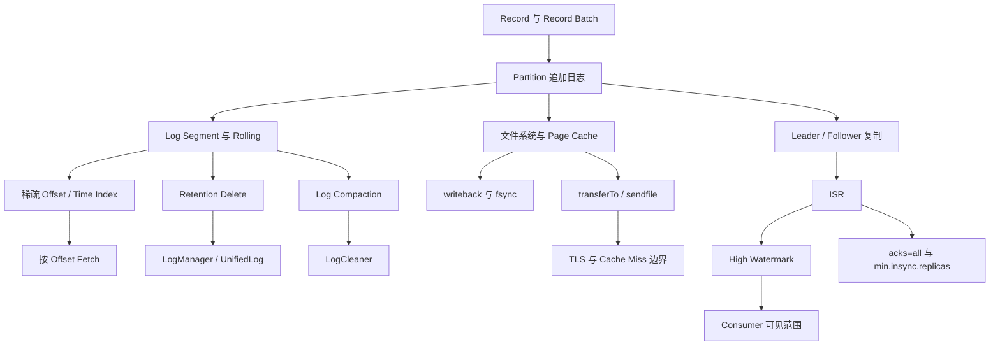
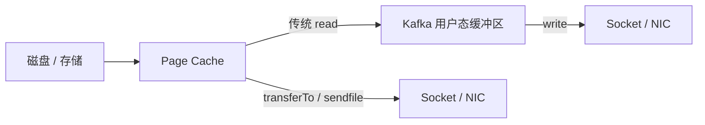
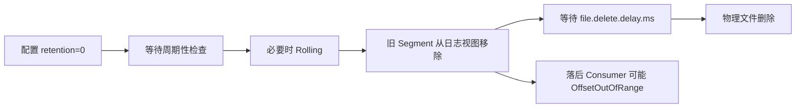
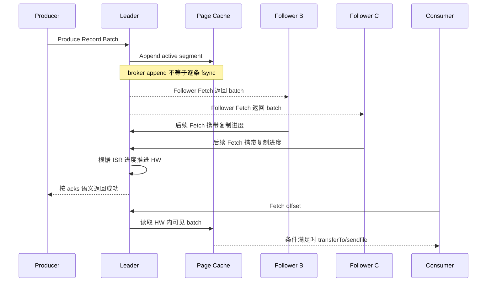
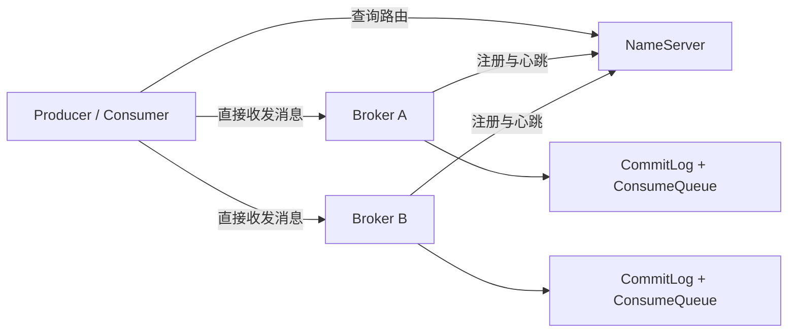
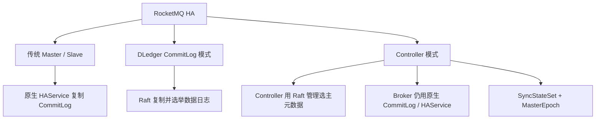
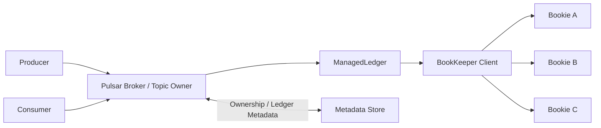
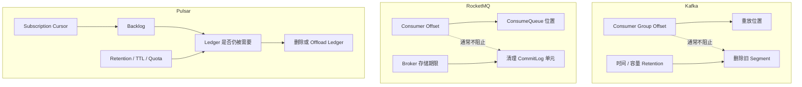
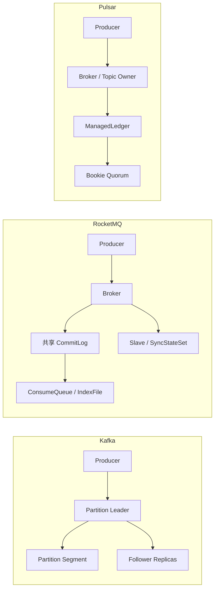

# Kafka 为什么快：从追加日志、Page Cache 到 ISR 的完整机制

> [!abstract] 一句话结论
> Kafka 的高吞吐不是某个“零拷贝黑科技”单独带来的，而是 **批处理把小操作合并、追加日志把写入变成连续工作、稀疏索引缩小定位范围、Page Cache 统一承接读写、条件满足时 `transferTo/sendfile` 避免用户态搬运，再由 ISR 与 High Watermark 给性能划出可靠性边界** 的组合结果。

本文源自 [[2026-07-22]] 的每日知识点，并对其中几处容易误导的简化说法做了机制级修正。讨论以 Apache Kafka 4.3 的经典本地日志路径为主；分层存储（Tiered Storage）、TLS、事务消费与 ELR 会在边界章节单独说明。

---

## 1. 先拆掉四个常见误区

开始之前，先把“记住了反而有害”的结论清掉：

1. **Segment 不一定只有三个文件。** `.log`、`.index`、`.timeindex` 是核心三件套，但事务索引、producer snapshot、leader epoch checkpoint 等辅助结构也可能存在。
2. **索引不是“精确定位每条消息”。** Kafka 使用稀疏索引：先找到不超过目标 offset 的最近位置，再顺序扫描少量 record batch。
3. **零拷贝没有跨平台固定的“2 次拷贝 + 1 次切换”。** 它真正保证的是在适用路径上避免 `read()` 到用户态再 `write()` 回内核；TLS、page-cache miss、JDK、内核和 NIC 都会改变实际路径。
4. **超过 1 MB 不会让顺序 I/O 自动退化为随机 I/O，也不会让索引失效。** 1 MB 主要是常见默认配置边界；大消息的问题是缓冲、网络、复制、批处理收益和尾延迟。

> [!warning] 关于“保证不丢数据”
> Kafka 的可靠性从来不是 ISR 单独保证的。它依赖 `acks`、`min.insync.replicas`、副本因子、leader election、刷盘与故障组合。脱离配置谈“绝不丢”是不成立的。

---

## 2. 最小知识依赖图



读图时抓住三条主线：

- **存储线**：Record Batch → Partition → Segment → 稀疏索引 → Fetch；
- **操作系统线**：追加文件 → Page Cache → writeback / `sendfile`；
- **可靠性线**：复制进度 → ISR → High Watermark → 可见性与确认语义。

这三条线互相约束。只讲其中一条，就会把 Kafka 错讲成普通日志文件、网络技巧或副本协议。

---

## 3. 第一生产力不是磁盘，而是批处理

### 3.1 从 Record 到 Record Batch

应用看到的是一条条 Record，但 Kafka 的高效处理单位往往是 **记录批次（Record Batch）**。Producer 会先把同一 partition 的记录聚合，达到批次大小、等待时间或发送条件后再压缩和发送。

这一步有三重收益：

- 一次网络请求承载多条记录，摊薄协议头、系统调用和往返成本；
- broker 追加的是连续二进制批次，减少碎片化小写入；
- 压缩在批次上进行，重复字段越多，压缩率通常越好。

可以把它类比为物流：逐件叫车，成本由“每次发车”主导；先装箱再发车，固定成本被一箱货物共同承担。

**类比边界**：Kafka 的批次不只是运输包装。它还是压缩、校验、存储、复制和消费解析的重要协议单位，所以超大批次也会造成队头阻塞与内存峰值。

### 3.2 `linger.ms` 与 `batch.size` 的真实取舍

- 更大的批次通常提高吞吐和压缩率；
- 等待聚合会增加单条消息的排队时间；
- 批次过大时，一次请求、复制或消费解析占用资源更久；
- partition 太多会使 accumulator 中同时存在许多不满的批次，增加内存占用。

因此，Kafka 的性能起点不是“磁盘很快”，而是**先避免让系统处理海量彼此独立的小操作**。

---

## 4. Partition 是什么：有序追加日志，而不是一张队列表

一个 Topic 被拆成多个 Partition。Partition 内部的 offset 单调递增，broker 把新的 record batch 追加到当前活跃段（active segment）的末尾。

```text
Partition P0

baseOffset=0           baseOffset=10000          baseOffset=22000
┌──────────────────┐   ┌──────────────────┐      ┌──────────────────┐
│ closed segment   │   │ closed segment   │      │ active segment   │
│ 0.log            │   │ 10000.log        │      │ 22000.log        │ ◀─ append
│ 0.index          │   │ 10000.index      │      │ 22000.index      │
│ 0.timeindex      │   │ 10000.timeindex  │      │ 22000.timeindex  │
└──────────────────┘   └──────────────────┘      └──────────────────┘
```

### 4.1 为什么要分 Segment

如果 partition 永远只有一个巨型文件，会出现：

- retention 很难按整体文件删除；
- compaction 必须重写庞大文件；
- 索引和恢复范围持续扩大；
- 文件操作和故障恢复成本不可控。

Segment Rolling 把无限日志切成有限管理单元。滚动条件可能包括：

- segment 达到配置大小；
- segment 存活时间达到阈值；
- offset/time index 空间不足；
- retention 需要滚动，以便旧 active segment 转为可删除段。

### 4.2 核心文件与辅助文件

- `.log`：按顺序保存 record batch；
- `.index`：相对 offset → `.log` 物理位置；
- `.timeindex`：时间戳 → offset；
- `.txnindex`：事务相关的 aborted transaction 信息；
- 其他 checkpoint、snapshot 或临时文件：服务恢复、leader epoch、producer state、交换流程等。

所以“三个文件”适合入门，但不应写成文件系统不变量。

---

## 5. 稀疏索引：不是一步命中，而是缩短扫描

假设消费者请求 offset `18,573`：

1. 根据各 segment 的 base offset，找到 base offset 不大于目标值且最接近它的 segment；
2. 在该 segment 的 offset index 中查找不超过目标相对 offset 的最近索引项；
3. 取得 `.log` 中的大致物理位置；
4. 从这个位置开始顺序解析 record batch，直到覆盖目标 offset 或满足 fetch 条件。

```text
目标 offset: 18573

.index（稀疏）                       .log
relative offset → position          position → batch
0      → 0                          0      : offsets 10000..10089
4100   → 812KB                      ...
8200   → 1.61MB  ───────────────▶   1.61MB : offsets 18190..18270
                                           : offsets 18271..18380
                                           : offsets 18381..18590  ◀─ 命中
```

### 5.1 为什么不用稠密索引

如果每条消息都有索引项：

- 索引体积随消息数高速增长；
- cache locality 下降；
- 写放大更大；
- 实际收益有限，因为日志本身就是连续批次，附近扫描很便宜。

Kafka 选择“粗定位 + 小范围顺序扫描”，本质上是用少量 CPU 顺序解析换更小、更容易 mmap 和缓存的索引。

### 5.2 复杂度为什么不能只写 `O(log N)`

二分查找只是部分成本。完整延迟还包括：

- segment 选择；
- mmap page 是否命中；
- 稀疏索引密度；
- 目标距离 floor entry 多远；
- `.log` 页是否在 Page Cache；
- record batch 大小与解析数量。

工程上比“大 O”更重要的问题是：**此次读取是否变成磁盘 page fault，以及需要扫描多少连续数据。**

---

## 6. 追加写为什么快：不要把逻辑顺序等同于物理落盘

Kafka 把批次追加到 active segment 末尾。追加具有稳定的文件位置演进，避免在应用层频繁覆盖随机位置，也便于文件系统聚合写入。

但“追加写”不等于“每条消息立即顺序写入盘片”。典型路径是：

```text
Producer
   │ Record Batch
   ▼
Broker Socket Buffer
   │ 解析、校验、选择 Partition
   ▼
write() / FileChannel
   │
   ▼
Linux Page Cache（dirty pages）
   │ 后台 writeback / 显式 fsync
   ▼
块层 / SSD / 磁盘
```

### 6.1 三个不同的完成时刻

1. **broker append 完成**：数据已交给文件系统；
2. **Page Cache 接收完成**：dirty page 位于内核内存；
3. **设备持久化完成**：数据到达持久介质，并满足设备缓存语义。

默认情况下，Kafka 并不为每条消息执行 `fsync`。逐条强制落盘会让吞吐被存储设备同步延迟主导。Kafka 更倾向于：

- 让 OS 批量 writeback；
- 用多副本降低单机 page cache 丢失的风险；
- 由 producer 的 `acks` 与 ISR 下限决定何时返回成功。

这解释了一个核心设计：**Kafka 用网络复制替代逐消息同步刷盘，换取吞吐与跨机器故障容忍。** 这不是无条件更安全，而是改变了可靠性成本的支付方式。

---

## 7. Page Cache：Kafka 与操作系统共同设计

### 7.1 Kafka 为什么不在 JVM 堆里缓存完整日志

如果 broker 为热点日志再维护一份大型 Java 对象缓存，会产生：

- 文件系统一份、JVM 一份，内存重复；
- 对象与元数据开销；
- 大堆 GC 和停顿风险；
- broker 重启后堆缓存完全冷却；
- 应用缓存策略可能与 OS read-ahead/writeback 冲突。

Kafka 的策略更准确地说是：**不为完整日志另建大型 JVM heap cache，而把文件页缓存交给操作系统。**

这并不意味着 Kafka“完全不缓存”。Producer accumulator、Consumer fetch buffer、broker 网络缓冲、索引 mmap、cleaner offset map 都占用内存。

### 7.2 追尾消费为何特别快

消费者通常读取刚写入不久的数据。此时对应文件页很可能还在 Page Cache：

```text
写入：Producer → Broker → Page Cache → 稍后落盘
读取：Consumer ← Socket ← Page Cache
```

读取路径甚至可能尚未触碰物理磁盘。这也是 Kafka 适合实时流的原因之一：大多数消费者在日志尾部附近追赶，时间局部性很强。

### 7.3 Page Cache 的失败边界

- 工作集远大于内存时，历史读取会频繁 page fault；
- 大量落后消费者会污染热点缓存；
- broker 与同机其他进程争抢内存时，回收行为会改变；
- dirty page 过多会触发回写节流；
- 容器 memory limit、cgroup 与宿主机回收策略会影响可用缓存。

因此，Kafka 机器“JVM heap 不大”不代表“内存不重要”。恰恰相反，额外 RAM 往往是给 Page Cache 的。

---

## 8. `transferTo/sendfile`：真正省掉了什么

传统文件发送路径常被画成：

```text
Disk → Page Cache → User Buffer → Socket Buffer → NIC
```

Kafka 的 file-backed response 在条件满足时可以使用 Java `FileChannel.transferTo()`；Linux 上通常映射到 `sendfile()`。核心价值是避免：

```text
Page Cache → Kafka 用户态缓冲区 → Socket 内核缓冲区
```

这段往返。Kafka 仍然需要在用户态处理请求、权限、配额、响应头和控制流；所谓“全程不经过用户态”只适合描述**文件 payload 的特定传输路径**，不能覆盖整个 Fetch 请求。



图中关键不是死记拷贝次数，而是：下方路径不要求 Kafka 把 payload 读进用户态再写回去。

### 8.1 为什么不能承诺固定拷贝次数

实际数据运动取决于：

- 内核是否用页引用或 scatter-gather；
- NIC 与 DMA 能力；
- 文件页是否已在 Page Cache；
- JDK 对 `transferTo` 的实现与回退；
- socket 状态和发送缓冲；
- 操作系统与文件系统。

所以“4 次变 2 次、4 次切换变 1 次”可作为某个特定教科书模型，却不应作为 Kafka 跨平台事实。

### 8.2 TLS、Cache Miss 与 Tiered Storage

- **TLS**：传统用户态 TLS 需要让数据进入加密路径，经典 `sendfile` 优势可能无法直接保留；
- **Cache Miss**：页面不在内存时，`sendfile` 仍需触发磁盘读取，甚至可能阻塞相关线程；
- **Tiered Storage**：远端历史 segment 要先经过远程读取路径，不能套用纯本地日志模型；
- **消息转换**：若 broker 必须做格式转换或额外处理，file-backed 直传优势会减弱。

零拷贝是**条件化优化**，不是 Kafka 所有网络流量的永久属性。

---

## 9. 副本机制：先分清五个不同概念

### 9.1 LEO、ISR、HW、LSO、acks

- **日志末端偏移量（Log End Offset, LEO）**：某副本下一条记录将写入的位置；各副本可能不同。
- **同步副本集合（In-Sync Replicas, ISR）**：当前被认为跟得上 leader 的副本集合，包含 leader。
- **高水位（High Watermark, HW）**：当前 ISR 复制进度所允许的普通消费者可见边界。
- **最后稳定偏移量（Last Stable Offset, LSO）**：事务 `read_committed` 消费者的可见边界，还要考虑未完成事务。
- **确认级别（acks）**：producer 何时把一次 produce 请求视为成功。

把它们压成一句“ISR 全部确认后消息 committed”，会混淆 producer 成功、consumer 可见和事务提交。

### 9.2 一个逐步推演

假设副本因子为 3：A 是 leader，B/C 是 follower。

```text
时刻 t0
A LEO=101   B LEO=101   C LEO=101   ISR={A,B,C}   HW=101

新 batch offsets 101..110 到达 A
时刻 t1
A LEO=111   B LEO=101   C LEO=101   ISR={A,B,C}   HW=101

B 完成复制
时刻 t2
A LEO=111   B LEO=111   C LEO=101   ISR={A,B,C}   HW=101

C 完成复制，leader 获知进度
时刻 t3
A LEO=111   B LEO=111   C LEO=111   ISR={A,B,C}   HW 可推进到 111
```

在 t1：

- `acks=1` 的 producer 可能已收到成功；
- 普通 consumer 仍不应读取 HW 之后的数据；
- 如果 A 此时不可恢复地失败，producer 已成功的记录存在丢失可能。

这就是为什么 producer 成功与 consumer 可见不是同一个事件。

---

## 10. `acks=all` 与 `min.insync.replicas`：一个经常被讲错的组合

假设：

```text
replication.factor = 3
ISR = {A, B, C}
min.insync.replicas = 2
acks = all
```

正确语义是：

- 当前 ISR 有 A/B/C，`acks=all` 要等待**当前所有 ISR**；不是只等 2 个；
- C 若因落后被移出 ISR，ISR 变成 A/B，A/B 确认即可；
- 如果 B 又离开，只剩 A，ISR 数量低于 2，写入失败；
- `min.insync.replicas=2` 是写入准入下限，不是固定确认数。

| 场景 | ISR | `acks=all` 结果 |
|---|---|---|
| 三副本健康 | A,B,C | 等待 A,B,C |
| C 已移出 ISR | A,B | 等待 A,B，可成功 |
| 只剩 leader | A | 低于 MISR=2，拒绝写入 |

### 10.1 “容忍延迟但保证不丢”哪里不严谨

Follower 暂时慢，可以留在 ISR 内等待；慢到超过同步条件，会被移出 ISR。这样避免一个长期故障副本永久阻塞系统，但副本数减少后，故障余量也下降。

是否丢数据还取决于：

- producer 使用 `acks=1` 还是 `all`；
- MISR 是否合理；
- 是否允许 unclean leader election；
- 多少台机器同时、以何种方式故障；
- producer 是否启用幂等与正确重试；
- acknowledged 数据是否已进入足够多的故障域。

可靠性不是一个布尔开关，而是一组可配置的不变量。

---

## 11. Retention：删除的是 Segment，不关心 Consumer 是否读完

Kafka 的时间/容量保留策略与 consumer offset 解耦。Broker 不会因为某消费者还没读到就无限保留旧数据。

### 11.1 `log.retention.hours=0` 会发生什么

对 `cleanup.policy=delete` 的日志，零时长意味着旧 segment 很快满足时间删除条件，但：

1. 配置写入不等于同一瞬间同步清空；
2. broker 按 `log.retention.check.interval.ms` 等调度执行检查；
3. 删除以 segment 为单位；
4. 若需要删除当前唯一或 active segment，Kafka 可先 roll 新 segment，日志结构至少保留一个 segment；
5. 从日志视图移除后，物理文件还可能等待 `file.delete.delay.ms`；
6. 慢消费者不会阻止删除，请求已低于 log start offset 时会遇到 `OffsetOutOfRange`，之后由 `auto.offset.reset` 或应用逻辑决定恢复方式。



### 11.2 Active Segment 的“保护”到底是什么

- 对 **Compaction**：active segment 通常属于不可清理区域；
- 对 **Retention Delete**：它不是永久豁免。Kafka 可以先 roll，使原 active segment 变成 closed segment，再进入删除流程。

这是“文件角色”而非“这批数据永远不能删除”。

---

## 12. LogCleaner 不负责普通 Retention Delete

Kafka 有两类经常被混淆的清理：

### 12.1 `cleanup.policy=delete`

按时间或容量边界删除整个旧 segment。相关职责主要在日志管理调度与 `UnifiedLog.deleteOldSegments()` 等路径。

### 12.2 `cleanup.policy=compact`

LogCleaner 构造 `key → latest offset` 映射并重写旧 segment，移除同一个 key 的较旧版本，同时处理 tombstone、compaction lag 等规则。

```text
Compaction 前：
K1=v1, K2=a, K1=v2, K3=x, K2=tombstone

Compaction 后（概念化）：
K1=v2, K3=x, K2=tombstone（在删除保留期内）
```

当策略是 `compact,delete` 时，两种机制可以同时存在：

- compact 解决“同一个 key 留哪个版本”；
- delete 解决“多旧的 segment 整体不再保留”。

因此，把 `retention=0` 的行为归给 LogCleaner 是职责错位。

---

## 13. 大消息为什么慢：不是随机 I/O，也不是索引失效

大 record batch 仍然可以追加到 active segment 末尾，索引仍按字节间隔建立稀疏项。不存在“超过 1 MB 后索引突然失效”的机制。

真正的成本包括：

1. **端到端配置耦合**：Producer、Topic/Broker、Replica Fetcher、Consumer 的尺寸上限需要协调；
2. **内存峰值**：更大的 request、response、batch 和 buffer；
3. **队头阻塞**：一个大请求占用连接、线程或带宽更久；
4. **复制延迟**：Follower 复制单位更大，尾延迟和 lag 可能上升；
5. **批处理摊销下降**：若一个 batch 主要由单条大记录构成，无法让很多小记录共享固定成本；
6. **网络竞争**：大消息更容易挤压其他 partition 的流量；
7. **压缩成本**：压缩率与 CPU 消耗取决于内容，不是“越大越好”。

常见配置链包括：

- `max.request.size`
- `message.max.bytes` / topic `max.message.bytes`
- `replica.fetch.max.bytes`
- `max.partition.fetch.bytes`
- `fetch.max.bytes`

> [!tip] 更稳妥的架构
> 对非常大的业务对象，常见方案是把大对象存入对象存储，只在 Kafka 中传 URI、校验和、版本、权限上下文等元数据。但这会引入对象生命周期、原子性、权限和垃圾回收问题，不能只说“传链接就行”。

大消息没有统一“断崖点”。性能拐点必须结合消息分布、压缩、带宽、磁盘、ISR、并发和 SLA 实测。

---

## 14. 一条消息的完整状态机



这张图揭示了四个不变量：

1. Partition 内 offset 顺序由 leader 决定；
2. Producer 的成功时刻由 `acks` 决定；
3. 普通 consumer 的可见边界由 HW 决定；
4. 数据是否已到持久介质，与上述三个时刻都不能简单画等号。

---

## 15. 生产调优：先找瓶颈层，不要背“万能参数”

### 15.1 Producer 侧

观察：

- batch-size-avg / batch-size-max；
- records-per-request；
- compression-rate；
- request latency、retry、timeout；
- buffer pool wait；
- partition 分布是否倾斜。

判断：吞吐低究竟是批次太小、key 导致热点、压缩 CPU、网络 RTT，还是 broker 限流。

### 15.2 Broker 存储侧

观察：

- 磁盘吞吐、延迟、队列深度；
- page fault、cache 命中趋势、dirty/writeback；
- segment 数量与 rolling 频率；
- log flush 与文件描述符；
- historical read 是否驱逐尾部热点页。

### 15.3 复制与可靠性侧

观察：

- UnderReplicatedPartitions；
- ISR shrink/expand；
- follower lag；
- OfflinePartitions；
- Produce 请求在 `acks=all` 下的尾延迟；
- MISR 不满足导致的写入错误。

### 15.4 Consumer 侧

观察：

- consumer lag 与 lag 增长率；
- fetch size、fetch latency、records per request；
- rebalance 频率；
- 单条处理时长与批量提交；
- `OffsetOutOfRange` 和 reset 行为。

> [!warning] 常见反模式
> - 一看到吞吐低就增大 JVM heap；
> - 把所有问题都归因于磁盘；
> - 只增大 Producer 上限，不同步 Replica/Consumer 尺寸配置；
> - 使用 `acks=all` 却把 MISR 设为 1，并宣称“强一致”；
> - 用 retention 代替消费完成确认；
> - 把 compaction 当成数据库里每个 key 永远只有一行；
> - 在 TLS、Tiered Storage 场景仍假设所有 Fetch 都是本地 `sendfile`。

---

## 16. Kafka 4.x 的三个边界

### 16.1 事务与 LSO

`read_committed` consumer 不能只看 HW。存在未完成事务时，LSO 可能落后于 HW；“已经复制到 ISR”不等于“事务消费者立即可见”。

### 16.2 Eligible Leader Replicas（ELR）

Kafka 4.x 的当前高可用语义还需要结合 ELR。它扩展了传统只用 ISR 判断 leader 资格与有效 MISR 的模型。若做生产架构评审，不应只背旧版 ISR 口诀；应以目标集群版本和官方配置说明为准。

### 16.3 Tiered Storage

历史 segment 进入远端存储后：

- Fetch 可能经过远程读取；
- 本地 Page Cache 与 `sendfile` 模型不再覆盖完整路径；
- 本地和远端 retention 有不同配置与生命周期；
- 性能模型要加入对象存储延迟、缓存和带宽。

本文关于 Page Cache 与 `transferTo` 的论述，应理解为**经典本地日志热路径**。

---

## 17. 从 Kafka 看 RocketMQ：共享 CommitLog 与逻辑队列

Kafka 的物理组织单位是 Partition：每个 Partition 拥有独立的 Segment 集合。RocketMQ 经典存储采用另一种思路：**Broker 上不同 Topic、不同 MessageQueue 的消息先混合追加到共享 CommitLog，再通过 ConsumeQueue 还原每条逻辑队列的消费顺序。**

### 17.1 CommitLog、ConsumeQueue 与 IndexFile

```text
Producer
   │ Topic=A, Queue=2
   ▼
Broker CommitLog（多个 Topic/Queue 共享）
   │ append message body + metadata
   ├──────────────▶ ConsumeQueue/A/2
   │                [CommitLogOffset, Size, TagHash]
   └──────────────▶ IndexFile
                    [MessageKey / Time → CommitLogOffset]
```

三个结构分别解决不同问题：

- **CommitLog**：保存消息正文与主要元数据，是 Broker/store 级物理追加日志；
- **ConsumeQueue**：按 `topic/queueId` 组织的轻量逻辑索引，把队列 offset 映射到 CommitLog 物理位置；
- **IndexFile**：用于按业务 key 和时间辅助查询，不是正常顺序消费的主索引。

因此，“RocketMQ 每个 Topic 有独立 CommitLog”是错误的。Topic 和 MessageQueue 的逻辑隔离主要体现在 ConsumeQueue，正文在物理层混写。

### 17.2 一次写入和读取

写入路径可以概括为：

1. Producer 从 NameServer 获取 Topic 路由；
2. Producer 选择 Broker 和 MessageQueue；
3. Broker 把消息追加到 CommitLog；
4. 分发服务从 CommitLog 构建 ConsumeQueue 和 IndexFile；
5. Consumer 根据逻辑队列 offset 查询 ConsumeQueue；
6. 取得 CommitLog offset 与长度后读取正文。

这与 Kafka 的差异不是“有没有索引”，而是索引要解决的问题不同：

| 系统 | 物理日志 | 主消费索引的作用 |
|---|---|---|
| Kafka | 每 Partition 独立 Segment | Partition offset → 同一 Partition `.log` 位置 |
| RocketMQ | Broker 级共享 CommitLog | MessageQueue offset → CommitLog 位置 |
| Pulsar | ManagedLedger → BookKeeper Ledger | `ledgerId + entryId` → Bookie 中的 Entry |

### 17.3 为什么选择共享 CommitLog

收益：

- Broker 写入集中为一条主要追加路径，便于形成连续 I/O；
- 大量低流量 Topic 不必各自维护活跃物理文件；
- 逻辑队列索引很小，适合 mmap 与 Page Cache。

代价：

- CommitLog 故障域覆盖 Broker 上多个 Topic；
- 逻辑队列读取需要一次间接寻址；
- 清理、复制和磁盘压力以 Broker 物理日志为重要边界；
- 热门与冷门 Topic 会共享底层 I/O 资源。

### 17.4 mmap、Page Cache 与刷盘

RocketMQ 经典 Store 大量使用 `MappedByteBuffer`/mmap 管理 CommitLog 和索引文件。它同样依赖 Page Cache，但确认语义还要结合刷盘策略：

- **异步刷盘**：数据进入 Page Cache 后可以先返回，后台批量 flush；
- **同步刷盘**：写请求等待相应刷盘条件，缩小单机断电窗口，但增加延迟。

mmap 可以减少传统 `read/write` 路径的用户缓冲搬运，却不意味着所有生产、消费、TLS 和网络传输都“零拷贝”。Page Cache miss、历史积压和磁盘竞争仍会改变延迟。

---

## 18. RocketMQ 的路由、复制与 5.x 架构演进

### 18.1 NameServer 与 Broker

NameServer 保存 Broker 注册和 Topic 路由视图。传统客户端先向 NameServer 查询路由，再直接连接 Broker。NameServer 不是消息存储节点，也不是用强一致复制维护单一全局路由状态的控制器；多个 NameServer 可分别接收 Broker 注册并提供路由发现。



### 18.2 三种 HA 模式不能混写



- **传统 Master/Slave**：Broker 角色相对静态，HAService 复制 CommitLog；确认强度取决于同步/异步复制和刷盘配置，自动切主能力有限。
- **DLedger CommitLog 模式**：以基于 Raft 的 DLedger 日志替换原生 CommitLog，数据日志本身参与多数派复制与选举。
- **Controller 模式**：Controller 使用共识管理 MasterEpoch、SyncStateSet 和切主元数据；Broker 数据仍走原生 CommitLog 与 HAService。

DLedger 与 Controller 的关键区别是：**Raft 管的是数据日志，还是选主元数据。** 两者不是同一个开关的不同名字。

### 18.3 Controller 模式的确认边界

Controller 维护 SyncStateSet，类似“当前被认为同步的副本集合”，但不能机械等同于 Kafka ISR。写入行为还取决于：

- `inSyncReplicas` / SyncStateSet 当前成员；
- `minInSyncReplicas` 的准入下限；
- 是否要求 `allAckInSyncStateSet`；
- Broker 刷盘与 HA 复制策略；
- MasterEpoch 与故障切换过程。

因此，比较 Kafka 与 RocketMQ 时，应比较完整确认链，而不是只比较两个集合名称。

### 18.4 Proxy 与 POP：拆的是接入层，不是持久化层

RocketMQ 5.x Proxy 可以独立部署，也可以与 Broker 同进程：

- **Cluster mode**：Proxy 作为可横向扩展的无状态接入层，访问 NameServer 与 Broker；
- **Local mode**：Proxy 与 Broker 同进程；
- 对外可提供 gRPC、TLS、认证、流量治理和可观测能力；
- 原生支持 POP 消费。

POP 把部分队列分配从客户端迁移到服务端，并使用不可见时间（invisibility timeout）、ack、续期、重试/revive 等机制管理投递。

> [!warning] “无状态”的准确边界
> Proxy 无状态不等于整个 RocketMQ 计算存储分离。Broker 仍然拥有 CommitLog、ConsumeQueue 和复制状态，是有状态存储节点。

---

## 19. RocketMQ 的业务消息机制

RocketMQ 的优势经常被概括为“业务消息能力强”，但这些能力都是建立在基础日志之上的附加协议。

### 19.1 顺序消息

顺序通常依赖同一 Message Group 路由到同一 MessageQueue，并配合有序消费约束。保证范围是 group/queue 内，而不是跨 Broker、跨 Queue 的全局顺序。

### 19.2 延迟与定时消息

定时消息在到期前不可见，由 TimerMessageStore 或相应内部调度结构管理，到期后进入可投递路径。它不是“Consumer 收到后自行 sleep”，也不是 CommitLog 天生理解业务时间。

RocketMQ 5.4 引入了 timer、transaction、index 的 RocksDB 可选实现等演进。讨论具体文件与默认行为时必须绑定版本，不能把不同版本实现混成一条固定路径。

### 19.3 事务消息

典型过程为：

1. Producer 发送 Half Message；
2. Broker 持久化但暂不对正常 Consumer 可见；
3. Producer 执行本地事务；
4. Producer 提交或回滚消息；
5. 状态不确定时，Broker 回查 Producer；
6. 确认提交后，消息进入正常消费路径。

它解决的是“本地事务结果与消息发布”的最终一致性，不等于数据库、消息系统和所有下游共同组成全局 ACID 事务。Producer 的事务检查逻辑必须幂等且能从业务事实恢复状态。

### 19.4 消费失败与重投

无论传统 PushConsumer 还是 POP，重试都会影响观察到的顺序和重复投递。业务处理必须考虑：

- 幂等键与去重窗口；
- 不可见时间小于处理时长造成的重复；
- 顺序队列中毒消息阻塞；
- 最大重试后的死信处理；
- ack 成功与业务副作用提交之间的原子性缺口。

---

## 20. 从 Kafka 看 Pulsar：Broker 与 BookKeeper 分层

Pulsar 最鲜明的设计不是“四种订阅”，而是把服务层与持久化层拆开：

- **Broker**：连接、协议、Topic Ownership、Dispatcher、缓存、权限和 ManagedLedger 客户端；
- **BookKeeper Bookie**：保存持久消息的权威副本；
- **Metadata Store**：保存集群、ownership、Bookie、Ledger 与 Namespace 等元数据，常见实现是 ZooKeeper，更新主线也支持其他后端；
- **ManagedLedger**：把一个 Topic 的连续日志抽象为多个 BookKeeper Ledger。



### 20.1 “无状态 Broker”不等于没有状态

准确说法是：**Broker 不拥有 durable payload 的本地权威副本。** Broker 仍维护：

- 网络连接与认证上下文；
- Topic ownership；
- Dispatcher 与消费者状态；
- 热点消息缓存；
- ManagedLedger 句柄和运行时指标。

Broker 故障后，另一个 Broker 可以接管 Topic，而不需要先复制该 Topic 的全部历史日志；它从 BookKeeper 读取持久数据。但接管仍需要 metadata 协调、缓存预热和连接重建。

### 20.2 ManagedLedger、Ledger 与 Entry

- BookKeeper Ledger 是单写者、append-only 的 Entry 序列；
- 一个 Pulsar Topic 的 ManagedLedger 随时间包含多个 Ledger；
- Ledger 达到大小、时间、Entry 数限制，或发生写入失败、owner 切换时会封闭并 rollover；
- 位置通常以 `ledgerId + entryId` 表示；
- 封闭 Ledger 才适合整体删除或 offload。

ManagedLedger 与 Kafka Partition 都表示逻辑有序日志，但底层复制和文件组织完全不同。Kafka Segment 是 Broker 本地 Partition 文件；BookKeeper Ledger 的 Entry 分布在一组 Bookie 上。

### 20.3 Bookie 内部也会混写

Bookie 通常把多个 Ledger 的 Entry 追加到共享 Entry Log，并通过 Ledger Index 定位，同时用 Journal 支撑写入持久性。这在“共享物理日志 + 逻辑索引”的形态上与 RocketMQ 有相似之处，但不能等同：

- RocketMQ CommitLog 是 Broker 业务消息存储；
- Bookie Entry Log 是 BookKeeper 存储节点对多个 Ledger Entry 的物理组织；
- Pulsar 的 Topic 还隔着 ManagedLedger、quorum 与 Topic Ownership 层。

---

## 21. Pulsar 的复制、消费进度与数据生命周期

### 21.1 `E / Qw / Qa`：三个数字分别回答三个问题

- **Ensemble Size `E`**：一个 Ledger Fragment 可以使用多少个 Bookie；
- **Write Quorum `Qw`**：每个 Entry 写入多少个 Bookie；
- **Ack Quorum `Qa`**：收到多少个确认后认为此次写入成功。

通常满足：$E \ge Q_w \ge Q_a$。

假设 `E=3, Qw=3, Qa=2`：一个 Entry 会发往 3 个 Bookie，收到其中 2 个满足要求的持久化确认后，客户端可以认为写入成功。它既不是“只写一个 Bookie”，也不一定要求 Ensemble 中所有 Bookie 都确认。

这与 Kafka ISR 的差异在于：Kafka 以 Partition Leader/Follower 复制日志并推进 HW；BookKeeper 以 Ledger Entry 为单位，根据 Ensemble 和 Quorum 放置及确认。

### 21.2 Subscription Cursor 与 Backlog

Pulsar 的 Subscription 维护持久 Cursor。未被该订阅确认的消息形成 Backlog。默认情况下，Cursor 会影响 Ledger 是否仍被需要：只有相关订阅都越过某个 Ledger，且 retention/offload 等条件允许时，才能回收。

这与 Kafka 很不一样：

- Kafka Consumer Group Offset 通常不阻止时间/容量 retention 删除旧 Segment；
- Pulsar Cursor 默认更直接参与 Backlog 与 Ledger 回收判断；
- Pulsar 的 Retention、TTL、Backlog Quota 又分别改变已确认消息、过期未确认消息和积压限制。



### 21.3 四种订阅类型

| 类型 | 活跃消费者 | 分发方式 | 顺序边界 |
|---|---:|---|---|
| Exclusive | 1 | 单一消费者 | Topic/Partition 内最直接 |
| Failover | 多个注册、一个 Active | Active 故障后切换 | Active 路径内 |
| Shared | 多个 Active | 并行分发 | 不保证整体顺序 |
| Key_Shared | 多个 Active | 同 Key 关联到同一消费者 | 同 Key 顺序、跨 Key 并行 |

Negative Ack、超时重投、消费者故障和 Batching 配置仍可能改变观察到的投递次序。Key_Shared 不是全局顺序开关。

### 21.4 分层存储与跨地域复制

- **Tiered Storage**：封闭 Ledger 可 offload 到对象存储，逻辑读取连续，但热路径从 Broker→BookKeeper 扩展为 Broker→缓存/BookKeeper/对象存储；
- **异步 Geo-replication**：Broker Replicator 读取本地消息并向远端集群重新发布，存在复制延迟；
- **同步跨地域持久化**：依赖 BookKeeper region-aware placement 和 quorum，要支付跨地域确认延迟。

Geo-replication 与集群内 BookKeeper Entry 多副本不是同一层机制。

### 21.5 多租户边界

Pulsar 以 `tenant/namespace/topic` 组织治理。权限、配额、Retention、TTL、Backlog Quota、隔离和跨集群复制等策略可在 Tenant/Namespace 或 Topic Policy 层配置。这适合平台化多租户，但也要求运维团队理解策略继承与跨层资源隔离。

Transactions 和 Functions 属于构建在消息系统之上的能力：前者协调跨 Topic/Partition 的 Produce/Ack 原子提交，后者提供轻量消费—处理—发布。它们都不应混入基础持久日志热路径。

---

## 22. Kafka、RocketMQ、Pulsar 的机制级对比



| 维度 | Kafka | RocketMQ | Pulsar |
|---|---|---|---|
| 计算与存储 | Broker 与本地 Partition 耦合 | 经典 Broker 耦合；Proxy 可拆接入层 | Broker 与 BookKeeper 分层 |
| 物理日志 | 每 Partition 独立 Segment | Broker 级共享 CommitLog | ManagedLedger→多个 Ledger；Bookie 混写 Entry Log |
| 消费定位 | Offset 稀疏索引 | ConsumeQueue→CommitLog；IndexFile 查 Key | `ledgerId + entryId` 与 Ledger Index |
| 复制确认 | Leader/Follower、ISR、HW、acks、MISR | 主从、DLedger 或 Controller/SyncStateSet | Ensemble、Write Quorum、Ack Quorum |
| 消费进度 | Group Offset | Consumer Offset | Subscription Cursor |
| 数据回收 | Retention 通常不等消费者 | Broker 保留策略通常不等消费者 | Backlog 默认受 Cursor 约束，再叠加 Retention/TTL/Quota |
| 扩缩容 | Partition Reassignment 会搬副本 | Broker/Queue 调整涉及路由和数据；Proxy 可独立扩 | Broker Ownership 与 Bookie 容量/I/O 可分开扩 |
| 顺序范围 | Partition 内 | MessageQueue/Message Group 内 | Partition 或 Key 内，取决于订阅类型 |
| 业务能力 | 流处理生态、事务、Compaction | FIFO、定时、事务、重试/死信突出 | 多订阅、多租户、长 Backlog、Geo/Tiered Storage |
| 运维复杂度 | Controller、Broker、Partition 与磁盘 | NameServer、Broker HA，可选 Proxy/Controller | Broker、BookKeeper、Metadata Store、Offloader |

### 22.1 典型选型倾向

- **Kafka**：事件日志、CDC、流处理生态、数据平台与高吞吐顺序流；
- **RocketMQ**：Java 业务系统、订单/支付类事务消息、精细延迟消息、Message Group 顺序和成熟重试语义；
- **Pulsar**：大规模多租户、计算存储独立扩容、长时间 Backlog、分层存储与跨地域消息平台。

这些只是架构倾向，不是排他规则。最终选择必须结合：

- 消息大小和批次分布；
- Producer/Consumer 并发及积压长度；
- 复制确认与故障域；
- TLS、压缩和跨地域要求；
- 运维团队对组件栈的掌握；
- P99/P999 延迟、恢复时间和总成本的实测。

> [!important] 为什么不能直接回答“谁更快”
> 三者都使用追加、批处理、Page Cache 与多副本，但复制确认、缓存命中、消费模型、历史读取和硬件布局不同。脱离工作负载给吞吐排行榜，只是在比较默认参数，不是在比较架构。

---

## 23. 费曼理解检验

### 23.1 白话复述

不用“零拷贝”“ISR”这些术语，解释 Kafka 为什么快：

> 它先把很多小消息装成批次，按顺序追加到有限大小的日志段；操作系统替它缓存和批量落盘。消费者通常读取刚写入的数据，这些数据还在内存里；条件合适时，内核可以直接把文件页送往网络。副本机制则决定消息要复制到什么程度才确认和可见。

### 23.2 逐步推演题

RF=3，ISR={A,B,C}，MISR=2，Producer 使用 `acks=all`。C 很慢但尚未移出 ISR：

- Producer 是否只需 A/B 确认？**否，仍需当前所有 ISR，即 A/B/C。**
- C 被移出 ISR 后呢？**A/B 确认可成功。**
- B 随后也离开 ISR 呢？**ISR 只有 A，低于 MISR，写入失败。**

### 23.3 边界题

启用 TLS 后，能否仍把消费路径描述为“文件直接从 Page Cache 零拷贝到网卡”？

**不能无条件这样说。** 用户态加密通常改变经典 `sendfile` 路径；必须根据 Kafka/JDK/内核的实际 TLS 实现确认。

### 23.4 迁移应用题

某团队把单条消息从 100 KB 提高到 5 MB，只改了 Producer 的 `max.request.size`，结果副本持续落后，Consumer 偶发取不到数据。排查顺序应是：

1. 检查 topic/broker 消息上限是否接受；
2. 检查 `replica.fetch.max.bytes` 是否足以复制；
3. 检查 Consumer 的 partition/fetch 上限；
4. 观察网络、内存与 follower lag；
5. 检查是否需要对象存储引用模式；
6. 用目标消息分布做基准，而不是归因于“索引失效”。

---

## 24. 最后压缩成八条

1. Kafka 的吞吐起点是 **Record Batch**：先减少操作次数，再谈 I/O 优化。
2. Kafka Partition 是滚动的独立追加日志；稀疏索引负责“靠近目标”，顺序扫描负责“最终找到”。
3. Page Cache 统一承接文件读写；Broker append、内核缓存和设备持久化是三个不同事件。
4. `transferTo/sendfile` 的本质是避免 payload 往返用户态，但受 TLS、cache miss、远端存储和平台实现限制。
5. Kafka 的 ISR、HW、LSO、`acks`、MISR 分别描述副本资格、可见边界、事务稳定边界、Producer 确认和写入下限；不能混为一个“committed”。
6. RocketMQ 用 Broker 级共享 CommitLog 承载正文，再用 ConsumeQueue 恢复 Topic/Queue 逻辑；Proxy 拆分接入层，但不让 Broker 存储自动无状态化。
7. Pulsar 通过 ManagedLedger 把 Broker 与 BookKeeper 分层，Entry 按 `E/Qw/Qa` 复制；Subscription Cursor 又让 Backlog 与数据回收形成更直接的关系。
8. 三者的顺序性、确认语义和回收策略均不同；选型必须用目标负载、故障模型和运维成本验证，不能仅凭架构图排性能名次。

---

## 参考资料

1. [Apache Kafka 4.3 — Design](https://kafka.apache.org/43/design/design/)
2. [Apache Kafka 4.3 — Log Implementation](https://kafka.apache.org/43/implementation/log/)
3. [Apache Kafka 4.3 — Network Layer](https://kafka.apache.org/43/implementation/network-layer/)
4. [Apache Kafka 4.3 — Topic Configs](https://kafka.apache.org/43/configuration/topic-configs/)
5. [Apache Kafka 4.3 — Hardware and OS](https://kafka.apache.org/43/operations/hardware-and-os/)
6. [Apache Kafka `LogCleaner.scala`](https://github.com/apache/kafka/blob/trunk/core/src/main/scala/kafka/log/LogCleaner.scala)
7. [Apache Kafka `UnifiedLog.scala`](https://github.com/apache/kafka/blob/938fee2b1fec52fa336f68118da120190bff4600/core/src/main/scala/kafka/log/UnifiedLog.scala)
8. [Linux `sendfile(2)` Manual](https://man7.org/linux/man-pages/man2/sendfile.2.html)
9. [Apache RocketMQ — Message Storage](https://apache.googlesource.com/rocketmq/+/HEAD/docs/en/Design_Store.md)
10. [Apache RocketMQ — Message Storage and Cleanup](https://rocketmq.apache.org/docs/featureBehavior/11messagestorepolicy/)
11. [Apache RocketMQ — Automatic Failover](https://rocketmq.apache.org/docs/deploymentOperations/03autofailover/)
12. [Apache RocketMQ — Controller Design](https://github.com/apache/rocketmq/blob/develop/docs/en/controller/design.md)
13. [Apache RocketMQ — Proxy](https://github.com/apache/rocketmq/blob/develop/proxy/README.md)
14. [Apache Pulsar 4.1 — Architecture Overview](https://pulsar.apache.org/docs/4.1.x/concepts-architecture-overview/)
15. [Apache Pulsar 4.1 — Messaging](https://pulsar.apache.org/docs/4.1.x/concepts-messaging/)
16. [Apache Pulsar 4.1 — Retention and Expiry](https://pulsar.apache.org/docs/4.1.x/cookbooks-retention-expiry/)
17. [Apache Pulsar 4.1 — Tiered Storage](https://pulsar.apache.org/docs/4.1.x/concepts-tiered-storage/)
18. [Apache BookKeeper — Concepts and Architecture](https://bookkeeper.apache.org/docs/next/getting-started/concepts/)

> [!note] 证据边界
> 本文以 2026-07-23 可查的 Kafka 4.3、RocketMQ 5.x、Pulsar 4.1.x、BookKeeper 官方文档与 Apache 源码，以及 Linux `sendfile(2)` 资料为依据。精确拷贝次数、大消息性能拐点与三者性能排名依赖内核、JDK、NIC、TLS、硬件、复制配置和负载，必须实测；本文不把它们写成跨环境固定事实。RocketMQ 5.4 的具体网络传输路径、POP 状态存储演进及 Pulsar 事务内部协议只保留机制边界，不作未经源码逐链验证的细节断言。
