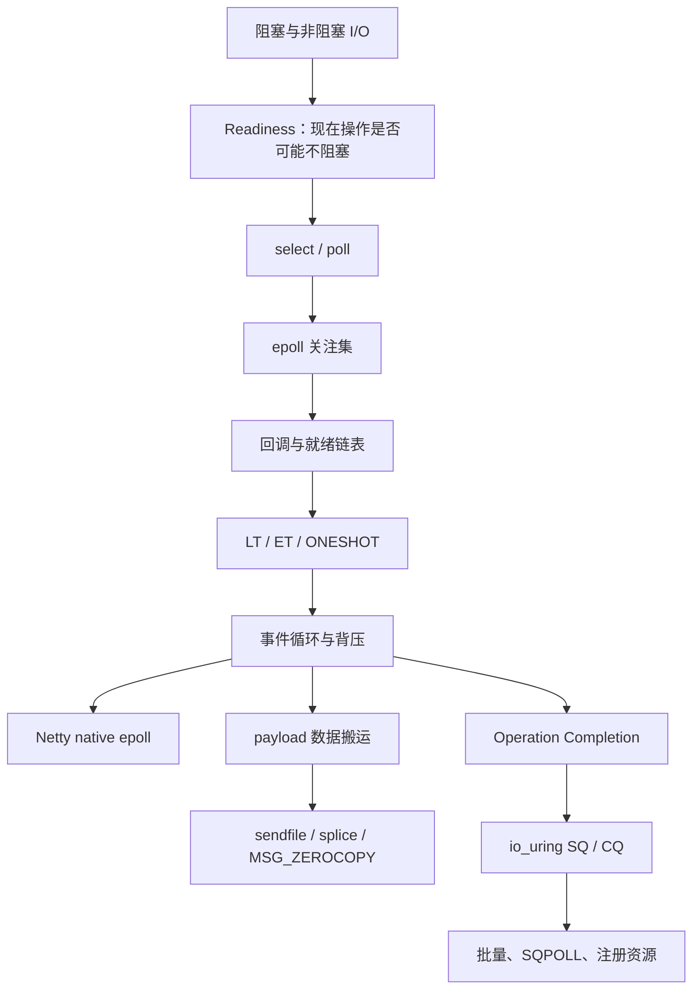
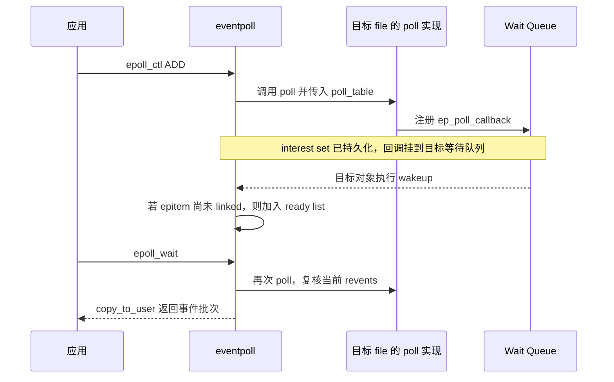
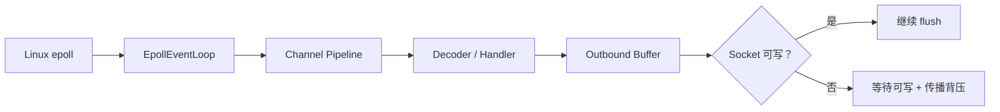
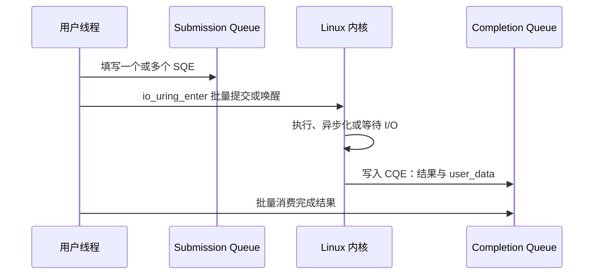
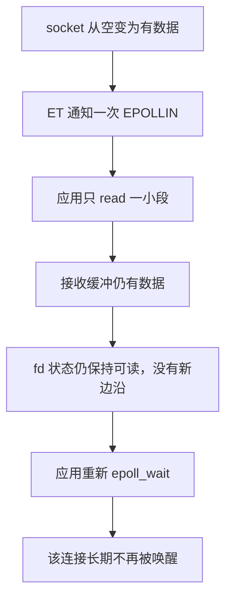

# Linux 高性能 I/O 深度解析：从 epoll 就绪通知到 io_uring 完成模型

> [!abstract] 一句话模型
> **`epoll` 优化的是“怎样从大量连接中找到现在值得处理的少数连接”，`sendfile` 等零拷贝技术优化的是“怎样少搬运 payload”，`io_uring` 则把“提交具体 I/O 操作并批量收割完成结果”做成共享队列协议。** 三者解决的是同一 I/O 链路中的不同成本，不能互相替代，也不能只用“更少 syscall”概括。

本文源自 [[work-docs/daily-reports/2026-07-26]] 的每日知识点，面向有 Java、Netty、Kafka 或服务端开发经验的工程师。原文方向正确，但把一些常见教学口号写成了严格机制；本文按 Linux man-pages、内核源码、Netty 4.1、Java 25 与 Kafka 4.3 的公开资料进行纠正和扩展，研究截至 **2026-07-27**。

---

## 1. 先拆掉七个常见误区

1. **`epoll` 不能整体写成 O(1)。** `epoll_wait()` 不再按全部已注册 fd 线性扫描，但返回 $R$ 个事件至少要处理和复制 $R$ 个结果；`epoll_ctl()` 维护关注集也有查找成本。
2. **红黑树不负责寻找 ready fd。** 它主要保存和查找关注项；就绪链表保存被通知为可能就绪的候选项。
3. **`epoll` 不靠 `mmap` 把事件表共享给用户态。** `epoll_wait()` 仍把事件复制到用户提供的数组。使用 `mmap` 暴露共享 SQ/CQ 的典型机制是 `io_uring`。
4. **ET 不等于 non-blocking。** 边缘触发只改变通知语义；应用仍必须显式使用非阻塞 fd，并读/写到 `EAGAIN`。
5. **“Netty 首选 ET”过于宽泛。** 已核验的 Netty 4.1 native epoll transport 默认使用 ET，但这是实现默认值，不是所有负载都应手工选择 ET 的普遍定律。
6. **零拷贝不等于物理上零次复制。** 它通常表示避免 payload 经过用户态中转；DMA、协议头处理、加密、页引用和 fallback 仍可能发生。
7. **`io_uring` 默认不是零 syscall。** 共享 ring、批量提交和 SQPOLL 可以摊薄或省掉部分 syscall，但 setup、唤醒、等待、注册与异常路径仍可能进入内核。

> [!warning] 最危险的学习方式
> 把“select 是 O(n)、epoll 是 O(1)、io_uring 是零 syscall”背成三代技术的性能排名。真实系统的成本取决于活跃事件数、每次处理预算、缓存命中、数据搬运、调度、协议栈、TLS、内核版本和工作负载。

---

## 2. 最小知识依赖图



读图时抓住三条主线：

- **等待线**：阻塞 → readiness → `select/poll` → `epoll`；
- **处理线**：LT/ET → drain → 事件循环公平性与背压；
- **传输线**：普通 read/write → copy avoidance → `io_uring` 的提交/完成协议。

这三条线分别回答“等谁”“处理多少”“数据怎么走”。只看 syscall 次数，会漏掉真正决定 P99 延迟的队列与调度问题。

### 2.1 设计理念：让工作量跟“变化”成比例

Linux 高性能 I/O 接口的演进，可以统一为一个原则：

> **不要为没有变化的对象重复付费；把稳定状态保存起来，只传播增量变化，并允许结果批量交付。**

这个原则在不同接口中有不同落点：

| 接口 | 稳定状态 | 增量变化 | 批量边界 |
|---|---|---|---|
| `select/poll` | 主要由应用每轮重新提交 | 内核扫描后计算 | 一次返回多个 fd |
| `epoll` | 内核持久维护 interest set | wait-queue wakeup 把候选放入 ready set | `epoll_wait()` 返回一批事件 |
| `io_uring` | ring、注册文件/缓冲与请求上下文 | SQE 提交与 CQE 完成 | 一次 enter/一次 CQ 消费处理多项 |

这不是“新 API 消灭旧成本”，而是**把成本从高频路径迁移到低频路径**：

- `epoll` 把反复传入关注集，变成注册时维护 interest set；代价是注册、生命周期和回调管理更复杂。
- ET 把重复通知减少，代价是应用必须拥有更精确的 drain 状态机。
- `io_uring` 把逐操作 syscall 变成共享队列和批处理，代价是 ring 容量、内存顺序、资源注册、取消及完成背压更复杂。

### 2.2 控制面与数据面分离

可以把 `epoll_ctl()` 看成低频**控制面（Control Plane）**，把 `epoll_wait()` 与 read/write 看成高频**数据面（Data Plane）**：

```text
控制面：连接加入/删除/修改关注事件
   频率较低，允许树查找和生命周期管理

数据面：等待 ready → 读写 → 更新连接状态
   频率很高，应主要处理真正活跃的候选
```

这解释了为什么只问“红黑树查找是不是 O(log N)”没有抓住设计重点：红黑树位于相对低频的控制面；关键收益来自数据面不再每轮扫描整个长期关注集。

### 2.3 事件接口不是业务事件总线

`EPOLLIN` 表达“现在值得尝试读取”，不是“收到了一条业务消息”。ready list 也不是数据包队列：多个 wakeup 可以合并为同一个 `epitem` 候选，交付时还要重新查询当前事件掩码。

由此得到一个重要不变量：

> **I/O 通知只负责促使状态机继续推进；真实进度必须由 read/write 的返回值确认。**

这条原则同时适用于 LT、ET、`io_uring` completion、超时和取消：通知或 CQE 是协议的一部分，应用状态不能仅靠“收到过一个信号”推断。

---

## 3. 第一层抽象：阻塞、非阻塞与 Readiness

### 3.1 阻塞 I/O

阻塞 socket 的 `read()` 在没有数据时可能让调用线程睡眠，直到数据到达、连接关闭、发生错误或被信号打断。若一个线程只服务一个连接，大量空闲连接会带来线程栈、调度和内存成本。

### 3.2 非阻塞 I/O

设置 `O_NONBLOCK` 后，`read()` 无法立即取得数据时返回 `-1`，并令 `errno=EAGAIN/EWOULDBLOCK`。它避免线程被一个连接长期卡住，却带来新问题：

> 如果对一万个暂时没数据的 fd 反复调用 `read()`，只是把“阻塞等待”变成了“忙轮询”。

### 3.3 Readiness 的真实含义

I/O 多路复用负责告诉应用：哪些 fd **现在执行某类操作大概率不会阻塞**。

它不是数据本身，也不是操作已经完成：

```text
Readiness 通知：fd 42 可读
         │
         ▼
应用仍需调用 read/recv
         │
         ├─ 读到数据
         ├─ 读到 EOF
         ├─ 遇到错误
         └─ 因并发竞争等再次得到 EAGAIN
```

因此，readiness 是提示，不是永久承诺。通知到实际执行之间状态可能变化；事件循环必须把 `EAGAIN` 当成正常状态，而不是异常。

---

## 4. `select` 与 `poll`：问题不只是 API 老

### 4.1 `select`

`select()` 用位图表示读、写和异常 fd 集合。每次调用都需要把集合交给内核，返回后集合被改写，应用通常还要遍历范围来判断哪些 fd 就绪。它还受 `FD_SETSIZE` 等接口限制。

### 4.2 `poll`

`poll()` 用 `pollfd[]` 消除位图和最大 fd 数值带来的部分限制，但每次等待仍要把 fd 数组交给内核，并检查这一批关注项。

### 4.3 根本矛盾

假设注册连接数为 $N=100000$，本轮活跃数为 $R=20$：

```text
select/poll 的典型问题：
每次等待都重新描述并检查大关注集 N

应用真正想要的：
关注集长期保留，只取本轮活跃候选 R
```

`epoll` 的核心改进不是“换了一棵更快的树”，而是把关注集从**每次调用的临时参数**变成**内核维护的持久对象**。

---

## 5. `epoll` 的三段式协议

典型流程：

```c
int epfd = epoll_create1(EPOLL_CLOEXEC);
epoll_ctl(epfd, EPOLL_CTL_ADD, fd, &event);
for (;;) {
    int n = epoll_wait(epfd, events, maxevents, timeout);
    for (int i = 0; i < n; i++) {
        handle(events[i]);
    }
}
```

三类操作职责不同：

| 操作 | 职责 |
|---|---|
| `epoll_create1()` | 创建一个 eventpoll 实例 |
| `epoll_ctl()` | 增删改长期关注的 fd 与事件 |
| `epoll_wait()` | 等待并返回本轮就绪事件 |

### 5.1 内核里的最小心智模型

```text
                    eventpoll
┌─────────────────────────────────────────┐
│ interest set                            │
│ 红黑树 rbr：fd/file → epitem             │
│       │                                 │
│       │ 目标对象状态变化时触发回调         │
│       ▼                                 │
│ ready list rdllist：可能就绪的 epitem     │
└───────────────────┬─────────────────────┘
                    │ epoll_wait
                    ▼
           用户态 epoll_event[]
```

- **红黑树（Red-Black Tree）**：按被监控对象查找 `epitem`，主要服务 `ADD/MOD/DEL`、去重和生命周期管理。
- **就绪链表（Ready List）**：当目标对象的等待队列发生相关状态变化时，回调把对应关注项放入就绪集合，并唤醒等待者。
- **`epoll_wait()`**：从 ready 候选中取得事件，按最大返回数量交付用户态；LT 场景下仍满足条件的项目可能继续保留或重新进入就绪状态。

> [!important] 就绪链表不是完整 fd 表
> 它是关注集中的动态候选子集。其元素表示“收到过相关就绪信号，需要交付或复核”，不是一份永久正确、独立于文件状态的结果缓存。

### 5.2 为什么不是 `mmap`

用户传给 `epoll_wait()` 的是一个普通 `struct epoll_event[]` 缓冲区。Linux `fs/eventpoll.c` 的交付路径需要向用户空间复制事件；源码甚至专门处理 `copy_to_user()` 可能触发睡眠的问题。

所以应明确区分：

```text
epoll：内核维护关注集和 ready list，wait 时复制事件结果
io_uring：用户与内核通过 mmap 映射共享 SQ/CQ ring
```

把后者的共享队列机制套到前者，是两代接口最常见的知识串线。

### 5.3 从目标 wait queue 到 ready list：候选是怎样产生的

只说“网卡来了数据，epoll 把 fd 放进链表”仍然跳过了关键一层。更准确的抽象链路是：



对应当前 Linux `fs/eventpoll.c` 的核心角色：

- `ep_insert()`：创建 `epitem` 并发起初次 poll 注册；
- `ep_ptable_queue_proc()`：为目标 wait queue 安装 `ep_poll_callback`；
- `ep_poll_callback()`：目标 wakeup 后，把尚未链接的 `epitem` 加入 ready 路径并唤醒 epoll waiter；
- `epoll_wait()` 交付阶段：再次调用目标的 poll 逻辑确认当前 `revents`，再复制给用户。

这里有三层容易混淆的语义：

1. **硬件中断不是直接调用 epoll。** 网络包通常先经过驱动、协议栈和 socket 状态更新，最终由目标对象的等待队列 wakeup 连接到 epoll 回调。
2. **回调得到的是候选，不是业务数据。** 相同 `epitem` 已在 ready list 时，后续 wakeup 通常不会再插入一个重复节点。
3. **交付时还要复核。** ready 表示“值得检查”，不保证从回调发生到用户消费期间状态完全不变。

### 5.4 为什么事件会合并

假设两次 `epoll_wait()`之间，同一个 socket 连续到达三个 TCP segment：

```text
segment A 到达 ─┐
segment B 到达 ─┼─▶ 同一个 epitem 已在 ready list ─▶ 一次 EPOLLIN
segment C 到达 ─┘
```

`epoll`不承诺返回三条事件记录。应用应在一次可读通知后读取 socket 中当前可得的字节流，并用协议解码器还原业务消息边界。

这与 TCP 自身也相吻合：TCP 提供字节流，不保留发送端 `write()` 边界。把 `EPOLLIN` 次数、TCP segment 数和业务消息数画成一一对应，是三层抽象同时出错。

### 5.5 fd、open file description 与生命周期

Linux 文档对 epoll 注册键的准确表述是：**fd 数值与 open file description（OFD）的组合**。这会产生几个工程边界：

- `dup()`、`dup2()`、`fork()`可能让多个 fd 引用同一个 OFD；
- duplicate fd 可以分别注册到同一 epoll 实例，并使用不同事件掩码；
- 关闭一个 fd 后，如果同一 OFD 仍被其他 fd 引用，相关注册与事件不一定立即消失；
- 用户放进 `epoll_event.data` 的旧 fd 数字可能已被关闭并复用，不能把数字本身当成永不变化的连接身份。

更稳妥的连接状态机通常使用带生命周期的 connection object、generation 或 token，并在明确的关闭流程中执行 `EPOLL_CTL_DEL`、取消任务、释放引用，而不是赌“close 后所有旧事件马上消失”。

> [!warning] fd reuse 故障
> 连接 A 的 fd=42 被关闭，系统很快把 42 分配给连接 B；若异步任务或旧事件仍只携带数字 42，可能把 A 的结果错误应用到 B。真正需要校验的是“fd + 连接世代/对象身份”，而不只是 fd。

---

## 6. 复杂度：为什么“O(1)”既有启发又会误导

### 6.1 更准确的成本拆分

- `epoll_ctl()`：需要查找和维护关注集；当前红黑树实现通常按 $O(\log N)$ 理解。
- 就绪回调：发生相关状态变化时，把项目加入 ready 结构并按需唤醒。
- `epoll_wait()`：不扫描全部 $N$ 个关注项，但要处理并向用户态复制至多 $R$ 个返回事件，至少与返回量相关。
- 用户事件循环：还要对这 $R$ 个连接执行 read/write、协议解析、业务处理和队列调度。

所以更可靠的表述是：

> `epoll` 把等待路径从“每轮遍历全部关注 fd”改为“主要处理本轮 ready 候选”，因此空闲连接很多、活跃连接较少时具有明显优势。

### 6.2 复杂度之外的成本

当大量连接同时活跃时，$R$ 本身接近 $N$，`epoll` 不会魔法般让工作消失。此时瓶颈可能转向：

- socket buffer 与协议栈；
- 内存带宽与 cache locality；
- 事件数组复制和循环处理；
- 单连接业务成本；
- 线程间任务移交；
- 锁竞争、GC 与下游背压。

大 O 只描述规模变化，不告诉你一次 cache miss、一次唤醒或一次 TLS 加密有多贵。

---

## 7. LT、ET 与 ONESHOT：通知语义决定状态机

### 7.1 水平触发（Level-Triggered，LT）

只要 fd 仍处于满足条件的状态，后续 `epoll_wait()` 仍可能返回它。LT 是默认模式，更接近“水位高于线就持续报警”。

优点：

- 即使一次没有读完，后续还能再收到通知；
- 代码容错空间较大；
- 更容易限制单连接每轮工作量，保证公平。

代价：

- 若应用明知还有数据却不处理，可能反复收到相同 fd；
- 热连接会产生更多重复通知。

### 7.2 边缘触发（Edge-Triggered，ET）

ET 主要在状态变化边沿发通知，可类比为“水位第一次越线时响一次”。如果只读了一部分，socket 仍然保持可读状态，没有新的边沿，应用不能假定还会再通知。

正确的可读处理骨架是：

```text
收到 EPOLLIN
    │
    ▼
循环 read/recv
    ├─ n > 0：消费数据，继续读
    ├─ n = 0：对端 EOF，处理半关闭/关闭
    ├─ errno = EAGAIN：当前已 drain，结束本轮
    └─ 其他错误：按错误语义处理
```

对可写事件同理：持续写到发送缓冲暂时无法接收更多数据，得到 `EAGAIN` 后再等待下一次可写边沿。

### 7.3 为什么必须 non-blocking

ET 要求“读到暂时没有更多数据”。若 fd 是阻塞模式，循环最后一次 `read()` 可能直接睡眠，事件循环线程就被一个连接卡住。非阻塞模式用 `EAGAIN` 明确告诉你：

> 不是流结束，也不是失败，只是此刻已没有可以立即完成的工作。

### 7.4 drain 与公平性的矛盾

“读到 `EAGAIN`”在热点连接上可能一次处理大量数据，饿死其他连接。成熟事件循环需要同时维护两个不变量：

1. **通知正确性**：ET 下不能留下永远等不到新边沿的未消费状态；
2. **调度公平性**：单连接不能无限霸占 event loop。

常见解法包括：

- 限制每轮读取消息数或字节数；
- 将业务处理从 I/O 线程移交 worker；
- 使用框架提供的 read budget / allocator；
- 必要时通过重新调度、rearm 或状态机继续处理；
- 让下游不可写时关闭或调整读兴趣，形成背压。

这也是为什么不应只把 ET 理解为“通知次数少，所以更快”。它把更多正确性责任交给事件循环实现。

### 7.5 `EPOLLONESHOT`

多线程共同等待同一个 epoll 实例时，同一 fd 的并发处理容易产生竞态。`EPOLLONESHOT` 让一个事件交付后暂时禁用该关注项，处理线程完成状态更新后通过 `EPOLL_CTL_MOD` 重新激活。

它不是 ET 的同义词：

- ET 决定何时因状态边沿通知；
- ONESHOT 决定交付一次后是否需要显式 rearm。

### 7.6 三个“独占”问题：不要混淆 ET、ONESHOT 与 EPOLLEXCLUSIVE

这三个选项改变的是不同维度：

| 机制 | 解决的问题 | 不保证什么 |
|---|---|---|
| `EPOLLET` | 同一关注项何时再次产生通知 | 不提供线程所有权，不自动 nonblocking |
| `EPOLLONESHOT` | 一次交付后禁用，等待应用 `MOD` rearm | 不是互斥锁，不能消除 close/rearm race |
| `EPOLLEXCLUSIVE` | 多个 epoll 实例挂到同一目标时，限制 wakeup 扩散 | 不保证严格只唤醒一个，也不能与 ONESHOT 混用 |

#### 惊群（Thundering Herd）是什么

多个线程或进程都等待同一资源，一次事件把它们全部唤醒，但最终只有少数能取得工作，其余只是竞争锁、污染 cache，然后重新睡眠。这种“大家都被叫醒，只有一人有活干”的浪费就是惊群。

`EPOLLEXCLUSIVE`主要针对多个 epoll 实例作为 exclusive waiter 挂在同一目标 wait queue 的场景，官方语义是唤醒“一个或多个”exclusive epoll 实例，而非严格 exactly-one。未使用 exclusive 的监听者仍可能全部得到通知。

#### ONESHOT 是所有权协议的一个零件

常见多 worker 流程：

```text
epoll_wait 交付 fd + ONESHOT
          ↓
worker 获得本轮处理权
          ↓
read/write + 更新连接状态
          ↓
发布状态与兴趣掩码
          ↓
EPOLL_CTL_MOD rearm
```

真正的不变量是：同一连接的可变状态在任一时刻由明确处理者拥有；rearm 必须发生在状态发布之后。ONESHOT 只负责“交付后暂时不再通知”，并不替应用完成内存同步、任务取消或关闭竞态处理。

### 7.7 ET 漏事件还是状态机漏推进

工程讨论常说“ET 会丢事件”，这容易误导。epoll 的职责不是为每次字节到达保存日志；多个 wakeup 本就允许合并。真正的问题通常是：

1. 应用收到边沿后没有把可立即完成的工作推进到 `EAGAIN`；
2. 却又假设系统会保存一个“未消费通知”并再次提醒；
3. 于是连接状态仍可读，但没有新的不可读→可读边沿。

因此更准确的诊断是“应用的 readiness 状态机没有推进到稳定点”，而不是把 ET 当作不可靠消息队列。

---

## 8. 从 `epoll` 到 Netty：框架替你维护了什么

Netty 的价值不只是把 `epoll_wait()` 包一层 Java API，而是把连接状态、读取预算、写队列、注册/注销、任务调度和线程归属组织成一个完整事件循环。



### 8.1 Netty 4.1 的版本边界

已核验的 Netty 4.1 native epoll 实现中，`AbstractEpollChannel` 默认带 `EPOLLET`，因此默认使用 ET。Netty 同时公开 `EDGE_TRIGGERED` 与 `LEVEL_TRIGGERED` 模式；某些能力（例如特定 splice API）还有 LT 限制。

正确结论是：

> **Netty 4.1 native epoll 默认 ET，框架内部承担 drain、读取预算和状态机责任；这不等于所有应用都应自行改为 ET，也不等于 Java NIO transport 就是 native epoll transport。**

### 8.2 Java NIO 与 native epoll 不能混为一谈

- Java `Selector` 是跨平台抽象，Linux 上的具体实现可使用 epoll，但属于 JDK 和平台实现细节；
- Netty NIO transport 建立在 Java NIO API 上；
- Netty native epoll transport 直接提供 Linux 特有能力与配置；
- macOS 常见的是 kqueue transport；
- 部署时还要确认实际选择的 `EventLoopGroup`、native 库加载结果和 fallback。

因此，“Netty 底层就是 epoll”只在明确 Linux、transport 与加载成功条件后成立。

---

## 9. 零拷贝：优化的是数据路径，不是等待模型

`epoll` 告诉你“socket 何时值得读写”；它并不减少文件 payload 在内存中的搬运。`sendfile`、`splice`、`MSG_ZEROCOPY` 解决的是另一层问题。

### 9.1 传统 file → socket 路径

经典示意：

```text
磁盘 ──DMA──▶ Page Cache
                 │ CPU copy: read
                 ▼
             用户缓冲区
                 │ CPU copy: write
                 ▼
             Socket Buffer ──DMA/SG──▶ NIC
```

两个 syscall 通常意味着四次**用户态/内核态边界切换**：进入 `read`、返回、进入 `write`、返回。只有线程真的被调度出去再恢复时，才是调度器意义上的线程上下文切换；二者不能混称。

### 9.2 `sendfile`

`sendfile(out_fd, in_fd, ...)` 让内核在文件与目标 fd 之间传输数据，避免 payload 先复制到应用缓冲区，再复制回内核。

```text
磁盘/缓存 ──▶ Page Cache ──页引用或内核快速路径──▶ Socket/NIC
                    ▲
                    └── 应用只控制 offset、长度和结果
```

它的核心收益是 **copy avoidance**，不是承诺固定“2 次 DMA”“0 次 CPU copy”或“全程不经过用户态逻辑”。实际路径受以下因素影响：

- 数据是否已经在 Page Cache；
- 文件系统、内核与目标 fd 是否支持；
- NIC scatter-gather、TSO/GSO 等能力；
- short write、socket 背压与 fallback；
- 是否需要压缩、改写 payload 或做用户态 TLS。

### 9.3 `splice`

`splice()` 可以在 pipe 与另一个 fd 之间移动数据，某些路径通过页引用避免 payload copy。但至少一端必须是 pipe，`SPLICE_F_MOVE` 只是提示，不支持的文件系统或 fd 可能失败或退化。

### 9.4 `MSG_ZEROCOPY`

`MSG_ZEROCOPY` 面向用户态大块发送缓冲区，通过页固定和异步 completion 通知减少复制。代价是：

- 应用必须在 completion 到达前保持缓冲区不被安全复用；
- 页固定、通知和 error queue 处理有成本；
- 小消息可能更慢；Linux 文档给出的经验边界约为 10 KB 以上才更可能受益；
- 内核仍可 fallback 为复制。

它不是给每个 200 字节响应自动提速的开关。

### 9.5 TLS 为什么改变边界

用户态 TLS 需要读取明文、构造 TLS record 并加密，通常打断经典 file→socket `sendfile` 快速路径。Linux kTLS 可以把部分 TLS record 处理移入内核，使 `sendfile()` 与 TLS 配合；但软件 kTLS 仍可能分配加密缓冲并执行加密，只有满足进一步硬件 offload 条件时才可能接近文档所称的 true zero-copy。

这与 [[Kafka 为什么快：从追加日志、Page Cache 到 ISR 的完整机制]] 的结论一致：Kafka 的 `FileChannel.transferTo()` 是重要优化之一，但 Java API 不保证每次调用都走固定 syscall；Kafka 4.3 官方设计也明确指出 SSL 路径不使用经典 sendfile。

---

## 10. `io_uring`：从“等 fd”转向“提交操作”

### 10.1 Readiness 与 Completion 的区别

`epoll` 的典型交互：

```text
注册“我关心 fd 可读”
        ↓
收到 readiness
        ↓
应用调用 read
        ↓
得到 read 结果
```

`io_uring` 的典型交互：

```text
提交“请从 fd 的 offset 读取 N 字节到 buffer”
        ↓
内核执行或安排操作
        ↓
CQE 返回结果码/完成字节数
```

前者是**先通知可能可做，再由应用发起操作**；后者更接近**直接提交操作，随后收割完成结果**。

不过边界并非绝对：`io_uring` 也支持 `IORING_OP_POLL_ADD`，可用 completion queue 返回 readiness 事件。

### 10.2 SQ、CQ 与 SQE/CQE



- **SQE（Submission Queue Entry）**：描述操作、fd、buffer、offset、flags 和用户标识；
- **CQE（Completion Queue Entry）**：返回结果码、flags 和对应 `user_data`；
- SQ/CQ 通过 `mmap()` 映射给用户态与内核共享；
- 一次 `io_uring_enter()` 可以提交多个操作，摊薄 syscall；
- 用户可以批量读取 CQE，降低逐请求交互开销。

### 10.3 为什么默认仍不是零 syscall

普通模式仍可能需要：

1. `io_uring_setup()` 创建 ring；
2. `mmap()` 映射 ring；
3. 填写 SQE；
4. `io_uring_enter()` 通知内核消费提交项；
5. 没有完成项时进入内核等待；
6. 注册/更新 files、buffers、eventfd；
7. teardown 与错误恢复。

优势是**批量化、共享元数据、减少往返和统一异步操作接口**，而不是数学意义上“系统调用数量恒为零”。

### 10.4 SQPOLL

使用 `IORING_SETUP_SQPOLL` 时，内核线程轮询 SQ。繁忙阶段应用可只更新共享 ring，而不必每批都 syscall 通知；但 SQPOLL 线程空闲后仍需要 `SQ_WAKEUP`，阻塞等待 completion、资源注册和生命周期操作也可能进入内核。

取舍：

| 收益 | 代价 |
|---|---|
| 高频提交时减少 enter syscall | 内核轮询线程占用 CPU |
| 降低提交延迟 | 空闲/突发负载收益可能不足 |
| 与固定文件/缓冲配合降低 per-I/O 成本 | 配置、权限、资源生命周期更复杂 |

### 10.5 注册文件与缓冲区

注册 resources 可减少频繁的 fd table 查找、引用管理、用户内存验证与 pin/mapping 成本，但会长期占用文件引用或锁定内存，并增加更新同步和配额压力。

所以优化顺序应是：先证明 per-I/O 准备成本是瓶颈，再注册；不要因为 API 提供 fixed buffer 就默认把大量内存长期 pin 住。

### 10.6 io_uring 不会自动解决业务级背压

即使 submission 很便宜，如果应用无限制地往 SQ 投请求，压力只会转移到：

- ring 深度；
- 内核 pending request；
- 存储设备队列；
- socket send queue；
- completion 消费速度；
- 用户缓冲和对象生命周期。

真正稳定的系统仍需限制在途操作数、按资源分配预算、处理 partial completion、取消和超时，并将下游拥塞传播回生产者。

### 10.7 io_uring 为什么不等于“纯 Proactor”

Reactor 与 Proactor 是理解用户接口的心智模型：

```text
Reactor：你告诉我 fd 何时 ready，我再执行操作
Proactor：我提交具体操作，你告诉我操作结果
```

`epoll`典型使用接近 Reactor，`io_uring`典型使用接近 Proactor。但这只描述**用户提交什么、用户收到什么**，不能反推出内核内部一定怎样执行。

一个 `io_uring` 请求可能：

- 在提交上下文立即完成，例如数据已在 Page Cache；
- 首次 nonblocking 尝试未完成，转而挂到 wait queue，等 readiness 后重试；
- 通过 `task_work` 在任务上下文继续；
- 被转交给 `io-wq` worker thread；
- 真正提交到支持异步完成的设备；
- 本身就是 `IORING_OP_POLL_ADD`，直接表达 readiness。

因此，**completion 是面向应用的结果协议，不是“底层绝不使用线程或 readiness”的证明。** SQPOLL 也只是提交轮询线程，不能替代所有 worker、设备队列和等待机制。

### 10.8 Linked SQE：把依赖关系编码进提交队列

`IOSQE_IO_LINK`允许后一个 SQE在前一个完成后再启动，适合表达：

```text
read ──成功──▶ write ──成功──▶ fsync
  └─失败/意外短结果──▶ 后继通常以 ECANCELED 结束
```

它减少用户态“收到 completion 后再提交下一步”的往返，但也引入顺序约束：本来可并行的操作被串起来，慢操作会造成链内队头阻塞。

还要注意：soft link 的断链条件不只是负 errno。`io_uring_enter(2)`明确提示，short read 等 unexpected result 也可能被视为失败；应用不能只写 `res < 0` 的错误模型。

设计原则是：

> 只有存在真实数据依赖或生命周期依赖时才 link；不要为了“少写状态机”把独立 I/O 全部串行化。

### 10.9 Multishot：一个请求产生多个完成

普通 SQE 通常对应一个 CQE，但 multishot accept/recv/poll 等操作可以持续产生多个 CQE。`IORING_CQE_F_MORE`表示请求仍存活；最后一个 completion 不再携带该标志。

```text
一个 multishot accept SQE
        │
        ├─ CQE: connection A + F_MORE
        ├─ CQE: connection B + F_MORE
        ├─ CQE: connection C + F_MORE
        └─ final CQE: 无 F_MORE，必须决定是否重建请求
```

收益是减少重复提交；代价是单个请求可能快速制造 completion burst：

- CQ 容量必须按最坏完成扇出估算，而不是按 SQE 数量估算；
- multishot recv 常与 provided buffer ring 配合，buffer 耗尽可能以 `-ENOBUFS` 结束；
- 必须处理 final CQE，不能假设请求永久存活；
- 用户需要持续消费 CQ，否则“提交很便宜”只会让结果积压。

### 10.10 取消与超时：请求撤销是一场竞态

异步取消不是“撤回后原操作从未发生”。当 cancel SQE 与目标操作并发时，常见结果包括：

- 目标尚可取消：cancel 成功，目标操作最终得到取消相关 completion；
- 目标已经完成：cancel 返回未找到；
- 目标已进入难以取消阶段：可能返回 `-EALREADY`；
- timeout 与操作同时竞争：可能是操作先完成、timeout 被取消，也可能 timeout 先触发并尝试取消操作。

所以应用必须处理**取消请求自己的 CQE**和**目标请求最终 CQE**，并以业务幂等语义判断结果，而不是收到 cancel success 就立刻复用所有 buffer、fd 与对象。

关闭应用侧 fd 也不是通用取消协议：在途请求可能已经持有自己的 file 引用。

### 10.11 CQ 背压：完成队列满了，工作并没有完成于应用

默认 CQ 容量通常大于 SQ，但 multishot、网络 burst 或消费停顿仍可能造成 overflow。支持 `IORING_FEAT_NODROP` 时，内核通常把暂时放不进 CQ 的结果放进 overflow backlog；这条路径更慢、占额外内存，并推迟结果对应用可见。

“NODROP”也不是无限容量：极端内存分配失败仍有 dropped/error 路径。生产系统至少要监控：

- SQ/CQ 使用量与 CQ head 推进速度；
- overflow flag/counter；
- multishot completion fan-out；
- provided buffer ring 余量；
- in-flight 请求数和最长未完成时长。

这揭示一个比“零 syscall”更重要的理念：

> **异步系统的容量由最慢阶段决定。提交端绕过阻塞，并不会消除完成端的有限处理能力。**

---

## 11. `epoll`、零拷贝与 `io_uring` 的职责矩阵

| 维度 | `epoll` | `sendfile/splice/MSG_ZEROCOPY` | `io_uring` |
|---|---|---|---|
| 核心问题 | 哪些 fd 现在值得处理 | payload 怎样少经用户态搬运 | 怎样提交具体操作并收割完成 |
| 抽象 | readiness | data path / copy avoidance | submission + completion |
| 用户/内核共享 ring | 否 | 否 | 是 |
| 能否批量 | 一次返回多个 ready 事件 | 依接口与调用方式 | 原生批量 SQE/CQE |
| 是否默认零 syscall | 否 | 否 | 否 |
| 主要风险 | ET 漏处理、公平性、惊群、忙循环 | fallback、TLS、缓冲生命周期 | 在途请求爆炸、pin 内存、取消复杂度 |
| 最适场景 | 大量 socket 连接的事件循环 | 大块文件/缓冲传输 | 高频异步 I/O、批量与多类操作统一 |

它们可以组合：用 `epoll` 驱动网络事件，用 `sendfile` 发送文件；或用 `io_uring` 统一提交网络、文件和 poll 操作。选型不是代际替换题，而是成本模型题。

---

## 12. Java / Netty 工程审查清单

### 12.1 确认真实 transport

- [ ] 生产环境是 Java NIO、Netty native epoll，还是发生了 native 加载失败后的 fallback？
- [ ] 是否按 OS 选择 epoll/kqueue，而不是在开发机推断线上行为？
- [ ] 依赖版本与 native artifact 是否匹配，启动日志是否记录实际 transport？
- [ ] 若使用 Netty 4.1 ET 默认值，是否让框架维护 read/drain 状态，而不是在 handler 中阻塞 event loop？

### 12.2 事件循环与背压

- [ ] Handler 是否执行阻塞数据库调用、RPC、文件 I/O 或大计算？
- [ ] 单连接每轮读取预算是否可控，热点连接会不会饿死其他连接？
- [ ] 出站缓冲高/低水位是否与业务限流联动？
- [ ] `channel.isWritable()` 变化是否被正确处理？
- [ ] 大量小任务是否挤占 I/O 事件处理，造成 event-loop lag？
- [ ] 连接关闭、半关闭、EOF、RST、timeout 与 `EAGAIN` 是否被区分？

### 12.3 零拷贝路径

- [ ] `FileChannel.transferTo()` 是否在目标 OS/JDK/Channel 组合上实际走 native 快速路径？
- [ ] TLS 是否让经典 sendfile 路径失效？
- [ ] 文件是否通常命中 Page Cache，还是经常触发阻塞 page fault？
- [ ] short transfer 与返回 0 是否被正确重试，而非假设一次发送完？
- [ ] 大消息优化是否考虑 socket 背压、磁盘带宽和 event loop 公平性？

### 12.4 io_uring 采用闸门

- [ ] 目标工作负载的瓶颈真的是 syscall/per-I/O setup，而非业务逻辑或设备延迟？
- [ ] 使用的 JDK、框架和 native binding 对目标内核版本是否成熟？
- [ ] 是否有 in-flight 上限、取消、超时和 CQ 消费停滞保护？
- [ ] SQPOLL 的 CPU 成本是否以真实负载验证？
- [ ] fixed files/buffers 的资源回收、更新和异常退出是否可证明？
- [ ] 是否保留 epoll/NIO fallback 与灰度回滚路径？

---

## 13. 如何观测，而不是靠口号调优

### 13.1 应用层

- event-loop task queue 深度与执行延迟；
- 每轮处理事件数、每连接读写字节数；
- outbound buffer、不可写时长与丢弃/限流；
- active connection、请求并发、P50/P99/P999；
- GC、allocation rate 与 direct buffer 使用。

### 13.2 操作系统层

- `strace -c`：观察 syscall 分布，但不要把次数直接等同于耗时；
- `perf` / eBPF：观察 CPU、唤醒、调度、cache miss 与内核热点；
- `ss -tin`：查看 socket 队列、拥塞控制与重传线索；
- `/proc/<pid>/fd` 与限制：检查 fd 规模和泄漏；
- 磁盘延迟、page fault、Page Cache、writeback 与网络吞吐。

### 13.3 验证实验应控制变量

至少拆分这些场景：

1. 大量空闲连接、少量活跃；
2. 大量连接同时活跃；
3. 小消息高 QPS；
4. 大文件传输，冷/热 Page Cache 分开；
5. 明文与 TLS；
6. LT 与框架默认 ET；
7. 普通 `io_uring`、SQPOLL 与 epoll baseline；
8. CPU 满载、内存压力和下游阻塞。

只有这样，才能知道改进来自减少扫描、减少搬运、批量提交，还是简单地改变了测试条件。

---

## 14. 故障链：ET 读不干净为什么会“假死”



修复不是“多调用一次 `epoll_wait`”，而是重建正确状态机：

- fd 必须 non-blocking；
- 单次通知后循环读取；
- 以 `EAGAIN` 作为本轮 drain 完成条件；
- 同时用预算和重新调度防止热点连接垄断；
- 若多线程处理同一 fd，用 ONESHOT/rearm 或明确所有权避免竞态。

这条故障链也是理解高性能 I/O 的关键：**性能优化与正确性协议是一体的。减少通知意味着应用必须更准确地保存状态。**

---

## 15. 费曼理解检验

> [!question] 题 1：为什么不能说 epoll 是 O(1)？
> 一个 epoll 实例注册 100 万连接，本轮 10 万连接同时可读。`epoll_wait()`能否以与 10 万无关的固定成本返回全部事件？

答案：不能。它避免扫描全部 100 万关注项，但处理和复制 10 万个返回事件仍至少与返回量相关；后续协议处理成本更不会消失。

> [!question] 题 2：ET 的核心不变量是什么？
> 收到一次可读通知后只读到一半，为什么下次可能等不到？应该以什么返回值作为本轮结束条件？

答案：状态没有重新经历不可读→可读的边沿，因此可能没有新通知。非阻塞循环应读到 `EAGAIN/EWOULDBLOCK`，同时正确处理 EOF 与错误。

> [!question] 题 3：零拷贝到底省了什么？
> 文件已经在 Page Cache，应用使用 `sendfile()`。能否断言发生“2 次 DMA、0 次 CPU copy”？

答案：不能固定计数。能可靠声明的是避免 payload 经过应用用户缓冲区往返；实际 DMA、页引用、协议处理和 fallback 取决于内核、NIC、TLS 与缓存状态。

> [!question] 题 4：io_uring 为什么仍需背压？
> 如果 SQ 很便宜，持续提交 100 万个操作会发生什么？

答案：请求不会消失，只会堆积在 ring、内核、设备、socket 或 completion 消费链路中。系统仍需 in-flight 上限、取消/超时和资源预算。

> [!question] 题 5：Netty 默认 ET 是否意味着业务 Handler 应一直读到 EAGAIN？

答案：不是让业务 Handler 手写内核循环。Netty transport 负责底层 read loop、预算和状态维护；业务代码应保持 event loop 非阻塞、正确处理背压，并避免破坏框架线程模型。

---

## 16. 最后压缩成十二条

1. I/O 多路复用解决“等待谁”，不直接解决“数据怎么搬”。
2. 高性能 I/O 的共同设计原则是：稳定状态只描述一次，让高频工作主要与增量变化和实际活跃量相关。
3. `select/poll` 每轮重新描述并检查大关注集；`epoll` 把关注集持久化在内核。
4. 红黑树维护关注项，wait-queue callback 产生动态 ready 候选；同一 `epitem` 的多个 wakeup 可以合并，ready list 不是业务消息队列。
5. `epoll` 不是整体 O(1)：ctl、返回事件数、复制和用户处理成本必须分开计算；`epoll_wait()`也不依靠 `mmap` 返回事件。
6. epoll 注册身份涉及 fd 数值与 open file description；fd reuse 要靠连接世代或对象身份防止旧事件污染新连接。
7. LT、ET、ONESHOT 与 EPOLLEXCLUSIVE分别控制重复通知、边沿通知、rearm 和唤醒扩散，不能混同。
8. Netty 4.1 native epoll 默认 ET，但框架默认值不是跨场景性能定律；真正关键的是 drain、预算、公平性和背压状态机。
9. `sendfile` 等“零拷贝”技术的核心是避免 payload 经用户态中转，不保证固定物理复制、DMA 或切换次数。
10. `io_uring` 用操作描述符、共享 SQ/CQ、批量提交和 completion 统一异步操作；底层仍可能 inline 完成、等待 readiness、使用 task work、io-wq 或设备异步。
11. linked、multishot、cancel 和 timeout 减少往返，却把依赖、completion fan-out 与资源生命周期变得更显式；CQ 满同样需要背压。
12. 高性能 I/O 的真正不变量是：明确所有权、推进状态到稳定点、限制在途工作、公平调度、端到端背压，以及用真实负载观测验证。

---

## 17. 设计演进：从“一个线程等一次 I/O”到显式异步状态机

### 17.1 阻塞线程：把等待状态交给内核线程调度

最直观的模型是一连接一线程：代码顺序与业务顺序一致，调用 `read()` 后线程睡眠，数据到达后继续。

它并不是“错误方案”。在线程数量可控、连接大多活跃、编程复杂度比极限吞吐更重要时，阻塞模型反而简单可靠。它的问题出现在大量连接长期空闲时：每个等待点都被表示成线程栈、调度实体和内核睡眠状态。

### 17.2 Reactor：把大量等待压缩成一个 ready 集合

Reactor 不再用一条线程表示一个连接的等待，而是把等待状态编码进：

- fd 与 interest mask；
- connection object；
- parser 状态；
- outbound queue；
- timer 与业务 future；
- event loop 的任务队列。

线程数下降了，但状态并没有消失，只是从调用栈迁移到显式对象。

> [!important] 异步编程的本质
> 异步不是让等待消失，而是把隐含在阻塞调用栈中的 continuation、资源所有权与错误路径显式化。

这也是 Reactor 代码更难调试的原因：一条业务链可能跨越多次 readiness、多个队列和多个 callback；正确性依赖状态机，而不是顺序调用栈天然提供的结构。

### 17.3 Completion：把“下一步要做什么”提前描述

`io_uring`进一步把具体操作编码成 SQE：操作码、fd、buffer、offset、flags、`user_data`。CQE携带结果，使应用不必为每个操作都经历“先等 ready，再 syscall 执行”的固定协议。

但 continuation 仍然存在，只是可通过不同方式表达：

- CQE 到达后由用户态状态机推进；
- linked SQE 把部分依赖提前交给内核；
- multishot 把重复订阅变成长寿命请求；
- timeout/cancel 把终止分支也编码成异步操作。

因此，`io_uring`的设计方向不是“让内核替应用写业务逻辑”，而是提供一个更通用、更低往返的操作协议，让应用决定哪些依赖应在提交前描述，哪些应在 completion 后决策。

### 17.4 三代模型的状态归属

| 模型 | 等待状态主要放在哪里 | 应用收到什么 | 主要复杂度 |
|---|---|---|---|
| 阻塞线程 | 调用栈 + 内核调度状态 | syscall 返回值 | 线程数量与调度 |
| Reactor / epoll | connection object + interest/ready set | readiness | drain、rearm、公平性 |
| Completion / io_uring | request object + SQ/CQ + in-flight map | operation result | buffer 生命周期、取消、乱序、背压 |

没有哪个模型消灭了状态，只是在不同层次重新安排状态与付费时机。

### 17.5 演进主线图


这条演进的共同方向是：**批量化、增量化、减少跨边界重复描述**。与此同时，应用承担的状态机和资源生命周期责任逐步增加。

---

## 18. 原理延伸：把同一模型迁移到其他系统

### 18.1 中断合并与 epoll 事件合并

网卡中断合并、epoll ready 合并、批量 syscall 和 CQ 批量消费，都在使用相似取舍：

- 合并越多，固定开销摊得越薄，吞吐通常越高；
- 等待形成批次的时间越长，单请求延迟可能越高；
- burst 越大，下游需要越多缓冲与处理预算。

因此，“吞吐优先还是尾延迟优先”经常不是算法选择，而是**批量边界**选择。Netty 的读取预算、Kafka 的 batch、NIC interrupt moderation 与 `io_uring` CQ 消费都可用同一模型分析。

### 18.2 `SO_REUSEPORT`：把单一监听热点分片

多核服务器若所有连接都经一个 accept owner，再分发给其他线程，监听 socket 与任务移交可能成为热点。`SO_REUSEPORT`允许多个 socket 绑定同一地址，由内核在它们之间分配流量，使每个 event loop 可以拥有自己的 accept 与连接集合。

它解决的是**负载分片和所有权局部性**，不是 `epoll` ready 查找本身。收益依赖流量分布、CPU affinity、连接寿命和哈希策略；不均匀连接或长连接仍可能造成倾斜。

### 18.3 Busy Polling：用 CPU 换更短唤醒路径

阻塞等待通过睡眠节省 CPU，却要支付唤醒与调度延迟。busy polling 则持续检查队列，用核心占用换更低延迟。SQPOLL 也包含类似取舍：提交方减少 enter syscall，但内核轮询线程消耗 CPU。

选择时可用一个简单判断：

```text
若每次睡眠节省的 CPU 价值 > 唤醒增加的尾延迟成本 → 阻塞/事件通知
若极低延迟价值 > 专用核心成本                   → busy polling/SQPOLL
```

这不是“新模式更快”，而是把资源预算从延迟转移到 CPU。

### 18.4 用户态网络栈与内核旁路

DPDK、AF_XDP 等技术继续沿着“减少边界、批量处理、显式所有权”的方向推进：用户态直接管理 packet ring、buffer pool 和轮询循环，减少传统内核网络栈路径。

但它们付出的代价也与 `io_uring` 的教训相似且更强：

- 专用 CPU 与 hugepage；
- NUMA、队列与内存布局必须精确；
- TCP、路由、防火墙、可观测性等能力可能需要重新集成；
- buffer 生命周期错误可能直接造成数据破坏。

所以“绕过内核”不是 epoll 的下一版本，而是更换了系统边界和责任归属。

### 18.5 分布式系统中的 readiness/completion

这套模型也能迁移到消息队列和 RPC：

- **readiness**：服务发现、连接可写、配额可用，表示“现在值得尝试”；
- **submission**：发送请求或写入消息，表示“开始一项具体工作”；
- **completion**：响应、ack 或持久化确认，表示“工作到达某个协议完成点”；
- **backpressure**：下游 completion 速度低于 submission 速度时，限制上游 in-flight。

例如 Kafka producer 的 socket 可写只表示能继续发送字节，不表示消息已被 ISR 确认；正如 `EPOLLOUT`不等于业务写入完成。把不同层的 completion point 分开，是分析异步系统正确性的通用方法。

### 18.6 统一推演框架

面对任何“高性能异步 I/O”方案，可以按七个问题审查：

1. **关注对象是什么？** fd、operation、packet、message 还是 transaction？
2. **稳定状态存在哪里？** 用户数组、内核 interest set、共享 ring 还是设备队列？
3. **变化如何传播？** 扫描、wakeup callback、interrupt、polling 还是 completion？
4. **能否合并或批量？** 合并会牺牲什么延迟或可见性？
5. **谁拥有 buffer 与连接状态？** 所有权何时转移、何时归还？
6. **取消和关闭如何竞态？** late completion 怎样识别，资源何时可复用？
7. **最慢阶段如何反压？** 队列满时阻塞、拒绝、丢弃、溢出还是扩容？

如果一个方案只回答“syscall 少了”，却回答不了第 5～7 题，它通常还不是可上线的异步系统设计。

### 18.7 延伸故障题

> [!question] 场景：CQ 消费线程暂停 200 ms
> multishot receive 仍持续产生 CQE，SQ 还有空位。提交线程是否应该继续无限提交？

不应该。CQ 是完成信息和 buffer 归还协议的一部分；消费停顿会延迟资源回收，并可能触发 overflow。系统应按 CQ 水位和 in-flight 数量反压 submission，而不是只看 SQ 是否还能写。

> [!question] 场景：收到 cancel 成功后立即释放 buffer
> 这样是否安全？

不能仅凭 cancel 请求的 CQE 判断。目标请求还有自己的最终 completion；只有在目标操作的生命周期协议确认结束后，buffer 才可复用。

> [!question] 场景：ET + ONESHOT 的 worker 在处理后先 rearm，再发布新 interest mask
> 可能发生什么？

新事件可能在状态尚未完整发布时被另一 worker 获取，造成并发处理或使用旧掩码。正确顺序是完成连接状态更新和必要同步，再执行 `EPOLL_CTL_MOD` rearm。

---

## 参考资料

1. [Linux man-pages — epoll(7)](https://man7.org/linux/man-pages/man7/epoll.7.html)
2. [Linux Kernel Source — fs/eventpoll.c](https://github.com/torvalds/linux/blob/master/fs/eventpoll.c)
3. [Linux man-pages — select(2)](https://man7.org/linux/man-pages/man2/select.2.html)
4. [Linux Kernel Source — fs/select.c](https://github.com/torvalds/linux/blob/master/fs/select.c)
5. [Netty 4.1 — AbstractEpollChannel Source](https://netty.io/4.1/xref/io/netty/channel/epoll/AbstractEpollChannel.html)
6. [Netty — Native transports](https://netty.io/wiki/native-transports.html)
7. [Linux man-pages — sendfile(2)](https://man7.org/linux/man-pages/man2/sendfile.2.html)
8. [Linux man-pages — splice(2)](https://man7.org/linux/man-pages/man2/splice.2.html)
9. [Linux Kernel Documentation — MSG_ZEROCOPY](https://www.kernel.org/doc/html/latest/networking/msg_zerocopy.html)
10. [Linux Kernel Documentation — Kernel TLS](https://docs.kernel.org/networking/tls.html)
11. [Linux man-pages — io_uring(7)](https://man7.org/linux/man-pages/man7/io_uring.7.html)
12. [Linux man-pages — io_uring_setup(2)](https://man7.org/linux/man-pages/man2/io_uring_setup.2.html)
13. [Linux man-pages — io_uring_sqpoll(7)](https://man7.org/linux/man-pages/man7/io_uring_sqpoll.7.html)
14. [Linux man-pages — io_uring_register(2)](https://man7.org/linux/man-pages/man2/io_uring_register.2.html)
15. [liburing — io_uring_prep_poll_add(3)](https://man7.org/linux/man-pages/man3/io_uring_prep_poll_add.3.html)
16. [Java SE 25 — FileChannel](https://docs.oracle.com/en/java/javase/25/docs/api/java.base/java/nio/channels/FileChannel.html)
17. [OpenJDK — FileChannelImpl](https://github.com/openjdk/jdk/blob/master/src/java.base/share/classes/sun/nio/ch/FileChannelImpl.java)
18. [Apache Kafka 4.3 — Design](https://kafka.apache.org/43/design/design/)
19. [NGINX — Connection processing methods](https://nginx.org/en/docs/events.html)
20. [Redis 8.4.1 — ae_epoll.c](https://github.com/redis/redis/blob/8.4.1/src/ae_epoll.c)
21. [Linux v7.1 — fs/eventpoll.c](https://github.com/torvalds/linux/blob/v7.1/fs/eventpoll.c)
22. [Linux man-pages — epoll_ctl(2)](https://man7.org/linux/man-pages/man2/epoll_ctl.2.html)
23. [Linux man-pages — open(2)](https://man7.org/linux/man-pages/man2/open.2.html)
24. [Jens Axboe — Efficient IO with io_uring](https://kernel.dk/io_uring.pdf)
25. [Linux v7.1 — io_uring/io_uring.c](https://github.com/torvalds/linux/blob/v7.1/io_uring/io_uring.c)
26. [Linux v7.1 — io_uring/poll.c](https://github.com/torvalds/linux/blob/v7.1/io_uring/poll.c)
27. [Linux v7.1 — io_uring/io-wq.c](https://github.com/torvalds/linux/blob/v7.1/io_uring/io-wq.c)
28. [liburing — io_uring linked requests](https://man7.org/linux/man-pages/man7/io_uring_linked_requests.7.html)
29. [liburing — io_uring multishot](https://man7.org/linux/man-pages/man7/io_uring_multishot.7.html)
30. [liburing — io_uring async cancel](https://man7.org/linux/man-pages/man3/io_uring_prep_cancel.3.html)
31. [liburing — io_uring queue initialization parameters](https://man7.org/linux/man-pages/man3/io_uring_queue_init_params.3.html)

> [!note] 证据与版本边界
> 本文以截至 2026-07-27 可查的 Linux man-pages、Linux v7.1 内核源码、liburing 官方资料、Netty 4.1、Java 25、Kafka 4.3、Redis 8.4.1 与 NGINX 官方资料为依据。红黑树、wait-queue callback、ready-list 合并、io-wq 与 CQ overflow 等属于绑定源码版本的实现证据，不应冒充永久 ABI；不同文件类型和驱动的 `poll()`/wakeup 路径也可能不同。Netty 4.2 默认模式未在本轮逐链核验；JDK Selector、`transferTo()` native 路径及精确 copy/DMA 次数属于平台与版本实现细节。Redis 当前 epoll 后端源码未设置 `EPOLLET`，不能据“Redis 使用 epoll”推导它也采用 ET；Kafka、Netty、NGINX 是否实际使用某条快速路径，均应结合平台、配置、TLS 和运行时 fallback 验证。Reactor/Proactor 仅作为用户交互心智模型，不是 Linux UAPI 对内部执行路径的分类承诺。
