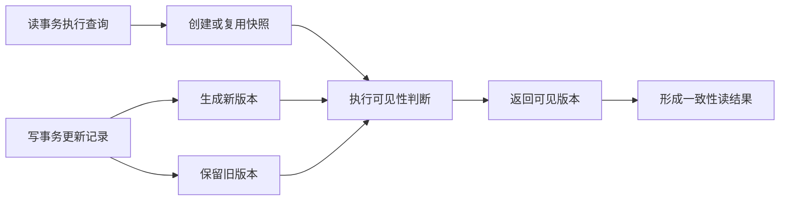
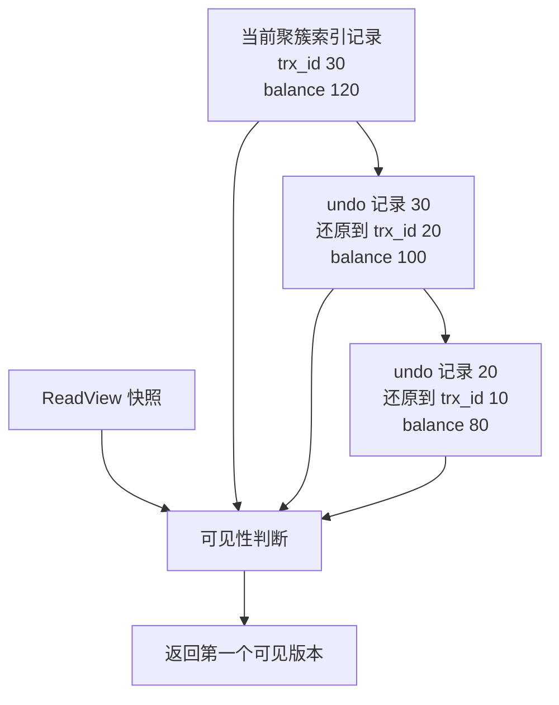
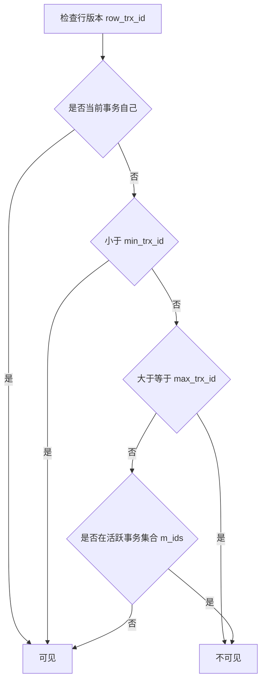
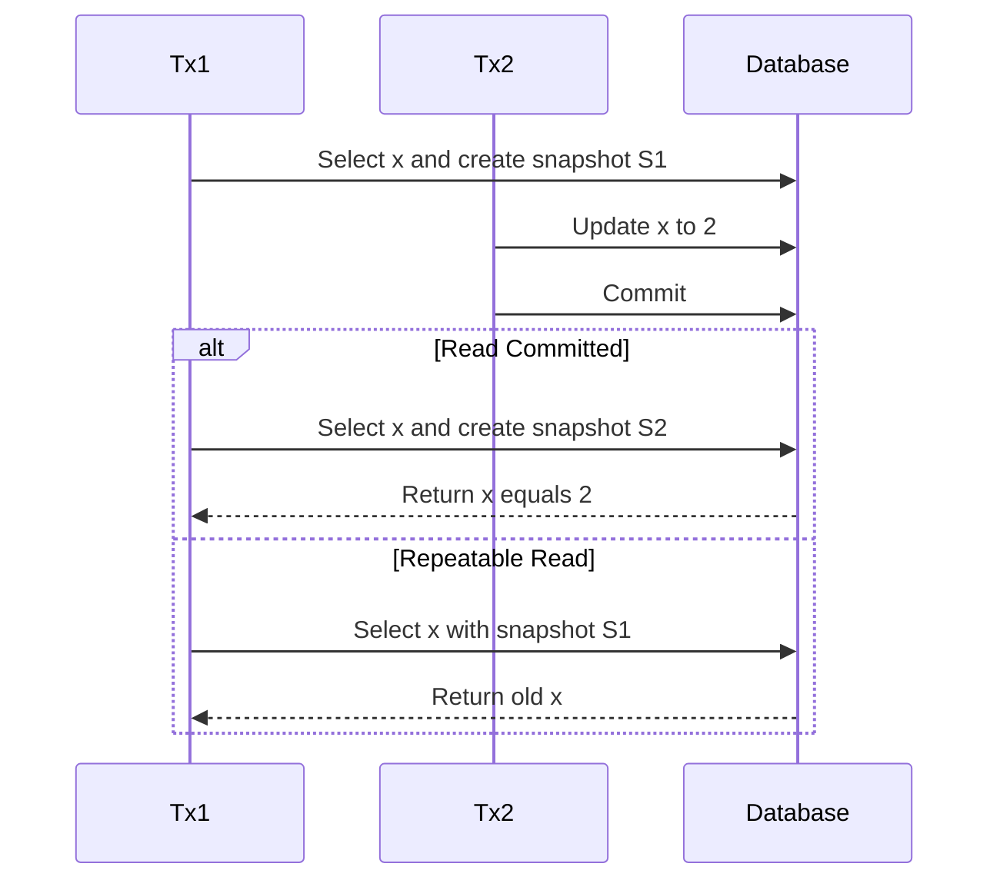
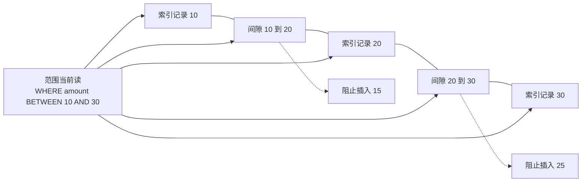
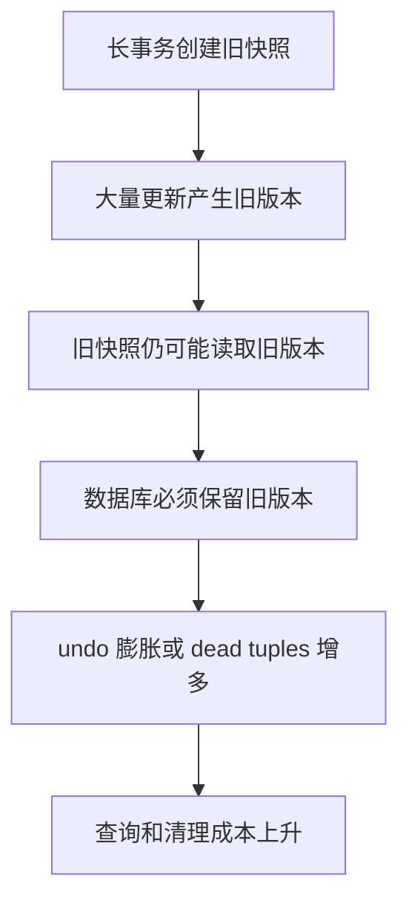
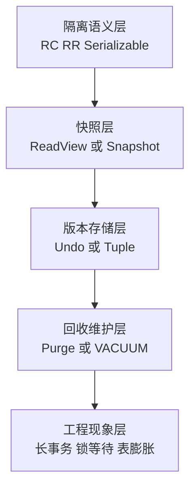

# MVCC 多版本并发控制：事务隔离、ReadView 与版本回收

> [!abstract]
> MVCC（Multi-Version Concurrency Control，多版本并发控制）的核心不是“读不加锁”这么简单，而是数据库把一行数据的历史状态保存成多个版本，再用快照可见性规则判断：**当前事务应该看见哪个版本**。它用版本空间、可见性判断和后台回收成本，换取高并发下“读写尽量不互相阻塞”的能力。

## 1. 先给结论：MVCC 解决的不是一致性全部问题，而是读写并发问题

一句话：**写事务产生新版本；读事务基于快照读取对自己可见的旧版本或新版本。**

这带来三个直接结果：

1. 普通快照读可以不等待正在写的事务提交。
2. 正在写的事务通常也不必等待普通读结束。
3. 数据库必须保留旧版本，直到没有任何活跃快照还可能读到它。

因此 MVCC 是一个典型的工程交换：

```text
更高读写并发
  = 多保存历史版本
  + 每次读做可见性判断
  + 后台清理旧版本
  + 处理长事务拖住回收的问题
```

## 2. 原理总览：一条记录为什么能有多个“现在”

从用户角度看，表里只有一行：

```sql
id = 1, balance = 100
```

但从 MVCC 视角看，这一行可能同时存在多个历史版本：

```text
逻辑行 id=1
  v3: balance=120, trx_id=30  最新提交
  v2: balance=100, trx_id=20  旧版本
  v1: balance=80,  trx_id=10  更旧版本
```

不同事务的“现在”不是同一个物理时间，而是它们各自快照定义出来的逻辑时间：

- 事务 A 的快照创建得早，只能看见 `trx_id <= 20` 的提交结果，所以读到 `v2`。
- 事务 B 的快照创建得晚，能看见 `trx_id = 30`，所以读到 `v3`。



ASCII 辅助理解：

```text
物理世界：v1 -> v2 -> v3 都还可能存在
事务快照：规定哪些 trx_id 可见
查询结果：沿版本链找到第一个可见版本
```

## 3. InnoDB 的物理实现：隐藏列、Undo Log 与版本链

InnoDB 不会简单地把每次更新后的完整旧行都复制到主表里。它采用的是“聚簇索引记录 + undo log 重建旧版本”的方式。

每行记录内部有几个关键隐藏字段：

| 组件 | 含义 | 原理作用 |
|---|---|---|
| `DB_TRX_ID` | 最后一次插入或更新该行的事务 ID | 判断这个版本由哪个事务产生 |
| `DB_ROLL_PTR` | 指向 undo log 的回滚指针 | 找到上一个旧版本所需信息 |
| `DB_ROW_ID` | InnoDB 自动生成的行 ID | 无显式聚簇索引时辅助组织记录 |

当一行从 `balance=100` 更新为 `balance=120` 时，可以近似理解为：

```text
聚簇索引当前记录：
  balance = 120
  DB_TRX_ID = 30
  DB_ROLL_PTR -> undo_30

undo_30 中保存：
  如何把 balance=120 还原成 balance=100
  并继续指向更老的 undo 记录
```

所以 InnoDB 的“版本链”不是普通链表对象，而是当前记录通过 `DB_ROLL_PTR` 串起一串 undo 记录。读事务如果发现当前版本不可见，就沿着 undo 信息重建更旧版本，再继续判断。



> [!note]
> 官方文档说明：InnoDB 是多版本存储引擎，旧版本信息保存在 undo tablespace 的 rollback segment 中；`DB_ROLL_PTR` 指向 undo log，undo log 可用于回滚，也可用于一致性读重建旧版本。

## 4. ReadView：MVCC 的“可见性判定表”

很多人学习 MVCC 时卡在 ReadView。它可以被理解为：**创建快照那一刻，数据库给当前事务拍下的一张活跃事务名单和边界表。**

常见讲解会把 ReadView 抽象成几个字段：

| 字段 | 直觉含义 |
|---|---|
| `creator_trx_id` | 创建这个 ReadView 的事务 ID |
| `m_ids` | 创建快照时仍活跃、尚未提交的事务 ID 集合 |
| `min_trx_id` | 活跃事务 ID 集合中的最小值 |
| `max_trx_id` | 下一次将要分配的事务 ID，可理解为快照高水位 |

判断某个行版本 `row_trx_id` 是否可见，可以用下面的直觉规则理解：

```text
1. 如果 row_trx_id 是当前事务自己：可见
2. 如果 row_trx_id 小于 min_trx_id：说明快照创建前已经提交，可见
3. 如果 row_trx_id 大于等于 max_trx_id：说明快照创建后才出现，不可见
4. 如果 row_trx_id 在 m_ids 中：快照创建时还没提交，不可见
5. 否则：说明快照创建前已经提交，可见
```



这套规则的本质是：

- 已经在快照之前稳定提交的版本，可以看见。
- 快照创建时还没提交的版本，不能看见。
- 快照创建之后才产生的版本，不能看见。
- 自己事务内已经写过的内容，要允许自己看见。

## 5. RC 与 RR 的根本差异：ReadView 生命周期不同

`READ COMMITTED` 和 `REPEATABLE READ` 的关键差别，不是 undo log 不同，也不是版本链不同，而是 **ReadView 创建和复用的时机不同**。

| 隔离级别 | ReadView 时机 | 结果 |
|---|---|---|
| `READ COMMITTED` | 每条普通一致性读语句创建新的 ReadView | 同一事务内两次查询可能看到不同提交结果 |
| `REPEATABLE READ` | 第一次普通一致性读创建 ReadView，后续复用 | 同一事务内多次普通查询看到稳定结果 |

下面的图已修正为 Obsidian 更容易解析的 Mermaid 写法：避免中文标点、避免消息中使用分号、参与者别名使用英文。



等价中文解读：

```text
T1 第一次 SELECT：创建快照 S1。
T2 修改 x 并提交。
如果 T1 是 RC：第二次 SELECT 会创建新快照 S2，所以能看到 T2 的提交。
如果 T1 是 RR：第二次 SELECT 继续使用 S1，所以看不到 T2 后来提交的修改。
```

这就是为什么 RR 能解决不可重复读，而 RC 不能：

- 不可重复读的定义是：同一事务内重复读取同一行，结果变了。
- RC 每条语句一个新快照，所以第二次读可以看到别人新提交的版本。
- RR 事务内复用同一快照，所以普通快照读结果稳定。

## 6. “快照读”和“当前读”：MVCC 最容易误解的边界

MVCC 主要服务于普通一致性读，例如：

```sql
SELECT * FROM account WHERE id = 1;
```

但下面这些语句通常属于当前读或锁读，需要读取最新可用状态并参与锁冲突：

```sql
SELECT * FROM account WHERE id = 1 FOR UPDATE;
UPDATE account SET balance = balance + 10 WHERE id = 1;
DELETE FROM account WHERE id = 1;
```

二者差异如下：

| 类型 | 读哪个版本 | 是否加锁 | 典型目的 |
|---|---|---|---|
| 快照读 | ReadView 可见版本 | 普通 SELECT 不加行锁 | 一致性查询、报表、普通读取 |
| 当前读 | 最新可用版本 | 可能加记录锁、间隙锁、next-key lock | 更新、删除、锁定后再处理 |

> [!warning]
> 不能简单说“MVCC 解决了幻读”。对普通快照读而言，RR 下复用快照，所以查询结果稳定；对当前读而言，InnoDB 还需要 next-key lock 或 gap lock 阻止其他事务在范围内插入新记录。

## 7. 幻读为什么需要锁：范围条件不是单行版本问题

不可重复读关注的是“同一行变了”。MVCC 很擅长解决这个问题，因为一行有版本链。

幻读关注的是“满足条件的行集合变了”。例如：

```sql
SELECT * FROM orders WHERE amount > 100 FOR UPDATE;
```

如果当前没有 `amount=150` 的行，单纯锁住已有行并不够，因为其他事务可以插入一条新的 `amount=150`。这条新行不是某条旧行的版本，而是一个新增记录。

所以 InnoDB RR 下对范围扫描使用 next-key lock：

```text
next-key lock = record lock + gap lock

record lock：锁住已有索引记录
gap lock：锁住索引记录之间的间隙，阻止插入新记录
```



这也是为什么索引设计会影响锁范围：数据库沿哪个索引扫描，就可能在哪些索引记录和间隙上加锁。

## 8. PostgreSQL：同是 MVCC，物理哲学不同

PostgreSQL 也使用 MVCC，但它更偏向把多个 tuple 版本直接留在 heap 中。每个 tuple 有类似 `xmin`、`xmax` 的事务可见性信息：

```text
xmin：创建该 tuple 的事务
xmax：删除或更新该 tuple 的事务，未删除时为空或特殊值
```

一次 UPDATE 在 PostgreSQL 中更像是：

```text
旧 tuple：标记 xmax，表示被某事务更新或删除
新 tuple：插入一条新 tuple，xmin 是更新事务
```

因此 PostgreSQL 的清理重点是 VACUUM：当旧 tuple 不再对任何事务可见时，VACUUM 回收空间、更新 visibility map，并防止事务 ID wraparound。

| 维度 | InnoDB | PostgreSQL |
|---|---|---|
| 旧版本主要位置 | undo log 中保存重建信息 | heap 中保留旧 tuple |
| 当前记录 | 聚簇索引记录保存当前版本 | 新旧 tuple 都在 heap 中直到清理 |
| 清理机制 | purge 清理不再需要的 undo | VACUUM 清理 dead tuples |
| 默认隔离级别 | `REPEATABLE READ` | `READ COMMITTED` |
| 读写互不阻塞 | 通过一致性读和 undo 重建 | 通过 tuple 可见性和快照判断 |

## 9. 长事务为什么危险：旧版本回收被“最老快照”卡住

MVCC 必须回答一个问题：旧版本什么时候可以删除？

答案是：**当系统确认没有任何活跃事务的快照还可能需要它时。**

这意味着一个很老的事务，即使只是普通查询事务，也可能阻止大量旧版本被回收。



工程上常见表现：

- InnoDB：undo tablespace 或 history list 增长，purge 追不上。
- PostgreSQL：dead tuples 增多，表膨胀，autovacuum 压力增加，甚至有 XID wraparound 风险。

## 10. 用一个完整例子串起来

假设账户余额初始为 100。

```text
时间点 1：T1 开启事务并第一次 SELECT，创建快照 S1。
时间点 2：T2 把余额更新为 120 并提交。
时间点 3：T1 再次 SELECT。
```

在 RC 下：

```text
T1 第二次 SELECT 创建新快照 S2。
S2 创建时 T2 已提交。
所以 T1 看到 balance=120。
```

在 RR 下：

```text
T1 第二次 SELECT 复用 S1。
S1 创建时 T2 尚未提交。
所以 T2 产生的新版本对 S1 不可见。
T1 沿版本链回到 balance=100。
```

如果 T1 执行的是：

```sql
SELECT * FROM account WHERE id = 1 FOR UPDATE;
```

那就不是单纯快照读了。数据库需要处理当前版本、锁等待、写写冲突，而不是只返回旧快照中的版本。

## 11. Java / MyBatis 开发者实践清单

| 场景 | 建议 |
|---|---|
| Service 方法上加了 `@Transactional` | 确认事务范围，不要包住远程调用、用户交互、长时间计算 |
| 分页导出或大报表 | 避免一个事务跑太久，必要时分批提交或使用只读副本 |
| 使用 `SELECT ... FOR UPDATE` | 确保 where 条件命中合适索引，避免锁范围扩大 |
| 出现死锁或锁等待 | 同时检查当前读 SQL、索引、事务顺序和隔离级别 |
| 看到“RR 下查不到最新数据” | 先判断是否复用了旧 ReadView，提交事务后再读可获得新快照 |
| PostgreSQL 报 serialization failure | 应用层设计可重试事务，不能把它当普通异常忽略 |

## 12. 研究结论

MVCC 可以分成四层理解：



最重要的判断公式：

> [!tip]
> 看到事务读到“旧值”或“两次读不一样”时，不要先怀疑数据库异常。先问四个问题：隔离级别是什么？ReadView 是语句级还是事务级？这条 SQL 是快照读还是当前读？是否有长事务拖住旧版本回收？

## 参考资料

- MySQL 8.0 Reference Manual — [InnoDB Consistent Nonlocking Reads](https://dev.mysql.com/doc/refman/8.0/en/innodb-consistent-read.html)
- MySQL 8.0 Reference Manual — [InnoDB Multi-Versioning](https://dev.mysql.com/doc/refman/8.0/en/innodb-multi-versioning.html)
- MySQL 8.0 Reference Manual — [InnoDB Transaction Isolation Levels](https://dev.mysql.com/doc/refman/8.0/en/innodb-transaction-isolation-levels.html)
- MySQL 8.4 Reference Manual — [InnoDB Locking](https://dev.mysql.com/doc/refman/8.4/en/innodb-locking.html)
- PostgreSQL 18 Documentation — [MVCC Introduction](https://www.postgresql.org/docs/current/mvcc-intro.html)
- PostgreSQL 18 Documentation — [Transaction Isolation](https://www.postgresql.org/docs/current/transaction-iso.html)
- PostgreSQL 18 Documentation — [Routine Vacuuming](https://www.postgresql.org/docs/current/routine-vacuuming.html)
