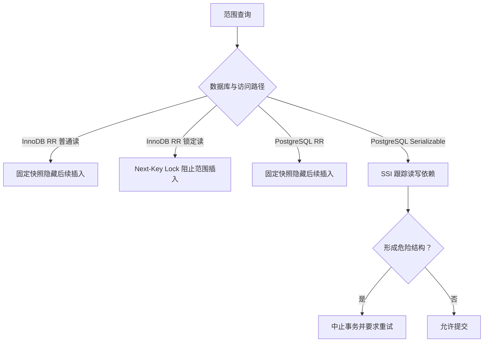
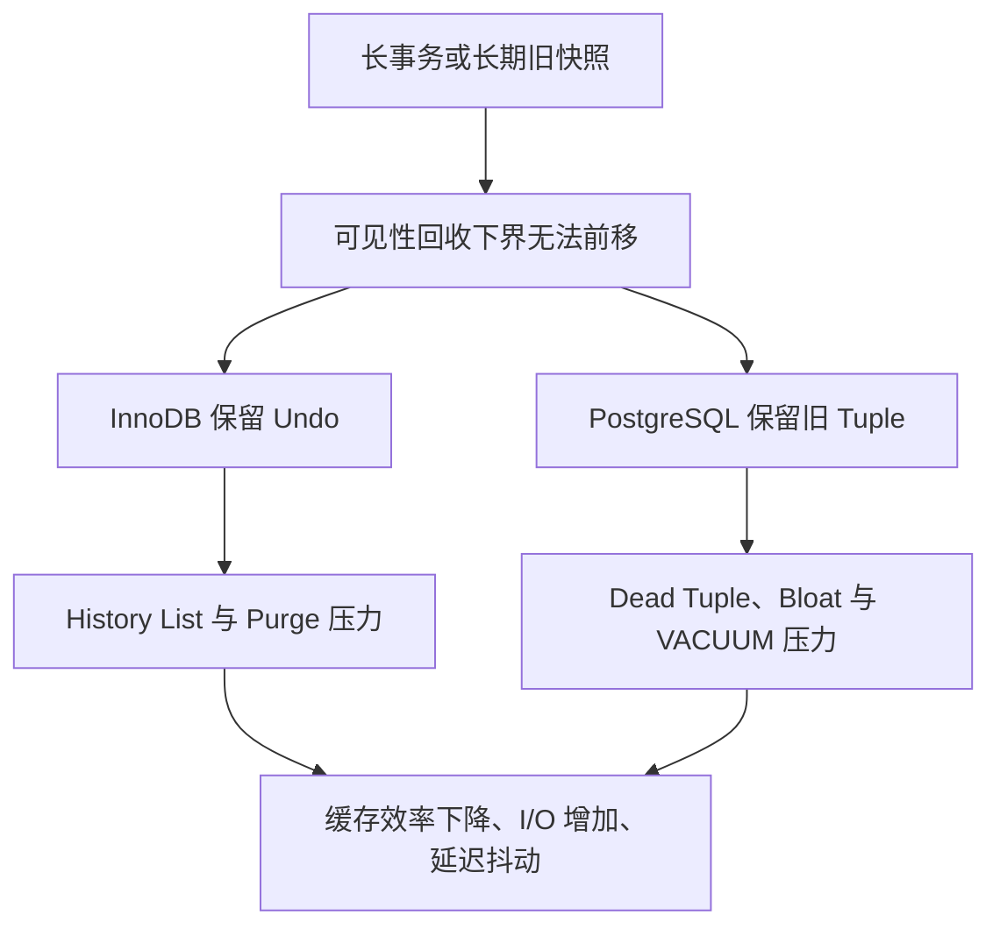
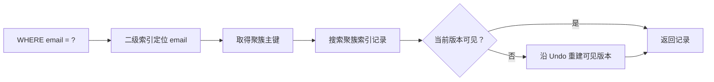
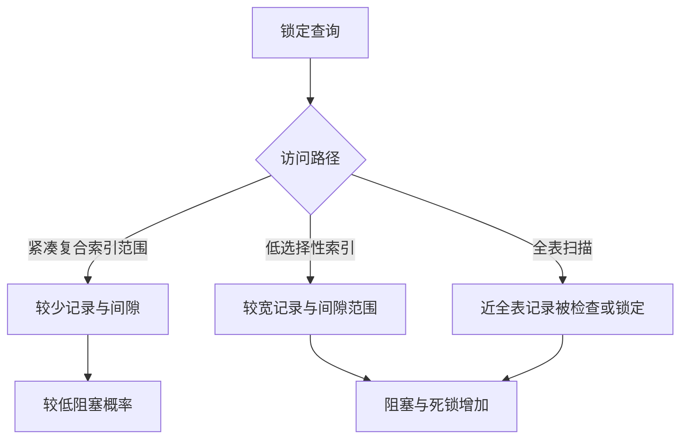

# MVCC 深度解析：从版本可见性到 MySQL 与 PostgreSQL 的设计哲学

> [!abstract] 一句话模型
> **多版本并发控制（Multi-Version Concurrency Control，MVCC）不是“数据库不加锁”，而是把“读写互斥”改写为“读哪个版本”。** 它用版本空间、可见性判断和后台回收换取读写并发；但写写冲突、业务约束和真正的可串行化仍需要锁、约束、冲突检测或事务重试。

> [!info] 范围与版本
> 本文以 MySQL InnoDB 8.4/9.x 与 PostgreSQL 18 为基线，研究截至 2026-07-24。不同数据库即使使用同名隔离级别，也不保证行为完全相同。

## 1. 为什么数据库需要 MVCC

假设事务 A 正在读取余额，事务 B 同时更新余额。最直接的办法是加锁：A 读时阻塞 B，或 B 写时阻塞 A。它容易推理，却把数据库变成一条窄桥——读多写多时，大量事务都在等待。

MVCC 的回答是：

1. 更新不立刻抹掉旧事实，而是产生一个新版本；
2. 事务携带一个快照（Snapshot）或可见性边界；
3. 读操作根据该边界选择自己应该看到的版本；
4. 当旧版本不再可能被任何活动快照访问时，再回收它。


这里有四个必须同时成立的不变量：

- **原子性**：事务不能暴露半完成状态；
- **可见性一致**：同一快照必须按同一规则判断版本；
- **提交顺序可解释**：不能看到未提交版本，也不能凭空跳过应可见版本；
- **安全回收**：只要仍有快照可能读取旧版本，就不能清理它。

因此，MVCC 的本质不是“复制数据”，而是一个由 **版本、快照、可见性、冲突处理、生命周期回收** 组成的协议。

## 2. 不要把 Git 类比当成真实机制

Git 类比能帮助入门：事务像从某个提交点分叉，后续只看到自己的基线和本事务修改。但类比到这里就应停止：

- 数据库事务不会像 Git 那样在提交时进行人工 merge；
- 两个事务写同一行时，数据库通常通过行锁、等待或中止处理；
- 两个事务写不同的行，也可能共同破坏一个跨行业务约束；
- 快照只规定“看见什么”，并不自动证明结果等价于串行执行。

更准确的心智模型是：**快照是一副过滤眼镜，版本链是历史事实，锁或冲突图决定多个作者能否同时提交。**

## 3. 一个统一的可见性模型

为便于理解，可以把每个版本抽象为：

```text
Version = {
  creator_tx,      // 谁创建
  remover_tx,      // 谁删除或替代
  payload,         // 数据
  previous         // 可能的旧版本入口
}

Snapshot = {
  已完成事务边界,
  拍摄时仍活跃的事务集合,
  当前事务自身身份
}
```

一次读取大致回答：

1. 创建该版本的事务是否已提交？
2. 它是否在我的快照边界之前提交？
3. 删除或替代它的事务，对我的快照是否已经生效？
4. 这个版本是否由当前事务自己产生？

具体字段和算法在 InnoDB 与 PostgreSQL 中不同，但问题集合相同。

## 4. MySQL InnoDB：当前行在前，历史藏在 Undo

### 4.1 物理组织

InnoDB 聚簇索引记录包含隐藏系统列，其中最关键的是：

- `DB_TRX_ID`：最近创建或修改该记录的事务标识；
- `DB_ROLL_PTR`：指向 Undo Log 中的历史重建信息；
- 无显式主键时还可能有 `DB_ROW_ID`。

聚簇记录可以原地更新，Undo Log 保存重建旧版本所需的信息。当前记录对 ReadView 不可见时，InnoDB 沿 `DB_ROLL_PTR` 向后恢复历史版本。

```text
聚簇索引当前记录
┌──────────────┬───────────┬─────────────┐
│ row payload  │ DB_TRX_ID │ DB_ROLL_PTR │
└──────────────┴───────────┴──────┬──────┘
                                  ▼
                         undo(v2 -> v1)
                                  ▼
                         undo(v1 -> v0)
```

这不等于 Undo 保存每一行的完整副本。Undo 往往只保存恢复旧值所需的信息，因此不能简单说“MySQL 用完整旧行换读性能”。

### 4.2 ReadView 的生命周期

- **READ COMMITTED（RC）**：每次普通一致性读建立新快照；两次 `SELECT` 可以看到其间已经提交的新数据。
- **REPEATABLE READ（RR）**：默认在第一次普通一致性读时建立快照，后续一致性读复用它。
- `BEGIN` 本身通常不等于快照已经建立；`START TRANSACTION WITH CONSISTENT SNAPSHOT` 可显式提前建立一致性快照。

> [!danger] 原日报勘误
> “MySQL 的快照在每条语句独立取”只适用于 InnoDB 的 RC 普通一致性读，不适用于默认 RR。RR 下，同一事务的普通一致性读通常复用第一次一致性读创建的 ReadView。

### 4.3 普通读与当前读不是同一世界

普通 `SELECT` 通常走一致性快照读；`UPDATE`、`DELETE`、`SELECT ... FOR UPDATE`、`SELECT ... FOR SHARE` 则需要锁定并面对更新后的记录状态。

因此，一个 RR 事务可能出现看似奇怪的现象：普通 SELECT 仍看到旧快照，随后锁定读却基于更新后的当前状态工作。设计事务时不能把“RR 的旧快照”外推到所有 SQL。

### 4.4 二级索引的特殊性

InnoDB 二级索引项没有聚簇记录上的完整 MVCC 隐藏字段。发生更新时，旧索引项可能被删除标记，并插入新索引项。若可见性不确定，引擎需要回到聚簇索引检查事务信息，必要时再沿 Undo 重建版本。

这意味着“覆盖索引必然不用回表”并非无条件真理：MVCC 可见性也会影响访问路径。

## 5. PostgreSQL：版本直接共存于 Heap

### 5.1 新 Tuple，而不是 InnoDB 式 Undo 链

PostgreSQL 的 UPDATE 通常创建一个新的 Heap Tuple，旧 Tuple 保留，并通过 tuple header 中的 `xmin`、`xmax` 等事务信息表达生命周期。索引项通常指向 Heap 中的 TID；读取时结合 Snapshot 判断候选 Tuple 是否可见。

```text
Heap Page
┌─────────────┬─────────────┬─────────────┐
│ tuple v1    │ tuple v2    │ free space  │
│ xmin=100    │ xmin=120    │             │
│ xmax=120    │ xmax=0      │             │
└─────────────┴─────────────┴─────────────┘
```

它没有 InnoDB 风格的历史版本 Undo 链，但绝不意味着“没有旧版本成本”。旧 Tuple 会形成 dead tuple，并由 pruning、VACUUM 与 autovacuum 负责清理或标记为可复用空间。

### 5.2 HOT：减少索引写放大，不是原地更新

堆内元组（Heap-Only Tuple，HOT）优化需要满足两个核心条件：

1. 更新通常没有改变普通索引引用的列；
2. 新 Tuple 能放进旧 Tuple 所在的 Heap Page。

满足时，新版本仍然是新的 Tuple，但可以避免为普通索引创建新的索引项，并通过同页 HOT 链找到可见版本。HOT 可以减少索引膨胀与写放大，却不能消灭 dead tuple，也不能替代 VACUUM。

影响 HOT 的工程变量包括：

- 是否频繁更新索引列；
- 页面是否保留足够空闲空间；
- 表的 `fillfactor`；
- 行宽与更新频率；
- autovacuum 是否及时。

### 5.3 Snapshot 生命周期

- **READ COMMITTED**：每条语句获取新快照；
- **REPEATABLE READ**：以事务内第一条非事务控制语句开始时为快照边界；这条语句可以是查询，也可以是数据修改语句；
- PostgreSQL 的默认隔离级别是 RC，而 MySQL InnoDB 通常默认 RR。

> [!tip] 对原思考题的答案
> PostgreSQL RR 中，同一事务内两次 `SELECT COUNT(*)` 不会因为其他事务在中间提交而返回不同结果；本事务自己的修改除外。这不违反 RR，反而是其事务级快照语义。需要修正的是 Hint 中对 MySQL RR 的描述。

## 6. 幻读其实有三种问题

“防止幻读”常被混成一句话，但至少要拆成三个问题：

1. **重复查询的结果集是否变化？**
2. **其他事务是否被禁止向范围内插入？**
3. **最终结果是否等价于某种串行执行？**



### 6.1 InnoDB 的两条路径

- 普通一致性读不加 Gap Lock；RR 靠固定快照让后插入记录不可见。
- 锁定范围读、UPDATE、DELETE 会沿索引范围使用记录锁、间隙锁（Gap Lock）或临键锁（Next-Key Lock），阻止其他事务在受保护范围内插入。

索引决定扫描范围，也决定锁范围。缺失合适索引可能让锁定范围扩大，增加阻塞与死锁。

### 6.2 PostgreSQL 的两条路径

- RR 通过固定 Snapshot 隐藏后来提交的行，但不会为了普通读取阻塞插入；
- Serializable 使用可串行化快照隔离（Serializable Snapshot Isolation，SSI）记录读写依赖。`SIReadLock` 更像冲突证据，不像 InnoDB Gap Lock 那样直接阻塞写入。系统发现危险结构后会中止事务，要求应用重试。

所以：**同样是“第二次查询没看到幻行”，背后的并发哲学可能完全不同。**

## 7. 写偏斜：为什么快照一致仍会业务错误

值班表要求至少一名医生处于 `on_call=true`。Alice 和 Bob 同时读取：

```text
T1 看见 Bob 在值班  ──▶ 把 Alice 改为 off
T2 看见 Alice 在值班 ──▶ 把 Bob 改为 off
```

两者修改不同的行，没有直接写写冲突；但提交后无人值班。每个事务读到的快照都自洽，组合结果却无法对应任何合法串行顺序。

这揭示了 MVCC 的边界：

- 行级版本冲突无法自动表达“至少一行满足谓词”这类跨行约束；
- PostgreSQL RR 允许此类序列化异常，Serializable/SSI 可检测并中止一个事务；
- MySQL RR 的普通快照读也不能自动把业务谓词变成范围保护，需要锁定读、合适索引、显式锁、可表达的数据库约束或更高隔离策略。

可选方案按优先级考虑：

1. 把业务不变量编码为数据库约束；
2. 把多行约束收敛到一条可锁定的“聚合/守卫行”；
3. 在正确索引上使用锁定读；
4. 使用 Serializable，并实现整事务重试；
5. 最后才考虑分布式锁，而且仍需防止锁与数据库事务失配。

## 8. 丢失更新：问题常在 Java 的读改写模式

下列两种写法语义不同：

```sql
-- 数据库内原子相对更新
UPDATE account SET balance = balance - 100 WHERE id = ? AND balance >= 100;

-- 应用先读、Java 计算、再绝对覆盖
UPDATE account SET balance = ? WHERE id = ?;
```

第二种方式即使处于 RR，也可能把另一个事务的结果覆盖掉。跨 MySQL/PostgreSQL 更稳妥的做法是：

- 优先单条条件更新；
- 或 `SELECT ... FOR UPDATE` 后再更新；
- 或使用 `version` 列进行乐观锁：`WHERE id=? AND version=?`；
- 检查 `affected_rows`，失败后重读并重试；
- 不要只重放最后一条 SQL，应重试整个事务函数。

## 9. Purge 与 VACUUM：版本债务终究要偿还

| 维度 | MySQL InnoDB | PostgreSQL |
|---|---|---|
| 当前/新版本位置 | 聚簇索引当前记录 | Heap 新 Tuple |
| 历史版本位置 | Undo / Rollback Segment | Heap 旧 Tuple |
| 历史读取 | 沿 Undo 重建 | 按 Snapshot 选择 Tuple |
| 清理机制 | Purge | pruning + VACUUM/autovacuum |
| 长事务影响 | Undo、History List、Purge Lag 增长 | Dead Tuple、Bloat、VACUUM/XID Horizon 压力 |
| 普通空间回收 | 清理不再需要的 Undo 和删除标记记录 | 通常标记为表内可复用，不直接归还操作系统 |
| 激进收缩 | 依 Undo Tablespace 等策略 | `VACUUM FULL` 重写表并持有强锁 |

长事务的危险不只在“占连接”。它把全局可见性下界钉在过去，使数据库不敢回收旧版本。



## 10. MySQL vs PostgreSQL：设计哲学不是谁更先进

原日报把差异概括为“MySQL 用空间换快读，PostgreSQL 用读换低膨胀”，这个结论不成立。PostgreSQL 恰恰需要认真治理 Heap/Index Bloat；InnoDB 读取旧快照也可能沿 Undo 重建，并非所有读都更快。

更准确的哲学对比是：

### InnoDB：当前态中心化

- 聚簇索引优先承载当前记录；
- 历史差异放入 Undo；
- 锁定范围操作常通过 Next-Key Lock 直接阻止冲突；
- 复杂度集中在 Undo、Purge、聚簇/二级索引协作和锁范围。

### PostgreSQL：版本显式化

- 新旧 Tuple 在 Heap 中共存；
- HOT、pruning、VACUUM 控制写放大和版本债务；
- Serializable 倾向于先允许并发，再用 SSI 检测危险依赖并中止；
- 复杂度集中在 Heap 版本、索引 TID、VACUUM、Bloat、XID 生命周期和事务重试。

| 决策维度 | MySQL InnoDB | PostgreSQL |
|---|---|---|
| 默认隔离级别 | 通常 RR | 通常 RC |
| RR 快照时点 | 第一次普通一致性读 | 第一条非事务控制语句 |
| 范围并发哲学 | 锁定读可悲观阻止插入 | RR 不阻止插入；Serializable 以 SSI 检测依赖 |
| 更新版本 | 当前聚簇记录 + Undo | 新 Heap Tuple + 旧 Tuple |
| 索引更新优化 | 聚簇/二级索引专门路径 | HOT 避免部分普通索引更新 |
| 典型应用责任 | 控制索引与锁范围，处理死锁/超时 | 维护 VACUUM/HOT，处理 `40001` 重试 |

二者都遵循同一工程规律：**并发复杂度不会消失，只会被移动。**

## 11. Java / Spring / MyBatis 最佳实践

### 11.1 事务边界

- 事务内不要等待 RPC、消息、人工输入或大文件处理；
- 避免 `idle in transaction`；
- 分页报表与批处理优先分段，确需同一快照时明确评估版本保留成本；
- 不要假定 `@Transactional` 默认值等于数据库默认值，核对 Spring、连接池和数据源配置。

### 11.2 并发更新

- 计数器、扣减、状态迁移优先写成单条原子条件 SQL；
- 乐观锁必须检查影响行数；
- 悲观锁查询必须有合适索引，并保持固定加锁顺序；
- 业务约束优先落到唯一约束、检查约束、外键或守卫行，而不是只写在 Java `if` 中。

### 11.3 重试语义

```text
retry transaction:
  begin
  read all decision inputs
  validate invariant
  write
  commit
on retryable conflict:
  rollback
  backoff + jitter
  rerun from begin
```

- PostgreSQL 重点识别 SQLSTATE `40001`，死锁通常为 `40P01`；
- MySQL 需要处理 deadlock victim 与 lock wait timeout；
- 重试必须有次数上限、指数退避和抖动；
- 整个业务操作必须幂等，尤其是事务外消息、RPC 与支付动作；
- 不能只重试最后一条 UPDATE，因为原先读取的决策输入已经过期。

### 11.4 观测指标

**InnoDB：**

- 长事务与锁等待；
- History List Length；
- Undo Tablespace 使用；
- Purge Lag；
- 死锁日志与范围锁扫描量。

**PostgreSQL：**

- `pg_stat_activity` 中的长事务与 `idle in transaction`；
- dead tuples、表/索引膨胀；
- autovacuum 执行与滞后；
- HOT Update 比率；
- replication slot、prepared transaction 对回收边界的影响；
- `40001` 与 `40P01` 发生率。

## 12. 常见误区勘误

1. **MVCC 等于无锁**：错。普通读写可减少互斥，写写冲突、DDL、锁定读仍需要锁或冲突处理。
2. **RR 等于 Serializable**：错。固定快照仍可能发生写偏斜等序列化异常。
3. **InnoDB RR 全靠 Gap Lock 防幻读**：错。普通读靠固定快照；锁定范围操作才使用 Gap/Next-Key Lock。
4. **PostgreSQL RR 会出现两次 COUNT 不同**：对其他事务提交而言错；同一事务自己的修改仍可见。
5. **HOT 是原地更新**：错。它仍创建新 Heap Tuple，只是满足条件时避免新增普通索引项。
6. **PostgreSQL 没 Undo，所以没有版本膨胀**：错。成本转移到 Heap、索引、VACUUM 与 XID 生命周期。
7. **隔离级别能修复所有丢失更新**：错。应用层“先读后绝对覆盖”仍需原子 SQL、锁或版本列。
8. **提高隔离级别就不用重试**：错。更强隔离常把错误结果变成显式中止，应用必须重试整个事务。

## 13. 延伸：从 MVCC 继续理解数据库内核

### 13.1 WAL 与 MVCC 分工

MVCC 回答“并发事务看见哪个版本”，预写日志（Write-Ahead Logging，WAL）回答“崩溃后如何恢复已经承诺的状态”。前者解决并发可见性，后者解决持久性与崩溃一致性，两者不能相互替代。

### 13.2 索引不是 MVCC 的旁路，而是它的物理执行层

很多文章先讲 MVCC，再把索引当成“查询加速器”单独介绍，这会产生三个危险误解：

1. 索引命中就等于找到了可见行；
2. 覆盖索引就等于物理上绝不回表；
3. 索引只影响性能，不影响并发正确性。

更准确的模型是：

```text
SQL 谓词
   ↓
访问路径选择
   ↓
索引定位候选版本
   ↓
MVCC 可见性验证
   ↓
必要时访问基表 / 聚簇记录 / 历史版本
   ↓
锁定范围、冲突依赖、返回结果
```

索引回答“候选记录可能在哪里”；MVCC 回答“这个候选版本能否被当前事务看到”；锁或 SSI 回答“并发事务能否继续提交”。三者共同决定一次查询的真实语义。

> [!important] 三个不能混用的命题
> - **索引命中**：优化器使用索引定位候选项。
> - **查询列被覆盖**：返回列在索引记录中已经存在。
> - **实际零基表访问**：每个候选项都无需访问聚簇索引或 Heap 完成可见性判断。
>
> 前两项成立，不保证第三项成立。

#### 13.2.1 B+Tree 为什么适合数据库索引

数据库常说 B-tree，工程实现通常具有 B+Tree 的关键性质：内部节点负责导航，叶子节点保存有序索引项，叶子页之间可按键范围遍历。

```text
                    ┌──────────────┐
                    │  内部页       │
                    │  20 | 50     │
                    └───┬────┬─────┘
                        │    │
             ┌──────────┘    └──────────┐
             ▼                           ▼
      ┌─────────────┐             ┌─────────────┐
      │ 叶子页       │ ─────────▶ │ 叶子页       │
      │ 20 25 31    │             │ 50 66 80    │
      └─────────────┘             └─────────────┘
```

它解决的是外存模型中的核心矛盾：一次页 I/O 比页内比较昂贵得多，因此索引需要高扇出、较低树高，并让范围扫描顺着叶子页前进。由此也能推导出几个工程结论：

- 键越宽，单页容纳的索引项越少，树可能更高，缓存命中率也可能下降；
- 随机插入会把写入分散到更多叶页，并更容易触发页分裂；
- 页分裂不只是“多一个页”，还可能引入 Redo/WAL、父节点更新、缓存扰动和更长的持锁时间；
- 索引中尚未安全回收的旧版本或删除标记，会占用本可用于新键的空间。

所以，索引与 MVCC 的连接点是：**MVCC 延长版本寿命，版本寿命改变叶页空间，叶页空间又影响分裂、缓存与写放大。**

#### 13.2.2 InnoDB：两棵树之间完成一次二级索引读取

InnoDB 的聚簇索引叶子保存完整行。聚簇键选择顺序是：显式主键、首个所有列均为 `NOT NULL` 的唯一索引、最后才是隐藏聚簇键。二级索引叶子则保存：

```text
secondary_key + clustered_primary_key
```

它不保存稳定的物理行地址，而是使用主键再次查找聚簇索引：



这里有两个重要推论。

**第一，主键宽度会被所有二级索引放大。** 一个很宽的业务主键，不只让聚簇索引变宽，还会作为行定位后缀进入每个二级索引。评估主键成本时，应近似考虑：

```text
主键额外成本 ≈ 主键宽度 × 二级索引记录数量
```

这不是精确容量公式，却能提醒我们：主键应优先短、稳定，并根据写入模型选择具有足够局部性的键。随机 UUID 并非绝对错误，自增键也并非绝对最优；前者可能增加随机页写与分裂，后者在极端并发下可能形成最右叶页热点，最终要用目标负载验证。

**第二，修改主键通常是高代价操作。** 因为主键同时承担二级索引中的行定位身份，主键变化会影响所有二级索引，而不只是某一列值发生变化。

#### 13.2.3 为什么 InnoDB 覆盖索引仍可能回聚簇索引

普通的“覆盖索引”解释只讨论列是否齐全，却忽略了版本是否可见。InnoDB 二级索引记录没有聚簇记录上等价的 `DB_TRX_ID`、`DB_ROLL_PTR`，不能独立沿 Undo 重建完整历史版本。

当二级索引项被删除标记，或相关索引页可能包含比当前快照更新的事务修改时，引擎可能仍需回到聚簇索引：

```text
二级索引已覆盖 SELECT 列
          │
          ▼
索引候选项的可见性是否可安全确定？
    ├─ 是：可以直接返回索引中的值
    └─ 否：回聚簇索引检查 DB_TRX_ID
                    │
                    └─ 必要时沿 DB_ROLL_PTR 查 Undo
```

因此，MySQL 执行计划中的 `Using index` 应理解为“具备覆盖访问路径”，而不是对“每个候选项都零聚簇访问”的绝对承诺。索引条件下推（Index Condition Pushdown，ICP）仍然有价值：它能先在二级索引中过滤大量不匹配项；只是匹配项在 MVCC 不确定时仍可能回聚簇验证。

#### 13.2.4 InnoDB 更新索引列与非索引列为何成本不同

假设存在：

```sql
KEY idx_status_created_at(status, created_at)
```

更新不在该索引中的列时，聚簇记录和 Undo 需要变化，但 `idx_status_created_at` 的逻辑键通常不需要删除并重插。更新 `status` 或 `created_at` 时，则要维护两份索引状态：

```text
旧二级索引项 ── delete-mark
新二级索引项 ── insert
旧项          ── 等待所有可能读取它的快照结束
旧项          ── Purge 后物理清理
```

“提交”只说明新逻辑状态生效，不等于旧索引项立即从页中消失。长事务会延迟安全回收点，使删除标记和旧版本继续占据页空间，间接放大扫描、缓存和页分裂成本。

这也是“少建索引”不够准确的原因。真正的问题是：**每个索引带来的读收益，是否大于它对写路径、版本回收和缓存造成的长期成本。**

#### 13.2.5 PostgreSQL：索引指向 TID，可见性仍在 Heap

PostgreSQL 普通 B-tree 索引项保存键值与 Heap Tuple Identifier（TID）：

```text
B-tree key ──▶ TID(block, offset) ──▶ Heap Tuple
                                         │
                                         ├─ xmin/xmax
                                         └─ Snapshot 可见性判断
```

普通 Index Scan 找到的只是候选 TID。执行器访问 Heap 后，才结合 Tuple Header 与 Snapshot 判断版本是否可见。这与 InnoDB 的差异不是“一个有回表、一个没回表”，而是版本权威位置不同：

- InnoDB 当前行及 MVCC 入口在聚簇索引，历史差异在 Undo；
- PostgreSQL 行版本与可见性信息在 Heap，普通索引主要提供 TID 入口。

#### 13.2.6 HOT：索引写放大的关键优化及其边界

PostgreSQL 的堆内元组（Heap-Only Tuple，HOT）不是原地更新。它仍创建新 Heap Tuple，只是在满足以下条件时避免为普通索引创建新的索引项：

1. 没有修改任何被普通索引引用的列；
2. 新 Tuple 能放在旧 Tuple 所在的 Heap Page。

```text
索引项
  │
  ▼
Heap v1 ──HOT──▶ Heap v2 ──HOT──▶ Heap v3
```

索引仍指向 HOT 链的根 TID，执行器在页内找到对当前快照可见的版本。HOT 同时减少索引写入和索引膨胀，并让页内 pruning 更早清理不再需要的中间版本。

但有四个常见边界：

- 只改非索引列，也可能因同页空间不足而无法 HOT；
- `INCLUDE` 列仍是索引引用列，更新它会破坏该索引相关的 HOT 条件；
- 降低 `fillfactor` 可为同页更新预留空间，却会增加表的初始体积；
- HOT 只能减少索引版本，不会消灭 Heap 中的新 Tuple，也不能替代 VACUUM。

更隐蔽的成本是：一次非 HOT 更新即使没有改变某个索引的逻辑键值，也可能需要为新物理行版本生成后继索引项。因此，新增一个“只为偶发查询服务”的索引，也可能降低整张表的 HOT 命中率并增加 WAL、缓存与 VACUUM 压力。

#### 13.2.7 PostgreSQL Index-Only Scan 为什么仍会 Heap Fetch

PostgreSQL 真正跳过 Heap 访问，需要同时满足：

1. 索引类型能够返回查询所需的原始值；
2. 查询列全部存在于索引键或 `INCLUDE` 列中；
3. 候选 Tuple 所在 Heap Page 在可见性映射（Visibility Map，VM）中被标记为 `all-visible`。

VM 是按 Heap Page 维护的保守摘要：数据修改会清除相应位，VACUUM 在确认页面中所有 Tuple 对所有事务可见后设置它。于是：

```text
Index-Only Scan 候选 TID
        │
        ▼
VM: Heap Page 是否 all-visible？
   ├─ 是：直接使用索引值
   └─ 否：访问 Heap，检查 Tuple 可见性
```

这解释了为什么执行计划节点写着 `Index Only Scan`，运行时仍可能出现 `Heap Fetches > 0`。正确的验证方式不是只看节点名，而是执行：

```sql
EXPLAIN (ANALYZE, BUFFERS)
SELECT ...;
```

高频更新表的 VM 位会频繁被清除；即使建立很宽的覆盖索引，也可能持续访问 Heap。`INCLUDE` 还会增加索引宽度、可能破坏 HOT，并使该 B-tree 索引无法使用 deduplication。因此覆盖索引更适合读取频繁、更新较少、all-visible 比例较高的场景，而不是“看到回表就补齐所有列”。

#### 13.2.8 B-tree Deduplication 能做什么，不能做什么

PostgreSQL 13 起支持 B-tree 去重（Deduplication），PostgreSQL 18 默认启用。它可以把同一叶页上具有相同索引键的多个索引项压缩为：

```text
key + posting list[TID1, TID2, TID3, ...]
```

它的价值是压缩重复键、延缓页分裂，并缓解部分版本抖动造成的索引空间压力。但它不改变以下事实：

- Heap 中仍然存在多个 Tuple 版本；
- VACUUM 与 bottom-up deletion 仍然必要；
- 更新改变索引键时，新旧键不同，去重通常帮不上忙；
- 带 `INCLUDE` 的索引不能使用 B-tree deduplication。

所以 Deduplication 是索引页空间优化，不是 MVCC 垃圾回收机制。

#### 13.2.9 索引为什么会改变锁范围与序列化冲突

在 InnoDB 中，锁定读、`UPDATE`、`DELETE` 锁的是执行计划实际扫描到的索引记录和间隙，而不是 Java 代码中抽象的 `WHERE` 语义。

例如：

```sql
SELECT *
FROM orders
WHERE tenant_id = ?
  AND status = 'PENDING'
  AND created_at < ?
FOR UPDATE;
```

若存在 `(tenant_id, status, created_at)`，扫描可被收敛到一个租户、一个状态和一个时间范围。若只有低选择性的 `status` 单列索引，查询可能扫描并锁定大量其他租户的记录与间隙；若没有可用索引而退化为全表扫描，锁冲突范围可能接近整表。



完整唯一索引等值查询通常只锁记录本身，不锁前方间隙；非唯一条件与范围条件则更容易形成 Gap/Next-Key Lock。通过二级索引加排他锁时，还可能锁定对应的聚簇记录。

PostgreSQL Serializable 的 `SIReadLock` 哲学不同：它通常不直接阻塞写入，而是记录读取依赖。访问路径仍然影响谓词锁粒度：精确索引扫描可获得较细粒度的页级或 Tuple 级证据；顺序扫描需要 relation-level predicate lock；锁数量过多时还可能提升为更粗粒度。粗粒度不会像 Gap Lock 那样直接挡住插入，但会增加假阳性依赖和 `40001` 序列化失败概率。

因此，索引不仅改变复杂度，也改变并发冲突图。

#### 13.2.10 复合索引不能只背“最左前缀”

复合索引设计应从完整访问路径反推：

1. 哪些列用于等值收窄，例如 `tenant_id`；
2. 哪些列用于低基数状态分组，例如 `status`；
3. 哪一列开始范围扫描，例如 `created_at`；
4. 是否需要满足排序、分页或锁定顺序；
5. 这个顺序会扫描并锁定多少候选项。

经验模型通常是“前导等值列 + 第一个范围列”最能收窄 B-tree 扫描，但不能脱离数据分布机械套公式。PostgreSQL 18 的成本驱动 Skip Scan 在前导列不同值较少时，可能通过多次内部搜索利用后续列条件；它是特定场景优化，不是错误列顺序的普遍补救。MySQL 也应以真实 `EXPLAIN` 和绑定参数验证可用前缀，而不是只凭索引定义猜测。

低选择性索引同样不是绝对无用。`status` 单列可能过滤能力很弱，但 `(tenant_id, status, created_at)` 可以同时收窄租户边界、业务状态和时间范围。真正应评估的是联合分布与实际扫描量。

#### 13.2.11 Java / MyBatis 索引审查清单

**Schema 与主键**

- [ ] InnoDB 主键是否短、稳定，是否估算过它被复制到所有二级索引后的成本？
- [ ] UUID 的局部性、页分裂和并发热点是否以目标负载实测，而非靠口号判断？
- [ ] PostgreSQL 是否避免把高频更新列随意加入普通索引或 `INCLUDE`？
- [ ] 新增索引前是否评估 PostgreSQL HOT 命中率与 InnoDB 二级索引维护成本？

**查询路径**

- [ ] 是否使用真实绑定参数执行 `EXPLAIN`，而不是只检查 Mapper SQL 模板？
- [ ] MySQL 是否检查 `key`、`key_len`、`rows`、`filtered`、`Extra`？
- [ ] PostgreSQL 是否使用 `EXPLAIN (ANALYZE, BUFFERS)` 检查实际行数、缓冲命中和 `Heap Fetches`？
- [ ] Java 参数类型是否与数据库列类型一致，避免隐式转换破坏索引路径？
- [ ] 动态 SQL 条件为空时，是否退化为无界查询、更新、删除或锁定扫描？
- [ ] 大型 `<foreach>` `IN` 列表是否导致计划、估算或锁范围突变？

**覆盖索引**

- [ ] 是否把 MySQL `Using index` 错当成绝对零聚簇访问？
- [ ] 是否把 PostgreSQL `Index Only Scan` 错当成 `Heap Fetches = 0`？
- [ ] 覆盖列是否过宽，增加树高、缓存占用和写放大？
- [ ] PostgreSQL `INCLUDE` 是否破坏 HOT，并禁用 B-tree Deduplication？

**锁与事务**

- [ ] `SELECT ... FOR UPDATE` 是否具有真正收窄扫描范围的复合索引？
- [ ] InnoDB 锁定查询是完整唯一等值、非唯一等值，还是范围扫描？
- [ ] PostgreSQL Serializable 是否重试整个事务，并正确处理 SQLSTATE `40001`？
- [ ] Mapper 是否统一固定加锁顺序，并记录死锁、等待、超时与实际扫描行数？
- [ ] 批量执行器是否让事务过长，从而延迟 Purge/VACUUM？

**持续验证**

- [ ] MySQL 是否持续观测 History List、Purge Lag、锁等待与二级索引大小？
- [ ] PostgreSQL 是否持续观测 `n_tup_upd`、`n_tup_hot_upd`、`n_dead_tup`、autovacuum 与索引膨胀？
- [ ] 是否为关键 Mapper 建立带真实数据分布和真实参数的执行计划回归测试？
- [ ] 乐观锁 SQL 是否检查影响行数，并在失败时重跑整个事务决策？

> [!warning] 最常见的索引反模式
> 为了消除一次回表，把展示层所需的所有列都塞进覆盖索引。这样可能把一次读优化，转换成所有写入都要承担的索引宽度、HOT 失效、Deduplication 失效、更多 WAL/Redo 和更慢的版本回收。索引设计应按总体工作负载优化，而不是按单条 SQL 局部最优。

#### 13.2.12 索引章节的迁移理解题

> [!question] 题 5：覆盖不等于零回表
> MySQL 执行计划显示 `Using index`，PostgreSQL 显示 `Index Only Scan`。为什么二者仍可能分别访问聚簇索引和 Heap？应该检查哪些运行时证据？

> [!question] 题 6：新增索引的隐藏写成本
> PostgreSQL 表新增一个包含 `updated_at` 的索引后，查询变快但 WAL 和表膨胀上升。请从 HOT 条件、同页空间与非 HOT 索引版本三步推导原因。

> [!question] 题 7：锁范围由谁决定
> 一条 MySQL `FOR UPDATE` 的业务谓词只匹配 10 行，但实际扫描 10 万条低选择性索引记录。锁范围更接近 10 行还是 10 万条扫描路径？如何用复合索引收敛？

> [!question] 题 8：覆盖索引是否值得
> PostgreSQL 高频更新表的 VM `all-visible` 比例很低。此时增加宽 `INCLUDE` 索引能否保证消除 Heap Fetch？它会带来哪些 HOT 与 Deduplication 代价？

### 13.3 分布式数据库中的 MVCC

单机事务可使用本地事务 ID 与快照；分布式数据库还要解决全局时间、跨分片提交和时钟不确定性。常见延伸包括：

- 全局时间戳与混合逻辑时钟；
- Percolator 风格事务；
- 两阶段提交与提交时间戳；
- TrueTime、安全时间与外部一致性；
- 分布式垃圾回收安全点。

共同不变量仍然是：**任何版本只有在所有可能读取它的快照都越过安全点后，才能被回收。**

## 14. 迁移理解题

> [!question] 题 1：快照时机
> 两个数据库都执行 `BEGIN`，等待 10 秒后第一次查询。期间另一个事务提交。MySQL InnoDB RR 与 PostgreSQL RR 是否一定都看不到这次提交？请结合“第一次一致性读”和“第一条非事务控制语句”判断，而不是只看 `BEGIN` 时间。

> [!question] 题 2：业务不变量
> 两个事务分别修改不同订单，但约束是“同一用户未完成订单不得超过 3 个”。为什么行锁可能不够？如何用唯一约束、守卫行、范围锁或 Serializable 重新建模？

> [!question] 题 3：长事务故障链
> 为什么一个只读报表既可能拖慢 InnoDB Purge，也可能导致 PostgreSQL Bloat？分别画出它固定的回收下界。

> [!question] 题 4：重试边界
> 收到 PostgreSQL `40001` 后，为什么不能只重试最后一条 UPDATE？如果事务前面调用过外部支付接口，应如何设计幂等与 Outbox 边界？

## 15. 结论

1. MVCC 通过“选择版本”降低读写互斥，但不会消除冲突与业务约束。
2. InnoDB 将当前记录放在聚簇索引、历史放进 Undo；PostgreSQL 让 Tuple 版本在 Heap 中共存。
3. 同名 RR 不代表同一实现；必须区分快照时机、普通读、锁定读和 Serializable。
4. “查询结果不变”“阻止范围插入”“真正可串行化”是三种不同保证。
5. 长事务会把版本回收下界钉住，是两种数据库共同的生产风险。
6. 最可靠的应用实践是：短事务、数据库约束、原子 SQL、正确索引、整事务重试和持续可观测。
7. MySQL 与 PostgreSQL 并非先进与落后的对立，而是把不可避免的并发复杂度放在了不同位置。

## 参考资料

1. [MySQL 8.4 — Consistent Nonlocking Reads](https://dev.mysql.com/doc/refman/8.4/en/innodb-consistent-read.html)
2. [MySQL 8.4 — InnoDB Multi-Versioning](https://dev.mysql.com/doc/refman/8.4/en/innodb-multi-versioning.html)
3. [MySQL 8.4 — Transaction Isolation Levels](https://dev.mysql.com/doc/refman/8.4/en/innodb-transaction-isolation-levels.html)
4. [MySQL 8.4 — InnoDB Locking](https://dev.mysql.com/doc/refman/8.4/en/innodb-locking.html)
5. [MySQL 8.4 — Purge Configuration](https://dev.mysql.com/doc/refman/8.4/en/innodb-purge-configuration.html)
6. [PostgreSQL 18 — MVCC Introduction](https://www.postgresql.org/docs/18/mvcc-intro.html)
7. [PostgreSQL 18 — Transaction Isolation](https://www.postgresql.org/docs/18/transaction-iso.html)
8. [PostgreSQL 18 — Routine Vacuuming](https://www.postgresql.org/docs/18/routine-vacuuming.html)
9. [PostgreSQL 18 — Heap-Only Tuples](https://www.postgresql.org/docs/18/storage-hot.html)
10. [PostgreSQL Source — README-SSI](https://github.com/postgres/postgres/blob/master/src/backend/storage/lmgr/README-SSI)
11. [Hermitage — Transaction Isolation Tests](https://github.com/ept/hermitage)
12. [ARIES: A Transaction Recovery Method](https://en.wikipedia.org/wiki/Algorithms_for_Recovery_and_Isolation_Exploiting_Semantics)
13. [MySQL 8.4 — Clustered and Secondary Indexes](https://dev.mysql.com/doc/refman/8.4/en/innodb-index-types.html)
14. [MySQL 8.4 — Physical Structure of an InnoDB Index](https://dev.mysql.com/doc/refman/8.4/en/innodb-physical-structure.html)
15. [MySQL 8.4 — Locks Set by Different SQL Statements](https://dev.mysql.com/doc/refman/8.4/en/innodb-locks-set.html)
16. [MySQL 8.4 — Multiple-Column Indexes](https://dev.mysql.com/doc/refman/8.4/en/multiple-column-indexes.html)
17. [PostgreSQL 18 — Index Scanning](https://www.postgresql.org/docs/18/index-scanning.html)
18. [PostgreSQL 18 — Index-Only Scans and Covering Indexes](https://www.postgresql.org/docs/18/indexes-index-only-scans.html)
19. [PostgreSQL 18 — Visibility Map](https://www.postgresql.org/docs/18/storage-vm.html)
20. [PostgreSQL 18 — B-Tree Indexes](https://www.postgresql.org/docs/18/btree.html)
21. [PostgreSQL 18 — Multicolumn Indexes](https://www.postgresql.org/docs/18/indexes-multicolumn.html)
