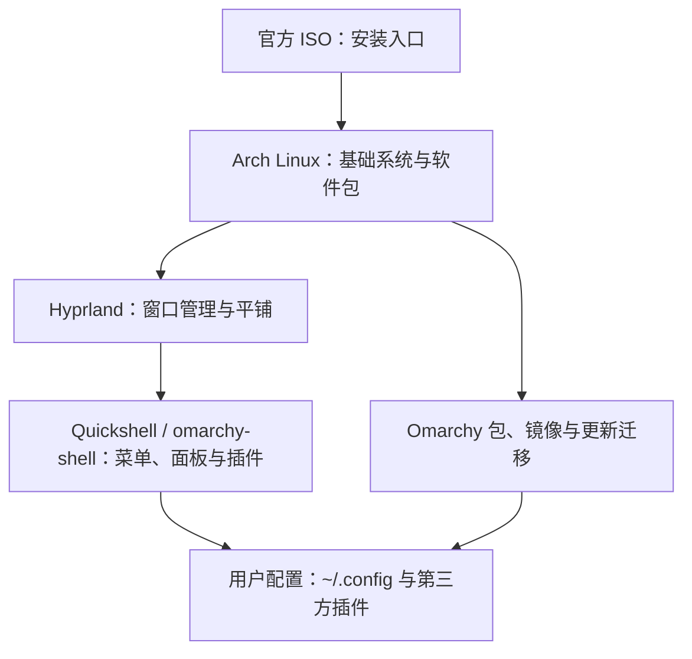

# Omarchy Linux：架构亮点、安装要求与最佳实践

> [!abstract] 一句话结论
> Omarchy 是基于 Arch Linux、Hyprland 和 Quickshell 的**有主见的桌面发行版**：它把安装介质、软件仓库、桌面配置、开发工具与更新/回滚流程组合成一个可开箱使用、又允许自行修改的工作环境。优先用官方 ISO 在备用设备上体验；在生产电脑上安装前，先确认备份、启动安全策略、磁盘方案及硬件兼容性。[1][2][3]

**资料范围**：2026-10-08 查询的官方站点/手册与 Omarchy **v4.0.4** 发布说明（2026-09-15）。手册为会变化的在线文档；下面的快捷键、包与菜单以查询时页面为准，并非所有旧版本都适用。这里讲解安装，不代表已在用户机器上安装或实测。

## 1. 它是什么：把“先组装桌面”变为“先工作、再定制”

普通 Arch 安装给你高度自由，同时也把窗口管理器、驱动、桌面体验、更新策略和开发环境的选择留给你。Omarchy 的做法是「omakase／主厨推荐」：预选一套互相配合的组件，把第一天就能工作的桌面交付给用户；配置仍可通过用户目录里的文件与插件改变。[1][2][10]

读图要点：发行版不只是视觉主题。**安装、升级、配置与回滚必须看成一条链**；用户配置与包拥有的系统文件分开管理，能降低升级时改动被覆盖的概率。[2][8][10]

### 最值得关注的亮点

| 亮点 | 具体价值 | 边界与代价 |
| --- | --- | --- |
| 一体化安装 | 官方 ISO 安装 Arch 基础、Omarchy 包并完成用户初始化；可选择整盘或空闲空间安装，默认 LUKS 加密。[3][4] | 整盘选择会清空选定磁盘；双系统需要先处理空闲空间与 Windows BitLocker。[3][5] |
| 键盘优先桌面 | Hyprland 平铺；`Super + Space` 打开统一菜单，`Super + Return` 启动终端，`Super + Arrow` 切换焦点。[6] | 与传统鼠标优先桌面的交互不同，需适应键位与屏幕缩放。 |
| Quattro 统一桌面壳 | v4 以一个 Quickshell 进程组织状态栏、菜单、通知、锁屏和插件；可克隆内置插件做个性化。[7][11] | 第三方插件并非沙箱：运行时可访问当前用户权限下的资源，应审查来源与更新差异。[11] |
| 开发环境可按需装 | 预置 Neovim、Docker/Compose 等；通过菜单安装语言环境，许多语言版本用 mise 管理；AI CLI 可延迟安装。[9][12] | 不等于所有语言运行时或所有 AI 工具已预装，也不等于 Docker 普通用户默认可免授权使用。[9][12] |
| 统一更新与快照 | `Update > Omarchy` / `omarchy update` 包含包更新、配置迁移和快照；稳定、RC、edge、dev 四通道。[8] | 快照主要恢复根文件系统，**不恢复 `/home`**；直接 `pacman -Syu` / `yay -Syu` 会跳过 Omarchy 的更新编排。[8][13] |
| 可观测的安全默认值 | 默认启用加密、防火墙；SSH 默认不开放；安装器支持无加密特例。[3][14] | 关闭 Secure Boot/TPM 会改变设备安全边界；禁用加密不适合存放敏感数据的便携设备。 |

## 2. 安装“依赖”与要求：哪些是你准备的，哪些是系统自动装的

### 2.1 安装前由你准备

| 项目 | 核对方法与限制 |
| --- | --- |
| 设备/体系结构 | 官方 ISO 面向常规 PC 与受支持的 **Intel Mac**；Apple M 系列 Mac 裸机安装**不直接支持**。Intel Mac 有机型相关的 Wi‑Fi、音频和启动限制，须先查具体机型。[15] |
| 性能/容量 | 官方主页展示 2 GB RAM 的旧 ThinkPad 可运行，这只是**示例，不是公布的最低安装规格**。未在所查官方安装文档中找到通用的最低 RAM、CPU、目标磁盘大小或显卡清单；尤其要为加密分区、更新快照及个人文件留余量。不要把 Windows VM 指南的 64 GB 建议误当 Omarchy 本体最低磁盘要求。[1][3][16] |
| 安装介质 | 从 [omarchy.org](https://omarchy.org/) 获取当前官方 ISO，准备可擦写的 U 盘；macOS/Windows 可使用 balenaEtcher，Linux 可使用 caligula。制盘会覆盖所选 U 盘的数据。[3][4] |
| 完整性校验 | 同时获取 ISO 与对应的 `.sha256`，先用 `sha256sum -c 文件名.iso.sha256` 核对；支持签名校验时，签名旁文件为 `.sig`，签名公钥指纹应从官方安全页独立核对。v4.0.4 发布说明公布的 SHA-256 为 `ddeded2758c48318d201dfdac905ecb28f570441883f0c052ea3cd5d05acf92d`，**仅适用于 v4.0.4 ISO**。[4][14][17] |
| 固件/键盘 | 当前官方入门页要求安装前在 BIOS/UEFI 关闭 Secure Boot 和／或 TPM；加密磁盘启动时不能用纯蓝牙键盘输入解锁口令，请备有线或 2.4 GHz 接收器键盘。企业管理设备应先核对安全策略和恢复方案，不能机械照做。[3] |
| 磁盘/备份 | 整盘安装会清空目标盘。双系统要预留**未分配空间**，先完成可恢复备份，并保管 Windows 恢复密钥；官方双系统手册要求关闭 BitLocker／设备加密，再安装。组织管理的设备先征求管理员许可。[3][5] |
| 网络 | ISO 内置安装所需包镜像；安装后更新、新增包、在线服务及 AI 工具首次按需安装需要网络。不要仅因“ISO 可安装”就推断所有后续工作都能离线完成。[4][8][12] |

### 2.2 安装后由发行版管理的技术依赖

- **底座**：Arch 软件包与 Omarchy 自有包仓库／镜像；官方 ISO 是项目声明的**唯一受支持安装路径**。安装器自动完成 Arch、Omarchy 包和用户环境配置，**不是要求用户先自行安装 Arch，再执行网络脚本**。[4]
- **显示与交互**：Hyprland 管窗口，Quickshell 的 `omarchy-shell` 管栏、菜单和插件；NetworkManager 管网络；默认终端为 Foot。[2][7][11][18]
- **磁盘与恢复**：安装默认启用 LUKS 加密；Limine 启动菜单可选择更新快照，快照恢复不覆盖 `/home`。旧版使用 GRUB 或 systemd-boot 的机器不能直接套用当前 Limine 快照流程。[3][13]
- **开发工具**：Docker 与 Compose 已配置，但默认用户**不属于 `docker` 组**，CLI 应使用 `sudo docker ...`；按项目需要从菜单安装语言栈，使用 mise 区分项目版本。[9]

## 3. 推荐安装路径（仅指导，不自动执行）

1. **先判定风险**：新手优先备用机或官方介绍的试用路径；苹果 M 系列裸机不是官方直接支持目标，普通 VM 是否顺畅取决于图形与虚拟化兼容性。[1][15][19]
2. **备份与核对**：备份用户文件并验证可恢复；从官网取得当前 ISO 和校验文件，校验哈希/需要时校验签名；识别安装盘与 U 盘，避免选错设备。[3][4][14]
3. **启动准备**：按照入门手册核对固件 Secure Boot/TPM 要求、有线/2.4 GHz 键盘以及固件启动 U 盘设置；若涉及 Windows 双系统，先从 Windows 内缩小分区、确认出现未分配空间，处理 BitLocker，再启动安装器。[3][5]
4. **运行 ISO 安装器**：在“整盘”与“空闲空间”之间明确选择；**最后一次确认目标设备和分区**。默认保持 LUKS 加密，设置并妥善保管磁盘解锁口令；安装结束后重启。[3][5]
5. **首次启动验收**：确认能输入解密口令、登录、连网、打开 `Super + Space` 菜单和终端；检查声音、Wi‑Fi、触控板、外接屏幕与睡眠/唤醒，再迁移正式工作数据。[3][6][18]
6. **稳定更新与恢复准备**：优先通过菜单 `Update > Omarchy` 更新；检查 Limine 启动菜单和快照恢复说明。对 `/home` 和用户 dotfiles 单独做异机备份。[8][13]

> [!warning] 不是让你现在执行的命令
> 本文所有命令仅供**安装时在目标 Linux 环境核对**。没有对当前机器下载 ISO、写入 U 盘、调整固件、修改分区或执行安装脚本。

## 4. 长期使用的最佳实践

1. **稳定通道先行**：日常工作机留在 stable；edge/dev 是为了发现兼容性问题与参与开发，不是“越新越安全”的默认选项。固件更新单独通过 `Update > Firmware` 检查。[8]
2. **用用户层扩展，别改包拥有的文件**：把按键、显示器、shell 等偏好放在 `~/.config/hypr/*.lua` 和 `~/.config/omarchy/`；不要直接改 `/usr/share/omarchy`，它会被包更新覆盖。备份 dotfiles；升级前保存自己的改动。[10]
3. **插件等同运行代码**：只安装可信仓库，先读 `manifest.json` 与源码，再启用；更新时检查 diff。第三方 Quickshell 插件在当前用户权限下运行，接口限制**不等于进程沙箱**。[11]
4. **数据备份不等于系统快照**：快照能帮助回退坏更新，但不找回误删的 `/home` 文件，也不会自动恢复不兼容的用户配置。保留外部备份并做一次恢复演练。[13]
5. **保持最小权限**：不要为省一次授权就默认加入 `docker` 组，或长期开启免密 sudo。AI Agent 尤其应限制能读的文件和能执行的系统命令；当前手册指出某些 agent 快捷方式会以自动批准模式启动，使用前须明确工作目录及信任边界。[9][12][14]
6. **按显示器与设备微调**：高分辨率 2× 缩放是默认假设；1080p/1440p 显示器可能需改为 1×。优先走菜单打开用户配置文件，出问题先查硬件重启入口和故障排查页，不要立即重装。[20][21]

## 5. 适合谁、何时不选

- **适合**：喜欢 Arch 滚动发行、键盘优先、平铺窗口、可修改的 dotfiles，并愿意学习快照/恢复的人。
- **先试再迁移**：只有一台工作机、依赖 Windows 原生软件、特殊 Wi‑Fi／显卡／扩展坞或需要严密设备管理的人。Windows 11 VM 是特定工作场景的备选，但不等于所有应用/GPU 工作负载能直接迁移。[1][15][16]
- **不应直接按本文操作**：受组织 Secure Boot、TPM、BitLocker 管理的设备，未备份数据的电脑，以及 Apple M 系列裸机。先让管理员或设备维护者确认支持与回退路径。[3][5][15]

## 6. 证据边界与待确认问题

- **官方文档存在表述差异**：安全页称“全盘加密是强制的”，但当前安装页明确提供在磁盘格式化确认时退出并选择无加密的特殊路径。因此本文采用“**默认加密；有受限例外；日常工作仍建议加密**”的口径，不把两个说法混成“无法关闭”或“无须加密”。[3][14]
- 官方首页的 2 GB RAM 旧机演示不能外推为每台机器的最低要求；Windows VM 指南的 64 GB 是**虚拟机 Windows 客体**的建议，不是本体系统规格。[1][16]
- 未在实际设备上验证目标盘、NVIDIA 型号、无线芯片、固件设置或双系统引导；这些须以具体硬件、当前 ISO 和安装器提示为准。
- 官方在线文档可能与固定的 v4.0.4 ISO 内容不同；按所用 ISO 版本重新核对下载页与发行说明，绝不拿旧校验值验证新版本。

## 来源（官方，访问/核对日：2026-10-08）

1. [Omarchy 官网：定位、4.0.4 下载入口、低配机器展示](https://omarchy.org/)
2. [Omarchy Manual：Arch / Hyprland / Quickshell 总览](https://omarchy.org/manual/)
3. [Getting Started：安装选项、加密、固件及键盘](https://omarchy.org/manual/getting-started/)
4. [Omarchy ISO 仓库 README：受支持安装方式与校验](https://github.com/omacom/omarchy-iso)
5. [Dual Boot Install：未分配空间、BitLocker、Limine](https://omarchy.org/manual/dual-boot-install/)
6. [Navigation：统一菜单与平铺操作](https://omarchy.org/manual/navigation/)
7. [Omarchy v4.0.0 Quattro 发布说明：Quickshell 等架构变化](https://github.com/omacom/omarchy/releases/tag/v4.0.0)
8. [Updates：通道、迁移、更新与回退](https://omarchy.org/manual/updates/)
9. [Development Tools：mise、Docker 与权限](https://omarchy.org/manual/development-tools/)
10. [Dotfiles：用户配置与包文件边界](https://omarchy.org/manual/dotfiles/)
11. [Shell Plugins：插件能力和非沙箱风险](https://omarchy.org/manual/shell-plugins/)
12. [AI：按需安装 Agent、自动批准模式](https://omarchy.org/manual/ai/)
13. [System snapshots：Limine 与不覆盖 /home 的限制](https://omarchy.org/manual/system-snapshots/)
14. [Security：加密、防火墙、sudo 与签名公钥](https://omarchy.org/manual/security/)
15. [Mac support：Intel 支持与 M 系列限制](https://omarchy.org/manual/mac-support/)
16. [Windows VM：64 GB 建议的适用对象](https://omarchy.org/manual/windows-vm/)
17. [v4.0.4 发布说明：ISO 与该版本 SHA-256](https://github.com/omacom/omarchy/releases/tag/v4.0.4)
18. [Networking：NetworkManager、网络与防火墙](https://omarchy.org/manual/networking/)
19. [Omarchy on...：非默认设备与虚拟机指南的边界](https://omarchy.org/manual/omarchy-on/)
20. [Monitors：默认缩放与低分辨率适配](https://omarchy.org/manual/monitors/)
21. [Troubleshooting：软硬件故障排查入口](https://omarchy.org/manual/troubleshooting/)
