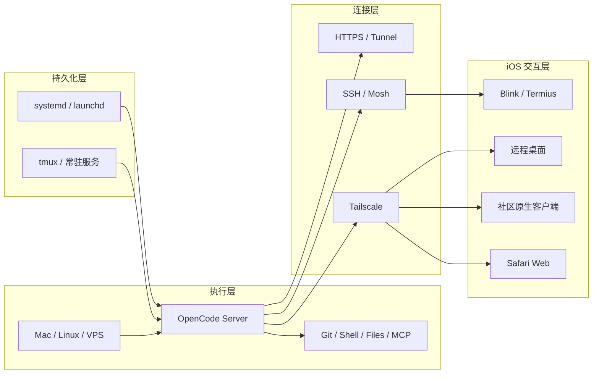
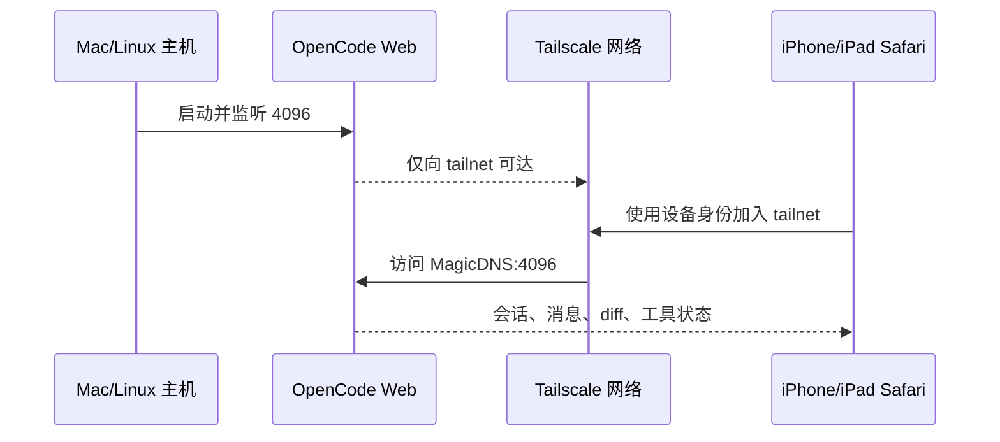
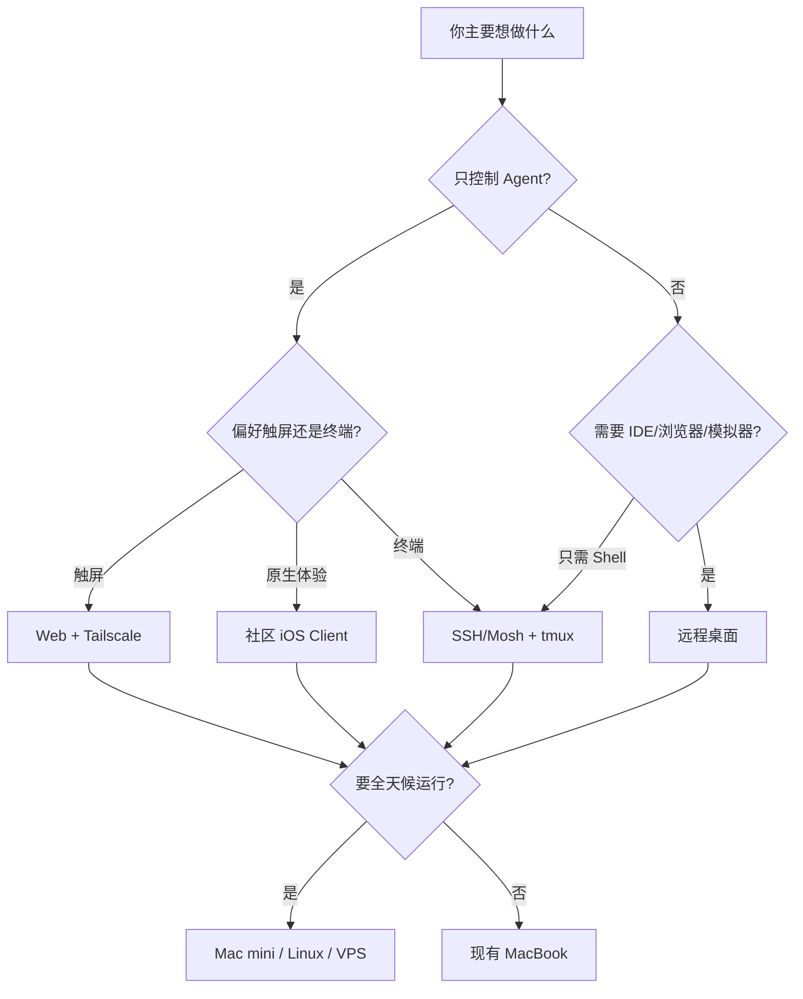

# OpenCode iOS 远程使用全景指南：Web、原生客户端、终端、桌面与云主机

> [!abstract] 文档目标
> 本文系统整理截至 2026-08-24，如何从 iPhone/iPad 远程使用 OpenCode。重点不是罗列 App，而是解释执行主机、会话持久化、安全网络和客户端四层如何组合，以及各种方案与 Codex Remote 的本质差异。

> [!tip] 一句话结论
> 对大多数个人用户，最佳起点是 **OpenCode Web + Tailscale**；重度终端用户增加 **Blink Shell + tmux**；需要 IDE、浏览器、模拟器时再增加 **Jump Desktop / Screens / RustDesk**。若要接近 Codex 的全天候异步体验，应把 OpenCode 放到常驻 Mac mini、Linux 主机或云开发机，而不是会睡眠的 MacBook。

## 1. 为什么这个问题不能只看“有没有 iOS App”

很多比较把问题简化成：“OpenCode 有没有像 Codex 一样的 iPhone App？”这只看到了客户端，忽略了真正决定体验的执行环境。

一次远程 Agent 会话至少涉及四层：

1. **执行主机(Execution Host)**：代码、Git、Shell、模型凭据和 OpenCode 实际运行在哪里。
2. **进程与会话持久化(Session Persistence)**：手机断网、切换 App、主机锁屏以后，任务是否继续。
3. **安全网络(Secure Connectivity)**：iOS 怎样访问主机，是否需要公网端口、VPN、SSH Tunnel 或 HTTPS Relay。
4. **交互客户端(Client Surface)**：Safari Web、原生 iOS App、SSH/Mosh 终端，还是完整远程桌面。



这四层可以自由组合。比如：

- 家中 Mac mini + OpenCode Web + Tailscale + Safari。
- 云端 Linux + `tmux` + Mosh + Blink Shell。
- 工作站 + OpenCode Desktop + Jump Desktop。
- Linux Server + `opencode serve` + 社区原生 iOS Client。

因此，“远程方案”不是某个单一产品，而是一套端到端链路。

## 2. OpenCode 为什么天然适合远程

OpenCode 的终端界面(TUI)并不是一个不可拆分的本地程序。其核心架构已经是服务端与客户端分离：

- `opencode serve` 启动无界面的 HTTP Server。
- `opencode web` 启动 Server 并提供浏览器界面。
- OpenCode TUI 本身也是 Server 的客户端。
- `opencode attach <url>` 可以让另一个终端连接已有 Server。
- Server 暴露 OpenAPI，并通过事件流向客户端更新会话状态。

```text
                   ┌─ Safari / Web UI
                   ├─ iOS 社区客户端
opencode server ───┼─ 桌面 TUI: opencode attach
                   └─ 自动化脚本 / SDK
                         │
                         └─ Files / Git / Shell / MCP / LSP
```

这意味着 OpenCode 远程使用的推荐方向不是“远程传输终端像素”，而是让不同客户端连接同一个 Agent Server。

OpenCode 1.18.21 的本机命令已支持：

```bash
opencode web --hostname 0.0.0.0 --port 4096
opencode serve --hostname 0.0.0.0 --port 4096
opencode attach http://host:4096
```

> [!warning] `0.0.0.0` 的含义
> 它表示监听主机所有网络接口，不等于“自动安全”。只应在受控局域网、Tailscale/Zero Trust 网络或有 HTTPS 反向代理和访问控制时使用。不要把 4096 端口直接映射到公网。

## 3. OpenCode 与 Codex Remote 的本质差异

两者都能让手机继续桌面上的 Agent 会话，但责任边界不同。

| 维度 | Codex Remote | OpenCode 远程方案 |
|---|---|---|
| 产品形态 | 官方统一账户、App 与 Relay | 自托管 Server + 官方/社区客户端 |
| 执行位置 | 本地可信主机或官方支持的执行环境 | 自己的 Mac、Linux、VPS、容器 |
| 移动入口 | 官方 ChatGPT/Codex 体验 | Web、社区 iOS App、终端、远程桌面 |
| 主机发现与配对 | 官方账户、QR、连接管理 | Tailscale、URL、Basic Auth、SSH Tunnel 等 |
| 异步持续运行 | 官方系统负责较多生命周期能力 | 由主机在线状态和服务管理决定 |
| 沙箱与环境 | 产品预设或托管 | 用户自行配置权限和隔离 |
| 运维责任 | 较少 | 主机、升级、备份、凭据、安全均由用户负责 |
| 可定制性 | 受官方产品边界限制 | Provider、模型、MCP、插件与工具高度可控 |

Codex Remote 更像“官方提供一条从手机到 Agent 的安全控制通道”；OpenCode 更像“已经有可远程连接的 Agent Server，你自行决定怎样发布和怎样连接”。

若想深入理解 Codex Remote 的 Relay、JSON-RPC、审批协议与 OpenCode Remote Base Plugin 设计，参见：[[Codex iOS 远程控制与 OpenCode Remote Base Plugin 架构实现]]。

## 4. 方案一：OpenCode Web + Tailscale

### 4.1 适用场景

这是最适合普通用户的主方案：

- 手机上主要发送 prompt、阅读回复、看 diff、观察工具调用。
- 希望桌面浏览器、桌面终端和 iOS 共享会话。
- 不想在 iPhone 小屏幕里操作完整终端。
- 不想信任第三方 OpenCode 客户端。
- 不希望在路由器开放公网端口。

### 4.2 工作原理



Tailscale 提供设备间加密网络和访问控制，但不会自动提供 OpenCode、SSH 或远程桌面服务。目标主机仍必须运行对应服务。

### 4.3 最小配置

主机与 iPhone/iPad 都安装并登录同一 Tailscale 网络，然后在主机启动：

```bash
export OPENCODE_SERVER_PASSWORD='请使用独立强密码'

opencode web \
  --hostname 0.0.0.0 \
  --port 4096
```

用户名默认是：

```text
opencode
```

iOS Safari 访问：

```text
http://主机的-MagicDNS-名称:4096
```

也可以使用 Tailscale IP：

```text
http://100.x.y.z:4096
```

验证成功后，可以在 Safari 共享菜单选择“添加到主屏幕”，把它当作准 PWA 使用。

桌面终端需要接入同一服务时：

```bash
opencode attach http://主机的-MagicDNS-名称:4096
```

如果启用了 Basic Auth：

```bash
opencode attach \
  --username opencode \
  --password '密码' \
  http://主机的-MagicDNS-名称:4096
```

### 4.4 优点

- OpenCode 官方界面与 Server，版本兼容性最好。
- 触屏体验显著优于 TUI。
- 不需要把整个桌面编码成视频流。
- 终端和 Web 可以连接同一个 Server。
- 可利用 Tailscale ACL 控制哪些设备能够访问 4096。
- 后续迁移到 Linux/VPS 时，iOS 端使用方式基本不变。

### 4.5 局限与失败模式

- MacBook 进入系统睡眠后，Tailscale 和 OpenCode 都可能不可达。
- Safari 切后台后，前端连接可能被 iOS 挂起；重新进入时需要重连并刷新状态。
- Basic Auth 只是应用层的简单认证，不等于完整的设备配对、撤销和审计系统。
- 如果把端口直接开放到公网，OpenCode Server 的高权限 API 会成为高价值攻击面。
- 浏览器界面适合控制 Agent，但不等于完整远程 IDE。

### 4.6 安全强化

个人自用建议：

1. 4096 只允许 Tailscale 网络访问。
2. 即便在 Tailscale 内仍设置 `OPENCODE_SERVER_PASSWORD`。
3. 在 tailnet ACL 中只允许自己的 iPhone/iPad 访问目标主机端口。
4. 不在 shell profile、Git 仓库或笔记里保存明文密码。
5. 不要默认开启全自动批准；远程端尤其要保留高风险命令确认。
6. 定期检查 Tailscale 设备列表，撤销遗失或废弃设备。

团队或公网部署应使用 HTTPS 反向代理、SSO/Zero Trust Access、访问日志和更严格的主机权限隔离。

## 5. 方案二：社区原生 iOS 客户端

### 5.1 为什么原生客户端有价值

原生客户端不是简单把网页套壳。它可能提供：

- 更适合 iPhone 的会话列表与导航。
- 原生流式回复和工具调用卡片。
- 文件树、代码预览、session diff。
- Keychain 凭据存储。
- SSH Tunnel。
- 语音输入、通知、Live Activity 或小组件。
- iPad 三栏布局和硬件键盘适配。

### 5.2 值得关注的项目

#### OpenCode iOS Client（grapeot）

这是当前较完整的社区原生实现之一。项目说明支持：

- iOS 17+、iPadOS、Vision Pro。
- 流式聊天、reasoning 和 tool call。
- 文件树、Markdown/图片/代码预览。
- Session diff。
- Basic Auth。
- SSH Tunnel。
- TestFlight 安装。

连接方式包括：

```text
局域网/Tailscale 直连 opencode serve
HTTPS 公网 Server
内置 SSH Tunnel -> 远端 127.0.0.1:4096
```

项目地址：[grapeot/opencode_ios_client](https://github.com/grapeot/opencode_ios_client)。

#### OpenCode Mobile Client（Web UI 原生壳）

`bmpenuelas/opencode-mobile-client` 使用移动端原生容器承载 OpenCode Web，支持 iOS/Android、多个 Server Profile、Basic Auth、健康检查和安全存储。它更接近“管理连接的原生 Web 壳”，而不是重新实现所有 Agent UI。

项目地址：[bmpenuelas/opencode-mobile-client](https://github.com/bmpenuelas/opencode-mobile-client)。

#### BYOT 等第三方产品

BYOT 等项目也在提供 OpenCode iOS 客户端，通常主打原生对话、patch、工具调用和远程 Server 连接。使用前应检查：

- 是否开源。
- 是否通过 App Store/TestFlight 分发。
- 凭据是否仅保存在设备 Keychain。
- 是否经过第三方 Relay。
- Relay 能否读取 prompt、代码、diff 和命令输出。
- 是否支持 Tailscale/SSH Tunnel 直连。
- 更新频率和 OpenCode API 兼容矩阵。

### 5.3 信任边界

> [!danger] 社区客户端不是普通聊天客户端
> 它连接的是能够读取源代码、修改文件、运行 Shell、调用 MCP 和访问模型凭据的 Agent Server。恶意客户端、被劫持的更新或不透明 Relay 都可能扩大攻击面。

推荐顺序：

1. 开源、可审计、直接连接 Tailscale 内 Server。
2. 开源、通过 SSH Tunnel 连接 loopback Server。
3. 有可信身份与端到端安全说明的托管 Relay。
4. 最后才考虑不透明的公网中继。

原生客户端适合追求 Codex 风格移动体验的用户，但官方 Web 仍应作为兼容性和故障排查基线。

## 6. 方案三：SSH/Mosh + tmux + OpenCode TUI

### 6.1 这条路线解决什么

终端路线不会调用 OpenCode 的远程 HTTP API，而是让 iOS 先登录执行主机，再直接操作 OpenCode TUI：

```text
iPhone/iPad
  └─ Blink / Termius
       └─ SSH 或 Mosh
            └─ tmux
                 └─ OpenCode TUI
```

它适合：

- 熟悉 Shell、Git、tmux 的用户。
- 需要完整终端而不只是 Agent 对话。
- 希望直接运行测试、查看日志、进入容器或操作服务器。
- 不想依赖 OpenCode Server API 和第三方 Agent 客户端。
- iPad 配硬件键盘的远程开发场景。

### 6.2 为什么 tmux 是关键，而不是可选装饰

SSH/Mosh 解决网络连接，tmux 解决会话生命周期。

```text
没有 tmux：iOS 断线 -> SSH 会话终止 -> TUI 可能退出
使用 tmux：iOS 断线 -> tmux session 留在主机 -> 重连后恢复
```

典型使用：

```bash
tmux new -s opencode
cd /path/to/project
opencode
```

断线后重新连接：

```bash
tmux attach -t opencode
```

查看已有会话：

```bash
tmux ls
```

### 6.3 SSH 与 Mosh 的取舍

| 维度 | SSH | Mosh |
|---|---|---|
| 部署 | 几乎所有主机默认支持 | 远端需安装 `mosh-server` |
| 网络协议 | TCP | SSH 建连 + UDP 会话 |
| Wi-Fi/蜂窝切换 | 连接可能中断 | 对漫游和地址变化更友好 |
| 高延迟输入 | 容易有明显回显延迟 | 本地预测回显更顺滑 |
| 防火墙配置 | 通常只需 22/TCP | 需要允许相应 UDP 端口 |
| 断线恢复 | 依赖客户端重连和 tmux | 原生面向间歇连接，但仍建议 tmux |

在 Tailscale 内部，普通 SSH + tmux 通常已经足够稳定；经常在蜂窝和 Wi-Fi 之间切换、远端延迟较高时，Mosh 的体验更好。

### 6.4 iOS 终端客户端

#### Blink Shell

Blink 原生支持 SSH 和 Mosh，强调硬件键盘、终端定制和移动网络漫游。适合把 iPad 当作终端工作站，是重度用户首选。

#### Termius

Termius 更侧重主机管理、凭据组织、跨设备配置同步和易用性。适合管理多台服务器或不想深度配置终端的用户。

#### Prompt / Secure ShellFish 等

Prompt 偏 Apple 原生体验；Secure ShellFish 更适合将 SFTP/远端文件整合进 iOS Files 工作流。选择关键不在“谁功能最多”，而在键盘映射、Mosh 支持、凭据管理和文件操作是否符合自己的工作方式。

### 6.5 TUI 在手机上的真实局限

- iPhone 横向空间不足，长 diff 和工具输出拥挤。
- `Esc`、`Ctrl`、`Alt`、`Shift+Tab` 等快捷键需要软件功能键栏。
- 中文输入法、语音输入和终端组合键之间可能冲突。
- 图片、Markdown、文件树不如 Web/原生客户端直观。
- iOS 会冻结后台 App，所以必须依赖主机端 tmux，而不能依赖终端 App 永久在线。

因此：iPhone 适合查看状态、批准、追加 prompt 和应急处理；iPad + Magic Keyboard 才适合长时间终端工作。

## 7. 方案四：完整远程桌面

远程桌面传输的是整个 GUI，而不是 Agent 的结构化消息。它适合以下需求：

- 操作 OpenCode Desktop。
- 同时使用 VS Code、Cursor、Zed 或 Xcode。
- 查看浏览器预览和 DevTools。
- 操作 iOS Simulator、Docker Desktop 或其他 GUI 工具。
- OpenCode Web/SSH 配置损坏时进行救援。

### 7.1 Jump Desktop

Jump Desktop 支持从 iPhone/iPad 访问 Mac/Windows，外接键盘、鼠标和高分辨率桌面体验较成熟。适合 iPad 远程工作站，以及希望少配置网络的用户。

官方页面：[Jump Desktop](https://jumpdesktop.com/download.html)。

### 7.2 Screens

Screens 是偏 Apple 生态的 VNC 客户端，支持 Mac、Windows、Linux、Raspberry Pi、外接键盘/鼠标、多显示器和文件传输。适合 Mac mini 常驻主机场景。

App Store：[Screens 5](https://apps.apple.com/us/app/screens-5-vnc-remote-desktop/id1663047912)。

### 7.3 RustDesk

RustDesk 是开源远程桌面方案，支持 iOS、macOS、Windows、Linux，并允许自托管 ID/Relay Server。适合希望掌控远程桌面基础设施的用户。

官方文档：[RustDesk Client](https://rustdesk.com/docs/en/client/)、[RustDesk Self-host](https://rustdesk.com/docs/en/self-host/)。

### 7.4 为什么不推荐把远程桌面作为唯一入口

- iPhone 上桌面 UI 太小，点击目标和文本选择困难。
- 软件键盘严重占用显示区域。
- 整屏视频编码比事件流更耗电和带宽。
- 远程暴露整个桌面，权限范围比单一 OpenCode Server 更大。
- Agent 审批、diff 和工具调用无法针对移动端重新布局。

推荐定位：**远程桌面是 GUI 工作与故障救援面，Web/原生客户端才是日常 Agent 控制面。**

## 8. 方案五：把 OpenCode 放到常驻云主机

### 8.1 为什么这才真正接近 Codex 异步任务

手机只是控制面。决定任务能否在你合上电脑后继续的，是执行主机是否仍然在线。

```text
MacBook 睡眠：Agent 通常不可达
Mac mini 常驻：Agent 可以持续运行
Linux VPS 常驻：Agent 不依赖家中设备
官方托管沙箱：平台负责更多生命周期与隔离
```

因此，想获得“在路上发任务，稍后回来收结果”的体验，需要：

- 常驻主机。
- 稳定的 OpenCode Server 服务。
- 可靠的网络接入。
- 仓库、依赖和模型凭据已在主机配置。
- 必要时使用容器或独立用户隔离任务。
- 日志、磁盘、备份和升级策略。

### 8.2 主机选型

| 主机 | 优点 | 缺点 | 适合人群 |
|---|---|---|---|
| MacBook | 无新增成本、环境现成 | 睡眠、电池、携带时易离线 | 偶尔远程 |
| Mac mini | 安静常驻、适合 Apple/Xcode 环境 | 需要固定网络和家庭运维 | Apple 开发、长期个人使用 |
| 家用 Linux 小主机 | 成本可控、可容器化 | 不能运行 macOS/Xcode | 通用后端与 Web 开发 |
| VPS | 全天在线、外网稳定 | 持续费用、代码与凭据上云 | 通用项目、移动办公 |
| 云开发机/Devbox | 环境模板和扩缩容较方便 | 费用、供应商绑定、休眠策略 | 多项目或团队 |

### 8.3 常驻服务

Linux 推荐用 `systemd` 管理 `opencode web/serve`；macOS 可使用 `launchd`。目标是：

- 主机重启后自动恢复。
- 进程崩溃后自动重启。
- 日志可查询。
- 密码从安全环境或 Secret Store 注入。
- 服务使用专用低权限用户。
- 工作目录和允许访问的路径明确。

不要把长期服务简单放在一个随时可能关闭的普通终端窗口中。

### 8.4 云主机的额外安全责任

- 模型 API Key、Git 凭据、SSH Key 需要最小权限和轮换。
- Agent 运行用户不应默认拥有 root/sudo。
- 多仓库之间最好使用独立目录、容器或用户隔离。
- 不使用的端口全部关闭。
- OpenCode Server 不直接暴露公网，优先 Tailscale 或 Zero Trust Access。
- 对 `git push`、部署、生产数据库等高风险工具保留明确审批。
- 定期打补丁、备份工作目录和清理磁盘。

## 9. 综合对比与决策矩阵

| 方案 | iPhone | iPad | Agent 语义 UI | 完整 Shell | 完整桌面 | 弱网友好 | 运维成本 | 推荐定位 |
|---|---:|---:|---:|---:|---:|---:|---:|---|
| Web + Tailscale | 很好 | 很好 | 是 | 部分 | 否 | 较好 | 低 | 默认主方案 |
| 社区原生 iOS Client | 很好 | 很好 | 是 | 否 | 否 | 较好 | 中 | Codex 风格体验 |
| SSH + tmux | 一般 | 很好 | TUI | 是 | 否 | 中 | 中 | 通用终端后门 |
| Mosh + tmux | 较好 | 很好 | TUI | 是 | 否 | 很好 | 中高 | 高频移动终端 |
| Jump/Screens/RustDesk | 一般 | 较好 | 否 | 是 | 是 | 中 | 中 | GUI 与救援 |
| 常驻 VPS + Web | 很好 | 很好 | 是 | 可选 | 可选 | 很好 | 中高 | 类 Codex 异步体验 |
| 公网直暴露 4096 | 能用 | 能用 | 是 | 部分 | 否 | 较好 | 表面低 | 禁止作为正式方案 |

### 9.1 按目标选择



### 9.2 按设备选择

**只有 iPhone：**

- 主入口：OpenCode Web 或原生 iOS Client。
- 备用：Blink/Termius + tmux。
- 救援：Jump Desktop/Screens。

**iPad + Magic Keyboard：**

- 主入口：Web 与 Blink 并用。
- 长时间 Shell 操作：Blink + Mosh/SSH + tmux。
- IDE/浏览器联动：Jump Desktop/Screens。

**Mac/iPad/iPhone 多设备：**

- 统一后端：一台常驻 OpenCode Server。
- Mac TUI：`opencode attach`。
- iOS：Web/原生客户端。
- 所有设备：Tailscale 统一连接。

## 10. 三套推荐落地架构

### 10.1 最小个人方案

```text
现有 MacBook
  + Tailscale
  + opencode web
  + iPhone Safari 主屏幕快捷方式
```

适合偶尔在家中或短时间离开电脑时继续会话。必须注意 MacBook 不要进入系统睡眠。

### 10.2 稳定个人方案

```text
常驻 Mac mini / Linux 小主机
  + Tailscale
  + opencode web/serve 常驻服务
  + Safari/社区 iOS Client
  + Blink + tmux 终端后门
  + Jump Desktop GUI 后门
```

这是功能、成本和安全最均衡的组合。每个入口承担不同职责，单一客户端故障时仍有备用通道。

### 10.3 类 Codex 云任务方案

```text
VPS / 云开发机
  + 独立开发用户或容器
  + Git 仓库与依赖缓存
  + systemd 管理 OpenCode Server
  + Tailscale / Zero Trust Access
  + Web/原生 iOS Client
  + SSH + tmux
  + 日志、备份、Secret 管理
```

它提供接近 Codex 的“随时提交、后台运行、多端接续”，但不自动获得 Codex 的官方账户体系、托管沙箱、任务编排和安全运营能力。

## 11. 常见误区与失败模式

### 误区 1：装了 iOS 客户端就能在手机本地运行 OpenCode

大多数 iOS 客户端只是控制面。OpenCode、仓库、Shell 和工具仍运行在 Mac/Linux/VPS 上。

### 误区 2：Tailscale 会让任务持续运行

Tailscale只提供网络连接。任务持续运行依赖主机不睡眠、OpenCode 进程常驻，以及 tmux/systemd/launchd 等生命周期管理。

### 误区 3：设置 Basic Auth 后就可以把 4096 暴露公网

Basic Auth 不是完整的互联网安全产品。公网部署还需要 TLS、访问控制、速率限制、日志、补丁和主机权限隔离。

### 误区 4：SSH 断开等于任务一定终止

如果 OpenCode 运行在 tmux 中，客户端断开不会结束 tmux 会话；如果直接运行在普通 SSH 前台，终端消失可能导致进程退出或状态难以恢复。

### 误区 5：远程桌面最完整，所以一定最好

远程桌面能力最宽，但移动交互、带宽和权限暴露都更差。完整不等于适合高频 Agent 控制。

### 误区 6：远程端可以放心开启 Auto Approve

手机小屏幕容易忽略命令、路径、环境和 diff 细节。远程审批应比桌面更保守，而不是更宽松。

### 误区 7：社区客户端与 OpenCode 官方同步演进

OpenCode Server API 和事件模型可能变化。社区客户端可能暂时落后，因此需要保留官方 Web 或 SSH 作为兼容性基线。

## 12. 安全检查清单

### 主机

- [ ] 使用独立低权限用户运行 OpenCode。
- [ ] 主机磁盘加密，系统补丁保持更新。
- [ ] 禁止 Agent 默认访问不相关的敏感目录。
- [ ] 模型和 Git 凭据使用最小权限。
- [ ] 高风险生产操作保留人工审批。

### 网络

- [ ] 不在路由器公开映射 OpenCode 4096。
- [ ] 优先使用 Tailscale/WireGuard/SSH Tunnel。
- [ ] 公网方案强制 HTTPS 和身份访问控制。
- [ ] 用 ACL 限制具体设备和端口。
- [ ] 定期撤销旧设备和旧密钥。

### OpenCode

- [ ] 设置 `OPENCODE_SERVER_PASSWORD`。
- [ ] 不将密码写进 Git、普通笔记或公开日志。
- [ ] 不默认开启全局 Auto Approve。
- [ ] 升级后验证 Web、attach 和社区客户端兼容性。
- [ ] 重要仓库使用 Git 分支、工作树或容器隔离。

### iPhone/iPad

- [ ] 开启设备密码、Face ID 和自动锁定。
- [ ] Tailscale、终端和远程桌面 App 启用生物认证。
- [ ] 丢失设备后立即从 Tailscale、SSH 和客户端配对中撤销。
- [ ] 不把长期凭据放入可同步的普通文本配置。
- [ ] 高风险批准前展开查看完整命令、路径和 diff。

## 13. 实施顺序

推荐逐层搭建，每一层都保留可验证出口。

### 阶段 1：局域网验证

1. 主机启动带密码的 `opencode web`。
2. 同一局域网的 iPhone Safari 测试访问。
3. 新建测试 session，确认消息、工具调用和 diff 正常。
4. 桌面用 `opencode attach` 连接同一 Server。

### 阶段 2：Tailscale 远程访问

1. 主机与 iOS 加入同一 tailnet。
2. 关闭 Wi-Fi，用蜂窝网络访问 MagicDNS 地址。
3. 检查 ACL，只允许必要设备访问 4096。
4. 测试手机切后台、锁屏、网络切换后的恢复。

### 阶段 3：终端与救援通道

1. 配置 SSH Key 或 Tailscale SSH。
2. 用 Blink/Termius 登录主机。
3. 创建 tmux session 并运行 OpenCode。
4. 主动断开并验证能够重新 attach。
5. 视需要增加 Jump Desktop/Screens/RustDesk。

### 阶段 4：常驻与隔离

1. 将 Server 交给 systemd/launchd 管理。
2. 使用专用用户和明确工作目录。
3. 配置日志、重启策略和凭据注入。
4. 验证主机重启后服务恢复。
5. 对重要项目增加容器、worktree 或独立 VM 隔离。

## 14. 最终建议

如果现在只选择一条路线：

> **先搭 OpenCode Web + Tailscale。**

它最符合 OpenCode 的客户端/服务端架构，也最适合 iPhone/iPad 的交互模型。

然后按真实需求增加能力：

- 需要完整 Shell：增加 Blink + SSH/Mosh + tmux。
- 需要更像 Codex 的移动 UI：尝试开源社区 iOS Client。
- 需要 IDE、浏览器和模拟器：增加远程桌面。
- 需要电脑合盖后继续：迁移到常驻 Mac mini/Linux/VPS。
- 需要产品级配对、推送、审计和中继：进入 [[Codex iOS 远程控制与 OpenCode Remote Base Plugin 架构实现]] 所讨论的 Remote Base/Bridge 架构。

最佳实践不是用一个客户端完成所有事情，而是建立三个相互补位的控制面：

```text
Web/原生客户端：日常 Agent 控制
SSH + tmux：完整终端与维护
远程桌面：GUI 工作与故障救援
```

## 15. 主要来源

### OpenCode 官方

- [OpenCode Server](https://dev.opencode.ai/docs/server/)：`serve`、监听地址、认证、OpenAPI 与多客户端架构。
- [OpenCode Web](https://dev.opencode.ai/docs/web/)：浏览器 UI、会话管理和 `opencode attach`。
- [OpenCode CLI](https://opencode.ai/docs/cli/)：TUI、`attach`、`run --attach` 等命令。
- [OpenCode Download](https://dev.opencode.ai/download)：Terminal、Desktop 和编辑器扩展。

### 网络与远程访问

- [Tailscale：Connect to devices](https://tailscale.com/kb/1452/connect-to-devices)：Tailscale 负责网络连接，目标主机仍需运行具体服务。
- [Tailscale：Secure the network](https://tailscale.com/kb/1429/secure)：ACL、Tailscale SSH 与安全控制。
- [Blink Shell Documentation](https://docs.blink.sh/)：iOS SSH/Mosh 使用。
- [Jump Desktop](https://jumpdesktop.com/download.html)：iPhone/iPad 远程访问 Mac/Windows。
- [RustDesk Client](https://rustdesk.com/docs/en/client/)：跨平台和 iOS 客户端。

### 社区 OpenCode iOS 客户端

- [grapeot/opencode_ios_client](https://github.com/grapeot/opencode_ios_client)：SwiftUI 原生 iOS/iPadOS/visionOS 客户端。
- [bmpenuelas/opencode-mobile-client](https://github.com/bmpenuelas/opencode-mobile-client)：OpenCode Web UI 的 iOS/Android 原生壳。
- [BYOT](https://byot.app/)：第三方 OpenCode iOS 客户端。

## 研究边界

- 本文核验日期为 2026-08-24。OpenCode CLI、Server API 和社区客户端仍在快速演进。
- 社区项目的 stars、提交量、TestFlight 和 App Store 状态可能变化；它们只用于判断活跃度，不代表安全背书。
- 不同组织对源代码、模型 Provider 和远程访问有不同合规要求；企业环境应服从组织安全策略。
- 本文讨论工程与安全设计，不替代独立安全审计。
