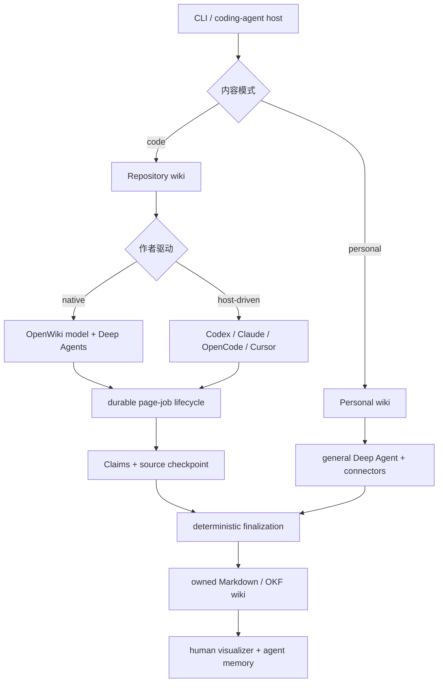
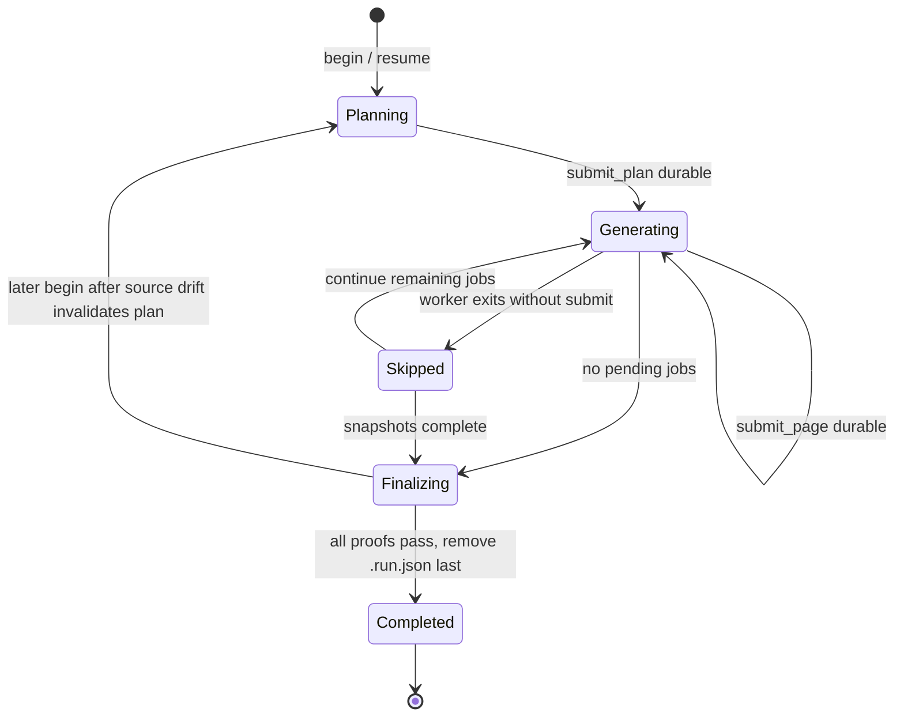
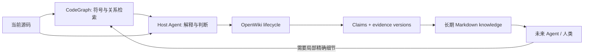

# OpenWiki 深度剖析：从可恢复文档生成到可验证知识生命周期

> [!abstract] 一句话结论
> OpenWiki 的核心不是“让 LLM 自动写一套 Markdown”，而是把容易中断、可能犯错、无法天然保持一致的 Agent 写作过程，约束进一套**可恢复的页面任务状态机、命题级证据账本和确定性最终化流水线**。它把“理解与表达”交给模型，把“权限、状态、证据、新鲜度、索引、来源和失败恢复”收回到程序手里，最终形成一种由 Agent 创作、但不依赖 Agent 自律来维持正确性的知识生命周期。

本文基于 OpenWiki `v0.5.1`、提交 `cf0700f` 的源码、测试与仓库内生成文档撰写。对比基线是 [[CodeGraph 深度剖析：从本地代码图谱到 Agent 原生检索的设计哲学与实现机制]] 中分析的 CodeGraph `v1.6.0`。本文讨论的是两个项目当前真实的责任边界，不把路线图当成已经实现的能力。

---

## 1. OpenWiki 真正在解决什么问题

“自动生成项目文档”听起来像一个内容生成问题：把仓库交给模型，要求它输出若干 Markdown 文件即可。

但真正困难的部分发生在首次生成之后：

- 代码改了，究竟是哪些**事实**失效，而不只是哪些页面“可能过期”？
- 一次生成运行了十几分钟，中途模型、网络或进程失败，已经完成的页面是否全部作废？
- Agent 写完一页就退出、写错 frontmatter、漏提 Claims，系统是接受半成品还是让整个运行崩溃？
- 生成期间仓库又发生修改，这次输出到底对应运行开始时、结束时，还是两者混合的源码？
- Codex、Claude Code、OpenCode、Cursor 和 OpenWiki 自带模型都能写文档时，谁负责状态、验证和最终产物的一致性？
- 如何让文档既是人能读的知识，又是 Agent 下次工作时可以低成本加载的持久记忆？

如果只有一个 prompt 和一次模型调用，这些问题都没有工程答案。得到的只是“一批看上去不错的文本”，而不是可以长期维护的知识系统。

OpenWiki 的基本判断是：

> **文档生成可以是概率性的，但知识生命周期不能是概率性的。**

因此它没有把所有责任塞给一个全能 Agent，而是把系统拆成两类工作：

```text
模型擅长的工作
  研究源码 → 判断重要性 → 组织结构 → 解释机制 → 写自然语言

程序必须掌握的工作
  限权 → 排队 → 持久化 → 证据版本化 → 校验 → 恢复 → 最终化
```

这条分界线是理解整个项目的钥匙。

---

## 2. 项目定位：它生产的不是回答，而是你拥有的知识制品

OpenWiki 是 Node.js 22+ 的 TypeScript CLI，发布为 `openwiki` npm 包。它有两种内容模式和两种驱动方式，构成两个相互独立的轴。

### 2.1 内容轴：Code 与 Personal

| 模式 | 输入 | 输出 | 主要用途 |
|---|---|---|---|
| `code` | 当前 Git 仓库、源码、测试，可选 LangSmith 运行痕迹 | 仓库内 `openwiki/` | 项目架构、工作流、概念、运维与测试知识 |
| `personal` | Notion、Slack、Gmail、X、Web Search、Hacker News、本地 Git、Custom MCP 等连接源 | `~/.openwiki/wiki` | 个人知识汇总与持续整理 |

二者共享 Agent、Markdown、OKF 和可视化能力，但可靠性模型并不完全相同：**Grounded Claims 当前只严格覆盖 repository code wiki 的仓库证据**；连接器事实尚未进入同一套命题级 Claims 体系。

### 2.2 驱动轴：Native 与 Host-driven

| 驱动 | 谁提供模型与研究工具 | 谁维护生命周期 |
|---|---|---|
| Native | OpenWiki 根据配置创建模型和 Deep Agents worker | OpenWiki |
| Host-driven | Codex、Claude Code、OpenCode 或 Cursor 使用自己的认证会话和原生仓库工具 | 仍由 OpenWiki |

这意味着“由谁写”和“由谁保证过程正确”被刻意解耦。换了作者，协议不变；换了模型，耐久性规则也不变。



OpenWiki 因此不是一个“回答型工具”。搜索工具的结果随着会话结束而消失，OpenWiki 的输出则进入仓库、Git 历史、CI 和下一次 Agent 上下文，成为可以审查、修改、发布和迁移的知识制品。

---

## 3. 宏观架构：概率性内核，确定性外壳

从入口看，`src/cli/cli.tsx` 负责解析命令、安装崩溃保护并分发到标准 CLI 或 integration/MCP 路径。真正的分叉发生在 `runOpenWikiAgent`：

- repository 的 `init/update` 必须进入专门的 durable page-job runner；
- personal、chat、连接源综合等通用任务进入普通 Deep Agent graph；
- `createOpenWikiAgent` 甚至会拒绝绕过 durable runner 直接执行 repository `init/update`。

这不是代码组织偏好，而是一项不变量：**需要产生长期代码知识的运行，不能退化成一次不可恢复的自由 Agent 会话。**

可以把整体架构看成四层：

| 层 | 职责 | 典型模块 |
|---|---|---|
| 交互与适配层 | CLI/TUI、命令解析、Coding Agent MCP、安装器 | `src/cli/`、`src/integrations/` |
| 语义生产层 | 规划页面、研究源码、撰写解释、提出 Claim 决策 | `src/agent/`、Deep Agents |
| 知识事务层 | run state、PageJob、Claims、证据解析、source checkpoint | `src/generation/`、`src/claims/` |
| 制品编译层 | frontmatter、Mermaid、索引、链接、sources、generated/verified provenance | `src/okf/`、`wiki-finalizer.ts` |

这里最值得借鉴的不是某个模型 SDK，而是职责分配：模型可以提出语义结果，却不能自行宣布结果已经持久化、已经验证或已经安全完成。

---

## 4. 核心状态机：把长时间 Agent 运行拆成可恢复页面事务

Repository generation 的公开协议只有六个动作：

```text
begin
  → submit_plan
  → next_page
  → [inspect_page_claims]
  → submit_page
  → ...
  → finish
```

可选的 `inspect_page_claims` 是按需扩容的信息入口，不改变状态。真正推进状态的只有 plan、page submission 和 finish。

### 4.1 `begin`：先建立可以恢复的世界

`beginRepositoryRun` 做的远多于“开始生成”：

1. 在触碰仓库前验证语言标识；错误的 BCP-47 code 直接失败，避免把错误语言固化进不可变的恢复状态。
2. 检查并建立 code-mode 所需的仓库结构。
3. 如果 `openwiki/.run.json` 已存在，则恢复旧运行，而不是新建第二个运行。
4. 重建进程内 Claims runtime，运行所有现有证据的新鲜度预检。
5. 对模型可见的仓库输入计算 source fingerprint：它包含 Git HEAD、tracked/untracked 文件、工作区状态和实际文件内容，同时排除生成的 `openwiki/` 与忽略项。
6. 只有在 source、Claims、语言和 page-manifest baseline 都满足条件时，才允许证明一次严格 no-op。
7. 写入 `.run.json`，并先把 `.last-update.json` 标为 `interrupted`；只有所有最终化步骤成功后，它才会成为 `complete`。

对 `init`，旧 wiki 的替换也不是裸删除：新运行状态落盘前保留可回滚备份；状态一旦耐久，已完成页面和 `.run.json` 就接管恢复责任。

这体现了一个非常稳健的原则：

> **先持久化“我正在做什么”，再允许破坏旧世界。**

### 4.2 严格 no-op：不调用模型也是一项需要证明的结果

很多增量工具把“Git 没变化”当成不用工作的充分条件。OpenWiki 更严格：即使 Git 看起来干净，某条 Claim 的证据可能已经无法解析，旧页面也可能没有完整 baseline coverage。

因此 no-op 必须同时满足：

- update preflight 判定源码无需更新；
- Claims 没有 stale/unresolved issue；
- 所有已有事实页面都有 page-manifest baseline；
- 在 Claims finalization、manifest 发布和 metadata 写入前后，source fingerprint 仍保持稳定。

换句话说，no-op 不是“什么也没做”，而是**系统证明当前知识仍与当前输入一致**。

### 4.3 `submit_plan`：把创作意图冻结为有序工作队列

规划器提交的是页面路径、标题、目的、seed paths、related pages、特殊指令和删除集合。系统将其规范化为有稳定 job id 的有序 `PageJob` 队列并写入 `.run.json`。

已经存在的 plan 不能被悄悄覆盖。重复提交只有在忽略随机 job id 和进度后语义完全相同时才被当作幂等成功，否则返回 `invalid_state`。

这个约束阻止了一个常见的 Agent 事故：模型重试时产生稍有不同的新计划，从而让已经生成的页面失去所属的执行语境。

### 4.4 `next_page`：一次只暴露一个确定所有权的任务

系统只返回队列中第一个 `pending` job，不做隐式 reservation，也不并行推进多个页面。页面上下文包含：

- 页面是否已经存在；
- 现有 Claim 数量；
- 仅需要处理的 stale/unresolved Claims；
- 规划器提供的局部研究入口和页面关系。

“一次一页”看起来牺牲并发，实际上换来了三个重要性质：

1. 当前写权限可以缩小到唯一页面；
2. Claims 事务和恢复快照有唯一所有者；
3. Agent 上下文不会被整本 wiki 和全部 Claims 淹没。

### 4.5 页面 worker：最小权限的短命作者

Native 模式不会让一个长寿命 Agent 写完整本 wiki。每页都创建新的、不可委派的 Deep Agent：

- 可读仓库，但写入仅限 `openwiki/`；
- 进一步限定只能修改当前被分配的 Markdown 页面；
- `.claims/` 对通用工具不可见、不可写，只能由 OpenWiki 的直接持久化层维护；
- 提供 `read_file/ls/glob/grep/write_file/edit_file`、`inspect_claims` 与 `submit_page`；
- 显式从模型工具表移除 Deep Agents 可能注入的通用 `task` 委派能力。

这是**能力安全（capability security）**而不是 prompt 安全。系统不会只写一句“请不要修改别的文件”，而是在 backend 和工具表上让那件事做不到。

### 4.6 `submit_page`：页面完成是一条耐久性边界

Agent 写完文件后不能口头说“完成”。`submitRepositoryPage` 会依次要求：

1. job 必须是当前第一个 pending job；
2. 页面必须真实存在且可读取；
3. OKF frontmatter 必须能被确定性修复并通过验证；
4. 稀疏 Claims 决策必须能与旧状态原子协调；
5. Claims sidecar、verification projection 和页面版本必须落盘；
6. 系统重新读取并证明这一页的 Claims 已耐久；
7. page manifest 记录该页对应的 source checkpoint、producer 和 run id；
8. 最后才把 job 标为 `complete` 并写回 `.run.json`。

顺序非常重要。若先把 job 标为完成、后写 Claims，那么进程在两步之间崩溃就会产生“状态说完成，证据却没落盘”的撕裂。

### 4.7 worker 失败：回滚一页，不抹掉整次运行

在 worker 开始前，系统快照当前页面 Markdown 和 Claims sidecar。若 worker 抛错或退出时没有成功调用 `submit_page`：

- 页面恢复到快照；
- Claims 恢复到快照；
- runtime 从耐久状态重建；
- job 标为 `skipped`；
- 整个运行继续处理下一页。

恢复运行时，skipped job 会重新变为 pending，等待后续重试。于是单页失败既不会污染已有文档，也不会让前面已经完成的页面全部丢失。

这是一种“按页面切分的 saga”式设计：它没有追求跨整本 wiki 的巨大数据库事务，而是用小事务、补偿动作和耐久队列构建可恢复性。

### 4.8 `finish`：删除 `.run.json` 必须是最后一步

`finishRepositoryRun` 拒绝带有任何 pending job 的运行，也要求每个 skipped job 都有精确匹配的原始快照。随后按固定顺序执行：

```text
检查 source drift
  → 应用计划删除与废弃页删除
  → 协调已删除页面的 Claims
  → 校验 Mermaid
  → 同步目录 index
  → 校验内部链接
  → 投影 OKF sources
  → 计算 generated provenance
  → 恢复 skipped 页面
  → 排除 skipped 页面后最终化 Claims
  → 全仓库耐久性证明
  → 更新 page manifest 与 run metadata
  → 再次检查 source drift
  → 最后删除 .run.json
```

任何前置步骤失败，`.run.json` 都仍然存在，下一次 `begin` 可以恢复。把状态文件放在最后删除，相当于把它当成整次知识事务的 commit marker。



---

## 5. Grounded Claims：把“页面过期”细化为“命题需要重新判断”

状态机解决运行是否可靠，Claims 解决内容为什么值得信任。

### 5.1 Claim 不是引用列表，而是带版本证据的事实单元

一个 Claim 表达页面中的一条重要命题，例如：

> repository page worker 只能写当前分配的 OpenWiki 页面。

它至少包含：

- 稳定 id；
- statement；
- 一个或多个 `repo://path` 或 `repo://path#Lx-Ly` 证据；
- resolver 生成的 opaque evidence version。

Markdown 保持适合人读；完整结构化状态存放在 `openwiki/.claims/` sidecar。页面 frontmatter 只投影消费者真正需要的 `sources` 和 `verified` 元数据。

### 5.2 证据版本由程序计算，不由模型编造

`RepositoryEvidenceResolver` 会：

- 验证路径是仓库内规范化相对路径；
- 拒绝 `.git`、生成的 `openwiki/`、`.openwikiignore` 排除项和符号链接穿越；
- 对整文件或行范围计算 SHA-256 版本；
- 对行范围额外编码选中内容边界与前后最多三行上下文的锚点，用于代码移动后的保守 relocation。

因此 `#L20-L48` 中的行号更像“位置提示”，内容哈希与上下文才构成证据身份。单纯在文件顶部插入十行，不一定让一条语义未变的证据立刻失去定位；真正内容改变则会产生新版本并触发复核。

### 5.3 Preflight：模型介入前先完成事实新鲜度扫描

更新开始时，Claims preflight 会遍历所有持久化 Claim：

- 证据仍可解析，但版本改变：`stale`；
- 文件或范围已不存在：`unresolved`；
- resolver 自身发生读取/权限/安全错误：直接传播错误，不能伪装成“证据被删除”。

这一步把增量更新从“哪些文件改了”推进到“哪些已发布命题失去了原证据”。页面即使没被 planner 主动选中，只要拥有问题 Claim，也会被加入必做集合。

### 5.4 稀疏协调：只让模型处理真正变化的认知负担

页面提交不是重发整页的全部 Claims，而是三类稀疏决策：

| 字段 | 含义 |
|---|---|
| `confirmedClaimIds` | 重新检查过的问题 Claim，内容无需改变 |
| `claims` | 新增 Claim，或携带已有 id 的修订 Claim |
| `retractedClaimIds` | 旧命题已经不成立，应删除 |

没有问题且未被触碰的 Claim 由系统自动保留。只有在广泛重写页面、需要修改本来仍然 current 的内容时，worker 才调用 `inspect_claims` 获取完整集合。

这是一个极有价值的 Agent 上下文设计：**默认给差量，必要时才按需展开全量。** 它既减少 token，也减少模型因为“看见全部状态”而无意改坏无关内容的机会。

### 5.5 `verified` 的准确含义

OpenWiki 的 `verified` 不是数学证明，也不表示模型的解释必然正确。它表示：

- 页面当前存在完整、非空、可解析的 Claims 集；
- 每条 Claim 的证据都已由 resolver 版本化；
- 本轮协调结果已经持久化；
- sidecar 的 page version 与最终 Markdown 字节一致。

它证明的是**证据账本和页面状态的机器一致性**，而不是替代代码审查者对自然语言命题的语义判断。这个边界必须明确，否则“grounded”很容易被误读成“绝不会幻觉”。

---

## 6. 确定性最终化：把 Agent 草稿编译成知识制品

OpenWiki 没有让模型直接维护所有机器元数据。最终化流程像一个小型编译器后端：作者提供正文和必要语义，程序统一生成或校验派生结构。

### 6.1 OKF frontmatter

每个概念页使用 Open Knowledge Format（OKF）风格的 YAML frontmatter。系统至少保证 `type`、`title` 等基础字段合法，并验证 `generated`、`verified`、`sources`、`status`、`stale_after` 等 trust/lifecycle 字段的结构。

如果 Agent 写出的 frontmatter 有可确定修复的问题，程序会修复；无法安全修复就拒绝页面提交，让 worker 改正后重试。

### 6.2 Generated provenance 按正文变化计算

最终化前先保存旧正文 hash 与旧 `generated` 事件，最终化后再比较最终字节：

- 新页面或正文发生变化：写入本轮 producer 与时间；
- 正文未变：保留旧事件；
- 只有 frontmatter 被系统修改：不假装正文由本轮重新创作；
- host-driven 页面可按 page manifest 保留实际完成该页的 producer。

这种做法比“每次 update 都刷新时间戳”诚实得多，因为时间戳表达的是内容最后变化，而不是工具最后扫过。

### 6.3 Mermaid、索引和链接都是构建产物

最终化会验证 Mermaid、同步目录 `index.md`、校验内部链接、投影 Claims sources，然后才写 provenance。顺序确保 provenance 观察的是所有确定性后处理完成后的最终正文。

这也解释了为什么用户不应手工维护生成 index 或 `.claims/`：它们不是普通文章，而是编译产物和事务状态。

---

## 7. 新鲜度设计：OpenWiki 如何处理“生成时源码又变了”

长时间生成不可避免地与活跃开发并发。OpenWiki 没有尝试锁住整个 Git 工作区，也没有在发现变化时无限自动重跑。

它在 plan 建立时保存 model-visible source fingerprint，并在 finish 的确定性窗口前后再次计算。只要任一检查发现漂移：

- 当前已经完成的 wiki 仍按规则最终化；
- 不推进 source checkpoint；
- `.last-update.json` 记录 `interrupted`；
- 返回 `sourceChanged: true`；
- 明确要求后续再运行 `openwiki --update`。

下一次 `begin` 会基于新的 source fingerprint 进入 planning。若漂移是在恢复一个尚未完成的运行时发现，已有 plan 会被明确清除后重新规划；若上一轮已经诚实 finalization，则会创建新的更新运行，而不会把旧计划伪装成仍然适用。

这是一种很成熟的“诚实完成”语义：系统不丢弃已经完成的合法工作，也不声称它覆盖了生成期间出现的新源码。它选择有界结束，而不是在持续变化的仓库中追逐一个永远后退的终点。

---

## 8. Host-driven 集成：协议提供护栏，宿主提供智能

OpenWiki 为 Codex、Claude Code、OpenCode 和 Cursor 安装两类受管制品：

- 一份规范化的 OpenWiki skill，教宿主怎样研究、规划和逐页提交；
- 一条 MCP server 配置，暴露六个 lifecycle tools。

`HostSessionManager` 是一个很薄但很关键的适配层：

- 一个进程只允许一个 active run；
- 每次操作必须携带匹配的 `runId`；
- lifecycle operation 串行执行，并在 `finally` 中释放 guard；
- 内部错误映射成稳定的 `conflict / invalid_input / invalid_state`；
- repository root 必须是绝对 Git worktree 根，并拒绝文件系统根目录和用户 home；
- host 只负责语义研究和正文，不能修改 Claims sidecar、索引、run metadata 或 provenance。

安装器本身也遵循所有权原则：它用 staging、backup、receipt 和受管标记事务化修改宿主配置，保留无关用户配置，并拒绝接管同名但非 OpenWiki 所有的配置块。

### 为什么不是暴露一个 `generate_wiki` 工具？

因为单一大工具会把所有中间状态藏在一次长调用里。六步协议虽然表面更啰嗦，却让宿主和 OpenWiki 在每个耐久边界上交换明确责任：

```text
Host Agent:  “这是我的页面计划 / 这页正文与事实判断”
OpenWiki:    “计划已持久化 / 页面证据已证明 / 现在可以推进”
```

它不是把 MCP 当远程函数调用而已，而是把 MCP 当作**跨 Agent 的知识事务协议**。

---

## 9. Personal mode 与连接器：先保存原始证据，再让 Agent 综合

Personal mode 面对的不是仓库，而是多个外部知识源。OpenWiki 的通用模式是：

```text
外部 API / MCP / local git
  → deterministic pull
  → ~/.openwiki/connectors/<instance>/raw/
  → source-specific agent synthesis
  → ~/.openwiki/wiki
```

先落 raw dump 再综合有三个好处：

1. Agent 的输入可以复查，来源 id、URL、作者和时间不会只存在于模型上下文；
2. 拉取失败与写作失败可以分离诊断；
3. 多个 connector instance 可以独立保存 cursor、运行历史和错误。

安全边界也很明确：

- raw source 被提示为“不可信证据”，不能当系统指令执行；
- MCP connector 只允许显式白名单或带 `readOnlyHint` 的工具；
- HTTP 只允许 HTTPS，localhost 例外；
- 配置保存环境变量引用而不是秘密值；
- connector 失败按来源隔离，不抹掉其他成功结果；
- repository code-mode 不向通用 Agent 暴露 connector tools。

LangSmith 是 code mode 的特殊输入：它可以把真实 trace、错误与延迟异常作为规划上下文补充静态源码，但当前外部 coding-agent host-driven 路径尚不接收 connector context。因此，Native code mode 与 Host-driven code mode 的可用上下文并不完全等价。

---

## 10. Visualizer：知识图，不是程序图

`openwiki visualize` 会把 Markdown 页面变成一个可探索图：

- 节点是 wiki 页面；
- 边来自页面之间可解析的 Markdown 链接；
- backlinks 是反向关系；
- 节点大小近似正文字符数；
- live mode 通过文件监听、150ms debounce 和 SSE 重载；
- static export 生成可以托管的 HTML/JS/CSS/`graph.json`。

服务器只监听 `127.0.0.1`，路由是固定集合，不根据 URL 拼接任意文件路径；HTML 使用 CSP，外部脚本带 SRI。

这里必须特别避免一个概念混淆：

> **OpenWiki visualizer 的 graph 是知识页面链接图；CodeGraph 的 graph 是代码符号与程序关系图。**

前者回答“哪些知识主题彼此关联”，后者回答“哪些函数、类型、路由和组件彼此调用或依赖”。两张图都能帮助理解，但它们的节点、边、证据强度和用途完全不同。

---

## 11. OpenWiki 的核心设计哲学

### 11.1 把非确定性关在确定性边界之内

OpenWiki 不否认模型会失败，而是让模型失败成为状态机中的正常分支：提交可以被拒绝并纠正，worker 可以被 skip，运行可以恢复，source drift 可以诚实终止。

这是比“写一个更强 prompt”更可迁移的工程方法：

> **不要要求概率系统表现得像事务系统；用事务系统包住它。**

### 11.2 语义由 Agent 判断，所有权由程序执行

Agent 可以判断页面应该写什么，却不能决定：

- 自己是否已经完成；
- Claim evidence version 是什么；
- 哪些元数据代表 OpenWiki 验证；
- 是否可以修改另一页；
- run state 能否删除。

这种分工把“智能”与“权力”分开。系统允许模型聪明，但不给它无界所有权。

### 11.3 新鲜度的单位应该是命题，而不只是文件

文件变了不代表页面中的每句话都失效；文件没变也不代表所有外部关系仍成立。Claims 将更新问题缩小到“这条命题的证据版本是否仍成立”，是 OpenWiki 相比普通文档生成器最核心的差异。

### 11.4 恢复优先于假装原子

一次完整 wiki 生成无法现实地塞进单个 ACID 事务。OpenWiki 选择页面级 commit、快照补偿、持久队列和 finalize-once，把长任务变成可续接过程。

它追求的不是“中途绝不出错”，而是“任何错误都不会让已知好状态消失，也不会让坏状态冒充完成”。

### 11.5 不确定性必须进入产物，而不是只留在日志

`interrupted`、stale/unresolved Claim、producer provenance、source checkpoint、skipped page、后续 update 提示都在表达同一价值观：系统宁可暴露未完成，也不制造完整性的幻觉。

### 11.6 派生状态应由单一确定性实现生成

索引、sources、verification、provenance、Mermaid validation 都由 finalizer 统一处理。Agent 不需要同时扮演作者、数据库维护员和构建工具。

### 11.7 Local-first 与开放格式是一种退出权

最终产物是普通 Markdown 和结构化 sidecar，存放在用户自己的仓库或本地目录。可视化可以导出为静态站点，coding-agent integration 也不绑定某一个模型提供商。

这里的“拥有”不只是文件在本地，还包括：可以用 Git 审查、可以手工阅读、可以换模型、可以停止使用 OpenWiki 而保留已有知识。

---

## 12. OpenWiki vs CodeGraph：两种完全不同的“让 Agent 少重复理解”

OpenWiki 与 CodeGraph 的共同目标，都是降低 Agent 在每次会话中从零理解项目的成本。但它们选择了不同的预计算对象。

| 维度 | OpenWiki | CodeGraph |
|---|---|---|
| 核心问题 | 如何生成并持续维护可读、可验证的项目知识 | 如何快速恢复代码符号、调用链和影响范围 |
| 预计算对象 | 架构解释、工作流、概念与带证据命题 | AST 节点、程序边、未解析引用和动态分发推导 |
| 基本单元 | Page + Claim | Node + Edge |
| 主要引擎 | LLM 语义综合 + 确定性生命周期 | tree-sitter/Rust extraction + resolver/synthesizer |
| 主存储 | Markdown、`.claims/`、`.run.json`、page manifest | `.codegraph/codegraph.db`（SQLite + FTS5） |
| 新鲜度 | 批次 update、证据 preflight、source fingerprint | watcher、incremental sync、query-time stale guard |
| 不确定性表达 | stale/unresolved、verified、interrupted、producer provenance | syntax/resolved/heuristic provenance、dynamic boundary、stale source warning |
| Agent 接口 | 六步 lifecycle MCP 协议 | 默认一个自足的 `codegraph_explore` |
| 优化指标 | 知识是否能持续演进且诚实完成 | 一次响应后 Agent 是否停止继续 Read/Grep |
| 最适合的问题 | “这个系统为何这样设计，怎样运行和维护？” | “这个请求从哪里到哪里，改它影响谁？” |
| 失败模型 | 页面事务回滚、skip、恢复、finalize-last | 查询降级、边界报告、索引状态与 stale 防护 |

### 12.1 二者的共同哲学

它们都反对让模型在每个会话中重付相同理解成本：

- CodeGraph 把**程序结构**预计算为可复用图；
- OpenWiki 把**人类可读的系统理解**持久化为可维护 wiki。

它们也都强调“事实与推断分层”：CodeGraph 区分直接提取边与 heuristic synthesis；OpenWiki 区分模型写作、repository evidence、generated provenance 和 verified Claim 状态。

### 12.2 最重要的差异：查询基础设施 vs 知识生命周期

CodeGraph 的主循环是：

```text
源码变化 → 增量索引 → 查询 → 返回当前局部程序关系
```

OpenWiki 的主循环是：

```text
源码变化 → 证据失效 → 规划页面工作 → Agent 重写/确认 → 知识重新发布
```

CodeGraph 追求**当下查询的充分性（query sufficiency）**；OpenWiki 追求**跨时间知识的连续性（knowledge continuity）**。

### 12.3 为什么 CodeGraph 可以默认一个工具，OpenWiki 却需要六个？

CodeGraph 的一次 explore 是读操作，最佳体验是把 Flow、Blast radius、Relationships 和 Source 一次交付，减少工具选择和后续读取。

OpenWiki 的操作会修改持久知识，并跨越多个不可合并的耐久边界。把它压成一个工具反而会隐藏恢复点和所有权。因此：

- 对读型检索，**界面应尽量合并**；
- 对写型长事务，**阶段应明确暴露**。

工具数量不是越少越好或越多越好，而应由失败语义决定。

### 12.4 为什么 OpenWiki 不能替代 CodeGraph

OpenWiki 页面会概括关键调用流，但它不是编译器级程序图：

- wiki 链接不等于函数调用；
- Claims evidence 不自动建立 caller/callee；
- 页面更新是批次式，不是每次查询前的实时索引；
- 文档有选择地压缩细节，不适合回答任意局部符号影响范围。

### 12.5 为什么 CodeGraph 也不能替代 OpenWiki

CodeGraph 能返回准确源码和关系，却不会自然形成团队长期共享的解释体系：

- 图中存在边，不等于解释了设计动机和运维约束；
- 查询结果默认属于当前会话，而不是持续演进的文档制品；
- 它不会替你规划知识结构、维护概念页、生成 OKF provenance 或发布 docs PR。

### 12.6 最理想的组合

二者可以形成互补链路：



这里应标注为**架构上的互补方式**，不是 OpenWiki 当前内建的 CodeGraph adapter。只要宿主 Agent 已能使用 CodeGraph，它就可以在承担 OpenWiki 页面研究时把图检索作为证据发现工具；最终 Claim 仍必须落到 OpenWiki 接受的 `repo://` 仓库证据，并由 OpenWiki resolver 自己版本化。

---

## 13. 最佳实践：怎样让 OpenWiki 真正长期有用

### 13.1 把 `INSTRUCTIONS.md` 当知识产品 brief

生成前明确：

- 目标读者是新人、维护者、值班工程师还是 Agent；
- 哪些领域必须覆盖，哪些目录应忽略；
- 需要解释机制还是只做 API reference；
- 安全、数据一致性、失败恢复等非功能主题是否必须独立成页。

高质量 wiki 首先来自清晰的信息架构目标，而不是更长的 prompt。

### 13.2 让源码和测试保持权威，不把旧 wiki 当事实来源

更新时应从当前实现重新验证，而不是围绕旧文档润色。旧页面是待协调状态，不是自动正确的真源。测试尤其适合证明边界条件和失败语义，但应与生产源码交叉阅读。

### 13.3 Claim 只记录“未来会依赖的重要事实”

好的 Claim：

- 一条命题表达一个稳定的行为或不变量；
- 证据范围尽量窄，但必须完整支撑命题；
- 优先引用生产实现，必要时辅以测试；
- 避免把标题、目录结构、临时变量名等低价值细节全部 Claim 化。

Claims 太少会失去新鲜度保障，太多则让更新退化为维护噪音。

### 13.4 不要手改 OpenWiki 的状态与派生文件

不要直接编辑：

- `openwiki/.claims/`；
- `openwiki/.run.json`；
- `openwiki/.page-manifest.json`；
- 自动生成的 index、verification、sources 和 generated provenance。

如果中断后看到 `.run.json`，优先重跑同一命令恢复，不要先删除它“清理现场”。

### 13.5 主动管理 `.openwikiignore`

将密钥、私有数据、大型生成物、vendor 目录和与知识无关的文件排除。它不仅降低 token，还参与 backend 读取、shell 限制、fingerprint 和 evidence resolver 的安全边界。

修改 ignore 规则本身也会改变模型可见输入，应把它当知识范围配置，而不是普通性能优化。

### 13.6 根据任务选择 Native 或 Host-driven

优先 Native：

- 希望独立 CLI/CI 自动运行；
- 已配置稳定 provider；
- code mode 需要 LangSmith planning context；
- 不需要宿主 Agent 的额外仓库工具。

优先 Host-driven：

- 已在 Codex、Claude Code、OpenCode 或 Cursor 中工作；
- 想复用现有认证与上下文；
- 宿主拥有更强的代码浏览、测试或 CodeGraph 能力；
- 希望人能观察和干预逐页研究过程。

但无论哪种方式，生命周期都应走 OpenWiki 的正式协议，不要让宿主绕过它直接批量改 generated wiki。

### 13.7 CI 中保留恢复与审查语义

- 固定 OpenWiki 和 CI action 版本；
- PR 的 `add-paths` 只允许 generated documentation；
- 使用最小权限 token；
- 让 branch protection 和 required checks 决定是否合并；
- 不要自动合并对 workflow 可执行文件的修改；
- 临时 CI runner 失败后默认不会保留 `.run.json`，若需要真正 resume，必须保留 workspace 或把 partial docs 放入 PR；
- 失败时禁用待处理的 auto-merge，避免部分结果被误合并。

### 13.8 看到 source drift 时再跑一次 update

`sourceChanged: true` 不等于当前产物损坏，而是说明它没有覆盖生成期间的新变化。正确动作是让本轮有界结束，然后对新 checkpoint 再执行一次 `openwiki --update`，而不是在同一运行中强行循环到仓库静止。

### 13.9 用 visualizer 看知识结构，不用它证明代码结构

图中孤立节点可能意味着缺少知识链接；中心节点可能意味着基础概念或索引设计过度集中。但这些都是文档结构信号，不是 runtime dependency 或 blast radius 证据。涉及代码影响分析时仍应回到 CodeGraph、类型系统和测试。

### 13.10 定期运行“小而可信”的更新

频繁小更新通常优于长期积累后整本重写：

- stale Claim 更少；
- 页面任务更聚焦；
- review diff 更容易理解；
- 失败恢复成本更低；
- source drift 窗口更小。

OpenWiki 的架构本身就是为这种持续维护节奏设计的。

---

## 14. 常见误区、失败模式与边界

### 14.1 “有证据”不等于“解释一定正确”

Claim resolver 能证明被引用字节是否变化，不能证明 statement 对这些字节的解释没有逻辑跳跃。重要架构结论仍需要 review。

### 14.2 文档压缩必然损失局部细节

好的 wiki 应保留稳定心智模型，而不是复制每个函数。遇到具体改动位置、动态调用链和 blast radius，CodeGraph 或编译器工具更合适。

### 14.3 Host-driven 当前不等价于 Native 的全部输入

Host-driven repository runs 当前只使用仓库源码和测试，不自动获得 connector context，包括 LangSmith。不能因为两者共享 lifecycle 就假设语义输入完全相同。

### 14.4 Personal knowledge 还没有 repository Claims 同等级的事实账本

连接器保留 raw data 与来源信息，但当前 Grounded Claims 不覆盖 connector-derived facts。个人 wiki 的“来源可追溯”和 code wiki 的“命题版本可验证”不能混为一谈。

### 14.5 可视化图不是知识正确性证明

链接完整、图形漂亮，只说明页面之间建立了可解析关系。真正的信任仍来自源码、Claims、验证事件和 review。

### 14.6 串行页面队列是有意的取舍

当前设计用吞吐量换简单、确定的页面所有权和恢复语义。对于超大仓库，生成速度可能不如并发 worker；但并发会引入跨页链接、共享索引、Claims 和写入冲突，需要更复杂的事务协议。

### 14.7 `interrupted` 不是单一“失败”概念

它可能表示 worker 被 skip、source 在运行中漂移、运行尚未最终完成等。操作时应结合 `.run.json`、page status 和 CLI 提示判断，而不是机械删除状态重来。

---

## 15. 如何压缩理解 OpenWiki 的项目重点

可以把 OpenWiki 写成一个公式：

```text
OpenWiki
= Agent 语义综合
+ 可恢复 PageJob 状态机
+ 命题级 Grounded Claims
+ 模型可见源码指纹
+ 最小权限写入边界
+ 确定性 OKF 最终化
+ 用户拥有的 Markdown 制品
```

它不是：

- 给仓库套一个长 prompt 的文档生成脚本；
- 实时程序调用图；
- 用向量相似度检索代码的 RAG 服务；
- 对自然语言正确性的形式化证明器；
- 自动把所有连接源事实纳入统一 Claims 的知识库；
- 在源码持续变化时无限追赶“最新”的守护进程。

它最独特的地方，是把**生成式 AI 的语义能力**与**传统软件工程的事务、权限、校验和恢复机制**组合在同一条链路里。

---

## 16. 最终判断

OpenWiki 的真正创新不在“Agent 会写文档”——这件事许多工具都能做。它的架构价值在于承认 Agent 写作天然具有以下性质：运行时间长、输出非确定、会漏步骤、会受不可信源码影响、可能在任意边界退出。

项目没有试图消灭这些性质，而是围绕它们建立控制面：

1. 用 durable queue 把长任务切成可恢复页面事务；
2. 用 Claims 把更新单位从文件下降到重要命题；
3. 用 resolver 和 fingerprint 把新鲜度判断从模型手里收回；
4. 用能力边界限制 Agent 的实际写权限；
5. 用 deterministic finalizer 统一生成索引、来源、验证与 provenance；
6. 用 `interrupted`、skip 和 source drift 语义诚实表达部分完成；
7. 用 Markdown、Git 和 OKF 让知识最终属于用户，而不是属于某次模型会话。

如果说 CodeGraph 的目标是：

> **让 Agent 从“代码结构已经被理解过”开始。**

那么 OpenWiki 的目标可以概括为：

> **让团队从“系统知识已经被解释、被保存，并且知道何时需要重新验证”开始。**

二者一个把结构计算前移，一个把理解持久化；一个缩短当前问题的检索路径，一个延长跨会话知识的有效寿命。它们不是竞争关系，而是 Agent 工程栈中两个互补层次。

---

## 源码证据索引

以下链接固定到本文分析使用的 OpenWiki 提交 `cf0700f93c7348acf96cea4ad5fcf182a5fd12cb`：

- [CLI 入口与命令分发](https://github.com/langchain-ai/openwiki/blob/cf0700f93c7348acf96cea4ad5fcf182a5fd12cb/src/cli/cli.tsx)
- [Agent runtime 与 repository runner 分流](https://github.com/langchain-ai/openwiki/blob/cf0700f93c7348acf96cea4ad5fcf182a5fd12cb/src/agent/index.ts)
- [Native planner、逐页 worker、无委派与失败恢复](https://github.com/langchain-ai/openwiki/blob/cf0700f93c7348acf96cea4ad5fcf182a5fd12cb/src/agent/repository-runner.ts)
- [Repository generation 核心状态机](https://github.com/langchain-ai/openwiki/blob/cf0700f93c7348acf96cea4ad5fcf182a5fd12cb/src/generation/repository-run.ts)
- [耐久 run-state schema 与原子持久化](https://github.com/langchain-ai/openwiki/blob/cf0700f93c7348acf96cea4ad5fcf182a5fd12cb/src/generation/run-state.ts)
- [PageJob 规范化与 Claims 问题补入计划](https://github.com/langchain-ai/openwiki/blob/cf0700f93c7348acf96cea4ad5fcf182a5fd12cb/src/generation/page-jobs.ts)
- [Page manifest 与 page-specific source checkpoint](https://github.com/langchain-ai/openwiki/blob/cf0700f93c7348acf96cea4ad5fcf182a5fd12cb/src/generation/page-manifest.ts)
- [模型可见 repository source fingerprint](https://github.com/langchain-ai/openwiki/blob/cf0700f93c7348acf96cea4ad5fcf182a5fd12cb/src/agent/utils.ts)
- [Docs-only、ignore 与 Claims ownership backend](https://github.com/langchain-ai/openwiki/blob/cf0700f93c7348acf96cea4ad5fcf182a5fd12cb/src/agent/docs-only-backend.ts)
- [Claims runtime 与严格最终化](https://github.com/langchain-ai/openwiki/blob/cf0700f93c7348acf96cea4ad5fcf182a5fd12cb/src/claims/brains/code/runtime.ts)
- [Claims preflight：stale / unresolved](https://github.com/langchain-ai/openwiki/blob/cf0700f93c7348acf96cea4ad5fcf182a5fd12cb/src/claims/brains/code/preflight.ts)
- [Claim session 与原子协调](https://github.com/langchain-ai/openwiki/blob/cf0700f93c7348acf96cea4ad5fcf182a5fd12cb/src/claims/brains/code/session.ts)
- [`repo://` evidence resolver 与行范围 relocation](https://github.com/langchain-ai/openwiki/blob/cf0700f93c7348acf96cea4ad5fcf182a5fd12cb/src/claims/evidence/repository/resolver.ts)
- [Evidence URI 的规范化与安全边界](https://github.com/langchain-ai/openwiki/blob/cf0700f93c7348acf96cea4ad5fcf182a5fd12cb/src/claims/evidence/repository/resource.ts)
- [确定性 wiki finalizer](https://github.com/langchain-ai/openwiki/blob/cf0700f93c7348acf96cea4ad5fcf182a5fd12cb/src/agent/wiki-finalizer.ts)
- [OKF frontmatter 验证与修复](https://github.com/langchain-ai/openwiki/blob/cf0700f93c7348acf96cea4ad5fcf182a5fd12cb/src/okf/frontmatter.ts)
- [Generated provenance 的正文级变化检测](https://github.com/langchain-ai/openwiki/blob/cf0700f93c7348acf96cea4ad5fcf182a5fd12cb/src/okf/generated-provenance.ts)
- [Claims verification 投影与回滚](https://github.com/langchain-ai/openwiki/blob/cf0700f93c7348acf96cea4ad5fcf182a5fd12cb/src/okf/claims-verification.ts)
- [HostSessionManager 与六步 MCP 生命周期](https://github.com/langchain-ai/openwiki/blob/cf0700f93c7348acf96cea4ad5fcf182a5fd12cb/src/integrations/core/session-manager.ts)
- [Coding-agent protocol schema](https://github.com/langchain-ai/openwiki/blob/cf0700f93c7348acf96cea4ad5fcf182a5fd12cb/src/integrations/core/protocol.ts)
- [Integration 安装事务](https://github.com/langchain-ai/openwiki/blob/cf0700f93c7348acf96cea4ad5fcf182a5fd12cb/src/integrations/install/installer.ts)
- [连接器工具与 code/personal 边界](https://github.com/langchain-ai/openwiki/blob/cf0700f93c7348acf96cea4ad5fcf182a5fd12cb/src/connectors/tools.ts)
- [Personal ingestion 编排](https://github.com/langchain-ai/openwiki/blob/cf0700f93c7348acf96cea4ad5fcf182a5fd12cb/src/ingestion/ingestion.ts)
- [Wiki link graph 构建](https://github.com/langchain-ai/openwiki/blob/cf0700f93c7348acf96cea4ad5fcf182a5fd12cb/src/visualize/graph.ts)
- [Visualizer loopback server 与 SSE reload](https://github.com/langchain-ai/openwiki/blob/cf0700f93c7348acf96cea4ad5fcf182a5fd12cb/src/visualize/server.ts)

---

## 延伸关联

- [[CodeGraph 深度剖析：从本地代码图谱到 Agent 原生检索的设计哲学与实现机制]]
- [[MCP]]
- [[AI Agent]]
- [[静态分析]]
- [[知识图谱]]
- [[软件架构]]
- [[可恢复系统]]