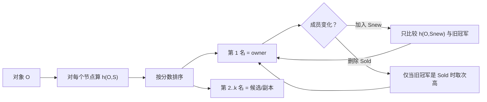
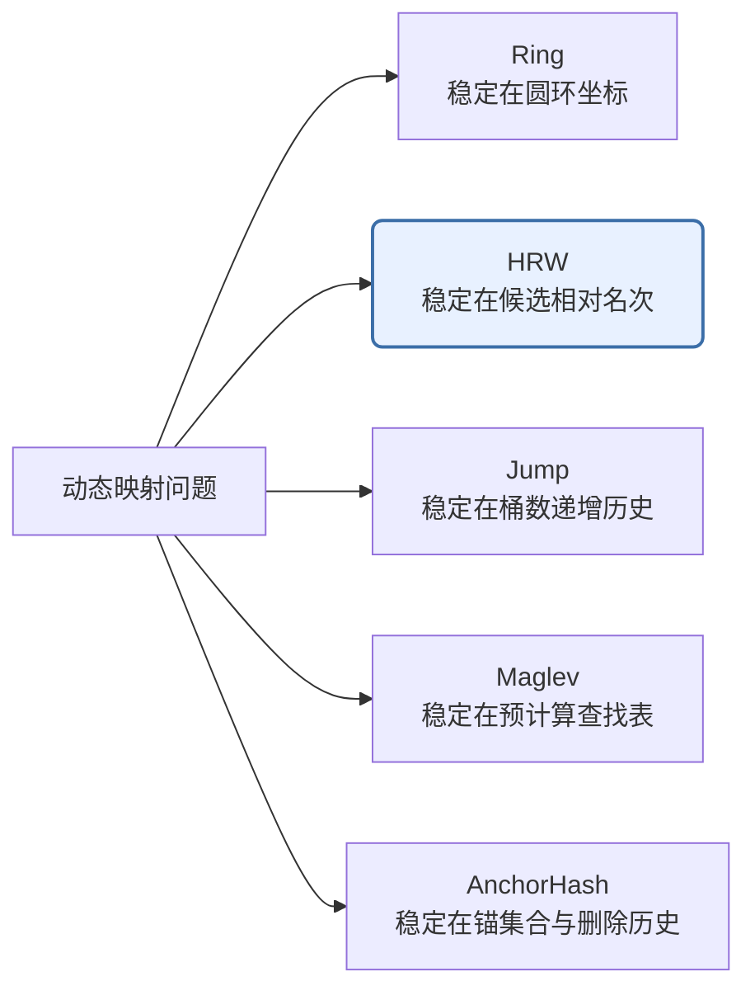
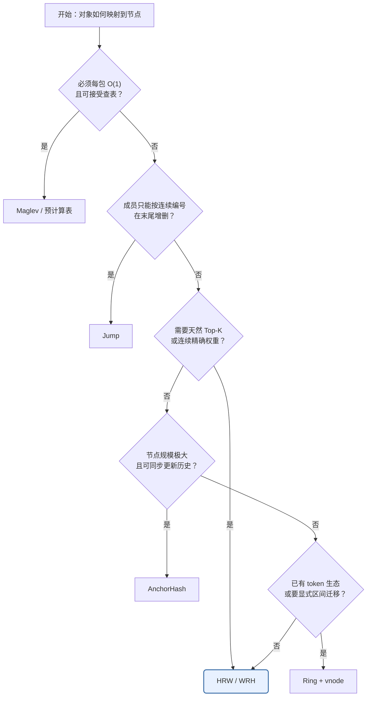
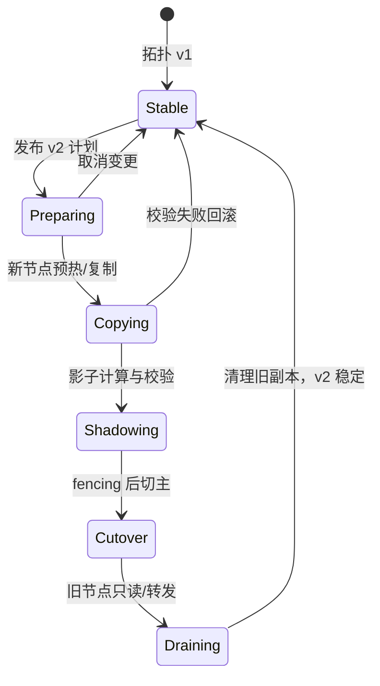

# Rendezvous Hashing：最高随机权重哈希的设计哲学、原理与工程实践

> [!abstract] 一句话理解
> **Rendezvous Hashing**（会合哈希），也叫 **Highest Random Weight (HRW)**（最高随机权重），不是在圆环上找后继，而是让每个节点对同一个 key **打一个确定性分数，最高分获胜**。成员变化时，只有“新节点真正赢了”或“旧赢家下线了”的 key 才会搬家。

> [!info] 阅读范围与结论边界
> 本文以 Thaler 与 Ravishankar 的 1996 技术报告 / 1998 年 IEEE/ACM ToN 论文为主线，对照哈希环、Jump、Maglev、AnchorHash，并只收录能核验到官方文档、RFC、源码或维护者说明的生产案例。加权公式以 Resch / IETF `draft-ietf-bess-weighted-hrw-02` 讨论的对数变换为准；CARP 的相对缩放是常见错误实现。该 draft 发布于 2025-07-07、已于 2026-01-08 过期，本文只把它当“工作草案”而非正式标准。稳定原理截止原始论文；工程案例核验截止 **2026-08-28**。本文回答的是“如何无状态地决定 owner 与候选序”，不把复制、强一致和故障恢复混成同一个算法问题。
>
> 对照阅读：[[一致性哈希-设计理念-算法机制与工程最佳实践-深入讲解]]。两文互补：那边讲“稳定坐标 + 后继”，这边讲“确定性比赛 + 全序”。

## 0. 先建立全局地图：HRW 管什么，不管什么

很多人学 HRW 时会把三件事混在一起：**算出 owner、发布成员名单、搬迁真实数据**。HRW 只直接解决第一件事。


| 层次 | 它回答的问题 | HRW 是否负责 |
|---|---|---|
| 成员管理 | 当前有哪些节点？哪个版本生效？ | 否 |
| 映射 | 给定 key 和成员集，谁排第一？ | **是** |
| 复制 | 副本数多少？能否跨 AZ？ | 只提供候选序 |
| 迁移 | 新 owner 何时可接流量？旧 owner 何时删数据？ | 否 |
| 一致性 | 并发写如何排序？脑裂如何 fencing？ | 否 |

> [!tip] 推荐阅读路径
> 第一次读，先看第 1～5 节和第 12 节；准备实现，再看第 7、8、11 节；准备承载权威数据，必须读第 10.7 节的迁移状态机。这样能先形成骨架，再进入公式和生产细节。

## 1. 它真正解决的是什么问题

普通取模分片：

$$
node = hash(key) \bmod n
$$

在 $n$ 固定时又快又匀。但 $n$ 从 3 变成 4，大约 $3/4$ 的 key 会换家。缓存会大面积失效，存储会全量洗牌，扩容本意是减压，切换瞬间却制造风暴。

哈希环把这个问题改成“在稳定坐标上找后继”，见对照文。HRW 走另一条路：

> **不要维护几何结构。把“选谁负责这个对象”做成一场所有节点都能独立复现的比赛。**

1996 年，密歇根大学的 David G. Thaler 与 Chinya V. Ravishankar 研究的是 Web 缓存与组播 **Rendezvous Point**（会合点）选择：多个客户端必须对“这个对象去哪”达成一致，却不能依赖一个中心调度器，也不能在节点上下线时把映射全部打乱。1998 年期刊论文把算法定名为 HRW；后来文献常用 Rendezvous Hashing 作通名。Karger 等人的一致性哈希论文出现在 1997 年，目标相近，构造不同。

> [!important] 设计目标
> 客户端只拿 **对象名 + 当前成员名单**，独立算出同一个 owner（以及完整候选序）。成员变化时只做最小必要迁移；负载在好哈希下自然均匀，不靠虚拟节点把环填密。

## 2. 设计哲学：从“钉在圆环上”到“打一场比赛”

哈希环的哲学是：**先建立稳定坐标系，再找后继。**

HRW 的哲学是：**先约定评分规则，再让节点当场比分。**

两者都在做同一件系统设计：**用间接层隔离变化**。环把变化隔离在坐标区间里；HRW 把变化隔离在“这场比赛的名次”里。

```text
普通取模：key ──hash──▶  余数依赖 n      n 一变，坐标系崩
哈希环  ：key ──hash──▶  圆环坐标         找顺时针后继
HRW     ：key × 每个节点 ──hash──▶ 分数   取最高分
```

为什么叫 Rendezvous？原始场景不是“两个进程会合”，而是组播里多方必须独立算出同一个会合点。HRW 给出的正是这种 **无状态共识（Stateless Agreement）**：没有人当裁判，只要哈希函数和成员名单一致，结果必然一致。

> [!note] 类比及其失效边界
> 把它想成选班长：每个候选人用同一套密封抽签（哈希），分数最高当选。新同学加入，只有他抽到比现任更高才换人；现任退学，剩下的人按原抽签成绩递补，不用重新抽。
>
> 类比在这里失效：真实系统里“抽签”必须是 **纯函数**，同一 `(key, node)` 永远同分；成员名单一旦分叉，客户端就会选出不同班长。比赛模型解决的是映射，不解决“名单谁说了算”。

## 3. 最小心智模型

只记住四个角色：

| 角色 | 含义 |
|---|---|
| 对象 $O$ | key、flow、URL、partition |
| 站点 $S_j$ | 节点稳定身份，不是临时下标 |
| 分数 $w_{i,j}=h(O_i,S_j)$ | 确定性伪随机权重 |
| 名次 | 按分数全序排列，第 1 名是 owner |

核心公式：

$$
owner(O)=\arg\max_{S\in\mathcal{S}} h(O,S)
$$

需要 $k$ 个副本时，不要另做一套算法，直接取分数前 $k$ 名：

$$
replicas(O)=\operatorname{top}\text{-}k\big(\{h(O,S):S\in\mathcal{S}\}\big)
$$

并列时，1998 年论文用更高的节点标识打破平局。现代实现应把 **哈希函数、seed、节点 ID、平局规则** 写成协议字段。

> [!tip] 费曼复述
> HRW 就是：对每个还活着的节点算一遍 `hash(对象, 节点)`，最大的赢。没有环，没有 vnode，没有查找树。你付出的是每次查询扫描成员表；你得到的是一张天然的全序，以及加删节点时的最小搬家。

## 4. 机制推演：三节点、四个 key

设节点 `{A, B, C}`，哈希分数如下（数字只为演示，真实哈希是大整数）：

```text
          A     B     C      winner
key1     12    81    44        B
key2     90    17    33        A
key3     40    55    70        C
key4     61    28    50        A
```

读表方式：每一行是一场独立比赛。列与列之间没有“相邻”关系，A 下线不会把流量全部倒给某个几何邻居。

### 4.1 新增节点 D

只需给每个 key 多算一个 $h(key, D)$，和原冠军比：

```text
          旧冠军   h(*,D)   是否搬家
key1         B      30      否（30 < 81）
key2         A      95      是（95 > 90）→ D
key3         C      20      否
key4         A      10      否
```

不变量：

- **只有 D 真正赢了的 key 才搬家**；
- 其他 key 的相对名次不变；
- 期望迁移比例约为 $1/(n+1)$。这里 $n=3$，期望约 $1/4$。上表 4 个 key 中迁了 1 个，与期望相符，单次抽样可以偏离。

### 4.2 删除节点 B

只处理原来赢家是 B 的 key。`key1` 的原名次是 `B > C > A`，B 离开后冠军变成 C：

```text
key1: B 下线 → 次高分 C 接手
key2 / key3 / key4: 赢家不是 B，不动
```

不变量：

- 期望迁移比例约为 $1/n$；
- 这些 key **均匀**摊到剩余节点，而不是倒向“环上的下一个”。

这是 HRW 相对经典单 token 环的关键工程差异：环在删除节点时，该节点负责的弧会整体交给顺时针后继，局部可能过热；HRW 把失败者的对象重新比赛，负载会重新铺开。



图中没有环，也没有“区间交接”。控制流永远是：算分 → 排序 → 取前 $k$ 名。

## 5. 核心不变量

在“所有客户端看到同一成员集、同一哈希与同一平局规则”的前提下，HRW 保证：

| 不变量 | 含义 | 工程后果 |
|---|---|---|
| 确定性 | 同一输入得到同一全序 | 客户端可本地决策，无需问协调器 |
| 最小扰动 | 加节点只迁新胜者；删节点只迁其对象 | 扩缩容爆炸半径受控 |
| 均衡 | 均匀哈希下每个节点等概率获胜 | 不需要 vnode 来“抹平弧长” |
| 全序 | 输出是排列，不只是一个 winner | 失败切换、副本、主备都用同一张表 |
| 无状态 | 路由状态 ≈ 成员名单 | 加入/删除不用改环或 token 表 |

1998 年论文还证明：对象足够多时，各节点请求量的变异系数趋于 0。这是概率保证，不是容量 SLA。热点 key、超大对象、异构机器，都必须另外处理。

> [!warning] 视图不一致会击穿算法
> HRW 不能在“有人看到 3 个节点、有人看到 4 个节点”时自动达成共识。它把共识问题下推到 **拓扑版本**：名单必须作为协议的一部分分发。算法保证的是：名单相同则映射相同。

### 5.1 为什么每个节点恰好有 $1/n$ 的胜率

假设对固定 key，各节点分数 $X_1,…,X_n$ 独立同分布，并且连续分布使平局概率为 0。由于这些随机变量在统计上完全对称，没有任何节点拥有特殊地位，因此：

$$
\Pr(X_i=\max_j X_j)=\frac{1}{n}
$$

也可以写成积分。若分数的累积分布函数为 $F$、密度为 $f$：

$$
\Pr(i\text{ wins})
=\int_{-\infty}^{\infty}f(x)F(x)^{n-1}\,dx
=\frac{1}{n}
$$

最后一步来自 $\frac{d}{dx}F(x)^n=nf(x)F(x)^{n-1}$。这说明均衡性不依赖“分数必须长得像某一种分布”，核心是各节点分数的**对称性、独立性与足够均匀的哈希**。

现实哈希是有限位整数，会有极小的平局概率，所以必须规定稳定的 tie-breaker。否则 Go 实现可能选字典序大的 ID，Java 实现却保留遍历到的第一个节点，跨语言结果就会分叉。

### 5.2 为什么加入一个节点只迁移 $1/(n+1)$

原有 $n$ 个节点的分数完全不变。加入新节点 $S_{new}$ 后：

- 若新人不是最高分，旧冠军仍然是冠军；
- 若新人最高，key 才迁给新人；
- 在 $n+1$ 个对称候选中，新人成为最高分的概率是 $1/(n+1)$。

因此期望迁移比例为：

$$
E[\text{moved fraction}]=\frac{1}{n+1}
$$

这里的“最小”很严格：若扩容后要让新节点最终承担 $1/(n+1)$ 的对象，它至少要从旧节点拿到这些对象；HRW 恰好只移动这部分，没有额外的旧节点互换。

### 5.3 为什么删除一个节点只迁移 $1/n$

删除 $S_k$ 时，其他节点两两之间的分数和顺序都没有变化。只有原冠军是 $S_k$ 的 key 需要改选，而 $S_k$ 原本赢得任意 key 的概率是 $1/n$，故期望迁移比例为 $1/n$。

删除后的去向也能算出来。条件在“$S_k$ 原来第一”的前提下，每个剩余节点成为第二名的概率相同，都是 $1/(n-1)$。所以失败节点的对象会在期望上均匀摊给幸存节点。

> [!warning] 期望值不是单次 SLA
> `1/n` 与 `1/(n+1)` 是对大量独立 key 的期望。key 数少、key 相关、哈希输入编码有偏，或者对象大小/QPS 极不均匀时，实际字节迁移量和流量迁移量都可能远离这个比例。生产验证至少要同时按 **key 数、字节数、QPS** 三种口径统计。

### 5.4 “单调性”才是最小扰动背后的结构

HRW 的关键结构是候选间的分数彼此独立：加入或删除一个候选，不会改变其他候选的相对次序。这种性质常称为**单调性（Monotonicity）**。

```text
加入 D 前：B > C > A
加入 D 后：只可能是 D 插入旧序列的某个位置
            D > B > C > A   或   B > D > C > A   或 ……
            不可能突然变成 C > A > B
```

理解了“只插入/删除一个名次”，就同时理解了最小迁移、稳定 Top-K 和快速故障递补。

## 6. 为什么不需要环，也不需要 vnode

哈希环的负载方差来自弧长随机性。节点少、token 少时，有的弧特别长。工程上用 100–200 个虚拟节点把弧切碎，代价是：

- 元数据从 $O(n)$ 变成 $O(Vn)$；
- 查找变成 $O(\log Vn)$；
- 删一个物理节点，其 token 各自交给不同后继，迁移更碎，但环结构更重。

HRW 每次都把 key 和 **每个物理节点** 重新配对哈希。只要 $h$ 足够均匀，每个节点本来就是 $1/n$ 的胜率，没有“弧长”这个随机变量。

代价换到了 CPU：朴素实现每次查询 $O(n)$ 次哈希。对几十到几百个节点的缓存、网关、分区函数，这通常比一次网络 RTT 便宜。对每包线速、数千后端的 L4 负载均衡，它就不是默认选择。

> [!note] “一致性哈希是 HRW 的特例”该怎么读
> 百科上有一种事后构造：把环上的“顺时针距离倒数”定义成二元哈希，于是环的赋值可看成某种 HRW。这是理论等价，不是实现相同。工程上两者的状态、方差、删节点后的负载去向、top-k 成本都不同。不要据此把 Ketama 说成 HRW，也不要把 HRW 说成“不画圆的一致性哈希”就结束讨论。

部分测评会写成“选最小哈希”。**argmax 与 argmin 在分数取反后等价**；原始名称是 Highest Random Weight，本文统一用最高分。

## 7. 加权：正确公式，以及 CARP 踩过的坑

异构容量时，希望节点 $i$ 的胜率正比于权重 $w_i$：

$$
\Pr[i\ \text{wins}]=\frac{w_i}{\sum_j w_j}
$$

同时仍要最小扰动：**改一个节点的权重，只应让该节点赢走或输掉一些对象，其他节点之间不能互相搬家。**

### 7.1 错误/弱式：相对缩放

Cache Array Routing Protocol (CARP) 把归一化因子乘到哈希上：

$$
score = \frac{w_i}{\sum_j w_j}\cdot h(O,S_i)
$$

任一权重变化都会改所有人的分母，于是所有分数一起动，最小扰动被破坏。IETF `draft-ietf-bess-weighted-hrw` 明确指出这条路径不满足 WRH 目标。

1998 年原论文允许两种朴素加权：给分数乘一个 **与他人无关的常数**，或按容量把节点在名单里重复（multiplicity）。重复法正确但粗糙，权重必须近似整数比。

### 7.2 正确 WRH：指数赛跑

把哈希映到 $(0,1)$ 上的 $U$，令

$$
score(O,S_i)=\frac{w_i}{-\ln U},\qquad U=\frac{h(O,S_i)}{H_{\max}}
$$

IETF draft 写成等价形式 $-\,w_i/\log(h/H_{\max})$。直觉来自指数分布赛跑：

$$
T_i=\frac{-\ln U_i}{w_i}\sim \mathrm{Exp}(w_i)
$$

最先响铃的时钟（最小 $T_i$）就是最大 $score$ 的节点，且胜率正比于 $w_i$。改 $w_i$ 只改第 $i$ 个时钟的速率，其他时钟的相对快慢不变。

> [!danger] 不要“把权重乘到 hash 上”就宣称支持加权
> 社区文章常把 `score = weight * hash` 或 `fi * hash` 当作加权 HRW。前者在哈希值域与权重数量级不匹配时会严重偏斜；后者在权重变化时破坏最小扰动。落地必须用对数变换，或用 multiplicity，并配 golden vector 测试。

### 7.3 从两台机器亲手推一次加权胜率

设 A、B 的容量权重分别是 1 和 3。为每个 `(key,node)` 生成独立均匀变量 $U_A,U_B\in(0,1)$：

$$
T_A=-\ln U_A,
\qquad
T_B=\frac{-\ln U_B}{3}
$$

$T_A\sim\mathrm{Exp}(1)$，$T_B\sim\mathrm{Exp}(3)$。指数赛跑有一个重要性质：速率为 $\lambda_i$ 的时钟最先响铃的概率为 $\lambda_i/\sum_j\lambda_j$，所以：

$$
\Pr(A\text{ wins})=\frac14,
\qquad
\Pr(B\text{ wins})=\frac34
$$

为什么公式里会出现 `-ln(U)`？因为它把均匀随机数变成指数分布：

$$
\Pr(-\ln U>t)=\Pr(U<e^{-t})=e^{-t}
$$

工程实现可以选“最小 $T_i$”，也可以选等价的“最大 $w_i/(-\ln U_i)$”。前者更直接，也更少出现正负号写反的问题。

> [!example] 数值例子
> 若某个 key 得到 $U_A=0.8,U_B=0.2$，则 $T_A\approx0.223$，$T_B\approx0.536$，A 获胜。B 虽然容量是 A 的 3 倍，也不是每个 key 都赢；权重控制的是长期份额，不是单次确定结果。

### 7.4 浮点数、零值和权重更新的实现边界

- 不要让 $U$ 取到 0 或 1；可把 64 位整数映射到开区间，例如 $U=(x+1)/(2^{64}+1)$。
- 权重必须严格大于 0；权重为 0 应解释为“不参与候选”，直接从成员集中排除。
- 所有语言必须约定 `log` 精度、整数到浮点的映射和比较规则。若跨语言逐 key 一致性要求极高，应发布 golden vectors，而不是只比较总体分布。
- 改节点 A 的权重时，其他节点 B、C 的 $T$ 不变，因此 B 与 C 之间不会互相交换对象；只会发生 `A ↔ 其他节点` 的迁移。这就是加权算法需要保住的最小扰动。

## 8. 复杂度、加速与“候选集”

| 做法 | 查询 | 状态 | 适用 |
|---|---:|---:|---|
| 朴素扫描 | $O(n)$ | 成员表 | 中小集群、分区函数、副本排序 |
| 预计算查找表 | $O(1)$ | 大表 | 线速转发；成员变化要重建表 |
| 分层 / skeleton | 声称 $O(\log n)$ | 树状候选 | 极大 $n$；公开资料多为综述，本文不把它当已精读定理 |

GitHub GLB Director 选择第三条工程折中：**离线用 HRW 为每一行生成 primary/secondary 序，在线只做 siphash 查 64K 表。** 数据平面不再 $O(n)$，但成员变化变成“改表 + 排空”，并且一篇转发项只有主备两人，排空期间最多允许一台处于 draining。这是把算法的全序用在控制面，把常数时间留给数据面。

当 $n$ 很大又必须在线扫描时，常见加速是：

1. 先用便宜哈希筛出一小撮候选，再对候选做完整 HRW；
2. 缓存“旧冠军分数”，加节点时只算新人分数并比较；
3. 删节点时若保存了全序，直接取次高，不必重算所有人。

第 2、3 条来自 1998 年论文自己的实现讨论，不是后来才发明的技巧。

### 8.1 Top-K 不等于“排序所有节点”

只选 owner 时，线性扫描并维护一个最大值即可，时间 $O(n)$、额外空间 $O(1)$。选前 $k$ 名时有三种常见实现：

| 实现 | 时间 | 额外空间 | 何时使用 |
|---|---:|---:|---|
| 全量排序 | $O(n\log n)$ | $O(n)$ | $n$ 小、要完整候选序 |
| 大小为 $k$ 的最小堆 | $O(n\log k)$ | $O(k)$ | $k\ll n$ |
| 线性选择后局部排序 | 平均 $O(n)+O(k\log k)$ | 依实现 | 性能敏感、实现复杂度可接受 |

但副本选择不能机械地拿前 $k$ 名。若前三名都在同一机架，应沿稳定全序继续向后扫描，直到满足约束：

```text
HRW 原始序：A(az1/r1) > B(az1/r1) > C(az1/r2) > D(az2/r3)
要求：3 副本、至少跨 2 个 AZ、不同机架
结果：A、C、D；跳过 B，但不修改任何节点的原始分数
```

把**评分**和**约束过滤**分开非常重要：评分层保持确定性与单调性，策略层表达 AZ、机架、租户或维护状态。所有客户端必须使用相同过滤规则和拓扑标签版本。

## 9. 五种算法，本质上是五种“把变化隔离在哪里”的办法

这一节不从复杂度表开始。先用同一个问题检验五种思路：

> 有一批 key（或网络 flow），现在有节点 `{A,B,C,D}`。所有客户端必须独立选出同一个 owner。加入 E 或删除 B 时，既要少搬家，又要避免负载偏斜，还不能让热路径太慢。

五种算法真正不同的地方，是它们把稳定性存放在哪里：



> [!abstract] 先记住一句话
> Ring 是“找右邻居”，HRW 是“比分数”，Jump 是“看这次是否跳到新桶”，Maglev 是“控制面排好座位、数据面直接查座位表”，AnchorHash 是“撞到已删除节点就沿历史继续找”。

### 9.1 哈希环：把节点和 key 钉到同一条圆形刻度尺

#### 为什么会想到圆环

普通 `hash(key) mod n` 的问题是：$n$ 本身参与了坐标解释。$n$ 一变，几乎所有余数都变。哈希环（Hash Ring）让坐标空间固定，例如固定为 $[0,2^{64})$：

1. 对节点 ID 哈希，把节点放到环上；
2. 对 key 哈希，也把 key 放到同一个环上；
3. 从 key 的位置顺时针走，遇到的第一个节点就是 owner。

```text
                 A(10)
              ↗         ↘
         D(85)             B(35)
              ↖         ↙
                 C(60)

key=42 位于 B 与 C 之间 → 顺时针后继 C 负责
```

加入 E 时，E 只从自己的前驱到自己这一段的旧 owner 手里接 key。删除 B 时，B 原来的区间交给顺时针后继。其他区间不变。

#### 为什么需要虚拟节点

只给每台物理机一个随机点，节点之间的弧长通常不相等。弧越长，后继节点接到的 key 越多。**虚拟节点（Virtual Node, vnode）**让一台物理机在环上拥有许多 token，把若干随机小弧汇总起来，用大数定律降低负载方差。

```text
物理 A → A1、A2、A3、... 分散在环上
物理 B → B1、B2、B3、... 分散在环上
```

代价是成员表、构环和迁移计划都围绕 token 展开。若一台机器有 200 个 vnode，删除它不是一次连续区间交接，而是 200 段区间分别交给各自后继。

#### 六问速答

| 问题 | 回答 |
|---|---|
| 核心状态 | 排序后的 token 环，通常是 `token → physical node` |
| 查询 | key 哈希后，在有序 token 中找后继，通常 $O(\log T)$ |
| 加减节点 | 支持任意稳定节点 ID；只影响相邻区间 |
| 均衡 | 取决于 token 数和放置方式；vnode 越多通常越稳 |
| Top-K | 沿环继续走，但必须跳过同一物理机并处理故障域 |
| 权重 | 给高容量节点更多 token，是离散近似而非天然连续公式 |

> [!warning] 专家视角：环的“最小扰动”不等于“最小迁移成本”
> 环保证没有必要的 owner 变化，但不保证搬迁字节数、网络拓扑成本或接收节点瞬时负载最小。删除单 token 节点时，它的全部 key 会先压给一个后继；vnode 能摊开去向，却增加元数据和迁移碎片。算法性质与运维成本是两回事。

### 9.2 HRW：不维护几何结构，让每个节点参加一场可复现比赛

HRW 已在前文完整展开。放到统一框架中，它的优势来自一个特别简单的不变量：

```text
对固定 key：score(A)、score(B)、score(C)、score(D) 永远不变
加入 E：只把 score(E) 插进旧排名
删除 B：只从旧排名拿掉 B
```

所以 HRW 不需要环、token 或删除历史；当前成员集足以重建结果。它还天然给出完整候选序，这是 Ring、Jump 和 Maglev 都需要额外工作才能得到的能力。

| 问题 | 回答 |
|---|---|
| 核心状态 | 当前成员集、稳定节点 ID、哈希/seed/平局协议 |
| 查询 | owner 为 $O(n)$；Top-K 可用 $O(n\log k)$ |
| 加减节点 | 任意加减；严格最小扰动 |
| 均衡 | 好哈希和大量 key 下是概率均衡 |
| Top-K | 天然稳定全序 |
| 权重 | 指数赛跑/对数 WRH 可给出连续精确比例 |

它的弱点也很明确：节点数直接进入热路径计算量。几十个节点时这可能无关紧要；几千个后端、每个数据包都要选路时，$O(n)$ 就改变了系统架构。

### 9.3 Jump Consistent Hash：只研究“桶数从 n 增到 n+1”这一条时间轴

#### 费曼直觉：新开一个窗口，谁需要换队？

假设原来有 $n$ 个连续编号桶 `0..n-1`，加入的新桶编号只能是 `n`。为了让 $n+1$ 个桶均衡，新桶最终应拿到 $1/(n+1)$ 的 key；其余 key 必须留在原桶，才能做到最小扰动。

因此从 $n$ 增到 $n+1$ 时，每个 key 只有两种命运：

```text
概率 1/(n+1)：跳到新桶 n
概率 n/(n+1)：留在原桶
```

Jump 的巧妙之处不是逐个模拟 `1→2→3→...→n`，而是根据伪随机序列直接算出“下一次发生跳跃时，桶数会增长到多少”，从而跳过大量没有变化的中间状态。

#### 为什么它快、为什么限制也硬

它不存环、不存节点表，只需要 key 和 `numBuckets`。空间 $O(1)$，迭代次数随桶数对数增长，常数很小。但它把稳定性押在一个强前提上：

> bucket 必须是连续整数，而且成员变化等价于末尾增加或删除最大编号。

若删除中间桶 3，再把桶 9 改名为 3，大量 key 的语义都会变化；若保留洞，则原始算法又可能返回已不存在的桶。节点身份通常需要外部 indirection：`bucket index → stable node ID`。

| 问题 | 回答 |
|---|---|
| 核心状态 | 只有桶数量；物理节点映射由外层维护 |
| 查询 | 期望 $O(\log n)$ 次小循环，空间 $O(1)$ |
| 加减节点 | 适合末尾增删；不支持任意身份直接摘除 |
| 均衡 | 对编号桶非常均匀，无 vnode |
| Top-K | 不天然提供；需重复扰动 seed 并去重，语义更复杂 |
| 权重 | 不天然支持；常靠重复桶或外部 slot 层近似 |

> [!example] 适合场景
> 一个存储系统把分区编号固定为 `0..N-1`，扩容总是追加分区，缩容极少发生且可先搬迁最后的分区。这时 Jump 很干净。若你的真实需求是“任意机器今天坏一台就马上从集合摘掉”，Jump 并没有直接解决这个问题。

### 9.4 Maglev：把昂贵决策搬到控制面，热路径只查一张数组

#### 它首先是一个系统设计取舍

Maglev 面向软件 L4 负载均衡。热路径可能是每个数据包一次决策，所以它追求：

```text
slot = hash(flow) mod M
backend = lookup[slot]
```

在线查询是一次哈希加一次数组访问，$O(1)$。复杂工作发生在成员变化时：控制面重建长度为 $M$ 的查找表。

#### 表是怎样生成的

每个 backend 根据稳定名字生成一个对表位置 `0..M-1` 的伪随机排列。经典构造使用：

$$
offset_i=h_1(name_i)\bmod M
$$

$$
skip_i=h_2(name_i)\bmod(M-1)+1
$$

$$
permutation_i[j]=(offset_i+j\cdot skip_i)\bmod M
$$

$M$ 取素数，使 `skip` 与 $M$ 互素，从而遍历所有槽位。随后各 backend 轮流拿走自己排列中尚未占用的首选槽位，直到表填满：

```text
A 的偏好：2, 5, 1, 4, ...
B 的偏好：1, 2, 6, 3, ...
C 的偏好：2, 3, 5, 0, ...

轮流填空槽 → 每台 backend 最终占 floor(M/N) 或 ceil(M/N) 个槽
```

因此负载份额差最多一个槽，远比小 vnode 环的概率均衡更硬。

#### 为什么它不是严格最小扰动

删掉 B 后必须重建整张表。B 的槽当然要换 owner，但各节点“轮流挑空位”的竞争顺序也会变化，所以少量原本属于 A/C 的槽可能互换。这是 Maglev 有意接受的代价：牺牲一点映射稳定性，换几乎完美的槽位均衡与极快查询。

原始论文中，$M=65537$ 是实践默认值；论文强调数字本身没有特殊意义，关键是取素数且 $M\gg N$。$M$ 越大，均衡和韧性越好，但每个 VIP 的内存与重建时间也越大。

| 问题 | 回答 |
|---|---|
| 核心状态 | 每个服务/VIP 一张长度 $M$ 的 lookup table |
| 查询 | $O(1)$ 数组访问，适合数据包热路径 |
| 加减节点 | 任意成员变化后重建表 |
| 均衡 | 槽位数之差最多 1；很强 |
| 最小扰动 | 近似而非严格；可能有额外 remap |
| 权重 | 可改变 backend 获得填槽轮次的频率；原论文未给实现细节 |

> [!important] 不要把 Maglev Hashing 与完整 Maglev 系统混为一谈
> 查找表只能降低映射变化。原系统还用连接跟踪保护已有连接；论文明确接受少量表扰动，因为 connection tracking 是第一层保护。只抄建表算法，不抄流状态、健康检查和配置一致性，并不能得到论文里的可靠性。

### 9.5 AnchorHash：先定义最大锚集合，删除后沿着历史逐层缩小候选集

#### 它解决 HRW 的哪一个痛点

HRW 只存当前集合，但查询要扫描当前所有节点。AnchorHash 选择相反方向：愿意保留一点历史状态，换取接近常数的查询与严格一致性。

先定义一个最大**锚集合（Anchor）** $\mathcal{A}$，当前工作集合为 $\mathcal{W}\subseteq\mathcal{A}$。对 key 先哈希到锚集合：

- 命中仍工作的 bucket：结束；
- 命中已删除 bucket $b$：回到“删除 $b$ 后当时的工作集合 $\mathcal{W}_b$”继续哈希；
- 如果又命中后来也被删除的 bucket，就继续追溯，直到命中活节点。

```text
Anchor = {0,1,2,3,4,5,6}
删除顺序：6 → 5 → 1
当前 Working = {0,2,3,4}

key 首次命中 5（已删）
  → 按删除 5 时的集合重哈希，命中 1（后来也删）
  → 按删除 1 时的集合重哈希，命中 4（存活）
```

这条链不是异常补丁，而是算法的核心：**过去的删除事件成为查询数据结构的一部分。**

#### 为什么历史能保住最小扰动

删除 b 时，只有命中 b 的 key 会进入下一层重哈希；其他 key 原结果不动。把最近删除的 bucket 按相反顺序加回，就恢复到删除前的那一层状态，只有原先因 b 删除而搬走的 key 回到 b。

基础算法维护删除栈，增加资源时通常复用最近删除的 bucket。这里的代价不是热路径扫描，而是所有参与方必须共享同一锚大小、bucket 身份和更新历史；不能只广播一个无序的“当前活节点名单”。

| 问题 | 回答 |
|---|---|
| 核心状态 | 锚集合、工作集合、删除历史及辅助数组 |
| 查询 | 哈希次数取决于失效比例；若锚大小为 $a$、存活 $w$，期望约 $1+\ln(a/w)$ |
| 加减节点 | 支持动态变化，但必须遵守同一更新历史/恢复语义 |
| 均衡 | 在当前工作集合上概率均衡 |
| 最小扰动 | 是；历史是保证的一部分 |
| 权重/Top-K | 基础论文以等权单 owner 为主，扩展不如 HRW 直接 |

论文给出的一个醒目结论是：即使对抗性地删除 50% 资源，平均哈希次数仍小于约 $1+\ln2\approx1.69$。但不要把论文基准直接当自己的延迟 SLA；具体实现有不同的内存—计算折中，更新协议也可能成为系统瓶颈。

> [!warning] AnchorHash 的隐藏成本是“历史一致性”
> HRW 客户端只要最终成员集相同就能得到相同结果；AnchorHash 的决策依赖过去事件。快查询来自更强的控制面契约。若客户端错过一次删除/恢复或更新顺序不同，结果可能分叉。

### 9.6 用同一次扩缩容观察五种算法

设最初有 `{A,B,C,D}`，现在加入 E，随后删除 B。我们不虚构具体哈希数值，只看算法允许哪些变化：

| 算法 | 加入 E 时 | 删除 B 时 | 不应忽略的动作 |
|---|---|---|---|
| Ring + vnode | E 的每个 token 从其顺时针后继接管前驱区间 | B 的各 token 区间交给各自后继 | 重建/发布 token 环，规划许多碎片区间 |
| HRW | 只有 `score(E)` 超过旧冠军的 key → E | 只有旧冠军为 B 的 key取旧第二名 | 所有客户端同步成员版本；Top-K 可直接复用 |
| Jump | 只有当 E 恰好对应新末尾 bucket 4 时直接成立 | B 若不是最大编号，不能直接删除 | 外层需维护 bucket 到物理节点的稳定间接表 |
| Maglev | 用五个 backend 重建长度 M 的表 | 用四个 backend 再重建表 | 发布新表；处理额外 remap 与已有连接 |
| AnchorHash | 从删除栈恢复一个预留 bucket 并绑定 E | 记录 B 删除时的工作集合/辅助状态 | 所有查找方按相同顺序应用更新历史 |

这个对比揭示一个常被复杂度表掩盖的事实：

> **算法不是只选一个 `pick(key)` 函数，也是在选择控制面必须维护哪一种真相。**

### 9.7 大 O 表格没有告诉你的事

| 方案 | 热路径 | 控制面/更新 | 主要状态 | 严格最小扰动 | 天然 Top-K |
|---|---:|---:|---:|---|---|
| Ring + vnode | $O(\log T)$ | 构环约 $O(T\log T)$ | $O(T)$ tokens | 是（给定稳定 token 布局） | 否 |
| **HRW** | **owner $O(n)$** | **成员表替换 $O(n)$** | **$O(n)$** | **是** | **是** |
| Jump | 期望 $O(\log n)$、空间 $O(1)$ | 改 bucket count | 算法内 $O(1)$ | 仅末尾增删模型 | 否 |
| Maglev | $O(1)$ | 平均约 $O(M\log M)$ 建表 | 每服务 $O(M)$ | 否，近似 | 否 |
| AnchorHash | 期望约 $1+\ln(a/w)$ 次哈希 | 维护删除/恢复历史 | 实现不同，约数 bytes/bucket 起 | 是（协议历史一致时） | 否 |

还要追问四个常数：

1. **一次哈希多贵？** HRW 的 $O(n)$ 可能仍比一次网络 RTT 小，也可能在线速包处理中完全不可接受。
2. **状态放在哪里？** Maglev 的 $O(M)$ 是每个 VIP 一张表；VIP 数量可能比 backend 数更早耗尽内存。
3. **更新有多频繁？** AnchorHash 和 Maglev 的查询很快，但控制面更新必须可靠、有序、原子发布。
4. **key 的重量相等吗？** 所有“均衡”首先均衡的是 key/slot 数，不自动均衡字节、CPU、连接时长或热点。

### 9.8 专家级选型：先用硬约束排除，再在剩余方案中优化



更具体地说：

- **选 Ring + vnode：**已有 Ketama/Dynamo 风格 token 生态，团队需要可视化的区间所有权，或迁移工具本来就围绕 token 构建。
- **选 HRW：**节点数中小、任意成员变化、需要稳定候选序/副本、异构权重，且愿意用 CPU 换最简单的状态模型。
- **选 Jump：**bucket 是抽象连续分区而非任意机器身份，扩容是追加编号，极端重视零元数据和简单实现。
- **选 Maglev：**每次查询预算接近数组访问，控制面能够构建和原子发布表，业务容许少量额外 remap，并有连接跟踪或重试兜底。
- **选 AnchorHash：**资源数极大、HRW 全扫描不可接受，又要求任意故障下的严格最小扰动，并能可靠同步有序变更历史。

### 9.9 五个常见误判

> [!failure] 误判 1：查询复杂度最低就一定最好
> Jump 的状态最少，但它对成员编号的限制可能把复杂度推给外层；Maglev 查询最快，但表内存与发布机制可能更贵。

> [!failure] 误判 2：都叫 consistent hashing，所以稳定性等价
> Ring、HRW、AnchorHash 可以在各自协议前提下做到严格的无额外 remap；Maglev 明确接受少量额外变化；Jump 只在连续桶数模型内成立。

> [!failure] 误判 3：均衡 key 数就是均衡负载
> 一个长连接、一个 100 GB 对象或一个超级热点 key 足以击穿概率均衡。热点拆分、容量感知、限流和动态调度是映射层之外的问题。

> [!failure] 误判 4：算法支持删除节点，就等于系统能安全缩容
> 映射变化只是第一步。权威数据仍需要复制、fencing、双读或转发；长连接仍需要 draining 或 connection tracking。

> [!failure] 误判 5：把成员名单广播出去就够了
> 对 HRW 通常接近正确；对 Ring 还需 token 布局，对 Maglev 需表或完全确定的建表协议，对 AnchorHash 需有序历史，对 Jump 需 bucket index 的稳定语义。

> [!tip] 最终选型心法
> 如果没有热路径压力，优先选控制面最简单、最容易验证正确的方案；这通常让 HRW 很有吸引力。只有测量证明 $O(n)$ 是瓶颈时，再把复杂度搬到环、表或历史结构中。**更快的查询从来不是免费的，只是把成本转移到了别处。**

## 10. 可核验的生产实践

只列出本次能对到官方文档、RFC 或源码的案例。百科名单不整体采信。

### 10.1 GitHub GLB：用 HRW 造表，不在热路径扫节点

GitHub 开源的 GLB Director 用 Rendezvous 变体生成转发表：每一行对所有 proxy 的 IP 与行 seed 做 siphash，排序后取前两名作为 primary/secondary。相对次序在成员变化时保持，这是全序不变量的直接应用。排空时对调主备，让新连接去 secondary，旧连接靠 second-chance 回旧 primary。这是算法最小扰动 **不够用、必须叠加状态机** 的范例。

### 10.2 Apache Ignite：默认亲和就是 Rendezvous

`RendezvousAffinityFunction` 是分区缓存的默认亲和。它先把 key 映到固定分区，再对分区做 HRW 选主副本。提供 `excludeNeighbors` 和 `backupFilter`，因为裸 top-k 可能把副本放到同一主机。说明：**HRW 解决“按分排队”，故障域是另一层约束。**

### 10.3 Tahoe-LAFS：`HASH(storage_index + nodeid)` 排序

官方架构文档用存储索引与节点 ID 的哈希排序来选存储节点，语义即 HRW 置换。文档未必出现 “HRW” 字样，机制是同一件事。

### 10.4 Apache Druid Router

Router 默认 Avatica 侧使用 rendezvous hash balancer；源码中有 `RendezvousHasher`。一次修复 PR 记录：糟糕的复合哈希曾造成约 20% 的 broker 偏斜，换成 Murmur128 后偏斜降到 5% 以下。这是“算法正确、哈希函数不合格仍然失败”的现场证据。

### 10.5 RFC 2991 与 Microsoft CARP

RFC 2991（Thaler）建议有流状态的转发器用 HRW 选 next-hop，避免 ECMP 在成员变化时把所有流打散。CARP 是 1990 年代末微软缓存阵列路由，官方描述为 URL 与数组成员的哈希选择；它是加权 HRW 的工程近亲，但相对缩放公式不满足现代 WRH 的最小扰动。

### 10.6 线索，不升级为事实

- Twitter EventBus：前工程师第一人称复盘，非 Twitter 官方文档。
- IBM COS / Cleversafe：Resch 的 SNIA 演讲自称 WRH，缺产品文档页。
- Apache Kafka：百科有时列入；官方默认分区是 `murmur2 % n`，**本次未核验到 HRW**。
- Discord：公开库是 consistent hash ring，**不是 HRW**。

### 10.7 从“算出新 owner”到“安全切换”的生产状态机

缓存场景可以接受一次 miss，权威存储却不能在 HRW 结果变化的瞬间把请求直接切给空节点。更完整的生命周期是：



各阶段的责任：

| 阶段 | 映射与数据动作 | 必须验证 |
|---|---|---|
| Preparing | 固定 `fromVersion` 与 `toVersion`，计算迁移集合 | 新旧拓扑、算法版本、seed 一致 |
| Copying | 从旧 owner 向新 owner 复制；线上仍以旧 owner 为准 | 行数、字节、校验和、增量日志水位 |
| Shadowing | 请求仍走旧 owner，同时计算/抽样读取新 owner | owner 差异、空读、延迟、容量 |
| Cutover | 获取 epoch/lease，阻止旧 owner 继续接受权威写 | fencing token 单调、写入路径唯一 |
| Draining | 新请求走新 owner；旧 owner 转发或只服务旧连接 | 旧版本客户端数、长连接、重试率 |
| Cleanup | 安全窗口后删除旧副本 | 无旧客户端、无未追平日志 |

> [!danger] 双写不是自动正确
> “扩容期间同时写新旧 owner”仍会遇到部分成功、乱序和重试。权威数据需要明确的写入主方、幂等键、版本号或日志复制协议；必要时用 lease/epoch fencing。HRW 只告诉你候选是谁，不能替你解决分布式提交。

#### 两种常见读路径

**缓存：**先读新 owner，miss 后回源并填充；旧缓存自然过期。迁移协议可以很轻。

**权威存储：**在切换窗口按 `new → old` 双读，或由新 owner 转发给旧 owner；写入则必须只有一个权威入口。确认复制追平和旧客户端消失后，再停止 fallback。

## 11. 失败模式与最佳实践

| 失败 | 症状 | 处理 |
|---|---|---|
| 哈希质量差 | 节点份额长期偏离 $1/n$ | 选跨语言一致的 64 位以上哈希；禁止自制 `hash(a)\|hash(b)` 拼接 |
| 节点身份漂 | IP/hostname 一变就假迁移 | 用稳定 node ID；身份变更视为新成员 |
| 拓扑版本分叉 | 双写、缓存分裂、幽灵 owner | 把算法、seed、成员集做成版本化协议 |
| 热点 key | 单对象打满单节点 | HRW 假设一对象可被一节点承担；热点要拆分或专门调度 |
| 错误加权 | 改一个权重，全家搬家 | 用对数 WRH 或 multiplicity |
| 裸 top-k | 副本同机架、同 AZ | 排序之后再做故障域过滤 |
| 把缓存经验套到存储 | 扩容后读到空数据 | 缓存可 miss；权威存储要双读、转发、fencing |

清单：

- [ ] 节点 ID、哈希、seed、平局规则写入协议，并做跨语言 golden vector；
- [ ] 拓扑变更带版本号；旧客户端必须可检测、可拒绝写入；
- [ ] 加权只用与他人无关的变换；权重变更单独做迁移预算；
- [ ] 副本在 HRW 序上再过滤故障域；
- [ ] 加入先预热/filling，退出先 draining，不要瞬间从全序里消失；
- [ ] 影子计算新旧 owner，分别看 key 数、字节、QPS，而不是只看条数；
- [ ] 监控变异系数、未知节点、拓扑版本分布、迁移比例；
- [ ] $n$ 增大后先测哈希耗时，再决定是否造表或换 Maglev/AnchorHash。

### 11.1 把算法参数当成线协议，而不是本地实现细节

一个可跨进程、跨语言复现的 HRW 协议至少应固定：

```text
algorithm_id   = "hrw-v1"
hash_id        = "xxh3-128"        # 示例，不是强制推荐
seed           = 0x...
key_encoding   = length-prefix-v1
node_id        = immutable bytes
score_order    = descending
tie_breaker    = node_id ascending
weight_formula = exp-race-v1
topology_epoch = monotonically increasing
```

不要简单拼接 `key + "#" + node`：若 key 或 node 本身含分隔符，`("a#b","c")` 与 `("a","b#c")` 会编码成同一字节串。推荐长度前缀或规范序列化：

```text
len(key) || key || len(nodeID) || nodeID
```

长度字段的宽度、字节序也必须固定。

### 11.2 测试不只看“分布挺均匀”

| 测试 | 构造 | 应验证的性质 |
|---|---|---|
| Golden vector | 固定 key、节点、seed、权重 | 每种语言输出完全相同的 Top-K |
| 确定性 | 打乱成员输入顺序、多次运行 | 输出不受遍历顺序影响 |
| 等权均衡 | 百万级独立 key、$n$ 个节点 | 各节点份额接近 $1/n$，并报告置信区间 |
| 加权均衡 | 权重 `{1,2,7}` | 份额接近 `{10%,20%,70%}` |
| 加节点单调性 | 比较 $S$ 与 $S\cup\{x\}$ | 变化只允许 `旧 owner → x` |
| 删节点单调性 | 比较 $S$ 与 $S\setminus\{x\}$ | 原 owner 非 x 的 key 不得变化 |
| 迁移率 | 大样本扩缩容 | 接近 $1/(n+1)$ 或 $1/n$ |
| 故障域 | 构造同 AZ/机架节点 | Top-K 过滤满足约束且确定 |
| 模糊测试 | 随机二进制 key/node ID | 无编码碰撞、崩溃、NaN、Inf |

均衡测试不能使用“每台误差小于固定 1%”这种拍脑袋阈值。若总 key 数为 $m$，等权节点命中数近似二项分布，单节点标准差约为：

$$
\sigma=\sqrt{m\cdot\frac1n\left(1-\frac1n\right)}
$$

可以用多倍标准差或卡方检验设阈值，并固定随机种子以便复现。更重要的是：用真实 key 样本再跑一次，因为生产 key 的前缀、长度和字符分布可能暴露输入混合函数的问题。

### 11.3 哈希函数怎么选

- **可信内部输入、吞吐优先：**可评估 xxHash/XXH3 等高速非密码哈希，但必须固定具体版本和 seed。
- **外部用户可控 key、担心哈希洪泛：**使用带秘密 key 的 SipHash 一类 PRF；所有参与方必须安全共享同一 secret，轮换 secret 等价于全量重映射。
- **跨语言兼容优先：**选择各语言都有稳定实现、测试向量明确的算法，并自己维护协议级 golden vectors。
- **不要只看位数：**128 位输出不能弥补糟糕的输入编码；64 位在海量候选比较时也要认真处理碰撞和平局。

原文示例中的 FNV 只为展示循环结构，不应被理解为生产推荐。Murmur/xxHash 也不是对抗恶意输入的安全哈希。

最小 Go 实现（等权；加权不要改成 `weight * h`）：

```go
func pick(key string, nodes []string) string {
    best, bestScore := "", uint64(0)
    for i, node := range nodes {
        score := fnv64(key + "#" + node)
        if i == 0 || score > bestScore || (score == bestScore && node > best) {
            best, bestScore = node, score
        }
    }
    return best
}
```

`fnv64` 只适合讲解。生产实现应按威胁模型选择哈希，并固定算法版本、seed、字节序、输入编码和平局规则；不能只替换函数名就认为协议已经完整。

## 12. 从算法走向系统的三层奥义

### 第一层：无状态共识

多方不通信，只共享规则与名单，就能会合到同一点。DNS、客户端分片、组播 RP、DF 选举，都在复用这个模式。

### 第二层：全序比单点更值钱

HRW 的产品不是一个 winner，而是一张稳定排名。主备、重试、second-chance、排空，都是“沿着名次往下走”。环也能做多后继，但要另找邻居；HRW 的邻居就是下一分。

### 第三层：概率均匀必须由工程兜底

好哈希给出期望均匀；身份、视图、权重、热点、故障域、迁移限速，决定你在故障日会不会把自己打挂。GitHub 把 HRW 放进表生成，再加 draining 状态机，比在热路径里“相信 $O(n)$ 扫描”更接近生产。

> [!tip] 最终心法
> 哈希环问：“谁在我右边？” HRW 问：“这场比赛谁赢了？” 选哪一个，取决于你更怕维护几何结构，还是更怕每次多算几个哈希。真正要学的不是公式，而是 **用确定性比赛把全局洗牌收成局部改选**。

## 13. 思考题

1. 4 个节点加入第 5 个，期望迁移比例是多少？若实际迁了 40%，首先该查哈希、样本，还是算法写错？
2. 为什么删掉环上的一个节点，流量可能砸向单个后继；而 HRW 删除后会摊开？
3. 两个客户端一个看到节点 D 在线、一个看不到，HRW 还能保证缓存命中吗？该由谁修复？
4. 把 `score = weight * hash` 用在权重 1 与 100 的两台机器上，可能出现什么偏斜？改成对数变换后，只改其中一台权重，谁会搬家？
5. GitHub GLB 已经用了 Rendezvous，为什么数据面仍要 64K 表和 draining 状态机？若直接每包 $O(n)$ 扫描，会坏在哪一层？

## 14. 结语

Rendezvous Hashing 比圆环更早出现在文献里，却常常被写成“一致性哈希的简化版”。更准确的说法是：它用一场可复现的比赛，同时给出 **映射、全序、最小扰动**。你不维护环，也就不必用 vnode 去修补弧长；你要维护的是成员名单的一致性，以及哈希函数的质量。

当节点不多、需要副本排名、实现预算很紧时，它几乎是最干净的选择。当节点极多或必须线速时，把它从热路径请到控制面——造表、造 Maglev、造状态机——而不是在错误的层上坚持 $O(n)$。

## 参考资料与证据边界

### 原始论文与标准

1. Thaler and Ravishankar, [*A Name-Based Mapping Scheme for Rendezvous*](https://www.eecs.umich.edu/techreports/cse/96/CSE-TR-316-96.pdf), CSE-TR-316-96, 1996。命名与 rendezvous 场景。
2. Thaler and Ravishankar, [*Using Name-Based Mappings to Increase Hit Rates*](https://www.microsoft.com/en-us/research/wp-content/uploads/2017/02/HRW98.pdf), IEEE/ACM ToN 6(1), 1998。HRW 定义、最小扰动、均衡定理、实现建议。
3. [RFC 2991](https://www.rfc-editor.org/rfc/rfc2991), *Multipath Issues in Unicast and Multicast Next-Hop Selection*, 2000。有流状态时用 HRW 选 next-hop。
4. [*draft-ietf-bess-weighted-hrw-02*](https://datatracker.ietf.org/doc/html/draft-ietf-bess-weighted-hrw), 2025。指出 CARP 相对缩放破坏最小扰动，给出对数 WRH。该 Internet-Draft 已于 2026-01-08 过期，只能作为工作草案引用，并非正式标准。
5. Jason Resch, [*New Hashing Algorithms for Data Storage*](https://www.snia.org/sites/default/files/SDC15_presentations/dist_sys/Jason_Resch_New_Consistent_Hashings_Rev.pdf), SNIA SDC 2015。WRH 公式与稳定性论证。

### 对照算法

6. Karger et al., Consistent Hashing, STOC 1997。见对照文。
7. Lamping and Veach, [*Jump Consistent Hash*](https://arxiv.org/abs/1406.2294), 2014。
8. Eisenbud et al., [*Maglev*](https://www.usenix.org/sites/default/files/nsdi16-paper-eisenbud.pdf), NSDI 2016。
9. Mendelson et al., [*AnchorHash*](https://arxiv.org/abs/1812.09674), 2018。
10. Brocco, [*A survey and fair comparison of consistent hashing algorithms*](https://ceur-ws.org/Vol-3478/paper03.pdf)。查找/内存/resize 对比；Rendezvous 选最小哈希的表述与原论文 argmax 不同，属实现约定。

### 官方与工程文档

11. [GitHub: Introducing GLB](https://github.blog/engineering/infrastructure/glb-director-open-source-load-balancer/) 与 [glb-hashing.md](https://github.com/github/glb-director/blob/master/docs/development/glb-hashing.md)。
12. [Ignite `RendezvousAffinityFunction`](https://ignite.apache.org/releases/latest/javadoc/org/apache/ignite/cache/affinity/rendezvous/RendezvousAffinityFunction.html)（2.17.0）。
13. [Tahoe-LAFS Architecture](https://tahoe-lafs.readthedocs.io/en/stable/architecture.html)。
14. [Microsoft Learn: CARP](https://learn.microsoft.com/en-us/previous-versions/windows/desktop/ff823958(v=vs.85))。
15. Apache Druid `RendezvousHasher` 与 [PR #12817](https://github.com/apache/druid/pull/12817)（哈希质量与偏斜）。

### 边界说明

- 分层 skeleton HRW 的 $O(\log n)$ 主要来自百科/综述，本文未精读独立论文，置信度为中。
- Schindelhauer & Schomaker 2005 加权 DHT 原文未全文抽取；WRH 公式以 Resch 与 IETF draft 互证。
- Kafka、Kubernetes、Discord 不作为 HRW 生产案例。
- 迁移状态机、监控清单属于跨系统工程综合，不能替代具体产品手册。
