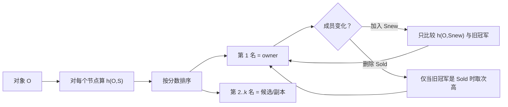

# Rendezvous Hashing：最高随机权重哈希的设计哲学、原理与工程实践

> [!abstract] 一句话理解
> **Rendezvous Hashing**（会合哈希），也叫 **Highest Random Weight (HRW)**（最高随机权重），不是在圆环上找后继，而是让每个节点对同一个 key **打一个确定性分数，最高分获胜**。成员变化时，只有“新节点真正赢了”或“旧赢家下线了”的 key 才会搬家。

> [!info] 阅读范围与结论边界
> 本文以 Thaler 与 Ravishankar 的 1996 技术报告 / 1998 年 IEEE/ACM ToN 论文为主线，对照哈希环、Jump、Maglev、AnchorHash，并只收录能核验到官方文档、RFC、源码或维护者说明的生产案例。加权公式以 Resch / IETF draft 讨论的对数变换为准；CARP 的相对缩放是常见错误实现。稳定原理截止原始论文；工程案例核验截止 **2026-08-26**。本文回答的是“如何无状态地决定 owner 与候选序”，不把复制、强一致和故障恢复混成同一个算法问题。
>
> 对照阅读：[[一致性哈希-设计理念-算法机制与工程最佳实践-深入讲解]]。两文互补：那边讲“稳定坐标 + 后继”，这边讲“确定性比赛 + 全序”。

## 1. 它真正解决的是什么问题

普通取模分片：

$$
node = hash(key) \bmod n
$$

在 $n$ 固定时又快又匀。但 $n$ 从 3 变成 4，大约 $3/4$ 的 key 会换家。缓存会大面积失效，存储会全量洗牌，扩容本意是减压，切换瞬间却制造风暴。

哈希环把这个问题改成“在稳定坐标上找后继”，见对照文。HRW 走另一条路：

> **不要维护几何结构。把“选谁负责这个对象”做成一场所有节点都能独立复现的比赛。**

1996 年，密歇根大学的 David G. Thaler 与 Chinya V. Ravishankar 研究的是 Web 缓存与组播 **Rendezvous Point**（会合点）选择：多个客户端必须对“这个对象去哪”达成一致，却不能依赖一个中心调度器，也不能在节点上下线时把映射全部打乱。1998 年期刊论文把算法定名为 HRW；后来文献常用 Rendezvous Hashing 作通名。Karger 等人的一致性哈希论文出现在 1997 年，目标相近，构造不同。

> [!important] 设计目标
> 客户端只拿 **对象名 + 当前成员名单**，独立算出同一个 owner（以及完整候选序）。成员变化时只做最小必要迁移；负载在好哈希下自然均匀，不靠虚拟节点把环填密。

## 2. 设计哲学：从“钉在圆环上”到“打一场比赛”

哈希环的哲学是：**先建立稳定坐标系，再找后继。**

HRW 的哲学是：**先约定评分规则，再让节点当场比分。**

两者都在做同一件系统设计：**用间接层隔离变化**。环把变化隔离在坐标区间里；HRW 把变化隔离在“这场比赛的名次”里。

```text
普通取模：key ──hash──▶  余数依赖 n      n 一变，坐标系崩
哈希环  ：key ──hash──▶  圆环坐标         找顺时针后继
HRW     ：key × 每个节点 ──hash──▶ 分数   取最高分
```

为什么叫 Rendezvous？原始场景不是“两个进程会合”，而是组播里多方必须独立算出同一个会合点。HRW 给出的正是这种 **无状态共识（Stateless Agreement）**：没有人当裁判，只要哈希函数和成员名单一致，结果必然一致。

> [!note] 类比及其失效边界
> 把它想成选班长：每个候选人用同一套密封抽签（哈希），分数最高当选。新同学加入，只有他抽到比现任更高才换人；现任退学，剩下的人按原抽签成绩递补，不用重新抽。
>
> 类比在这里失效：真实系统里“抽签”必须是 **纯函数**，同一 `(key, node)` 永远同分；成员名单一旦分叉，客户端就会选出不同班长。比赛模型解决的是映射，不解决“名单谁说了算”。

## 3. 最小心智模型

只记住四个角色：

| 角色 | 含义 |
|---|---|
| 对象 $O$ | key、flow、URL、partition |
| 站点 $S_j$ | 节点稳定身份，不是临时下标 |
| 分数 $w_{i,j}=h(O_i,S_j)$ | 确定性伪随机权重 |
| 名次 | 按分数全序排列，第 1 名是 owner |

核心公式：

$$
owner(O)=\arg\max_{S\in\mathcal{S}} h(O,S)
$$

需要 $k$ 个副本时，不要另做一套算法，直接取分数前 $k$ 名：

$$
replicas(O)=\operatorname{top}\text{-}k\big(\{h(O,S):S\in\mathcal{S}\}\big)
$$

并列时，1998 年论文用更高的节点标识打破平局。现代实现应把 **哈希函数、seed、节点 ID、平局规则** 写成协议字段。

> [!tip] 费曼复述
> HRW 就是：对每个还活着的节点算一遍 `hash(对象, 节点)`，最大的赢。没有环，没有 vnode，没有查找树。你付出的是每次查询扫描成员表；你得到的是一张天然的全序，以及加删节点时的最小搬家。

## 4. 机制推演：三节点、四个 key

设节点 `{A, B, C}`，哈希分数如下（数字只为演示，真实哈希是大整数）：

```text
          A     B     C      winner
key1     12    81    44        B
key2     90    17    33        A
key3     40    55    70        C
key4     61    28    50        A
```

读表方式：每一行是一场独立比赛。列与列之间没有“相邻”关系，A 下线不会把流量全部倒给某个几何邻居。

### 4.1 新增节点 D

只需给每个 key 多算一个 $h(key, D)$，和原冠军比：

```text
          旧冠军   h(*,D)   是否搬家
key1         B      30      否（30 < 81）
key2         A      95      是（95 > 90）→ D
key3         C      20      否
key4         A      10      否
```

不变量：

- **只有 D 真正赢了的 key 才搬家**；
- 其他 key 的相对名次不变；
- 期望迁移比例约为 $1/(n+1)$。这里 $n=3$，期望约 $1/4$。上表 4 个 key 中迁了 1 个，与期望相符，单次抽样可以偏离。

### 4.2 删除节点 B

只处理原来赢家是 B 的 key。`key1` 的原名次是 `B > C > A`，B 离开后冠军变成 C：

```text
key1: B 下线 → 次高分 C 接手
key2 / key3 / key4: 赢家不是 B，不动
```

不变量：

- 期望迁移比例约为 $1/n$；
- 这些 key **均匀**摊到剩余节点，而不是倒向“环上的下一个”。

这是 HRW 相对经典单 token 环的关键工程差异：环在删除节点时，该节点负责的弧会整体交给顺时针后继，局部可能过热；HRW 把失败者的对象重新比赛，负载会重新铺开。



图中没有环，也没有“区间交接”。控制流永远是：算分 → 排序 → 取前 $k$ 名。

## 5. 核心不变量

在“所有客户端看到同一成员集、同一哈希与同一平局规则”的前提下，HRW 保证：

| 不变量 | 含义 | 工程后果 |
|---|---|---|
| 确定性 | 同一输入得到同一全序 | 客户端可本地决策，无需问协调器 |
| 最小扰动 | 加节点只迁新胜者；删节点只迁其对象 | 扩缩容爆炸半径受控 |
| 均衡 | 均匀哈希下每个节点等概率获胜 | 不需要 vnode 来“抹平弧长” |
| 全序 | 输出是排列，不只是一个 winner | 失败切换、副本、主备都用同一张表 |
| 无状态 | 路由状态 ≈ 成员名单 | 加入/删除不用改环或 token 表 |

1998 年论文还证明：对象足够多时，各节点请求量的变异系数趋于 0。这是概率保证，不是容量 SLA。热点 key、超大对象、异构机器，都必须另外处理。

> [!warning] 视图不一致会击穿算法
> HRW 不能在“有人看到 3 个节点、有人看到 4 个节点”时自动达成共识。它把共识问题下推到 **拓扑版本**：名单必须作为协议的一部分分发。算法保证的是：名单相同则映射相同。

## 6. 为什么不需要环，也不需要 vnode

哈希环的负载方差来自弧长随机性。节点少、token 少时，有的弧特别长。工程上用 100–200 个虚拟节点把弧切碎，代价是：

- 元数据从 $O(n)$ 变成 $O(Vn)$；
- 查找变成 $O(\log Vn)$；
- 删一个物理节点，其 token 各自交给不同后继，迁移更碎，但环结构更重。

HRW 每次都把 key 和 **每个物理节点** 重新配对哈希。只要 $h$ 足够均匀，每个节点本来就是 $1/n$ 的胜率，没有“弧长”这个随机变量。

代价换到了 CPU：朴素实现每次查询 $O(n)$ 次哈希。对几十到几百个节点的缓存、网关、分区函数，这通常比一次网络 RTT 便宜。对每包线速、数千后端的 L4 负载均衡，它就不是默认选择。

> [!note] “一致性哈希是 HRW 的特例”该怎么读
> 百科上有一种事后构造：把环上的“顺时针距离倒数”定义成二元哈希，于是环的赋值可看成某种 HRW。这是理论等价，不是实现相同。工程上两者的状态、方差、删节点后的负载去向、top-k 成本都不同。不要据此把 Ketama 说成 HRW，也不要把 HRW 说成“不画圆的一致性哈希”就结束讨论。

部分测评会写成“选最小哈希”。**argmax 与 argmin 在分数取反后等价**；原始名称是 Highest Random Weight，本文统一用最高分。

## 7. 加权：正确公式，以及 CARP 踩过的坑

异构容量时，希望节点 $i$ 的胜率正比于权重 $w_i$：

$$
\Pr[i\ \text{wins}]=\frac{w_i}{\sum_j w_j}
$$

同时仍要最小扰动：**改一个节点的权重，只应让该节点赢走或输掉一些对象，其他节点之间不能互相搬家。**

### 7.1 错误/弱式：相对缩放

Cache Array Routing Protocol (CARP) 把归一化因子乘到哈希上：

$$
score = \frac{w_i}{\sum_j w_j}\cdot h(O,S_i)
$$

任一权重变化都会改所有人的分母，于是所有分数一起动，最小扰动被破坏。IETF `draft-ietf-bess-weighted-hrw` 明确指出这条路径不满足 WRH 目标。

1998 年原论文允许两种朴素加权：给分数乘一个 **与他人无关的常数**，或按容量把节点在名单里重复（multiplicity）。重复法正确但粗糙，权重必须近似整数比。

### 7.2 正确 WRH：指数赛跑

把哈希映到 $(0,1)$ 上的 $U$，令

$$
score(O,S_i)=\frac{w_i}{-\ln U},\qquad U=\frac{h(O,S_i)}{H_{\max}}
$$

IETF draft 写成等价形式 $-\,w_i/\log(h/H_{\max})$。直觉来自指数分布赛跑：

$$
T_i=\frac{-\ln U_i}{w_i}\sim \mathrm{Exp}(w_i)
$$

最先响铃的时钟（最小 $T_i$）就是最大 $score$ 的节点，且胜率正比于 $w_i$。改 $w_i$ 只改第 $i$ 个时钟的速率，其他时钟的相对快慢不变。

> [!danger] 不要“把权重乘到 hash 上”就宣称支持加权
> 社区文章常把 `score = weight * hash` 或 `fi * hash` 当作加权 HRW。前者在哈希值域与权重数量级不匹配时会严重偏斜；后者在权重变化时破坏最小扰动。落地必须用对数变换，或用 multiplicity，并配 golden vector 测试。

## 8. 复杂度、加速与“候选集”

| 做法 | 查询 | 状态 | 适用 |
|---|---:|---:|---|
| 朴素扫描 | $O(n)$ | 成员表 | 中小集群、分区函数、副本排序 |
| 预计算查找表 | $O(1)$ | 大表 | 线速转发；成员变化要重建表 |
| 分层 / skeleton | 声称 $O(\log n)$ | 树状候选 | 极大 $n$；公开资料多为综述，本文不把它当已精读定理 |

GitHub GLB Director 选择第三条工程折中：**离线用 HRW 为每一行生成 primary/secondary 序，在线只做 siphash 查 64K 表。** 数据平面不再 $O(n)$，但成员变化变成“改表 + 排空”，并且一篇转发项只有主备两人，排空期间最多允许一台处于 draining。这是把算法的全序用在控制面，把常数时间留给数据面。

当 $n$ 很大又必须在线扫描时，常见加速是：

1. 先用便宜哈希筛出一小撮候选，再对候选做完整 HRW；
2. 缓存“旧冠军分数”，加节点时只算新人分数并比较；
3. 删节点时若保存了全序，直接取次高，不必重算所有人。

第 2、3 条来自 1998 年论文自己的实现讨论，不是后来才发明的技巧。

## 9. 和邻居算法怎么选

继续沿用对照文的决策矩阵，这里补 HRW 的适用边界：

| 方案 | 任意加减成员 | 查询 | 最小扰动 | 权重 | 更适合 |
|---|---|---:|---|---|---|
| Ring + vnode | 是 | $O(\log V)$ | 理想模型下是 | token 近似 | 已有 Ketama 生态 |
| **HRW** | **是** | **朴素 $O(n)$** | **是** | **对数 WRH** | **中小 $n$、要 top-k、要简单正确** |
| Jump | 主要末尾增删 | 近常数 | 受限模型内是 | 不便 | 连续编号 bucket |
| Maglev | 是 | 查表 $O(1)$ | 非严格，可能额外 remap | 可支持 | 高速 L4 |
| AnchorHash | 是 | 与失效比例相关 | 是 | 基础论文偏等权 | 大型动态集合且能共享历史 |

先问这六个问题，再选算法：

1. 成员是否经常任意上下线，而不是只在末尾加减编号？
2. 查询预算是“每次多算几十次哈希”，还是“每包几十纳秒”？
3. 要不要天然的第 2、第 3 名做故障切换？
4. 节点是否异构，权重会不会改？
5. 客户端能否共享同一拓扑版本？
6. 映射结果是缓存可重建，还是权威数据必须按序迁移？

> [!tip] 选型心法
> 需要 **正确、简单、全序、任意成员变更**，选 HRW。需要 **线速、固定后端池**，把 HRW 放到表生成阶段（GLB/Maglev 思路），或直接用 Maglev。需要 **连续 bucket、几乎只扩不乱删**，Jump 往往更干净。需要 **运维可见的槽位迁移**，用固定 slots，不要假装自己在跑哈希哲学。

## 10. 可核验的生产实践

只列出本次能对到官方文档、RFC 或源码的案例。百科名单不整体采信。

### 10.1 GitHub GLB：用 HRW 造表，不在热路径扫节点

GitHub 开源的 GLB Director 用 Rendezvous 变体生成转发表：每一行对所有 proxy 的 IP 与行 seed 做 siphash，排序后取前两名作为 primary/secondary。相对次序在成员变化时保持，这是全序不变量的直接应用。排空时对调主备，让新连接去 secondary，旧连接靠 second-chance 回旧 primary。这是算法最小扰动 **不够用、必须叠加状态机** 的范例。

### 10.2 Apache Ignite：默认亲和就是 Rendezvous

`RendezvousAffinityFunction` 是分区缓存的默认亲和。它先把 key 映到固定分区，再对分区做 HRW 选主副本。提供 `excludeNeighbors` 和 `backupFilter`，因为裸 top-k 可能把副本放到同一主机。说明：**HRW 解决“按分排队”，故障域是另一层约束。**

### 10.3 Tahoe-LAFS：`HASH(storage_index + nodeid)` 排序

官方架构文档用存储索引与节点 ID 的哈希排序来选存储节点，语义即 HRW 置换。文档未必出现 “HRW” 字样，机制是同一件事。

### 10.4 Apache Druid Router

Router 默认 Avatica 侧使用 rendezvous hash balancer；源码中有 `RendezvousHasher`。一次修复 PR 记录：糟糕的复合哈希曾造成约 20% 的 broker 偏斜，换成 Murmur128 后偏斜降到 5% 以下。这是“算法正确、哈希函数不合格仍然失败”的现场证据。

### 10.5 RFC 2991 与 Microsoft CARP

RFC 2991（Thaler）建议有流状态的转发器用 HRW 选 next-hop，避免 ECMP 在成员变化时把所有流打散。CARP 是 1990 年代末微软缓存阵列路由，官方描述为 URL 与数组成员的哈希选择；它是加权 HRW 的工程近亲，但相对缩放公式不满足现代 WRH 的最小扰动。

### 10.6 线索，不升级为事实

- Twitter EventBus：前工程师第一人称复盘，非 Twitter 官方文档。
- IBM COS / Cleversafe：Resch 的 SNIA 演讲自称 WRH，缺产品文档页。
- Apache Kafka：百科有时列入；官方默认分区是 `murmur2 % n`，**本次未核验到 HRW**。
- Discord：公开库是 consistent hash ring，**不是 HRW**。

## 11. 失败模式与最佳实践

| 失败 | 症状 | 处理 |
|---|---|---|
| 哈希质量差 | 节点份额长期偏离 $1/n$ | 选跨语言一致的 64 位以上哈希；禁止自制 `hash(a)\|hash(b)` 拼接 |
| 节点身份漂 | IP/hostname 一变就假迁移 | 用稳定 node ID；身份变更视为新成员 |
| 拓扑版本分叉 | 双写、缓存分裂、幽灵 owner | 把算法、seed、成员集做成版本化协议 |
| 热点 key | 单对象打满单节点 | HRW 假设一对象可被一节点承担；热点要拆分或专门调度 |
| 错误加权 | 改一个权重，全家搬家 | 用对数 WRH 或 multiplicity |
| 裸 top-k | 副本同机架、同 AZ | 排序之后再做故障域过滤 |
| 把缓存经验套到存储 | 扩容后读到空数据 | 缓存可 miss；权威存储要双读、转发、fencing |

清单：

- [ ] 节点 ID、哈希、seed、平局规则写入协议，并做跨语言 golden vector；
- [ ] 拓扑变更带版本号；旧客户端必须可检测、可拒绝写入；
- [ ] 加权只用与他人无关的变换；权重变更单独做迁移预算；
- [ ] 副本在 HRW 序上再过滤故障域；
- [ ] 加入先预热/filling，退出先 draining，不要瞬间从全序里消失；
- [ ] 影子计算新旧 owner，分别看 key 数、字节、QPS，而不是只看条数；
- [ ] 监控变异系数、未知节点、拓扑版本分布、迁移比例；
- [ ] $n$ 增大后先测哈希耗时，再决定是否造表或换 Maglev/AnchorHash。

最小 Go 实现（等权；加权不要改成 `weight * h`）：

```go
func pick(key string, nodes []string) string {
    best, bestScore := "", uint64(0)
    for i, node := range nodes {
        score := fnv64(key + "#" + node)
        if i == 0 || score > bestScore || (score == bestScore && node > best) {
            best, bestScore = node, score
        }
    }
    return best
}
```

`fnv64` 只适合讲解。生产应使用 siphash / xxhash / murmur3_128，并固定字节序与分隔符。

## 12. 从算法走向系统的三层奥义

### 第一层：无状态共识

多方不通信，只共享规则与名单，就能会合到同一点。DNS、客户端分片、组播 RP、DF 选举，都在复用这个模式。

### 第二层：全序比单点更值钱

HRW 的产品不是一个 winner，而是一张稳定排名。主备、重试、second-chance、排空，都是“沿着名次往下走”。环也能做多后继，但要另找邻居；HRW 的邻居就是下一分。

### 第三层：概率均匀必须由工程兜底

好哈希给出期望均匀；身份、视图、权重、热点、故障域、迁移限速，决定你在故障日会不会把自己打挂。GitHub 把 HRW 放进表生成，再加 draining 状态机，比在热路径里“相信 $O(n)$ 扫描”更接近生产。

> [!tip] 最终心法
> 哈希环问：“谁在我右边？” HRW 问：“这场比赛谁赢了？” 选哪一个，取决于你更怕维护几何结构，还是更怕每次多算几个哈希。真正要学的不是公式，而是 **用确定性比赛把全局洗牌收成局部改选**。

## 13. 思考题

1. 4 个节点加入第 5 个，期望迁移比例是多少？若实际迁了 40%，首先该查哈希、样本，还是算法写错？
2. 为什么删掉环上的一个节点，流量可能砸向单个后继；而 HRW 删除后会摊开？
3. 两个客户端一个看到节点 D 在线、一个看不到，HRW 还能保证缓存命中吗？该由谁修复？
4. 把 `score = weight * hash` 用在权重 1 与 100 的两台机器上，可能出现什么偏斜？改成对数变换后，只改其中一台权重，谁会搬家？
5. GitHub GLB 已经用了 Rendezvous，为什么数据面仍要 64K 表和 draining 状态机？若直接每包 $O(n)$ 扫描，会坏在哪一层？

## 14. 结语

Rendezvous Hashing 比圆环更早出现在文献里，却常常被写成“一致性哈希的简化版”。更准确的说法是：它用一场可复现的比赛，同时给出 **映射、全序、最小扰动**。你不维护环，也就不必用 vnode 去修补弧长；你要维护的是成员名单的一致性，以及哈希函数的质量。

当节点不多、需要副本排名、实现预算很紧时，它几乎是最干净的选择。当节点极多或必须线速时，把它从热路径请到控制面——造表、造 Maglev、造状态机——而不是在错误的层上坚持 $O(n)$。

## 参考资料与证据边界

### 原始论文与标准

1. Thaler and Ravishankar, [*A Name-Based Mapping Scheme for Rendezvous*](https://www.eecs.umich.edu/techreports/cse/96/CSE-TR-316-96.pdf), CSE-TR-316-96, 1996。命名与 rendezvous 场景。
2. Thaler and Ravishankar, [*Using Name-Based Mappings to Increase Hit Rates*](https://www.microsoft.com/en-us/research/wp-content/uploads/2017/02/HRW98.pdf), IEEE/ACM ToN 6(1), 1998。HRW 定义、最小扰动、均衡定理、实现建议。
3. [RFC 2991](https://www.rfc-editor.org/rfc/rfc2991), *Multipath Issues in Unicast and Multicast Next-Hop Selection*, 2000。有流状态时用 HRW 选 next-hop。
4. [*draft-ietf-bess-weighted-hrw-00*](https://www.ietf.org/archive/id/draft-ietf-bess-weighted-hrw-00.html), 2023。指出 CARP 相对缩放破坏最小扰动，给出对数 WRH。Internet-Draft，非正式标准。
5. Jason Resch, [*New Hashing Algorithms for Data Storage*](https://www.snia.org/sites/default/files/SDC15_presentations/dist_sys/Jason_Resch_New_Consistent_Hashings_Rev.pdf), SNIA SDC 2015。WRH 公式与稳定性论证。

### 对照算法

6. Karger et al., Consistent Hashing, STOC 1997。见对照文。
7. Lamping and Veach, [*Jump Consistent Hash*](https://arxiv.org/abs/1406.2294), 2014。
8. Eisenbud et al., [*Maglev*](https://www.usenix.org/sites/default/files/nsdi16-paper-eisenbud.pdf), NSDI 2016。
9. Mendelson et al., [*AnchorHash*](https://arxiv.org/abs/1812.09674), 2018。
10. Brocco, [*A survey and fair comparison of consistent hashing algorithms*](https://ceur-ws.org/Vol-3478/paper03.pdf)。查找/内存/resize 对比；Rendezvous 选最小哈希的表述与原论文 argmax 不同，属实现约定。

### 官方与工程文档

11. [GitHub: Introducing GLB](https://github.blog/engineering/infrastructure/glb-director-open-source-load-balancer/) 与 [glb-hashing.md](https://github.com/github/glb-director/blob/master/docs/development/glb-hashing.md)。
12. [Ignite `RendezvousAffinityFunction`](https://ignite.apache.org/releases/latest/javadoc/org/apache/ignite/cache/affinity/rendezvous/RendezvousAffinityFunction.html)（2.17.0）。
13. [Tahoe-LAFS Architecture](https://tahoe-lafs.readthedocs.io/en/stable/architecture.html)。
14. [Microsoft Learn: CARP](https://learn.microsoft.com/en-us/previous-versions/windows/desktop/ff823958(v=vs.85))。
15. Apache Druid `RendezvousHasher` 与 [PR #12817](https://github.com/apache/druid/pull/12817)（哈希质量与偏斜）。

### 边界说明

- 分层 skeleton HRW 的 $O(\log n)$ 主要来自百科/综述，本文未精读独立论文，置信度为中。
- Schindelhauer & Schomaker 2005 加权 DHT 原文未全文抽取；WRH 公式以 Resch 与 IETF draft 互证。
- Kafka、Kubernetes、Discord 不作为 HRW 生产案例。
- 迁移状态机、监控清单属于跨系统工程综合，不能替代具体产品手册。
