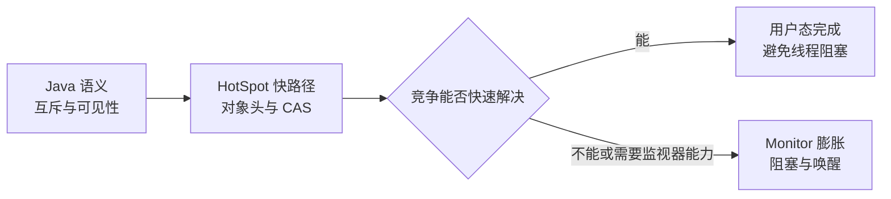
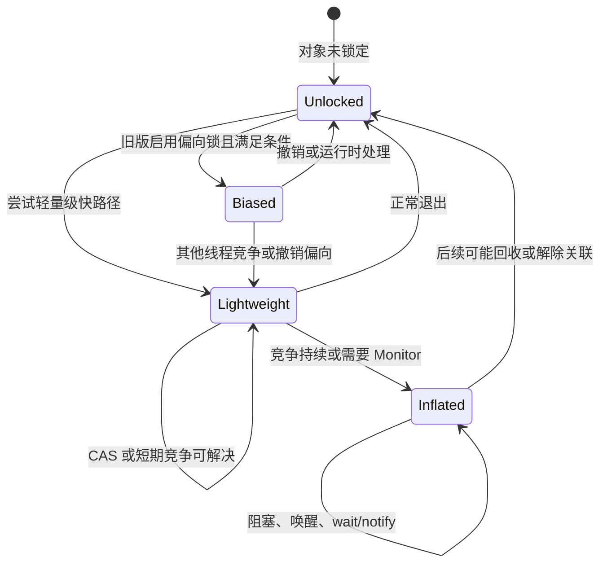
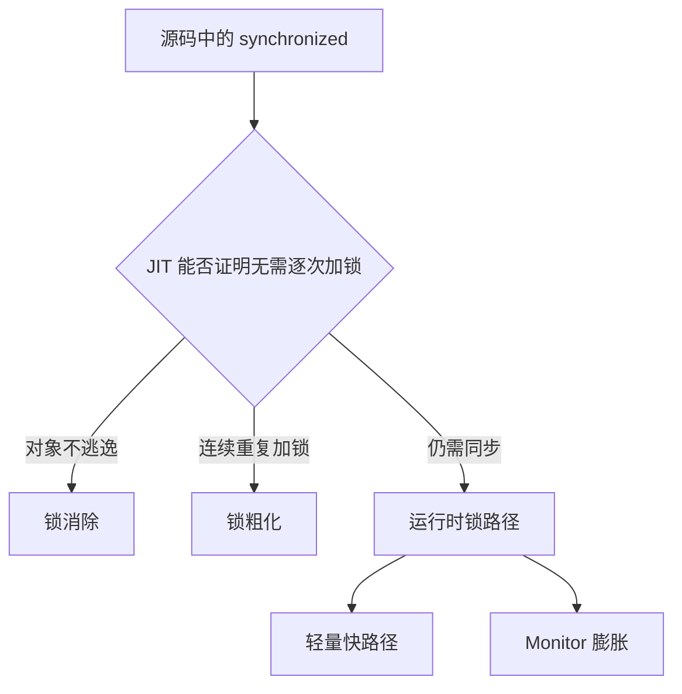

# Synchronized 锁升级：偏向锁、轻量级锁与重量级锁

> [!abstract] 核心结论
> `synchronized` 不是固定对应一个“重量级互斥锁”。经典 HotSpot 会根据竞争情况，尽量先走用户态快路径，再在需要时膨胀为对象监视器（Object Monitor）。但“无锁 → 偏向锁 → 轻量级锁 → 重量级锁”是理解旧版 HotSpot 的教学模型，不应被当成所有 JDK、所有场景都严格遵循的状态机。

来源素材：[[work-docs/daily-reports/2026-07-14#08:30 每日算法知识点 — JVM 深度 Synchronized 锁升级（偏向锁→轻量级锁→重量级锁）]]

## 1. 先建立正确心智模型

Java 语言层只规定了 `synchronized` 的语义：

1. 同一监视器同一时刻只能由一个线程持有；
2. 锁可重入；
3. 解锁先行发生于（happens-before）后续线程对同一监视器的加锁；
4. `wait()`、`notify()`、`notifyAll()` 必须在持有对象监视器时使用。

至于偏向、轻量级、自旋、膨胀和底层互斥原语，属于 JVM 实现策略，而不是 Java 语言规范承诺。本文主要讨论经典 HotSpot 实现。



## 2. 锁住的到底是什么

`synchronized` 锁住的是对象对应的监视器语义：

```java
synchronized (lock) {
    // 临界区
}
```

- 实例同步方法：锁当前实例 `this`；
- 静态同步方法：锁对应的 `Class` 对象；
- 同步代码块：锁括号中的对象。

HotSpot 为避免每个对象始终携带一个重量级监视器，会优先利用对象头（Object Header）中的 **标记字（Mark Word）** 编码锁状态或关联信息。Mark Word 还可能承载对象哈希码、GC 年龄等信息，因此它是一块被多种运行时能力复用的紧凑空间。

> [!warning] 不要死记位布局
> Mark Word 的位数和具体编码受 32/64 位、压缩指针、JDK 版本以及对象头工程变化影响。理解“复用对象头、通过状态位解释其余字段”比背固定二进制表更可靠。

## 3. 三阶段经典路径

### 3.1 偏向锁（Biased Locking）：偏向“长期只有一个线程”

偏向锁针对的不是“完全没有加锁开销”，而是**同一个线程反复进入同一同步块且几乎无竞争**的场景。

首次建立偏向关系后，对象头会记录与线程相关的标识。后续同一线程进入时，JVM 可以快速确认“仍然偏向我”，从而避免每次都执行完整的原子竞争操作。

```text
线程 T1 第一次进入
        │
        ▼
对象头偏向 T1
        │
        ├── T1 再次进入：快速确认并执行
        │
        └── T2 尝试进入：必须撤销或重新评估偏向
```

偏向锁的收益来自“省掉反复竞争”，成本则集中在**撤销**：JVM 需要确认原持有线程和锁记录状态，必要时进入安全点协调。若应用包含大量线程池、共享对象或频繁跨线程转移所有权，撤销成本可能超过节省的成本。

> [!important] 版本边界
> JEP 374 在 JDK 15 中默认禁用并弃用偏向锁相关选项。它针对的是现代应用中偏向锁收益下降、维护成本较高的问题。虚拟线程并不是 JEP 374 当时提出该决策的直接理由；把两者直接建立因果关系属于事后过度解释。

### 3.2 轻量级锁（Lightweight Locking）：竞争短暂时先别阻塞

经典实现中，线程进入同步块时会在自己的栈帧创建锁记录（Lock Record），保存对象 Mark Word 的副本等信息，再通过比较并交换（Compare-And-Swap, CAS）尝试让对象头指向该锁记录。

简化过程：

1. 在线程栈创建锁记录；
2. 读取对象当前 Mark Word；
3. CAS 尝试建立锁记录关联；
4. 成功则进入临界区；
5. 失败说明可能存在竞争、重入或状态变化，进入进一步判断；
6. 退出时尝试恢复对象头；若恢复失败，通常意味着锁已发生竞争或膨胀。

“轻量级”并不表示锁的语义变弱，而是表示无竞争或低竞争时尽量不用线程阻塞、内核调度和唤醒。

> [!note] 轻量级锁不等于“固定自旋 N 次”
> 自旋（Spinning）是处理短期竞争的一种策略，HotSpot 可能根据历史和运行情况自适应调整。具体策略随 JDK 演进，不能把“CAS 失败 → 固定次数忙等”当成稳定合同。

### 3.3 重量级锁（Heavyweight Lock）：让等待线程真正停下来

竞争持续、快路径无法解决，或运行时需要完整监视器能力时，锁会膨胀为对象监视器（ObjectMonitor）。等待线程可能被挂起，后续由 JVM 与操作系统调度机制配合唤醒。

重量级路径的主要成本包括：

- 线程阻塞与唤醒；
- 用户态与内核态协作；
- 上下文切换和调度延迟；
- Monitor 队列管理。

但重量级锁不是“失败状态”。当临界区很长或竞争激烈时，让线程阻塞通常比持续占用 CPU 自旋更合理。

## 4. 一次竞争如何演化



需要强调：

- 这是一张教学图，不是跨版本稳定的字节码状态机；
- 锁通常只膨胀而不会在临界竞争过程中立即降级；Monitor 的解除关联或回收由 JVM 在合适时机处理；
- JVM 可以直接绕过某些阶段；偏向锁关闭后，自然不存在偏向阶段；
- 重入、`wait()`、对象哈希码和不同 JDK 实现细节会改变路径。

## 5. 三种状态的本质差异

| 维度 | 偏向锁 | 轻量级锁 | 重量级锁 |
|---|---|---|---|
| 假设 | 长期由同一线程反复进入 | 无竞争或竞争很短 | 竞争持续或需要完整 Monitor |
| 主要手段 | 记录线程偏向 | 栈上锁记录、CAS、可能自旋 | ObjectMonitor、队列、阻塞与唤醒 |
| 优势 | 同线程重复进入成本低 | 避免阻塞和上下文切换 | 避免高竞争下无休止消耗 CPU |
| 风险 | 撤销成本、实现复杂 | 自旋过久浪费 CPU | 调度和唤醒成本较高 |
| 现代状态 | JDK 15 起默认禁用 | 仍是重要优化方向，但实现持续演进 | 仍承担高竞争和监视器能力 |

## 6. 哪些情况容易触发膨胀

### 6.1 多线程持续竞争

线程 A 尚未退出，线程 B、C 持续争用。若短暂等待无法解决，继续自旋只会浪费 CPU，JVM 更可能转入 Monitor 路径。

### 6.2 调用 `wait()`

`wait()` 需要把线程加入等待集合、释放监视器，并在收到通知后重新竞争。这要求完整的监视器管理能力，因此不能仅靠简单的栈上锁记录表达。

### 6.3 与对象身份信息发生交互

Mark Word 还承担身份哈希码等信息。调用 `System.identityHashCode(obj)` 等操作可能与对象头中的锁编码发生冲突，JVM 需要寻找其他保存位置，可能影响锁状态。具体行为依版本与当前状态而定。

### 6.4 临界区过长

锁内执行慢 I/O、远程调用、复杂计算或不可控回调，会显著延长持锁时间，让原本偶发的冲突变成持续竞争。

## 7. 与锁消除、锁粗化的关系

锁升级是**运行时竞争管理**；锁消除与锁粗化通常属于即时编译器（Just-In-Time Compiler, JIT）的优化视角。

### 锁消除（Lock Elimination）

如果逃逸分析（Escape Analysis）证明对象不会被其他线程观察，JIT 可以消除没有必要的同步操作。

### 锁粗化（Lock Coarsening）

如果同一线程连续对同一对象反复加解锁，频繁进入退出的成本可能高于扩大锁范围的成本。JIT 可以把相邻同步区域合并。



锁消除并非“JVM 帮你白写了锁”的普遍保证；它依赖实际编译层级、逃逸分析结果和代码形态，不能作为程序正确性的前提。

## 8. 内存语义比锁形态更重要

无论 HotSpot 选择哪条实现路径，`synchronized` 都必须保持 Java 内存模型（Java Memory Model, JMM）的可见性和有序性：

- 退出同步块前的写入，对之后成功获取同一监视器的线程可见；
- 编译器与 CPU 不能进行破坏该 happens-before 关系的重排序；
- CAS、自旋或操作系统互斥量只是实现手段，不能改变语言语义。

因此，不能因为“轻量级锁主要在用户态执行”就认为它只提供互斥、不提供内存可见性。

## 9. 工程实践：不要为了“避免重量级锁”盲目换锁

### 先优化临界区

1. 缩短持锁时间；
2. 把 I/O、RPC、日志格式化和用户回调移出锁；
3. 降低共享可变状态；
4. 检查是否锁错对象或锁粒度过大；
5. 明确并发量、竞争率和临界区时长。

### 再选择同步工具

- 简单互斥、可重入且不需要高级能力：优先考虑可读性强的 `synchronized`；
- 需要超时、可中断获取、公平性或多个条件队列：考虑 `ReentrantLock`；
- 读多写少：结合真实基准评估 `ReadWriteLock` 或 `StampedLock`；
- 计数器和独立原子状态：考虑 `LongAdder`、原子类；
- 能消除共享状态时，优先使用不可变对象、线程封闭或消息传递。

> [!tip] 评价锁性能要看数据
> 使用 Java Flight Recorder、线程转储、async-profiler、JMH 和业务压测观察阻塞、竞争与吞吐。不要仅凭“`synchronized` 会升级成重量级锁”做替换决定。

## 10. 常见误区校正

1. **“偏向锁是零开销”**：不准确。它仍有状态检查和维护成本，只是优化同一线程重复进入。
2. **“第二个线程出现就必然升级”**：不准确。JVM 还要判断原线程状态、重入和竞争是否真实发生。
3. **“轻量级锁就是自旋锁”**：过度简化。锁记录与 CAS 是核心，自旋策略只是可能的竞争处理方式。
4. **“重量级锁一定更差”**：不准确。高竞争或长临界区下，阻塞比持续自旋更节省 CPU。
5. **“锁只能升级、永远不会回收”**：应表述为竞争期间通常不会立即降级；膨胀 Monitor 可在后续安全时机解除关联或回收。
6. **“JDK 15 后不存在 synchronized 优化”**：错误。被默认禁用的是偏向锁，不是轻量路径、JIT 优化或 Monitor 自身优化。
7. **“偏向锁因虚拟线程而禁用”**：时间线与 JEP 374 的直接动机不支持这一说法。

## 11. 一句话记忆

```text
偏向锁：相信还是同一个线程。
轻量级锁：相信竞争很快结束，先在用户态解决。
重量级锁：承认竞争会持续，让等待线程休息。
```

真正的设计奥义不是“锁有三个等级”，而是：**用对当前竞争强度最便宜的机制，同时始终守住 Java 内存模型的语义。**

## 参考资料

- [JEP 374: Disable and Deprecate Biased Locking](https://openjdk.org/jeps/374)
- [JVM Anatomy Quark #23: Compressed References](https://shipilev.net/jvm/anatomy-quarks/23-object-header/)
- 《Java 并发编程实战》（Java Concurrency in Practice）

> [!info] 证据边界
> 本文依据日报素材及其中列出的 OpenJDK JEP 与 JVM Anatomy 资料整理；本轮未执行外部网页检索。HotSpot 锁实现持续演进，涉及特定 JDK 的对象头布局、轻量锁算法或诊断参数时，应再以目标版本 OpenJDK 源码和官方发行说明为准。
