# Tailcat 无控制平面的点对点隧道：设计实现深度解析与 opencode serve 远程代理实践

> [!abstract] 目标
> 用 Tailscale 开源数据平面组件，在**不需要 Tailscale 账号与控制平面**的前提下，把两台机器之间的任意 TCP 服务（典型场景：本机 `opencode serve` 的 HTTP 端口）穿透到远端，供 remote agent 连接。
>
> 本文分两半：前半部分源码级拆解 Tailcat 的设计与实现（ConnBlob、Meow 握手、WireGuard 隧道、NAT 穿透、密钥管理）；后半部分给出"本地搭建远程链接"的最佳实践，并落到 opencode serve 端口代理的完整方案矩阵与落地代码。

> [!success] 本次源码 Review 结论
> Tailcat 的核心不是“删掉控制服务器的 Tailscale”，而是把控制平面原本承担的三项职责拆散：**服务端定位**交给 ConnBlob 带外分发，**客户端准入**交给 Meow + `--allow`，**端点交换**交给经 DERP 发送的 disco `CallMeMaybe`。WireGuard、magicsock 与 Netstack 仍组成数据平面。
>
> 原文的总体判断成立，但有三处必须修正：
>
> 1. ConnBlob 主要是“服务端身份 + bootstrap relay 定位信息”，启用 `--allow` 后，它不再单独构成完整访问能力；
> 2. 当前 OpenCode TUI 的远程连接命令是 `opencode attach URL`，只有非交互命令使用 `opencode run --attach URL ...`；
> 3. 使用固定 `--allow` 时，客户端转发器必须加载与白名单公钥对应的**持久私钥**，不能继续让 `NewClient` 随机生成临时身份。

---

## 1. Tailcat 是什么：定位与动机

Tailcat 是 Tailscale 官方开源（2026-08 TailscaleUp 大会）的一个 remix：**"Tailscale without Tailscale, by Tailscale"**。它把 Tailscale 的**数据平面**（`magicsock` 内部）拿来当 netcat 用，但**砍掉了控制平面**。

| 维度 | Tailscale 官方 | Tailcat |
| --- | --- | --- |
| 控制平面 | 需要（账号、协调服务器、ACL、MagicDNS） | 无 |
| 连接元数据交换 | 控制平面下发 NetworkMap | 带外（out-of-band），你自己想办法传 token |
| 是否需要 root | 通常需要（TUN、路由、DNS） | 否，纯 userspace |
| 是否改路由/DNS | 会 | 否 |
| 形态 | 系统服务 | 一个 Go 库 + 一个 CLI |
| 身份/审计 | ACL、设备审批、Tailnet Lock | 只有 `--allow` 白名单（可选） |

核心权衡一句话：**用"没有账号、没有中心服务器"换"没有集中管理与审计"**。适合一次性、脚本化、点对点、不想引入账号体系的场景。

Tailcat 的数据平面四件套（全部复用 `tailscale.com` 依赖，见 `go.mod` 第 11 行 `tailscale.com v1.101.0-pre`）：

- **wgengine + userspace WireGuard**：完成 peer 配置、加密与包处理；不创建内核 TUN/TAP，因此无需 root。
- **magicsock**：传输层，在直连 UDP 与 DERP 中继之间多路复用，负责 STUN 端点发现与 UDP 打洞。
- **Netstack**（gVisor，`gvisor.dev/gvisor`）：userspace TCP/IP 栈，在进程内终结 TCP 连接，无需改 OS 网络配置。
- **DERP relay**：Tailscale 的加密中继协议，既做 rendezvous 信道，也做 NAT 穿透失败时的兜底数据路径。

> [!note] 关键点
> 因为整条 TCP 栈都跑在进程内（Netstack），没有内核参与，所以**退出进程前必须 `DrainTCP`** 把 FIN 发完，否则对端会等一个永远不会来的 EOF。源码里 `Server.DrainTCP`（`tailcat.go`）专门处理这件事，CLI 的 stdout 模式也因此在 `Close` 后等待客户端确认（见 `cmd/tailcat/tailcat.go` 的 `clientMode` 与 `server` 的 `OnTCP`）。

---

## 2. 架构总览

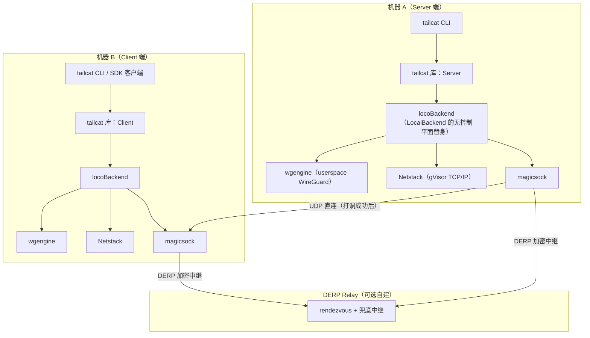

`locoBackend`（`tailcat.go` 第 209 行）是理解整个项目的钥匙：它的注释自述为 **"like tailscaled's LocalBackend, but crazier"**。它扮演 tailscaled 里 LocalBackend 的"世界枢纽"角色，但**没有 controlclient**——因为根本没有控制平面。服务端与客户端共用一个 `locoBackend`，用 `serverPub` 是否为零来区分自己是 Server 还是 Client（`lb.Start` 里 `if lb.serverPub.IsZero()`）。

### 2.1 被拆散的控制平面职责

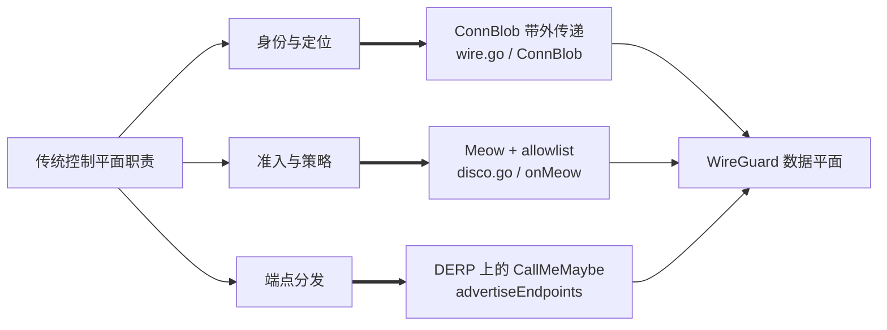

这解释了“无控制平面”真正的含义：不是控制信息消失，而是**不再由长期在线、集中式服务统一生成和下发**。Tailcat 仍然需要 bootstrap 元数据、peer 准入和 endpoint discovery，只是把它们分别下沉到 token、点对点握手和 DERP side channel。

### 2.2 代码责任地图

| 文件/入口 | 责任 | 关键边界 |
| --- | --- | --- |
| `wire.go` | ConnBlob 的紧凑 CBOR wire schema | 与上游 `tailcfg` 解耦，但项目不承诺 wire 稳定 |
| `disco.go` | Meow/Meowed 编解码 | 只承载发现握手，不承载业务流量 |
| `tailcat.go: Server.Start` | 构建 server 侧 engine、netstack、filter | 配置字段必须在 `Start` 前确定 |
| `tailcat.go: Client.ensureStarted/up` | 懒加载、解析 region、Meow 注册 | 第一次 `Dial` 会隐式启动并注册 |
| `tailcat.go: locoBackend.Start` | 组装本地 NetworkMap 与 wgengine 回调 | 没有 controlclient，peer 配置按需生成 |
| `tailcat.go: advertiseEndpoints` | 经 DERP 发送加密 disco 端点 | 浏览器 WASM 无 UDP，当前不执行 |
| `cmd/tailcat/tailcat.go` | CLI key、端口策略、SOCKS、stdout 管道 | CLI 比 Go API 多一层可用性与防御性封装 |

---

## 3. 关键抽象：ConnBlob 连接 token

服务端身份就是一个**连接 token**（内部叫 `ConnBlob`），形如 `tcXYZ...`：`"tc"` 前缀 + base64url 编码的 CBOR（`cbor.io`），内含：

- 服务端 WireGuard 公钥（Curve25519，32 字节）；
- DERP 信息，二选一：
  1. 一个小的整数，引用默认 DERP map（`https://tailcat.dev/derpmap.json`）里的某个 region —— token 短（约 50 字节）；
  2. 完整内嵌的 DERP 节点元数据 —— token 长，但客户端无需再拉 DERP map（`--full-address` / `tailcat resolve` 产生这种形式）。

wire 格式独立于上游 `tailcfg`（见 `wire.go`），用单字符 CBOR 字段名（`p`/`r`/`i`/`c`/`m`/`N`/`n`/`h`/`t`/`4`/`6`/`s`/`d`/`x`）压缩体积，并有 `TestWireFieldNames` 锁死字段名不可变更——这是它自己的稳定 wire 约定。

```text
短形式：tc + CBOR{ "p": 服务端公钥, "i": regionID }        （约 50 字节）
长形式：tc + CBOR{ "p": 公钥, "r": [DERP 节点完整元数据] }  （自包含，客户端免查 map）
```

---

## 4. 连接流程深度拆解

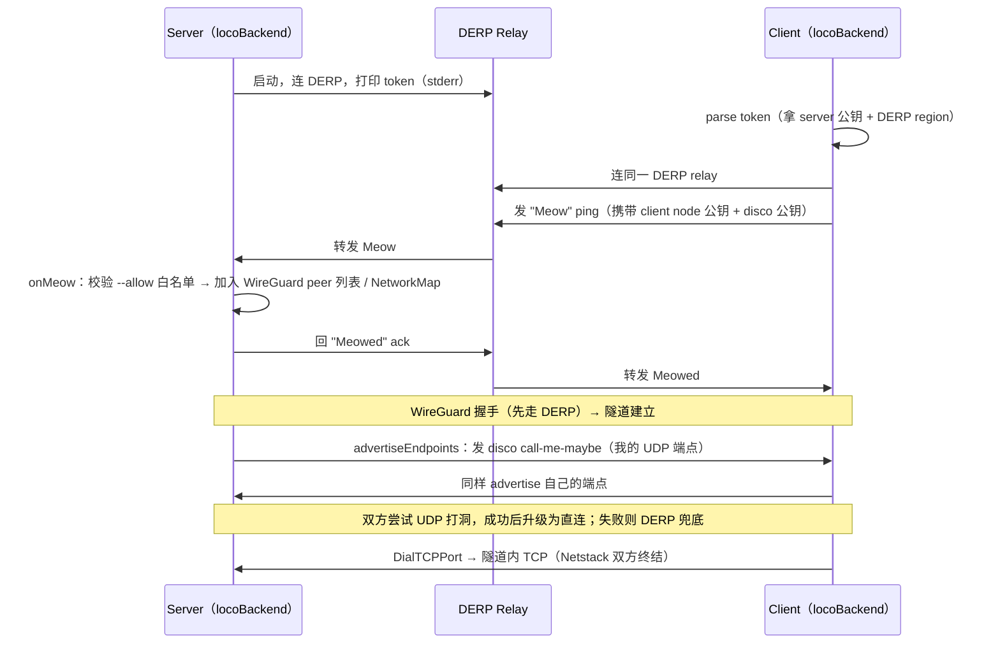

### 4.1 Meow 握手（`disco.go`）

Meow 消息是**原始 DERP 包**（非 disco 帧），用 4 字节 magic `"meow"` 标识（刻意区别于 WireGuard 消息类型 1–4 和 disco 的 `"TS💬"` magic），后跟 1 字节类型：

- `meowTypePing = 0x01`（client → server）：携带 client 的 node 公钥 + disco 公钥；
- `meowTypePong = 0x02`（server → client）：`"Meowed"` 确认。

服务端 `onMeow`（`tailcat.go` 第 1240 行）是核心授权点：

1. 校验 `allowedClients` 白名单（若非空），不在名单内则**静默忽略**——不回 Meowed，对端连 SSH 端口都探测不到；
2. 给 client 分配 `tailcfg.Node`（ID 从 2 递增，服务端恒为 ID 1），加入 `clients` map 与 `NetworkMap`；
3. **不重新配置引擎**：WireGuard peer 是懒加载的（`SetPeerConfigFunc` 等 config source），等 client 的握手到达才建立；
4. 异步 `advertiseEndpoints` 把自己的 UDP 端点广播给新 client。

这里还有一个容易忽略的安全不变量：`MeowPing` 虽然编码了 client node key，但 server 的接收路径以 **DERP 元数据给出的 `src`** 作为准入和 peer 身份；解析 payload 时实际只取 `discoPub`。也就是说，客户端不能仅靠在 payload 里填写别人的 node key 来冒充 allowlist 身份。Meow 的职责是把“DERP 已识别的发送者”登记进本地 NetworkMap，而最终数据机密性与 peer 认证仍由 WireGuard 握手完成。

`Meowed` 也不只是礼貌性 ACK。server 在 `onMeow` 完成 peer map 更新后才回复，client 的 `up()` 只有收到它才允许 `Dial` 继续。因此它构成一个明确的 happens-before：

```text
server 已登记 peer
        ↓
发送 Meowed
        ↓
client 的首次 Dial 解锁
        ↓
WireGuard peer 可被懒加载并建立连接
```

### 4.2 NAT 穿透（`advertiseEndpoints` + disco）

控制平面缺位时，端点交换靠双方主动广播：`locoBackend.advertiseEndpoints`（第 1091 行）把本机 UDP 端点（magicsock 报告的，含 STUN 学到的公网 IP:port 与本地接口地址）封进 disco `CallMeMaybe`，用 `discoPriv.Shared(peerDiscoKey).Seal(...)` 封帧后经 DERP 发给每个 peer。

一个精妙设计：**双方都强制 disco key 从 node key 派生**（`createEngine` 的 `conf.ForceDiscoKey`，第 1360 行）。服务端因此可以让 client 直接从 ConnBlob 预测自己的 disco key，省一次往返；双方也知道自己的 disco 私钥，才能 seal 端点广播。浏览器端（`js/wasm`）无 UDP，`advertiseEndpoints` 直接 return，直连留待 WebRTC（issue #4）。

端点广播不是“启动时发一次”这么简单，而有两个触发器：

- `onEngineStatus` 观察 magicsock 的 `LocalAddrs`，去重排序后发现变化便重新广播；
- Meow 完成后双方各自调用 `advertiseEndpoints`，覆盖“endpoint 早已产生，但 peer 刚加入”的时序。

这两个触发器共同解决了控制平面缺位后的竞态：无论“先知道端点”还是“先知道 peer”，最终都会至少有一次广播机会。`advertiseEndpoints` 自身复制锁内状态、锁外发送，避免网络 I/O 持有 `b.mu`。

### 4.3 寻址（`tcAddrForKey`）

每个 peer 的 IPv6 地址由 WireGuard 公钥确定性派生：取 Tailscale 的 ULA 前缀 `fd7a:115c:a1e0::/48`，用 node key 的 raw 前 10 字节填充剩余 80 位（`tcAddrForKey`，第 1311 行）。README 明确这是实现细节，未来可能改（例如从 IP 头里去掉这些字节以回收冗余 MTU）。

### 4.4 懒 peer 配置与过滤器：两层门禁

Tailcat 不再把完整 peer 列表塞进 `wgcfg.Config`。`locoBackend.Start` 注册三个实时回调：

- `SetPeerConfigFunc`：给定 peer key，返回其可声明的 `AllowedIPs`；
- `SetPeerByIPPacketFunc`：把出站目标 IP 映射为 peer key；
- `SetPeerForIPFunc`：为 ping/status 找回 NetworkMap node。

因此，`onMeow` 更新 NetworkMap 后无需再次执行昂贵的 engine `Reconfig`；真正的 WireGuard peer 在握手或流量到达时懒创建。这是项目适配新版 Tailscale wgengine 的关键实现选择。

server 入口另有两层、语义不同的端口门禁：

1. `ServedTCPPorts` 构建 packet filter，在 SYN 到达 Netstack handler 前静默丢弃未开放端口；
2. `OnTCP(port)` 返回 `nil` 时由 Netstack 对已到达的连接发送 RST。

CLI 在显式 `--serve=4096` 时会同时配置端口集合和 `OnTCP`，属于 defense in depth。测试 `TestHalfClose` 也锁定了二者差异：过滤器拒绝表现为超时，而 handler 拒绝可以快速 RST。

### 4.5 TCP 半关闭为何是正确性问题

`ProxyConns` 不是普通的两个 `io.Copy`：单向读到 EOF 后，它优先调用另一端的 `CloseWrite`，把 FIN 沿代理链传递，同时保留反向响应通道；两向都结束后才关闭连接。否则“客户端发完请求后半关闭写端、继续等响应”的 netcat/HTTP 风格协议会被过早撕断。

`DrainTCP` 解决的是另一个层次的问题：内核 TCP 栈退出后通常仍能由内核发送排队的 FIN，但 Tailcat 的 TCP 状态全在进程内。进程过早退出会把 FIN 和未确认数据一起丢掉。因此 stdout 一次性 server 在关闭连接后还要等待 TCP endpoint 真正结束。它适合被动关闭方；主动关闭方可能停留在 `TIME-WAIT`，必须用 context timeout 兜底。

---

## 5. 密钥管理与安全边界

| 模式 | 行为 | 适用 |
| --- | --- | --- |
| 临时密钥（默认） | 每次运行内存里生成新 key，退出即死，地址一次性 | 一次性传输、安全默认 |
| 保存密钥（`genkey`） | key 落盘 `~/.config/tailcat/keys/<name>.private.json`，地址跨重启稳定 | 需要固定地址、DNS 发布 |
| `--allow=<pubkey>` | 服务端白名单，非名单 client 的 Meow 被静默丢弃 | 固定长期服务必须开启 |

安全模型要点：

- **默认模式下地址近似能力**：未启用 allowlist 时，拿到 token 的人可以发起 Meow 并成为 peer；启用 `--allow` 后，还必须持有白名单公钥对应的客户端私钥。因此 ConnBlob 更准确地说是“服务端身份与可达性描述”，不是永远独立成立的 bearer credential。
- **`default` 是魔法键名**：一旦存在，裸 `tailcat` 会自动用它而非临时 key，启动行会告诉你用了哪种（`saved key "default"` vs `new address`）。
- **客户端身份键**：`genkey --client` 生成 `client-default`，client 模式自动使用，供服务端 `--allow` 引用；WireGuard 在 SSH 服务器看到任何包之前就完成客户端认证。
- **DNS TXT 发布**：token 可写成 `tailcat=tc...` TXT 记录，任何接受 token 的地方都能填域名（`tailcat ssh example.com`）。带点的参数一律按域名解析（base64 里不可能有 `.`，见 `addrBlobArg`）。
- **allowlist 不是在线会话管理器**：Go API 只有 `AddAllowedClient`，没有删除或强制断开既有 peer 的 API；CLI allowlist 也在进程启动时构建。撤销某个长期客户端的稳妥方式是更新白名单并重启服务，而不一定要轮换 server key。

> [!warning] 安全提示
> 无控制平面意味着**没有集中吊销、集中审计与中心 ACL**。未设置 allowlist 且 token 泄漏时，可轮换 server key 使旧 token 作废；已经启用 allowlist 时，泄漏 token 本身不等于泄漏已授权 client private key。对 opencode serve 这类能读写项目、调用工具乃至执行命令的 agent 后端，务必叠加 `--allow` 白名单 + OpenCode 自身的 `OPENCODE_SERVER_PASSWORD`（见 §7.5）。

---

## 6. 本地搭建远程链接的最佳实践

### 6.1 自建 DERP relay

不依赖 Tailscale 的限速公共 relay（`tailcat.dev` 的 DERP 无 SLA、可随时撤销）：

```sh
# 用官方 derper（需要带 TLS 证书的域名，derper 可自己走 Let's Encrypt）
server$ tailcat genkey --region=derp.example.com
server$ tailcat --serve=22
```

token 内嵌 relay hostname，客户端零额外 flag，也完全不接触 Tailscale 的 DERP map/relay。整个 relay 集群可用 `--derpmap-url` 指向自建 map JSON。

### 6.2 密钥生命周期最佳实践

- **固定地址**用 `genkey --fixed-region`：genkey 时探测一次最近 region 并烤进 key 与 token，服务端重启不再重新探测（否则 DNS 发布的 token 会失效）。
- **长地址**用 `--full-address` 或 `tailcat resolve`：内嵌 DERP 元数据，客户端免一次 map 拉取，连接更快。
- **限制客户端**：固定服务务必 `--allow=nodekey:...`（`genkey --client` 打印的公钥）。

### 6.3 NAT 穿透优化

- `tailcat ping --until-direct <token>`：持续 ping 到直连建立为止，验证打洞是否成功；
- 直连优先、DERP 兜底：直连延迟/吞吐远优于 relay；穿透失败仍可用，只是走限速中继；
- 家庭网络建议开启 UPnP/NAT-PMP、避免双重 NAT、保留 IPv6，直连成功率更高（参考 [[家庭网络双路由设计：光猫桥接、策略网关与 Full Cone NAT 工程实践]]）。

---

## 7. 实战：把 opencode serve 端口远程代理给 remote agent

### 7.1 opencode serve 的事实基线

`opencode serve` 是一个 headless HTTP 服务器，暴露 **OpenAPI 3.1** 端点供客户端使用（官方文档 `opencode.ai/docs/server`）：

| 事实 | 值 |
| --- | --- |
| 默认监听 | `127.0.0.1:4096`（`--port`/`--hostname` 可改） |
| OpenAPI spec | `http://localhost:4096/doc` |
| REST 资源 | sessions、messages、files、MCP、providers、TUI control |
| 鉴权 | `OPENCODE_SERVER_PASSWORD` 启用 HTTP basic auth（用户名默认 `opencode`） |
| 客户端 attach | TUI：`opencode attach http://HOST:4096`；单次执行：`opencode run --attach http://HOST:4096 "..."` |
| Web/移动后端 | `opencode web --port 4096 --hostname 0.0.0.0` |

> [!note] 版本差异
> 本机 OpenCode 为 `1.18.25`。官方 server 文档当前写 `serve` 默认 `127.0.0.1:4096`，而 `run --attach` 自己的本地辅助 server 仍可能使用随机端口。落地时仍建议**显式 `--port 4096 --hostname 127.0.0.1`**，不要把不同子命令的 port 默认值混为一谈。

**目标场景**：机器 A（本地 Mac）跑 `opencode serve`，机器 B（远端，或另一台 agent 主机）要连接它，让 remote agent（opencode SDK/客户端、MCP client、或其他 agent 运行时）访问 A 的 opencode 后端。

### 7.2 方案矩阵

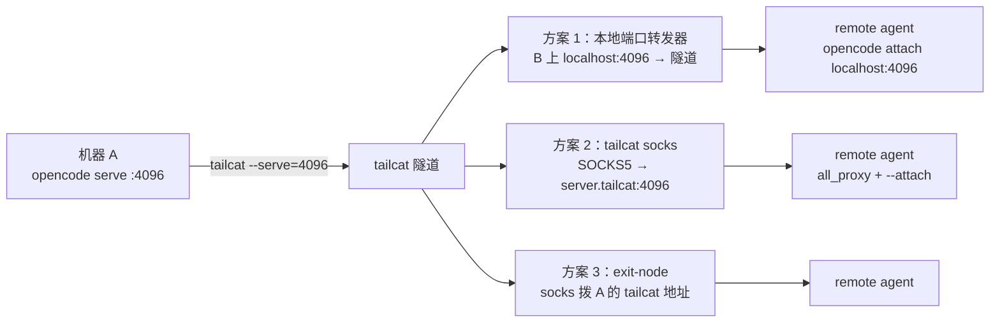

| 方案 | 服务端 | 客户端 | 持久性 | 适用 |
| --- | --- | --- | --- | --- |
| 1. 本地端口转发（Go 库） | `opencode serve --port 4096` + `tailcat --serve=4096` | 跑一个转发器监听 `localhost:4096` | 长期 | **推荐**，agent 长期连接、透明 |
| 2. SOCKS5 | 同上 | `tailcat socks <token> <cmd>` | 单进程 | 临时命令、一次性 |
| 3. exit-node | `tailcat --serve=exit-node` | `tailcat socks <token> cmd` | 单进程 | 需访问 A 的整个网络时 |
| 4. `attach` 经 SOCKS | 同上 | `tailcat socks <token> opencode attach http://server.tailcat:4096` | 单进程 | 临时交互 TUI |

### 7.3 推荐落地：Go 库本地端口转发器

Tailcat CLI 的 client 模式是"一次性管道"（stdin/stdout），不适合持续 HTTP。最干净的做法是用 Tailcat 的 Go 库写一个 ~30 行的持久转发器，在 B 上监听 `localhost:4096` 并转发到 A 的 4096：

```go
// forward.go —— client 端：本地 localhost:4096 → tailcat server 的 4096
package main

import (
	"context"
	"encoding/json"
	"log"
	"net"
	"os"

	"github.com/tailscale/tailcat"
)

func main() {
	if len(os.Args) != 3 {
		log.Fatalf("usage: %s <conn-blob> <client-private.json>", os.Args[0])
	}
	b, err := os.ReadFile(os.Args[2])
	if err != nil {
		log.Fatal(err)
	}
	var saved tailcat.PrivateKey
	if err := json.Unmarshal(b, &saved); err != nil {
		log.Fatal(err)
	}
	cl := &tailcat.Client{
		Server: tailcat.ConnBlob(os.Args[1]),
		Key:    saved.Private, // 必须与 server --allow 的公钥对应
	}
	defer cl.Close()

	ln, err := net.Listen("tcp", "127.0.0.1:4096")
	if err != nil {
		log.Fatal(err)
	}
	log.Printf("listening on %s, forwarding to tailcat server :4096", ln.Addr())
	for {
		c, err := ln.Accept()
		if err != nil {
			log.Fatal(err)
		}
		go func(c net.Conn) {
			defer c.Close()
			rc, err := cl.DialTCPPort(context.Background(), 4096)
			if err != nil {
				log.Printf("dial server: %v", err)
				return
			}
			tailcat.ProxyConns(c, rc) // 处理双向拷贝与 TCP half-close
		}(c)
	}
}
```

两端操作：

```sh
# 机器 B：先生成持久 client identity，并把输出公钥安全地交给 A
tailcat genkey --client

# 机器 A（服务端）：OpenCode 继续只绑定 loopback
OPENCODE_SERVER_PASSWORD='<强随机密码>' \
  opencode serve --hostname 127.0.0.1 --port 4096 &
tailcat --serve=4096 --allow=nodekey:<B的公钥>
# 🐈 Server listening with new address: tcXXXX...

# 机器 B（remote agent 端）
go run forward.go tcXXXX ~/.config/tailcat/keys/client-default.private.json
OPENCODE_SERVER_PASSWORD='<同一密码>' \
  opencode attach http://localhost:4096

# 非交互 remote agent 调用
OPENCODE_SERVER_PASSWORD='<同一密码>' \
  opencode run --attach http://localhost:4096 "检查当前项目"
```

此时 B 上的 opencode 客户端把 `localhost:4096` 当作本地服务，透明地经 Tailcat 隧道到达 A。

> [!important] 原示例为何会失败
> `tailcat genkey --client` 只会让 **Tailcat CLI 的 client modes** 自动加载 `client-default`。直接使用 Go 库的 `tailcat.NewClient(token)` 会在首次使用时生成临时 client key；若 A 已用固定公钥配置 `--allow`，这个临时身份会被静默忽略，最终表现为 `Ping`/`Dial` 超时。上面的转发器显式读取 private JSON，才与 allowlist 闭环。

### 7.4 请求链路与信任边界

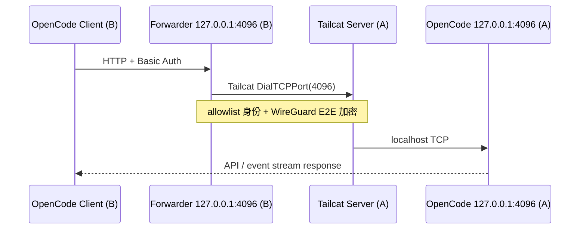

OpenCode 无需绑定 `0.0.0.0`：Tailcat CLI 在 A 上主动拨 `localhost:4096`，因此 API 仍可保留 loopback 安全边界。只有浏览器跨 origin 直连 OpenCode server 时才需要额外评估 `--cors`；TUI/CLI 经本地转发器访问不需要为了隧道而放宽 CORS。

### 7.5 安全纵深（必做）

opencode serve 默认无鉴权（它只监听 `127.0.0.1` 本身就是安全边界）。一旦穿透到远端，必须叠加两层：

1. **Tailcat 层**：`--allow=nodekey:...` 白名单，WireGuard 在 HTTP 层之前就拒绝未授权客户端；
2. **OpenCode 层**：`OPENCODE_SERVER_PASSWORD=... opencode serve` 启用 basic auth。

两者同时启用，避免"隧道口子开了 + opencode 裸奔"。

---

## 8. iOS 侧深入方案：Surge 能否替代 client forward

> [!success] 先给结论
> **可以替代“最终效果”，但不能直接替代 Tailcat client forward 的协议实现。**
>
> - 若 Mac 与 iPhone 都运行 Surge，推荐用 **Surge Ponte** 整体替换 `Tailcat + iOS 本地端口转发器`：iPhone 直接访问 `http://<Mac名称>.sgponte:4096`。
> - Surge iOS 不能把 Tailcat ConnBlob 当作 WireGuard、SOCKS5 或 HTTP 节点导入。Tailcat 在 WireGuard 之外还有 Meow/DERP/端点交换/Netstack，协议边界不兼容。
> - 若必须保留 Tailcat，仍需在一个能运行 Tailcat 客户端的节点上终结 Tailcat，再把标准 TCP/HTTP/SOCKS 接口交给 iOS Surge；Surge 只能接这段“标准化之后”的链路。

### 8.1 为什么“Surge 支持 WireGuard”仍不等于“支持 Tailcat”

最容易产生的误判是：Tailcat 底层用了 WireGuard，Surge 也支持 WireGuard，所以把 Tailcat token 填进 Surge 就能连。实际缺失的是 WireGuard 外面的控制逻辑：

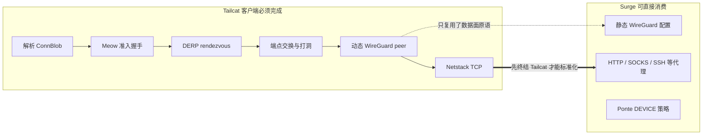

Tailcat 的 `tc...` token 不是标准 WireGuard 配置：它没有直接给出一套可静态导入 Surge 的 endpoint、peer address、AllowedIPs 和完整会话建立流程。Surge 的 WireGuard policy 也不会发送 Tailcat 的 Meow，不会经指定 DERP 注册 client，更不会按 Tailcat 规则派生地址和更新动态 endpoint。因此：

| 尝试 | 结果 | 根因 |
| --- | --- | --- |
| 把 `tc...` 填成 Surge WireGuard 节点 | 不可行 | token/schema 与标准 WireGuard 配置不同 |
| 只提取 server 公钥手工建 WireGuard | 不可行 | 缺少 Meow 准入、DERP bootstrap、动态 peer/endpoint 与地址约定 |
| 让 Surge iOS 监听 `127.0.0.1:4096` 做任意 TCP reverse forward | 不是 Ponte 的工作方式 | Surge 负责流量接管和策略转发，不是 Tailcat SDK 宿主 |
| 让 Surge 连接现成 SOCKS/HTTP 上游 | 可行 | 此时 Tailcat 已由别的进程终结，Surge 只消费标准代理接口 |

### 8.2 推荐架构：Surge Ponte 直接暴露 Mac 的 loopback 4096

Surge Ponte 把运行 Surge 的设备组成端到端加密的设备网络。**Surge Mac 可作为 Ponte server；Surge iOS 只能作为 Ponte client。** 同一 iCloud 账号会自动登记设备，也可通过确认码跨账号分享。iPhone 访问 `<name>.sgponte` 时，Surge 动态使用 `DEVICE:<name>` 策略；在 Mac 端目标会落到 `127.0.0.1`，所以只监听 loopback 的服务也能访问。

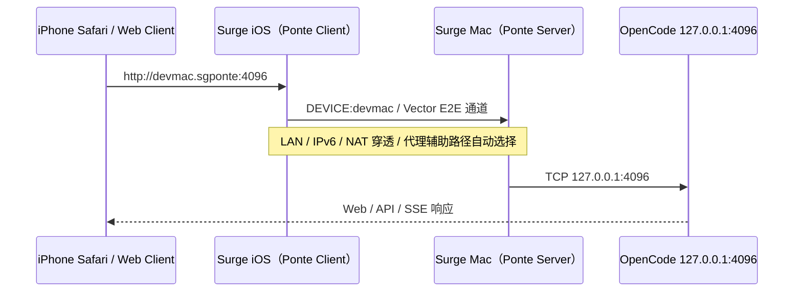

这条路径取代的是 B 侧这段：

```text
原方案：iOS 上的 client forward :4096 → Tailcat → Mac :4096
Ponte：  iOS 请求 devmac.sgponte:4096 → Surge Ponte → Mac 127.0.0.1:4096
```

它不是把 iPhone 变成一个给其他应用连接的本地 `4096` 监听器，而是让 Surge VIF 接管 iPhone 应用发往 `.sgponte` 的请求。对 Safari 或能填写远端 URL 的 OpenCode 客户端，这比伪造 `localhost:4096` 更自然。

### 8.3 最小落地步骤

#### A. Mac：保持 OpenCode loopback + Basic Auth

```sh
OPENCODE_SERVER_USERNAME='opencode' \
OPENCODE_SERVER_PASSWORD='<强随机密码>' \
opencode web --hostname 127.0.0.1 --port 4096
```

- iPhone 浏览器使用时选 `opencode web`；纯 API/远端 TUI 后端可用 `opencode serve`。
- 不要因为要用 Ponte 就改成 `0.0.0.0`。Ponte 可访问 server 侧 loopback，保留 `127.0.0.1` 能减少局域网裸露面。
- 密码通过密码管理器传到 iPhone，不写入 Surge profile、URL、笔记或截图。

#### B. Surge Mac：启用 Ponte server

1. 在 Surge Mac 的 Overview 中开启 Surge Ponte。
2. 选择一个稳定名称，例如 `devmac`；之后地址为 `devmac.sgponte`。
3. 让向导检测 NAT，并按结果选择：
   - Full Cone NAT：可直接 NAT traversal；
   - 其他 NAT：选支持 UDP relay 的代理辅助穿透，或配置静态端口转发；
   - 同一 LAN：Ponte 会自动走 LAN，不消耗中继流量。
4. 若使用代理辅助穿透，向导会验证代理是否具备所需的 Full Cone UDP relay 能力。可候选协议包括 Snell、Shadowsocks、Trojan、SOCKS5、WireGuard；“协议名支持 UDP”不等于实际服务器/NAT 一定合格，以向导检测为准。

#### C. Surge iOS：作为 client 接入

1. iPhone 开启 Surge 与 Surge Ponte，确认列表中可见 `devmac`。
2. Safari 访问：

```text
http://devmac.sgponte:4096
```

3. 输入 OpenCode Basic Auth 凭据。
4. 若 iPhone 当前网络 UDP 丢包或封锁严重，可为 Ponte client 配置代理路径；它与 Mac 端的 proxy-assisted NAT traversal 是两个独立选择。

> [!important] iOS 客户端形态边界
> `opencode attach` 是终端命令，普通 iPhone 上没有 OpenCode TUI 可直接执行。iOS 的首选消费端是 Safari 打开 `opencode web`，或一个支持填写 server URL 与 Basic Auth 的原生/自建客户端。若某客户端硬编码 `localhost:4096` 且不能改 URL，Ponte 的 `.sgponte` 访问不能无条件替代它，需要改客户端配置或增加真正的本地 listener。

### 8.4 是否需要写 Surge 规则

访问 Mac 自身服务时，通常**不需要额外规则**：直接访问 `devmac.sgponte:4096` 会动态生成 `DEVICE:devmac` 策略。显式规则主要用于“以 Mac 为跳板访问它所在的其他内网设备”：

```ini
[Rule]
DOMAIN-SUFFIX,myhome,DEVICE:devmac
# 或访问明确的内网地址段
IP-CIDR,192.168.150.0/24,DEVICE:devmac,no-resolve
```

如果只为 OpenCode 使用，不建议把所有流量都送进 `DEVICE:devmac`；最小暴露、最小路由范围更容易诊断，也避免把 iPhone 的普通流量误送回家中。

### 8.5 三种 iOS 落地拓扑对比

| 拓扑 | iOS 需要运行 Tailcat | Mac 额外组件 | URL | 推荐度 |
| --- | --- | --- | --- | --- |
| Surge Ponte | 否 | Surge Mac Ponte server | `http://devmac.sgponte:4096` | **首选：已有 Surge Mac+iOS** |
| 官方 Tailscale | 否 | Tailscale | `http://<tailnet-name>:4096`，通常需调整监听/转发 | 首选：多设备、ACL、审计 |
| Tailcat + 中间转发节点 | 否（由中间节点运行） | Tailcat server；另需常驻 client gateway | gateway 暴露的 HTTP/SOCKS 地址 | 仅在必须保留 Tailcat 时 |

“Tailcat + 中间转发节点”可以这样工作：在 NAS、路由器或另一台 Mac/Linux 上运行 §7.3 的 Tailcat forwarder，再用一个 iOS 可达且受认证保护的标准入口暴露它。此方案多一跳、多一个长期凭据和一套运维面；如果 Mac 本来就在运行 Surge，Ponte 通常更简单。

### 8.6 安全模型变化：从能力 token 转向设备登记

| 维度 | Tailcat | Surge Ponte |
| --- | --- | --- |
| 设备发现 | ConnBlob 带外分发 | iCloud 登记或跨账号确认码 |
| 客户端准入 | `--allow` 公钥 | Ponte 设备关系/分享关系 |
| 数据加密 | WireGuard E2E | Vector/Ponte E2E |
| 穿透/兜底 | UDP 打洞 + DERP | LAN、IPv6、NAT traversal、代理辅助等自动选择 |
| 集中审计/细粒度 ACL | 很弱 | 设备级管理，仍不等同企业级零信任 ACL |
| 撤销动作 | 改 allowlist/轮换 key 并重启 | 移除设备或分享关系；再轮换 OpenCode 密码 |

Ponte 消除了复制 ConnBlob 与 client private key 的操作，但没有消除应用层鉴权需求。`opencode serve/web` 仍具备读写项目和执行工具的高权限，Ponte 与 Basic Auth 必须同时保留。

### 8.7 iOS 验收与故障定位

按从下到上的顺序验证，避免把应用错误误判为隧道错误：

1. **应用层（Mac 本机）**

   ```sh
   curl -u 'opencode:<密码>' http://127.0.0.1:4096/global/health
   ```

   预期得到健康状态与版本。若失败，先修 OpenCode，不看 Ponte。

2. **设备发现（iPhone）**：Surge iOS 的 Ponte 页面能看到 `devmac`，状态不是仅注册未连通。
3. **端口链路（iPhone）**：Safari 打开 `http://devmac.sgponte:4096/global/health`；先测短请求，再打开完整 Web UI。
4. **长连接（iPhone）**：创建会话并观察事件/流式响应。OpenCode 使用 SSE，短健康检查成功不代表长连接一定稳定。
5. **网络切换**：分别在家庭 Wi-Fi、蜂窝网络、外部 Wi-Fi 下测试；锁屏后再恢复一次，确认 Network Extension 重连行为。

| 症状 | 判断 | 优先动作 |
| --- | --- | --- |
| `.sgponte` 完全打不开 | Ponte 发现/通道问题 | 检查两端 Ponte 状态、iCloud/分享关系、Mac 是否在线 |
| 健康检查通，首页不通 | OpenCode Web、鉴权或客户端缓存 | 核对 `web` 而非 `serve`、Basic Auth、浏览器错误 |
| 短请求通，流式回复中断 | SSE 长连接、网络切换或代理 UDP 路径不稳 | 查看 Surge request/log；切换 client proxy 或 Ponte 通道 |
| 家庭 Wi-Fi 可用，蜂窝不可用 | NAT/UDP/代理辅助路径问题 | 在 Mac 重新跑 Ponte 向导；选合格 UDP relay 代理或静态转发 |
| 能访问 Mac，不能访问 NAS | 跳板规则/DNS mapping 问题 | 增加精确 `DEVICE:devmac` 规则，并确保在触发 DNS 解析的规则之前 |
| 返回 401 | 隧道已通，OpenCode 鉴权失败 | 核对 username/password，不要放宽或关闭鉴权 |

### 8.8 最终选型规则

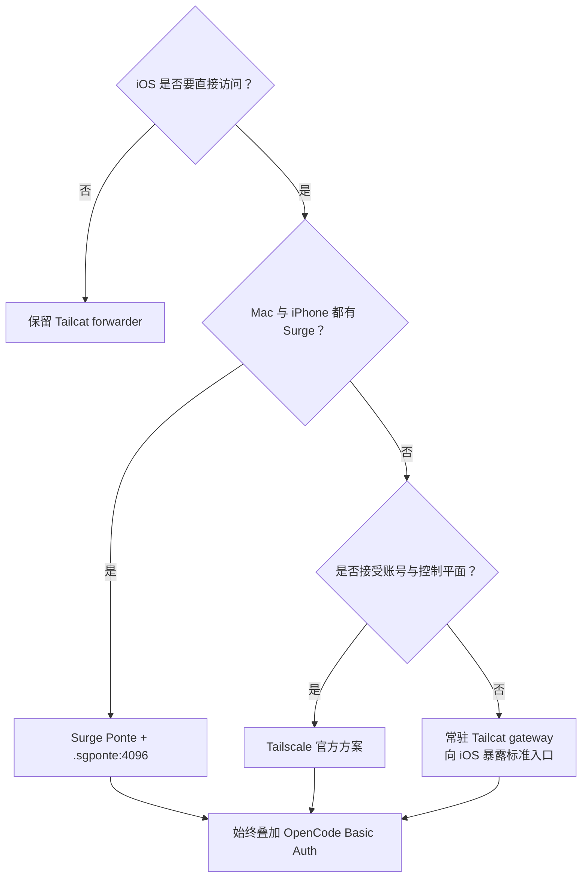

工程上的推荐顺序是：**已有 Surge 全家桶就用 Ponte；需要组织级 ACL/多设备治理就用 Tailscale；明确追求无控制平面、一次性或可嵌入 Go 时才保留 Tailcat。** 不建议为了复用 Tailcat 而在 iOS 侧拼装一个缺失 Meow/DERP 控制逻辑的“伪 WireGuard 节点”。

---

## 9. RootShell 启发：不要远程搬运整个 OpenCode API

> [!success] 核心结论
> RootShell 带来的最佳思路不是“再做一个 iOS Tailcat forwarder”，而是**重新选择跨公网的表示层**：让 OpenCode server、TUI client、项目文件和 agent 状态都留在 Mac，只把终端输入与屏幕差量通过适合移动网络的 Roam 通道送到 iPhone。
>
> 对移动编码而言，推荐顺序是：
>
> 1. **RootShell Roam/tssh → Mac 本地运行 OpenCode**：日常首选；
> 2. **RootShell 后台 Local Forward → `127.0.0.1:4096`**：必须使用 Web UI 或 iOS 原生 HTTP client 时；
> 3. **RootShell TSSH VPN**：需要多个 iOS App 透明访问时，但会与 Surge 的 Packet Tunnel 冲突；
> 4. **Tailcat WASM in RootShell**：有研究价值，当前不作为生产主路径。

### 9.1 为什么移动端应该传“终端状态”，而不是 OpenCode HTTP/SSE

`opencode serve` 面向客户端暴露 sessions、messages、files、providers、MCP、SSE events 等完整协议。如果 iOS 直接 attach 或打开 Web UI，跨公网链路需要长期承载 HTTP 请求、响应、事件流、重连和前端资源。网络从 Wi-Fi 切到蜂窝、iOS 进入后台或 DERP TCP 中继丢包时，影响直接传递到应用连接。

RootShell Roam 把责任边界改成：

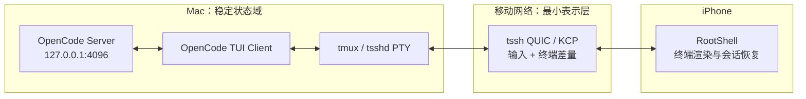

这不是简单减少几个请求，而是把故障域切开：

| 状态 | 直接远程 `opencode serve` | RootShell Roam |
| --- | --- | --- |
| OpenCode session | server 在 Mac，client 连接断开后需重建 | server 与 TUI 都在 Mac，移动链路断开不影响二者 |
| SSE / streaming | 跨公网长连接 | Mac loopback 内完成 |
| iOS 网络切换 | HTTP socket 重连、前端恢复 | tssh transport 恢复 PTY session |
| iOS App 被终止 | Web/client 状态可能丢失 | RootShell 可重新附着 Roam/tmux session |
| 跨公网数据 | API、事件、前端资源、输出 | 主要是按键与终端绘制差量 |
| 高 RTT 输入感 | 每次交互等待远端 | 可利用本地预测回显降低体感延迟 |

因此，在“用 iPhone 操作远端 coding agent”这一具体目标下，RootShell Roam 通常比继续优化 4096 端口转发更接近问题本质。

### 9.2 方案 A：RootShell Roam/tssh 直连 Mac（首选）

RootShell 的 Roam 层支持 mosh-compatible session，以及 tssh 的 QUIC/KCP transport；项目声明支持 STUN firewall traversal、Wi-Fi/蜂窝切换、断线恢复、App 终止后的 session resumption、终端本地预测回显和链路性能统计。

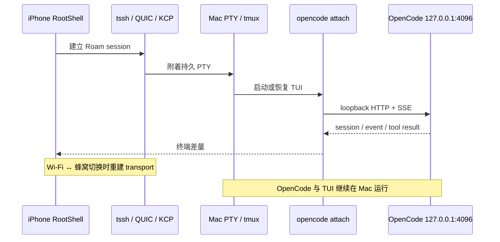

#### 运行形态 A1：不需要独立 server

```sh
# RootShell 连接 Mac 后
tmux new-session -A -s opencode
cd /path/to/project
opencode
```

这是最短链路：OpenCode 自己启动 TUI 与本地 server，tmux 兜底保存终端。即使 RootShell Roam 已支持自身 session resumption，tmux 仍提供第二层恢复和多客户端附着能力。

#### 运行形态 A2：保留常驻 `opencode serve`

```sh
# Mac 上的 supervisor 启动服务；密码不要写进 shell history
OPENCODE_SERVER_USERNAME='opencode' \
OPENCODE_SERVER_PASSWORD='<强随机密码>' \
opencode serve --hostname 127.0.0.1 --port 4096

# RootShell 远端 PTY 中连接 loopback backend
OPENCODE_SERVER_USERNAME='opencode' \
OPENCODE_SERVER_PASSWORD='<同一密码>' \
opencode attach http://127.0.0.1:4096
```

适合桌面、IDE plugin、自动化和 RootShell 共用同一 backend。关键点是 `attach` 运行在 Mac，不是 iPhone；4096 从未跨越公网。

#### QUIC 与 KCP 如何选

| 传输 | 优点 | 代价 | 推荐场景 |
| --- | --- | --- | --- |
| QUIC | TLS 1.3、现代拥塞控制、较好的公平性与通用网络适配 | 某些网络会限速/阻断 UDP；首次握手与证书配置需正确 | 默认首选 |
| KCP | 丢包链路恢复积极、交互响应可调 | 过度重传可能浪费流量；拥塞友好性依赖参数 | 高丢包蜂窝链路的对照方案 |
| 普通 SSH/TCP | 部署最普遍、诊断简单 | IP 切换会断；丢包导致 TCP 队头阻塞 | fallback |
| mosh | 漫游成熟、本地回显优秀 | framebuffer/scrollback 语义与普通终端有差异 | 兼容已有 mosh-server |

对 OpenCode TUI，优先试 tssh QUIC；若蜂窝丢包下 QUIC 恢复不理想，再用 KCP 做 A/B，而不是仅凭协议名判断。

#### 9.2.1 先辨清三个组件：RootShell、tssh 与 tsshd

这里的 `tssh` 指的是 `trzsz-ssh` 体系的 SSH-compatible client，不是泛指“某种 SSH”，也不是 Tailscale SSH：

| 组件 | 运行位置 | 职责 | 生命周期 |
| --- | --- | --- | --- |
| RootShell | iPhone/iPad | 原生终端 UI、SSH bootstrap、QUIC/KCP client、会话恢复、性能观测 | App 与系统管理 |
| `tssh` 逻辑 | RootShell 内 | 先按 SSH 方式认证，再协商 UDP transport | 每次连接/恢复 |
| `sshd` | Mac | 初始身份认证、启动远端命令、向客户端安全交付 tsshd 参数 | 系统常驻 |
| `tsshd` | Mac | 每个 Roam session 的 PTY、QUIC/KCP server、重连与端口转发 | 每 session 一个进程 |
| tmux（可选） | Mac | tsshd 之外的第二层 session persistence 与多客户端附着 | 独立常驻 |

RootShell 当前不是原封不动使用上游：其 Go module 将上游 `tsshd` 和 KCP implementation 替换为 RootShell fork。RootShell 发布说明也指出，某些最新重连改进需要与 App 匹配的服务端源码版本，不能假设旧发布版 `tsshd` 已包含全部行为。

> [!important] 版本配对原则
> - 初次试用可用上游 `tsshd` 验证基本 QUIC/KCP；
> - 若要求 App 终止恢复、重负载重连、RootShell 专属 session restoration，应优先按 RootShell 当前 release note 使用匹配 fork；
> - 升级 RootShell 后若漫游异常，先检查 client/server 版本组合，再调网络参数；
> - RootShell fork 的 `go.mod` 当前要求 Go `1.25.0`，源码构建环境必须满足这一版本线。

#### 9.2.2 tssh 连接不是一步：SSH bootstrap → UDP transport

完整时序如下：

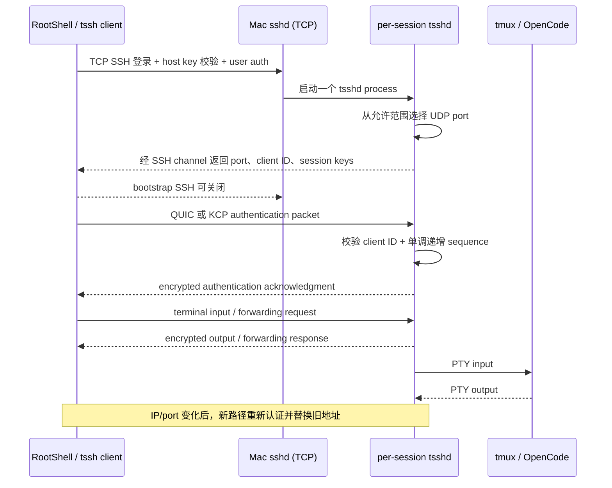

上游默认行为是 `tsshd` 从 `61001–61999/UDP` 随机选择空闲端口，也可通过 `TsshdPort` 缩小到单个端口、离散端口或多个范围。这个设计有三个含义：

1. TCP SSH 只是 bootstrap 与身份根；稳定交互走后续 QUIC/KCP；
2. “SSH 能登录”不等于“UDP 已直连”，必须单独验证 tsshd port；
3. 如果家中路由器只放行一个 UDP 端口，而 tsshd 在千端口范围随机选择，直连会失败或表现不稳定。

#### 9.2.3 直连成立的网络条件

tssh 不提供类似公共 DERP 的通用 relay-of-last-resort。要获得真正的低延迟直连，iPhone 必须能向当前 tsshd UDP endpoint 发送并收到回包。推荐按确定性从高到低设计：

| 服务端条件 | 直连确定性 | 做法 |
| --- | ---: | --- |
| 公网 IPv4 + 静态端口映射 | 最高 | 把固定 UDP 小范围映射到 Mac，DDNS 处理地址变化 |
| 双端公网 IPv6 | 高 | 放行 tsshd UDP 范围；不做 NAT，但仍需防火墙规则 |
| Full Cone/Easy NAT + STUN | 中高 | 由 RootShell Roam 的 STUN traversal 建立映射 |
| Hard NAT/CGNAT | 低 | 打洞可能失败；需公网入口、VPN/relay bootstrap 或退回 TCP |
| UDP 被封锁 | 无 UDP 直连 | 使用普通 SSH/TCP 或 `UdpProxyMode TCP`，接受性能降级 |

最稳的家庭方案不是把默认的 1000 个端口全部暴露，而是：

```text
固定一个小范围，例如 61001–61010/UDP
路由器做相同 external → internal port mapping
Mac firewall 仅放行该范围
RootShell/tssh 的 TsshdPort 使用同一范围
```

端口数量决定可同时存在多少个随机选端口的 session。只允许一个端口最简单，但并发多 session 或旧进程尚未释放端口时可能启动失败；个人使用可从 4–10 个端口的小范围开始，再按观测扩大。

> [!warning] 不要把“STUN”理解成中继
> STUN 帮双方发现公网映射并尝试打洞，不转发业务流量，也无法修复双方 hard NAT、运营商封 UDP 或入站防火墙。若当前 Tailscale 始终 DERP，tssh STUN 值得实测，但不能预设一定成功。

#### 9.2.4 推荐部署：Mac 端 tsshd 与 OpenCode

最小依赖是 Mac 已有可用 SSH 登录和一个 `tsshd` executable。上游通用安装可使用：

```sh
# 上游发行版：用于先验证基本能力
brew install tsshd

# 确认可执行文件可被远程非交互 shell 找到
command -v tsshd
tsshd --version
```

如果 RootShell 当前发布说明要求 fork 中尚未进入上游 release 的修复，再切换到源码构建；不要一开始同时改变 client、server、NAT 和 OpenCode 四个变量。源码构建前确认 Go 版本满足 fork 当前 `go.mod`：

```sh
go version
git clone https://github.com/kitknox/tsshd-rootshell.git
cd tsshd-rootshell
go build -trimpath -o "$HOME/.local/bin/tsshd" ./cmd/tsshd
"$HOME/.local/bin/tsshd" --version
```

随后确保远程 login shell 的 `PATH` 包含 `~/.local/bin`，或者在 RootShell profile 中显式配置 `TsshdPath`。不要用 root 运行 tsshd；它应继承已通过 SSH 认证的普通用户身份。

OpenCode 推荐继续留在 loopback：

```sh
# 模式 1：最简单，PTY 内直接运行
tmux new-session -A -s opencode
cd /path/to/project
opencode

# 模式 2：连接已有 backend
tmux new-session -A -s opencode-client
OPENCODE_SERVER_PASSWORD='<密码>' \
  opencode attach http://127.0.0.1:4096
```

模式 1 适合单人日常使用；模式 2 适合桌面、IDE 和移动端共用一个 OpenCode backend。

#### 9.2.5 RootShell profile 的配置映射

RootShell 以原生 UI 管理连接；上游 tssh 的语义可用下面的 OpenSSH-compatible 配置理解。RootShell UI 字段名称或默认值可能随版本变化，以 App 当前 profile 页面为准：

```sshconfig
Host opencode-roam
    HostName mac.example.com
    User gavin
    IdentityFile ~/.ssh/id_ed25519

    #!! UdpMode QUIC
    #!! TsshdPath ~/.local/bin/tsshd
    #!! TsshdPort 61001-61010
    #!! UdpHeartbeatTimeout 3
    #!! UdpReconnectTimeout 15
    #!! UdpAliveTimeout 10d
    #!! UdpProxyMode UDP
    #!! UdpMTU 1400
    #!! UdpSessionAttach yes
    #!! UdpSessionName opencode-main
```

配置职责：

| 参数 | 解决的问题 | 调整原则 |
| --- | --- | --- |
| `UdpMode` | 选择 QUIC/KCP/TCP | 默认 QUIC，蜂窝高丢包再 A/B KCP |
| `TsshdPath` | 找到匹配服务端 binary | 非交互 SSH 的 PATH 不可靠时显式填写 |
| `TsshdPort` | 控制 UDP 暴露和并发范围 | 与路由器映射、防火墙完全一致 |
| `UdpHeartbeatTimeout` | 多久判定旧路径失联并找新路径 | 太小会误判抖动，太大会延迟漫游 |
| `UdpReconnectTimeout` | 多久后向用户显示失联 | 影响提示，不等于 session 已销毁 |
| `UdpAliveTimeout` | 断线多久仍保留恢复资格 | 越长越占服务端 session/PTY 资源 |
| `UdpProxyMode` | UDP 被封时是否经 TCP workaround | TCP 是可用性 fallback，不是性能模式 |
| `UdpMTU` | 单个 UDP packet 的上限 | 默认 1400；大输出卡死/黑洞时逐步降到 1360/1280 |
| `UdpSessionAttach` | 是否允许后续重新附着 | OpenCode 长任务建议启用 |
| `UdpSessionName` | 稳定 session identity | 每项目使用固定且不含秘密的名称 |

不同版本文档对 `UdpAliveTimeout` 默认值已有变化，不能把某个历史默认值当稳定协议承诺；在 RootShell 性能页或服务端日志中确认最终生效值。

#### 9.2.6 漫游为何不会杀死 OpenCode

tsshd 在 QUIC/KCP transport 与真实网络 socket 之间放置 client/server proxy。网络切换时变化的是外层 source IP/port；内层 transport 看到的 `net.PacketConn` 抽象保持连续：

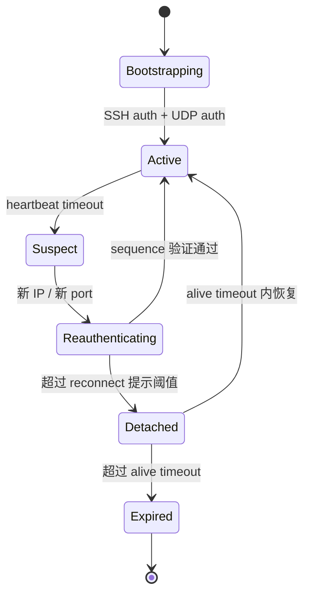

服务端只接受一个已认证 client address。客户端从 Wi-Fi 切到蜂窝后，以 session-specific AES-256-GCM key 发送新的认证包；服务端验证 client ID 与严格递增 sequence，接受新地址并忽略旧地址。QUIC 使用 TLS 1.3；KCP 使用带 forward secrecy 的定期 rekey。

从 OpenCode 视角，PTY/tmux 没有退出，`opencode attach` 到 loopback 的 SSE 也没有断开。即使外层最终无法恢复，tmux 仍能在下一次全新 SSH/tssh 登录后重新附着。

#### 9.2.7 QUIC、KCP 与 MTU 的性能调优顺序

不要同时改所有参数。使用固定任务和固定网络按以下顺序：

1. **QUIC + 默认 MTU 1400**：记录 RTT median/P95、packet loss、首次连接、恢复时间；
2. **QUIC + MTU 1360/1280**：仅当大段输出卡住、短输入正常或疑似 PMTU black hole；
3. **KCP + 相同 MTU**：对比高丢包蜂窝下的输入延迟、重传和流量；
4. **调整 heartbeat**：只有路径切换检测过慢或频繁误重连时；
5. **TCP fallback**：UDP 确认不可用后采用，不拿它与直连 QUIC 混为一类。

OpenCode TUI 不是大文件传输，首要指标依次是：

```text
恢复成功率 > P95 输入 RTT > 抖动 > 首连时间 > 峰值吞吐
```

KCP 可能用更多重传换取低延迟；QUIC 通常具有更成熟的拥塞控制。不能仅因 KCP 标注“lower latency”就长期固定它，蜂窝套餐流量、发热和其他流量公平性都应进入选择。

#### 9.2.8 安全边界与最小暴露

tssh 的安全不是“UDP 端口公开但无认证”：

- 初始 SSH 负责 host key 与 user authentication；
- session secret 只经已认证 SSH channel 交付；
- 新网络路径必须用 session key 重新认证；
- 单调 sequence 防 replay；
- server 接受新 client address 后忽略旧地址；
- QUIC 是 TLS 1.3，KCP 有加密与 rekey。

部署仍应遵守：

- SSH 禁止密码登录，使用 Secure Enclave/Ed25519 key；
- 固定并缩小 tsshd UDP 范围，不开放默认整段除非确有并发需求；
- Mac firewall 与路由器只放行实际范围；
- OpenCode 继续监听 `127.0.0.1` 并启用自身 Basic Auth；
- `UdpSessionName`、profile、日志中不写密码或 ConnBlob；
- 定期清理失效 tsshd/tmux session，避免超长 alive timeout 变成资源泄漏；
- 公网 SSH 必须叠加 key-only、速率限制和系统更新；若不愿暴露 SSH bootstrap，保留 Tailscale 只承担 bootstrap/fallback，并实测 RootShell fork 能否把后续 UDP 升级为公网直连。

#### 9.2.9 tssh 直连故障定位

| 症状 | 所在阶段 | 优先检查 |
| --- | --- | --- |
| SSH 都无法登录 | bootstrap | hostname、TCP 22、host key、user key、Tailscale fallback |
| SSH 成功后立刻退回/失败 | 启动 tsshd | `TsshdPath`、Go binary 架构、执行权限、非交互 PATH |
| 能启动但 UDP timeout | path establishment | `TsshdPort` 与路由映射、防火墙、CGNAT、IPv6、蜂窝 UDP |
| QUIC 不通、KCP 也不通 | UDP 基础层 | 不要继续调拥塞参数；先证明 UDP 双向可达 |
| 短输入正常，大输出卡住 | packetization | 降低 `UdpMTU`，检查 PMTU black hole |
| Wi-Fi→蜂窝恢复慢 | reconnect state | heartbeat/reconnect timeout、RootShell/tsshd 版本配对 |
| 恢复后旧 session 被踢 | address replacement | 预期单活语义；检查是否有第二设备同时附着 |
| App 返回后 session 消失 | persistence | `UdpSessionAttach/Name`、alive timeout、匹配 fork、tmux 兜底 |
| 交互可用但仍不比 DERP 快 | path/measurement | 确认是否真实公网 UDP direct，而不是 Tailscale/代理承载 |

#### 9.2.10 面向 OpenCode 的验收命令与门槛

先在 Mac 本地证明应用层健康：

```sh
curl -u 'opencode:<密码>' \
  http://127.0.0.1:4096/global/health

tmux has-session -t opencode
pgrep -fl 'opencode|tsshd'
```

再在 RootShell 验证：

1. 冷连接进入 `opencode-main` session；
2. 连续生成 5 分钟输出，观察 QUIC/KCP RTT、loss、retransmit；
3. Wi-Fi 切蜂窝，再切回 Wi-Fi；
4. 锁屏 1、5、15 分钟；
5. 强制退出 RootShell 后重开并 attach；
6. 暂时阻断 UDP，确认错误清楚且 TCP/Tailscale fallback 可用；
7. 恢复 UDP，确认新连接重新采用 direct path。

建议把“可用于生产”定义为：

- 20 次 Wi-Fi/蜂窝切换至少 19 次在 3 秒内恢复；
- OpenCode/tmux session 0 次丢失；
- direct UDP 的 RTT P95 比当前 DERP 至少降低 30%；
- 连续 30 分钟 agent 输出无终端冻结；
- 锁屏 15 分钟恢复无需重启 OpenCode；
- fallback 发生时用户能看到当前 transport，而不是静默误判为直连。

#### 9.2.11 本机实施 Runbook：现有 OpenCode serve + tsshd + RootShell

本节不是通用模板，而是基于 2026-08-31 对当前 Mac 的只读检查结果编写。目标是在**不改变现有 OpenCode 监听与鉴权边界**的前提下，增加 RootShell Roam/tssh 移动入口。

##### 当前已存在的服务基线

| 项目 | 本机事实 | 实施含义 |
| --- | --- | --- |
| OpenCode CLI | `1.18.25` | 当前新启动的 client 使用此版本 |
| 运行中 server binary | Homebrew `1.18.21`（2026-08-31 观察） | 服务跨升级未重启，应先与 CLI 对齐 |
| 监听 | `127.0.0.1:4096`（观察时 PID `49359`） | PID 会变化；监听边界不应改为 `0.0.0.0` |
| 启动参数 | `opencode serve --hostname 127.0.0.1 --port 4096 --print-logs --log-level INFO` | 保持现状 |
| launchd label | `com.czn.opencode-serve` | 已具备开机/登录启动和失败重启 |
| wrapper | `/Users/czn/.local/bin/opencode-serve` | 继续作为唯一启动入口 |
| 凭据文件 | `/Users/czn/.config/opencode/serve.env` | RootShell 不复制此文件；密码仍只在 Mac 使用 |
| 健康探测 | 无凭据访问 `/global/health` 返回 `401` | socket 可达且 Basic Auth 已生效 |
| 工作目录 | `/Users/czn` | `attach --dir` 或进入具体项目后再工作 |
| 日志 | `/Users/czn/.local/state/opencode-serve/stdout.log`、`stderr.log` | 用于区分应用故障与 tssh 故障 |
| SSH | macOS Remote Login/`com.openssh.sshd` 已启用 | 可直接作为 tssh bootstrap |
| tsshd | 尚未安装 | 唯一缺失的服务端组件 |
| 架构/工具链 | Intel `x86_64`，Go `1.26.4` | 可构建要求 Go 1.25 的 RootShell fork |

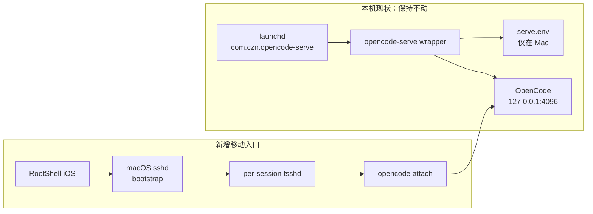

##### Phase 0：先冻结安全边界，不修改 OpenCode

本方案不需要改动现有 launchd plist、wrapper 或 `serve.env`。先记录以下不变量：

```text
OpenCode 永远只监听 127.0.0.1:4096
Basic Auth 保持启用
RootShell 不保存 serve.env 文件
tsshd 只以当前普通用户按 session 运行
公网仅考虑 SSH bootstrap 与受控 UDP 端口，不直接公开 4096
```

本机复核命令：

```sh
opencode --version
lsof -nP -iTCP:4096 -sTCP:LISTEN
launchctl list | grep com.czn.opencode-serve
curl -i http://127.0.0.1:4096/global/health
```

最后一条预期返回 `401 Unauthorized`；这不是失败，而是鉴权闸门正确工作。若要验证应用健康而不把密码写进 shell history，可在已经加载安全环境变量的受控 shell 中执行：

```sh
curl -u "${OPENCODE_SERVER_USERNAME}:<从密码管理器临时粘贴>" \
  http://127.0.0.1:4096/global/health
```

当前进程仍加载 Homebrew `1.18.21` binary，而命令行已经升级到 `1.18.25`。在开始 RootShell 验收前，选择空闲窗口让 launchd 受控重启：

```sh
launchctl kickstart -k gui/501/com.czn.opencode-serve
sleep 1
opencode --version
lsof -nP -iTCP:4096 -sTCP:LISTEN
curl -i http://127.0.0.1:4096/global/health
```

预期监听重新出现且未认证健康请求仍返回 `401`。重启会中断当时的 client/SSE 连接，必须先保存正在进行的交互；OpenCode 数据库与 session 不应通过删除文件来“修复”版本漂移。

##### Phase 1：安装与 RootShell 匹配的 tsshd

为了缩小变量，建议先用上游包验证基础链路，再根据 RootShell 当前 release note 决定是否切换 fork。

**路径 A：上游快速验证**

```sh
brew install tsshd
command -v tsshd
tsshd --version
```

**路径 B：RootShell fork，作为最终候选**

```sh
mkdir -p /Users/czn/.local/bin
git clone https://github.com/kitknox/tsshd-rootshell.git
cd tsshd-rootshell
go build -trimpath -o /Users/czn/.local/bin/tsshd ./cmd/tsshd
/Users/czn/.local/bin/tsshd --version
```

不要同时保留两个含糊的 `tsshd` 来源。最终 RootShell profile 显式填写：

```text
TsshdPath = /Users/czn/.local/bin/tsshd
```

这样不会受 macOS 非交互 SSH shell 的 PATH 差异影响。`tsshd` 不需要 `launchctl bootstrap`：每次 RootShell tssh 登录由现有 `sshd` 启动一个 session process。

##### Phase 2：建立“先可用”的 RootShell profile

先使用当前已经能访问 Mac 的地址建立 bootstrap，暂不追求一步到位的公网直连：

```text
Profile Name: OpenCode Mac - Roam
Protocol: Roam / tssh
Host: <Mac 当前可达的 Tailscale 名称或地址>
User: czn
Authentication: RootShell Secure Enclave key / 已授权 SSH key
Transport: QUIC
Tsshd Path: /Users/czn/.local/bin/tsshd
Tsshd Port: 61001-61010
Session Attach: On
Session Name: opencode-main
Auto Start: Custom Command
```

建议先在 Mac 新建一个只在本地读取现有凭据的 attach wrapper：

```sh
#!/bin/zsh
# /Users/czn/.local/bin/opencode-attach-mobile
set -eu

readonly env_file="/Users/czn/.config/opencode/serve.env"
[[ -r "$env_file" ]] || exit 78

set -a
source "$env_file"
set +a

exec /usr/local/bin/opencode attach \
  --dir /Users/czn/agent-workingspace \
  http://127.0.0.1:4096
```

保存后设置仅本人可执行：

```sh
chmod 700 /Users/czn/.local/bin/opencode-attach-mobile
```

RootShell custom command 只引用 wrapper，不出现凭据：

```sh
tmux new-session -A -s opencode-mobile \
  /Users/czn/.local/bin/opencode-attach-mobile
```

现有 `/Users/czn/.config/opencode/serve.env` 是 server 启动凭据真源。若复用它，wrapper 必须只在 Mac 本地 `source`，不得把内容打印或同步到 iCloud/RootShell profile。

> [!warning] `opencode attach` 参数核验
> 当前 CLI 支持 `--dir` 与 Basic Auth 参数/环境变量；RootShell custom command 上线前应先在 Mac 本地完整执行一次。若当前版本要求 URL 位于 flag 之前或之后，以 `opencode attach --help` 的实际输出为准，不要让 profile 隐藏参数错误。

##### Phase 3：本地验证 tsshd，而不是先改路由器

在同一局域网先完成闭环：

1. iPhone 和 Mac 连接同一 Wi-Fi；
2. RootShell 用 Roam/tssh profile 登录；
3. 确认 Mac 出现 per-session `tsshd`；
4. RootShell 打开连接性能页，确认 transport 是 QUIC 或 KCP；
5. TUI 自动进入 `opencode attach http://127.0.0.1:4096`；
6. 创建一个测试 session，执行只读 prompt；
7. 断开 RootShell，再重新附着 `opencode-main`，确认 OpenCode session 仍在。

Mac 侧观察命令：

```sh
pgrep -fl tsshd
lsof -nP -iUDP:61001-61010
tail -f /Users/czn/.local/state/opencode-serve/stderr.log
```

局域网都不能稳定工作时，不进入公网阶段；优先修 `TsshdPath`、SSH key、端口范围或 client/server 版本配对。

##### Phase 4：从“经 Tailscale 可用”升级为“公网 UDP 直连”

当前 Surge 内置 Tailscale 只走公共 DERP。若 RootShell profile 的 Host 仍是 tailnet 地址，tssh 上层体验会改善，但路径未必摆脱 DERP。性能升级有两条互斥路线：

**路线 4A：保守上线**

```text
SSH bootstrap：Tailscale/DERP
tssh transport：按 RootShell 实际协商路径
失败回退：普通 SSH over Tailscale
```

优点是无需公开家中 SSH；缺点是不能预设后续 UDP 一定绕开 tailnet。必须从 RootShell performance view 与公网切换测试确认。

**路线 4B：确定性直连**

```text
Host：家庭公网 IPv4/DDNS 或公网 IPv6
TCP：SSH bootstrap 端口，仅 key-only
UDP：61001-61010 映射到 Mac 同端口
Mac firewall：只允许 SSH 与 61001-61010/UDP
4096：仍只在 loopback，不做路由器映射
```

路由器侧使用相同 external/internal UDP range，避免 NAT 改写端口破坏可预测性。若没有公网 IPv4、处于 CGNAT且无双端公网 IPv6，路线 4B 不成立；不要靠不断调 MTU 或 heartbeat 伪装成网络优化。

公网 SSH 的最低安全要求：

```text
PasswordAuthentication no
PermitRootLogin no
仅授权 RootShell Secure Enclave/SSH public key
启用 macOS 防火墙与登录审计
必要时把外部 SSH 端口映射到非 22，但内部仍由 sshd 管理
```

##### Phase 5：OpenCode 日常操作流

正常使用时，用户只做：

```text
1. 打开 RootShell
2. 点击 OpenCode Mac - Roam
3. RootShell 经 SSH bootstrap 启动/恢复 tsshd
4. 自动附着 opencode-main / tmux session
5. Mac 本地 TUI 连接 127.0.0.1:4096
6. iPhone 只收发终端输入与输出差量
```

OpenCode server 的生命周期仍完全由现有 launchd 管理。若 RootShell 连接正常但 attach 失败，按层诊断：

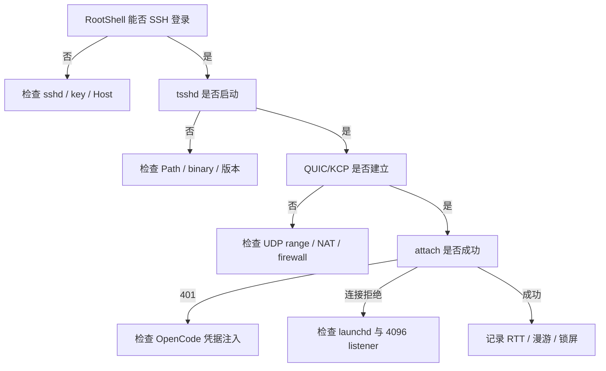

##### Phase 6：针对当前机器的验收清单

- [ ] `com.czn.opencode-serve` 保持 loaded，未修改监听地址；
- [ ] `curl` 无凭据仍返回 `401`，有凭据返回健康 JSON；
- [ ] RootShell 使用 key-only SSH 登录用户 `czn`；
- [ ] `TsshdPath` 指向唯一、版本已记录的 binary；
- [ ] 每次连接只产生预期数量的 tsshd process；
- [ ] UDP 实际端口落在 `61001–61010`；
- [ ] RootShell 显示 QUIC/KCP，而不是误把 TCP/Tailscale DERP 当直连；
- [ ] `opencode attach` 发生在 Mac，目标固定为 `127.0.0.1:4096`；
- [ ] Wi-Fi→蜂窝 20 次切换至少 19 次在 3 秒内恢复；
- [ ] 锁屏 15 分钟后 OpenCode/tmux session 未丢失；
- [ ] UDP 阻断时能明确回退普通 SSH/Tailscale；
- [ ] 4096 未出现在公网或 LAN listener 中；
- [ ] RootShell profile、日志和 Obsidian 中均无密码。

##### 回滚路径

这套新增链路与现有 OpenCode server 解耦，回滚不需要停止 OpenCode：

1. 删除或禁用 RootShell Roam profile；
2. 结束遗留的普通用户 tsshd session；
3. 删除路由器 `61001–61010/UDP` 映射和对应防火墙规则；
4. 如不再使用，卸载 tsshd binary；
5. 继续使用原有 Surge Tailscale → OpenCode 方案。

不要删除 `com.czn.opencode-serve`、wrapper 或 `serve.env`；它们属于当前已经工作的应用层基线，不是 tssh 实验产物。

### 9.3 方案 B：RootShell 后台 Local Forward 4096

当目标必须是 Safari Web UI、iOS 原生 OpenCode client 或其他只能输入 HTTP URL 的应用时，可以利用 RootShell 的原生 SSH port forwarding 与 Background SSH Tunnels：

```text
RootShell 等价转发：
127.0.0.1:4096  →  SSH/TSSH channel  →  Mac 127.0.0.1:4096
```

传统 SSH 等价命令为：

```sh
ssh -N \
  -L 127.0.0.1:4096:127.0.0.1:4096 \
  user@mac.example
```

然后在 iPhone 打开：

```text
http://127.0.0.1:4096
```

RootShell 已声明支持 local (`-L`)、remote (`-R`)、dynamic SOCKS5 (`-D`) forwarding，以及不依赖终端 tab 的后台 tunnel、自动启动与字节统计。这个方案比自己开发 Tailcat iOS listener 成熟得多，也不需要让 OpenCode 改绑 `0.0.0.0`。

> [!warning] 必须真机验证的两个边界
> 1. 后台 tunnel 通过 **tssh profile** 时，local forwarding 是否与普通 SSH feature parity；
> 2. RootShell 创建的 iOS loopback listener 是否能在长期后台状态下持续被 Safari/其他 App 访问。
>
> 项目总览同时声明了 tssh、port forwarding 与 background tunnel，但不能仅据功能列表推断所有组合在当前 App Store 版本均完全等价。生产采用前要执行 §9.9 的矩阵。

#### 避免 TCP-over-TCP

如果 local forward 的承载层是普通 TCP SSH，而内层是 OpenCode HTTP/TCP：

```text
HTTP TCP → SSH TCP → Internet
```

外层和内层各自重传，丢包时可能出现放大的队头阻塞。若 RootShell 支持在 tssh QUIC/KCP profile 上承载 port-forward channel，应优先使用：

```text
HTTP TCP → tssh QUIC/KCP → Internet
```

这不会让 HTTP 变成 QUIC，但能避免“两个相互不知道的 TCP 拥塞与重传状态机”叠加。

### 9.4 方案 C：RootShell TSSH VPN

RootShell 允许 SSH/TSSH profile 作为系统级 VPN，把 iPhone 应用流量送到远端节点。对于 OpenCode，可以让 Safari 或原生客户端经 VPN 访问 Mac 的私有地址。

但 iOS 同一时间通常只有一个主 Packet Tunnel provider：RootShell 的 `VPNTunnelExtension` 与 Surge iOS 的 VIF/Packet Tunnel 会竞争系统 VPN 接管位置。因此它不是“给 Surge 增加一层”，而是**在启用期间替换 Surge 的接管层**。

| 条件 | 建议 |
| --- | --- |
| Surge 还负责广告过滤、DNS、分流和其他代理 | 不采用 RootShell VPN；选方案 A/B |
| 临时需要整个 iPhone 进入家庭网络 | 可手动切换到 RootShell VPN |
| 只访问一个 OpenCode 端口 | VPN 过重，优先 Local Forward |
| 多个 App、多个内网服务都需透明访问 | VPN 才有足够收益 |

### 9.5 RootShell + 现有 Tailscale：方便，但不会自动消除 DERP

RootShell 支持 Tailscale device discovery 和 tailnet SSH。如果 RootShell 仍通过 Surge 内置 Tailscale 的 `100.x` 地址连接 Mac，路径仍由 Tailscale 决定：

```text
RootShell SSH/tssh
    → Surge Tailscale policy
    → DERP（当前基线）
    → Mac
```

上层换成 RootShell 可以改善会话恢复和交互体感，但 RTT 与吞吐的物理下限仍受 DERP 限制。要得到真正性能提升，需要至少满足一项：

- 家庭侧 Tailscale UDP `41641` 可从公网到达；
- 路由器 NAT-PMP/UPnP 能生成稳定映射；
- 双端存在可用公网 IPv6；
- tssh 自己通过 STUN/静态 UDP endpoint 建立直连；
- 部署位置更近的 peer relay/专用中继作为无法直连时的次优路径。

RootShell 和 Tailscale 的合理组合是：**RootShell Roam 为主交互，Tailscale 做地址发现与 fallback；不要误把“换了终端协议”当成“网络已直连”。**

### 9.6 Tailcat WASM in RootShell：技术上出现了新窗口

RootShell 的 WASM runtime 为 WASI Preview 1 提供了一套宿主 socket ABI。它由 Apple Network.framework 实现，暴露：

- TCP：`socket`、`bind`、`listen`、`accept`、`connect`、`send`、`recv`、`shutdown`；
- UDP：`sendto`、`recvfrom`；
- hostname、DNS、TLS-on-TCP；
- Go、Rust、Swift 的参考 binding；
- Go goroutine/TinyGo scheduler 可用于并发，尽管 ABI 本身是同步阻塞式。

于是可以设想：

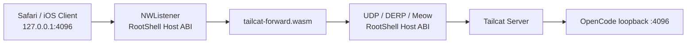

但它不是把 Tailcat 执行一次 `GOOS=wasip1 GOARCH=wasm go build` 就能得到：

1. Go WASI 标准 `net`/`syscall` 不认识 RootShell 私有的 `rootshell_socket_*` imports；
2. 需要为 Tailcat/Tailscale magicsock 接入自定义 packet transport，或给 Go networking 层做专用 shim；
3. 必须核验 wgengine、gVisor Netstack、`reflect+unsafe` 和平台 build tags 在 WASI 下的兼容性；
4. ABI 没有 `poll`/`epoll`/`kqueue` 与通用 `setsockopt`，magicsock 的并发、deadline、端口复用与路径监测可能需要重构；
5. 普通 RootShell WASM process 的后台寿命不等同于 PacketTunnelProvider；锁屏、内存压力和 App 终止会打断 listener；
6. 即使成功，Tailcat 仍使用与 Tailscale 同类的 UDP 穿透逻辑；当前 NAT 若强制 Tailscale DERP，Tailcat 也不能保证直连；
7. Tailcat 官方 WebRTC/WASM 直连跟踪项仍未完成，且公开 relay 没有 SLA/吞吐承诺。

更现实的原型顺序是：

```text
Phase 1：WASM TCP local forward demo
Phase 2：WASM UDP echo + 网络切换测试
Phase 3：最小 ConnBlob/Meow/DERP client
Phase 4：接入 magicsock/WireGuard
Phase 5：后台与 SSE 长连接验证
```

只有 Phase 3 以前的结果稳定，才值得继续承担 Tailscale 内部包对 WASI 的移植成本。

### 9.7 性能模型：哪条路径真正比当前 DERP 更快

当前基线是：

```text
iPhone Surge 内置 Tailscale → 公共 DERP → Mac → OpenCode
```

候选方案按“是否改变物理路径”拆分：

| 方案 | 能否绕开当前 DERP | 传输量 | 移动漫游 | 工程成本 | 综合判断 |
| --- | --- | --- | --- | --- | --- |
| RootShell tssh 直连 + Mac 本地 TUI | **能，若 STUN/静态 UDP 成功** | 最低 | 很强 | 低到中 | **移动编码首选** |
| Tailscale 打通 UDP 41641/公网 IPv6 | **能** | 完整 API 或终端 | 很强 | 最低 | **先修当前网络** |
| RootShell tssh 直连 + Local Forward | **能** | 完整 HTTP/SSE | 强 | 低 | Web UI 首选 |
| Surge 原生静态 WireGuard | **能，需要公网 endpoint** | 完整 HTTP/SSE | 中 | 中 | 固定网络极致性能 |
| Surge Ponte Direct/IPv6 | **能，取决于通道选择** | 完整 HTTP/SSE | 强 | 低 | Surge 全家桶备选 |
| RootShell 经 Tailscale DERP | 不能 | 终端差量 | 强 | 低 | 体感改善，物理 RTT 不变 |
| Tailcat WASM + 公共 DERP | 不能保证 | 完整 HTTP/SSE | 未知 | 很高 | 不值得作为主线 |

性能收益有两个来源，必须分开测：

1. **路径收益**：DERP → direct UDP，降低 RTT、抖动与吞吐瓶颈；
2. **表示层收益**：完整 OpenCode API/SSE → 终端差量，降低流量与断线恢复成本。

RootShell 方案 A 同时有机会获得两种收益；仅在 Tailscale DERP 上运行 RootShell，只有第二种收益。

### 9.8 推荐的最终双路径架构

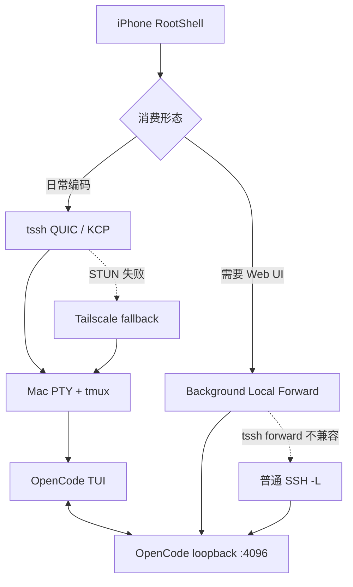

落地优先级：

1. 在 Mac 部署并验证 tsshd/SSH，RootShell 先跑 `tmux + opencode`；
2. 尝试 tssh QUIC 直连并记录通道、RTT、丢包与重连；
3. 需要 Web UI 时再建立后台 `-L 4096`；
4. Tailscale 保留作发现与 fallback，同时修复家庭侧 UDP 直连条件；
5. 不让 RootShell VPN 与 Surge 同时竞争 Packet Tunnel；
6. Tailcat WASM 只进入独立原型，不阻塞主路径。

### 9.9 真机验证矩阵与成功标准

#### 基线与指标

| 指标 | 测量方法 | 目标 |
| --- | --- | --- |
| transport path | RootShell performance / Tailscale path 信息 | 明确 direct、DERP 或其他 relay，禁止只看“连接成功” |
| 稳态 RTT | 连续 60 秒采样，中位数与 P95 | direct P95 显著低于当前 DERP；目标至少降低 30% |
| 首次可交互时间 | 点击连接到可输入 OpenCode | 热恢复 < 2 秒；冷连接记录实际值 |
| Wi-Fi→蜂窝恢复 | 切换网络后到可继续输入 | tssh 目标 < 3 秒；不得丢失 OpenCode session |
| 锁屏恢复 | 锁屏 1/5/15 分钟后返回 | PTY/TUI 可恢复；后台 forward 按时长记录存活率 |
| SSE 稳定性 | Web UI 连续生成长响应 30 分钟 | 无无提示断流；断流后能自动重建 |
| 交互流量 | 完成同一任务的上下行字节数 | RootShell TUI 应明显低于 Web/API 直连 |

#### 必测组合

- [ ] RootShell 普通 SSH + tmux + OpenCode；
- [ ] RootShell tssh QUIC + tmux + OpenCode；
- [ ] RootShell tssh KCP + tmux + OpenCode；
- [ ] tssh profile 上的 background Local Forward + Safari；
- [ ] 普通 SSH profile 上的 background Local Forward + Safari；
- [ ] Surge Tailscale 当前 DERP 基线；
- [ ] 家庭侧开放 UDP/IPv6 后的 Tailscale direct；
- [ ] Wi-Fi、蜂窝、外部 Wi-Fi、锁屏、App 强制退出后的恢复。

> [!note] 证据边界
> RootShell 仓库证明了产品具备 Roam、tssh QUIC/KCP、STUN、session resumption、SSH forwarding、background tunnel、VPN extension、Tailscale integration 与 WASM socket ABI。本文对“tssh 承载后台 local forward”“Safari 跨 App 使用 listener”的组合能力属于工程推演，必须以当前 iOS/App 版本真机结果裁决。

---

## 10. 与 Tailscale 官方方案的取舍

已有 [[OpenCode iOS 远程使用全景指南：Web、原生客户端、终端、桌面与云主机]] 覆盖了 Tailscale 官方的完整远程方案（Web + Tailscale、SSH/Mosh、远程桌面、云主机）。Tailcat 是**互补**而非替代：

| 场景 | 推荐 |
| --- | --- |
| 长期、多设备、要 ACL/审计/MagicDNS | Tailscale 官方 |
| 一次性、脚本化、点对点、不想建账号 | Tailcat |
| 需要 exit node、子网路由、审批流 | Tailscale 官方 |
| 需要一个能嵌入自己 Go 程序的隧道库 | Tailcat |

---

## 11. 局限、失败模式与稳定性边界

- **无 API/CLI/wire 稳定性承诺**：Go API、CLI 输出、wire 格式都可能变；
- **公共 DERP 无 SLA**：`tailcat.dev` 的 relay 限速、无吞吐目标、可随时撤销——生产请自建；
- **无集中吊销/审计**：需靠 allowlist 更新、进程重启和 key rotation 自己完成运维闭环；
- **无中心协调**：NAT 穿透失败就走 DERP 兜底（限速），直连与否取决于双方网络；
- **单 region 限制**：当前 token 最多内嵌 1 个 region（未来可能多 region）。
- **进程即网络栈**：异常退出可能丢掉 userspace TCP 中尚未刷出的数据或 FIN；长期服务应由 supervisor 管理，并让进程有正常退出窗口。
- **固定 region 的可用性权衡**：它稳定了 token，却也把 bootstrap 可用性绑定到该 region；region 下线或 map 变化时需要重新发布 token。
- **依赖内部 API 的升级风险**：`DrainTCP` 当前通过 `reflect+unsafe` 访问 Netstack 内部 `ipstack`，代码已明确标注上游结构变化可能导致失效。
- **转发器缺少生产级运维面**：示例没有连接数限制、空闲超时、指标、健康检查和 graceful shutdown；适合个人可信设备，不应直接当多租户网关。

### 11.1 故障定位顺序

| 症状 | 优先检查 | 原因 |
| --- | --- | --- |
| `Ping` 约 10 秒超时 | client key 是否匹配 `--allow`；双方能否连同一 DERP region | disallowed client 被设计为静默忽略 |
| 能连但一直显示 DERP | `tailcat ping --until-direct`、双重 NAT/UDP/IPv6 | relay 可用不代表 UDP 打洞成功 |
| Tailcat 通但 OpenCode 失败 | A 上 `curl -u opencode:... 127.0.0.1:4096/doc` | 区分隧道故障与应用鉴权/监听故障 |
| TUI 鉴权失败 | B 上是否传相同 password/username | Basic Auth 位于 Tailcat 之上的应用层 |
| 请求结束但连接不退出 | half-close 是否透传、进程是否过早退出 | userspace TCP 的 FIN 生命周期不同于内核 TCP |

### 11.2 上线前最小验收清单

- [ ] A 的 OpenCode 只监听 `127.0.0.1:4096`，并启用强随机 Basic Auth 密码。
- [ ] B 使用持久 `client-default` 私钥；A 的 `--allow` 精确匹配其公钥。
- [ ] 未授权临时 client 的 `tailcat ping` 会超时，授权 client 能成功。
- [ ] `curl`/OpenCode TUI 经 B 的本地转发端口访问成功。
- [ ] 用 `tailcat ping --until-direct` 记录是否直连；无法直连时接受 DERP 的延迟与限速。
- [ ] 重启 A/B 后复测 key、token、region 和 supervisor 行为。

---

## 12. 参考资料

- [Tailcat README（本项目真源）](https://github.com/tailscale/tailcat)
- [Tailcat 源码：tailcat.go / disco.go / wire.go / pickregion.go / cmd/tailcat](https://github.com/tailscale/tailcat)
- [opencode serve 官方文档](https://opencode.ai/docs/server/)
- [opencode CLI 文档](https://opencode.ai/docs/cli/)
- [sst/opencode 源码：server.mdx](https://github.com/sst/opencode)
- [Tailscale DERP server（自建 relay）](https://github.com/tailscale/tailscale/tree/main/cmd/derper#derp)
- [Surge Ponte 官方功能手册](https://manual.nssurge.com/features/ponte.html)
- [Surge Ponte 官方配置指南](https://kb.nssurge.com/surge-knowledge-base/guidelines/ponte)
- [Surge 工作机制与 iOS VIF](https://manual.nssurge.com/getting-started/how-surge-works.html)
- [RootShell 项目与功能总览](https://github.com/kitknox/rootshell)
- [RootShell WASM Runtime 与 socket ABI](https://github.com/kitknox/rootshell/tree/main/wasm)
- [RootShell 发布说明：tssh 重连与性能指标](https://rootshell.com/release-notes.html)
- [tsshd 上游：bootstrap、QUIC/KCP、重连与安全模型](https://github.com/trzsz/tsshd)
- [RootShell 实际依赖的 tsshd fork](https://github.com/kitknox/tsshd-rootshell)
- [RootShell 的 trzsz-ssh fork 与依赖配对](https://github.com/kitknox/trzsz-ssh-rootshell)
- [Tailcat Web/WASM 与 WebRTC 直连跟踪 issue](https://github.com/tailscale/tailcat/issues/4)

> [!note] 研究边界
> Tailcat 设计与实现部分以本项目源码 + 官方 README 为真源（`main` @ `53845983d`）；OpenCode 行为以官方 server/CLI 文档与本机 `opencode 1.18.25` 为基线。本文区分了 `serve` 的默认 4096 与 `run --attach` 所涉及的随机本地辅助端口，并统一建议显式指定监听地址与端口。
