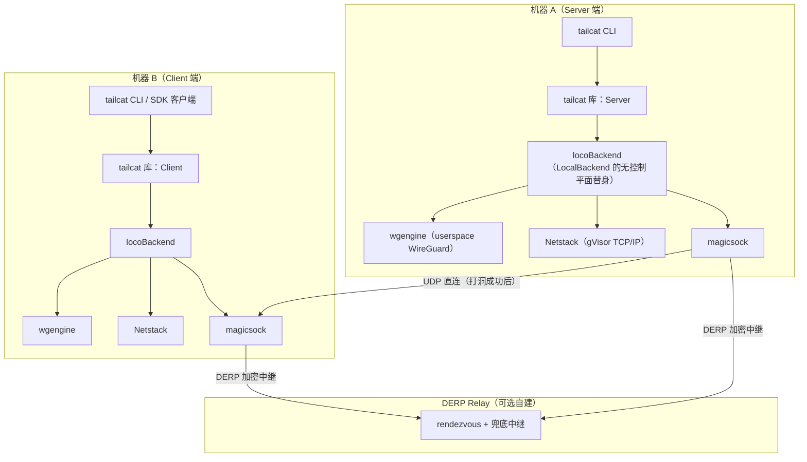
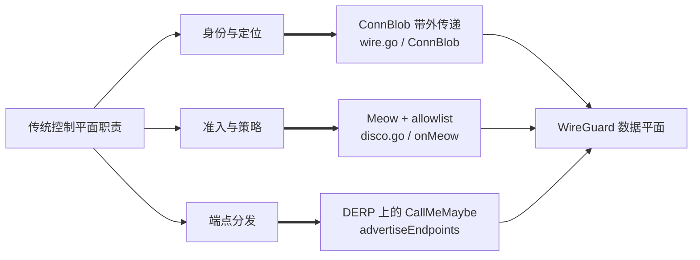
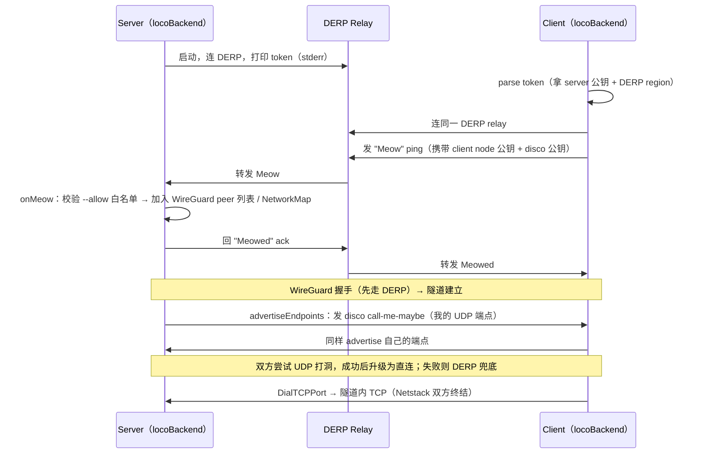
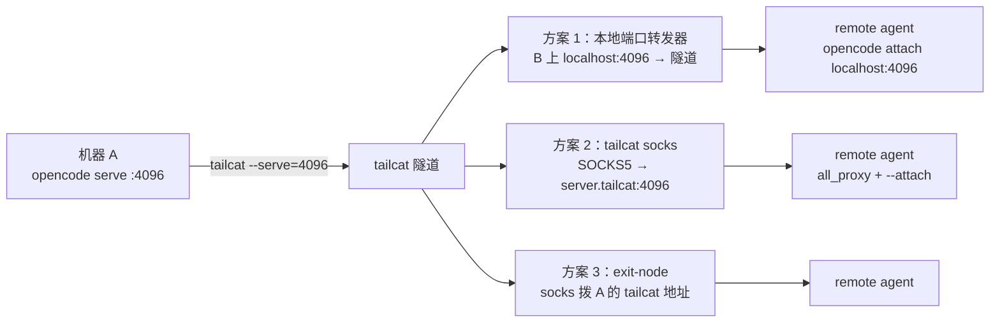
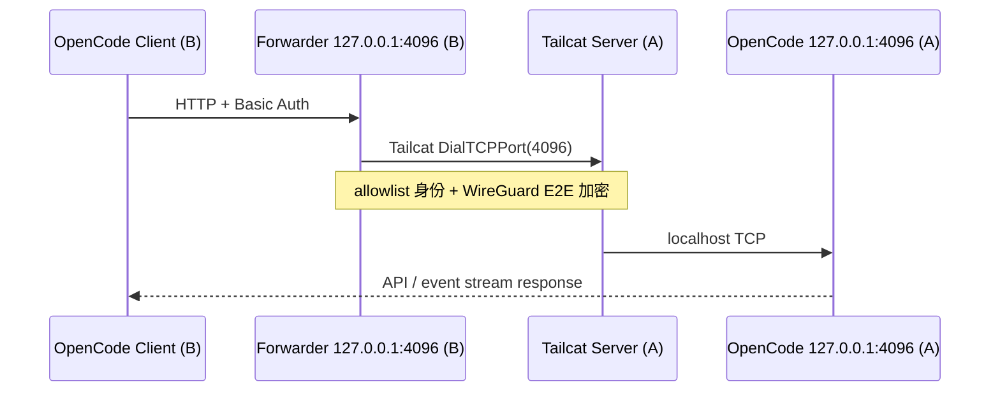

# Tailcat 无控制平面的点对点隧道：设计实现深度解析与 opencode serve 远程代理实践

> [!abstract] 目标
> 用 Tailscale 开源数据平面组件，在**不需要 Tailscale 账号与控制平面**的前提下，把两台机器之间的任意 TCP 服务（典型场景：本机 `opencode serve` 的 HTTP 端口）穿透到远端，供 remote agent 连接。
>
> 本文分两半：前半部分源码级拆解 Tailcat 的设计与实现（ConnBlob、Meow 握手、WireGuard 隧道、NAT 穿透、密钥管理）；后半部分给出"本地搭建远程链接"的最佳实践，并落到 opencode serve 端口代理的完整方案矩阵与落地代码。

> [!success] 本次源码 Review 结论
> Tailcat 的核心不是“删掉控制服务器的 Tailscale”，而是把控制平面原本承担的三项职责拆散：**服务端定位**交给 ConnBlob 带外分发，**客户端准入**交给 Meow + `--allow`，**端点交换**交给经 DERP 发送的 disco `CallMeMaybe`。WireGuard、magicsock 与 Netstack 仍组成数据平面。
>
> 原文的总体判断成立，但有三处必须修正：
>
> 1. ConnBlob 主要是“服务端身份 + bootstrap relay 定位信息”，启用 `--allow` 后，它不再单独构成完整访问能力；
> 2. 当前 OpenCode TUI 的远程连接命令是 `opencode attach URL`，只有非交互命令使用 `opencode run --attach URL ...`；
> 3. 使用固定 `--allow` 时，客户端转发器必须加载与白名单公钥对应的**持久私钥**，不能继续让 `NewClient` 随机生成临时身份。

---

## 1. Tailcat 是什么：定位与动机

Tailcat 是 Tailscale 官方开源（2026-08 TailscaleUp 大会）的一个 remix：**"Tailscale without Tailscale, by Tailscale"**。它把 Tailscale 的**数据平面**（`magicsock` 内部）拿来当 netcat 用，但**砍掉了控制平面**。

| 维度 | Tailscale 官方 | Tailcat |
| --- | --- | --- |
| 控制平面 | 需要（账号、协调服务器、ACL、MagicDNS） | 无 |
| 连接元数据交换 | 控制平面下发 NetworkMap | 带外（out-of-band），你自己想办法传 token |
| 是否需要 root | 通常需要（TUN、路由、DNS） | 否，纯 userspace |
| 是否改路由/DNS | 会 | 否 |
| 形态 | 系统服务 | 一个 Go 库 + 一个 CLI |
| 身份/审计 | ACL、设备审批、Tailnet Lock | 只有 `--allow` 白名单（可选） |

核心权衡一句话：**用"没有账号、没有中心服务器"换"没有集中管理与审计"**。适合一次性、脚本化、点对点、不想引入账号体系的场景。

Tailcat 的数据平面四件套（全部复用 `tailscale.com` 依赖，见 `go.mod` 第 11 行 `tailscale.com v1.101.0-pre`）：

- **wgengine + userspace WireGuard**：完成 peer 配置、加密与包处理；不创建内核 TUN/TAP，因此无需 root。
- **magicsock**：传输层，在直连 UDP 与 DERP 中继之间多路复用，负责 STUN 端点发现与 UDP 打洞。
- **Netstack**（gVisor，`gvisor.dev/gvisor`）：userspace TCP/IP 栈，在进程内终结 TCP 连接，无需改 OS 网络配置。
- **DERP relay**：Tailscale 的加密中继协议，既做 rendezvous 信道，也做 NAT 穿透失败时的兜底数据路径。

> [!note] 关键点
> 因为整条 TCP 栈都跑在进程内（Netstack），没有内核参与，所以**退出进程前必须 `DrainTCP`** 把 FIN 发完，否则对端会等一个永远不会来的 EOF。源码里 `Server.DrainTCP`（`tailcat.go`）专门处理这件事，CLI 的 stdout 模式也因此在 `Close` 后等待客户端确认（见 `cmd/tailcat/tailcat.go` 的 `clientMode` 与 `server` 的 `OnTCP`）。

---

## 2. 架构总览



`locoBackend`（`tailcat.go` 第 209 行）是理解整个项目的钥匙：它的注释自述为 **"like tailscaled's LocalBackend, but crazier"**。它扮演 tailscaled 里 LocalBackend 的"世界枢纽"角色，但**没有 controlclient**——因为根本没有控制平面。服务端与客户端共用一个 `locoBackend`，用 `serverPub` 是否为零来区分自己是 Server 还是 Client（`lb.Start` 里 `if lb.serverPub.IsZero()`）。

### 2.1 被拆散的控制平面职责



这解释了“无控制平面”真正的含义：不是控制信息消失，而是**不再由长期在线、集中式服务统一生成和下发**。Tailcat 仍然需要 bootstrap 元数据、peer 准入和 endpoint discovery，只是把它们分别下沉到 token、点对点握手和 DERP side channel。

### 2.2 代码责任地图

| 文件/入口 | 责任 | 关键边界 |
| --- | --- | --- |
| `wire.go` | ConnBlob 的紧凑 CBOR wire schema | 与上游 `tailcfg` 解耦，但项目不承诺 wire 稳定 |
| `disco.go` | Meow/Meowed 编解码 | 只承载发现握手，不承载业务流量 |
| `tailcat.go: Server.Start` | 构建 server 侧 engine、netstack、filter | 配置字段必须在 `Start` 前确定 |
| `tailcat.go: Client.ensureStarted/up` | 懒加载、解析 region、Meow 注册 | 第一次 `Dial` 会隐式启动并注册 |
| `tailcat.go: locoBackend.Start` | 组装本地 NetworkMap 与 wgengine 回调 | 没有 controlclient，peer 配置按需生成 |
| `tailcat.go: advertiseEndpoints` | 经 DERP 发送加密 disco 端点 | 浏览器 WASM 无 UDP，当前不执行 |
| `cmd/tailcat/tailcat.go` | CLI key、端口策略、SOCKS、stdout 管道 | CLI 比 Go API 多一层可用性与防御性封装 |

---

## 3. 关键抽象：ConnBlob 连接 token

服务端身份就是一个**连接 token**（内部叫 `ConnBlob`），形如 `tcXYZ...`：`"tc"` 前缀 + base64url 编码的 CBOR（`cbor.io`），内含：

- 服务端 WireGuard 公钥（Curve25519，32 字节）；
- DERP 信息，二选一：
  1. 一个小的整数，引用默认 DERP map（`https://tailcat.dev/derpmap.json`）里的某个 region —— token 短（约 50 字节）；
  2. 完整内嵌的 DERP 节点元数据 —— token 长，但客户端无需再拉 DERP map（`--full-address` / `tailcat resolve` 产生这种形式）。

wire 格式独立于上游 `tailcfg`（见 `wire.go`），用单字符 CBOR 字段名（`p`/`r`/`i`/`c`/`m`/`N`/`n`/`h`/`t`/`4`/`6`/`s`/`d`/`x`）压缩体积，并有 `TestWireFieldNames` 锁死字段名不可变更——这是它自己的稳定 wire 约定。

```text
短形式：tc + CBOR{ "p": 服务端公钥, "i": regionID }        （约 50 字节）
长形式：tc + CBOR{ "p": 公钥, "r": [DERP 节点完整元数据] }  （自包含，客户端免查 map）
```

---

## 4. 连接流程深度拆解



### 4.1 Meow 握手（`disco.go`）

Meow 消息是**原始 DERP 包**（非 disco 帧），用 4 字节 magic `"meow"` 标识（刻意区别于 WireGuard 消息类型 1–4 和 disco 的 `"TS💬"` magic），后跟 1 字节类型：

- `meowTypePing = 0x01`（client → server）：携带 client 的 node 公钥 + disco 公钥；
- `meowTypePong = 0x02`（server → client）：`"Meowed"` 确认。

服务端 `onMeow`（`tailcat.go` 第 1240 行）是核心授权点：

1. 校验 `allowedClients` 白名单（若非空），不在名单内则**静默忽略**——不回 Meowed，对端连 SSH 端口都探测不到；
2. 给 client 分配 `tailcfg.Node`（ID 从 2 递增，服务端恒为 ID 1），加入 `clients` map 与 `NetworkMap`；
3. **不重新配置引擎**：WireGuard peer 是懒加载的（`SetPeerConfigFunc` 等 config source），等 client 的握手到达才建立；
4. 异步 `advertiseEndpoints` 把自己的 UDP 端点广播给新 client。

这里还有一个容易忽略的安全不变量：`MeowPing` 虽然编码了 client node key，但 server 的接收路径以 **DERP 元数据给出的 `src`** 作为准入和 peer 身份；解析 payload 时实际只取 `discoPub`。也就是说，客户端不能仅靠在 payload 里填写别人的 node key 来冒充 allowlist 身份。Meow 的职责是把“DERP 已识别的发送者”登记进本地 NetworkMap，而最终数据机密性与 peer 认证仍由 WireGuard 握手完成。

`Meowed` 也不只是礼貌性 ACK。server 在 `onMeow` 完成 peer map 更新后才回复，client 的 `up()` 只有收到它才允许 `Dial` 继续。因此它构成一个明确的 happens-before：

```text
server 已登记 peer
        ↓
发送 Meowed
        ↓
client 的首次 Dial 解锁
        ↓
WireGuard peer 可被懒加载并建立连接
```

### 4.2 NAT 穿透（`advertiseEndpoints` + disco）

控制平面缺位时，端点交换靠双方主动广播：`locoBackend.advertiseEndpoints`（第 1091 行）把本机 UDP 端点（magicsock 报告的，含 STUN 学到的公网 IP:port 与本地接口地址）封进 disco `CallMeMaybe`，用 `discoPriv.Shared(peerDiscoKey).Seal(...)` 封帧后经 DERP 发给每个 peer。

一个精妙设计：**双方都强制 disco key 从 node key 派生**（`createEngine` 的 `conf.ForceDiscoKey`，第 1360 行）。服务端因此可以让 client 直接从 ConnBlob 预测自己的 disco key，省一次往返；双方也知道自己的 disco 私钥，才能 seal 端点广播。浏览器端（`js/wasm`）无 UDP，`advertiseEndpoints` 直接 return，直连留待 WebRTC（issue #4）。

端点广播不是“启动时发一次”这么简单，而有两个触发器：

- `onEngineStatus` 观察 magicsock 的 `LocalAddrs`，去重排序后发现变化便重新广播；
- Meow 完成后双方各自调用 `advertiseEndpoints`，覆盖“endpoint 早已产生，但 peer 刚加入”的时序。

这两个触发器共同解决了控制平面缺位后的竞态：无论“先知道端点”还是“先知道 peer”，最终都会至少有一次广播机会。`advertiseEndpoints` 自身复制锁内状态、锁外发送，避免网络 I/O 持有 `b.mu`。

### 4.3 寻址（`tcAddrForKey`）

每个 peer 的 IPv6 地址由 WireGuard 公钥确定性派生：取 Tailscale 的 ULA 前缀 `fd7a:115c:a1e0::/48`，用 node key 的 raw 前 10 字节填充剩余 80 位（`tcAddrForKey`，第 1311 行）。README 明确这是实现细节，未来可能改（例如从 IP 头里去掉这些字节以回收冗余 MTU）。

### 4.4 懒 peer 配置与过滤器：两层门禁

Tailcat 不再把完整 peer 列表塞进 `wgcfg.Config`。`locoBackend.Start` 注册三个实时回调：

- `SetPeerConfigFunc`：给定 peer key，返回其可声明的 `AllowedIPs`；
- `SetPeerByIPPacketFunc`：把出站目标 IP 映射为 peer key；
- `SetPeerForIPFunc`：为 ping/status 找回 NetworkMap node。

因此，`onMeow` 更新 NetworkMap 后无需再次执行昂贵的 engine `Reconfig`；真正的 WireGuard peer 在握手或流量到达时懒创建。这是项目适配新版 Tailscale wgengine 的关键实现选择。

server 入口另有两层、语义不同的端口门禁：

1. `ServedTCPPorts` 构建 packet filter，在 SYN 到达 Netstack handler 前静默丢弃未开放端口；
2. `OnTCP(port)` 返回 `nil` 时由 Netstack 对已到达的连接发送 RST。

CLI 在显式 `--serve=4096` 时会同时配置端口集合和 `OnTCP`，属于 defense in depth。测试 `TestHalfClose` 也锁定了二者差异：过滤器拒绝表现为超时，而 handler 拒绝可以快速 RST。

### 4.5 TCP 半关闭为何是正确性问题

`ProxyConns` 不是普通的两个 `io.Copy`：单向读到 EOF 后，它优先调用另一端的 `CloseWrite`，把 FIN 沿代理链传递，同时保留反向响应通道；两向都结束后才关闭连接。否则“客户端发完请求后半关闭写端、继续等响应”的 netcat/HTTP 风格协议会被过早撕断。

`DrainTCP` 解决的是另一个层次的问题：内核 TCP 栈退出后通常仍能由内核发送排队的 FIN，但 Tailcat 的 TCP 状态全在进程内。进程过早退出会把 FIN 和未确认数据一起丢掉。因此 stdout 一次性 server 在关闭连接后还要等待 TCP endpoint 真正结束。它适合被动关闭方；主动关闭方可能停留在 `TIME-WAIT`，必须用 context timeout 兜底。

---

## 5. 密钥管理与安全边界

| 模式 | 行为 | 适用 |
| --- | --- | --- |
| 临时密钥（默认） | 每次运行内存里生成新 key，退出即死，地址一次性 | 一次性传输、安全默认 |
| 保存密钥（`genkey`） | key 落盘 `~/.config/tailcat/keys/<name>.private.json`，地址跨重启稳定 | 需要固定地址、DNS 发布 |
| `--allow=<pubkey>` | 服务端白名单，非名单 client 的 Meow 被静默丢弃 | 固定长期服务必须开启 |

安全模型要点：

- **默认模式下地址近似能力**：未启用 allowlist 时，拿到 token 的人可以发起 Meow 并成为 peer；启用 `--allow` 后，还必须持有白名单公钥对应的客户端私钥。因此 ConnBlob 更准确地说是“服务端身份与可达性描述”，不是永远独立成立的 bearer credential。
- **`default` 是魔法键名**：一旦存在，裸 `tailcat` 会自动用它而非临时 key，启动行会告诉你用了哪种（`saved key "default"` vs `new address`）。
- **客户端身份键**：`genkey --client` 生成 `client-default`，client 模式自动使用，供服务端 `--allow` 引用；WireGuard 在 SSH 服务器看到任何包之前就完成客户端认证。
- **DNS TXT 发布**：token 可写成 `tailcat=tc...` TXT 记录，任何接受 token 的地方都能填域名（`tailcat ssh example.com`）。带点的参数一律按域名解析（base64 里不可能有 `.`，见 `addrBlobArg`）。
- **allowlist 不是在线会话管理器**：Go API 只有 `AddAllowedClient`，没有删除或强制断开既有 peer 的 API；CLI allowlist 也在进程启动时构建。撤销某个长期客户端的稳妥方式是更新白名单并重启服务，而不一定要轮换 server key。

> [!warning] 安全提示
> 无控制平面意味着**没有集中吊销、集中审计与中心 ACL**。未设置 allowlist 且 token 泄漏时，可轮换 server key 使旧 token 作废；已经启用 allowlist 时，泄漏 token 本身不等于泄漏已授权 client private key。对 opencode serve 这类能读写项目、调用工具乃至执行命令的 agent 后端，务必叠加 `--allow` 白名单 + OpenCode 自身的 `OPENCODE_SERVER_PASSWORD`（见 §7.5）。

---

## 6. 本地搭建远程链接的最佳实践

### 6.1 自建 DERP relay

不依赖 Tailscale 的限速公共 relay（`tailcat.dev` 的 DERP 无 SLA、可随时撤销）：

```sh
# 用官方 derper（需要带 TLS 证书的域名，derper 可自己走 Let's Encrypt）
server$ tailcat genkey --region=derp.example.com
server$ tailcat --serve=22
```

token 内嵌 relay hostname，客户端零额外 flag，也完全不接触 Tailscale 的 DERP map/relay。整个 relay 集群可用 `--derpmap-url` 指向自建 map JSON。

### 6.2 密钥生命周期最佳实践

- **固定地址**用 `genkey --fixed-region`：genkey 时探测一次最近 region 并烤进 key 与 token，服务端重启不再重新探测（否则 DNS 发布的 token 会失效）。
- **长地址**用 `--full-address` 或 `tailcat resolve`：内嵌 DERP 元数据，客户端免一次 map 拉取，连接更快。
- **限制客户端**：固定服务务必 `--allow=nodekey:...`（`genkey --client` 打印的公钥）。

### 6.3 NAT 穿透优化

- `tailcat ping --until-direct <token>`：持续 ping 到直连建立为止，验证打洞是否成功；
- 直连优先、DERP 兜底：直连延迟/吞吐远优于 relay；穿透失败仍可用，只是走限速中继；
- 家庭网络建议开启 UPnP/NAT-PMP、避免双重 NAT、保留 IPv6，直连成功率更高（参考 [[家庭网络双路由设计：光猫桥接、策略网关与 Full Cone NAT 工程实践]]）。

---

## 7. 实战：把 opencode serve 端口远程代理给 remote agent

### 7.1 opencode serve 的事实基线

`opencode serve` 是一个 headless HTTP 服务器，暴露 **OpenAPI 3.1** 端点供客户端使用（官方文档 `opencode.ai/docs/server`）：

| 事实 | 值 |
| --- | --- |
| 默认监听 | `127.0.0.1:4096`（`--port`/`--hostname` 可改） |
| OpenAPI spec | `http://localhost:4096/doc` |
| REST 资源 | sessions、messages、files、MCP、providers、TUI control |
| 鉴权 | `OPENCODE_SERVER_PASSWORD` 启用 HTTP basic auth（用户名默认 `opencode`） |
| 客户端 attach | TUI：`opencode attach http://HOST:4096`；单次执行：`opencode run --attach http://HOST:4096 "..."` |
| Web/移动后端 | `opencode web --port 4096 --hostname 0.0.0.0` |

> [!note] 版本差异
> 本机 OpenCode 为 `1.18.25`。官方 server 文档当前写 `serve` 默认 `127.0.0.1:4096`，而 `run --attach` 自己的本地辅助 server 仍可能使用随机端口。落地时仍建议**显式 `--port 4096 --hostname 127.0.0.1`**，不要把不同子命令的 port 默认值混为一谈。

**目标场景**：机器 A（本地 Mac）跑 `opencode serve`，机器 B（远端，或另一台 agent 主机）要连接它，让 remote agent（opencode SDK/客户端、MCP client、或其他 agent 运行时）访问 A 的 opencode 后端。

### 7.2 方案矩阵



| 方案 | 服务端 | 客户端 | 持久性 | 适用 |
| --- | --- | --- | --- | --- |
| 1. 本地端口转发（Go 库） | `opencode serve --port 4096` + `tailcat --serve=4096` | 跑一个转发器监听 `localhost:4096` | 长期 | **推荐**，agent 长期连接、透明 |
| 2. SOCKS5 | 同上 | `tailcat socks <token> <cmd>` | 单进程 | 临时命令、一次性 |
| 3. exit-node | `tailcat --serve=exit-node` | `tailcat socks <token> cmd` | 单进程 | 需访问 A 的整个网络时 |
| 4. `attach` 经 SOCKS | 同上 | `tailcat socks <token> opencode attach http://server.tailcat:4096` | 单进程 | 临时交互 TUI |

### 7.3 推荐落地：Go 库本地端口转发器

Tailcat CLI 的 client 模式是"一次性管道"（stdin/stdout），不适合持续 HTTP。最干净的做法是用 Tailcat 的 Go 库写一个 ~30 行的持久转发器，在 B 上监听 `localhost:4096` 并转发到 A 的 4096：

```go
// forward.go —— client 端：本地 localhost:4096 → tailcat server 的 4096
package main

import (
	"context"
	"encoding/json"
	"log"
	"net"
	"os"

	"github.com/tailscale/tailcat"
)

func main() {
	if len(os.Args) != 3 {
		log.Fatalf("usage: %s <conn-blob> <client-private.json>", os.Args[0])
	}
	b, err := os.ReadFile(os.Args[2])
	if err != nil {
		log.Fatal(err)
	}
	var saved tailcat.PrivateKey
	if err := json.Unmarshal(b, &saved); err != nil {
		log.Fatal(err)
	}
	cl := &tailcat.Client{
		Server: tailcat.ConnBlob(os.Args[1]),
		Key:    saved.Private, // 必须与 server --allow 的公钥对应
	}
	defer cl.Close()

	ln, err := net.Listen("tcp", "127.0.0.1:4096")
	if err != nil {
		log.Fatal(err)
	}
	log.Printf("listening on %s, forwarding to tailcat server :4096", ln.Addr())
	for {
		c, err := ln.Accept()
		if err != nil {
			log.Fatal(err)
		}
		go func(c net.Conn) {
			defer c.Close()
			rc, err := cl.DialTCPPort(context.Background(), 4096)
			if err != nil {
				log.Printf("dial server: %v", err)
				return
			}
			tailcat.ProxyConns(c, rc) // 处理双向拷贝与 TCP half-close
		}(c)
	}
}
```

两端操作：

```sh
# 机器 B：先生成持久 client identity，并把输出公钥安全地交给 A
tailcat genkey --client

# 机器 A（服务端）：OpenCode 继续只绑定 loopback
OPENCODE_SERVER_PASSWORD='<强随机密码>' \
  opencode serve --hostname 127.0.0.1 --port 4096 &
tailcat --serve=4096 --allow=nodekey:<B的公钥>
# 🐈 Server listening with new address: tcXXXX...

# 机器 B（remote agent 端）
go run forward.go tcXXXX ~/.config/tailcat/keys/client-default.private.json
OPENCODE_SERVER_PASSWORD='<同一密码>' \
  opencode attach http://localhost:4096

# 非交互 remote agent 调用
OPENCODE_SERVER_PASSWORD='<同一密码>' \
  opencode run --attach http://localhost:4096 "检查当前项目"
```

此时 B 上的 opencode 客户端把 `localhost:4096` 当作本地服务，透明地经 Tailcat 隧道到达 A。

> [!important] 原示例为何会失败
> `tailcat genkey --client` 只会让 **Tailcat CLI 的 client modes** 自动加载 `client-default`。直接使用 Go 库的 `tailcat.NewClient(token)` 会在首次使用时生成临时 client key；若 A 已用固定公钥配置 `--allow`，这个临时身份会被静默忽略，最终表现为 `Ping`/`Dial` 超时。上面的转发器显式读取 private JSON，才与 allowlist 闭环。

### 7.4 请求链路与信任边界



OpenCode 无需绑定 `0.0.0.0`：Tailcat CLI 在 A 上主动拨 `localhost:4096`，因此 API 仍可保留 loopback 安全边界。只有浏览器跨 origin 直连 OpenCode server 时才需要额外评估 `--cors`；TUI/CLI 经本地转发器访问不需要为了隧道而放宽 CORS。

### 7.5 安全纵深（必做）

opencode serve 默认无鉴权（它只监听 `127.0.0.1` 本身就是安全边界）。一旦穿透到远端，必须叠加两层：

1. **Tailcat 层**：`--allow=nodekey:...` 白名单，WireGuard 在 HTTP 层之前就拒绝未授权客户端；
2. **OpenCode 层**：`OPENCODE_SERVER_PASSWORD=... opencode serve` 启用 basic auth。

两者同时启用，避免"隧道口子开了 + opencode 裸奔"。

---

## 8. 与 Tailscale 官方方案的取舍

已有 [[OpenCode iOS 远程使用全景指南：Web、原生客户端、终端、桌面与云主机]] 覆盖了 Tailscale 官方的完整远程方案（Web + Tailscale、SSH/Mosh、远程桌面、云主机）。Tailcat 是**互补**而非替代：

| 场景 | 推荐 |
| --- | --- |
| 长期、多设备、要 ACL/审计/MagicDNS | Tailscale 官方 |
| 一次性、脚本化、点对点、不想建账号 | Tailcat |
| 需要 exit node、子网路由、审批流 | Tailscale 官方 |
| 需要一个能嵌入自己 Go 程序的隧道库 | Tailcat |

---

## 9. 局限、失败模式与稳定性边界

- **无 API/CLI/wire 稳定性承诺**：Go API、CLI 输出、wire 格式都可能变；
- **公共 DERP 无 SLA**：`tailcat.dev` 的 relay 限速、无吞吐目标、可随时撤销——生产请自建；
- **无集中吊销/审计**：需靠 allowlist 更新、进程重启和 key rotation 自己完成运维闭环；
- **无中心协调**：NAT 穿透失败就走 DERP 兜底（限速），直连与否取决于双方网络；
- **单 region 限制**：当前 token 最多内嵌 1 个 region（未来可能多 region）。
- **进程即网络栈**：异常退出可能丢掉 userspace TCP 中尚未刷出的数据或 FIN；长期服务应由 supervisor 管理，并让进程有正常退出窗口。
- **固定 region 的可用性权衡**：它稳定了 token，却也把 bootstrap 可用性绑定到该 region；region 下线或 map 变化时需要重新发布 token。
- **依赖内部 API 的升级风险**：`DrainTCP` 当前通过 `reflect+unsafe` 访问 Netstack 内部 `ipstack`，代码已明确标注上游结构变化可能导致失效。
- **转发器缺少生产级运维面**：示例没有连接数限制、空闲超时、指标、健康检查和 graceful shutdown；适合个人可信设备，不应直接当多租户网关。

### 9.1 故障定位顺序

| 症状 | 优先检查 | 原因 |
| --- | --- | --- |
| `Ping` 约 10 秒超时 | client key 是否匹配 `--allow`；双方能否连同一 DERP region | disallowed client 被设计为静默忽略 |
| 能连但一直显示 DERP | `tailcat ping --until-direct`、双重 NAT/UDP/IPv6 | relay 可用不代表 UDP 打洞成功 |
| Tailcat 通但 OpenCode 失败 | A 上 `curl -u opencode:... 127.0.0.1:4096/doc` | 区分隧道故障与应用鉴权/监听故障 |
| TUI 鉴权失败 | B 上是否传相同 password/username | Basic Auth 位于 Tailcat 之上的应用层 |
| 请求结束但连接不退出 | half-close 是否透传、进程是否过早退出 | userspace TCP 的 FIN 生命周期不同于内核 TCP |

### 9.2 上线前最小验收清单

- [ ] A 的 OpenCode 只监听 `127.0.0.1:4096`，并启用强随机 Basic Auth 密码。
- [ ] B 使用持久 `client-default` 私钥；A 的 `--allow` 精确匹配其公钥。
- [ ] 未授权临时 client 的 `tailcat ping` 会超时，授权 client 能成功。
- [ ] `curl`/OpenCode TUI 经 B 的本地转发端口访问成功。
- [ ] 用 `tailcat ping --until-direct` 记录是否直连；无法直连时接受 DERP 的延迟与限速。
- [ ] 重启 A/B 后复测 key、token、region 和 supervisor 行为。

---

## 10. 参考资料

- [Tailcat README（本项目真源）](https://github.com/tailscale/tailcat)
- [Tailcat 源码：tailcat.go / disco.go / wire.go / pickregion.go / cmd/tailcat](https://github.com/tailscale/tailcat)
- [opencode serve 官方文档](https://opencode.ai/docs/server/)
- [opencode CLI 文档](https://opencode.ai/docs/cli/)
- [sst/opencode 源码：server.mdx](https://github.com/sst/opencode)
- [Tailscale DERP server（自建 relay）](https://github.com/tailscale/tailscale/tree/main/cmd/derper#derp)

> [!note] 研究边界
> Tailcat 设计与实现部分以本项目源码 + 官方 README 为真源（`main` @ `53845983d`）；OpenCode 行为以官方 server/CLI 文档与本机 `opencode 1.18.25` 为基线。本文区分了 `serve` 的默认 4096 与 `run --attach` 所涉及的随机本地辅助端口，并统一建议显式指定监听地址与端口。
