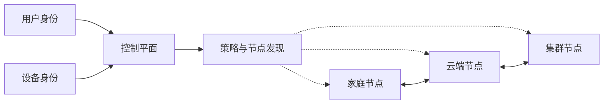
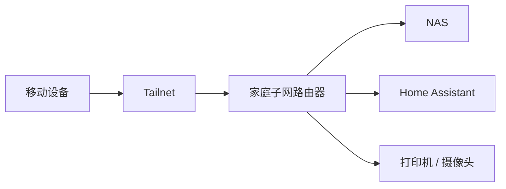
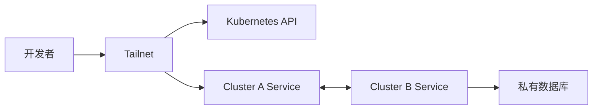

# Tailscale 不只是 VPN：身份网络的十种妙用、架构逻辑与实践边界

> [!abstract] 摘要
> Tailscale 表面上是一款基于 WireGuard 的组网工具，真正有价值的地方却不是“让两台机器互相 ping 通”，而是把分散在家庭、办公室、云平台、移动设备和 Kubernetes 中的资源，组织成一张以用户与设备身份为中心的可编程网络。本文从底层能力出发，分析十类高价值用法、组合方式、适用边界和演进路径。

## 一、先改变一个认识：Tailscale 不是传统 VPN 的简化版

传统 VPN 通常围绕“地点”建立信任：连接公司 VPN 后，客户端获得一个内网地址，随后进入公司网段。它解决的是“如何让远端设备进入某个局域网”。

Tailscale 更接近覆盖网络（Overlay Network）和身份网络（Identity-aware Network）的结合：每台设备成为独立节点，用户和设备先完成身份认证，再由控制平面分发节点信息、密钥材料与访问策略；数据流量则尽量在节点之间端到端直连。



控制平面回答“谁可以找到谁、谁可以访问什么”；数据平面回答“数据如何加密传输”。能建立直连时，节点通过 WireGuard 直接通信；受到 NAT 或防火墙限制时，连接可能通过 DERP 中继转发，但内容仍保持端到端加密。

> [!important] 核心变化
> 传统模型信任来源网段，例如“`10.0.0.0/8` 可以访问生产环境”；身份网络可以表达为“运维组中受管理的设备，可以访问生产数据库的 `5432` 端口”。权限由位置迁移到身份、设备和服务。

## 二、Tailscale 的五种基础能力

各种“妙用”本质上都是以下能力的组合，而不是互相孤立的功能。

| 基础能力 | 解决的问题 | 典型组件 |
|---|---|---|
| 节点互联 | 跨 NAT、跨网络建立加密连接 | WireGuard、NAT Traversal、DERP |
| 网络延伸 | 让不能安装客户端的设备或网段加入 Tailnet | Subnet Router |
| 流量出口 | 让客户端借用另一节点的互联网出口 | Exit Node、App Connector |
| 服务发布 | 把本机服务私有或公开发布 | Serve、Funnel |
| 身份授权 | 按用户、设备、标签和服务约束访问 | Grants、ACL、Tags、SSH Policy |

理解这五层后，Tailscale 就不再是一组命令，而是一盒网络积木。

## 三、十种值得使用的场景

### 1. 把家庭设备组成随身私有云

在 NAS、Mac、PC、手机和树莓派上加入同一 Tailnet，人在外面即可访问文件库、Home Assistant、Jellyfin、照片服务、远程桌面和开发环境。全过程不依赖家庭公网 IP、DDNS 或端口映射，家庭服务也不必拥有公网登录入口。

无法安装 Tailscale 的打印机、摄像头和路由器后台，可以通过一台常开 Linux 设备充当子网路由器统一接入。



部署细节可继续阅读 [[Tailscale 深度最佳实践]]。

### 2. 构建安全的远程开发工作站

把高性能 Mac、Linux 工作站或家庭 GPU 主机留在固定地点，使用笔记本、iPad 或手机远程连接。Tailscale 负责稳定可达，SSH、Mosh、RDP、VNC 或 Web IDE 负责交互层。

这个组合尤其适合：

- 在 iPad 上通过 Blink Shell 进入 Mac，再接管 `tmux` 会话；
- 远程调用 Ollama、Jupyter、ComfyUI 或内部模型 API；
- 把算力留在家中，只携带轻量客户端；
- 让开发会话在网络切换后继续存在。

实践方案见 [[Tailscale SSH + Blink Shell 作为 Intel Mac Codex Mobile 替代方案]] 和 [[iOS Surge + Tailscale 远程回家访问 macOS 实践]]。

### 3. 用出口节点获得稳定的可信出口

Exit Node 会接收客户端的默认路由，使互联网流量先进入指定节点再访问公网。

```text
旅行设备 -> 加密 Tailnet -> 家庭或云端 Exit Node -> Internet
```

它适合在酒店 Wi-Fi 上保护本地链路、访问只认可固定 IP 的系统、复现特定网络环境，或从海外设备使用家庭出口。但它不是匿名网络：目标服务仍能看到出口节点的公网 IP，出口所在网络也能观察连接元数据。

### 4. 把本地服务变成 Tailnet 内部 HTTPS 服务

`tailscale serve` 可以将本机端口、文件或目录发布到 Tailnet，并自动使用 Tailnet 域名和 HTTPS。常见用途包括手机测试本地前端、共享临时预览、访问 Jupyter 或 Grafana，以及给家庭服务增加可信 TLS。

Serve 还可以向后端注入经过验证的 Tailscale 身份头。对于小型内部工具，这意味着可以复用 Tailnet 身份，而不是立即建设完整登录系统。但后端只能信任来自 Serve 的请求，不能无条件相信公网请求携带的同名 Header。

### 5. 临时公开 Webhook 与演示环境

`tailscale funnel` 将本地服务通过中继发布到互联网，适合接收 GitHub、Stripe 等 Webhook，测试 OAuth 回调或分享短期原型。它省去了公网服务器和路由器端口映射，但入口是公开的，应用仍需要认证、输入校验、限流和审计。

> [!warning] Serve 与 Funnel 不可混淆
> Serve 面向 Tailnet 内已认证节点；Funnel 面向整个互联网。前者解决私有服务发现，后者解决临时公网入口，两者的威胁模型完全不同。

### 6. 消灭公网 SSH 与大规模密钥搬运

最保守的方案是继续使用普通 SSH，只让端口 `22` 通过 Tailscale 地址可达。进一步可以启用 Tailscale SSH，由 Tailnet 身份和策略决定谁能以哪个系统用户登录，并对高风险操作要求重新认证。

它适合集中撤销权限、临时授权、SSH 会话记录以及减少 `authorized_keys` 分发。但在多人共享客户端、依赖 `authorized_keys` 强制命令、或需要复杂本地用户隔离的环境中，普通 SSH 加 Tailscale 网络层可能更清晰。

### 7. 低成本打通家庭、办公室和多个云

在每个 VPC 或物理地点部署子网路由器，就能把原本隔离的私有网段接入同一逻辑网络。它适用于小团队多云互联、云迁移过渡期、办公室访问云数据库，以及 CI Runner 访问内网依赖。

相比传统 Site-to-Site VPN，这种方式显著降低了公网网关、IKE 和证书维护成本。规模扩大后仍需治理网段冲突、路由高可用、MTU、DNS 和故障域，不能把“配置简单”理解为“网络设计消失”。

### 8. 让 SaaS 访问同时拥有固定出口和身份控制

App Connector 按域名发现目标地址，并把指定应用流量送往专用 Linux 出口。配合 SaaS 的 IP Allowlist，可以形成如下链路：

```text
被授权设备 -> Tailnet -> App Connector -> SaaS IP 白名单
```

相较全局 VPN，它只接管 GitHub、Stripe、Salesforce 或数据库等目标应用的流量，可配置多个连接器实现区域路由与故障切换。

其边界在于底层最终仍按 IP 路由。如果多个域名共享同一 IP，与目标应用无关的连接也可能经过连接器，因此它不是严格意义上的七层反向代理。

### 9. 建立 Kubernetes 的私有入口与跨集群网络

Tailscale Kubernetes Operator 可以提供私有 `kube-apiserver` 访问、集群 Service 入站、Pod 到 Tailnet 的出站连接、多集群互通，以及集群内的出口节点或子网路由器。



网络可达与业务授权必须分层处理：Tailscale Grants 决定请求能否抵达 API 或 Service；Kubernetes RBAC 和 NetworkPolicy 决定抵达后能执行什么。

### 10. 统一移动设备的 DNS 和服务发现

MagicDNS 让 Tailnet 节点使用稳定主机名，而不是记忆 `100.x.y.z` 地址。配合 Split DNS，可以让家庭域名交给家庭 DNS、公司域名交给公司 DNS，公网域名继续走普通解析器。

还可以将 Pi-hole 或 AdGuard Home 配置为 Tailnet DNS，为手机、平板和笔记本提供一致的过滤策略。这里的真正价值不是少记几个 IP，而是建立跨地点仍然稳定的服务发现层。

## 四、组合玩法比单个功能更有价值

### 个人家庭网络组合

```text
Subnet Router + MagicDNS + Exit Node + 最小权限策略
```

这套组合同时提供家庭设备访问、稳定命名、可信互联网出口和访问隔离。子网路由与出口节点最好部署在有线、常开、不会休眠的 Linux 设备上。

### 开发者组合

```text
普通 SSH / Tailscale SSH + tmux + Serve + Funnel
```

日常管理走私有 SSH，内部预览走 Serve，只有确实需要第三方回调或公开演示时才临时开启 Funnel。

### 小团队基础设施组合

```text
Tags + Grants + Subnet Router + App Connector + Kubernetes Operator
```

它将主机、VPC、SaaS 和集群放进统一的身份策略中。策略文件应进入 Git，配套测试和审批流程，避免管理后台中的临时修改逐渐成为不可审计配置。

## 五、设计时必须面对的边界

### 控制平面与数据平面不是一回事

Tailscale 通常不能读取节点间端到端加密的数据内容，但官方控制平面承担登录、设备发现、密钥协调和策略分发。需要完全自托管控制平面时可以研究 Headscale，不过需要接受功能覆盖、升级兼容、运维和官方支持上的差异。

### 直连不是永远成立

复杂 NAT、企业防火墙或 UDP 受限环境可能阻止点对点直连，此时流量退回 DERP 中继。中继不会破坏端到端加密，却可能增加延迟并限制吞吐。出现性能问题时，应先运行 `tailscale netcheck`、`tailscale ping` 并确认链路是 `direct` 还是 `relay`。

### 网络准入不能替代应用授权

允许用户访问数据库端口，不等于用户应该拥有数据库管理员权限；允许访问 Kubernetes API，也不等于拥有 `cluster-admin`。正确模型是多层防御：

```text
设备安全 -> Tailnet 策略 -> 主机防火墙 -> 应用认证 -> 数据权限
```

### 子网路由会放大错误配置

一台节点可能代表整个 `192.168.1.0/24` 网段。若授权范围过宽，攻击面也从一台机器扩大到整个局域网。多个地点使用相同私网地址还会产生路由歧义，应提前规划不重叠网段或只发布必要的精确路由。

### 连接器必须按基础设施管理

Subnet Router、Exit Node 和 App Connector 都可能成为单点。生产场景应使用至少两个节点、关闭不合适的密钥过期、监控在线状态，并测试故障转移。不要把安装在日常笔记本上的临时节点当生产网关。

## 六、推荐的渐进式演进路线

> [!tip] 不要第一天就构建复杂零信任体系
> 从一个可验证的价值场景开始，再随着节点和人员增加逐层收紧。

1. **节点互联**：先连接个人电脑、手机和一台服务器，验证 MagicDNS 与直连状态。
2. **服务私有化**：关闭公网 SSH 或管理后台，仅保留 Tailnet 入口。
3. **接入局域网**：部署家庭或办公室 Subnet Router，但只发布必要网段。
4. **收紧策略**：使用用户组、Tags 和 Grants 从默认互通迁移到最小权限。
5. **引入出口能力**：按需增加 Exit Node 或 App Connector，而非默认接管所有流量。
6. **基础设施化**：将策略纳入版本控制，为连接器配置高可用、监控和恢复流程。

## 七、最终判断：什么时候该用，什么时候不该用

Tailscale 最适合节点分散、网络环境复杂、团队规模有限、希望快速建立私有访问面的场景。它尤其擅长解决“设备都在不同地方，但应该像在同一可信网络中协作”的问题。

以下情况需要谨慎评估：

- 必须完全自托管身份与协调控制平面；
- 大规模数据中心东西向流量对吞吐、延迟和硬件卸载要求极高；
- 必须提供传统网络设备级的动态路由、深度包检测或复杂 QoS；
- 大量第三方用户只需要访问一个 Web 应用，此时成熟的应用身份代理可能更合适；
- 组织尚未建立设备治理，却准备把 Tailnet 当作唯一安全边界。

> [!success] 一句话结论
> Tailscale 的真正妙用，是把家庭设备、开发环境、云网络、SaaS 和 Kubernetes 统一成一张“以身份决定可达性”的网络。它不是简单替代某个 VPN，而是在小到中等规模环境中，用较低运维成本提供网络连接、服务发现、身份授权和流量编排的共同底座。

## 参考资料

- [Tailscale：How Tailscale works](https://tailscale.com/blog/how-tailscale-works/)
- [Tailscale Serve](https://tailscale.com/docs/features/tailscale-serve)
- [Tailscale Funnel](https://tailscale.com/docs/features/tailscale-funnel)
- [Tailscale SSH](https://tailscale.com/docs/features/tailscale-ssh)
- [App Connectors](https://tailscale.com/docs/features/app-connectors)
- [Kubernetes Operator](https://tailscale.com/docs/kubernetes-operator)
- [Exit Nodes](https://tailscale.com/docs/features/exit-nodes)
- [Subnet Routers](https://tailscale.com/docs/features/subnet-routers)

## 相关笔记

- [[Tailscale 深度最佳实践]]
- [[Tailscale SSH + Blink Shell 作为 Intel Mac Codex Mobile 替代方案]]
- [[iOS Surge + Tailscale 远程回家访问 macOS 实践]]