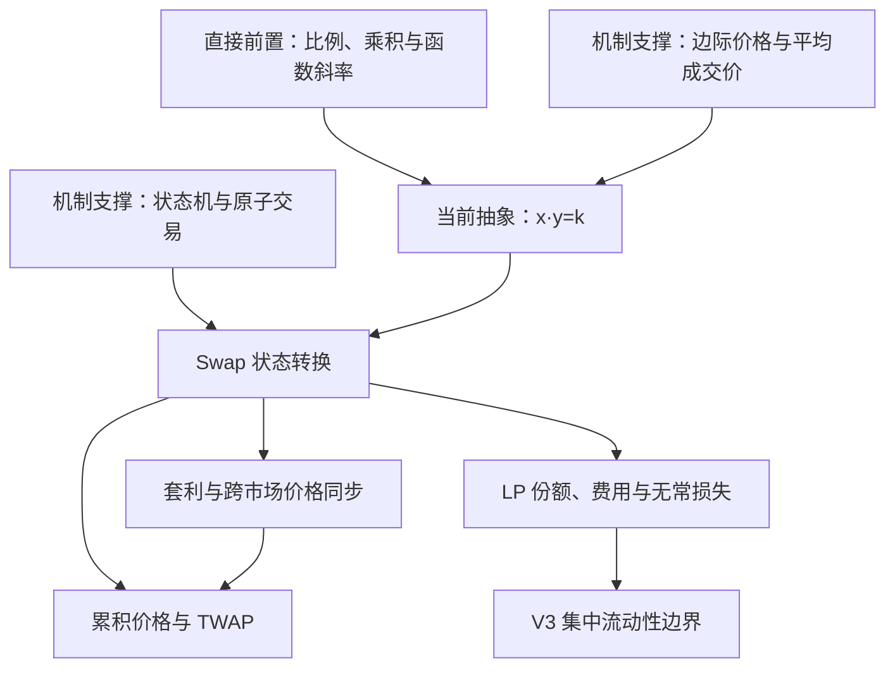
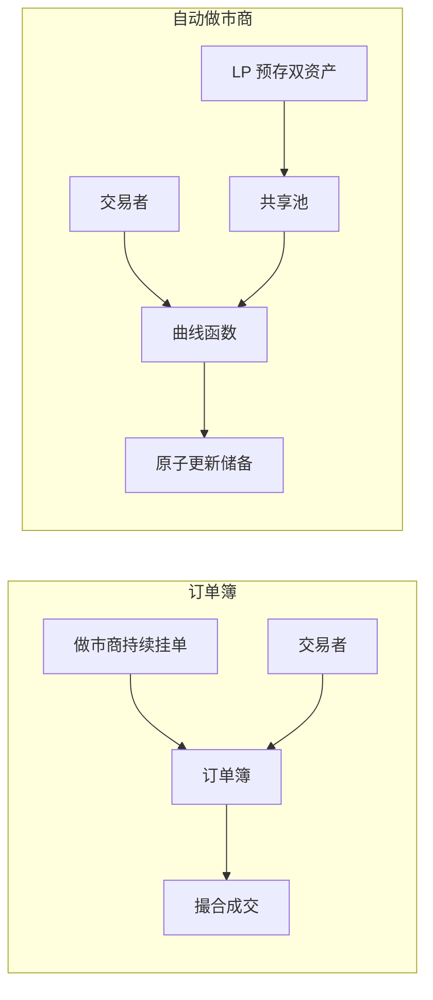
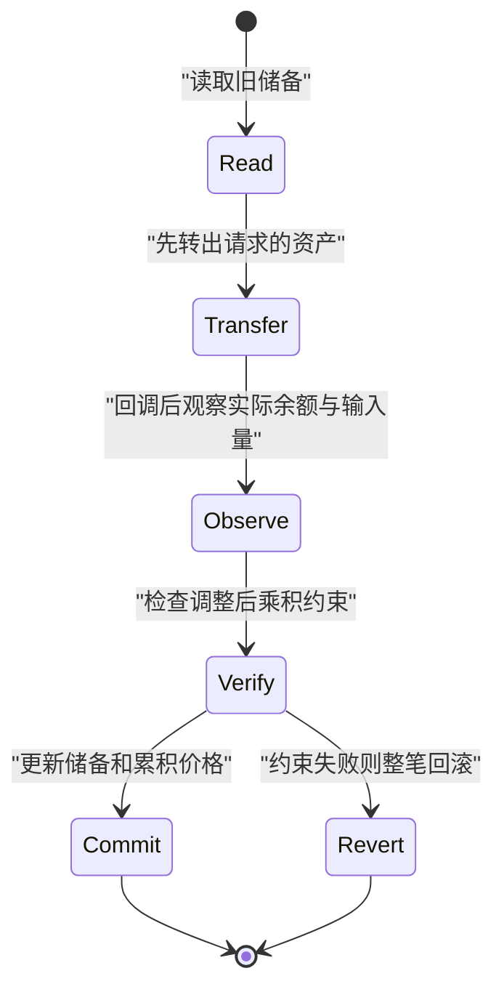
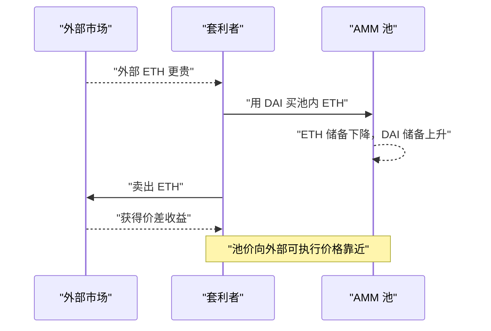
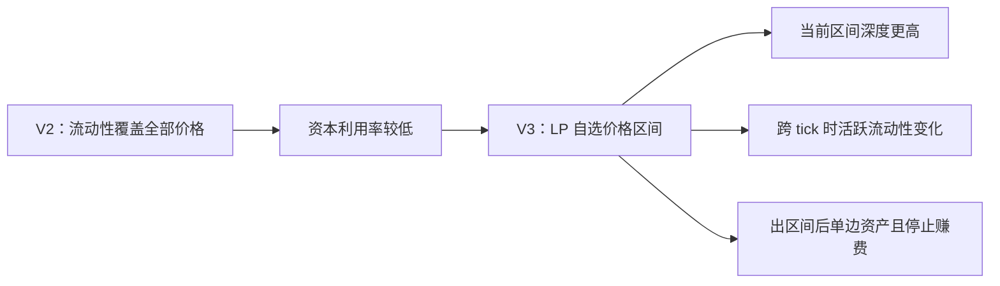

# Uniswap 恒定乘积 AMM：从 `x·y=k` 到套利、LP 与 TWAP 深度解析

> [!abstract] 一句话模型
> 恒定乘积自动做市商（Constant Product Automated Market Maker, CPMM）把“谁愿意以什么价格成交”的订单簿问题，改写成“交易后池中两种资产必须满足什么数学约束”的状态转换问题。`x·y=k` 不是价格预测器，而是一条规定**库存如何随交易变化**的曲线；价格则是这条曲线在当前库存点上的边际斜率。

本文由日报 [[work-docs/daily-reports/2026-07-23|2026-07-23 每日算法知识点]] 延伸而来，重点以 Uniswap V2 为主线，并在最后说明 Uniswap V3 的适用边界。协议机制以 Uniswap V2/V3 白皮书和 V2 Core 合约为依据；具体池子的收益与攻击成本仍取决于实时链上状态。

---

## 1. 先建立知识依赖图

### 1.1 学习目标

读完本文，应当能够：

1. 从 `x·y=k` 推导池内边际价格与单笔交易输出量；
2. 区分手续费（Fee）、价格影响（Price Impact）与滑点（Slippage）；
3. 解释套利为什么能同步价格，却不能保证“真实价格”；
4. 推导流动性提供者（Liquidity Provider, LP）的份额与无常损失；
5. 解释 V2 时间加权平均价格（Time-Weighted Average Price, TWAP）的状态累积机制及安全边界；
6. 指出 V2 模型不能直接覆盖 V3 集中流动性的原因。

### 1.2 最小知识依赖



- **直接前置**：乘积不变量、比例和函数斜率。缺少它们就无法推导价格。
- **机制支撑**：边际量与平均量的区别；区块链交易的原子状态转换。
- **相邻连接**：库存风险、套利、预言机、最大可提取价值（MEV）。
- **可选扩展**：V3 tick、`sqrtPriceX96`、复杂预言机与 LP 主动管理。

> [!tip] 面向后端工程师的映射
> 可以把池看成一个具有两个库存字段的持久化聚合根。Swap 不是“查价后扣库存”两步操作，而是一次原子状态迁移：输入旧储备和交易量，计算新储备，再验证不变量。公式就是这个聚合根最核心的业务约束。

---

## 2. 为什么 AMM 要替代订单簿中的“报价者”

传统限价订单簿（Central Limit Order Book, CLOB）依赖挂单者持续给出离散报价：有人以 3000 DAI 卖 ETH，才可能有人以该价格买到 ETH。链上直接复制订单簿会遇到几个问题：

- 挂单、撤单与撮合都需要链上交易和 Gas；
- 区块确认使高频更新报价成本很高；
- 长尾资产很难持续吸引专业做市商；
- 链上合约必须在任何时刻都能确定性地执行，而不能等待一个未来对手方。

AMM 的关键重构是：

> 不再要求某个人提交完整报价表，而是由流动性提供者先存入两种资产，再由一条确定性曲线根据池中库存生成连续报价。

这并不意味着“没有经济对手方”。交易者的经济对手方是共享池及其 LP；准确说法是：**交易无需等待订单簿中同步出现一笔方向相反的挂单。**



---

## 3. `x·y=k` 到底约束了什么

设池中有两种资产：

- `x`：资产 X 的储备；
- `y`：资产 Y 的储备；
- `k`：无手续费理想模型中的恒定乘积。

公式为：

$$
x\cdot y=k
$$

若交易者向池中投入 `Δx`，取出 `Δy`，忽略手续费时，新状态满足：

$$
(x+\Delta x)(y-\Delta y)=xy
$$

解得：

$$
\Delta y=\frac{y\Delta x}{x+\Delta x}
$$

### 3.1 它不是“固定价格”

从 `y=k/x` 求导：

$$
\frac{dy}{dx}=-\frac{k}{x^2}=-\frac{y}{x}
$$

若以“1 单位 X 值多少 Y”为报价方向，当前无手续费边际价格为：

$$
P_{spot}=\frac{y}{x}
$$

负号只表示沿曲线增加 X 会减少 Y；价格取斜率绝对值。`y/x` 是**下一小单位**资产的瞬时交换率，不是任意交易规模都能享受的固定价格。

### 3.2 为什么大单必然有更大价格影响

随着 `Δx` 增大：

- X 储备越来越多；
- Y 储备越来越少；
- 后续每一小单位 X 能换出的 Y 递减；
- 单笔交易的平均成交价低于交易前的边际价格。

这是曲线曲率带来的库存保护机制。如果池对任意规模都按旧价格成交，大额交易者就能以过时价格抽干一侧储备。

```text
交易前                         交易后
X: 100 ETH                    X: 101 ETH
Y: 300,000 DAI   --Swap-->    Y: 约 297,038.53 DAI（含 V2 费）

第一小段 ETH 获得的 DAI 较多
最后一小段 ETH 获得的 DAI 较少
平均成交价 = 所有小段成交结果的平均
```

> [!warning] 类比的边界
> “自动售货机库存越少越贵”能解释库存反馈，却不能替代真实机制：AMM 没有人工定价器，也没有离散价签；价格来自连续曲线斜率，且会被外部套利交易改变。

---

## 4. 一笔 V2 Swap 的完整推演

假设池中有：

- `100 ETH`
- `300,000 DAI`
- 初始无手续费边际价格 `3000 DAI/ETH`
- 交易者输入 `1 ETH`
- V2 输入手续费率 `f=0.003`，有效输入系数 `γ=0.997`

最大输出量为：

$$
\Delta y=\frac{y\gamma\Delta x}{x+\gamma\Delta x}
$$

代入：

$$
\Delta y=\frac{300000\times0.997\times1}{100+0.997}\approx2961.47\text{ DAI}
$$

平均成交价约为：

$$
P_{avg}=\frac{2961.47}{1}=2961.47\text{ DAI/ETH}
$$

### 4.1 少掉的 38.53 DAI 是什么

不能笼统地全部叫“手续费”或“滑点”。

若忽略手续费：

$$
\Delta y=300000-\frac{30000000}{101}\approx2970.30\text{ DAI}
$$

因此相对起始边际价 3000：

- 约 `29.70 DAI` 来自确定性的**曲线价格影响**；
- 再考虑手续费后，总输出下降到约 `2961.47 DAI`；
- 用户界面中的**滑点**常指报价产生后到交易执行时，市场状态变化造成的意外偏差；
- **滑点容忍度**是用户允许实际输出低于报价的上限保护，不等于价格影响。

| 概念 | 原因 | 是否可在报价时确定 |
|---|---|---|
| 手续费 | 协议按输入收取 | 可以 |
| 价格影响 | 本次交易沿曲线移动价格 | 可以 |
| 滑点 | 报价后其他交易、排序与市场变化 | 不完全可以 |

### 4.2 含手续费时，实际 `k` 通常会增长

教学中常说“交易后 `k` 不变”，这只适用于无手续费理想模型。V2 Core 实际检查的是：

$$
(x+0.997\Delta x)(y-\Delta y)\ge xy
$$

但最终记录的真实储备包含完整输入：

$$
x'=x+\Delta x,\quad y'=y-\Delta y
$$

于是：

$$
k'=x'y'=xy\frac{x+\Delta x}{x+0.997\Delta x}>xy
$$

手续费留在池中，因此真实储备乘积通常增长。更准确的表述是：

> V2 要求扣除输入手续费后的有效余额乘积不下降；手续费进入真实储备，构成 LP 收益的一部分。

---

## 5. 从状态机看 Swap 的正确性

一次 Swap 可以抽象为四步：



核心不变量不是“业务代码按预期执行过”，而是提交前可从最终余额重新验证：

1. 输出量不能超过储备；
2. 调整手续费后的余额乘积不能低于旧储备乘积；
3. 最终储备与真实 Token 余额同步；
4. 任一条件失败，整笔交易原子回滚。

这与支付系统的账务不变量很相似：不要只相信调用链，而要在提交边界验证“借贷平衡”或“资金守恒”。区别在于 AMM 允许池中两种资产数量变化，但要求它们满足曲线约束。

> [!note] 非标准 Token 边界
> 转账扣费（fee-on-transfer）、重定基数（rebasing）等非常规 ERC-20 可能使“请求转入量”等于“实际到账量”的假设失效。协议集成必须以实际余额变化为依据，不能机械套用普通 Token 路径。

---

## 6. 套利：价格同步器，而不是真实价格证明

AMM 合约不知道 ETH 在外部市场值多少。假设外部市场上涨到 `3300 DAI/ETH`，而池中仍约为 `3000`，套利者会：

1. 在 AMM 用 DAI 买入相对便宜的 ETH；
2. 在外部市场卖出 ETH；
3. AMM 中 ETH 减少、DAI 增加；
4. 池内 `DAI/ETH` 边际价格上升；
5. 直到价差不足以覆盖手续费、Gas、MEV 和外部交易成本。



### 6.1 核心不变量与边界

套利的成立条件是：

$$
\text{跨市场价差}>\text{手续费}+\text{Gas}+\text{MEV 成本}+\text{外部成本}+\text{风险补偿}
$$

所以池价通常只会进入一个**无套利区间**，而非与外部价格精确相等。以下情况下池价可能偏离很久：

- 池太浅，交易本身价格影响过高；
- 资产失锚或外部市场也不可靠；
- 跨链、跨市场资金移动受阻；
- Gas 或竞争成本高于潜在利润；
- 攻击者短时控制交易排序或多个连续区块。

因此：

> 套利说明价格差异会吸引资本，不说明某个市场的价格天然真实、公允或不可操纵。

---

## 7. LP Token：你拥有的不是固定数量，而是池的比例

### 7.1 为什么初始流动性使用 `√(xy)`

V2 初始 LP Token 供应量近似为：

$$
L_0=\sqrt{\Delta x\Delta y}-MINIMUM\_LIQUIDITY
$$

几何平均数 `√(xy)` 有一个关键缩放性质：若两侧储备都扩大 `c` 倍，则：

$$
\sqrt{(cx)(cy)}=c\sqrt{xy}
$$

它与池的整体规模线性变化，而不会偏向某一资产的计价单位。合约永久锁定极小的 `MINIMUM_LIQUIDITY`，用于提高针对份额价值操纵的成本。

### 7.2 后续添加和移除流动性

已有总 LP 供应量 `L` 时，按当前储备比例添加：

$$
\Delta L=\min\left(\frac{\Delta xL}{x},\frac{\Delta yL}{y}\right)
$$

使用 `min` 防止某一侧过量存入却获得超额份额。销毁 `ΔL` 时，按比例取回：

$$
amountX=\frac{\Delta L}{L}x,\qquad amountY=\frac{\Delta L}{L}y
$$

最稳妥的心智模型是：

> LP Token 是对池当前两种资产的同比例索取权，不是“当初各存多少，未来就各取回多少”的存单。

随着交易和套利发生，池的资产组成持续变化；手续费提高池的总价值，但库存再平衡也会带来相对持币的机会成本。

---

## 8. 无常损失：损失为何来自“被动再平衡”

设 LP 初始按等值 50/50 存入两种资产。外部相对价格变为原来的 `r` 倍，套利令池价重新对齐。忽略手续费、Gas 和激励时，LP 相对直接持币的价值比为：

$$
\frac{V_{LP}}{V_{HODL}}=\frac{2\sqrt r}{1+r}
$$

无常损失（Impermanent Loss, IL）为：

$$
IL(r)=\frac{2\sqrt r}{1+r}-1
$$

| 相对价格变化 `r` | LP 相对持币差异 |
|---:|---:|
| 1.25 | 约 -0.62% |
| 1.50 | 约 -2.02% |
| 2.00 | 约 -5.72% |
| 4.00 | -20.00% |

### 8.1 为什么会发生

当 X 价格上涨时，套利者不断从池中买走 X、放入 Y。LP 的组合被曲线自动调整为：

- 上涨资产 X 越来越少；
- 相对弱势资产 Y 越来越多。

这等价于一种被动的“涨了卖、跌了买”。它保持池可交易，却使 LP 没有完整享受单边上涨资产的收益。

### 8.2 “无常”不等于“没有真实损失”

“Impermanent”只表示：在理想模型中，若两种资产的**相对价格比率**回到初始值，这部分相对持币差异会回到零。必须同时看到：

- 在偏离时退出，差异成为已实现结果；
- 不退出时，机会成本也真实存在；
- 手续费可能抵消 IL，但手续费收益与 IL 是两个不同科目；
- 资产归零、失锚或永久重估时，价格未必会回归；
- 上述标准公式不能直接套用于 V3 集中流动性头寸。

> [!question] 迁移题
> 若某池手续费收益为 4%，按理想模型计算的 IL 为 -5.72%，能否说 LP “赚了 4%”？不能。还需统一比较基准、计价资产、期间价格、Gas、激励和退出成本。相对持币的粗略结果约为负值，但精确收益必须基于完整现金流。

---

## 9. TWAP：把瞬时价格变成一段时间的状态积分

### 9.1 为什么不能直接读取当前储备比

瞬时池价能被一笔大额交易暂时推离。如果借贷协议在同一交易中读取该价格并据此允许高额借款，攻击者可能：

1. 用闪电资金推高抵押品池价；
2. 借贷协议读取被推高的瞬时价格；
3. 借出超过真实价值的资产；
4. 在交易尾部恢复资金，留下坏账。

V2 的思路不是宣布瞬时价格“可信”，而是累计价格持续的时间。

### 9.2 累积价格状态

Pair 维护两个方向的累积价格。概念上：

$$
C(t_2)-C(t_1)=\int_{t_1}^{t_2}P(t)dt
$$

外部消费者保存起止两个检查点：

$$
TWAP_{t_1,t_2}=\frac{C(t_2)-C(t_1)}{t_2-t_1}
$$

```text
时间       t1                 t2                 t3
价格       P1-----------------P2-----------------P3
累计量     + P1·(t2-t1)       + P2·(t3-t2)

消费者不需要保存每个区块的价格，
只需保存两个累计值并作差，再除以时间跨度。
```

V2 Core 并不替消费者保存任意历史窗口。消费者需要自行记录检查点、决定窗口，并处理陈旧性、流动性和偏差检查。

### 9.3 为什么同时累计两个价格方向

`Y/X` 的时间算术平均值取倒数，通常不等于 `X/Y` 的时间算术平均值：

$$
\frac{1}{E[P]}\ne E\left[\frac{1}{P}\right]
$$

因此协议分别累计两个方向，而不是简单地对一个累积值取倒数。

---

## 10. TWAP 的安全性：提高操纵成本，而非消灭操纵

原始直觉“多区块平均后更难操纵”是对的，但“几乎无法操控”过于绝对。攻击成本受以下变量共同决定：

- 池的流动性深度；
- 目标价格偏离幅度；
- 异常价格需要占据窗口的时间；
- 窗口长度与采样方式；
- 正常套利者是否能在后续区块纠偏；
- 攻击者能否控制连续区块或交易排序；
- 外部独立市场是否存在；
- 消费协议是否设置最小流动性、陈旧性和偏差保护。

### 10.1 闪电贷改变什么、不改变什么

闪电贷降低了瞬时融资门槛，却不会自动消除：

- 推动曲线产生的价格影响；
- Swap 手续费与 Gas；
- 套利者纠偏造成的损失；
- 跨多个区块维持异常价格的成本；
- 连续区块控制和排序竞争。

所以正确结论是：

> TWAP 让攻击者不仅要“在某一瞬间制造价格”，还要让异常价格在窗口中占据足够权重。它通常提高攻击成本，但不提供不可操纵保证。

### 10.2 窗口越长并非无条件越好

长窗口通常提高操纵成本，却增加价格滞后；市场发生真实快速变化时，旧价格权重会让协议反应变慢。设计者需要在**抗操纵性**与**及时性**之间取舍。

| 方案 | 优点 | 主要风险 |
|---|---|---|
| 瞬时 AMM 价格 | 最新、实现简单 | 极易受单笔大额交易影响 |
| 短窗口 TWAP | 较及时 | 浅池或区块控制下仍脆弱 |
| 长窗口 TWAP | 通常更难短时操纵 | 滞后、无法及时反映跳变 |
| 多源预言机 | 来源更分散 | 聚合、治理与数据源自身风险 |

---

## 11. 从 V2 到 V3：`x·y=k` 的适用边界

V2 中，所有流动性均匀覆盖从零到无穷大的价格区间，LP Token 可以表示同质化池份额。资本效率问题是：若 ETH 大部分时间只在某个窄区间波动，远离当前价格的资金几乎从不参与成交。

V3 引入集中流动性（Concentrated Liquidity）：LP 自选价格区间 `[p_a,p_b]`。这带来：

- 当前价格附近可放置更密集的流动性；
- 同样资金可提供更深的局部报价；
- 价格跨越 tick 时，活跃流动性离散变化；
- 头寸的区间和费用状态不同，因此原生头寸非同质化；
- 头寸出区间后变为单一资产，并停止赚取该区间外的交易费；
- LP 需要承担主动管理和区间选择风险。



V3 仍保留恒定乘积的局部几何结构：在相邻 tick、活跃流动性不变的区间内，可借助虚拟储备理解局部 `x·y=k`。但协议实际跟踪的是流动性 `L` 与平方根价格，而不是一个概括所有头寸、覆盖全部价格范围的简单全局真实储备公式。

> [!warning]
> 不要把 V2 的固定 0.30% 手续费、同质化 LP Token、标准 IL 公式和全区间储备模型直接外推到 V3。

---

## 12. 失败模式与工程检查表

### 12.1 常见失败模式

1. **浅池价格操纵**：储备小，少量资本即可显著移动价格。
2. **错误使用瞬时价格**：借贷或清算协议在同一交易中直接信任储备比。
3. **TWAP 窗口设计不当**：窗口太短不安全，太长又严重滞后。
4. **术语混淆**：把手续费、价格影响和滑点全部归为一个概念。
5. **错误收益基准**：只看手续费年化，不与持币组合和 IL 比较。
6. **非标准 Token**：实际到账量、余额变化或转账行为破坏普通假设。
7. **V2/V3 模型混用**：用 V2 全区间公式估计 V3 区间头寸风险。
8. **把套利当真值保证**：忽略外部市场失真、Gas、MEV 和资本约束。

### 12.2 协议集成检查表

- [ ] 明确使用 V2、V3 还是其他分叉，不能只写“Uniswap 风格”；
- [ ] 报价公式包含正确手续费与精度处理；
- [ ] 使用最小输出量或最大输入量限制执行风险；
- [ ] 不把确定性价格影响误报为随机滑点；
- [ ] 预言机检查窗口、更新时间、最小流动性与异常偏差；
- [ ] 对非标准 ERC-20 行为有明确策略；
- [ ] LP 收益与 HODL 基准、Gas、激励、IL 同口径比较；
- [ ] 对 MEV、抢跑、夹子交易（Sandwich Attack）设置交易保护；
- [ ] 关键数值使用整数与固定点模型验证，避免浮点误差；
- [ ] 用真实池状态进行压力测试，而不是只验证小额正常路径。

---

## 13. 费曼理解检验

### 13.1 白话复述

试着不用“AMM”“不变量”“边际价格”三个词解释 `x·y=k`：

> 池里一种资产被买走后，剩余资产必须变得越来越难买，避免任何人按旧价把库存一次抽空。

### 13.2 逐步推演

池中 X 减少、Y 增加时，以 Y 计价的 X 会如何变化？

- `P_X=y/x`；
- 分子增大、分母减小；
- 因此 X 的池内价格上升。

### 13.3 指出边界

“自动售货机”类比在哪失效？

- 售货机价格通常由运营者离散调整；
- AMM 价格由连续储备曲线即时产生；
- 外部套利还能反向改变池中库存和价格。

### 13.4 迁移应用

如果两个流动性池都交易同一资产对，但一个池深、一个池浅：

- 同样交易量在哪个池价格影响更大？浅池；
- 哪个池的瞬时价格更容易操纵？浅池；
- 是否因此深池价格绝对安全？不是，还需考虑窗口、区块控制、外部市场和消费协议逻辑。

---

## 14. 压缩结论

1. `x·y=k` 约束的是库存状态，不是对资产真实价值的预测；边际价格来自曲线斜率 `y/x`。
2. 有限交易会沿曲线移动，因此平均成交价不同于起始边际价格；手续费、价格影响和滑点必须分开。
3. V2 含费交易检查扣费后的有效乘积，手续费留在池中，使真实储备 `k` 通常增长。
4. 套利把池价推向外部可执行价格的无套利区间，但不能证明价格真实或不可操纵。
5. LP Token 表示池资产的比例索取权；手续费是收益，无常损失是相对持币的再平衡成本，两者应分账比较。
6. TWAP 通过累计“价格 × 时间”提高短时操纵成本，但安全性依赖流动性、窗口、采样、套利环境和区块控制。
7. V3 把流动性切分到价格区间；`x·y=k` 仍可作为局部虚拟储备模型，却不能概括全部头寸。

## 15. 后续知识路径

- 直接前置补课：边际量、导数、几何平均数、固定点数；
- 机制深化：V2 Pair 合约、Flash Swap、协议费铸造；
- 安全深化：预言机操纵、MEV、夹子交易与多区块攻击；
- V3 延伸：tick、`sqrtPriceX96`、流动性 `L` 与区间头寸记账；
- 跨域连接：将 AMM 不变量与支付账务不变量、数据库提交约束、库存控制模型对照学习。

---

## 参考资料

1. [Uniswap V2 Core Whitepaper](https://app.uniswap.org/whitepaper.pdf)
2. [Uniswap V3 Core Whitepaper](https://app.uniswap.org/whitepaper-v3.pdf)
3. [Uniswap V2 Core — UniswapV2Pair.sol](https://github.com/Uniswap/v2-core/blob/master/contracts/UniswapV2Pair.sol)
4. [Uniswap V2 Pricing](https://docs.uniswap.org/contracts/v2/concepts/advanced-topics/pricing)
5. [Uniswap V2 Oracles](https://developers.uniswap.org/docs/protocols/v2/concepts/oracles)
6. [Uniswap V2 Understanding Returns](https://docs.uniswap.org/contracts/v2/concepts/advanced-topics/understanding-returns)
7. [An Analysis of Uniswap Markets](https://arxiv.org/abs/1911.03380)
8. [Impermanent Loss and Risk Profile of a Liquidity Provider](https://arxiv.org/abs/2106.14404)
