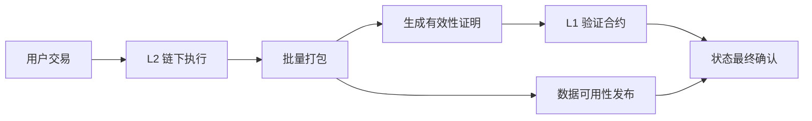
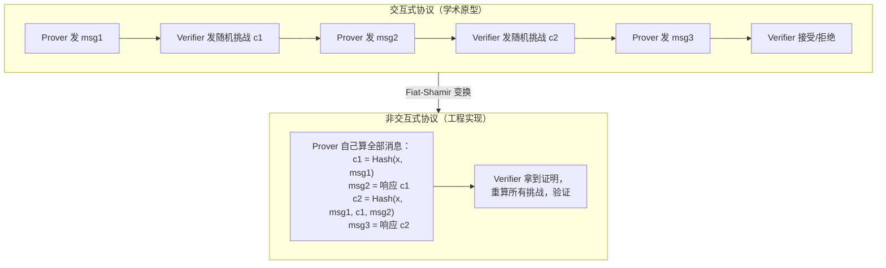
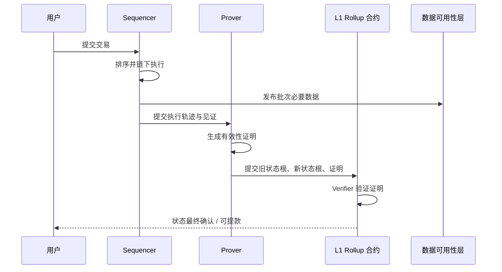
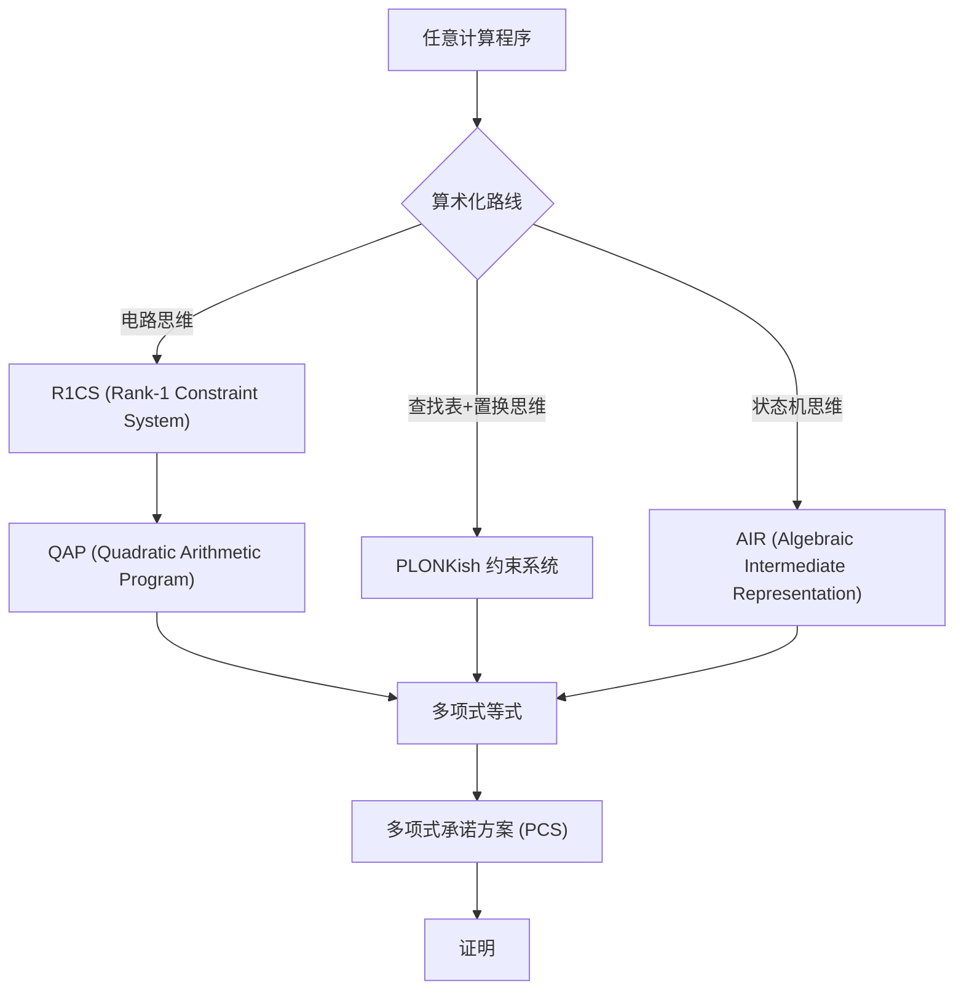
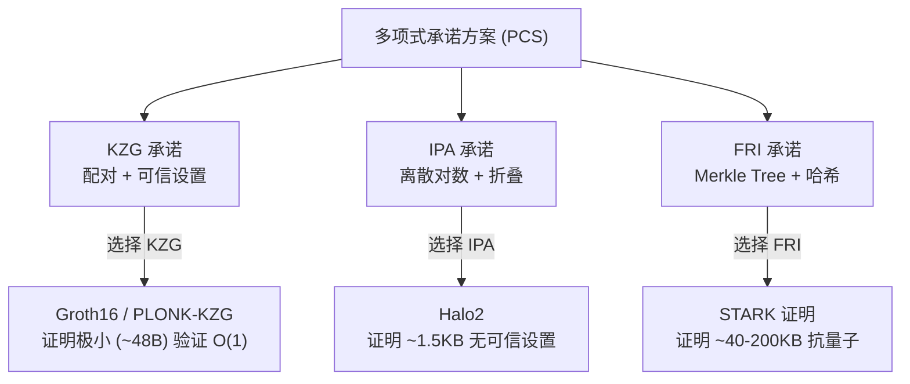
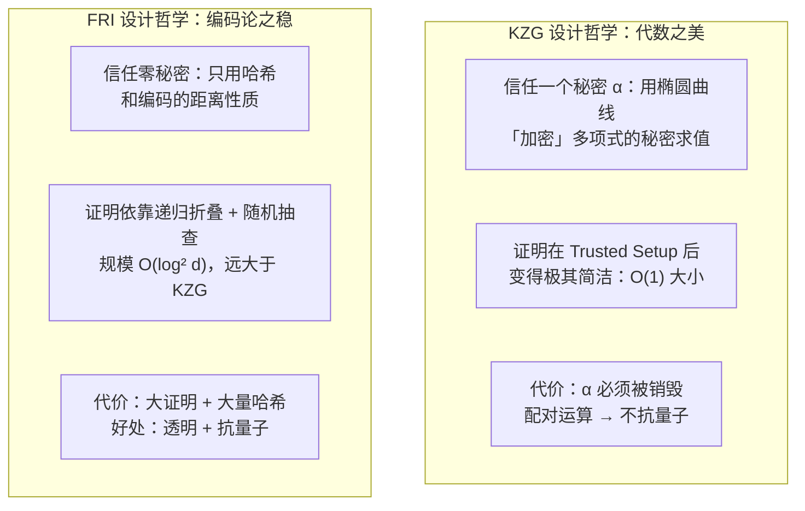
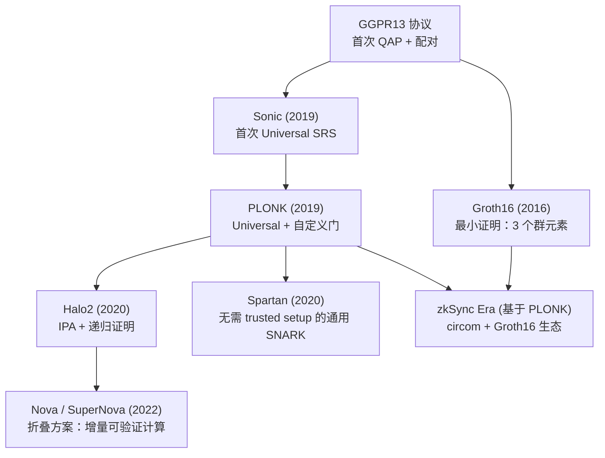
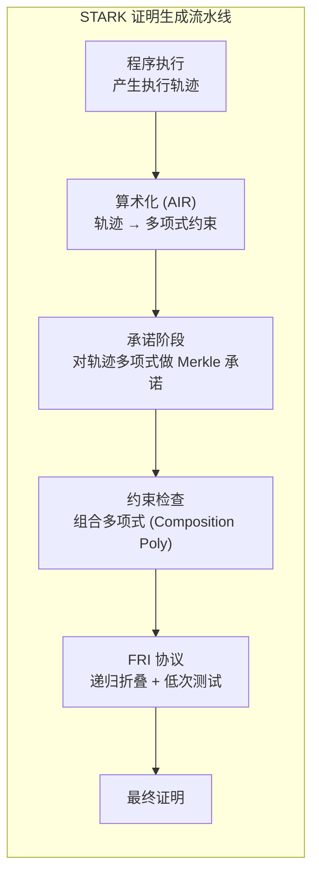
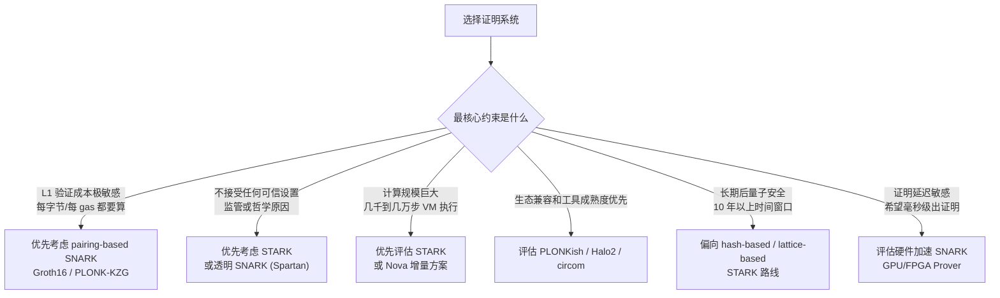
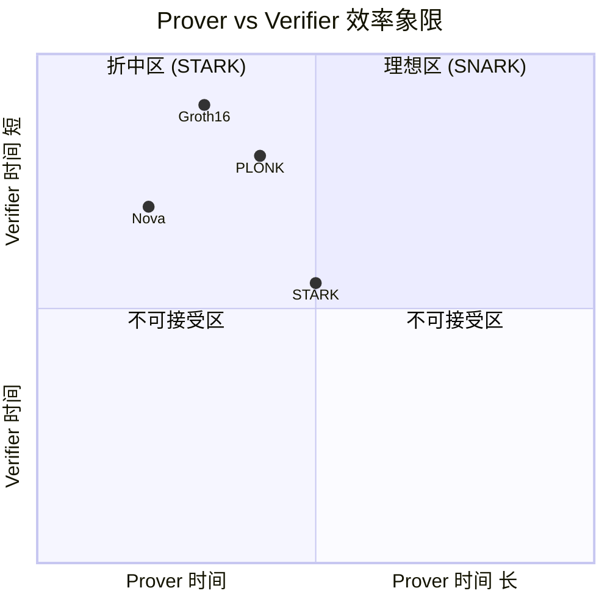

# ZKP 与 zk-Rollup — 从不泄密证明到 SNARK vs STARK 工程选型

> [!abstract]
> 这篇文章从 daily report 的直觉问题出发：**如何在不透露秘密、不重放全部交易的情况下，让别人相信一个复杂计算是真的？**
>
> 零知识证明 (Zero-Knowledge Proof, ZKP) 解决的是"证明正确性但不暴露隐私"；zk-Rollup 解决的是"链下批量计算、链上低成本验证"；SNARK 与 STARK 则是两条不同的工程路线：前者小而便宜，后者透明、可扩展、偏长期安全。
>
> **本文侧重原理推导与设计哲学**，不只是罗列概念——而是回答"为什么"：为什么要把计算变成多项式？为什么 SNARK 需要可信设置而 STARK 不需要？为什么 Fiat-Shamir 变换是 ZKP 从理论到工程的决定性一步？

---

## 1. 一句话总览

如果把区块链理解成一个所有人共同维护的账本，传统做法是：**每个人都重新计算一遍，才能确认结果可信**。

zk-Rollup 的设计奥义是反过来：

> 不让 L1 重做所有交易，而是让 L2 提交一个很小或可验证成本较低的"正确性证明"，L1 只验证证明。



ASCII 简图：

```text
传统链上执行：
  1000 笔交易 → L1 全部执行 → 成本高

zk-Rollup：
  1000 笔交易 → L2 执行 → 1 个证明 + 必要数据 → L1 验证
```

**设计哲学第一条**：这是 ZKP 系统最核心的不对称性——**Prover 做重活，Verifier 做轻活**。证明的生成可以消耗任意多的计算资源（GPU 集群、FPGA、甚至是云端批处理），但验证必须快到可以在链上合约中完成。这种不对称性不是偶然的，而是 ZKP 系统三十年来演进的指南针。

---

## 2. ZKP 到底证明了什么？— 形式化定义与核心直觉

零知识证明 (Zero-Knowledge Proof, ZKP) 不是"把信息加密后给别人看"，而是一种证明协议。在密码学教材中，它被定义为一个满足三条性质的交互协议：

- **证明者 (Prover)**：我知道某个秘密，或我正确执行了某个计算。
- **验证者 (Verifier)**：我不需要知道秘密，也不需要重做全部计算，只需要检查证明。
- **公开输入 (Public Inputs)**：验证者允许知道的内容，例如旧状态根、新状态根、批次承诺。
- **私有见证 (Private Witness / `w`)**：证明者知道但不公开的内容，例如交易细节、私钥、账户路径。

### 2.1 三条核心性质

| 性质 | 含义 | 在 Rollup 中的直觉 |
|---|---|---|
| **完备性 (Completeness)** | 真的命题能通过验证 | 正确执行的批次应被 L1 接受 |
| **可靠性 (Soundness)** | 假命题很难伪造证明（即使 Prover 作弊，验证者接受的概率也是可忽略的） | 错误状态转移不能骗过验证合约 |
| **零知识性 (Zero-Knowledge)** | 验证者学不到任何关于私有见证的额外信息（除了"命题为真"这个事实） | 可证明计算正确，但不暴露不该公开的内部信息 |

> [!note]- 深入理解：Soundness vs Knowledge Soundness
> 密码学中还区分两种"可靠性"：
> - **普通 Soundness**：坏 Prover 无法让验证者接受假命题。
> - **Knowledge Soundness（知识可靠性，即 Argument of Knowledge）**：如果 Prover 能说服验证者，则必然"知道"一个合法 witness。这意味着存在一个提取器 (Extractor)，能从 Prover 的交互中提取出 witness。
>
> **SNARK 的 "K" 就是 Knowledge**——不仅保证命题为真，而且保证 Prover 确实拥有对应秘密。

### 2.2 交互式协议 → 非交互式：Fiat-Shamir 变换

**这是 ZKP 历史上最重要的工程转折——没有之一。**

最早的 ZKP 是交互式的：Prover 发一条消息 → Verifier 发一个随机挑战 → Prover 再回应 → 循环多轮。这在学术界足够优雅，但区块链需要**非交互式证明**——Prover 自己生成证明，任何人都可以离线验证，不需要来回通信。

**Fiat-Shamir 变换（1986）** 解决了这个问题。它的核心思想极其简洁：

```text
交互式协议中的 Verifier 只做一件事：发送随机挑战 (challenge)。
Fiat-Shamir 说：用密码学哈希函数 模拟 这个随机挑战。

具体做法：
  每一轮，Prover 把当前协议记录（公开输入 + 已有消息）喂给哈希函数，
  用哈希输出作为下一轮的"挑战值"。

  挑战 = Hash(公开输入 || 所有历史消息)
```

这个变换的精妙之处在于：

- **哈希的不可预测性**替代了 Verifier 的随机性。Prover 无法提前算好所有消息来作弊，因为后一轮的挑战依赖于前一轮的哈希输出。
- **哈希的可验证性**让任何人都能重放证明过程。验证者拿到证明后，只需重新计算哈希，就能确信挑战是"公平"的。



> [!warning] Fiat-Shamir 的安全边界
> Fiat-Shamir 变换在 **Random Oracle Model (ROM)** 下被证明安全。但在现实世界中，哈希函数毕竟不是真正的随机预言机。Goldwasser 和 Kalai 证明了在某些协议中，如果用哈希直接替代随机挑战，安全性可能失效。因此，现代 ZKP 系统应用 Fiat-Shamir 时必须极其谨慎，需要将完整的 transcript（包括公开输入、承诺、协议状态）全部喂入哈希——这叫 **strong Fiat-Shamir**，缺了任何一部分都可能导致伪造攻击。

### 2.3 一个极其重要的澄清

> [!note]
> zk-Rollup 中常说的 proof 更准确地说是"有效性证明 (Validity Proof)"。它一定要证明状态转移正确；是否隐藏全部交易细节，取决于具体系统的数据可用性和隐私设计。**很多 zk-Rollup 的重点是扩容（用数学验证代替重复执行），而不一定默认提供强隐私**——这是日常讨论中最常见的误区。

---

## 3. zk-Rollup 的核心机制：链下执行，链上验证

以 Ethereum 生态为例，zk-Rollup 通常包含这些组件：

| 组件 | 职责 |
|---|---|
| Sequencer / Operator | 收集、排序、执行交易 |
| Offchain VM / Execution Engine | 在链下维护状态并执行交易逻辑 |
| Prover | 把"这批交易从旧状态得到新状态"的过程转成证明 |
| Verifier Contract | 部署在 L1 上，验证 SNARK/STARK 证明 |
| Rollup Contract | 存储状态承诺、处理存取款、确认状态更新 |
| Data Availability Layer | 发布足够数据，使外部观察者能重建或校验状态 |

核心状态流如下：



### Merkle Tree 在这里扮演什么角色？

Merkle Tree 的设计本质是**承诺 (Commitment)**：

```text
              root
            /      \
        h01          h23
       /   \        /   \
     h0    h1     h2    h3
     |     |      |     |
    tx0   tx1    tx2   tx3
```

如果链上只保存 `root`，证明者想证明 `tx2` 属于这棵树，不需要公开所有交易，只要给出从 `tx2` 到 `root` 的兄弟哈希路径：

```text
tx2 + h3 → h23
h23 + h01 → root
```

这就是 Merkle Proof。它的价值是：

- 用 `O(log n)` 的路径证明成员关系，而不是公开 `O(n)` 全量数据。
- 状态树根可以作为整个 Rollup 状态的压缩承诺。
- 每次状态更新只要证明"旧根 → 执行批次 → 新根"合法。

---

## 4. 为什么 ZKP 离不开"算术化"——把计算变成多项式方程

这是理解 ZKP 的第一个**原理性门槛**。

### 4.1 问题的本质

ZKP 系统不能直接理解 Java/Python/Solidity 源码。它需要把"某程序在给定输入下产生了正确输出"这个声明，翻译成**多项式等式**。原因有两个：

1. **多项式有放大错误的神奇能力**：如果两个次数为 `d` 的多项式不相等，它们在任意随机点上相等的概率 ≤ `d/p`（`p` 是域大小）。对于 256-bit 素数域，这个概率是天文数字级别的可忽略——这就是 **Schwartz-Zippel 引理**。

2. **多项式可以被"承诺"**：你可以用密码学工具（椭圆曲线、Merkle Tree、哈希）把一个多项式"锁"在承诺里，然后只公开它的几个点值而不暴露整个多项式。这就是**多项式承诺方案 (PCS)** 的威力。

```text
Schwartz-Zippel 引理的直觉：

  你有两个高次多项式 P(x) 和 Q(x)，它们不相等。
  如果你随机抽一个点 x₀，那么 P(x₀) = Q(x₀) 的概率 ≤ max(deg(P), deg(Q)) / 域大小

  对于 256-bit 域：即使多项式次数是 2²⁰ ≈ 100 万，
  碰撞概率也只有 2²⁰ / 2²⁵⁶ ≈ 2⁻²³⁶ —— 比宇宙中原子数量倒数的倒数还小。
  
  这意味着：如果你在随机点上验证多项式等式成立，
  你就几乎是 100% 确信多项式处处相等。
```

### 4.2 算术化的三条路线

其实"算术化"就是把任意计算翻译成多项式约束——这三条路线的共同目标是：如果且仅如果原计算正确，所有多项式约束才被满足。



#### R1CS / QAP（SNARK 早期路线）

把程序转成算术电路（只有加法和乘法门），每个门对应一个约束：

```text
R1CS 约束形式：
  (a₀·w₀ + a₁·w₁ + ...) · (b₀·w₀ + b₁·w₁ + ...) = (c₀·w₀ + c₁·w₁ + ...)

直觉：每个约束都是 "左输入 × 右输入 = 输出" 的形式。
整个程序被拆成 m 个这样的约束。
```

然后 R1CS 被"升级"为 QAP（二次算术程序）：把 m 个约束中的每个变量系数，插值成 m 个多项式。最终整个计算等价于：

```text
L(x) · R(x) - O(x) = H(x) · Z(x)

其中：
  L(x), R(x), O(x) 是 witness 编码的多项式
  Z(x) 是目标多项式（根是约束对应的域元素）
  H(x) 是商多项式
```

如果这个等式在随机点上成立（通过 Schwartz-Zippel），则笃定整个计算正确。

**设计哲学**：R1CS/QAP 是"约束即门"的思维——每个乘法门一个约束，直观但需要每应用一个电路。

#### PLONKish 约束系统（SNARK 现代路线）

PLONK 的突破在于：用**复制约束 (Copy Constraints)** 和**自定义门 (Custom Gates)** 替代了逐门约束。

```text
PLONKish 核心创新：

1. 所有门的连线被编码成一个置换 σ：
   如果门 A 的输出应该连到门 B 的左输入，
   则 σ(A的输出位置) = B的左输入位置。
   
2. 验证这个置换的正确性只需要一个多项式等式：
   P(ω·x) = P(x) · (置换累加器)
   
3. 门的类型（加法、乘法、哈希、签名验证）可以是自定义的，
   不再限于 R1CS 的 A×B=C 形式。
```

PLONK 的 **Universal Setup**（通用可信设置）是里程碑式的：不需要为每个电路做一次单独的可信设置——做一次 ceremony，所有电路都能用。

#### AIR（STARK 路线）

AIR 的思维方式截然不同：不是把计算看成"一堆门"，而是看成"状态机在时间轴上的演进"。

```text
AIR 执行轨迹 (Execution Trace)：
  
  时间步 →  t=0    t=1    t=2    ...    t=T
  寄存器1    v₀₀    v₀₁    v₀₂    ...    v₀ₜ
  寄存器2    v₁₀    v₁₁    v₁₂    ...    v₁ₜ
  寄存器3    v₂₀    v₂₁    v₂₂    ...    v₂ₜ

约束形式：
  对每一对相邻行 (第 t 行 and 第 t+1 行)，
  它们必须满足多项式关系：
    P(row[t], row[t+1]) = 0

然后每一行内部也可以有代数约束（比如某个寄存器是另外两个的乘积）。
```

AIR 的优势：
- 约束形式极其灵活：可以是 `v₁ₜ₊₁ = v₁ₜ + v₂ₜ × v₃ₜ` 这种递归关系。
- 不需要"连线"，状态机的寄存器和内存天然就是状态。
- 适合证明**长序列的执行**（比如 Cairo VM 的数千步执行），而不是深嵌套的门电路。

### 4.3 算术化→多项式承诺的桥梁

无论走哪条路，最终产物都是一组多项式 + 一个声明："这些多项式在某个点应该满足某个等式"。

接下来，就需要**多项式承诺方案 (PCS)** 来"锁住"多项式并"打开"关键位置。下一节是全文最核心的原理部分。

---

## 5. 多项式承诺 — SNARK 与 STARK 分道扬镳的密码学分水岭

多项式承诺方案 (Polynomial Commitment Scheme, PCS) 是几乎所有现代 ZKP 系统的底层核心。它回答了三个问题：

1. **Commit**：如何把一个大多项式"压缩"成一个小的承诺值？
2. **Open**：如何在不暴露完整多项式的情况下，证明它在某点的值？
3. **Verify**：如何高效验证这个证明？

三种主要的 PCS 方案各自回答了这些问题，而它们的选择决定了最终证明系统的全部特性。



### 5.1 KZG：椭圆曲线配对的简洁魔法

KZG 承诺（Kate, Zaverucha, Goldberg，2010）是 SNARK 世界中最广泛使用的 PCS。它的数学核心是**椭圆曲线双线性配对 (Bilinear Pairing)**。

**原理直觉**：

```text
一个 n 次多项式 f(x) 可以写成：
  f(x) = c₀ + c₁·x + c₂·x² + ... + cₙ·xⁿ

KZG 的公共参数 (SRS) 是一串"加密"的点：
  [1]₁,  [α]₁,  [α²]₁,  ...,  [αⁿ]₁    （在椭圆曲线 G₁ 群中）
  [1]₂,  [α]₂                                      （在椭圆曲线 G₂ 群中）

其中 α 是"有毒废料 (toxic waste)"——必须销毁的秘密随机数。

承诺：把多项式系数"投影"到这些加密点上
  C = c₀·[1]₁ + c₁·[α]₁ + c₂·[α²]₁ + ... + cₙ·[αⁿ]₁
    = [f(α)]₁

——但没有人知道 α 是多少（如果 setup 没问题）！
所以承诺 C 本质上是在一个秘密点上对多项式求值的结果。
```

**证明在点 z 处的值 v = f(z)**：

```text
如果可以分解：
  f(x) - v = q(x) · (x - z)

即 f(x) - v 被 (x - z) 整除，商是 q(x)。

证明者提供：w = [q(α)]₁（商多项式在 α 处的加密值）

验证者用配对检查：
  e(C - [v]₁, [1]₂) ?= e(w, [α - z]₂)

配对运算展开后等价于检查：
  f(α) - v ?= q(α) · (α - z)
  
因为除法的代数性质，等式成立 ⇔ f(z) = v。
```

**关键的代价体系**：

| 特性 | KZG |
|---|---|
| 证明大小 | **O(1)**，约 48 字节（一个群元素） |
| 验证时间 | **O(1)**，两次配对运算 |
| Prover 时间 | O(d)，主要是 MSM（多标量乘法） |
| 灵活度 | 需要为每个最大次数多项式做 setup |
| 密码学假设 | 双线性配对 + 离散对数 → **不抗量子** |

> [!warning] 为什么叫"有毒废料 (Toxic Waste)"？
> 在可信设置 (Trusted Setup) 中，α 的值必须被生成然后**永久销毁**。如果 α 泄露，攻击者可以：
> - 伪造任意多项式的承诺
> - 伪造任意点上的求值证明
> - 换言之：整个系统的 Soundness 完全崩溃
>
> 这就是为什么以太坊的 Powers of Tau 仪式动用了数千名参与者：只要**其中有一人诚实销毁了自己的随机碎片**，系统就安全。多了一个人泄密不会破坏它。

### 5.2 FRI：哈希 + 编码论的反脆弱路线

FRI (Fast Reed-Solomon Interactive Oracle Proof of Proximity) 是 STARK 世界的基石。它完全抛弃椭圆曲线，只用哈希函数和 Reed-Solomon 纠错码。

**原理直觉——递归折叠**：

```text
FRI 的目标：证明函数 f₀ 是一个低次多项式。

第 0 层：Prover 提交 f₀ 的所有值，用小域求值然后 Merkle 承诺。
         现在你面对的是一片"散点"——怎么验证它们是多项式的值？

第 1 轮折叠：
  验证者发送随机挑战 α₁
  Prover 把 f₀(x) 和 f₀(-x) 合并：
    
    f₁(x²) = [f₀(x) + f₀(-x)] / 2 + α₁ · [f₀(x) - f₀(-x)] / (2x)

  这个"折叠"将多项式次数减半、求值域也减半。

第 2 轮折叠：同样的操作对 f₁ 做，再次减半。
第 3 轮、第 4 轮...一直折叠到 f_k 退化成一个常数。

最终检查：验证者抽查折叠过程的几个随机位置，
          看折叠运算是否"诚实"执行。
          如果 f₀ 离"真正的低次多项式"太远，
          那么在随机挑战 α 的逼迫下，作弊者几乎必然在某层露馅。
```

**FRI 的核心密码学直觉**是**距离放大 (Distance Amplification)**：

```text
如果 f₀ 不是一个低次多项式（即它和任何低次多项式的距离 ≥ δ），
那么每轮折叠后，距离至少翻倍。

经过 log₂(d) 轮折叠后，要么距离变成 1（彻底不相关，很容易检查出来），
要么 Prover 在折叠时作弊，然后验证者的随机抽查会抓到。
```

**FRI 的代价体系**：

| 特性 | FRI |
|---|---|
| 证明大小 | **O(log² d)**，约 40–200 KB |
| 验证时间 | O(log² d)，主要是哈希验证 |
| Prover 时间 | O(d log d)，FFT + 哈希 |
| 灵活度 | **完全透明**，零可信设置 |
| 密码学假设 | **仅碰撞抗性哈希** → **抗量子** |

### 5.3 KZG vs FRI：两条设计哲学的分岔路



**这不仅仅是技术选择，更是安全哲学的分野**：

- **KZG** 走了"信任数学"的路：相信椭圆曲线离散对数问题很难、相信配对可以安全构造、相信 α 已经被销毁。这些假设目前成立，但它们可能在未来断裂（量子计算、密码分析突破）。
- **FRI** 走了"信任最少"的路：只假设 SHA-256（或新的抗碰撞哈希）是安全的。这个假设更原始、更坚固、更经得起时间考验。

---

## 6. SNARK：小证明，低链上成本，但要理解信任假设

SNARK 是 **Succinct Non-interactive Argument of Knowledge**——"简洁非交互知识论证"。

### 6.1 SNARK 家族谱系

SNARK 不是一个单一协议，而是一个不断演进的家族：



每个阶段的演进驱动力：

| 协议 | 解决了什么问题 | 引入了什么代价 |
|---|---|---|
| **Groth16** | 证明极小，验证极快，链上成本最优 | 每电路需要独立 trusted setup，不可升级 |
| **PLONK** | Universal setup，自定义门，可升级 | 证明比 Groth16 大 2-3x |
| **Halo2** | 无需 trusted setup，原生递归 | 证明更大，验证更重 |
| **Nova** | 增量计算，无需为整个电路出证明 | 递归深度有理论限制 |

### 6.2 SNARK 的核心优势

- 证明尺寸小，典型 pairing-based SNARK 可以做到 128–300 字节级别（Groth16 仅约 128 字节）。
- 链上验证成本低，适合 Ethereum 这类 L1 成本昂贵的环境（约 200K–300K gas）。
- 工具链成熟，生态中有 Groth16、PLONK、Halo2、circom、arkworks、gnark 等路线。

### 6.3 SNARK 的信任代价

> [!warning]
> "SNARK 都需要可信设置"是不严谨的。现代 SNARK 家族很宽，有透明或弱 setup 的方案（如 Spartan、Halo2）。但在 Rollup 工程讨论里，常被拿来和 STARK 对比的 pairing-based SNARK，确实经常涉及 trusted setup 与椭圆曲线假设。

关键理解：SNARK 的信任假设是一个**层级结构**：

```text
Layer 1: 密码学假设
  ├── 椭圆曲线离散对数问题 (ECDLP) 是困难的
  ├── 双线性配对的安全性
  └── 所有这些假设在量子计算下可能瓦解

Layer 2: 可信设置假设（仅部分方案）
  ├── SRS (Structured Reference String) 的 α 已被销毁
  └── MPC 仪式中至少 1 位参与者是诚实的

Layer 3: 实现假设
  ├── 电路/约束系统没有 bug
  └── Fiat-Shamir 变换正确应用
```

---

## 7. STARK：透明、可扩展、抗量子方向，但证明更大

STARK 是 **Scalable Transparent Argument of Knowledge**。

### 7.1 STARK 的核心路径

STARK 的证明生成不是"黑盒"，而是一条明确的计算流水线：



### 7.2 FRI 的深层直觉：为什么折叠能抓住作弊者

FRI 最核心的数学直觉值得单独展开：

```text
假设 Prover 声称 f₀ 是次数 ≤ d 的多项式，但实际它不是——
它和最近的低次多项式的距离是 δ。

每轮 FRI 折叠：
  - 如果 Prover 诚实执行折叠：新函数 f₁ 和低次多项式的距离 ≥ 2δ
    （距离放大——来自 Reed-Solomon 码的距离性质）
  
  - 如果 Prover 作弊（发了一个不对的折叠结果）：
    验证者的随机抽查有很高的概率抓到不一致。

经过 log₂(d) 轮后：
  - 要么距离放大到 1（完全不对，最终检查必然失败）
  - 要么 Prover 某轮作弊被抓到

无论哪种情况，作弊者都无法逃脱。
```

这就是 **IOPP (Interactive Oracle Proof of Proximity)** 的精髓：通过交互式随机挑战，把"证明一个大海捞针般的远端函数的性质"变成"检查折叠后的少量局部一致性"。

### 7.3 STARK 的优势

- **无 trusted setup**：减少 ceremony 与 toxic waste 风险。系统诞生之日就能证明。
- **透明**：证明的安全不依赖于任何秘密，完全可公开审计。
- **适合大规模执行轨迹**：例如 Cairo 程序的数千步执行，STARK 的 Prover 复杂度 (O(n log n)) 在大规模下优于 pairing-based SNARK 的 O(n log n) 常数。
- **哈希基础路线 → 后量子安全方向**：依赖的密码学原语仅是抗碰撞哈希。

### 7.4 STARK 的代价

- 证明尺寸通常显著大于 SNARK，可能是 40–200 KB 级别（未来有望通过优化降到 10-20KB）。
- 在 Ethereum L1 上直接验证或发布证明数据可能更贵。
- 工具链、语言、约束模型与 SNARK 生态不同，迁移成本不可低估。

---

## 8. SNARK vs STARK：不要问谁更强，要问约束是什么

| 维度 | SNARK (pairing-based) | STARK (hash-based) |
|---|---|---|
| **全称** | Succinct — 小证明，快验证 | Scalable + Transparent — 可扩展，完全透明 |
| **底层密码学** | 椭圆曲线配对 (EC Pairing) | 哈希函数 (SHA-256, BLAKE3, Poseidon) |
| **核心 PCS** | KZG 承诺（多数方案） | FRI 协议 |
| **可信设置** | 部分方案需要（KZG：需要 SRS） | **不需要** |
| **证明大小** | 极小 ~128B–1KB | 较大 ~40–200KB（持续在缩小） |
| **链上验证成本** | 低（配对 + 少量群运算） | 中高（但可通过递归/封装优化） |
| **Prover 成本** | O(n log n)，常数较大 | O(n log n)，可高度并行化 (GPU) |
| **后量子安全** | **否**（EC + Pairing 不抗 Shor 算法） | **是**（仅依赖碰撞抗性哈希） |
| **递归友好度** | 较好（Groth16 递归，但需电路封装） | 好（原生支持递归，STARK 包 STARK） |
| **生态代表** | Groth16, PLONK-KZG, Halo2, circom | StarkEx, Starknet, Cairo, Polygon Miden |
| **适合场景** | L1 gas 极度敏感、追求最小证明 | 透明性要求高、规模大、长期安全路线 |

### 8.1 工程判断框架



### 8.2 Hybrid 方案：两种路线的融合

工程实践中，最聪明的选择往往是**两者都用**：

```text
STARK 包 SNARK（最热门的 hybrid 模式）：

  原始证明：STARK 证明大规模计算的正确性（prove everything）
  ↓
  包裹层：用 SNARK (Groth16/PLONK) 再做一层证明
          证明"STARK 验证通过"
  ↓
  最终链上：只有一个极小的 SNARK 证明被验证

优势：
  - 利用 STARK 的透明性和扩展性处理大规模计算
  - 利用 SNARK 的小证明和低验证成本处理链上提交
  - 不需要为 STARK 的电路做 trusted setup
  
代价：
  - 外层 SNARK 重新引入 pairing 假设 → 牺牲了 STARK 的纯粹抗量子性
  - 两层证明生成增加延迟和系统复杂度
```

---

## 9. 设计哲学：ZKP 系统演进的五个核心驱动力

这一章是全文的"灵魂"——不是讲技术是什么，而是回答**技术为什么这样演进**。

### 9.1 驱动力 1：Prover-Verifier 不对称性

这是 ZKP 系统设计的第一性原理：

```text
                   Prover                    Verifier
工作量            巨大                       极小
资源              可扩展 (GPU 集群)           受限 (链上合约 gas)
时间              O(n log n) 或更高          O(1) 或 O(log n)
并行度            高度可并行                  通常串行

设计目标：让 Prover 承担一切，让 Verifier 只做最少。
```



### 9.2 驱动力 2：Trusted Setup 的"厌恶曲线"

密码学社区对可信设置的接受度经历了戏剧性变化：

```text
2016: Groth16 发布 → "每电路做一次 ceremony？可以接受"
2019: PLONK 发布 → "Universal setup！做一次 ceremony，所有电路都能用"
2020: Halo2 发布 → "为什么还需要 ceremony？直接用 IPA 做掉"
2022: Nova 发布 → "折叠替代 setup，增量即未来"
2025: 行业共识 → "新系统默认不设 trusted setup；除非有极强理由"

设计哲学总结：
  如果一个安全问题可以在协议层消除（不用 trusted setup），
  就不应该把它推到操作层面（让人去做 ceremony）。
  
  人是最不可靠的密码学原语。
```

### 9.3 驱动力 3：从"计算完整性"到"隐私保护"

ZKP 的"零知识"功能在 Rollup 场景中是一个**可选的 bonus**，不是必须的——这在 ZKP 历史中是一个有趣的转向：

```text
1985-2015（学术期）：
  ZKP 的主要叙事是"零知识"——如何在证明中隐藏秘密。
  
2018-至今（工程期）：
  zk-Rollup 的主要诉求变成了"简洁性 (Succinctness)"——
  如何把成千上万笔交易的验证压缩到几百字节。
  
  "零知识"成了可选的第二优先级。
```

这个转变反映了密码学从实验室到工业界的典型旅程：**最初追求的理论完备性，在工程约束下会自然重新排序**。

### 9.4 驱动力 4：后量子焦虑的时间窗口

为什么 STARK 现在越来越受关注？

```text
NIST 后量子标准化进展（2024-2025）：
  - ML-KEM (FIPS 203) 已最终确定
  - ML-DSA (FIPS 204) 已最终确定
  - SLH-DSA (FIPS 205) 已最终确定
  
实际量子计算进展：
  - 量子比特数量级：~1000（含噪声）
  - 破解 256-bit ECDLP 需要：~2300+ 逻辑量子比特
  - 保守估计：现实威胁 > 10 年

但区块链系统需要存续 >> 10 年。
存储在链上的长期资产（如大额 DAO 资金、跨链桥锁定资产）
如果加密假设在未来被暴力破解，历史状态可能被"重写"。

→ 因此，对长期安全敏感的部署倾向于 hash-based 方案。
```

### 9.5 驱动力 5：统一算术化 vs 专用电路

最后一条设计哲学：**通用性和效率永远在拔河**。

```text
专用电路 (Application-Specific Circuit)：
  - 为一个特定应用手工优化 R1CS 电路
  - 效率极高，Groth16 能做到几百字节证明
  - 但每个应用重新写电路 —— 不通用
  - 代表：Tornado Cash, Zcash

zkVM (Zero-Knowledge Virtual Machine)：
  - 写一个通用 VM (如 Cairo, RISC Zero)，所有程序都在上面跑
  - 不需要为每个应用写电路
  - 但证明更大、更慢
  - 代表：Starknet, zkSync Era (zkEVM)

中间路线：可编程约束系统：
  - PLONKish 自定义门允许在"电路"和"VM"之间取谱系
  - 你可以在同一个证明中混合专用门（效率）和通用 VM 步骤（灵活）
```

---

## 10. zk-Rollup 的最佳实践：从证明系统到产品系统

### 10.1 不要只优化 proof，要同时优化 DA

Rollup 的安全性不只来自 proof，还来自数据可用性 (Data Availability)。

- Validity proof 证明状态转移正确。
- DA 保证外部参与者能拿到足够数据重建状态、退出或监督系统。

如果只有 proof，没有可用数据，用户可能知道"状态更新正确"，但无法独立恢复自己的状态或退出路径。

### 10.2 把状态承诺设计成第一等公民

Merkle root / Verkle root 不是附属结构，而是 Rollup 的状态边界。

最佳实践：

- 明确 public inputs：旧状态根、新状态根、批次承诺、链 ID、批次编号。
- 把 replay protection、版本号、域分离 (domain separation) 纳入约束。
- 对存款、提款、强制退出、L1 消息队列设计独立约束。

### 10.3 电路和业务逻辑要可审计、可升级

ZK 系统的 bug 往往不是"证明没生成"，而是"证明了错误的命题"。

比如你本来想证明：

```text
余额足够且扣款后总量守恒
```

但电路少约束了某个边界条件，就可能变成：

```text
某些路径下允许负数溢出或重复消费
```

最佳实践：

- **先写要证明的 statement，再写 circuit**。这是 ZK 开发的第一纪律。
- 对每个约束建立可读规格说明。
- 用 differential testing 对比普通执行器与 circuit 执行结果。
- 对边界值、溢出、签名域、Merkle path 长度、空账户状态做专项测试。

### 10.4 Prover 是生产系统，不是纯数学模块

Prover 会带来实际工程问题：

- 证明生成延迟影响用户最终确认时间。
- Prover 集群需要队列、重试、监控、成本调度。
- 大批次降低摊销成本，但增加延迟与失败回滚成本。
- GPU/FPGA/专用硬件可能成为核心成本项。

所以 Rollup 参数不是越大越好，而是在吞吐、延迟、费用、证明失败风险之间取平衡。

### 10.5 递归证明是扩展性的关键工具

递归证明 (Recursive Proof) 的直觉是：

```text
证明 A：证明 batch1 正确
证明 B：证明 batch2 正确
证明 C：证明 "A 和 B 都验证通过"
```

它能把多个证明聚合为一个更上层证明，用于：

- 降低链上验证次数。
- 聚合多个批次或多个应用的证明。
- 用 STARK 证明大计算，再用 SNARK 包一层降低 L1 验证成本（参见 §8.2 hybrid 方案）。

但 hybrid 方案也有代价：如果用 pairing-based SNARK 包裹 STARK，会重新引入 pairing 假设和相应后量子风险——本质上是从 FRI 的"纯哈希信任"退化到"配对 + 哈希"的混合信任模型。

---

## 11. 给 Java / 后端工程师的理解入口

可以把 zk-Rollup 类比成一个"带密码学审计日志的异步批处理系统"：

| 后端系统概念 | zk-Rollup 对应物 | 关键技术差异 |
|---|---|---|
| 批处理任务 | Rollup batch | 后端靠数据库事务，Rollup 靠 validity proof |
| 数据库当前状态 | State root (Merkle 根) | 状态根是全局压缩承诺 |
| 事务日志 (WAL) | Batch transaction data / DA | 两者都用于恢复和审计 |
| 状态机执行 | Offchain VM execution | 必须可被约束系统表达 |
| 审计证明 | Validity proof (SNARK/STARK) | "数学审计"替代"人工审计" |
| 校验服务 | L1 verifier contract | 不信任任何单一节点 |
| 失败回滚/重试 | Prover failure handling / batch retry | 分布式 Prover 队列 |

关键区别：普通后端靠权限、日志和审计来建立信任——信任某人"不会"作恶；zk-Rollup 试图把"执行正确"压缩成一个任何人都能验证的密码学证明——不需要信任任何人。

**类比加深**：

```text
如果你是一个 Oracle DBA，每天要做的事是：
  1. 凌晨运行 ETL 批处理（链下执行）
  2. 输出一个 checksum 文件（Merkle root）
  3. 把 ETL 日志 + checksum 发给审计部门（DA + 状态承诺）
  4. 审计部门不重新跑 ETL，只验证 checksum（L1 验证证明）

这就是 zk-Rollup 的直觉。区别是：ZK 用数学（而不是审计员权限）保证正确性。
```

---

## 12. 面试与复盘框架

如果被问到 ZKP、zk-Rollup、SNARK vs STARK，可以按这条线回答：

### 12.1 回答框架（5 分钟版本）

```text
第一层：ZKP 是什么
  "ZKP 是一种证明协议：Prover 证明知道 witness 或正确执行了计算，
   但不泄露 witness 本身。三条性质：完备性、可靠性、零知识性。"

第二层：zk-Rollup 如何应用 ZKP
  "zk-Rollup 是 L2 扩容方案：链下执行交易，链上提交状态更新 + validity proof。
   核心创新：用 O(1) 的验证成本替代 O(n) 的执行成本。
   关键辅助结构：Merkle Tree 提供 O(log n) 状态成员证明。"

第三层：SNARK vs STARK 的密码学分水岭
  "两者的根本差异在多项式承诺方案 (PCS)：
   - SNARK 多用 KZG（椭圆曲线配对 → 证明极小 → 但需要可信设置 → 不抗量子）
   - STARK 用 FRI（哈希 + 编码论 → 证明较大 → 完全透明 → 抗量子）
   选型看约束：L1 gas 敏感选 SNARK；透明性/长期安全选 STARK。"

第四层：设计哲学
  "最重要的三点：
   1. Prover-Verifier 不对称性：让 Prover 做一切，Verifier 只做最少。
   2. Trusted Setup 的消除趋势：学术界在稳步移除对这个假设的依赖。
   3. 通用性 vs 效率：专用电路极快但不通用，zkVM 通用但有额外成本。"
```

### 12.2 常见追问与应对

| 追问 | 应对要点 |
|---|---|
| "STARK 为什么抗量子？" | "因为 STARK 的 FRI 协议只依赖碰撞抗性哈希函数，不需要离散对数或配对。量子计算用 Grover 算法对哈希只有平方根加速 (2¹²⁸ → 2⁶⁴)，不像 Shor 算法对椭圆曲线有指数加速。" |
| "Groth16 和 PLONK 的核心区别？" | "Groth16 证明最小（3 群元素 ≈ 128 字节），但每电路需要独立 trusted setup。PLONK 用 Universal SRS，一次 ceremony 所有电路都能用，但证明大约是 Groth16 的 2–3 倍大。" |
| "为什么 zk-Rollup 不等于隐私？" | "zk-Rollup 的核心是 validity proof（证明状态转移正确），不必然隐藏交易内容。隐私保护需要额外的设计（如加密交易数据、匿名地址）。大多数 zk-Rollup 现在主攻扩容而非隐私。" |
| "递归证明解决了什么？" | "解决两个问题：1) 把多个证明压缩成一个，降低链上验证次数；2) 让 Prover 可以并行处理（多个节点各证一部分，再合并）。代价是增加 Prover 延迟和系统复杂度。" |

---

## 13. 核心记忆卡片

> **ZKP 的奥义**：不暴露 witness，也能证明 statement 成立。三条性质（完备性、可靠性、零知识性）缺一不可。
>
> **Fiat-Shamir 的奥义**：用哈希函数的不可预测性"模拟"交互式协议中 Verifier 的随机挑战，把需要来回通信的协议变成一张可离线验证的"证明单"。
>
> **算术化的奥义**：把任意计算翻译成多项式等式，利用 Schwartz-Zippel 引理把"检查整个多项式"降维成"检查一个随机点"——计算完整性的密码学魔术本质上是概率放大。
>
> **KZG vs FRI 的奥义**：KZG 用椭圆曲线配对在"加密的 α 点"上做一次求值，证明极小（48 字节）但需要可信设置且不抗量子；FRI 用递归折叠 + 随机抽查逐步缩小待检查的范围，证明较大但完全透明且抗量子。
>
> **SNARK vs STARK 的奥义**：SNARK 用小证明换取更好的工程经济性；STARK 用透明性和抗量子性换取更大的 proof 与不同的成本结构。**不存在绝对优劣——工程选型永远是约束驱动的。**
>
> **Trusted Setup 的奥义**：毒废料 α 必须被销毁。如果它泄露，整个系统的 Soundness 崩溃。这驱使密码学社区持续向"零可信设置"方向演进。

---

## 参考资料与延伸阅读

### 入门级
- [Why and How zk-SNARK Works — Maksym Petkus](https://arxiv.org/abs/1906.07221) — 从多项式入手讲 ZK，数学底子好的开发者首选
- [Vitalik Buterin — Zk-SNARKs: Under the Hood](https://vitalik.eth.limo/general/2017/02/01/zk_snarks.html) — 极简类比讲 SNARK 原理
- [ethereum.org — Zero-knowledge rollups](https://ethereum.org/developers/docs/scaling/zk-rollups/)

### 深入级
- [SoK: Understanding zk-SNARKs — The Gap Between Research and Practice (USENIX 2025)](https://eprint.iacr.org/2025/172) — 最新的 SNARK 综述
- [KZG vs IPA vs FRI: Picking the Right Polynomial Commitment Scheme — zkSecurity](https://blog.zksecurity.xyz/posts/pcs-survey/) — 三种 PCS 的工程对比
- [Anatomy of a STARK — Alan Szepieniec](https://aszepieniec.github.io/stark-anatomy/) — STARK 部件级拆解

### 应用级
- [StarkEx Documentation — High-level overview](https://docs.starkware.co/starkex/overview.html)
- [ZKP MOOC — Berkeley RDI](https://zk-learning.org/) — 零知识证明系统课程
- [Ethereum IPTF — ZK Proof Systems Pattern](https://iptf.ethereum.org/patterns/pattern-zk-proof-systems/)

---

*最后更新：2026-07-06*
*完善重点：补充 Fiat-Shamir 变换、算术化路线对比、KZG 与 FRI 的底层原理、设计哲学五条驱动力、SNARK 家族谱系、hybrid 方案、后量子安全讨论。*
