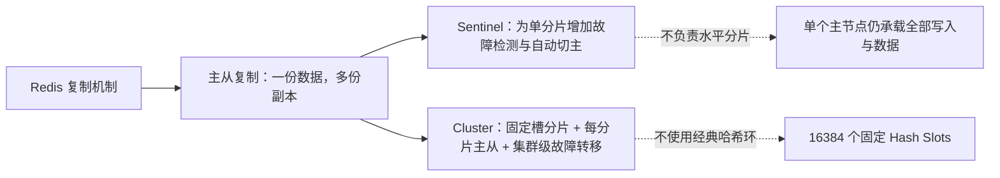
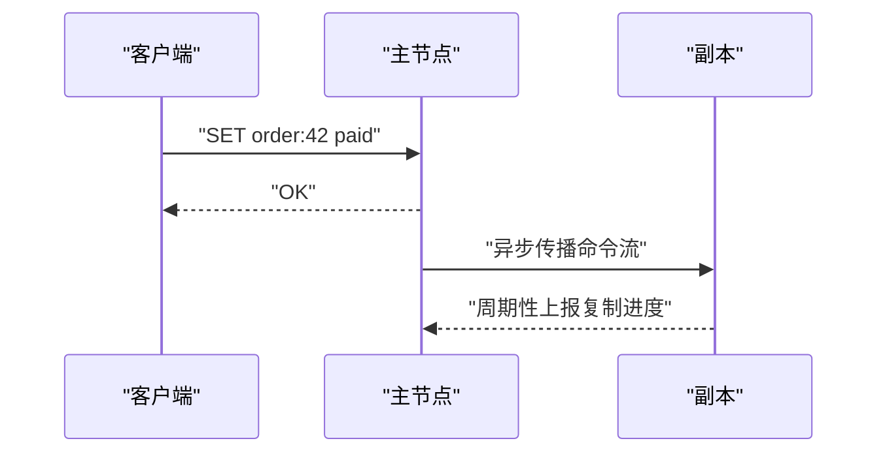
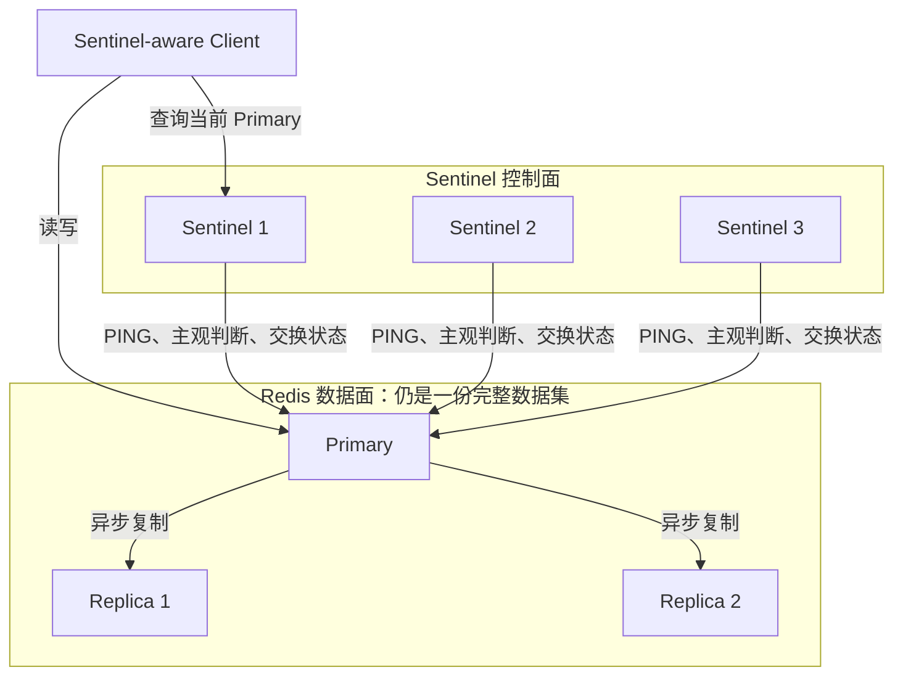
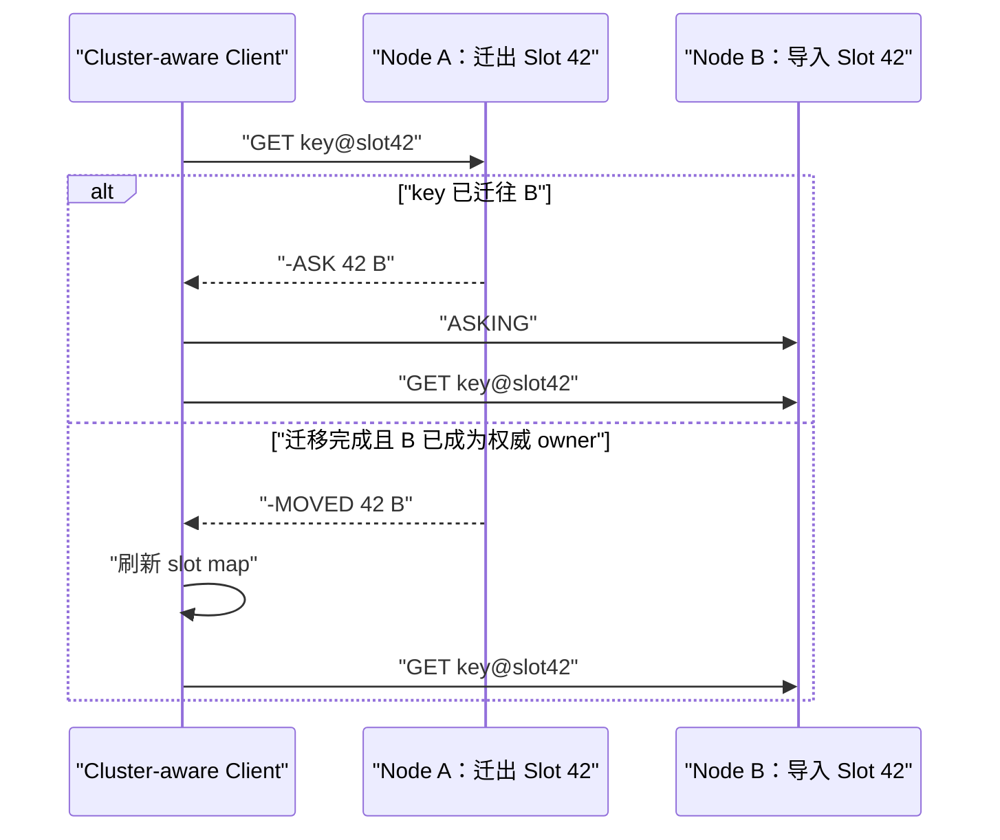
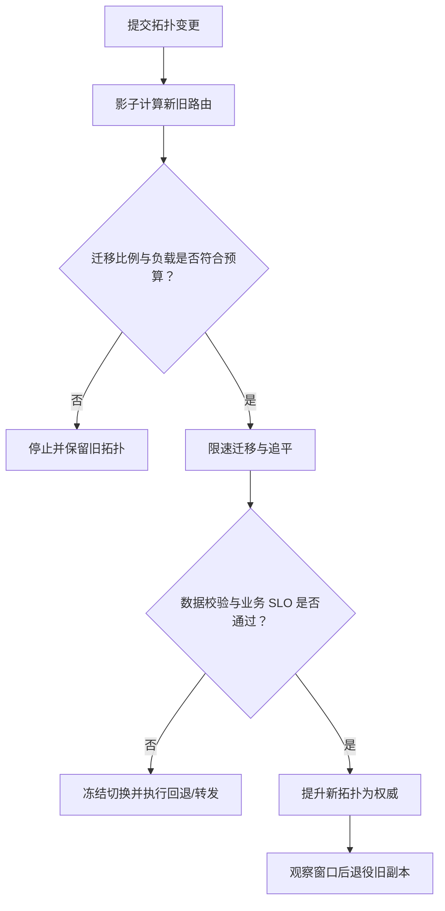

# 一致性哈希：设计理念、算法机制与工程最佳实践

> [!abstract] 一句话理解
> 一致性哈希（Consistent Hashing）不是为了让哈希结果“永远不变”，而是为了让**成员集合变化时，映射关系只发生局部、可控的变化**。它把“扩缩容导致全局洗牌”的问题，转化为“少量对象迁移”的问题。

> [!info] 阅读范围与结论边界
> 本文以经典哈希环为主线，同时比较 HRW、Jump、Maglev、AnchorHash 与固定槽位，并以 Redis 主从复制、Sentinel 和 Cluster 说明“复制、自动故障转移、数据分片”三类职责为何必须分开。文中的稳定原理和算法性质主要依据原始论文；Redis 产品机制依据截至 2026-07-23 的官方文档；迁移状态机、监控清单与处置建议属于跨系统工程综合，不能替代具体产品版本的官方操作手册。本文回答的是“如何稳定地决定 owner”，并专门说明路由、复制、数据一致性和故障恢复如何协作，但不把它们混为同一问题。

关联日报：[[work-docs/daily-reports/2026-07-17|2026-07-17 每日算法知识点]]

## 1. 它真正解决的是什么问题

设有 $n$ 个缓存节点，最直接的分片方式是：

$$
node = hash(key) \bmod n
$$

只要 $n$ 不变，这种方式简单、均匀、查询快。但节点从 3 台变为 4 台后，大多数 key 的余数都会变化。理论上只有约 $1/4$ 的 key 仍留在原节点，约 $3/4$ 需要重新映射。缓存系统会因此出现：

- 大面积缓存失效，引发缓存击穿或回源风暴；
- 数据搬迁量骤增，网络与磁盘负载抬升；
- 扩容本来是为了缓解压力，却在切换瞬间制造更大压力。

现代分片系统常强调**成员变化时映射函数的稳定性**；但 Karger 等人的原始定义不只讨论扩缩容，还研究多个客户端持有不同节点视图时，系统能否继续保持均衡并限制对象副本扩散。

> [!important] 设计目标
> 单调性（Monotonicity）要求新增 bucket 时，对象不能在两个既有 bucket 之间无故跳转，只能留在原 bucket 或转移到新增 bucket。在均匀映射假设下，它导向最小必要迁移；现代论文常用最小扰动（Minimal Disruption）描述相近但更直接的优化目标。二者密切相关，但不应无条件视为同义词。

## 2. 设计哲学：把“节点编号”升级为“稳定坐标”

普通取模哈希把节点身份隐含在不断变化的数组下标中。节点数变化，坐标系本身也变化。

一致性哈希则建立一个稳定的哈希空间，常画成首尾相连的环：

```text
                       0 / 2^m
                          ▲
                          │
                 Node A  ●│         ● Key x
                       ╱  │        ╱
                     ╱    │      ╱ 顺时针寻找
                   ╱      │    ▼
            Key z ●       │  ● Node B
                   ╲      │
                     ╲    │
                 Node C ●─┘
```

算法分为三步：

1. 对物理节点标识做哈希，把节点放入 $[0, 2^m)$；
2. 对 key 做相同哈希，把 key 放入同一空间；
3. 从 key 的位置顺时针寻找第一个节点；越过末端则回到起点。

其本质并不是“圆环”，而是：

> **在一个稳定、有序、可循环的坐标空间中，为每个 key 选择后继节点（Successor）。**

圆环只是把边界回绕表达得更直观。经典环实现通常使用排序数组、平衡树或跳表保存节点坐标，再做 `ceiling` / 二分查找；现代替代方案可能根本不保存环：HRW 遍历成员打分，Jump 根据 bucket 数递推，Maglev 查表，AnchorHash 则保存成员变化历史。

### 2.1 从“哈希环”回到 1997 年的理论定义

Karger 等人研究的原始场景是大规模 Web 分布式缓存：不同客户端可能看到不同的缓存节点集合，却仍希望避免热点、限制同一对象被缓存到过多节点，并在节点变化时减少无谓迁移。其抽象不是“先画一个圆”，而是一个依赖节点视图的映射族：

$$
f: 2^B \times I \rightarrow B
$$

其中 $B$ 是 bucket 集合，$I$ 是对象集合，$2^B$ 表示客户端当前看到的 bucket 子集。也就是说，**节点视图本身就是映射函数的输入**。

论文关注四个核心性质：

| 性质 | 要回答的问题 | 工程意义 |
|---|---|---|
| 均衡（Balance） | 在同一视图中，各 bucket 是否获得近似份额 | 避免容量倾斜 |
| 单调性（Monotonicity） | 新增 bucket 后，对象会不会在旧 bucket 间乱跳 | 限制无谓迁移 |
| 分散度（Spread） | 不同客户端视图下，同一对象最多映射到多少 bucket | 限制副本扩散 |
| 负载（Load） | 多种视图叠加时，一个 bucket 最多被多少对象选中 | 避免视图不一致制造热点 |

> [!note] “一致性”的完整含义
> 今天的工程文章经常把一致性哈希缩写成“扩缩容只迁移少量 key”。这只覆盖单调性和最小扰动。原论文还把**局部视图不一致**视为一等问题，并通过 spread 与 load 描述其后果。

因此，“哈希环 + 顺时针后继”是满足这些目标的一种空间构造，而不是一致性哈希的全部理论定义。

## 3. 为什么节点变化只影响局部

假设节点顺序为：

```text
A ───────── B ───────── C ───────── (回到 A)
```

新增节点 D，且 D 位于 B 与 C 之间：

```text
A ───────── B ─── D ─── C ───────── (回到 A)
                  ▲
          仅这一段 key 改归 D
```

原来落在 $(B, D]$ 区间的 key 由 C 负责；D 加入后，这一段转由 D 负责。其他区间的归属不变。

删除节点也类似：D 删除后，D 原本负责的区间交给它的顺时针后继 C。于是：

- **单 token 新增节点**：从一个后继节点接管一段数据；
- **使用 vnode 的新增节点**：通常从多个现有物理节点接管多个小区间；
- **删除节点**：把被删除节点负责的区间转交给其后继或由副本策略重新放置；
- **其余对象**：在单调映射中保持原归属。

### 3.1 迁移比例的三种语义

在等权、均匀、对称映射中，从 $n$ 个 bucket 增加到 $n+1$ 个时，新 bucket 对任一 key 的获胜概率为：

$$
\mathbb{E}[moved_{add}] = \Pr[new\ bucket\ wins] = \frac{1}{n+1}
$$

删除一个等权 bucket 时，期望迁移比例等于它原来的份额：

$$
\mathbb{E}[moved_{remove}] = \frac{1}{n}
$$

但必须区分三层承诺：

1. **期望值**：对随机哈希、均匀 key-space 或大量独立 key 而言，平均接近上述比例；
2. **概率保证**：虚拟节点足够多时，实际份额更可能集中在期望值附近，但界限依赖 token 数、独立性和哈希假设；
3. **最坏情况**：单 token 随机环可能存在极大空隙，一个节点负责接近整个空间，因此一次加入或删除的迁移量理论上可接近 100%。

> [!warning] 不要混淆四种“比例”
> hash-space 份额、key 数、数据字节数和 QPS 不是同一个量。即使迁移了约 $1/(n+1)$ 的 key，也可能迁移远高于该比例的字节或热点流量。

### 3.2 用最小例子检验“局部变化”

假设环上只有三个 token，位置依次为 `A@10`、`B@40`、`C@80`，哈希空间为 `[0, 100)`：

```text
区间 (80,10] → A
区间 (10,40] → B
区间 (40,80] → C
```

现在加入 `D@60`：

```text
变化前：(40,80] ───────────────→ C
变化后：(40,60] → D    (60,80] → C
```

只有 `(40,60]` 内的 key 从 C 迁移到 D；A、B 的区间以及 C 保留的 `(60,80]` 都不变。这个例子揭示了经典后继映射的三个核心不变量：

1. **确定性（Determinism）**：相同拓扑版本、相同哈希协议与相同 key 必须得到相同 owner；
2. **单调性（Monotonicity）**：加入 D 后，发生变化的 key 只能迁往 D，不能在 A、B、C 之间重新洗牌；
3. **完整覆盖（Total Coverage）**：非空环中的每个哈希位置都必须有且仅有一个主 owner，末端通过回绕归属第一个 token。

删除节点时还需要一个对称性质：只有被删节点原先负责的 key 可以改变主 owner。若实现观察到其他区间也变化，应优先检查哈希协议、token 排序、碰撞规则或拓扑版本是否不一致，而不是把它归因于“一致性哈希本来就是概率算法”。概率性影响的是区间大小与负载均衡，不影响给定环上的确定性路由。

> [!question] 类比何时失效？
> “环上切蛋糕”能解释区间归属，却无法表达副本、容量权重、热点 key、局部拓扑视图和数据尚未迁完等系统状态。进入生产设计时，必须回到 token、epoch、owner、replica 与迁移状态机这些真实对象。

## 4. 经典方案的软肋：最小迁移不等于负载均衡

只有一个坐标的物理节点，可能在环上分布得很不均匀：

```text
A ●─很短─● B ─────────────── 很长区间 ───────────────● C
```

负责长区间的节点会承接更多 key。即使哈希函数均匀，少量节点位置也可能产生较大方差。

这揭示了两个彼此独立的目标：

| 目标 | 含义 | 经典环是否天然满足 |
|---|---|---|
| 最小扰动 | 节点变化时少迁移 | 是 |
| 负载均衡 | 各物理节点负载接近 | 节点少时不一定 |

### 4.1 虚拟节点（Virtual Nodes）

解决办法是让一个物理节点在环上拥有多个虚拟位置：

```text
物理节点 A → A#1, A#2, A#3, ...
物理节点 B → B#1, B#2, B#3, ...
物理节点 C → C#1, C#2, C#3, ...
```

不同物理节点的虚拟节点交错分布。每台机器负责许多小区间，局部偏差更容易相互抵消。

虚拟节点同时带来三项价值：

1. **降低数据倾斜**：大区间被拆成许多小区间；
2. **平滑迁移**：节点加入时从多台机器各接管少量数据，而非集中冲击一台；
3. **支持异构权重**：高配置节点分配更多虚拟节点，低配置节点分配更少。

但虚拟节点不是越多越好：更多 token 会增加元数据、路由表、状态传播和重平衡范围任务。Cassandra 的工程经验还显示，token 增多会扩大节点邻接组合、增加 repair 操作数量，并可能让复合故障下的部分 token range 更难保持可用。

Cassandra 1.2 引入 vnode 后，不同版本和 allocator 曾采用不同 token 数策略；后续确定性 token allocator 可以用更少 token 获得更好的均衡。因此不存在脱离版本、复制因子、分配器和集群规模的“100–200 个最佳值”。

同样，token 数只能表达粗粒度静态权重。权重变化会触发数据迁移，而“机器配置高两倍”也不代表它在字节、QPS、磁盘吞吐、压缩和 repair 等维度都拥有两倍容量。数量与权重都应由真实 workload 压测决定。

## 5. 查找与复杂度

若环上共有 $V$ 个虚拟节点：

- 构建或更新有序结构：通常为 $O(\log V)$；
- key 路由：二分查找为 $O(\log V)$；
- 排序数组查询常数小，但增删需要复制或重建；
- 平衡树增删灵活，但对象和指针开销更高。

一个简化的 Java 路由骨架如下：

```java
final class ConsistentHashRing<N> {
    private final NavigableMap<Long, N> ring = new TreeMap<>();

    N locate(String key) {
        if (ring.isEmpty()) {
            throw new IllegalStateException("hash ring is empty");
        }
        long hash = hash64(key);
        Map.Entry<Long, N> entry = ring.ceilingEntry(hash);
        return entry != null ? entry.getValue() : ring.firstEntry().getValue();
    }
}
```

生产实现还必须明确：哈希函数、无符号整数语义、碰撞处理、节点身份、权重、拓扑版本，以及所有客户端是否构造出完全相同的环。

## 6. “一致性”不是数据一致性

一致性哈希中的“一致性”，指映射在拓扑变化前后的稳定程度；它不直接提供：

- 强一致性（Strong Consistency）；
- 副本一致性；
- 故障检测；
- 数据复制与修复；
- 事务与共识。


一致性哈希只回答“**这个 key 应该由谁负责**”。“数据是否已经到位”“读写冲突如何解决”属于复制协议、迁移协议和一致性模型的职责。

## 7. 工程中的关键边界

### 7.1 节点变化必须版本化

如果不同客户端在不同时间看到不同成员列表，它们会构造出不同的环，同一个 key 就可能被路由到不同节点。应为拓扑配置增加单调递增版本，并保证：

- 先发布新拓扑和迁移计划；
- 迁移期间支持双读、双写或代理转发；
- 数据就绪后再切换权威路由；
- 旧拓扑有明确退役条件。

### 7.2 节点身份必须稳定

不要直接把临时 IP 当节点唯一身份。容器重启、IP 漂移会让同一物理角色获得新坐标。优先使用稳定的逻辑节点 ID，并把网络地址作为可更新属性。

### 7.3 哈希函数重在稳定和分布

路由哈希通常不要求密码学抗攻击，但要求：

- 跨语言、跨版本结果一致；
- 分布均匀，雪崩效应良好；
- 计算成本可接受；
- 对不可信输入需评估哈希洪泛攻击。

一旦上线，修改哈希函数等价于重画整个环，通常会造成近全量迁移，因此它属于路由协议的一部分。除算法名外，还应版本化 `seed`、字符串编码、字节序、无符号比较、节点 ID 规范化和碰撞规则。

跨语言实现应维护一组 golden vectors：给定节点列表与 key，所有客户端必须得到完全一致的 hash、token 和 owner。升级哈希函数时可采用双版本影子计算、分批 bucket 切换或固定 slot 间接层，而不是直接替换。

面对不可信 key，还需考虑攻击者利用公开 seed 定向制造热点。秘密 seed 可提高对抗难度，但 seed 轮换也会重映射数据，必须纳入迁移协议。

### 7.4 热点 key 不是一致性哈希能解决的

即使 key 数量均匀，一个超级热点 key 仍会压垮单个节点。常见补救包括：

- 热点 key 多副本；
- 请求合并与本地缓存；
- key 拆分或二级分片；
- 限流、隔离和热点探测。

一致性哈希改善的是**容量分布**，不自动改善**访问频率分布**。

### 7.5 副本放置要理解故障域

简单地沿环顺时针选后续 $R-1$ 个节点可以形成副本，但若这些节点位于同一机架或可用区，副本数并不等于容灾能力。副本选择还应感知：

- Region / Availability Zone；
- 机架、交换机与电源故障域；
- 节点容量和健康状态。

同一物理节点上的多个 vnode 不能被误算为多个副本。主节点路由（Primary Routing）与副本放置（Replica Placement）是两个不同问题，应由独立的复制策略显式约束。

### 7.6 拓扑变更是一项数据协议

“重建哈希环”只改变目标归属，不代表目标节点已经拥有完整数据。权威存储的安全迁移通常需要版本化状态机：


1. **Prepare**：创建不可变拓扑版本 $E+1$，旧版本 $E$ 暂时仍是权威；
2. **Bootstrap**：目标节点接收快照，并记录迁移期间的增量；
3. **Catch-up**：通过 WAL、CDC 或增量流追平 watermark；
4. **Dual-route**：按数据模型选择双写、旧主写后转发、读旧失败后读新，或新旧双读；
5. **Fence**：用 epoch、lease 或配置版本拒绝旧 owner 的过期写入；
6. **Validate**：比对 key 数、字节数、checksum、Merkle tree 或最大落后量；
7. **Retire**：等待旧客户端和回滚窗口结束，再删除旧副本。

> [!danger] 双写不是免费保险
> 没有幂等键、版本号、失败补偿和冲突裁决的双写，可能把迁移演变为双主分叉。缓存允许 miss 时，完整迁移协议也可能得不偿失，应依据数据权威性选择复杂度。

## 8. 不要把所有分片方案都叫一致性哈希

> [!warning] 常见误区
> “Redis Cluster 使用经典一致性哈希环”并不准确。Redis Cluster 使用固定的 16384 个哈希槽（Hash Slots），由集群显式分配和迁移槽位。它与一致性哈希追求相似的扩缩容目标，但机制不同。

### 8.1 真实产品的机制谱系

| 系统 | 实际机制 | 关键边界 |
|---|---|---|
| Amazon Dynamo（论文） | 经典环、多个 token/vnode；后续评估固定等分 partition 与 placement 解耦 | 生产经验本身体现了从随机环向可运维间接层演进 |
| Apache Cassandra | Dynamo-style token ring、vnode/token allocator、独立 replication strategy | vnode 数与分配器依版本不同；副本并非简单取后续 $R-1$ 个 token |
| Redis Cluster | 16384 个固定 Hash Slots，显式迁移 slot | 使用 `MIGRATING` / `IMPORTING`、`ASK` / `MOVED`、`configEpoch` 管理切换 |
| Memcached | 服务端通常没有统一分片控制面；Ketama 等由客户端实现 | 跨语言客户端必须统一节点命名、权重、哈希、字节序和失败剔除规则 |

Dynamo 与 Cassandra 属于 token-ring 家族，但也不能描述成完全相同：Dynamo 论文讨论 vector clock 与应用级冲突处理，Cassandra 则形成了自己的时间戳、replication strategy、repair 和 token allocator 体系。

### 8.2 Redis 三种部署架构：主从、Sentinel 与 Cluster

Redis 的三种常见拓扑不是三个可以随意替换的“高可用版本”，而是沿着两个彼此独立的轴逐步增加能力：

1. **数据是否分片**：一份完整数据集，还是拆到多个分片；
2. **故障后是否自动重配置**：只复制数据，还是自动选主并更新客户端路由。



> [!important] 最小心智模型
> **主从复制是数据面，Sentinel 是单分片的高可用控制面，Cluster 则把分片路由、复制与故障转移组合成分布式数据系统。** Sentinel 不会把数据拆开；Cluster 也不是“Sentinel 再加几个主节点”，它有独立的槽位、集群总线、配置纪元与客户端重定向协议。

#### 8.2.1 主从复制：解决副本问题，不自动解决选主问题

基础主从架构由一个主节点（Primary）和一个或多个副本（Replica）组成。客户端通常向主节点写入；主节点把修改数据集的命令流发送给副本。链路中断后，副本优先尝试部分重同步；若复制历史不再可接续，则执行全量重同步。



这条时序最重要的事实是：默认情况下，`OK` 与“副本已经收到写入”不是同一个完成点。Redis 默认采用**异步复制（Asynchronous Replication）**，因此主节点可能在写入尚未到达副本时宕机。客户端可用 `WAIT` 降低这类丢写概率，但官方明确指出：`WAIT` 只证明指定数量的副本确认了复制进度，不能把 Redis 变成具有强一致性的 CP 系统。

Redis 用 `(replication ID, offset)` 标识一条数据历史及其进度：

- **部分重同步（Partial Resynchronization）**：副本携带旧 replication ID 与 offset 发起 `PSYNC`；主节点的复制 backlog 仍覆盖缺口时，只补发缺失命令；
- **全量重同步（Full Resynchronization）**：历史不匹配或 backlog 不足时，主节点生成并传输 RDB 快照，再发送快照期间积累的命令流；
- **故障转移后的历史衔接**：被提升的副本会保留旧历史的 secondary replication ID，从而让其他副本在条件满足时继续部分同步。

主从复制的核心不变量是：**同一 replication ID 下，offset 越大的实例包含越长的同一复制历史前缀。** 它能支持读扩展和数据冗余，却没有分布式故障检测、领导者选举与客户端服务发现。主节点失效后，由谁提升副本、如何阻止旧主继续写、客户端如何找到新主，都需要外部编排或人工操作。

> [!danger] “有副本”不等于“有自动高可用”
> 纯主从拓扑中，自动把副本提升为主节点通常依赖运维平台、自研控制器或人工流程。若多个控制者在网络分区两侧各自提升节点，就可能产生双主与两条数据历史。复制机制本身不会替你完成唯一选主。

还要警惕一个常见灾难链：主节点关闭持久化且进程自动重启，宕机后以空数据集启动；副本重新跟随这个空主节点后，也可能被同步为空。数据安全重要时，不能把“副本里还有数据”当作持久化与恢复策略的替代品。

#### 8.2.2 Sentinel：给单分片增加一个分布式控制面

Redis Sentinel 用于**非 Cluster 模式**的高可用。它监控一组主从实例，提供通知、自动故障转移和当前主节点发现。典型部署至少放置 3 个、跨独立故障域的 Sentinel 进程；客户端也必须显式支持 Sentinel，才能在主节点变化后查询并连接新地址。



一次自动故障转移可分解为五步：

1. **SDOWN（Subjectively Down）**：单个 Sentinel 在 `down-after-milliseconds` 内无法得到有效响应，只能得出自己的主观判断；
2. **ODOWN（Objectively Down）**：达到该 master 配置的 `quorum` 数量后，Sentinel 们共同认为主节点客观下线；
3. **授权领导者**：准备执行 failover 的 Sentinel 必须获得 Sentinel 进程的多数授权；
4. **选择并提升副本**：领导者根据优先级、复制进度等条件选择副本，发送 `REPLICAOF NO ONE`；
5. **重配置与收敛**：其他副本改为跟随新主，Sentinel 用更高的配置纪元传播新配置，客户端通过 Sentinel 获知新主地址。

> [!warning] `quorum` 不等于“执行 failover 所需票数”
> `quorum` 主要决定多少 Sentinel 同意后进入 ODOWN；真正执行故障转移还需要多数 Sentinel 授权。假设有 5 个 Sentinel、`quorum=2`：两个 Sentinel 可以触发 ODOWN，但至少需要 3 个可通信 Sentinel 才能授权执行 failover。把 `quorum` 设成 2，不代表两票就能完成切主。

Sentinel 解决的是**谁是当前主节点**，不是“如何分配 key”。所有 key 仍位于同一个逻辑数据集，写容量与内存上限仍受单个主节点约束。它与一致性哈希没有直接关系：故障转移改变的是整份数据集的主角色，不是局部 key 的 owner。

网络分区下，Sentinel 的配置最终会向更高纪元收敛，但旧主可能在被隔离期间继续接收旧客户端写入；分区恢复后，旧主被重配置为新主的副本，这些分叉写入可能丢失。`min-replicas-to-write` 与 `min-replicas-max-lag` 可以限制旧主在失去足够健康副本后继续写入的时间窗口，但仍不是强一致性协议。

#### 8.2.3 Redis Cluster：固定槽位把 key 与物理节点解耦

当单个主节点的内存或写吞吐成为上限时，才进入 Redis Cluster 的问题域。Cluster 将 key-space 固定划分为 16384 个哈希槽，映射公式为 $slot = CRC16(key) \bmod 16384$。

若 key 含有效的 hash tag，例如 `user:{42}:profile`，则只对花括号中的内容计算槽位，使相关 key 落入同一 slot。Cluster 中每个主节点负责一组槽；每个主节点还可有副本，以支持该分片的故障转移。

```text
Key ──CRC16 % 16384──▶ Slot ──slot map──▶ Primary ──async replication──▶ Replica
                         │
                         └── 扩缩容时移动的是 slot 内的 key，而不是重画哈希环
```

这正是固定间接层的价值：节点从 3 个扩到 4 个时，`key → slot` 规则不变，只需显式把一部分 slot 从旧节点迁移到新节点。运维系统可以决定迁移哪些槽、迁移速率以及目标容量，而不是接受随机 token 位置带来的份额方差。

Cluster 节点通过 **Cluster Bus** 全互连，使用 gossip 传播节点状态、槽位归属、故障信息与配置更新。客户端请求打到错误节点时：

- `MOVED`：该 slot 的权威归属已经改变；客户端应访问新节点并刷新本地 slot map；
- `ASK`：slot 正在迁移，请求中的这个 key 可能暂时在目标节点；客户端只对下一次请求发送 `ASKING`，不应把整个槽位永久改绑；
- `MIGRATING` / `IMPORTING`：分别描述源节点和目标节点上的槽迁移状态。



Cluster 的故障转移也不同于 Sentinel。副本需要由**多数主节点**授权选举，获胜后取得新的 `configEpoch`，接管旧主的 slots 并广播新配置。对于同一 slot，传播规则最终选择具有更高 `configEpoch` 的 owner，即官方所称的 **last failover wins**。这解决的是拓扑配置收敛，不代表业务数据执行冲突合并。

Cluster 同样使用异步复制，因此仍可能丢失已确认写入：主节点回复客户端后、写入到达副本前宕机就是最小反例。少数派分区中的主节点在超过 `cluster-node-timeout` 且无法感知多数主节点后会停止接受写入，从而限制分叉窗口，但 Cluster 仍不提供强一致性。`WAIT` 可以降低风险，不能消除所有故障场景。

#### 8.2.4 为什么 Cluster 不使用经典一致性哈希环

两者都在 key 与机器之间引入间接映射，但控制权不同：

| 维度 | 经典 Ring + vnode | Redis Cluster 固定 slots |
|---|---|---|
| 中间层 | 随机 token / 区间 | 固定 16384 slots |
| 节点变化 | 根据 token 位置自动改变局部 owner | 运维或重分片工具显式迁移 slots |
| 迁移比例 | 理想模型下接近最小扰动，实际受 token 分布影响 | 由迁移计划精确选择槽位，但槽内 key/字节/QPS可能不均 |
| 路由状态 | 客户端构造或获取 token ring | 客户端缓存 slot → node map |
| 过渡协议 | 由具体系统另外定义 | `MIGRATING` / `IMPORTING` + `ASK` / `MOVED` |
| 权重表达 | vnode/token 数近似表达 | 显式分配更多或更少 slots |
| 多 key 操作 | 取决于实现 | 通常要求同 slot，可用 hash tag 共置 |

Cluster 选择固定槽，是用**显式可运维性**换取对重分片过程的控制。它避免节点增删时改变 `key → slot`，却没有消灭数据搬迁；移动一个 slot 仍要搬走其中所有 key。若少数 slot 包含大 key 或热点，槽位数量均匀也不等于字节与 QPS 均匀。

#### 8.2.5 三种架构的能力与故障边界

| 维度 | 主从复制 | Sentinel + 主从 | Redis Cluster |
|---|---|---|---|
| 数据分片 | 否 | 否 | 是，16384 slots |
| 写扩展 | 单主上限 | 单主上限 | 多分片主节点水平扩展 |
| 读扩展 | 可读副本，但可能陈旧 | 可读副本，但可能陈旧 | 每个分片可读副本，但可能陈旧 |
| 自动故障转移 | 不内建 | 是，Sentinel 协调 | 是，Cluster 内部选举 |
| 客户端要求 | 知道主地址 | 必须支持 Sentinel 服务发现 | 必须理解 slot map 与重定向 |
| 控制面 | 人工/外部编排 | 独立 Sentinel 进程 | Cluster Bus + 各节点内建状态 |
| 数据一致性 | 默认异步复制 | 默认异步复制 | 默认异步复制 |
| 已确认写丢失 | 可能 | 可能 | 可能 |
| 多 key 操作 | 同一数据集内正常 | 同一数据集内正常 | 通常必须同 slot |
| 主要适用场景 | 读扩展、备份副本、外部平台托管切换 | 数据可放入单主、但要求自动 HA | 数据量或写负载超过单主，需要分片 |

一个实用决策顺序是：

1. **单主能否容纳数据集和峰值写入？** 能，则无需为了“看起来分布式”直接上 Cluster；
2. **是否要求 Redis 自身具备自动故障转移？** 要，则单分片优先考虑 Sentinel 或云平台等价控制面；
3. **是否需要水平扩展写入或内存？** 要，才选择 Cluster，并接受客户端、跨槽操作、重分片与故障域规划的复杂度；
4. **业务能否容忍异步复制窗口内的丢写与陈旧读？** 不能，则必须重新评估 Redis 在该数据路径中的角色，而不是把 `WAIT`、Sentinel 或 Cluster 误当作强一致性承诺。

> [!tip] 迁移题
> 一个 600 GB 数据集单机放不下，即使部署 5 个副本，为什么仍然无解？因为副本复制的是完整数据集，只增加副本数量，不会把 600 GB 拆开。此时需要的是 Cluster 分片。反过来，若数据只有 20 GB、瓶颈是主节点宕机后的人工切换，Cluster 会引入不必要的跨槽与运维复杂度，Sentinel 更贴合问题。

### 8.3 现代映射算法决策矩阵

| 方案 | 任意加入/删除 | 查询成本 | 路由状态 | 最小扰动 | 权重 | 更适合 |
|---|---:|---:|---:|---:|---:|---|
| Ring + vnode | 是 | $O(\log V)$ | $O(V)$ | 在理想哈希模型下满足 | token 数近似 | 通用缓存、token 存储 |
| HRW / Rendezvous | 是 | 朴素 $O(n)$ | 很低 | 是 | 可支持，但公式须正确 | 中小集群、无状态路由、副本排名 |
| Jump Consistent Hash | 主要支持连续 bucket 末尾增删 | 期望近常数 | $O(1)$ | 在受限模型内满足 | 原生不便 | 固定编号存储 bucket |
| Maglev | 是 | 查表 $O(1)$ | 大查找表 | 非严格，可能额外 remap | 可支持 | 高速 L4 负载均衡 |
| AnchorHash | 是 | 与失效资源比例相关 | $O(n)$ | 是 | 基础论文以等权为主 | 大型动态资源集合 |
| 固定 slots | 显式迁移 | $O(1)$ | slot map | 由迁移计划决定 | 显式分槽 | 强运维控制、可观察迁移 |

#### HRW / Rendezvous Hashing

对每个 key，给所有节点计算确定性得分并选择最高者：

$$
owner(k)=\arg\max_{s\in S} H(k,s)
$$

新增节点时，只有新节点得分超过旧 winner 的 key 改变；删除节点时，只有原 winner 是被删节点的 key 改变。它不需要维护环，而且天然能得到完整候选节点排名，适合副本选择。代价是朴素查询需要遍历节点。加权 HRW 必须使用经过证明的概率变换，不能简单把哈希值乘以权重。

#### Jump Consistent Hash

Jump 使用 bucket 数递推映射，不需要路由表，常数额外内存且查询极快。但 bucket 必须连续编号，主要自然支持末尾增加 bucket 或删除最后一个 bucket，不适合直接表达任意服务实例上下线与复杂权重。

#### Maglev

Maglev 为每个 backend 生成查找表 permutation，再轮流填充空位。数据平面只需一次数组访问，表项也近乎完美均衡；但 backend 变化时需要重建表，并可能产生超出最小必要集合的 remap。它更看重高速查询和负载均衡，而不是严格最小扰动。

#### AnchorHash

AnchorHash 用成员变化历史和 $O(n)$ 状态支持任意加入、删除，同时追求 balance 与 minimal disruption。代价是路由方必须共享一致的变更顺序和状态恢复语义；它不是完全无状态函数。

选型时不要先问“能不能上哈希环”，而应先问：

1. 成员是否频繁变化？
2. 是否必须控制迁移顺序和速率？
3. 节点是否异构？
4. 客户端是否能一致地获得拓扑？
5. 是否需要机架感知、副本和范围扫描？
6. 路由状态放在客户端、代理还是中心元数据服务？

## 9. 生产最佳实践清单

- [ ] 使用稳定、跨语言一致的 64 位以上哈希函数；
- [ ] 将哈希算法、seed、节点 ID 和拓扑版本视为协议字段；
- [ ] 用虚拟节点或显式 token 改善负载方差，并通过压测选数量；
- [ ] 异构机器采用权重，但避免权重变化导致瞬时大迁移；
- [ ] 节点加入先预热，节点退出先排空；
- [ ] 限制重平衡并发、带宽和每秒迁移量；
- [ ] 迁移期间设计双读、转发或回退路径；
- [ ] 对空环、单节点、哈希碰撞、环回绕做边界测试；
- [ ] 监控 key 数、字节数、QPS、P99 延迟和热点，而非只看 key 数均匀；
- [ ] 将故障域纳入副本放置；
- [ ] 预演扩容、缩容、宕机、网络分区和旧客户端并存；
- [ ] 明确回滚策略，避免“路由已切换但数据尚未就绪”。

### 9.1 可观测性：监控“结果”而不是只监控环

一个可操作的监控面至少要覆盖四层：

| 层次 | 关键指标 | 主要回答 |
|---|---|---|
| 路由正确性 | topology version 分布、golden-vector 校验失败数、未知节点/空环次数 | 客户端是否在使用同一套映射协议 |
| 分布质量 | 每节点 token 份额、key 数、字节数、QPS、热点 key 占比、负载变异系数 | 哈希空间均匀是否真的转化为业务负载均匀 |
| 迁移进度 | 待迁 key/字节、迁移吞吐、watermark lag、校验差异、重试与失败数 | 新 owner 是否已经具备接管条件 |
| 用户影响 | hit ratio、回源 QPS、P95/P99、错误率、限流/熔断次数 | 拓扑变化是否正在伤害业务 |

建议为每次变更记录基线，并围绕变化量告警，而不是复制一组脱离 workload 的固定阈值。例如：

$
CV = \frac{\sigma(load_1, load_2, \ldots, load_n)}{\mu(load_1, load_2, \ldots, load_n)}
$

变异系数（Coefficient of Variation）可用于比较不同规模集群的相对倾斜，但 `load` 必须分别按 key、字节、QPS、CPU、磁盘吞吐计算；把它们压成一个平均值会掩盖瓶颈。生产门槛应来自容量模型、历史基线和故障演练。

### 9.2 扩缩容的验证与回滚门



图中的关键门不是“环已经生成”，而是**迁移预算、数据就绪和业务 SLO 同时成立**。一个实用的发布前后验证集包括：

1. 离线使用生产 key 分布影子计算新旧 owner，分别统计 key、字节和热点 QPS 的预计迁移比例；
2. 对所有语言客户端运行同一组 golden vectors，验证 hash、token、回绕和碰撞结果；
3. 故障注入旧客户端、延迟拓扑、目标节点追平失败与迁移中宕机；
4. 切换前验证 watermark、checksum/Merkle 差异与副本故障域；
5. 切换后持续比较新旧路由分歧、回源流量、尾延迟与错误预算；
6. 回滚时优先恢复权威路由与写入 fencing，再处理多余副本，避免旧 owner 接受过期写入。

> [!warning] 缓存与权威存储的验收不同
> 缓存可以接受受控 miss 和渐进预热，回滚重点是保护回源；权威存储必须证明数据完整、写入有序且旧 owner 已被 fencing。不能把缓存扩容经验直接套用到持久化分片。

## 10. 从算法走向系统设计的三层奥义

### 第一层：稳定的间接层

一致性哈希没有直接把 key 绑定到机器，而是在两者之间引入稳定哈希空间。系统设计中，**间接层（Indirection）**常用来隔离变化：虚拟内存、DNS、服务发现、哈希槽都遵循类似哲学。

### 第二层：把全局变化局部化

优秀的分布式设计不是消灭变化，而是限制变化的爆炸半径。节点变化不可避免，一致性哈希的价值是让影响从 $O(K)$ 级全量重映射，收敛到期望约 $O(K/n)$ 的局部迁移。

### 第三层：概率保证必须由工程机制兜底

环和虚拟节点提供的是统计意义上的均衡，不是确定性容量承诺。真实系统还需要权重、迁移限速、热点治理、拓扑版本、故障域和可观测性。

> [!tip] 最终心法
> 一致性哈希最值得学习的，不是“画一个环”，而是三条系统设计原则：**用稳定坐标隔离变化、用最小扰动限制爆炸半径、用工程控制补足概率算法的边界。**

## 11. 思考题

1. 3 个节点新增第 4 个节点时，为什么迁移比例的期望值是 $1/4$，但单次实际结果可能远大于 $1/4$？
2. 虚拟节点增加到无限多是否一定更好？元数据与重平衡成本如何变化？
3. 为什么“一致性哈希路由正确”仍可能在扩容时读到旧数据？
4. 对节点数较少、节点编号连续且不需要权重的系统，Jump Consistent Hash 为什么可能比哈希环更合适？
5. 如果两个客户端看到的拓扑版本不同，应由谁保证请求不会写入错误节点？

## 12. 结语

一致性哈希诞生于大规模分布式缓存问题，却留下了一种更普遍的设计思维：**当系统组成不断变化时，不要让变化穿透整个系统；建立稳定的中间坐标，把重配置限制在局部。**

真正成熟的实现，不只关注路由公式，还要把成员管理、数据迁移、拓扑版本、副本放置、热点治理和可观测性组成完整闭环。算法给出稳定性的起点，工程系统才决定它能否安全落地。

## 参考资料与证据边界

### 原始论文

1. Karger et al., [*Consistent Hashing and Random Trees: Distributed Caching Protocols for Relieving Hot Spots on the World Wide Web*](https://courses.cs.duke.edu/fall24/compsci512/internal/readings/ConsistentHashing.pdf), STOC 1997。原始目标及 balance、monotonicity、spread、load 的主要依据。
2. DeCandia et al., [*Dynamo: Amazon’s Highly Available Key-value Store*](https://www.allthingsdistributed.com/files/amazon-dynamo-sosp2007.pdf), SOSP 2007。Dynamo token ring、vnode、固定 partition 与 placement 演进依据。
3. Thaler and Ravishankar, [*Using Name-Based Mappings to Increase Hit Rates*](https://www.microsoft.com/en-us/research/wp-content/uploads/2017/02/HRW98.pdf)。HRW / Rendezvous Hashing 依据。
4. Lamping and Veach, [*A Fast, Minimal Memory, Consistent Hash Algorithm*](https://arxiv.org/abs/1406.2294)。Jump Consistent Hash 依据。
5. Eisenbud et al., [*Maglev: A Fast and Reliable Software Network Load Balancer*](https://www.usenix.org/sites/default/files/nsdi16-paper-eisenbud.pdf), NSDI 2016。Maglev 查找表、均衡与 remap 取舍依据。
6. Mendelson et al., [*AnchorHash: A Scalable Consistent Hash*](https://arxiv.org/abs/1812.09674)。AnchorHash 任意成员变更、状态与最小扰动依据。

### 官方与工程文档

7. [Apache Cassandra Documentation — Dynamo](https://cassandra.apache.org/doc/latest/cassandra/architecture/dynamo.html)。Cassandra token ring、vnode、复制策略和历史演进；当前页面可能带 prerelease 标记，默认参数须按具体版本核验。
8. [Redis Cluster Specification](https://redis.io/docs/latest/operate/oss_and_stack/reference/cluster-spec/)。16384 slots、Cluster Bus、`MIGRATING` / `IMPORTING`、`ASK` / `MOVED`、故障选举与 `configEpoch` 机制依据。
9. [Redis Replication](https://redis.io/docs/latest/operate/oss_and_stack/management/replication/)。异步命令流、`PSYNC`、replication ID/offset、部分与全量重同步、`WAIT` 一致性边界依据。
10. [High Availability with Redis Sentinel](https://redis.io/docs/latest/operate/oss_and_stack/management/sentinel/)。SDOWN/ODOWN、quorum 与多数授权、配置纪元、客户端服务发现和网络分区边界依据。
11. [Scale with Redis Cluster](https://redis.io/docs/latest/operate/oss_and_stack/management/scaling/)。固定槽分片、主从拓扑、扩缩容、跨槽操作与一致性保证的操作视角依据。
12. [Sentinel Client Specification](https://redis.io/docs/latest/develop/reference/sentinel-clients/)。客户端发现当前主节点及故障转移后的重连接口依据。
13. [libmemcached-awesome Behaviors](https://awesomized.github.io/libmemcached/libmemcached/memcached_behavior.html) 与 [libketama 工程说明](https://www.metabrew.com/article/libketama-consistent-hashing-algo-memcached-clients)。Memcached 客户端 Ketama 路由依据。

### 边界说明

- 原一致性哈希证据检索日期为 2026-07-20；Redis 主从、Sentinel 与 Cluster 扩展于 2026-07-23 复核，优先使用 Redis 官方复制文档、Sentinel 文档、Cluster specification 与 scaling 指南。
- Redis 官方当前文档持续更新；本文不绑定一个未经核验的具体 Redis 次版本。部署前仍需按实际版本检查配置项、命令行为、客户端兼容性与发布说明。
- 迁移状态机、fencing、安全指标和可观测性清单是基于多个系统机制形成的专家工程综合，不代表 Dynamo、Cassandra、Redis 使用完全相同的状态名称或协议。
- Cassandra vnode 数、allocator、复制策略等配置随版本演进，本文刻意不提供无版本限定的固定推荐值。
- Memcached 客户端生态分散，Ketama 并非所有语言客户端的统一标准；落地前必须使用 golden vectors 验证跨客户端兼容性。
