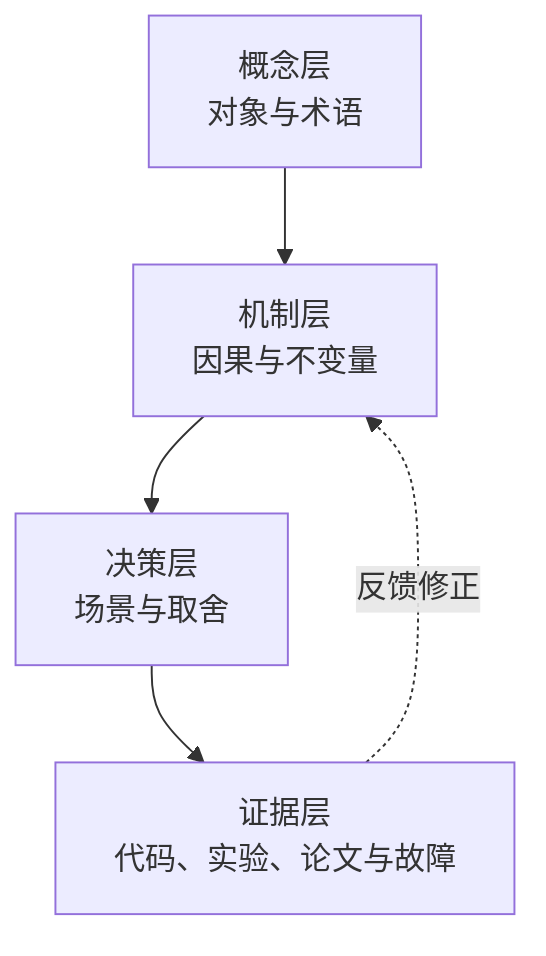
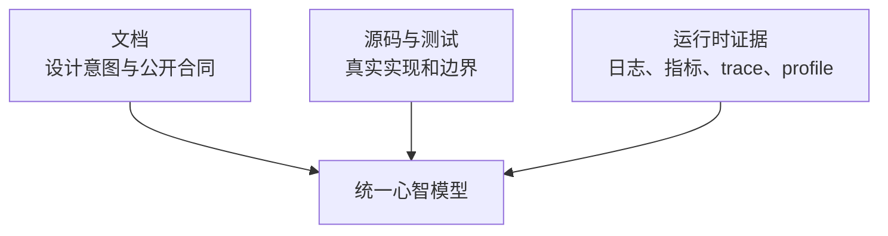
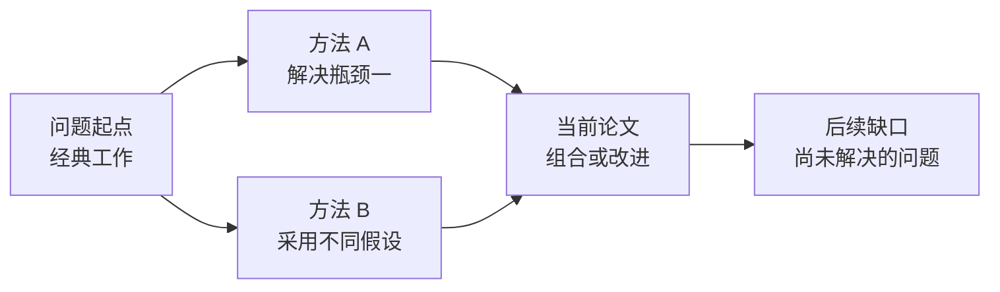
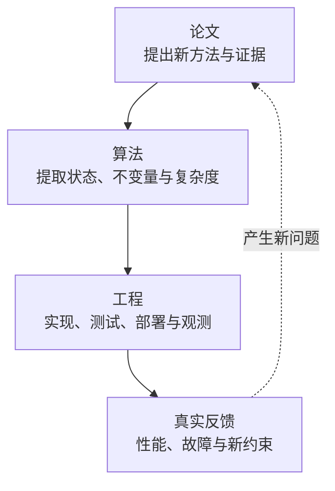

# 从会看到会用：软件工程、算法与论文的深度学习方法论

> [!abstract] 核心结论
> 真正的技术学习，不是把更多内容搬进笔记，而是建立一个能**解释、预测、决策、实现和纠错**的心智模型。软件工程、算法和论文的对象不同，但都可以通过同一个闭环掌握：**问题定向 → 主动建模 → 提取练习 → 真实产出 → 快速反馈 → 间隔复习 → 跨场景迁移**。

> [!info] 如何阅读本文：先看证据等级
> 本文把结论分为三层：
> - **A级：较稳健**——来自综述、元分析、多项课堂实验或当前官方标准，例如提取练习、间隔练习，以及 ACM 对复现术语的定义；
> - **B级：有条件支持**——来自单项随机试验、特定课程或领域研究，例如算法并排比较、Parsons 题、特定 AI tutor；
> - **C级：实践启发**——基于工程经验、教学设计或本文综合推导，例如 90 分钟学习单元、12 周路线和具体复习日期。
>
> 证据等级不是“真/假”标签，而是在提醒：结论能外推多远。越接近具体工具、课程和时间表，越需要根据先备知识、任务类型与反馈质量做本地校准。

## 1. 为什么“看懂了”经常等于“还没学会”

阅读时产生的流畅感，很容易被误认为理解。文字熟悉、例子顺畅、代码看起来合理，只能说明我们具有**再认（Recognition）**能力；一旦合上资料，要求独立解释、实现或选型，知识就可能迅速崩塌。

可以把理解分成六层：

| 层级 | 你能做什么 | 自测问题 |
|---|---|---|
| 再认 | 看见概念觉得熟悉 | “这段话我见过吗？” |
| 回忆 | 不看资料说出核心内容 | “我能从空白页写出什么？” |
| 解释 | 用自己的语言说明机制 | “为什么这样设计？” |
| 应用 | 在典型场景中正确使用 | “给我一个问题，我会怎么做？” |
| 辨析 | 识别边界、反例和取舍 | “什么时候不该用？” |
| 迁移 | 在陌生问题中重组知识 | “换一个约束，我还能推导吗？” |

> [!important] 学习完成的判据
> 不应是“读完”“收藏”或“笔记写完”，而应是：离开原材料后，仍能完成一次有约束的输出，并能解释错误来自哪里。

技术学习常见的三个错觉：

1. **熟悉错觉**：重复阅读让材料越来越顺，但没有训练回忆路径；
2. **答案错觉**：看过题解或 AI 回答后觉得“我也能想到”，实际没有经历搜索过程；
3. **笔记错觉**：记录得很完整，却没有形成可执行的判断规则。

## 2. 统一模型：学习是在构造“可运行的内部模型”

知识不是一组孤立事实，而是一台压缩现实的“内部模拟器”。面对新问题时，它至少要回答四类问题：

```text
是什么：对象、术语、组成部分
为什么：动机、约束、因果机制
怎么做：步骤、状态、工具与检查点
何时不用：边界、反例、失败模式与替代方案
```

一个稳定的技术知识单元，可以组织为四层：



- **概念层（Concept）**解决“它是什么”；
- **机制层（Mechanism）**解决“它为什么有效”；
- **决策层（Decision）**解决“何时选择它”；
- **证据层（Evidence）**解决“凭什么相信”。

只学概念，会停留在术语复述；只学操作，会形成脆弱的命令记忆；只看案例，会过拟合到单个场景。深度理解来自四层之间的往返。

## 3. 三个领域：共同闭环，不同重心

| 领域 | 学习对象 | 核心问题 | 最有价值的证据 | 常见陷阱 |
|---|---|---|---|---|
| 软件工程 | 开放系统及其约束 | “在真实环境中为什么这样设计？” | 源码、测试、运行数据、故障 | 把最佳实践当绝对规则 |
| 算法 | 形式化问题与状态变化 | “为什么正确，复杂度从何而来？” | 不变量、证明、反例、测试 | 背模板，不会识别适用条件 |
| 论文 | 主张、证据与研究边界 | “作者证明了什么，没证明什么？” | 实验、方法、假设、消融 | 从摘要直接相信结论 |

三者不是三套互不相干的方法：

- 算法训练提供精确建模、不变量和复杂度意识；
- 论文阅读训练证据审查、假设识别和不确定性表达；
- 软件工程把前两者放进真实约束中，训练取舍、协作和长期维护。

## 4. 总学习闭环：从输入走向迁移


这条链路中最容易被省略的是三步：

- **输入前预测**：迫使大脑暴露已有模型，而不是被材料牵着走；
- **无资料输出**：把“信息可见”切换为“信息可提取”；
- **变式迁移**：验证学到的是结构，而不是例子的表面形态。

### 4.1 一次 90 分钟深度学习单元

| 时间 | 动作 | 产物 |
|---|---|---|
| 0–10 分钟 | 写问题、预测、已知与未知 | 3–5 个待验证问题 |
| 10–35 分钟 | 定向阅读或实验 | 带疑问的最小材料集 |
| 35–55 分钟 | 关闭资料，画图或解释 | 一页心智模型 |
| 55–75 分钟 | 实现、证明、复现或调试 | 可运行/可检查产物 |
| 75–85 分钟 | 对照答案，记录错误原因 | 错误日志 |
| 85–90 分钟 | 生成下次复习任务 | 1 个回忆题 + 1 个变式题 |

关键不在严格遵守分钟数，而在保证每次学习都经历“输入—输出—反馈”。

### 4.2 校准困难，而不是崇拜困难

学习科学中的“必要困难（Desirable Difficulties）”不是“越难越好”。有效困难应当让学习者付出可恢复的认知努力，并通过反馈改善延迟保持或迁移；没有先备知识、毫无反馈、长期卡死或纯粹增加操作摩擦，属于**非生产性困难**。

可以用下面的脚手架状态机校准：


- 新手先用 worked example 和子目标标注降低无关负荷；
- 能解释后逐步淡出提示，避免脚手架永久替代思考；
- 连续成功时增加变式，不只是增加题量；
- 连续失败时回退一级，定位缺失的先备知识或反馈，而不是硬扛。

> [!warning] 熟练度反转
> 对新手有效的详细示例，对熟练者可能成为冗余负担。脚手架应随能力淡出；固定难度和固定教学顺序都不是最佳实践。

## 5. 软件工程：从“知道技术”到“能做可靠决策”

软件工程知识具有开放性：同一个方案在不同规模、团队、延迟目标、失败成本和历史包袱下，结论可能相反。因此学习重点不是收集规则，而是理解规则背后的约束。

### 5.1 用“约束—机制—取舍”读技术

学习一个框架或架构模式时，不先问“怎么配置”，先问：

1. 它在解决什么原始痛点？
2. 不使用它，系统在哪里先失败？
3. 它引入了什么状态、协议或抽象？
4. 它把复杂度从哪里搬到了哪里？
5. 它牺牲了什么：一致性、延迟、吞吐、开发效率还是可运维性？
6. 什么规模下收益大于成本？

例如，学习缓存时，重要的不是记住 `get/set`，而是建立因果链：

```text
读取路径变短
  → 平均延迟下降
  → 产生多份状态
  → 引入失效、一致性与雪崩问题
  → 需要 TTL、版本、回源保护和监控
```

### 5.2 三角验证：文档、源码、运行时

可靠理解应尽量经过三种证据：



- 文档告诉你“承诺什么”；
- 源码和测试告诉你“实际如何实现”；
- 运行数据告诉你“在当前环境中发生了什么”。

只看源码可能迷失在实现细节，只看文档可能忽略版本差异，只看监控可能只能看到症状。三者互相校验，才能减少误判。

### 5.3 以纵向切片学习，而不是横向囤积

与其连续读完“数据库、消息队列、缓存”三门课，不如完成一个小而完整的纵向切片：

```text
需求 → 数据模型 → API → 错误处理 → 测试 → 指标 → 部署 → 故障演练
```

纵向切片会迫使知识发生连接：SQL 设计影响接口语义，接口语义影响重试，重试影响幂等，幂等影响数据约束。连接越真实，记忆越稳固。

### 5.4 把调试当作最高密度的学习活动

高质量调试不是“试到能跑”，而是缩小假设空间：

1. 写出观察到的事实，避免混入解释；
2. 构造最小复现；
3. 列出 2–4 个竞争假设；
4. 为每个假设设计能区分它们的实验；
5. 修复后补回归测试；
6. 记录“为何原心智模型会预测错”。

错误日志应记录**错误机制**，而不仅是正确答案：

```text
现象：分页查询偶发重复
错误假设：ORDER BY created_at 足以稳定排序
缺失约束：created_at 不唯一
修正模型：分页排序必须具有全序，可追加唯一键
迁移问题：其他游标分页是否也依赖非唯一排序？
```

可结合 [[vibe-coding-软件工程师自处之道与基本功]] 继续思考 AI 时代的工程基本功。

### 5.5 用认知学徒制进入真实代码库

只做 greenfield 小项目，容易把软件工程误解为“把功能写出来”。真实工作更多是阅读既有代码、恢复设计意图、在约束下修改，并用测试、版本控制和可观测性降低风险。

可用认知学徒制（Cognitive Apprenticeship）的六步组织学习：

| 阶段 | 导师或材料做什么 | 学习者产物 |
|---|---|---|
| 示范 Modeling | 展示如何导航代码、提出假设和查证 | 专家思考过程的观察记录 |
| 指导 Coaching | 针对当前任务给即时反馈 | 修正后的搜索与调试路径 |
| 脚手架 Scaffolding | 提供入口、测试、局部任务和工具提示 | 可完成的真实修改 |
| 表达 Articulation | 要求解释调用链、约束和取舍 | 口头讲解、图或 ADR |
| 反思 Reflection | 与专家方案、历史提交和故障对照 | 差异清单与模型修正 |
| 探索 Exploration | 逐步移除提示，处理陌生模块 | 独立定位、修改和验证 |

一个高质量练习不是“照着教程新建 CRUD”，而是：定位既有行为 → 修改一个小需求 → 补回归测试 → 观察运行证据 → 解释影响范围。大型代码库教学研究提供了有价值的课程设计信号，但目前更多支持“可行且有助于信心/真实感”，不应外推为所有学习者都必然获得长期能力提升。

### 5.6 软件工程的最佳输出

- 一个可运行的最小系统；
- 一份架构决策记录（Architecture Decision Record, ADR）；
- 一张请求链路或状态图；
- 一个故障复现与回归测试；
- 一次能说明“何时不用”的代码评审。

## 6. 算法：从背题型到掌握不变量

算法学习的核心不是记住更多模板，而是建立从问题到状态、从状态到不变量、从不变量到实现的推导链。

### 6.1 永远从暴力解开始

暴力解不是低水平答案，而是建立正确性的基准模型：

1. 明确输入、输出和约束；
2. 写出最直接的枚举空间；
3. 找出重复计算或无效搜索；
4. 决定用什么状态压缩重复工作；
5. 再推导优化算法。

例如，滑动窗口不是一个需要背诵的模板，而是对重复区间计算的压缩。可参见 [[滑动窗口 — 把 O(n²) 暴力变 O(n) 的框架级技巧]]。

### 6.2 用五个问题拆解算法

| 问题 | 目的 |
|---|---|
| 状态是什么？ | 明确算法在每一步记住什么 |
| 动作是什么？ | 明确状态如何改变 |
| 不变量是什么？ | 说明过程中始终成立的性质 |
| 为什么终止？ | 排除死循环或遗漏 |
| 复杂度从哪里来？ | 按操作次数而不是代码外观分析 |

以二分查找为例，真正该记住的是：

```text
候选答案始终位于当前搜索区间
每次比较都能安全排除一部分候选
区间严格缩小，因此最终终止
```

模板只是这些不变量的一种编码。

### 6.3 证明、实现与测试要形成闭环


正确性说明不一定需要形式化论文风格，但至少应覆盖：

- 初始化时不变量为何成立；
- 每次迭代为何保持；
- 终止时为何导出答案；
- 哪些输入会破坏前提。

### 6.4 从例题到独立求解：四级脚手架

算法学习不必在“看完整题解”和“从空白硬写”之间二选一。可以逐级淡出支持：

1. **已解例题**：标注每一步对应的状态、不变量与决策理由；
2. **Parsons 题或乱序步骤**：重排代码/证明片段，并解释排序依据；
3. **半完成题**：只补状态转移、边界条件或证明缺口；
4. **空白生成**：独立建模、实现、证明和测试。

Parsons 题常能减少语法和空白页负担、提高练习效率，但“更快完成”不等于“长期学得更多”。它应作为过渡脚手架，最终仍要进入空白生成与变式迁移。

### 6.5 用算法对照矩阵训练选择能力

并排比较多个解法，比按顺序各学一个解法，更容易暴露“为什么选它”。一项 CS2 研究发现，并排比较提升了程序性知识与灵活性，但没有显示概念知识同步显著提升；因此它适合训练决策，不替代概念解释和证明。

| 维度 | 暴力枚举 | 优化方案 A | 优化方案 B |
|---|---|---|---|
| 状态表示 |  |  |  |
| 核心不变量 |  |  |  |
| 时间 / 空间复杂度 |  |  |  |
| 依赖的输入约束 |  |  |  |
| 最容易出错的边界 |  |  |  |
| 约束变化后的失效点 |  |  |  |

填写矩阵时先独立预测，再运行测试或查阅证明；否则矩阵仍会退化成答案抄写。

### 6.6 练一道题要做“变式簇”

单题通过很容易形成表面记忆。更有效的是围绕同一结构做变式：

- 目标从最大改成最小；
- 数据从全正数改为含负数；
- 离线改为数据流；
- 只求值改为恢复路径；
- 内存充足改为受限；
- 单次查询改为大量查询。

如果约束一变，原方法立即失效，就要明确失效的是哪个不变量。

### 6.7 算法错题本不要抄题解

建议记录：

```text
题目结构：连续区间 + 单调约束
第一反应：前缀和
卡点：没有识别到左右边界都只向前
关键不变量：每个元素最多进入和离开窗口一次
错误类型：结构识别错误，而非编码错误
迁移题：约束中加入负数后，为什么窗口失效？
复习方式：三天后从空白页重做变式
```

衡量进步的指标不是刷题总数，而是：首次识别结构的时间、独立证明能力、边界错误率和跨题迁移率。

## 7. 论文：从“读懂文字”到“审查主张”

论文不是教科书。它的目标通常是提出新主张并提供证据，而不是按最佳教学顺序解释所有背景。因此不要默认从第一页逐字读到最后一页。

### 7.1 三遍阅读法

#### 第一遍：定位价值，建立地图

快速看标题、摘要、引言、章节、图表和结论，回答：

- 研究问题是什么？
- 作者声称的贡献是什么？
- 属于哪个问题谱系？
- 是否值得投入第二遍？

第一遍的产物应是一段 5–8 句的摘要，而不是大量高亮。

#### 第二遍：重建论证链

重点阅读方法、关键图表、实验设置和相关工作，建立：

```text
问题 → 假设 → 方法 → 实验 → 结果 → 主张
```

为每个核心主张寻找对应证据：

| 核心主张 | 证据 | 前提 | 潜在替代解释 |
|---|---|---|---|
| 方法提升准确率 | 基准实验 | 数据分布相近 | 调参预算是否公平？ |
| 推理速度更快 | 延迟测量 | 硬件和批量固定 | 是否牺牲精度或内存？ |

#### 第三遍：批判与复现

只有对关键论文才进入第三遍：

- 推导关键公式；
- 检查数据集、评价指标和基线公平性；
- 识别消融实验是否支持因果归因；
- 尝试复现最小核心结果；
- 设计一个可能推翻结论的实验。

### 7.2 区分四件事：观察、主张、解释、外推

```text
观察：在数据集 D、配置 C 上，指标提高 3%
主张：方法 M 在该实验设置下优于基线 B
解释：提升来自模块 X
外推：M 在其他领域或生产环境也会更好
```

这四步的证据强度逐级变化。实验结果可能支持观察，却不足以证明唯一机制；在单一数据集有效，也不自动代表生产环境有效。

### 7.3 用证据审查清单约束外推

参考 NeurIPS、SIGPLAN 等研究共同体的检查思路，读实证论文时至少检查：

- 主张是否与理论、实验和实际可泛化范围匹配；
- 假设、限制和潜在负面结果是否明确；
- 基线是否合适，调参预算、硬件和数据处理是否公平；
- 数据集、评价指标和 benchmark 是否能代表目标问题；
- 是否报告误差、方差、显著性或多次运行，而非只给单点最优值；
- 超参数、随机种子、训练预算、算力和软件环境是否足以审查；
- 数据、代码、模型和许可证是否可获得，缺失会影响哪种验证；
- artifact 能运行，是否真的足以支持论文的核心主张和外推。

> [!important] 可执行不等于已证实
> “成功运行作者代码”主要说明 artifact 在某个环境中可执行，或某些结果可以被重复观察；它不自动证明实验比较公平、机制解释唯一，也不支持跨数据、跨团队和生产环境的外推。

### 7.4 先看图表，再啃公式

图表常是论文论证的压缩表示。阅读图表时问：

1. 横纵轴和单位是什么？
2. 基线是否合理？
3. 方差、置信区间或多次运行是否展示？
4. 是否只展示有利区间？
5. 改善幅度是否具有实践意义，而不仅是统计差异？

公式阅读则按“符号—输入—变换—输出—目标”的顺序，不要一开始陷入每个推导细节。先知道公式在整条论证链中承担什么功能，再补数学细节。

### 7.5 建立论文关系图，而不是孤立摘要



每篇论文至少标注：它继承谁、反对谁、改进哪一环、付出什么代价。这样读十篇论文后得到的是领域地图，而不是十份互不连接的摘要。

### 7.6 先说清“复现”的是哪一层

ACM 当前术语区分：

| 术语 | 团队 | Artifact / 设置 | 核心问题 |
|---|---|---|---|
| Repeatability | 同一团队 | 同一实验设置 | 原团队能否再次得到一致结果？ |
| Reproducibility | 不同团队 | 使用作者 artifacts，基本保持设置 | 他人能否用既有材料得到一致结果？ |
| Replicability | 不同团队 | 独立 artifacts 或不同设置 | 结论能否经独立实现或新设置再次成立？ |

ACM 的 **Artifacts Available**、**Artifacts Evaluated** 与 **Results Validated** 也是不同维度：材料公开、材料通过审查、结果被验证，不能互相替代。不同研究共同体有时会交换 reproducibility/replicability 的日常用法，因此写笔记时应附上采用的定义，而不只写“已复现”。

### 7.7 复现采用阶梯，而非一步到位

```text
L0：复述问题与贡献
L1：手算一个玩具例子
L2：重画关键图或复算关键表
L3：运行作者 artifacts（验证可执行性与部分结果）
L4：独立实现核心模块
L5：改变数据、基线或假设进行扩展实验
```

不是每篇论文都值得做到 L5。先根据相关性、影响力、artifact 可用性和当前目标分配深度，并记录团队、环境、数据、代码来源与偏差；不要把 L3 直接命名为完整复现。

## 8. 把三种学习互相连接

最强的学习项目通常同时包含三者：



例如学习一个向量检索系统，可以这样贯通：

1. 读论文，识别索引结构、近似假设与实验边界；
2. 用算法视角推导搜索过程、复杂度和召回率取舍；
3. 用工程视角实现最小原型，加入数据导入、监控和故障处理；
4. 用真实数据测量延迟、内存、召回和更新成本；
5. 把结果与论文设置比较，解释偏差。

这比“读完一本书 + 刷几道题 + 收藏论文”更容易形成迁移能力。

## 9. AI 时代：把 AI 当认知脚手架，而不是答案替身

AI 可以显著提高反馈速度，但也会放大“答案错觉”。最佳用法是让 AI 增强学习闭环，而不是替代困难的认知步骤。

### 9.1 推荐交互顺序

```text
我先预测 → AI 提问和挑战 → 我独立输出 → AI 找反例
→ 我修正模型 → 用测试/源码/论文核验
```

可让 AI 扮演：

- **苏格拉底式导师**：只提问题，不直接给答案；
- **反例生成器**：寻找会破坏当前解释的边界；
- **评审者**：检查证明、设计和实验是否有跳步；
- **变式生成器**：改变约束，测试迁移能力；
- **压缩助手**：把长材料整理成待验证的结构图；
- **模拟面试官**：持续追问“为什么”和“何时不用”。

### 9.2 不推荐的用法

- 一上来就让 AI 给完整题解；
- 未运行代码就接受“应该能工作”；
- 用 AI 摘要替代阅读核心证据；
- 让 AI 生成大量卡片，却从不做提取练习；
- 把流畅、详细的回答误当成正确和适用。

> [!warning] 保留“必要困难”
> 回忆、推导、调试和复现中的适度困难，可能促进长期记忆与迁移，但前提是难度可恢复、目标明确且有反馈。AI 应减少无意义摩擦，不应消除所有思考摩擦。

### 9.3 同时测量“有 AI 时的表现”和“无 AI 时的学习”

近期随机试验给出了一个重要但有条件的结论：精心设计的定制 AI tutor 可以在特定课程和短期测验中提升学习增益；但无护栏的通用回答也可能让练习表现变好、独立考试表现反而下降。计算机入门课程研究同样发现，AI 可降低挫败和练习负荷，却未必提升知识增益或代码理解。

| 指标 | 测量时是否允许 AI | 它回答什么 |
|---|---|---|
| 辅助表现 | 允许 | “工具在场时，任务做得多快、多好？” |
| 独立保持 | 禁止 | “离开工具后，还能回忆和实现吗？” |
| 迁移能力 | 禁止或限制 | “约束改变后，能否重新建模？” |
| 校准能力 | 先报信心，再核验 | “知道自己哪里可能错吗？” |

不能只优化第一行。推荐采用 **Guardrail 协议**：

1. **Predict first**：先写预测、思路或最小尝试；
2. **Hint first**：AI 先给问题、局部提示或反例，不直接交付完整答案；
3. **Explain back**：学习者必须用自己的语言解释每个关键选择；
4. **Test and source**：用测试、源码、原始论文或官方文档核验；
5. **Fade support**：同类任务逐步减少提示；
6. **AI blackout**：每周安排一次无 AI 的重做、讲解或变式测试。

> [!example] AI blackout 最小模板
> - 20 分钟无资料解释一个机制；
> - 30 分钟独立完成一个最小实现或算法变式；
> - 10 分钟标记不确定点和信心；
> - 恢复 AI/资料后核验，只记录模型差异，不抄完整答案。

这些研究来自特定学生群体、课程与短期评估。它们支持“教学设计与护栏很重要”，但不足以推出“AI 普遍优于教师”或“任何 hint-first 设计都能产生长期迁移”。

## 10. 笔记系统：记录可复用的判断，而不是复制材料

一篇高价值技术笔记应优先保存：

- 自己曾经预测错的地方；
- 一条能解释多个现象的机制；
- 适用条件与反例；
- 可复现证据；
- 下一次需要主动回忆的问题。

### 10.1 概念笔记模板

```markdown
# 概念

## 一句话定义
## 它解决什么问题
## 核心机制
## 关键约束与不变量
## 何时适用 / 何时不用
## 最小示例
## 反例与常见误区
## 与其他概念的关系
## 自测题
## 证据与来源边界
```

### 10.2 算法笔记模板

```markdown
# 算法 / 题型

## 问题结构
## 暴力基线
## 重复工作在哪里
## 状态、动作与不变量
## 正确性说明
## 复杂度
## 边界与反例
## 变式簇
## 错误日志
## 间隔复习记录
```

### 10.3 论文笔记模板

```markdown
# 论文

## 研究问题
## 一句话贡献
## 前置假设
## 方法机制图
## 主张—证据矩阵
## 实验设置与基线
## 局限与替代解释
## 与前后工作的关系
## 复现阶梯与结果
## 三个开放问题
```

笔记之间使用双向链接连接概念、算法、论文、项目和故障案例。链接的价值不是“图谱好看”，而是让同一机制在不同上下文中被反复提取。

## 11. 复习系统：重做、重讲、重构，而不是重读

间隔复习（Spaced Practice）决定“何时回来”，提取练习（Retrieval Practice）决定“回来做什么”。

可采用一个简单节奏作为**启发式起点**，而不是唯一最优日程：

```text
当天：合上资料写出核心模型
第 2 天：回答 3 个自测问题
第 7 天：独立重做或重讲
第 21 天：完成一个变式
第 60 天：放入真实项目或跨领域解释
```

复习间隔应根据独立提取结果调整：

- 几乎无需努力且连续正确：拉长下次间隔，并提高变式难度；
- 能回忆主体但机制含糊：保持或略缩间隔，增加解释和反例；
- 完全失败：先诊断先备知识、编码质量与反馈，不只是把日期提前；
- 只在原题成功：不要继续重复原题，立刻加入辨析和迁移任务。

具体间隔受材料难度、学习目标和既有知识影响。更可靠的原则是“在遗忘发生但仍可努力提取时回来”，并用实际成功率动态校准。每次复习还应逐步增加提取难度：

- 第一次回忆定义；
- 第二次解释机制；
- 第三次处理反例；
- 第四次迁移到陌生场景。

如果每次只是重新阅读，熟悉感会增加，但独立提取能力增长有限。

## 12. 用什么指标判断真的在进步

不要只统计阅读页数、视频时长、刷题数和论文数。更有意义的领先指标包括：

| 维度 | 可观察指标 |
|---|---|
| 回忆 | 无资料能恢复多少核心结构 |
| 解释 | 能否用简单语言讲清因果链 |
| 应用 | 独立完成最小实现的比例 |
| 辨析 | 能否说出至少两个反例或限制 |
| 迁移 | 约束变化后能否调整方法 |
| 校准 | 对自己答案的信心与正确率是否匹配 |
| 工程 | 缺陷复现时间、回归率、决策可追溯性 |
| 研究 | 能否把每个主张映射到对应证据 |

建议每周只看三件事：

1. 本周有哪些错误修正了我的心智模型？
2. 哪些知识已经从“会解释”进入“能迁移”？
3. 下周需要设计什么真实任务来暴露薄弱点？

## 13. 常见失败模式与修正

### 13.1 输入过量，输出过少

**表现**：收藏、课程和论文越来越多，项目与解释越来越少。

**修正**：设置输出预算。每 1 小时输入，至少安排 30 分钟无资料输出或实践。

### 13.2 学习目标过宽

**表现**：“这个月学会分布式系统”。

**修正**：改成可验证任务，例如“解释线性一致性与串行化的区别，并用一个故障时间线说明”。

### 13.3 只做舒适区练习

**表现**：重复熟悉题型和教程步骤。

**修正**：固定加入反例、变式和限时空白实现。

### 13.4 过早追求完整体系

**表现**：花大量时间设计目录、标签和路线，迟迟不解决真实问题。

**修正**：先用一个小项目产生知识需求，再逐步补体系。体系应从使用中生长。

### 13.5 把最佳实践当教条

**表现**：脱离规模和约束复述“微服务、DDD、某算法或某指标一定更好”。

**修正**：所有建议强制补一句：“在什么前提下成立，成本由谁承担？”

### 13.6 复习成功但迁移失败

**表现**：原题会做，稍改约束就卡住。

**修正**：从“答案卡片”升级为“决策卡片”，复习适用条件、不变量和失败边界。

### 13.7 把刻意练习简化成“一万小时”

**表现**：只累计时长，任务长期停留在熟悉区；或者相信达到固定小时数就会自动成为专家。

**修正**：把刻意练习写成可检查的设计：明确弱点、适中挑战、全神贯注、快速反馈、反复纠错和恢复。元分析显示练习与表现的关系因领域和定义而异；相关争议也集中在“什么才算刻意练习”。因此它是重要机制之一，不是解释专业表现的唯一变量，更不是小时数承诺。

### 13.8 把即时表现当成长期学习

**表现**：在答案、AI 或脚手架可用时完成得很快，于是认定已经掌握。

**修正**：分开记录辅助表现与独立学习；至少加入延迟、闭卷、无 AI 和变式四种检查。任务完成效率、主观信心和短期正确率可以是有用信号，但不能替代独立保持与迁移。

## 14. 一个可执行的 12 周路线

### 第 1–3 周：建立闭环

- 选一个具体主题；
- 每次输入后强制无资料输出；
- 建立错误日志；
- 每周完成一个最小可运行产物。

### 第 4–6 周：训练机制与不变量

- 软件工程主题画因果链和状态图；
- 算法题补正确性说明；
- 论文建立主张—证据矩阵；
- 每周至少设计一个反例。

### 第 7–9 周：训练证据与决策

- 对一个技术做文档、源码、运行时三角验证；
- 对一个算法做变式簇；
- 对一篇核心论文完成 L2 或 L3 验证任务，并准确记录验证层级；
- 写一份 ADR，记录方案取舍。

### 第 10–12 周：训练迁移与表达

- 把论文方法用于小型工程原型；
- 用算法视角分析性能瓶颈；
- 做一次不看资料的 20 分钟讲解；
- 回顾全部错误日志，提炼 5 条个人判断规则。

最终产物不应只是一组笔记，而应包括：一个项目、一个算法变式集、一份标明层级的论文验证记录、一份决策记录和一次完整讲解。

## 15. 最终原则

```text
少一点被动摄入，多一点主动预测。
少一点答案记忆，多一点机制与不变量。
少一点孤立笔记，多一点项目、证据和连接。
少一点“我懂了”，多一点“我能独立证明、实现和反驳”。
```

真正高效的学习，不是让过程始终轻松，而是把有限的困难放在最能产生反馈的地方：**先思考再看答案，先建立模型再补细节，先做出产物再扩充体系，先暴露错误再追求熟练。**

当你能从一个新问题中识别结构、提出假设、寻找证据、实现方案、解释失败并迁移到下一类问题时，学习就不再是“记住知识”，而是在持续升级自己的问题求解系统。

## 参考资料与证据说明

### 学习科学：综述与课堂证据

- Carpenter, S. K., Pan, S. C., & Butler, A. C. (2022). [The science of effective learning with spacing and retrieval practice](https://doi.org/10.1038/s44159-022-00089-1). *Nature Reviews Psychology*。支持间隔与提取练习，同时讨论迁移的条件性。
- Agarwal, P. K., Nunes, L. D., & Blunt, J. R. (2021). [Retrieval Practice Consistently Benefits Student Learning: a Systematic Review of Applied Research in Schools and Classrooms](https://doi.org/10.1007/s10648-021-09595-9). *Educational Psychology Review*。系统综述 50 个课堂实验、49 个效应量、总样本 5,374；作者也指出非 WEIRD 样本不足。
- Dunlosky, J. et al. (2013). [Improving Students’ Learning With Effective Learning Techniques](https://doi.org/10.1177/1529100612453266). *Psychological Science in the Public Interest*。把练习测试与分散练习评为 high utility，自我解释、精细询问和交错练习等评为 moderate utility；低效用不等于在所有情境完全无效。
- Weinstein, Y., Sumeracki, M. A., & Caviglioli, O. (2018). [Teaching the science of learning](https://link.springer.com/article/10.1186/s41235-017-0087-y). *Cognitive Research: Principles and Implications*。概述 spacing、interleaving、retrieval、elaboration、concrete examples 与 dual coding，并提醒组合策略的交互边界仍需研究。

### 刻意练习：原始框架与争议

- Ericsson, K. A., Krampe, R. T., & Tesch-Römer, C. (1993). [The role of deliberate practice in the acquisition of expert performance](https://doi.org/10.1037/0033-295X.100.3.363). *Psychological Review*。原始框架强调目标、反馈、努力、动机与恢复约束，而非简单小时数。
- Macnamara, B. N., Hambrick, D. Z., & Oswald, F. L. (2014). [Deliberate Practice and Performance in Music, Games, Sports, Education, and Professions: A Meta-Analysis](https://doi.org/10.1177/0956797614535810). *Psychological Science*。指出解释方差随领域显著变化，刻意练习重要但并不充分。
- Ericsson, K. A., & Harwell, K. W. (2019). [Deliberate Practice and Proposed Limits on the Effects of Practice on the Acquisition of Expert Performance](https://doi.org/10.3389/fpsyg.2019.02396). *Frontiers in Psychology*。代表对元分析操作定义和纳入标准的反驳；本文将争议视为定义与测量问题，不把单一效应量视为终局结论。

### 计算机、算法与软件工程教育

- Patitsas, E., Craig, M., & Easterbrook, S. [Comparing and contrasting different algorithms leads to increased student learning](https://www.cs.mcgill.ca/~patitsas/publications/compare_contrast.pdf)。CS2 实验支持并排比较对程序性知识和灵活性的促进，但概念知识未显示显著差异。
- Ericson, B. J. et al. (2023). [Parsons Problems and Beyond: Systematic Literature Review and Empirical Study Designs](https://doi.org/10.1145/3571785.3574127). ACM ITiCSE Working Group。总结 Parsons 题的效率、设计选择与迁移边界。
- Fakhoury, S. et al. (2024). [Working with Large Code Bases: A Cognitive Apprenticeship Approach](https://doi.org/10.1145/3626252.3630755). ACM SIGCSE。为大型代码库与认知学徒制课程提供设计与经验性证据；不应外推为普遍因果规律。

### 论文阅读与可复现性

- Keshav, S. (2007). [How to Read a Paper](https://doi.org/10.1145/1273445.1273458). *ACM SIGCOMM Computer Communication Review*。三遍阅读框架的原始来源。
- ACM. [Artifact Review and Badging — Current](https://www.acm.org/publications/policies/artifact-review-and-badging-current)。本文复现术语和 artifact badge 区分采用的当前官方定义。
- NeurIPS. [Paper Checklist](https://nips.cc/public/guides/PaperChecklist)。用于主张、假设、限制、统计、算力、数据和代码审查的实践清单。

### AI 辅助学习：近期随机试验

- Kestin, G. et al. (2025). [AI tutoring outperforms in-class active learning: an RCT introducing a novel research-based design in an authentic educational setting](https://www.nature.com/articles/s41598-025-97652-6). *Scientific Reports*。特定物理课程、定制 tutor 与短期后测中的积极结果，不能外推到所有聊天机器人或长期学习。
- Bastani, H. et al. (2025). [Generative AI can harm learning](https://doi.org/10.1073/pnas.2422633122). *PNAS*。显示无护栏 AI 可能提升练习表现却损害移除 AI 后的独立成绩，teacher-designed hints 可缓解但未证明普遍正向迁移。
- Bassner, P. et al. (2025). [The impact of generative AI on programming education: A randomized controlled trial](https://doi.org/10.1016/j.caeai.2025.100537). *Computers and Education: Artificial Intelligence*。CS1 三臂实验区分了练习表现、负荷、动机、知识增益与代码理解。

### 实践型二手材料

- Brown, P. C., Roediger III, H. L., & McDaniel, M. A., *Make It Stick*：对提取、间隔和交错练习的通俗综合。
- Ericsson, A., & Pool, R., *Peak*：刻意练习与心理表征的实践性阐释。
- Bloom 教育目标分类及后续修订：帮助组织从记忆、理解到应用、分析、评价和创造的学习产物；本文的“理解六层”是面向技术学习的再组织，不是对 Bloom 分类的严格复刻。

> [!info] 证据边界与更新日期
> 本文在内部知识与既有 Obsidian 笔记基础上，于 **2026-07-14** 使用 Brave 广覆盖和 Exa 语义检索补充外部资料，并优先精读综述、元分析、随机试验、官方政策与原始论文。本文仍不是系统综述：检索未穷尽所有数据库，也未进行正式质量评分或发表偏倚分析。单项计算教育研究受课程、样本和测量设计限制；2025 年 AI 教育研究较新，长期保持、跨领域迁移和复现情况仍需继续观察。文中的 90 分钟单元、具体复习日期和 12 周路线属于可测试的实践启发，而非由单一研究直接验证的最优处方。
