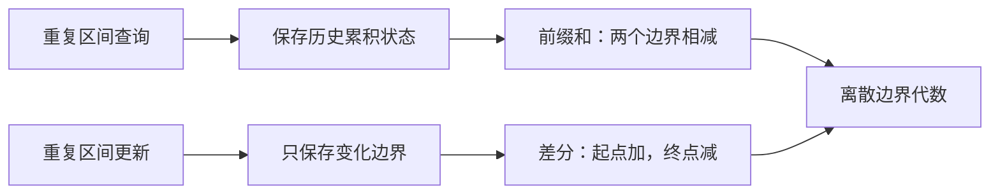
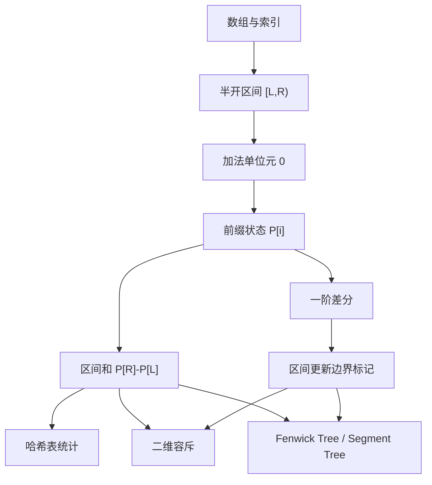
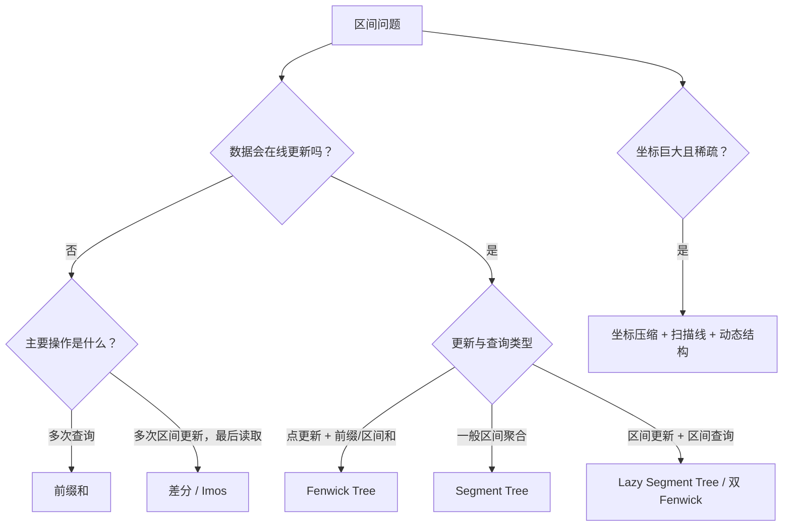

# 前缀和与差分数组：从离散微积分到区间算法

> [!abstract] 一句话模型
> **前缀和 (Prefix Sum)** 把每个位置之前的历史累积成一个“边界状态”，于是区间查询只需做两个边界状态的差；**差分数组 (Difference Array)** 只记录状态在哪些边界发生变化，于是一次区间更新只需修改起点和终点两个边界。
>
> 二者不是两个互不相关的技巧，而是同一套离散边界代数的正向与逆向表达。

本文由日报 [[work-docs/daily-reports/2026-07-25]] 的“前缀和与差分数组”主题扩展而来。目标不是记住两个公式，而是建立一套能够迁移到哈希计数、二维容斥、Fenwick Tree、扫描线、并行 Scan 与工程统计系统的统一心智模型。

> [!warning] 先纠正两个过强说法
> 1. “LeetCode 上有 200+ 道题能用前缀和”缺少稳定统计口径。更可靠的说法是：**前缀和是算法题中高频出现的基础模式**，覆盖静态区间查询、和为 K 的子数组、二维区域统计和离线区间更新等类别。
> 2. “三维前缀和基本用不上”并不准确。它在普通业务数组和常见算法题中较少见，但在体素数据、CT/MRI 医学影像、科学可视化和三维空间索引中有明确用途；真正的限制是存储、缓存和维度增长成本。

---

## 1. 问题从哪里来：重复计算与重复写入

设数组：

```text
A = [3, -1, 4, 2, 5]
```

如果不断询问区间 `[L,R)` 的元素和，最直接的方法是每次从 `L` 遍历到 `R-1`：

```text
query(1, 4) = -1 + 4 + 2 = 5
```

一次查询成本是 `O(R-L)`，最坏为 `O(n)`。当查询次数为 `q` 时，总成本可能达到 `O(nq)`。

反方向的问题是：如果不断执行“给整个区间加上 `x`”，逐元素修改一次同样要 `O(R-L)`。

这两个问题的共同矛盾是：

- 查询时，重复累加了大量相同的历史；
- 更新时，重复写入了区间内部大量相同的变化。

前缀和与差分数组分别消除这两种重复。



---

## 2. 最小知识依赖图



### 2.1 直接前置：为什么统一使用半开区间

本文统一使用：

```text
[L, R) = 包含 L，不包含 R
```

它有四个重要性质：

1. 区间长度始终是 `R-L`；
2. 空区间可写成 `[L,L)`；
3. 相邻区间可以无缝拼接：`[L,M) + [M,R) = [L,R)`；
4. 数组整体正好是 `[0,n)`，右边界 `n` 可直接作为哨兵。

半开区间不是语法偏好，而是一种降低边界状态数量的设计。

### 2.2 机制支撑：单位元与逆运算

加法单位元是 `0`：

```text
x + 0 = x
```

加法的逆运算是减法：知道“到 R 的累计”和“到 L 的累计”，便能消去共同前缀。

这也揭示一个边界：前缀扫描可以推广到许多满足结合律的操作，但“用两个前缀恢复任意区间”还要求存在可用的逆运算。例如：

- 区间和：可以通过减法恢复；
- 区间异或：可以通过再次异或恢复；
- 区间最大值：通常不能由两个前缀最大值恢复，因为 `max` 没有对应逆运算。

---

## 3. 前缀和：把历史压缩进边界

### 3.1 推荐定义：前导 0 + exclusive prefix

对长度为 `n` 的数组 `A`，定义长度为 `n+1` 的前缀数组 `P`：

$$
P[0]=0
$$

$$
P[i+1]=P[i]+A[i]
$$

因此核心不变量是：

$$
P[i]=\sum_{0\le j<i} A[j]
$$

也就是说，`P[i]`表示**前 i 个元素的和**，不包含 `A[i]`。

对示例数组：

```text
索引 i       0    1    2    3    4    5
边界          |----|----|----|----|----|
A                  3   -1    4    2    5
P             0    3    2    6    8   13
```

区间 `[1,4)` 的和：

$$
P[4]-P[1]=8-3=5
$$

### 3.2 为什么相减一定正确

展开两个前缀：

$$
P[R]=A[0]+A[1]+\cdots+A[L-1]+A[L]+\cdots+A[R-1]
$$

$$
P[L]=A[0]+A[1]+\cdots+A[L-1]
$$

两式相减，共同前缀被抵消，只剩 `[L,R)`。

```text
P[R] = [共同前缀] + [目标区间]
P[L] = [共同前缀]
                         相减
                       ───────
                         [目标区间]
```

这就是前缀和的核心：**不是让加法消失，而是把重复加法提前做一次，并用逆运算消去公共部分。**

### 3.3 前导 0 为什么重要

如果前缀数组从 `A[0]` 开始，那么查询以 0 为左端点的区间通常需要特判。

加入 `P[0]=0` 后：

- `[0,R)`：`P[R]-P[0]`；
- `[L,L)`：`P[L]-P[L]=0`；
- `[0,n)`：`P[n]-P[0]`；
- 不再需要 `if (L == 0)`。

> [!tip] 设计理念
> 一个好的哨兵值不是“多占一个位置”，而是把边界条件吸收到普通公式里。前导 0 让空前缀成为合法状态，使所有查询走同一条控制流。

### 3.4 Java 最小正确实现

```java
public final class PrefixSum {
    private final long[] prefix;

    public PrefixSum(int[] values) {
        this.prefix = new long[values.length + 1];
        for (int i = 0; i < values.length; i++) {
            prefix[i + 1] = prefix[i] + values[i];
        }
    }

    // 返回半开区间 [left, right) 的和
    public long rangeSum(int left, int right) {
        if (left < 0 || left > right || right >= prefix.length) {
            throw new IndexOutOfBoundsException();
        }
        return prefix[right] - prefix[left];
    }
}
```

复杂度：

| 阶段 | 时间 | 额外空间 |
|---|---:|---:|
| 构建 | `O(n)` | `O(n)` |
| 单次区间查询 | `O(1)` | `O(1)` |
| q 次查询 | `O(n+q)` | `O(n)` |

### 3.5 它把成本移到了哪里

前缀和不是免费优化，而是工作负载交换：

- 预处理从 `O(1)` 增加为 `O(n)`；
- 保存额外的 `n+1` 个累计状态；
- 换来每次查询 `O(1)`；
- 原数组发生更新后，后续所有前缀状态都可能失效。

所以它最适合：**数组静态或很少更新，但区间查询很多。**

---

## 4. 差分数组：只记录状态在哪里改变

### 4.1 差分不是值，而是边界变化

对数组 `A`，可定义：

$$
D[0]=A[0]
$$

$$
D[i]=A[i]-A[i-1],\quad i>0
$$

例如：

```text
A = [3, 3, 8, 8, 5]
D = [3, 0, 5, 0,-3]
```

`D` 的含义：

- 起点从 0 跳到 3，所以记录 `+3`；
- 中间保持 3，所以变化为 0；
- 到索引 2 从 3 跳到 8，所以记录 `+5`；
- 到索引 4 从 8 跳到 5，所以记录 `-3`。

对 `D` 做前缀和便可恢复 `A`。

### 4.2 区间更新为什么只改两个位置

假设给半开区间 `[L,R)` 每个元素都加 `x`：

```text
D[L] += x
D[R] -= x
```

原因不是魔法，而是“影响从 L 开始，在 R 结束”。

```text
位置             0   1   2   3   4   5
更新 [1,4)           +x  +x  +x
边界变化             +x          -x
```

对差分数组重新求前缀和时：

- 在 L 读到 `+x`，从此累计状态增加 x；
- L 到 R-1 之间没有抵消，影响持续存在；
- 在 R 读到 `-x`，累计状态恢复，后续位置不受影响。

### 4.3 哨兵消除 R+1 特判

如果题目输入是闭区间 `[L,R]`，可先转换成半开区间 `[L,R+1)`：

```text
D[L]     += x
D[R + 1] -= x
```

推荐分配长度 `n+1` 的差分数组。这样 `R=n-1` 时，`R+1=n`仍是合法哨兵位置，但还原原数组时只读取前 n 项。

### 4.4 Java：离线区间增量

```java
public final class RangeIncrement {
    private final long[] diff;

    public RangeIncrement(int size) {
        this.diff = new long[size + 1];
    }

    // 半开区间 [left, right) 全部加 delta
    public void add(int left, int right, long delta) {
        if (left < 0 || left > right || right >= diff.length) {
            throw new IndexOutOfBoundsException();
        }
        diff[left] += delta;
        diff[right] -= delta;
    }

    public long[] materialize() {
        long[] values = new long[diff.length - 1];
        long running = 0;
        for (int i = 0; i < values.length; i++) {
            running += diff[i];
            values[i] = running;
        }
        return values;
    }
}
```

复杂度：

- 每次区间更新：`O(1)`；
- m 次更新：`O(m)`；
- 最终统一还原：`O(n)`；
- 总成本：`O(m+n)`。

### 4.5 “多次改、一次查”还不够准确

差分数组更准确的定位是：

> **执行多次离线区间更新，最后统一物化全部位置。**

它不擅长：每次更新后立刻回答任意区间和。因为差分中的值代表变化，不是最终数组值；频繁物化会把成本重新变成 `O(n)`。

---

## 5. 离散微积分：二者为什么互为逆运算

### 5.1 离散基本定理

定义有限差分：

$$
\Delta P[i]=P[i+1]-P[i]
$$

若：

$$
\Delta P[i]=A[i]
$$

那么：

$$
\sum_{i=L}^{R-1}A[i]=P[R]-P[L]
$$

它与连续微积分中的“导数—积分”关系形式相似：

| 连续世界 | 离散世界 |
|---|---|
| 导数 | 相邻状态之差 |
| 不定积分 | 前缀累计，但差一个常数 |
| 定积分 | 两个边界的原函数值之差 |
| 初始条件 | `P[0]=0` 等边界锚点 |

### 5.2 “互逆”需要边界条件

如果只知道差分：

```text
D = [?, 2, -1]
```

但不知道起始值，就无法唯一确定原数组。所有整体平移后的数组拥有相同的后续差分。

所以“前缀和与差分严格互逆”应补上条件：

> 固定 `P[0]=0` 或固定原序列首值后，前缀累计与一阶差分互逆；没有边界锚点时，恢复结果只确定到一个加法常数。

### 5.3 线性代数视角

前缀和可以看成下三角全 1 矩阵乘以原向量：

$$
\begin{bmatrix}
1&0&0\\
1&1&0\\
1&1&1
\end{bmatrix}
\begin{bmatrix}
a_0\\a_1\\a_2
\end{bmatrix}
=
\begin{bmatrix}
a_0\\a_0+a_1\\a_0+a_1+a_2
\end{bmatrix}
$$

差分矩阵则是它的逆：

$$
\begin{bmatrix}
1&0&0\\
-1&1&0\\
0&-1&1
\end{bmatrix}
$$

这个视角解释了三个事实：

1. 两者都是线性变换；
2. 差分只保留相邻边界变化；
3. 高阶差分、二维差分与多维容斥都不是孤立公式，而是同一变换在更多维度上的组合。

> [!warning] 类比边界
> 这里的差分是“不除以步长”的有限差分。把它称为离散微分很有教学价值，但它不等于数值分析中用于逼近连续导数的差商；不要由此直接推出误差阶、光滑性等连续分析结论。

---

## 6. 前缀和 + HashMap：从“查一个区间”到“统计所有区间”

### 6.1 和为 K 的子数组

要统计有多少个子数组之和等于 `K`，若枚举左右端点，通常需要 `O(n²)`。

令当前位置右边界为 `r`，当前前缀和为 `P[r]`。若存在左边界 `l`：

$$
P[r]-P[l]=K
$$

移项得到：

$$
P[l]=P[r]-K
$$

因此每到一个新右边界，只需知道此前有多少个前缀和值等于 `P[r]-K`。

### 6.2 状态机推演

```text
输入 A = [1, 1, 1], K = 2
初始 freq = {0:1}, prefix = 0, answer = 0

读 1：prefix=1，寻找 -1，0 个；登记 1
读 1：prefix=2，寻找  0，1 个；答案 +1；登记 2
读 1：prefix=3，寻找  1，1 个；答案 +1；登记 3

最终 answer=2
```

`freq.put(0,1)`代表“空前缀出现一次”，使从索引 0 开始的合法子数组无需特判。

### 6.3 Java 正确顺序

```java
public static long countSubarraysWithSum(int[] nums, long target) {
    Map<Long, Long> frequency = new HashMap<>();
    frequency.put(0L, 1L);

    long prefix = 0;
    long answer = 0;

    for (int value : nums) {
        prefix += value;
        answer += frequency.getOrDefault(prefix - target, 0L);
        frequency.merge(prefix, 1L, Long::sum);
    }
    return answer;
}
```

核心不变量：哈希表只统计**当前右边界之前**的前缀。

必须先查询，再登记当前前缀。若反过来，当 `target=0` 时，当前前缀会和自己配对，错误计入长度为 0 的子数组。

### 6.4 为什么负数会破坏标准滑动窗口

标准求和滑动窗口依赖单调性：

- 右端点右移，窗口和不会下降；
- 左端点右移，窗口和不会上升。

有负数后：

- 加入一个负数，和可能下降；
- 移除一个负数，和反而可能上升。

因此无法只根据“当前和太大/太小”安全地永久丢弃某个左端点。

这与 [[滑动窗口 — 把 O(n²) 暴力变 O(n) 的框架级技巧]] 的边界一致：

> 含负数时失效的是依赖区间和单调性的标准双指针窗口，而不是所有滑动窗口。固定长度窗口仍然可以包含负数。

---

## 7. 二维前缀和：容斥不是口诀，而是重叠校正

### 7.1 定义二维边界状态

对 `rows × cols` 矩阵，定义 `(rows+1) × (cols+1)` 的二维前缀表：

$$
P[i][j]=\sum_{0\le r<i,\ 0\le c<j}A[r][c]
$$

构建公式：

$$
P[i+1][j+1]
=A[i][j]+P[i][j+1]+P[i+1][j]-P[i][j]
$$

为什么最后要减去左上角？因为上方区域与左方区域都包含左上重叠区，把它加了两次。

### 7.2 查询矩形

查询半开矩形：

$$
[r_1,r_2)\times[c_1,c_2)
$$

公式：

$$
P[r_2][c_2]-P[r_1][c_2]-P[r_2][c_1]+P[r_1][c_1]
$$

```text
┌─────────────────────────────┐
│        P[r2][c2] 全部       │
│  ┌──────────┬────────────┐  │
│  │ 重复减区 │  上方减区  │  │
│  ├──────────┼────────────┤  │
│  │ 左方减区 │  目标矩形  │  │
│  └──────────┴────────────┘  │
└─────────────────────────────┘

全部 - 上方 - 左方 + 左上重复减区
```

符号 `+ - - +` 来自容斥，不应死记。每当不确定符号时，重新问：某个区域被计算了几次？目标是让目标矩形系数为 1，其余区域系数为 0。

### 7.3 Java 实现

```java
public final class MatrixPrefixSum {
    private final long[][] prefix;

    public MatrixPrefixSum(int[][] matrix) {
        int rows = matrix.length;
        int cols = rows == 0 ? 0 : matrix[0].length;
        prefix = new long[rows + 1][cols + 1];

        for (int r = 0; r < rows; r++) {
            for (int c = 0; c < cols; c++) {
                prefix[r + 1][c + 1] = matrix[r][c]
                    + prefix[r][c + 1]
                    + prefix[r + 1][c]
                    - prefix[r][c];
            }
        }
    }

    public long rectangleSum(int r1, int c1, int r2, int c2) {
        return prefix[r2][c2]
            - prefix[r1][c2]
            - prefix[r2][c1]
            + prefix[r1][c1];
    }
}
```

### 7.4 二维差分：四个角就是四条边界的组合

给矩形 `[r1,r2) × [c1,c2)` 全部加 `x`：

```text
D[r1][c1] += x
D[r1][c2] -= x
D[r2][c1] -= x
D[r2][c2] += x
```

随后沿行、列各做一次前缀累计。

四个符号同样是容斥：

- 左上开始影响：`+x`；
- 越过右边界后取消：`-x`；
- 越过下边界后取消：`-x`；
- 右下区域被取消两次，需要补回：`+x`。

---

## 8. 多维推广：公式优雅，成本指数增长

对 d 维半开盒：

$$
B=\prod_{i=1}^{d}[l_i,r_i)
$$

每个维度都可选择下界或上界，因此需要枚举 `2^d` 个角，并根据选择下界的维数决定正负号。

| 维数 d | 角点数 |
|---:|---:|
| 1 | 2 |
| 2 | 4 |
| 3 | 8 |
| 4 | 16 |
| 10 | 1024 |

若 d 被视为固定常数，可以把一次查询称为 `O(1)`；若把 d 也作为输入规模，就应明确写成 `O(2^d)`。

更早出现的瓶颈通常是存储。如果每维长度约为 `m`，总单元数是 `m^d`。即使查询只看角点，完整前缀表也可能无法存入内存。

三维并非“没有用途”，而是适用场景更专门：

- 体素/体积数据的快速区域统计；
- CT、MRI 等医学影像；
- 科学可视化和气象体数据；
- 三维空间索引与包围体构建。

---

## 9. 从静态数组到动态数据结构

### 9.1 选型取决于查询—更新协议



| 工作负载 | 推荐结构 | 更新 | 查询 |
|---|---|---:|---:|
| 静态数组，多次区间和 | 前缀和 | 不支持或重建 | `O(1)` |
| 离线区间更新，最后物化 | 差分数组 | `O(1)` | 物化 `O(n)` |
| 在线点更新 + 区间和 | Fenwick Tree | `O(log n)` | `O(log n)` |
| 在线一般区间聚合 | Segment Tree | `O(log n)` | `O(log n)` |
| 在线区间更新 + 区间查询 | Lazy Segment Tree | `O(log n)` | `O(log n)` |

### 9.2 Fenwick Tree 是“可局部修补的前缀和”

普通前缀数组更新 `A[i]` 后，`P[i+1..n]` 都需变化。Fenwick Tree 将前缀分解为若干个二进制区间，使一次点更新只修补 `O(log n)` 个聚合块，一次前缀查询也只合并 `O(log n)` 个块。

它牺牲了前缀和的 `O(1)` 查询，换取在线更新能力。

### 9.3 Segment Tree 是“显式保存区间分治结果”

Segment Tree 将数组递归分割为区间，并在每个节点保存该区间的聚合状态。它支持比求和更一般的结合操作，也更适合复杂区间状态，但代价是：

- 空间通常更大；
- 常数更高；
- 实现与懒标记不变量更复杂。

### 9.4 扫描线是“让一个维度变成时间”

二维区间问题常把 x 轴坐标排序成事件，按 x 从左到右推进；当前活跃的 y 区间交给 Fenwick Tree 或 Segment Tree 维护。

这不是抛弃差分思想，而是将二维变化拆成：

```text
x 方向：事件边界 / 差分
          +
y 方向：动态前缀或区间数据结构
```

---

## 10. 工程边界：大 O 正确不代表程序正确

### 10.1 Java 整数溢出

Java 的 `int` 是 32 位，溢出不会自动报错。若 `n` 和元素值较大，累计和很容易超过约 21 亿。

推荐：

```java
long prefix = 0;
prefix += nums[i];
```

但要注意表达式求值顺序：

```java
long wrong = nums[i] + nums[j];       // int 相加后才提升，可能已经溢出
long right = (long) nums[i] + nums[j];
```

`long` 也不是无限精度。应估算：

$$
\text{最大累计量}\approx n\times \max|A[i]|\times \text{更新倍率}
$$

必要时使用 `Math.addExact`主动检测，或使用 `BigInteger`。

### 10.2 二维表的真实内存

一个 `(rows+1) × (cols+1)` 的 `long` 前缀表，仅原始数值空间约为：

$$
8(rows+1)(cols+1)\ \text{bytes}
$$

Java 的 `long[][]` 还包含每一行对象和引用开销。超大矩阵可能需要：

- 一维扁平数组；
- 分块前缀和；
- 逐行流式处理；
- 稀疏结构或坐标压缩。

### 10.3 坐标压缩不等于把长度都变成 1

坐标压缩把稀疏坐标映射为秩：

```text
原坐标：10, 1000, 1000000
压缩后：0, 1, 2
```

它保留顺序，却不保留物理距离。如果答案涉及覆盖长度或面积，必须保留相邻原坐标差：

```text
1000 - 10 != 1
```

否则会把几何长度算错。

### 10.4 缓存局部性

顺序前缀和连续读写数组，空间局部性很好，通常接近内存带宽型任务。Fenwick Tree 和 Segment Tree 虽然只有 `O(log n)` 次访问，但索引跳跃、分支和节点布局会影响真实常数。

因此选型不能只看大 O：

- 小数组或查询不多时，直接循环可能更快、更简单；
- 查询量足够大时，预处理成本才会被摊薄；
- 数据结构复杂度越高，越需要真实基准而不是想象中的性能。

### 10.5 并行前缀扫描

前缀和看似强依赖前一个位置，但可以通过树形上扫 (up-sweep) 与下扫 (down-sweep) 并行化。


Java 提供 `Arrays.parallelPrefix`。但并行并不自动更快：

- 小数组上，线程调度和同步成本可能超过收益；
- 操作必须满足结合律；
- 浮点加法不严格满足结合律，并行归约树可能改变舍入结果；
- 性能受处理器数量、内存带宽与数组规模共同约束。

---

## 11. 常见错误与对抗性反例

### 11.1 混用闭区间和半开区间

错误模式：构建按半开区间，查询却把 R 当作包含端点。

修正：在系统入口统一转换，内部只保留一种区间协议。

### 11.2 前缀数组没有前导 0

结果：`L=0` 时出现特判，二维公式也更容易错位。

修正：默认 `P` 长度为 `n+1`。

### 11.3 差分终点符号写反

区间 `[L,R)` 加 x 必须是：

```text
D[L] += x
D[R] -= x
```

若 R 也加 x，影响不会在终点结束。

### 11.4 把差分当作在线查询结构

每次更新后都完整还原，m 次更新变成 `O(mn)`，失去差分意义。

修正：若更新与查询在线交错，升级 Fenwick Tree 或 Segment Tree。

### 11.5 HashMap 登记顺序错误

若先登记当前前缀，再查 `prefix-K`，当 `K=0` 时会把空子数组计入。

修正：**先查询历史，再登记当前。**

### 11.6 认为有负数就“完全不能滑动窗口”

反例：固定长度窗口仍可使用。

准确边界：负数破坏的是依赖区间和单调性的可变长度双指针逻辑。

### 11.7 把二维容斥符号当口诀

一旦坐标约定改变，死记公式就容易错。

修正：重新画区域，检查每块最终系数应是 0 还是 1。

### 11.8 认为多维查询永远 O(1)

维度固定时可视为常数；维度增长时角点数为 `2^d`，存储还可能达到 `m^d`。

---

## 12. 从算法题迁移到工程系统

### 12.1 指标报表

日报、流量和订单统计常把每天的值预聚合成累计量：

```text
某时间段总量 = 截止结束时间累计 - 截止开始时间累计
```

但生产系统还需考虑：迟到数据、回补、时区、窗口边界和版本化重算。此时普通数组前缀和可能演化为分层时间桶、物化视图或 OLAP 累计结构。

### 12.2 事件区间与容量规划

若一个任务在 `[start,end)` 占用 k 个资源，可以记录：

```text
D[start] += k
D[end]   -= k
```

按时间扫描差分后得到每一时刻的并发占用量。会议室预订、航班容量、服务器并发连接和带宽计划都能使用同一模型。

### 12.3 数据库中的累计与增量

- Prefix：保存截至某版本的累计状态；
- Difference：保存版本之间的增量日志；
- Materialize：重放增量得到当前状态。

这与事件溯源、增量视图维护和日志压缩存在结构相似性。类比的边界是：分布式系统还必须处理幂等、乱序、重复、并发版本与容错，不能只靠数组公式保证正确。

### 12.4 图像积分图

二维前缀和也称求和面积表 (Summed-Area Table)。它可快速计算任意轴对齐矩形区域的像素和，是图像特征、区域均值和纹理处理中的基础结构。

---

## 13. 一套统一的审查框架

遇到新的区间问题时，依次回答：

1. **区间协议是什么？** `[L,R)` 还是 `[L,R]`？
2. **数据静态还是动态？**
3. **查询与更新是否在线交错？**
4. **操作是否满足结合律？是否有逆运算？**
5. **能否把工作从区间内部迁移到边界？**
6. **坐标是否稠密？是否需要压缩或扫描线？**
7. **累计值和答案数量是否会溢出？**
8. **维度是否固定？空间是否承受得住？**
9. **查询量是否足以摊薄预处理？**
10. **真实瓶颈是算法、内存带宽还是缓存？**

这十个问题比背诵“看到区间就用前缀和”更可靠。

---

## 14. 理解检验

### 题 1：为什么 P 长度是 n+1？

要求不用“因为模板这样写”回答，而要从空前缀、半开区间和统一边界公式解释。

### 题 2：差分更新为何在 R 做减法？

请沿着前缀还原过程，解释影响如何在 L 开始、在 R 结束。

### 题 3：什么时候前缀最大值不能回答区间最大值？

构造两个不同数组，使它们在某两个边界上的前缀最大值相同，但目标区间最大值不同，从而说明 `max` 缺少逆运算。

### 题 4：为什么和为 K 的统计要先查再存？

以 `K=0` 推演先存后查会产生的伪空区间。

### 题 5：负数为什么破坏标准求和滑动窗口？

构造一个加入新元素后窗口和下降的例子，并说明算法为何不能据此安全移动左端点。

### 题 6：二维差分右下角为何是加号？

说明它修复了哪一块被重复取消的区域。

### 题 7：业务出现“更新一次，查询一次”时为何应放弃普通差分？

比较重复物化与 Fenwick Tree 的总成本。

---

## 15. 最后压缩成十二条

1. 前缀和保存“边界之前的累计状态”，区间结果由两个边界相减得到。
2. `P[0]=0` 与长度 `n+1` 把空前缀和首尾边界纳入统一公式。
3. 半开区间 `[L,R)` 让长度、拼接、空区间和哨兵保持一致。
4. 差分数组保存“状态发生变化的边界”，区间更新只需起点加、终点减。
5. 前缀累计与一阶差分在固定边界条件后互逆，可视为离散积分与离散微分。
6. 前缀扫描可推广到结合操作，但两个前缀恢复区间通常还需要逆运算。
7. Prefix + HashMap 把“所有区间”转化为“此前出现过多少个目标前缀”。
8. 含负数时失效的是依赖和单调性的标准滑动窗口，不是所有窗口算法。
9. 二维前缀和与二维差分都来自容斥；符号应通过重叠计数推导。
10. 静态查询用前缀和，离线区间更新用差分，在线更新升级 Fenwick Tree 或 Segment Tree。
11. 大 O 之外还要检查整数溢出、内存、缓存、坐标距离与并行开销。
12. 真正可迁移的能力不是背公式，而是识别“历史累计、边界变化、状态物化”三种角色。

---

## 参考资料

1. [Guy E. Blelloch, Prefix Sums and Their Applications](https://www.cs.cmu.edu/~scandal/papers/CMU-CS-90-190.html) — scan/prescan、结合律与并行前缀算法。
2. [USACO Guide: Introduction to Prefix Sums](https://usaco.guide/silver/prefix-sums) — 前导零、静态区间查询。
3. [LeetCode 560: Subarray Sum Equals K — Editorial](https://leetcode.com/problems/subarray-sum-equals-k/editorial/) — 前缀和配合频次哈希表。
4. [David Gleich, Finite Calculus: A Tutorial](https://www.cs.purdue.edu/homes/dgleich/publications/Gleich%202005%20-%20finite%20calculus.pdf) — 有限差分、反差分与离散基本定理。
5. [USACO Guide: More on Prefix Sums](https://usaco.guide/silver/more-prefix-sums) — 二维前缀与差分数组。
6. [MIT 6.506: Multidimensional Included and Excluded Sums](https://jshun.csail.mit.edu/6506-s23/lectures/lecture22-2.pdf) — 多维容斥与 `2^d` 角点。
7. [Peter M. Fenwick, A New Data Structure for Cumulative Frequency Tables](https://static.aminer.org/pdf/PDF/001/073/976/a_new_data_structure_for_cumulative_frequency_tables.pdf) — Fenwick Tree 原始论文。
8. [CMU 15-451: Range Queries](https://www.cs.cmu.edu/~yangp/15-451/lecture6.pdf) — 动态前缀、Segment Tree 与区间查询。
9. [Pibiri and Venturini, Practical Trade-Offs for the Prefix-Sum Problem](https://jermp.github.io/assets/pdf/papers/SPE2021.pdf) — 查询/更新比例、缓存与实际性能权衡。
10. [Java Language Specification, §4.2 Primitive Types and Values](https://docs.oracle.com/javase/specs/jls/se24/html/jls-4.html) — `int`、`long` 和整数溢出语义。
11. [Java Arrays.parallelPrefix](https://docs.oracle.com/en/java/javase/21/docs/api/java.base/java/util/Arrays.html) — Java 并行累计 API。
12. [USACO Guide: Point Update Range Sum](https://usaco.guide/gold/PURS) — Fenwick Tree 与 Segment Tree。
13. [USACO Guide: Range Queries with Sweep Line](https://usaco.guide/plat/range-sweep) — 扫描线与动态区间结构。
14. [Franklin C. Crow, Summed-Area Tables for Texture Mapping](https://dl.acm.org/doi/10.1145/800031.808600) — 二维积分图的经典来源。
15. [Reinbold and Westermann, Parameterized Splitting of Summed Volume Tables](https://www.cs.cit.tum.de/fileadmin/w00cfj/cg/Research/Publications/2021/Parameterized_Splitting_of_Summed_Volume_Tables/paper.pdf) — 三维求和体、可视化与内存代价。
16. [Urschler et al., Memory Efficient 3D Integral Volumes](https://openaccess.thecvf.com/content_iccv_workshops_2013/W21/papers/Urschler_Memory_Efficient_3D_2013_ICCV_paper.pdf) — 医学影像中的三维积分体。

> [!info] 证据与版本边界
> - 文章中的算法不变量属于稳定数学结论；Java 整数语义依据 Java SE 24 语言规范，API 示例引用 Java SE 21 文档。
> - “LeetCode 200+ 道”未保留为事实结论，因为动态标签页缺少稳定统计口径。
> - 多维查询只有在维度固定时才可简写为 `O(1)`；显式复杂度为 `O(2^d)`。
> - Fenwick Tree、Segment Tree 与并行 Scan 的真实性能依赖工作负载和硬件，本文不承诺具体吞吐提升。

%%
写作来源：[[work-docs/daily-reports/2026-07-25]]
研究截止：2026-07-27
%%


好的，吾友。既然你问到了 **Fenwick Tree（树状数组）** 与 **Segment Tree（线段树）**，这确实是程序员的“倚天剑”与“屠龙刀”。江湖上常有人说“算法与数据结构是程序的灵魂”，而它们就是用来解决“动态区间查询”这一核心痛点的灵魂法门。

今日，吾便仿若诸葛孔明出山，为你拆解这二位“神将”的奥义。

---

### 第一章：问题溯源 —— 我们为何需要它们？

让我们从最原始的烦恼开始。想象你有一排连续的士兵，每个士兵手中有一个数字（正整数）。指挥官有两个反复无常的命令：

1.  **查询（Query）**：报上第 `i` 个到第 `j` 个士兵的数字总和是多少？
2.  **更新（Update）**：第 `k` 个士兵的数字改变了，重新登记。

**初级解法（暴力法）：**
- 查询：从 `i` 挨个加到 `j`，耗时 O(n)。
- 更新：直接改，耗时 O(1)。
这里的 n 是士兵的总数。士兵少还好，若有一百万士兵，每次查询遍历一遍，大军早已延误战机。

**进阶解法（前缀和）：**
- 预先算出 `前缀和数组 (Prefix Sum)`：`prefix[i] = 士兵1到i的总和`。
- 查询：直接 `prefix[j] - prefix[i-1]`，耗时 O(1)。厉害！
- 更新：因为士兵 `k` 变了，从第 `k` 个元素开始，之后的所有 `prefix` 值都要重算。耗时 O(n)。

> **结论：** 在一场动态的战争中（频繁修改+频繁查询），暴力法或前缀和都显得笨重不堪。我们需要一种既能快速查询，又能快速更新的“平衡之道”。

**核心矛盾：** 查询和更新不能同时是 O(1)。我们需要一个**折中方案**。
- `Fenwick Tree` 和 `Segment Tree` 就是将两者都优化到 **O(log n)** 的神器。

---

### 第二章：Fenwick Tree（树状数组）—— 二进制下的“军师”

**奥义：** 利用**整数在二进制下的“最低位1” (lowbit)** 来划分职责。这是一种“分治”但极其简洁的体现。

#### 2.1 核心思想：让每个元素管理一个小团队

我们不把每个士兵都直接管理，而是让每个士兵（索引 `i`）只负责管理一段区间：从 `(i - lowbit(i) + 1)` 到 `i`。

- **什么是 lowbit(i)？**
  lowbit(i) 是整数 `i` 的二进制表示中，最低位的1及其后面的0组成的值。
  例如: `i = 6 (二进制 110)`， `lowbit(6) = 2 (二进制 10)`。
  `i = 8 (二进制 1000)`， `lowbit(8) = 8 (二进制 1000)`。
  `i = 3 (二进制 11)`， `lowbit(3) = 1 (二进制 1)`。

  **数学公式：** `lowbit(i) = i & -i`。 这里利用了计算机补码的特性（负数 = 按位取反+1）。

#### 2.2 数据结构：原数组 vs 树状数组

假设有数组 `arr: [3, 2, 1, 5, 4]` （1-indexed），我们构建一个树状数组 `BIT`。

```
索引 (idx):  1     2     3     4     5
原数组 (arr): [3,   2,   1,   5,   4]
BIT 数组:   [?    ?    ?    ?    ?]

职责划分：
BIT[1] = arr[1]                                           (lowbit(1)=1)
BIT[2] = arr[1] + arr[2]                                   (lowbit(2)=2)
BIT[3] = arr[3]                                            (lowbit(3)=1)
BIT[4] = arr[1] + arr[2] + arr[3] + arr[4]                 (lowbit(4)=4)
BIT[5] = arr[5]                                            (lowbit(5)=1)
```

**结构图示（核心链路）：**

想象一个树状的管理结构，而不是链状。每个节点 `BIT[i]` 的父节点是 `i + lowbit(i)`。

```
          +-------------------+
          |      BIT[4]       |  <-- 管理 [1,2,3,4]
          |      Sum(1..4)    |
          +--------+--------+
                  / \
        +---------+ +---------+
        | BIT[2]  | | BIT[6]  | ... (虽然我们没有6个元素，但逻辑存在)
        | Sum(1,2)| |(管理5,6)|
        +----+----+ +----+----+
            / \            / \
    +------+ +------+ +------+ +------+
    |BIT[1]| |BIT[3]| |BIT[5]| |BIT[7]| ...
    | a[1] | | a[3] | | a[5] | | a[7] |
    +------+ +------+ +------+ +------+
```

这种设计让三个特性得以施展：
- **更新：** 改变 `arr[i]` 时，只更新 `BIT[i]` 以及它的所有父节点 `i += lowbit(i)`。
- **查询前缀：** 求 `arr[1..i]` 的和，只需累加 `BIT[i]`, `BIT[i - lowbit(i)]`, `BIT[i - lowbit(i) - ...]`，即 `i -= lowbit(i)`。

#### 2.3 核心操作伪码

```text
function update(idx, delta):
    while idx <= n:
        BIT[idx] += delta
        idx += lowbit(idx)    // 向上找爹

function query(idx):
    sum = 0
    while idx > 0:
        sum += BIT[idx]
        idx -= lowbit(idx)    // 去除一个最低位1，向兄弟或上级汇报
    return sum

function range_sum(l, r):
    return query(r) - query(l-1)
```

#### 2.4 奥义与限制

- **奥义：** 为什么快？因为每次操作，`idx` 的变化是跳动的，近似于树的高度的对数复杂度。它之所以优美，在于只用了一个一维数组，就实现了这种动态管理。
- **限制：**
    1.  它只能处理**前缀和**相关的操作。虽然可以处理区间和、区间异或、区间最大值（不适用！），但不能轻易处理**区间更新**（某个区间内所有元素加一个值）和**区间查询**相结合的情况（除非配合差分数组，但会引入新问题）。
    2.  不可删除元素，本质是定长数组。
    3.  逆序对、求第K大等场景是它的强项。

---

### 第三章：Segment Tree（线段树）—— 区间上的“神算子”

**奥义：** “分而治之”。将一个完整的区间不断二分，直到每个点。它是一种**二叉树**结构，代表了对区间的**层次划分**。

#### 3.1 核心思想：把一切切成两半

我们把整个数组 `[1, n]` 当成一个节点，它的左孩子负责 `[1, mid]`，右孩子负责 `[mid+1, n]`。反复递归下去，直到只剩一个元素（叶子节点）。每个节点存储其代表区间的一个**汇总统计值**（如区间和、区间最大值、区间最小值）。

这就好比是军队的**纵队编制**：连->排->班->个人。查一个排的实力，需要知道两个班；查一个连的实力，需要知道两个排。

#### 3.2 数据结构：链式 or 数组存储

通常用数组模拟完全二叉树，空间为 `4 * n`（确保安全）。

**结构图示（以区间和为例，数组 `arr = [3, 2, 1, 5]`）：**

```
                Node 1: [1,4] = 11
               /               \
       Node 2: [1,2] = 5      Node 3: [3,4] = 6
        /        \           /        \
Node 4: [1,1]=3 Node 5:[2,2]=2 Node 6:[3,3]=1 Node 7:[4,4]=5

这种是一棵完整的二叉树。每个内部节点存储其两个孩子值的和。
```

#### 2.3 核心操作（以区间和为例）

**1. 构建（Build）：**
   - 从根节点开始，递归到叶子。
   - 叶子节点值为原数组对应元素。
   - 非叶子节点值为左右孩子之和。

**2. 更新（Update）：**
   - 从根节点开始递归。
   - 根据索引 `i` 决定进入左子树还是右子树。
   - 到达叶子节点，更新它的值。
   - 返回时，重新计算当前节点的值（左+右）。

**3. 查询（Query）：**
   - 从根节点开始递归，我们需要查询 `[L, R]` 区间。
   - **完全覆盖**：如果当前节点区间完全在 `[L, R]` 内，直接返回该节点的值。
   - **无交集**：如果当前节点区间与 `[L, R]` 没有任何重叠，返回0（对于求和）。
   - **部分重叠**：如果当前节点部分重叠，递归查询左孩子和右孩子，合并它们的返回值。

```text
function build(node, l, r):
    if l == r:
        tree[node] = arr[l]
        return
    mid = (l + r) / 2
    build(node*2, l, mid)
    build(node*2+1, mid+1, r)
    tree[node] = tree[node*2] + tree[node*2+1]

function update(node, l, r, idx, val):
    if l == r:
        tree[node] = val
        return
    mid = (l + r) / 2
    if idx <= mid:
        update(node*2, l, mid, idx, val)
    else:
        update(node*2+1, mid+1, r, idx, val)
    tree[node] = tree[node*2] + tree[node*2+1]

function query(node, l, r, ql, qr):
    if ql <= l && r <= qr:  // 完全覆盖
        return tree[node]
    if r < ql || l > qr:    // 无交集
        return 0
    mid = (l + r) / 2
    left_sum = query(node*2, l, mid, ql, qr)
    right_sum = query(node*2+1, mid+1, r, ql, qr)
    return left_sum + right_sum
```

#### 2.4 扩展：懒标记 (Lazy Propagation) —— 神算子的终极杀招

线段树真正的威力在于**区间更新**（如：把 `[L,R]` 区间内的所有加 `5`）。

不采用逐个更新叶子节点的笨办法，而是在遍历节点时，如果当前节点区间被完全覆盖，我们不立即更新其叶子节点，而是：
1.  更新当前节点的值（如：区间和加 `5 * 区间长度`）。
2.  给当前节点打上一个“懒标记”，表示“我的孩子都欠着一次更新没做”。
3.  下次如果需要深入到孩子节点（查询或更新），再把懒标记“推下去”（Push Down），更新孩子。

**这个机制，现代编译器里的指令重排、数据库里的MVCC，本质上都是某种“懒”的思想。**

#### 2.5 奥义与限制

- **奥义：** 任何区间 `[L,R]` 在树中都可以表示为 `O(log n)` 个不重叠节点的并集。所以无论是查询还是更新，下探的深度都是树高 `O(log n)`。它是真正的**区间万能操作**利器。
- **限制：** 空间复杂度较大（`4n`），代码实现复杂，比Fenwick Tree麻烦。

---

### 第四章：二雄对比—— 如何选择？

| 特徵 | Fenwick Tree (树状数组) | Segment Tree (线段树) |
| :--- | :--- | :--- |
| **思想源泉** | 二进制分解（lowbit） | 分治递归（二分区间） |
| **实现难度** | 极其简单（5行代码） | 相对复杂（Lazy需要更多行） |
| **空间复杂度** | O(n) | O(4n)，甚至更大 |
| **速度常数** | 非常快（常数极小） | 稍慢（涉及递归函数调用） |
| **核心能力** | 点更新、前缀查询 | 区间更新、区间查询区间合并 |
| **通用性** | 只能处理**可逆**操作（和、异或、积）；不能求区间最大值 | 可处理任意结合律操作（和、积、最大、最小、GCD）；通过“推懒”实现区间修改 |
| **扩展性** | 弱 | 极强（可处理二维线段树、可持久化、可区间合并求连续子段和） |

**选择黄金法则：**

1.  **简单场景，要快，功能单一：** 如果只有**单点更新 + 求区间和/前缀和**。用 **Fenwick Tree**。它不仅是O(log n)，常数还比Segment Tree小得多，且代码短，不易出错。
2.  **复杂场景，要强，功能多：** 如果需要**区间更新**（如区间加、区间赋值）、需要**同时维护多种信息**（和、最大值、最小值）、或者求**区间内连续最大子段和**—— 这只能用 **Segment Tree**。

*更进一步：如果你是狂热的性能党，对于“单点更新+区间求和”，Fenwick Tree是绝对的王者。Segment Tree是你强大的后盾，用来处理一切Fenwick Tree处理不了的复杂问题。*

---

### 第五章：深入讲解 — 推演算法演进

让我们把时间线拉长，看这两个结构在算法中的角色。

**1. 逆序对 (Inversion Count)：**
   - **传统：** 冒泡排序，O(n²)。
   - **Fenwick Tree 解法：** 维护一个值域 Fenwick Tree。从右向左扫描数组，每看到一个元素 `a[i]`，就查询 `query(a[i] - 1)`（比它小的数的个数），即逆序对的一部分。然后 `update(a[i], 1)`。时间复杂度 O(n log n)。简单优雅。
   - **Segment Tree 解法：** 同样可解，但杀鸡焉用牛刀。

**2. 区间最值查询 (RMQ)：**
   - **解法一（静态）：** Sparse Table（稀疏表），O(n log n) 预处理，O(1) 查询，但不可更新。
   - **解法二（动态）：** Segment Tree，可将区间最大值作为节点信息。更新无需Lazy。经典。

**3. 区间加，区间求和 (Range Add, Range Sum)：**
   - **Fenwick Tree 解法：** 需要维护两个Fenwick Tree（差分思路），经典而巧妙，但推导略复杂。
   - **Segment Tree 解法：** 加上Lazy标记，直接了当，思维简单。这是 Segment Tree 的舒适区。

---

### 第六章：最佳实践与哲学思考

- **永远不依赖工具：** 把Fenwick Tree的 `lowbit`, Segment Tree的 `build`/`update`/`query` 手写熟悉。它们是二分思想的肌肉记忆。
- **理解本质，而不是模板：** 不要背代码。要理解“分治”、“分解”、“懒”这三个词。
- **从生活中的“堆叠箱子”理解Fenwick Tree：** 像经营一个独立的小超市，每个货架标签负责自己的一小段货道范围。标签上的数字是这个货道的总价。如果要更新最里面的货物，只需要顺藤摸瓜更新相关的所有标签。
- **从“行政区划”理解Segment Tree：** 中国 -> 省 -> 市 -> 县 -> 乡。查询一个市的GDP？不需要查每个县，只需把市直接管理的区域数字加起来，就是懒标记的体现。

---

### 结语

Fenwick Tree 是 **“聪明的懒汉”**，它利用二进制特性，用最小的代价完成了动态前缀和的任务。Segment Tree 是 **“严谨的将军”**，它通过递归二分，将任何复杂问题拆解为可管理的子任务，并通过“Lazy”这一现代CPU流水线式的思想，让区间更新也成为了 O(log n)。

掌握它们不是终点，而是你通往高阶算法思维的起点。当你以后面对“动态”与“区间”这两个魔鬼时，能心中默念“分治”、“合并”、“懒标记”，那便是出师之时。

吾已倾囊相授。能否挥洒自如，全凭你沙场演练了！