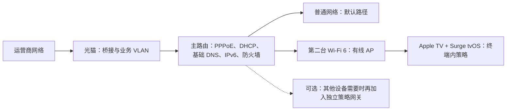
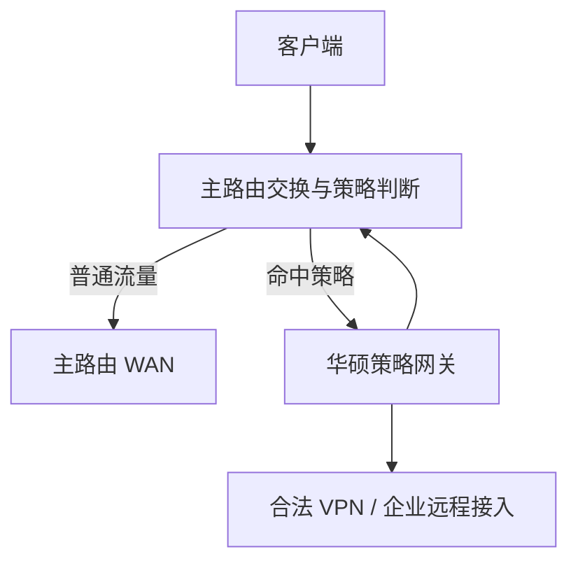
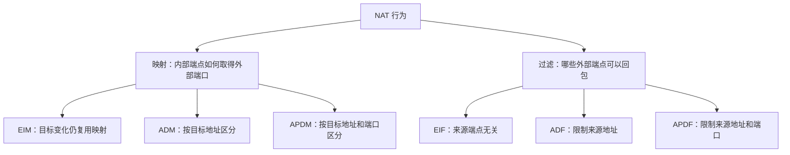
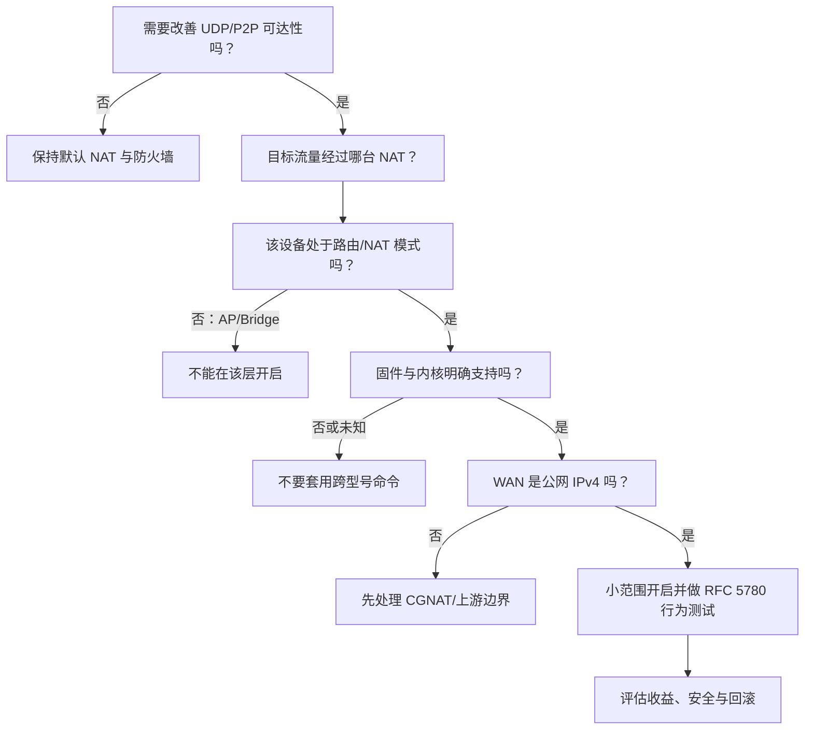
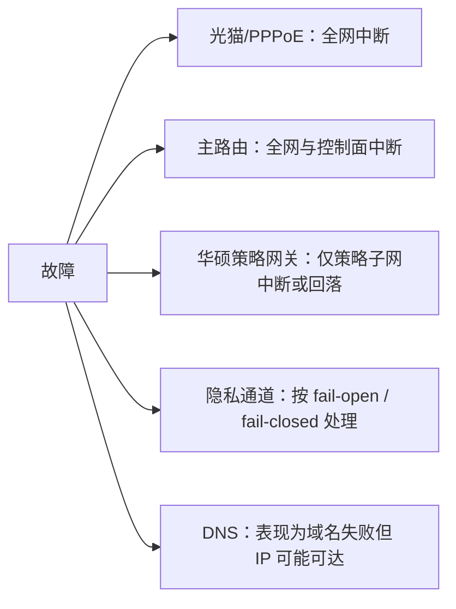
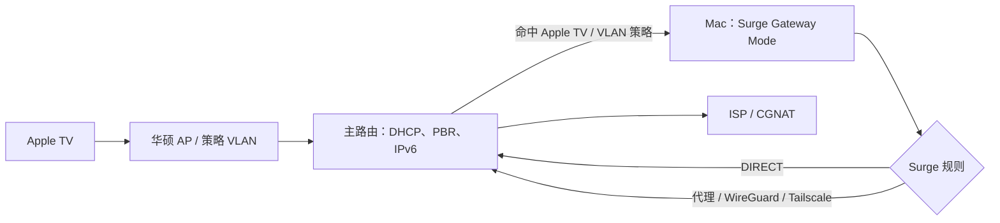
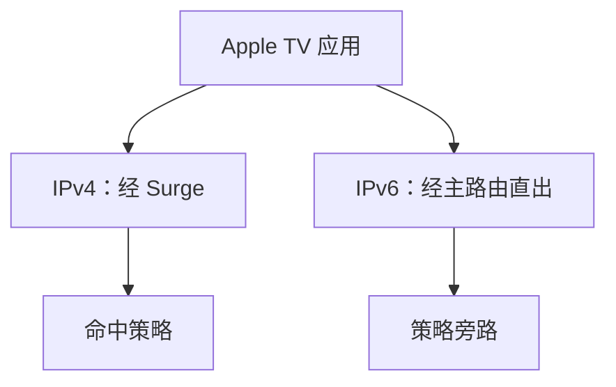
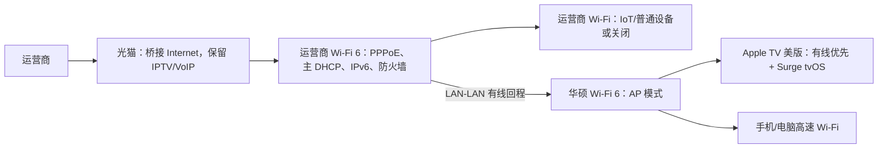
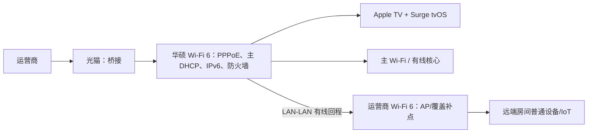
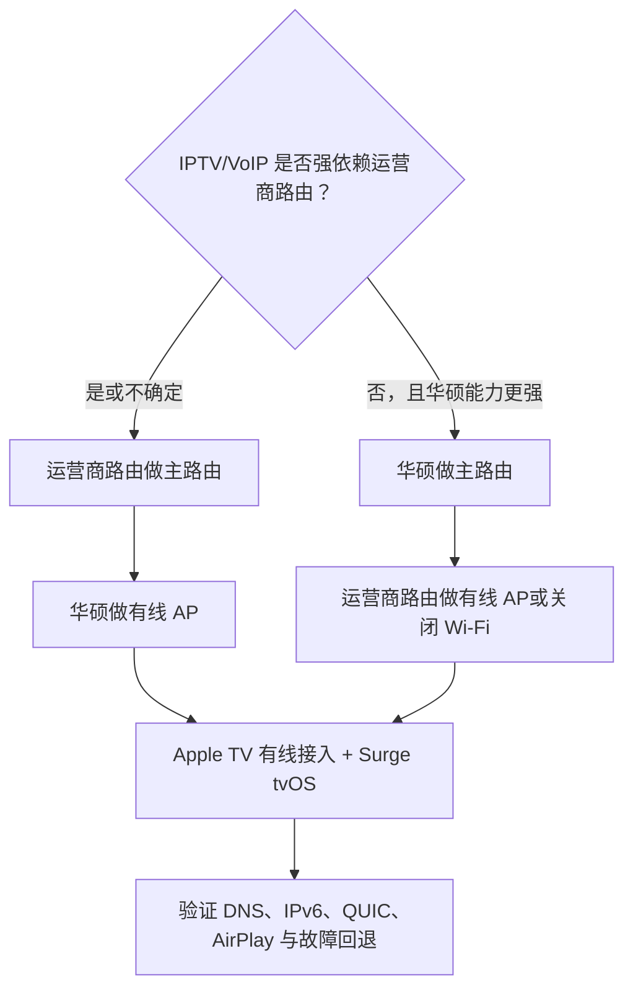

# 家庭网络双路由设计：光猫桥接、策略网关与 Full Cone NAT 工程实践

> [!abstract] 一句话结论
> 结合现有设备，推荐采用 **光猫桥接 → 一台路由器负责 PPPoE、唯一 DHCP、IPv6 与主防火墙 → 另一台路由器通过 LAN-LAN 作为有线 AP → Apple TV 有线接入并由 Surge tvOS 处理自身策略流量**。只有其他家庭设备也需要统一分流时，才引入华硕二级策略子网或 Surge Mac Gateway。Full Cone NAT 只影响特定 NAT 层，不会创造公网 IPv4，也不能穿透运营商 CGNAT。

> [!warning] 最重要的概念纠正
> “第二台路由设为 AP”与“第二台路由作为全网策略网关”在标准数据平面上是两种不同角色：AP 是二层桥，策略网关是三层下一跳。当前 Apple TV 已运行 Surge tvOS，因此华硕可以安心作为 AP；Surge tvOS 接管的是 Apple TV 自身流量，而不是全屋设备流量。只有需要接管其他设备时，才把独立网关重新加入拓扑。

> [!info] 合规边界
> 本文讨论家庭网络分层、NAT、合法隐私连接、企业远程接入与策略路由。具体服务应遵守所在地法律、运营商协议和组织安全政策。

## 一、先重构问题：你真正需要的是两条网络路径

目标不是“多接一台路由器”，而是同时满足两类需求：

1. **普通路径**：电视、智能家居、家人手机等默认经主路由稳定上网；
2. **策略路径**：当前由 Apple TV 上的 Surge tvOS 处理其自身流量；其他设备只有在确有需求时才经独立策略网关；
3. 任一路径故障时，影响范围应尽量局部化；
4. DHCP、DNS、IPv6 和默认网关不能互相打架；
5. Full Cone 只在确有实时通信、P2P 或游戏需求时开启，并且必须知道它在哪一层生效。

这其实是一个**控制面与数据面分离**问题：

- 控制面决定地址、路由、DNS 和策略；
- 数据面决定每一个数据包真实经过哪些设备；
- 名称和 UI 模式不重要，真正重要的是路由表、下一跳与 NAT 状态落在哪里。



## 二、拓扑选项：当前优先 AP，扩展需求再引入策略网关

> [!tip] 阅读优先级
> 对当前“Apple TV 已运行 Surge tvOS”的家庭，优先采用本节方案 C（纯 AP），具体设备落地以第十九章为准。方案 A、B 保留给“未来需要让 Apple TV 之外的设备统一分流”的扩展场景，不是当前默认方案。

### 方案 A：扩展场景——二级路由 + 独立 SSID

当多个不支持终端代理的设备需要统一策略，而主路由又不支持可靠 PBR 时，这是最容易隔离和回滚的扩展方案。

```text
Internet
   │
[光猫 Bridge]
   │
[主路由 PPPoE]
   ├── LAN/Wi-Fi：192.168.10.0/24  普通设备
   │
   └── LAN ──> WAN [华硕路由模式]
                    └── LAN/Wi-Fi：192.168.20.0/24  策略设备
```

建议地址规划：

| 组件 | 地址/职责示例 |
|---|---|
| 主路由 LAN | `192.168.10.1/24` |
| 主路由 DHCP | `192.168.10.100-199` |
| 华硕 WAN | 主路由静态租约，例如 `192.168.10.2` |
| 华硕 LAN | `192.168.20.1/24` |
| 华硕 DHCP | `192.168.20.100-199`，只服务自己的下游 |
| 普通 SSID | 主路由提供 |
| 策略 SSID | 华硕提供 |

优点：

- 不要求主路由支持复杂的策略路由；
- “连哪个 SSID，就走哪条路径”，行为直观；
- 隐私通道故障只影响华硕下游；
- 可先在少数测试设备上验证，不碰全家基础网络。

代价：

- 华硕下游 IPv4 通常经历两层 NAT；
- 跨子网访问 NAS、打印机需要额外路由或防火墙规则；
- UPnP、端口映射、游戏 NAT 类型和 IPv6 更复杂；
- Full Cone 即使在华硕上开启，也只改变华硕这一层，主路由和运营商上游仍可能更严格。

### 方案 B：进阶方案——旁路/策略网关

主路由仍管理一个 LAN，但通过静态 DHCP、VLAN 或基于源地址的策略路由，把选定流量送往华硕。



这一方案看起来少一层 NAT，但难点明显增加：

- 华硕必须真实转发流量，不能只是透明二层 AP；
- 去程经华硕，回程也必须正确返回，避免非对称路由；
- 如果华硕不做 SNAT，主路由必须拥有正确的静态路由；
- 如果华硕做 SNAT，配置简单一些，但主路由看不到原始客户端地址；
- DNS、IPv6 和故障回退必须与策略一起设计；
- 主路由必须支持静态路由、PBR、VLAN 或等价能力。

**当前设备先使用方案 C；只有其他设备出现统一分流需求时，才从方案 A 起步，并在双 NAT 造成可测问题后评估方案 B。** 不要为了“少一层 NAT”直接引入难以观测的旁路网关。

### 方案 C：纯 AP

```text
客户端 ──Wi-Fi──> 华硕 AP ──二层桥──> 主路由 ──> Internet
```

在华硕官方定义的 AP 模式中，NAT、防火墙和 IP Sharing 通常关闭，DHCP 由上游负责。此时：

- 华硕可以扩展 Wi-Fi 覆盖；
- 客户端与主路由仍在同一子网；
- 华硕不会天然成为客户端的三层下一跳；
- 华硕上的 NAT 类型和 Full Cone 对经过的普通桥接流量不适用。

如果主路由本身完成 PBR，而华硕仅承载一个被 VLAN 标记的 SSID，那么“AP 承载策略网络”可以成立；但策略执行者仍是主路由或独立网关，不是 AP 本身。

## 三、设计哲学：每个关键职责只设一个权威

家庭网络不稳定通常不是带宽不足，而是多个设备同时声称自己负责同一件事。

| 职责 | 推荐权威 | 原因 |
|---|---|---|
| PPPoE 会话 | 主路由 | 便于看到真实 WAN、重拨和链路质量 |
| 普通网络 DHCP | 主路由 | 避免随机获得错误网关/DNS |
| 策略子网 DHCP | 华硕，仅限其独立 LAN | 与普通网作用域隔离 |
| 基础防火墙 | 主路由 | 守住家庭公网边界 |
| 策略通道 | 当前由 Surge tvOS 负责 ATV；扩展时再选主路由、华硕或 Surge Mac 之一 | 避免同一流量被多层重复接管 |
| DNS 策略 | 与流量策略同一控制域 | 防止数据走通道、DNS 却绕行 |
| IPv6 RA/PD | 明确的一套层级 | 避免客户端拿到不可达前缀 |

核心原则可以概括为：

> **一个广播域一个权威 DHCP；一条策略路径一个明确下一跳；一个公网边界一个主防火墙；每次只改变一个变量。**

## 四、光猫桥接到底改变了什么

光猫桥接不是“提升网速”的魔法，而是把三层边界向下移动：

### 改桥接前

```text
运营商 ──> 光猫 PPPoE + NAT + DHCP ──> 路由器 NAT ──> 客户端
```

### 改桥接后

```text
运营商 ──> 光猫二层桥 ──> 主路由 PPPoE + NAT + DHCP ──> 客户端
```

收益：

- 减少光猫与主路由之间的一层家庭 NAT；
- PPPoE 状态、IPv4 WAN 地址、DNS 和防火墙回到可控设备；
- 端口映射、DDNS、IPv6-PD 和故障排查更集中；
- 性能由主路由的 NAT、PPPoE 与硬件加速能力决定。

但桥接**不会**：

- 保证运营商分配公网 IPv4；
- 消除运营商 CGNAT；
- 自动修复 IPv6-PD；
- 自动保留 IPTV、VoIP 和远程管理业务；
- 让任意下游设备都变成 Full Cone。

## 五、改光猫前必须抄下来的配置

> [!danger] 不要先恢复出厂设置
> 光猫中可能保存运营商下发的认证、VoIP、IPTV、TR-069 和 VLAN 绑定。缺少恢复资料时，恢复出厂可能让问题从“不能拨号”扩大为“上网、电视、电话都不可用”。

至少记录：

- PPPoE 用户名与密码；
- Internet 的 VLAN ID、802.1p 优先级；
- 哪个 LAN 口绑定 Internet；
- IPTV VLAN、IGMP Proxy/Snooping、机顶盒端口；
- VoIP 业务与电话端口；
- IPv6 连接类型和前缀委派；
- 光猫管理地址、当前模式和配置备份；
- 运营商是否允许用户自行桥接。

## 六、通用配置步骤

### 第 0 步：建立可回滚基线

1. 截图光猫 WAN、VLAN、端口绑定、IPv6、IPTV/VoIP 页面；
2. 导出光猫、主路由和华硕配置；
3. 记录现有公网查询地址、WAN 地址、DNS 和网速；
4. 准备一台可有线连接的电脑；
5. 约定回滚条件：拨号失败、IPTV/电话失效、IPv6 丢失或全网 DNS 异常。

### 第 1 步：把 Internet 业务改为桥接

由于运营商固件差异很大，菜单名称可能是 `Bridge`、`桥模式`、`透明桥接` 或 `WAN Mode`。

通用逻辑：

1. 只修改 Internet 对应 WAN 连接；
2. 保留其 VLAN ID 与正确的 LAN 口绑定；
3. 不要误改 IPTV、VoIP、TR-069 连接；
4. 关闭该 Internet 连接上的 NAT 和 DHCP 职责；
5. 将选定光猫 LAN 口连接主路由 WAN。

如果运营商锁定配置，应让运营商远程改桥接，不建议绕过管理边界。

### 第 2 步：主路由建立 PPPoE

1. WAN 类型选 PPPoE；
2. 输入运营商凭据；
3. 按运营商要求配置 VLAN；
4. MTU 先保持设备/运营商默认值，PPPoE 常见上限为 1492，但不应盲目硬改；
5. 开启 WAN 防火墙；
6. 配置主 LAN，例如 `192.168.10.1/24`；
7. 主路由成为普通网段唯一 DHCP；
8. 检查 IPv6：PPPoE 场景下可能仍使用 Native IPv6 和 DHCPv6-PD，具体由 ISP 决定。

### 第 3 步：确认是否真的获得公网 IPv4

比较：

- 主路由 PPPoE WAN IPv4；
- 浏览器访问公网地址查询服务得到的 IPv4。

若 WAN 地址属于以下范围，通常不是公网 IPv4：

- `10.0.0.0/8`
- `172.16.0.0/12`
- `192.168.0.0/16`
- `100.64.0.0/10`（共享地址空间，常用于 CGNAT）

WAN 地址与外部查询地址不一致，也提示上游还有转换层。此时开 Full Cone 不能控制运营商 NAT，应咨询公网 IPv4、原生 IPv6或使用具有中继能力的合法远程接入方案。

### 第 4 步（可选扩展）：只有其他设备也需统一分流时，才把华硕改为二级路由

当前 Apple TV 已由 Surge tvOS 接管自身流量时，应跳过本步骤，让华硕保持 AP/LAN-LAN。只有其他设备无法运行终端代理且确需统一策略时，才执行以下扩展配置：

1. 华硕运行 `Wireless router mode` 或等价路由模式；
2. 主路由 LAN 接华硕 WAN；
3. 给华硕 WAN 设置主路由静态 DHCP 租约，如 `192.168.10.2`；
4. 华硕 LAN 使用不重叠网段，如 `192.168.20.1/24`；
5. 华硕只向 `192.168.20.0/24` 发 DHCP；
6. 创建清晰命名的策略 SSID，例如“Private-Access”，避免家人误连；
7. 在华硕官方支持的 VPN Client、VPN Fusion、VPN Director 或 PBR 功能中选择目标设备；
8. 设置故障策略：通道断开时是阻断（fail closed）还是回落普通 WAN（fail open）；
9. 确认 DNS 是否跟随对应路径；
10. 先只接一台测试设备。

> [!warning] 型号与固件边界
> “华硕小旋风 Pro”是市场名称，不能据此断言它支持 Asuswrt-Merlin、VPN Director 或 Full Cone。必须以机身准确型号、硬件版本、当前固件和官方兼容列表为准。不要把其他机型的隐藏 NVRAM 命令照搬过来。

### 第 5 步：决定跨子网访问策略

默认情况下，主网设备可能无法主动访问华硕下游，华硕下游也可能因防火墙/NAT限制访问主网资源。应按最小权限开放：

- 若只需访问 Internet，保持隔离最安全；
- 若需访问主网 NAS，只开放 NAS 的必要 IP 和端口；
- 不要为了省事关闭整个华硕防火墙；
- mDNS/组播发现跨子网并不会自动工作，AirPlay、打印机发现可能需要中继或手工地址。

## 七、Full Cone NAT：旧名词背后的现代模型

传统教材常把 NAT 分成：

- Full Cone NAT；
- Restricted Cone NAT；
- Port Restricted Cone NAT；
- Symmetric NAT。

RFC 4787 指出这种分类把两个独立问题混在了一起。更准确的方式是分别看**映射 (Mapping)** 与**过滤 (Filtering)**。

### 1. 映射行为

内部端点 `192.168.20.10:5000` 第一次访问公网时，NAT 建立外部映射，例如 `203.0.113.8:62000`。

- **端点无关映射 (Endpoint-Independent Mapping, EIM)**：访问不同公网目标仍复用同一外部映射；
- **地址相关映射 (Address-Dependent Mapping, ADM)**：目标 IP 变化时可能换映射；
- **地址与端口相关映射 (Address-and-Port-Dependent Mapping, APDM)**：目标 IP 或端口变化都可能换映射。

### 2. 过滤行为

映射建立后，哪些公网端点可以向 `203.0.113.8:62000` 回包？

- **端点无关过滤 (Endpoint-Independent Filtering, EIF)**：不要求外部来源是客户端之前联系过的端点；
- **地址相关过滤 (Address-Dependent Filtering, ADF)**：只接受曾联系过的目标 IP；
- **地址与端口相关过滤 (Address-and-Port-Dependent Filtering, APDF)**：还要求来源端口匹配。

传统“Full Cone”通常近似 **EIM + EIF**，但厂商的一个 `Full Cone` 开关未必严格等于 RFC 行为，必须实测。



## 八、Full Cone 帮助什么，又不帮助什么

### 可能帮助

- UDP P2P 与实时通信的端点发现；
- 某些游戏主机的 NAT 可达性；
- 在明确映射存在时，提高来自不同对端的回包成功率；
- 减少应用对中继服务器的依赖概率。

### 不能解决

- ISP 没有分配公网 IPv4；
- CGNAT 或上游仍是 APDM/APDF；
- 光猫没有真正桥接；
- 双 NAT 中另一层仍严格过滤；
- IPv6-PD、IPv6 路由和 IPv6 防火墙；
- 服务没有监听、主机防火墙拒绝或端口未映射；
- TCP/UDP 被误认为共享同一映射；
- “科学上网”通道本身的协议、路由或 DNS 配置错误。

> [!important] Full Cone 不是“打开所有端口”
> EIF 通常仍依赖已经存在的动态映射，或依赖端口转发、UPnP、NAT-PMP/PCP 等显式建立映射。它不等于关闭状态防火墙，也不应暴露路由器管理面。

## 九、Full Cone 应该开在哪一台设备上

先问：**哪台设备对目标流量执行 NAT？**

| 场景 | 主路由 NAT | 华硕 NAT | Full Cone 的潜在位置 |
|---|---:|---:|---|
| 华硕纯 AP | 是 | 否 | 主路由；华硕不适用 |
| 华硕二级路由 | 是 | 是 | 两层分别判断；开一层不代表端到端开放 |
| 华硕旁路且不 SNAT | 是 | 否 | 主路由 |
| 华硕旁路且 SNAT | 是 | 是 | 两层分别判断 |
| ISP CGNAT | 家庭侧可能有 | 可能有 | 家庭侧开关无法控制 ISP 层 |

对于推荐的二级路由方案：

1. 华硕若有经过官方确认的 NAT 类型选项，可在测试网段按需启用；
2. 主路由是否启用需看普通设备的业务需求与安全策略；
3. 两层 NAT 都存在时，端到端表现由更严格的一层和上游共同决定；
4. 如果目标只是合法 VPN 客户端访问远端，Full Cone 往往不是首要条件；路由、DNS、MTU 和通道稳定性通常更重要。

## 十、开启 Full Cone 的前置决策树



Asuswrt-Merlin 官方只说明**部分型号**支持 Full Cone；其更新记录还显示，某些 HND 5.04 / Linux 4.19 平台曾移除无效的 NAT Type 设置。因此正确步骤不是寻找一条万能命令，而是：

1. 确认准确型号与硬件版本；
2. 查官方手册及固件发行说明；
3. 确认当前工作模式确实执行 NAT；
4. 找到官方 UI 中明确存在的 NAT Type/Full Cone 选项；
5. 若不存在，接受“不支持”，不要写入隐藏参数；
6. 先备份配置，再在测试子网启用。

## 十一、如何严谨验证 NAT 行为

验证应分层，不要只看游戏里的 “NAT Type: Open”。

### 第 1 层：确认地址边界

- 记录光猫状态；
- 记录主路由 PPPoE WAN；
- 记录华硕 WAN；
- 对比外部 IPv4；
- 查看 Traceroute 前几跳是否出现私网或共享地址，但不要把 Traceroute 当唯一证据。

### 第 2 层：确认路径

在普通设备和策略设备上分别检查：

- 默认网关；
- 公网出口地址；
- DNS 服务器及解析出口；
- IPv6 地址、默认路由与公网出口；
- 通道断开后的行为。

### 第 3 层：使用支持 RFC 5780 的 STUN 行为测试

普通 STUN Binding 只能观察服务器反射地址。只有客户端和服务器都支持 RFC 5780，才可能分别推断 Mapping 与 Filtering。

结果必须注明：

- 测试设备；
- 传输协议与本地端口；
- STUN 服务器；
- 测试时间和网络路径；
- 开关前后对照；
- 高负载时是否改变。

一次结果不是永久属性。NAT 可能按协议、端口、负载和固件路径采用不同策略。

### 第 4 层：明确端口映射与外网探测

若业务需要主动入站：

1. 确认服务正在监听；
2. 确认主机防火墙允许；
3. 在实际 NAT 层设置最小端口转发；
4. 双 NAT 时必须逐层映射，或重构拓扑；
5. 从真正的外部网络测试，不要只在 LAN 内回环测试；
6. 必要时在 LAN/WAN 两侧抓包确认包在哪一层消失。

## 十二、DNS：最容易被遗忘的第二条数据路径

数据包走华硕策略通道，但 DNS 仍发给主路由或 ISP，会产生：

- 解析与出口地域/网络视图不一致；
- 域名策略判断失效；
- 隐私泄漏；
- 企业内部域名无法解析；
- 通道断开后出现“IP 能通、域名不通”。

设计时应明确：

- 普通子网由主路由提供基础 DNS；
- 策略子网的 DNS 与其通道策略一致；
- 局域网域名需要条件转发或分域解析；
- DoH/DoT 客户端可能绕过路由器 DNS；
- 不要用两台无作用域隔离的 DHCP 随机下发不同 DNS。

## 十三、IPv6：不能照搬 IPv4 NAT 思维

IPv6 通常不依赖 NAT44。核心问题变成：

1. ISP 是否下发前缀委派 (Prefix Delegation, PD)；
2. 主路由获得多长的前缀；
3. 能否为二级路由继续委派子前缀；
4. RA/DHCPv6 由谁发布；
5. IPv6 默认路由是否经过策略网关；
6. IPv6 防火墙是否与 IPv4 策略一致。

常见失败是：IPv4 走策略通道，但 IPv6 直接从主路由出网，形成策略绕行。安全的渐进方式有两种：

- 完整配置华硕下游 IPv6-PD、路由、防火墙与通道策略；
- 在尚未完成 IPv6 设计前，不向策略子网错误通告可直出的 IPv6，明确记录这是暂时降级，而不是长期最佳实践。

不能把“关闭 IPv6”当作普遍答案；原生 IPv6常能绕开 CGNAT并改善端到端连接，只是必须正确配置防火墙和策略。

## 十四、双 NAT 的真实代价

双 NAT 不一定立刻导致“不能上网”，它的主要代价是**状态和故障边界增加**：

- 两套连接跟踪表；
- 两个 UDP 映射超时；
- 两层端口转发；
- UPnP 只能控制它看得见的一层；
- NAT Loopback 行为可能不同；
- 游戏 NAT 类型受更严格的一层限制；
- MTU/MSS 与隧道叠加更难排查；
- 入站日志中原始客户端身份可能丢失。

因此方案 A 适合“先把策略路径跑通”，方案 B 适合“已有观测和维护能力后优化”。架构演进应由真实痛点驱动，而不是为了拓扑图更漂亮。

## 十五、安全加固

Full Cone/EIF 用应用透明性换来更宽松的来源过滤。至少执行：

- 只在明确需要的设备和网段开启；
- 保持 WAN 状态防火墙；
- 不向 WAN 开放路由器管理页面；
- 关闭不需要的 UPnP、NAT-PMP/PCP；
- 端口转发遵循最小端口、最小来源原则；
- 固件保持受支持版本；
- 为 IoT、访客和策略设备划分不同信任域；
- 监控异常 UDP 会话、连接跟踪耗尽和路由器 CPU；
- 管理面只允许从可信 LAN 或独立管理网访问；
- 配置备份中若含凭据，应加密保存。

## 十六、故障域与回退策略



选择 fail-open 还是 fail-closed：

| 模式 | 通道失败后的行为 | 适用场景 |
|---|---|---|
| Fail open | 回落普通 Internet | 影音、普通浏览，优先可用性 |
| Fail closed | 阻断目标流量 | 企业访问、明确隐私策略，优先策略不绕行 |

不要含糊地让系统“自动决定”。回退行为应被测试并写入家庭运维说明。

## 十七、分阶段落地方案

### 阶段 1：只优化主链路

- 光猫桥接；
- 主路由 PPPoE；
- 普通网络单 DHCP；
- 验证 IPv4、IPv6、IPTV/VoIP；
- 暂不接入华硕策略路径。

验收：连续运行稳定，重启后自动拨号，家庭关键业务正常。

### 阶段 2：华硕作为有线 AP，Apple TV 终端内接管

- 主路由 LAN 与华硕采用 LAN-LAN 有线回程；
- 华硕关闭 DHCP/NAT，固定管理地址；
- Apple TV 优先有线接入华硕；
- Surge tvOS 只处理 Apple TV 自身策略；
- 验证 DNS、IPv4/IPv6、QUIC、AirPlay/HomeKit 与断线行为。

验收：全网保持单 DHCP、单层家庭 NAT，普通设备不依赖 Surge，Apple TV 的实际流量路径可被证明。

### 阶段 3（条件触发）：其他设备需要统一分流时建立独立策略子网

- 只有不支持终端内接管的其他设备出现明确需求时才触发；
- 主路由 LAN 接华硕 WAN，使用独立地址段与策略 SSID；
- 先迁移一台测试设备；
- 验证双 NAT、DNS、IPv6、局域网发现和断线行为；
- 无明确收益则回退到 AP/LAN-LAN。

### 阶段 4（按需）：评估 Full Cone 或旁路/PBR

先证明存在可测问题，再选择工具：

- UDP/P2P 可达性问题才评估 Full Cone，并确认实际 NAT 层、公网 IPv4、固件支持与开关前后对照；
- 双 NAT 真实影响业务，且主路由具备 VLAN、静态路由和 PBR 时，才评估旁路网关；
- 必须有能力维护 DNS、IPv6、回程路由和故障回退；
- 无可测收益则恢复默认拓扑。

## 十八、Apple TV + Surge：无公网 IPv4 下的增强策略路由

> [!abstract] 本节结论
> 如果主要策略对象就是 Apple TV，优先考虑 **Apple TV 直接运行 Surge tvOS，接管自身流量**；如果还要统一接管游戏机、电视、IoT 或独立 VLAN，再使用常在线的 Mac mini/专用 Mac 运行 Surge Mac Gateway。华硕可以是二级策略路由或 VLAN AP，但纯 AP 本身不执行 Surge 规则。

### 1. “Apple TV + Surge”其实有三种完全不同的含义

| 模式 | Surge 在哪里运行 | 能处理谁的流量 | 是否需要改变局域网网关 |
|---|---|---|---|
| Apple TV 是被代理终端 | Mac 或其他网关 | Apple TV | 通常需要静态网关、DHCP、PBR 或显式代理 |
| Apple TV 直接运行 Surge tvOS | Apple TV | Apple TV 自身 | 不需要 |
| Surge Mac Gateway | 常在线 Mac | Apple TV、VLAN 或指定设备组 | 需要让目标流量真实经过 Mac |

从 tvOS 17 开始，Surge 官方提供 tvOS 版本，使用与 iOS 版相近的核心，可在 Apple TV 自身执行规则、脚本、WireGuard 和 Ponte 等功能。但这不意味着 Apple TV 自动获得 Surge Mac 的通用局域网 Gateway Mode：当前官方 Gateway Mode 仍标为 **Mac Only**。

因此最小复杂度选择是：

1. 只有 Apple TV 需要策略：优先 Surge tvOS；
2. Apple TV 不能安装或需要统一家庭策略：主路由 PBR 或 Surge Mac Gateway；
3. 多个设备需要简单隔离：华硕二级路由 + 独立策略 SSID；
4. 多 VLAN、精细策略与统一日志：主路由 PBR + Surge Mac Gateway。

### 2. 无公网 IPv4 不妨碍出站策略，但限制主动入站

CGNAT 主要阻止公网端点主动定位家庭私网地址。家庭设备主动建立的连接通常仍可工作。

| 能力 | 无公网 IPv4 时 | 原因或边界 |
|---|---|---|
| Surge 域名/IP/源设备规则 | 可用 | 本地策略判断 |
| HTTP、SOCKS、Snell 出站代理 | 通常可用 | 家庭设备主动连接公网节点 |
| DoH/DoQ/DoT | 通常可用 | 主动出站 DNS |
| WireGuard 客户端连接公网服务端 | 通常可用 | 家庭侧主动发起 |
| Tailscale | 通常可用 | 尝试直连，失败可走 DERP |
| Surge Ponte 经代理穿透 | 条件可用 | 代理需支持相应 UDP 中继 |
| 家庭端口转发 | 通常无效 | ISP 的 CGNAT 仍挡在上游 |
| 外部直接拨入家庭 WireGuard | 通常不可用 | 缺少公网可达端点 |
| 家庭侧 Full Cone 穿透 CGNAT | 不能保证 | 无法控制 ISP NAT 行为 |

这意味着，在没有公网 IPv4 时，优化重点应从“开放更多入站端口”转向：

- 稳定的主动出站策略；
- 身份化覆盖网络或中继；
- DNS 与 IPv6 不绕行；
- 可观测的故障回退；
- 将直接连接与中继连接的性能差异显式化。

### 3. 推荐架构一：Apple TV 直接运行 Surge tvOS


逐包链路：

1. Apple TV 应用发起域名访问；
2. Surge tvOS 参与 Apple TV 自身的 DNS 与连接处理；
3. 规则选择 `DIRECT`、代理策略、WireGuard 或其他受支持出口；
4. 加密或直接流量交给主路由；
5. 主路由执行家庭侧 NAT44，运营商可能再执行 CGNAT；
6. 返回包沿已建立的主动出站状态返回 Apple TV。

优点：

- 不改全网 DHCP、默认网关和主路由；
- 不增加一台 Mac 网关单点；
- 回滚只需停用 tvOS 上的 Surge；
- 故障范围限于 Apple TV；
- 最适合单设备影音策略。

边界：

- 只能接管 Apple TV 自身流量；
- 不能据此替其他 LAN 设备提供通用 Gateway Mode；
- tvOS UI、后台运行和平台功能与 Mac 版不同；
- 配置通常需要通过 Surge iOS 管理或部署；
- Surge tvOS 与 Ponte 的具体入口以当前版本为准。

### 4. 推荐架构二：Surge Mac Gateway 接管 Apple TV/VLAN

适合有一台常在线、最好有线连接的 Mac mini 或专用 Mac。



必须区分：

- **Enhanced Mode** 主要接管 Mac 自身流量；
- **Gateway Mode** 才负责其他局域网设备；
- 开了 Enhanced Mode，不代表 Apple TV 会自动经过 Mac；
- Apple TV 的默认网关、主路由 PBR 或 VLAN 下一跳必须真实指向 Surge Mac。

逐包链路：

```text
Apple TV
  → 华硕 AP 二层转发
  → 主路由根据源 IP/VLAN 匹配 PBR
  → Surge Mac Gateway
  → Surge DNS/规则/策略组
  → DIRECT 或代理/隧道
  → 主路由 WAN
  → ISP CGNAT
```

回程有两种设计：

- Surge Mac 对目标客户端做 SNAT：回程简单，但主路由日志看不到原始客户端；
- 不做 SNAT：必须让主路由保留正确静态路由并保证对称回程。

还必须把 Surge 自身的上游代理、WireGuard、Tailscale 控制连接排除在 PBR 之外，否则可能形成环路：

```text
主路由 → Surge → 主路由再次命中 PBR → Surge → …
```

### 5. 四种导流方式怎么选

#### 静态网关法：最适合一台 Apple TV 试运行

为 Apple TV 手工指定：

- 固定 IPv4；
- 默认网关为 Surge Mac；
- DNS 为 Surge Mac 或与策略配套的 DNS。

优点是只影响一台设备；缺点是 Mac 休眠后 Apple TV 立即断网，且手工地址容易遗忘。它适合概念验证，不适合作为长期家庭基础设施。

#### DHCP 网关法：只建议在独立 VLAN 使用

由独立 VLAN 的 DHCP 向设备下发 Surge Mac 为网关和 DNS。

> [!danger] 不要在主 LAN 直接启动第二个无隔离 DHCP
> 两个 DHCP 竞争会让客户端随机拿到不同网关和 DNS。应由主路由按 VLAN 下发，或确保 Surge DHCP 只存在于物理/逻辑隔离的策略网段。

#### 主路由 PBR/VLAN 法：长期推荐

Apple TV 保持普通 DHCP，主路由根据静态租约 IP、设备或 VLAN 把流量送到 Surge Mac。这种方案自动化程度高，但要求主路由支持可靠 PBR，并同时处理 IPv6 与回程。

#### 显式代理法：覆盖范围最小

只处理尊重 HTTP/SOCKS 代理设置的应用。UDP、QUIC、mDNS、部分流媒体连接和应用自带 DNS 可能绕过，不能据此宣称整台 Apple TV 已被接管。

### 6. 华硕第二路由在 Surge 架构中的正确角色

| 华硕模式 | 与 Surge 的关系 | 适用情况 |
|---|---|---|
| 纯 AP | 只做二层 Wi-Fi；策略由 tvOS、主路由或 Mac 执行 | 单网段、简单稳定 |
| VLAN AP | 承载影音/策略 SSID，标签交给主路由 | 主路由支持 VLAN/PBR |
| 二级路由 | 提供独立策略子网，可把默认出口指向受支持的代理/隧道 | 主路由能力有限 |
| 二级路由 + Surge Mac | 华硕负责子网，Mac 负责更细规则 | 复杂度较高，需防双 NAT 和路由环路 |

若 Apple TV 已直接运行 Surge tvOS，华硕通常只需做 AP 或二级接入，不必再为同一流量叠加一套透明代理。叠加越多，DNS、UDP、MTU 和故障判断越困难。

### 7. DNS 与 fake-IP：必须和真实数据路径绑定

Surge 的 fake-IP 机制可把域名映射到 `198.18.0.0/15`。这个地址不是公网服务器地址，只在 Surge 保存的“fake-IP ↔ 域名”状态中有意义。

错误路径：

```text
Apple TV → Surge DNS → 获得 198.18.x.x
Apple TV → 默认网关却走主路由
主路由 → 尝试把 198.18.x.x 发往公网 → 失败
```

因此：

- 使用 fake-IP 时，后续连接必须回到同一 Surge 实例；
- 数据走 Surge、DNS 走 ISP，会造成规则信息不足或解析泄漏；
- DNS 走 Surge、数据绕过 Surge，则 fake-IP 可能不可达；
- STUN、游戏 NAT 检测等需要真实地址的域名，应按 Surge 官方机制评估 `always-real-ip`；
- `hijack-dns`主要处理经过网关的传统 DNS，不会自动解密所有应用内置 DoH；
- 应通过请求日志和抓包验证，而不是只看 DHCP 页面。

### 8. QUIC、HTTP/3 与 UDP 链路

Apple TV 流媒体常使用大量 UDP，HTTP/3又建立在 QUIC/UDP 上。不同出口能力可能导致：

- QUIC 直接通过；
- 经支持 UDP 的代理或 WireGuard 通过；
- UDP 超时后回落 HTTP/2；
- 首屏变慢、切换码率卡顿；
- 某些应用无法可靠回落而失败。

不建议一开始全局阻断 UDP/443。应分别对比：

1. `DIRECT`；
2. HTTP/SOCKS 出口；
3. 支持 UDP 的代理；
4. WireGuard/Tailscale；
5. 禁用 UDP 后的 TCP 回落。

MITM 也不是万能解密器。即使 Apple TV 信任 Surge CA，证书固定、私有信任链、QUIC/HTTP3以及应用协议仍可能阻止解密。MITM 只应用于自有设备的明确调试域名，默认不对账户、支付、健康和家庭摄像头流量启用。

### 9. AirPlay、HomeKit、Matter 与 mDNS 必须保持本地

Apple 生态的发现与控制大量依赖 mDNS 和链路本地组播，例如 IPv4 `224.0.0.251:5353` 与 IPv6 `ff02::fb`。

这些流量不应送往公网代理：

- `.local` 与链路本地组播保持 `DIRECT`；
- AirPlay 发现和后续媒体单播是两个阶段，发现成功不代表播放链路正确；
- mDNS 默认不跨 VLAN；需要跨 VLAN 时使用受控 reflector，并限制接口和服务；
- Apple TV 作为 Home Hub 或 Thread Border Router，不等于它是家庭 IP 默认网关；
- 改 VLAN 后要重新验证遥控器、家庭共享、HomeKit、Matter/Thread 和本地媒体。

### 10. IPv6 是最容易绕过 Surge 的路径

只修改 Apple TV 的 IPv4 网关，但仍让它从主路由获得 IPv6 RA、全球单播地址和 IPv6 默认路由时，应用可能直接经 IPv6 出网。



处理优先级：

1. 让 IPv6 也进入同一策略路径；
2. 在独立策略 VLAN 统一控制 RA、IPv6 防火墙与路由；
3. 核实 Surge `ipv6-vif`、Gateway Mode 与主路由 IPv6 PBR 的实际支持；
4. 未完成设计前，可在测试 VLAN 暂停 IPv6 通告，但必须标记为临时降级；
5. 不把长期关闭 IPv6 当作普遍最佳实践。

### 11. Ponte、Tailscale、WireGuard 如何应对 CGNAT

#### Surge Ponte

官方资料描述了三类路径：

- 适合条件下直接 NAT 穿透；
- 经支持 UDP 中继的代理穿透；
- 静态端口转发。

CGNAT 下不应保证直接穿透，家庭路由端口转发通常也不足。经代理穿透可以恢复可达性，但性能取决于代理路径。新版 tvOS 文档表明 Apple TV 可作为 Ponte 客户端或服务端；旧版“iOS 只能作客户端”的描述不应机械套用于后续 tvOS 能力。

#### Tailscale

Tailscale 会尝试 NAT traversal；无法直连时可使用 DERP 中继。因此 CGNAT 下通常仍可用，但要区分：

- `direct`：较低延迟，性能主要受端到端链路限制；
- `relay/DERP`：可达性更强，但延迟和吞吐可能较差。

Tailscale 使用的 `100.64.0.0/10` 是 Tailnet 虚拟地址，不代表家庭获得了公网 IPv4。

#### WireGuard

家庭设备主动连接公网 WireGuard 服务端通常可行；外部设备直接拨入 CGNAT 后的家庭 WireGuard 通常不可行。`PersistentKeepalive` 只能维持已有 NAT 映射，不能创造公网监听端点。Tailscale是在 WireGuard 数据平面之上补充身份、协调、NAT traversal 与中继的系统。

### 12. Mac Gateway 的可靠性与性能

如果采用 Surge Mac Gateway，Mac 就成为策略设备的新单点故障。建议：

- 使用有线、常在线的 Mac mini 或专用设备；
- 禁止自动睡眠，配置登录后启动；
- 管理设备和普通恢复 SSID 不依赖 Surge Mac；
- macOS/Surge 升级后复测 Network Extension；
- 监控 CPU、内存、网卡、连接数和温度；
- 确认 Surge 与其他 VPN/过滤器没有争夺路由；
- 对高 UDP 连接数场景检查 Gateway VM Mode 的 UDP Fast Path；官方说明快速路径可能绕过标准规则和 MITM；
- 不把“低负载时规则正确”当作高负载时必然正确。

### 13. PPPoE、隧道和 MTU 的叠加

实际链路可能是：

```text
Apple TV
→ Surge VIF/Gateway
→ WireGuard/Tailscale/代理封装
→ 主路由
→ PPPoE
→ ISP
```

每层封装都会消耗报文空间。错误 MTU 常表现为小请求正常，但 4K 视频、QUIC、大文件或某些站点卡住。应从默认值开始，分别测试 IPv4、IPv6、TCP、UDP，并确保 ICMP/ICMPv6 Packet Too Big 没有被错误丢弃。不要把 `1492`、`1280` 或任意经验值当作所有链路的固定答案。

### 14. 推荐落地顺序


1. 先尝试终端内接管，不动家庭控制面；
2. 验证 Apple TV 自身的 DNS、IPv4/IPv6、QUIC、AirPlay 和 HomeKit；
3. 只有多设备需要统一策略时，才引入 Surge Mac Gateway；
4. Gateway 先接一台测试设备，再扩展到独立 VLAN；
5. 最后才加入 Ponte、Tailscale 或跨网远程访问；
6. Full Cone 只在可证明的 UDP 直连需求中评估，不作为 CGNAT 的通用解法。

### 15. Apple TV + Surge 专项验证清单

- [ ] 已明确 Surge 运行在 tvOS 还是 Mac，不混淆平台能力
- [ ] Apple TV 的 IPv4、默认网关和 DNS 符合设计
- [ ] Apple TV 的 IPv6、RA 和默认路由没有绕过策略
- [ ] Surge 日志能够看到预期 Apple TV 流量
- [ ] 规则实际命中设备、源 IP 或 VLAN
- [ ] fake-IP 查询后的连接仍回到同一 Surge 实例
- [ ] DoH/DoQ 与应用自带 DNS 没有意外旁路
- [ ] QUIC/HTTP3 可用或能可靠回落
- [ ] AirPlay 发现与实际播放均成功
- [ ] HomeKit Home Hub、Matter/Thread 状态正常
- [ ] Ponte/Tailscale 已识别直连还是中继
- [ ] 停止 Surge、Mac 睡眠、代理失效时符合 fail-open/fail-closed
- [ ] 普通恢复 SSID 与管理设备不依赖 Surge Gateway
- [ ] 大文件与 4K 长时间播放没有 MTU 黑洞
- [ ] macOS、tvOS 或 Surge 升级后完成回归验证

## 十九、结合现有设备的最终布局：光猫 + 运营商 Wi-Fi 6 + 华硕 Wi-Fi 6 + Apple TV Surge tvOS

现有设备已经足够搭建稳定网络，不需要为了“软路由”再强行制造第三层 NAT。关键是重新分工：

| 设备 | 推荐角色 | 不推荐角色 |
|---|---|---|
| 运营商光猫 | 光电转换、Internet 桥接、保留 IPTV/VoIP 专用业务 | 同时承担主 NAT、主 DHCP 和主 Wi-Fi |
| 主路由 | PPPoE、唯一主 DHCP、IPv4/IPv6 防火墙、基础 DNS | 与另一台路由器在同一广播域竞争 DHCP |
| 第二台 Wi-Fi 6 路由器 | 有线 AP、交换扩展或隔离策略子网 | 无需求地使用 WAN 口制造双 NAT |
| 美版 Apple TV + Surge tvOS | Apple TV 自身的终端内策略代理 | 作为其他家庭设备的通用软路由/默认网关 |

> [!warning] Apple TV 的能力边界
> Surge tvOS 可以承接 **Apple TV 自身**的流量与策略，但当前没有证据表明它具备 Surge Mac Gateway 那样为任意 LAN 客户端转发流量的通用能力。把 ATV 称为“软路由”容易误解；更准确的称呼是“终端内策略执行节点”。

### 1. 两套可行主拓扑

#### 方案 A：兼容性优先——运营商路由器做主路由，华硕做 AP

适合以下情况：

- IPTV、VoIP 或运营商业务与其路由器深度绑定；
- 运营商路由器 PPPoE、IPv6-PD 和远程维护更稳定；
- 运营商设备支持必要的 DHCP 静态租约、端口配置和基础防火墙；
- 不追求复杂 VLAN/PBR，Apple TV 已由 Surge tvOS 自己分流。



链路细节：

```text
Apple TV 应用
→ Surge tvOS 在终端内解析域名并匹配规则
→ DIRECT / Proxy / WireGuard / Ponte
→ Apple TV 有线网卡
→ 华硕 AP 二层桥接
→ 运营商主路由
→ PPPoE WAN
→ ISP CGNAT / IPv6
→ Internet
```

华硕连接方式：

- 运营商路由 LAN → 华硕 LAN 或华硕 AP 模式指定上联口；
- 华硕关闭 DHCP、NAT、UPnP 和 WAN 防火墙职责；
- 华硕管理地址固定在主网，例如 `192.168.10.2`；
- 全网只有运营商主路由的 DHCP；
- Apple TV 尽量通过千兆/2.5G 有线接入华硕或交换机。

优势是简单、单 NAT、局域网发现自然；缺点是运营商路由的可观测性和高级功能可能有限。

#### 方案 B：控制力优先——华硕做主路由，运营商路由器做 AP

适合以下情况：

- 华硕的 CPU、NAT、Wi-Fi、IPv6、防火墙和管理能力更强；
- 华硕能稳定 PPPoE，并正确配置运营商 Internet VLAN；
- IPTV/VoIP 可以保留在光猫专用业务连接或由华硕正确处理；
- 运营商路由器支持 AP/桥接模式，或者可以关闭 DHCP 后 LAN-LAN 接入。



这通常是更可控的长期方案，但改造前必须确认 IPTV、VoIP、VLAN、IPv6-PD 和运营商维护要求。若运营商路由不能进入真正 AP 模式，应关闭其 DHCP，使用 LAN-LAN，且不要把下游接在其 WAN 口。

### 2. 如何选择谁做主路由

不要仅凭“华硕更高级”或“运营商原配更稳定”决定。按下表逐项打分：

| 维度 | 运营商路由器更优时 | 华硕更优时 |
|---|---|---|
| PPPoE 与 VLAN | 自动适配、不需手工参数 | 已确认 VLAN 且拨号稳定 |
| IPTV/VoIP | 与运营商业务强绑定 | 华硕或光猫可完整保留业务 |
| IPv6-PD | 能稳定下发并保留防火墙 | 华硕可获得并正确通告前缀 |
| NAT 性能 | 满速且低延迟 | 华硕硬件加速更强、可观测 |
| DHCP/DNS | 功能足够 | 需要静态租约、分组或自定义 DNS |
| 安全更新 | 运营商持续维护 | 华硕固件支持周期更透明 |
| 故障恢复 | 运营商可远程恢复 | 自己能备份、回滚和维护 |

经验性建议：

- 有 IPTV/固话且不熟悉 VLAN：先用方案 A；
- 纯宽带、无复杂运营商业务且华硕性能更好：倾向方案 B；
- 无论选谁，另一台都优先做 AP，而不是二级 NAT 路由器；
- Apple TV 已有 Surge tvOS，不需要为了它专门保留华硕双 NAT 策略子网。

### 3. 推荐物理摆放

网络布局不仅是逻辑拓扑，也包括无线射频和有线回程。

```text
弱电箱/入户点
├── 光猫
├── 主路由（如果弱电箱封闭，建议关闭其 Wi-Fi 或移至箱外）
└── 房间网线/交换机
       ├── 客厅华硕 AP
       │      ├── 有线 Apple TV
       │      ├── 电视/游戏机
       │      └── 客厅高速 Wi-Fi
       └── 远端运营商 AP（若需要补覆盖）
```

原则：

- 不把两台 Wi-Fi 6 路由器并排放置；
- 尽量使用有线回程，避免无线中继占用空口；
- AP 放在开放、较高、居中位置，远离金属弱电箱、微波炉和大面积承重墙；
- Apple TV、电视、游戏机等固定影音设备优先有线；
- 不为了追求满格信号把 AP 发射功率全部调到最高，客户端上行能力才是短板。

### 4. Wi-Fi 规划

#### SSID 设计：名字背后应对应明确的信任与使用意图

SSID (Service Set Identifier) 表面上只是无线网络名称，工程上却承担三个作用：

1. **告诉用户应该连哪张网**：日常设备、IoT 和访客不再靠猜；
2. **把兼容性策略分开**：新设备可以使用较新的加密和 5 GHz，老 IoT 不拖累主网络；
3. **为未来隔离预留稳定入口**：当主路由/AP 支持 Guest Network、VLAN 和防火墙时，可以让同一个逻辑 SSID映射到相应安全域，而不用重新给所有设备配网。

> [!important] SSID 本身不是安全边界
> 仅仅起名为 `Home-IoT` 或 `Home-Guest`，不会自动隔离设备。真正的隔离来自不同 VLAN/子网、客户端隔离和主路由防火墙。如果当前运营商路由与华硕 AP 不能在有线回程上共同承载对应 VLAN，先把 SSID 当作“设备分类与兼容性边界”，不要声称已经完成网络安全隔离。

推荐控制在三个长期 SSID，避免每个房间、每台 AP、每个频段各建一个名字：

| SSID | 建议频段与安全 | 主要设备 | 设计用意 |
|---|---|---|---|
| `Home` | 5 GHz 为主；可同时提供 2.4 GHz；WPA2/WPA3 Transition 或稳定后 WPA3 | 手机、电脑、平板；Apple TV 仅作备用无线 | 可信主网络，优先性能、漫游和局域网服务 |
| `Home-IoT` | 2.4 GHz 为主；WPA2-AES 按兼容性配置 | 灯具、插座、传感器、老旧智能家居 | 隔离老设备兼容性，避免迫使主网降低安全设置 |
| `Home-Guest` | 2.4/5 GHz；客户端隔离；禁止访问 LAN | 访客和临时设备 | 只提供 Internet，不暴露 NAS、打印机、路由管理面和家庭设备 |

不推荐长期保留 `Home-2.4G`、`Home-5G`、`ASUS-LivingRoom`、`ISP-Bedroom` 等大量名称。按频段拆 SSID 适合临时排障，但会增加配网、切换和维护成本；稳定后应恢复按用途命名。

##### `Home`：可信设备的主网络

`Home` 的目标不是“所有设备都塞进来”，而是让需要高性能和本地互访的可信终端拥有最简单的数据路径：

- 手机、电脑优先连接 5 GHz；
- Apple TV 当前应使用有线，`Home` 只作为断线或搬动时的备用；
- AirPlay、HomeKit、本地 NAS 和打印机通常需要可信设备之间可互访；
- 若 2.4/5 GHz 使用同名 SSID，由客户端和 AP 共同选频，不能保证设备永远选择 5 GHz；
- 若某些客户端长期粘在远端 AP，先优化 AP 摆放、功率和信道，再考虑拆分名称。

安全建议：

- 新设备都稳定支持时可使用 WPA3-Personal；
- 混合设备阶段使用 WPA2/WPA3 Transition，但要关注个别旧客户端兼容性；
- 不使用 WEP、WPA-TKIP 或开放认证；
- 主 Wi-Fi 密码与路由器管理密码必须不同。

##### `Home-IoT`：兼容性域不等于可信域

IoT 设备常见问题包括只支持 2.4 GHz、不支持 WPA3、配网应用要求手机暂时处于同一广播域，以及固件维护周期短。因此将其单独分类有两个价值：

- 主网络不必为了一个旧插座长期降级安全与射频设置；
- 将来具备 VLAN/防火墙能力后，可限制 IoT 主动访问手机、电脑和管理面。

理想的 IoT 防火墙方向是：

```text
可信设备 → IoT：按 HomeKit、控制协议或必要端口允许
IoT → Internet：按业务需要允许
IoT → 可信 LAN：默认拒绝
IoT → 路由/AP 管理面：拒绝
```

但不要在尚未配置 mDNS reflector、HomeKit/Matter 所需发现链路前贸然跨 VLAN 隔离，否则会出现“设备在线但手机发现不到”的现象。当前设备若不具备完整 VLAN 能力，可先使用独立 SSID 分类，保留同一 LAN；等能力和验证条件成熟后再升级为真实隔离。

##### `Home-Guest`：应该是可丢弃的 Internet-only 网络

访客网络的目标是：访客能上网，但无法横向扫描或访问家庭内部资源。应检查：

- AP/主路由是否真的启用了客户端隔离；
- 是否禁止访问主 LAN、光猫和路由器管理地址；
- 访客之间是否需要互访，默认通常不需要；
- 是否设置合理租期、带宽或设备数限制；
- 密码是否与 `Home` 不同，并可定期轮换；
- 访客网络经有线 AP 回传后，隔离是否仍然有效。

最后一点尤其重要：部分消费级 AP 的 Guest Network 只在本机无线侧生效，跨 LAN-LAN 回程后未必能把 Guest 身份传给主路由。若运营商路由与华硕不是统一 Mesh/VLAN 系统，应实测访客能否访问 `192.168.10.1`、NAS 和其他客户端；无法保证隔离时，不要在第二台 AP 上广播一个名不副实的 `Home-Guest`。

##### 在当前两台 Wi-Fi 6 设备上的映射方式

当前拓扑只有一台主路由，另一台通过 LAN-LAN 作为 AP。SSID 应按“逻辑用途”在两台设备间一致映射，而不是按设备品牌命名：

| 当前能力 | 主路由 | 第二台 AP | 建议 |
|---|---|---|---|
| 两台支持相同 SSID/加密，但无统一漫游控制 | 广播 `Home` | 广播同名 `Home` | 可用；客户端自行漫游，需实测粘连 |
| 只有主路由支持可靠 Guest 隔离 | 广播 `Home-Guest` | 不广播 Guest 或使用独立受控方案 | 不要让 AP 破坏隔离语义 |
| 两台都支持一致 VLAN/Guest 回传 | 映射 `Home`、`Home-IoT`、`Home-Guest` 到对应网络 | 使用相同映射 | 才能形成真正一致的多 AP 安全域 |
| 运营商路由与华硕漫游/加密不兼容 | 使用 `Home-Core` | 使用 `Home-Living` 等临时区分名 | 以稳定为先，不能假装是统一 Mesh |

如果运营商路由做主路由、华硕做 AP：

- 运营商路由负责 DHCP、Guest 隔离与最终防火墙；
- 华硕仅广播它能够正确回传的 SSID；
- Apple TV 有线接华硕，不依赖无线漫游；
- 若华硕 AP 模式不能承载上游 Guest/VLAN，就只在华硕广播 `Home`。

如果华硕做主路由、运营商路由做 AP：

- 华硕负责 SSID 对应的 DHCP/VLAN/防火墙策略；
- 运营商路由能否同步 Guest/IoT 语义取决于其 AP/VLAN 能力；
- 能力不足时，运营商 AP 只扩展 `Home`，Guest/IoT 由华硕本机覆盖。

##### 同名 SSID 与漫游的真实边界

两台 AP 使用相同 SSID、密码和加密方式，只表示客户端可以用同一组凭据接入，不代表它们自动成为真正的 Mesh：

- 漫游决定通常在客户端；
- 不同厂商的 `802.11k/v/r` 实现可能不完全兼容；
- 快速漫游开启不当会导致老 IoT、智能家居或部分终端反复掉线；
- AP 间没有控制器时，负载均衡、频段引导和最小 RSSI 不一定协同；
- 同名 SSID 下的问题更难肉眼判断来自哪台 AP，应保留管理界面的客户端关联记录。

推荐策略：

1. 首先统一 SSID、密码和加密方式，但暂不开激进漫游功能；
2. 观察客户端是否能在移动后合理切换；
3. 再逐项测试 `802.11k/v/r`，每次只改一个变量；
4. 若出现粘连或掉线，优先调整 AP 位置、功率和信道；
5. 不兼容时允许使用不同 SSID，稳定性高于形式统一。

##### 信道、带宽与射频配合

SSID 负责逻辑分类，信道规划负责减少无线冲突，两者不能混为一谈：

- 2.4 GHz 两台 AP 使用 1/6/11 中不同的不重叠信道，通常采用 20 MHz；
- 5 GHz 两台 AP 使用不同可用信道，先以 80 MHz 为稳妥基线；
- 160 MHz 只有在终端支持、邻居干扰较少且确有吞吐收益时启用；
- DFS 发生雷达避让或 Apple/IoT 客户端兼容异常时，切换非 DFS 信道；
- 发射功率不宜全部设为最高，否则客户端会“听得见 AP，却发不回去”；
- 两台 AP 覆盖应适度重叠，而不是一个信号完全压住另一个。

##### 配置与验收顺序

1. 先只开 `Home`，验证两台 AP 的有线回程、信道和基本漫游；
2. 再增加 `Home-IoT`，完成典型 IoT 配网和 HomeKit/Matter 发现测试；
3. 最后增加 `Home-Guest`，验证不能访问主 LAN 和管理面；
4. Apple TV 保持有线，分别测试 AirPlay、Home Hub、Surge tvOS 和断线回退；
5. 每新增一个 SSID，都检查是否增加额外广播开销、DHCP 作用域或错误 VLAN；
6. 将 SSID、加密模式、频段、VLAN/子网、DHCP 和防火墙关系记录成表。

> [!tip] 数量原则
> 家庭环境通常保持 2–3 个长期 SSID 即可。SSID 越多，Beacon 与管理帧开销、配置漂移和排障成本越高；只有新的信任边界或兼容性需求足够明确时，才增加第四个 SSID。

### 5. 地址与管理规划

推荐单主网起步：

| 设备 | 地址示例 |
|---|---|
| 主路由 | `192.168.10.1` |
| 华硕 AP | `192.168.10.2` |
| 运营商 AP | `192.168.10.3` |
| Apple TV 静态租约 | `192.168.10.20` |
| NAS/打印机 | `192.168.10.30-49` |
| DHCP 池 | `192.168.10.100-199` |

管理原则：

- 地址由主路由静态租约统一管理；
- AP 管理地址放在 DHCP 池外；
- 不把管理地址暴露到 WAN；
- 保存光猫、主路由和 AP 的配置备份；
- 记录设备 MAC、端口、房间和用途。

只有主路由和 AP 都可靠支持 VLAN 时，才进一步拆分 `Trusted`、`IoT`、`Guest`。家庭网络的安全收益来自可执行的边界，不来自 VLAN 数量。

### 6. Apple TV + Surge tvOS 的建议路径

对于当前设备，Apple TV 最适合作为**终端内策略节点**：

1. Apple TV 有线接入离电视最近的华硕 AP；
2. DHCP 从主路由取得地址、默认网关与基础网络参数；
3. Surge tvOS 只处理 Apple TV 自身的域名、DNS、代理和隧道策略；
4. `.local`、mDNS、AirPlay、HomeKit、局域网媒体保持本地 `DIRECT`；
5. 流媒体、QUIC/HTTP3 和 UDP 按实际策略组能力测试；
6. IPv4 与 IPv6 分别确认出口，避免 IPv6 绕过；
7. 代理故障时，根据需求明确 fail-open 或 fail-closed；
8. 不在 ATV 上承担全家 DHCP、NAT 或默认网关职责。

逐链路可观测点：

| 位置 | 应观察什么 |
|---|---|
| Apple TV/Surge | 规则命中、DNS、策略选择、代理延迟 |
| 华硕 AP | 有线链路速率、丢包、无线信道占用 |
| 主路由 LAN | Apple TV 静态租约、IPv6 地址、会话 |
| 主路由 WAN | PPPoE、WAN IPv4、CGNAT、IPv6-PD |
| 远端出口 | 公网 IPv4/IPv6、Tailscale direct/DERP、代理质量 |

### 7. 没有公网 IPv4 时的优化重点

当前场景不应继续围绕端口转发或 Full Cone 投入过多复杂度。优先级应是：

1. **主动出站稳定性**：Surge tvOS 到代理/WireGuard/Ponte 的链路；
2. **原生 IPv6**：若运营商提供，正确启用前缀和防火墙；
3. **身份网络**：远程回家优先 Tailscale/Ponte 等可中继方案；
4. **DNS 一致性**：避免 fake-IP、DoH、系统 DNS 走不同路径；
5. **UDP 与 MTU**：重点验证 4K 流媒体、QUIC 和长时间播放；
6. **故障恢复**：Surge 停止后 Apple TV 可快速回到普通直连；
7. **不要叠加无意义 NAT**：AP 使用 LAN-LAN，不使用 WAN 口建立二级子网。

Full Cone 只有在以下条件同时成立时才值得测试：

- 有明确 UDP/P2P 直连问题；
- 家庭侧 NAT 是限制因素；
- 设备固件明确支持；
- ISP 上游不是决定性严格 NAT；
- 开启前后能用相同方法测量收益。

### 8. 不推荐的布局

#### 不推荐一：三层连续 NAT

```text
光猫路由 NAT → 运营商路由 NAT → 华硕路由 NAT → Apple TV
```

这会叠加 DHCP、DNS、端口映射、IPv6 和 MTU 问题，而 Surge tvOS 并不需要这种拓扑。

#### 不推荐二：两台路由器都开 DHCP

客户端可能随机获得不同网关和 DNS，问题呈现为“有时能上网、有时不能”。

#### 不推荐三：把 Apple TV 当作全屋旁路由

Surge tvOS 接管 Apple TV 自身流量，不等于 Apple TV 能为其他设备执行 LAN Gateway。

#### 不推荐四：两台 AP 无线中继且信道重叠

在已有网口的情况下，应优先有线回程。无线中继会占用空口并扩大延迟抖动。

#### 不推荐五：为代理策略破坏 Apple 本地服务

把 mDNS、AirPlay、HomeKit 或链路本地 IPv6 送入公网代理，会制造发现失败和家庭自动化异常。

### 9. 最终推荐

默认采用以下次序：



在没有更多型号与运营商参数前，**兼容性默认方案**是：

```text
运营商光猫桥接
→ 运营商 Wi-Fi 6 路由器负责 PPPoE、主 DHCP、IPv6和基础防火墙
→ LAN-LAN 有线连接华硕 Wi-Fi 6，华硕设置 AP 模式
→ Apple TV 有线连接华硕
→ Surge tvOS 只承接 Apple TV 自身策略流量
```

如果确认没有 IPTV/VoIP绑定，且华硕 PPPoE、VLAN、IPv6-PD 与硬件性能更好，再切换为“华硕主路由 + 运营商路由 AP”。两种方案都坚持：**一个主路由、一个 DHCP、单层家庭 NAT、有线 AP 回程、ATV 终端内策略。**

### 10. 现有设备专项验收清单

- [ ] 光猫只桥接 Internet，IPTV/VoIP 业务未误改
- [ ] 已明确谁是唯一主路由和唯一 DHCP
- [ ] 第二台路由器采用 AP/LAN-LAN，而不是无意义双 NAT
- [ ] 两台 AP 不并排放置，并使用有线回程
- [ ] 2.4 GHz 信道按 1/6/11 规划，5 GHz AP 使用不同信道
- [ ] Apple TV 使用有线连接，主路由为其保留静态租约
- [ ] Surge tvOS 只接管 ATV 自身流量，不承担全屋网关
- [ ] `.local`、mDNS、AirPlay、HomeKit 保持本地直连
- [ ] Apple TV 的 IPv4 与 IPv6 出口均符合 Surge 策略
- [ ] QUIC/HTTP3、UDP、4K 长时播放和 MTU 已验证
- [ ] 无公网 IPv4 时使用 Ponte/Tailscale 等可中继方案，不依赖端口映射
- [ ] Surge 停止、代理故障、路由/AP重启后的回退行为已演练
- [ ] 普通恢复 Wi-Fi 和管理入口不依赖 Surge
- [ ] 光猫、主路由和两个 AP 配置均已备份

## 二十、生产级检查表

### 光猫与运营商

- [ ] 已备份光猫配置，没有恢复出厂
- [ ] 已记录 PPPoE 凭据和 Internet VLAN
- [ ] IPTV/VoIP/TR-069 未被误桥接
- [ ] 已确认桥接端口与主路由 WAN 连接
- [ ] 已了解运营商 CGNAT 与公网 IPv4 政策

### 主路由

- [ ] PPPoE 能在重启后自动恢复
- [ ] WAN 地址与外部 IPv4 已对比
- [ ] 主网只有一个权威 DHCP
- [ ] IPv6-PD、RA 和防火墙已验证
- [ ] 管理面未暴露 WAN
- [ ] 配置已备份

### 华硕策略网关

- [ ] 已确认准确型号、硬件和固件版本
- [ ] 使用路由模式，不把纯 AP 误认为策略网关
- [ ] WAN/LAN 网段不重叠
- [ ] DHCP 只服务其独立下游
- [ ] 策略 SSID 与普通 SSID 名称清楚
- [ ] 通道断开行为已选择 fail-open 或 fail-closed
- [ ] DNS 与 IPv6 没有绕过策略
- [ ] 跨子网访问遵循最小权限

### Full Cone

- [ ] 有明确业务问题，而不是盲目追求“Open”
- [ ] 已确定实际 NAT 层
- [ ] 已确认公网 IPv4与上游边界
- [ ] 固件官方确认支持
- [ ] 开启前后使用同一方法对照测试
- [ ] 不必要的 UPnP/NAT-PMP 已关闭
- [ ] 有一键恢复默认 NAT 的回滚路径

## 二十一、常见误区总表

| 误区 | 正确理解 |
|---|---|
| 光猫桥接后一定有公网 IPv4 | 桥接只移动 PPPoE/NAT 边界，ISP 仍可使用 CGNAT |
| AP 也能天然做策略网关 | 纯 AP 是二层桥，流量必须显式导向三层网关 |
| Full Cone 就等于 EIM | 传统 Full Cone 通常近似 EIM + EIF，映射与过滤应分开分析 |
| 对称 NAT 是 Full Cone 的简单反义词 | 旧术语混合维度，应改看 APDM 与具体 Filtering |
| Full Cone 会自动打开所有端口 | 它不会替代映射建立、端口转发、主机防火墙和服务监听 |
| 华硕都能装 Merlin、都能开 Full Cone | 支持取决于准确型号、平台与固件版本 |
| 双 NAT 一定不能用 | 它可以作为渐进方案，但增加状态和入站复杂度 |
| 旁路由只要改网关 | 还要处理回程、DNS、IPv6、防火墙和故障回退 |
| IPv6 也要 Full Cone | IPv6 关注前缀、路由和状态防火墙，不套用 NAT44 锥形分类 |
| 只看游戏 NAT Type 就够了 | 应分层验证 WAN、Mapping、Filtering、端口与抓包 |
| Apple TV 运行 Surge 就是全屋软路由 | Surge tvOS 接管 Apple TV 自身流量；通用 LAN Gateway 是另一种能力 |
| 两台 Wi-Fi 6 路由器都应保持路由模式 | 当前方案应只有一台主路由，另一台优先通过 LAN-LAN 作为 AP |

## 二十二、最终推荐配置

结合已知设备，最稳妥的默认配置是：

```text
光猫：Bridge，仅保留 IPTV/VoIP 等必要业务
  ↓
唯一主路由：PPPoE + 唯一 DHCP + IPv6 + 主防火墙
  ↓ LAN-LAN 有线回程
第二台 Wi-Fi 6 路由器：AP 模式，不再执行 NAT/DHCP
  ↓ 有线优先
Apple TV 美版：Surge tvOS 只接管自身策略流量
```

主路由选择规则：

- IPTV/VoIP 与运营商设备强绑定或参数不明：运营商 Wi-Fi 6 路由器做主路由，华硕做 AP；
- 无业务绑定，且华硕已验证 PPPoE、VLAN、IPv6-PD 和性能更好：华硕做主路由，运营商路由做 AP 或关闭 Wi-Fi。

实施顺序：

1. 先让光猫桥接和唯一主路由稳定，验证 IPv4、IPv6、IPTV/VoIP；
2. 再通过 LAN-LAN 加入第二台路由器作为有线 AP；
3. Apple TV 有线接入，并验证 Surge tvOS、DNS、QUIC、AirPlay/HomeKit 与故障回退；
4. 只有其他设备也需要统一分流时，才增加华硕二级策略子网或 Surge Mac Gateway；
5. 只有出现可测的 UDP/P2P 或双 NAT 问题时，才评估 Full Cone、旁路或 PBR；
6. 在准确型号、固件和运营商参数未确认前，不写死菜单路径和隐藏命令。

这套方案的设计哲学不是“功能最多”，而是：

> **先建立可观测、可回滚、故障隔离清楚的网络，再逐层增加策略；先证明数据包实际经过哪里，再讨论某个开关有没有意义。**

## 参考资料

1. [RFC 4787 — Network Address Translation (NAT) Behavioral Requirements for Unicast UDP](https://www.rfc-editor.org/rfc/rfc4787.html)
2. [RFC 5780 — NAT Behavior Discovery Using STUN](https://www.rfc-editor.org/rfc/rfc5780.html)
3. [RFC 7857 — Updates to NAT Behavioral Requirements](https://www.rfc-editor.org/rfc/rfc7857.html)
4. [RFC 8489 — Session Traversal Utilities for NAT (STUN)](https://www.rfc-editor.org/rfc/rfc8489.html)
5. [RFC 6888 — Common Requirements for Carrier-Grade NATs](https://www.rfc-editor.org/rfc/rfc6888.html)
6. [RFC 7021 — Assessing the Impact of Carrier-Grade NAT](https://www.rfc-editor.org/rfc/rfc7021.html)
7. [OpenWrt — Router vs switch vs gateway and NAT](https://openwrt.org/docs/guide-user/network/switch_router_gateway_and_nat)
8. [OpenWrt — IPTV / UDP multicast](https://openwrt.org/docs/guide-user/network/wan/udp_multicast%C2%A0.%C2%A0)
9. [ASUS — Introduction of Operation Mode](https://www.asus.com/us/support/faq/1015007/)
10. [ASUS — How to set up IPv6](https://www.asus.com/support/faq/113990/)
11. [Asuswrt-Merlin — Features](https://www.asuswrt-merlin.net/features)
12. [Asuswrt-Merlin — Changelog](https://www.asuswrt-merlin.net/changelog)
13. [Surge — tvOS](https://kb.nssurge.com/surge-knowledge-base/guidelines/tvos)
14. [Surge — Gateway Mode](https://manual.nssurge.com/features/gateway.html)
15. [Surge — Enhanced Mode](https://manual.nssurge.com/features/enhanced-mode.html)
16. [Surge — Platform Differences](https://manual.nssurge.com/getting-started/platform-differences.html)
17. [Surge — Advanced DNS Topics](https://manual.nssurge.com/dns/advanced.html)
18. [Surge — Ponte 指引](https://kb.nssurge.com/surge-knowledge-base/zh/guidelines/ponte)
19. [Apple — Set up Apple TV as a home hub](https://support.apple.com/en-us/102557)
20. [Tailscale — Device connectivity](https://tailscale.com/kb/1411/device-connectivity)
21. [Tailscale — DERP servers](https://tailscale.com/kb/1232/derp-servers)
22. [WireGuard — Quick Start](https://www.wireguard.com/quickstart/)
23. [RFC 6762 — Multicast DNS](https://www.rfc-editor.org/rfc/rfc6762.html)
24. [RFC 9000 — QUIC](https://www.rfc-editor.org/rfc/rfc9000.html)
25. [RFC 9114 — HTTP/3](https://www.rfc-editor.org/rfc/rfc9114.html)
26. [RFC 8201 — Path MTU Discovery for IPv6](https://www.rfc-editor.org/rfc/rfc8201.html)
27. [RFC 8899 — Datagram Packetization Layer PMTU Discovery](https://www.rfc-editor.org/rfc/rfc8899.html)

> [!note] 资料边界
> 资料核对至 **2026-08-18**。华硕功能具有强烈的型号、硬件平台和固件版本差异；本文对具体菜单保持条件化描述。部署时应以准确型号的官方手册、当前固件页面和当地运营商参数为准。

## 相关笔记

- [[Tailscale 不只是 VPN：身份网络的十种妙用、架构逻辑与实践边界]]
- [[Gossip 与 Raft：从概率传播到多数派共识的设计哲学与工程实践]]
