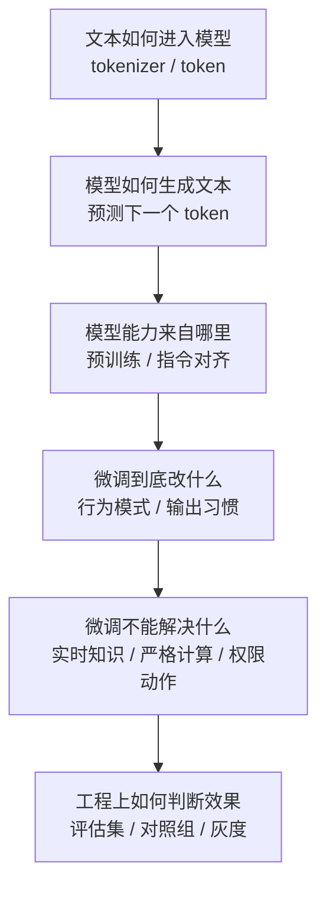
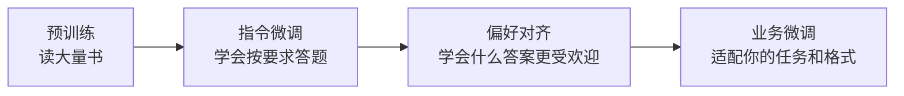
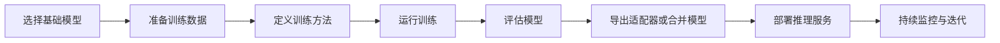
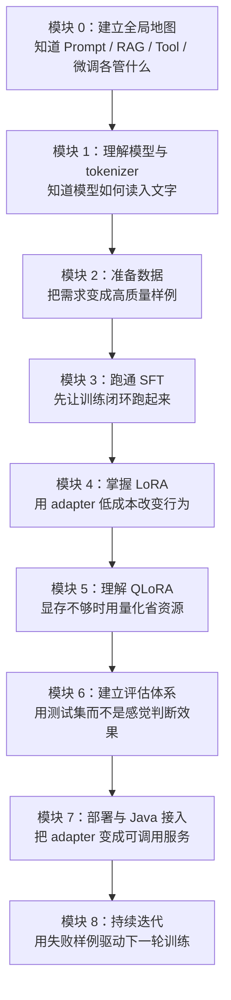
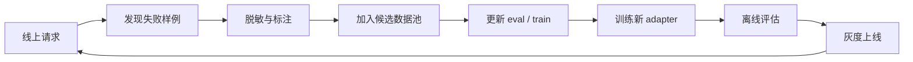
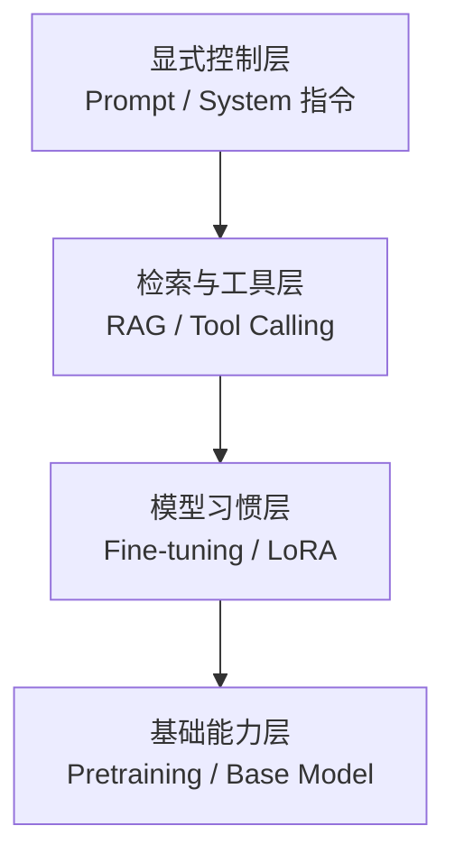
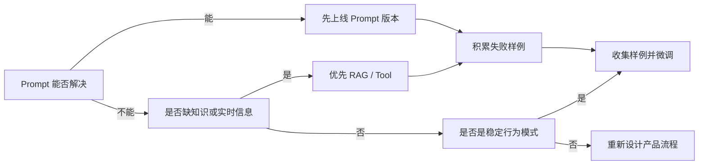
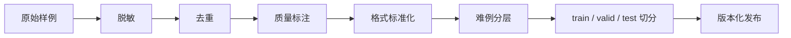

# 开源大模型微调实操教程：从小白到 LoRA-QLoRA 最佳实践

> 面向对象：已经具备软件工程开发能力、常用 Java，但刚开始学习大模型微调的工程师。  
> 目标：理解“为什么要微调、什么时候不该微调、怎么用开源工具做一次可复现的 LoRA/QLoRA 微调”，并掌握实践中的关键坑点。

---

## 0. 一句话总览

大模型微调 (Fine-tuning) 本质上不是“从零训练一个模型”，而是在一个已经学会大量通用知识的基础模型上，用你的少量任务数据，让它更像你想要的“领域助手”。

如果把大模型类比成一个已经读过很多书的程序员：

- **提示词工程 (Prompt Engineering)**：你临时告诉他“这次请按这个格式回答”。
- **检索增强生成 (RAG, Retrieval-Augmented Generation)**：你给他一本资料库，让他回答前先查资料。
- **微调 (Fine-tuning)**：你让他做一批带答案的练习题，逐渐形成稳定习惯。
- **全量训练 (Pretraining)**：从小学开始重新教育一个人，成本极高，普通团队通常不做。

本文重点讲：开源大模型的**监督微调 (Supervised Fine-tuning, SFT)**，尤其是工程上最常用的 **LoRA** 与 **QLoRA**。

---

## 0.5 前置基础知识：先补齐认知地基，再开始微调

如果你是第一次系统学习大模型微调，不建议一上来就看 `SFTTrainer`、`LoraConfig`、`BitsAndBytesConfig` 这些代码。它们只是“工具按钮”。真正重要的是先知道：**大模型为什么能生成文本、它到底学到了什么、微调能改变什么、不能改变什么。**

这一节就是微调前的“认知地基”。



### 0.5.1 大模型不是“搜索引擎”，而是“概率生成器”

小白最容易把大模型理解成一个巨大的搜索引擎：你问它问题，它去某个地方查答案。这个理解不准确。

更准确地说，大模型是在做一件事：

> 根据前面已经出现的 token，预测下一个最可能出现的 token。

例如：

```text
输入：Java 中 MyBatis 的 ${} 风险是
模型预测下一个 token：SQL / 注入 / 风险 / ...
```

它不是先打开一本数据库查“标准答案”，而是根据训练中见过的大量模式，判断接下来最合理的文字是什么。

**这带来三个重要结论：**

1. 模型很擅长生成“看起来合理”的语言；
2. 模型不天然保证事实一定正确；
3. 模型更容易学习“表达模式”，不适合保存频繁变化的事实。

**Java 类比**：

```text
搜索引擎 / 数据库：像 SELECT * FROM docs WHERE keyword = ?
大模型生成：像一个根据上下文不断补全代码和文字的超强自动补全器
```

所以，微调不是给这个“自动补全器”安装一张事实表，而是让它在某些场景下更倾向于补全出你想要的结构、语气、步骤和边界。

### 0.5.2 token 是什么：模型眼里的文字不是你眼里的句子

人类看到的是一句话，模型看到的是 token 序列。

```text
人类看到：请审查这个 MyBatis SQL
模型看到：[请] [审查] [这个] [My] [Batis] [ SQL] ...
```

不同模型的 tokenizer 不同，同一句话切出来的 token 数可能不同。token 数会直接影响：

- 一条训练样例能不能放进上下文窗口；
- 训练显存占用；
- 推理成本；
- 长文本是否被截断；
- 模型是否能完整看到输入和答案。

**前置认知**：

| 概念 | 小白解释 | 为什么重要 |
|---|---|---|
| token | 模型处理文本的基本单位 | 决定长度、成本和截断 |
| tokenizer | 把文本切成 token 的工具 | 必须与模型匹配 |
| context window | 模型一次能看的最大 token 数 | 超过会截断或报错 |
| max_length | 训练时保留的最大长度 | 太小会切掉答案，太大更耗显存 |

**常见坑**：训练样例表面看不长，但 token 数很高；或者 `max_length=1024`，结果长答案后半段全被截断，模型根本没学到完整输出。

**练习建议**：在开始训练前，先统计每条样例的 token 长度，看看 P50、P90、P95 长度，而不是只看字符数。

### 0.5.3 基座模型、指令模型、聊天模型有什么区别？

学习微调前，要先分清三类模型：

| 类型 | 英文 | 小白解释 | 是否适合新手直接做聊天微调 |
|---|---|---|---|
| 基座模型 | Base Model | 主要学会“续写文本” | 不太适合 |
| 指令模型 | Instruct Model | 学过按人类指令回答 | 适合 |
| 聊天模型 | Chat Model | 适配 system/user/assistant 多轮对话 | 很适合 |

基座模型像一个读过很多书但没受过客服训练的人；指令模型像已经培训过“听指令办事”的助理；聊天模型则更熟悉多轮对话格式。

**新手建议**：优先选择 `Instruct` 或 `Chat` 模型做 SFT。不要一开始就拿纯 Base Model 做聊天助手，否则你还要补很多指令对齐能力。

**Java 类比**：

```text
Base Model：裸框架，需要自己补很多约定
Instruct Model：已经配置好常用 starter
Chat Model：已经内置 Controller 请求/响应协议习惯
```

### 0.5.4 预训练、指令微调、偏好对齐、业务微调分别是什么？

很多资料会同时出现 Pretraining、SFT、RLHF、DPO、LoRA、QLoRA，新手容易混成一团。可以按“教育一个新人”的过程理解：



| 阶段 | 目标 | 数据形态 | 普通团队是否常做 |
|---|---|---|---|
| 预训练 | 学语言、知识和通用模式 | 海量文本 | 很少 |
| 指令微调 | 学会听指令回答 | 指令-回答样例 | 有时做，但成本较高 |
| 偏好对齐 | 学会更符合人类偏好的回答 | 好/坏答案对比 | 进阶团队做 |
| 业务微调 | 固化特定任务、格式、风格 | 业务样例 | 最常见 |

本文讲的 LoRA/QLoRA SFT，主要属于“业务微调”。它不是从零造一个模型，而是在已有模型上做局部适配。

### 0.5.5 微调到底在学什么：知识、能力、风格、格式要分开

微调前必须把目标拆清楚。很多失败来自目标混乱：既想让模型知道新知识，又想让它格式稳定，又想让它会调用系统，还想让它变聪明。

可以分成四类：

| 你想改变的东西 | 微调是否适合 | 更推荐方案 |
|---|---|---|
| 输出格式 | 适合 | Prompt + SFT |
| 回答风格 | 适合 | SFT / LoRA |
| 固定任务步骤 | 适合 | SFT + 评估集 |
| 最新知识 | 不适合优先 | RAG |
| 实时状态 | 不适合 | Tool / API |
| 严格计算 | 不适合 | 程序代码 |
| 权限动作 | 不适合单靠模型 | 后端权限系统 |

**核心心法**：

```text
知识放 RAG，动作放 Tool，规则放系统，习惯才放微调。
```

这句话非常重要。微调最适合沉淀的是“习惯”：

- 总是按某个 Markdown 模板输出；
- 总是先给风险等级再给修复建议；
- 总是遇到证据不足先澄清；
- 总是用公司内部约定的术语表达；
- 总是对越权请求拒绝。

### 0.5.6 训练数据不是“知识库”，而是“行为示范集”

新手常问：“我把公司文档喂给模型微调，它是不是就记住了？”

不应该这样想。训练数据更像老师给学生看的标准答案，而不是数据库表。

```text
错误理解：训练集 = 知识库 = 模型会精确记住
正确理解：训练集 = 行为示范集 = 模型学习如何回答
```

如果你的目标是让模型知道公司最新制度、接口文档、产品价格，应该用 RAG；如果你的目标是让模型“每次引用制度时都先说明来源、再总结、最后列风险”，这才适合微调。

**判断一个样例是否适合训练，可以问五个问题：**

1. 这个 assistant 输出是否值得模型模仿？
2. 这个样例是否没有隐私、密钥、内部敏感数据？
3. 这个样例是否代表稳定需求，而不是临时事实？
4. 这个样例是否和其他样例不冲突？
5. 这个样例能否进入评估体系验证效果？

只要有一个答案是否定的，就不要急着放进训练集。

### 0.5.7 loss 不是业务效果：为什么必须建立评估集

训练时你会看到 loss 下降。loss 下降只能说明模型更会拟合训练数据，不等于业务效果一定变好。

```text
loss 下降 ≠ 答案更正确
loss 下降 ≠ 更安全
loss 下降 ≠ 格式更稳定
loss 下降 ≠ 可以上线
```

业务上真正关心的是：

- 常规问题是否更准确；
- 输出格式是否更稳定；
- 不确定时是否会澄清；
- 危险问题是否会拒绝；
- 原来会的能力有没有退化；
- 和基座模型相比是否真的提升。

**Java 类比**：训练 loss 像编译日志里某个指标变好了，但真正能不能上线，要看单元测试、集成测试、回归测试和灰度结果。

所以在训练前就要准备 eval set。不要训练完才想怎么评估。

### 0.5.8 微调的风险前置认知：它会放大数据里的优点，也会放大缺点

微调像带徒弟。你给它看的标准答案越稳定，它越稳定；你给它看的错误越多，它也会认真学习错误。

常见风险：

| 风险 | 解释 | 防范 |
|---|---|---|
| 过拟合 | 只会背训练样例 | 去重、扩展样例、保留测试集 |
| 灾难性遗忘 | 原有能力变差 | 小学习率、LoRA、回归评估 |
| 格式固化过度 | 任何问题都套模板 | 增加多样性和澄清样例 |
| 安全边界变弱 | 学了不该回答的样例 | 加拒答样例和安全评估 |
| 隐私泄露 | 训练数据含敏感信息 | 脱敏、过滤、审计 |
| 幻觉增强 | 把猜测写得更像事实 | 增加引用、澄清、不确定表达样例 |

**前置原则**：如果你还没有数据治理、评估集、版本记录，就不要急着追求更大模型和更多参数。

### 0.5.9 微调项目的最小知识地图

开始动手前，建议至少掌握下面这张地图：

| 模块 | 你需要知道什么 | 不需要一开始深挖什么 |
|---|---|---|
| 模型基础 | token、上下文、生成机制 | Transformer 数学细节 |
| 模型类型 | Base / Instruct / Chat 区别 | 从零预训练 |
| 数据格式 | messages、system/user/assistant | 复杂数据混合策略 |
| SFT | 输入输出监督学习 | RLHF / PPO |
| LoRA | adapter、rank、target_modules | 矩阵分解证明 |
| QLoRA | 4-bit、省显存、bitsandbytes | 量化理论推导 |
| 评估 | baseline、eval set、评分表 | 全自动评测平台 |
| 部署 | adapter 加载、HTTP 服务、日志 | 大规模多租户推理集群 |

小白阶段要避免“知识过载”。你不需要先成为大模型研究员，才能完成第一次工程微调。你需要的是：

1. 知道每个概念在工程链路里的位置；
2. 能跑通最小闭环；
3. 能用评估判断是否变好；
4. 能复现、回滚和继续迭代。

### 0.5.10 开始微调前的 12 个自检问题

在进入下一节“你真的需要微调吗”之前，先问自己 12 个问题：

- [ ] 这个需求是缺知识，还是缺稳定行为？
- [ ] 如果只是缺最新知识，为什么不用 RAG？
- [ ] 如果需要实时查询，为什么不用 Tool / API？
- [ ] 我是否已经用 Prompt 做过强基线？
- [ ] 我是否有 20 条以上值得模仿的高质量样例？
- [ ] 我是否知道训练格式和推理格式要一致？
- [ ] 我是否准备了不进入训练集的 eval set？
- [ ] 我是否有基座模型对照输出？
- [ ] 我是否记录数据版本、参数版本和 adapter 版本？
- [ ] 我是否排除了隐私、密钥、敏感数据？
- [ ] 我是否知道上线后如何回滚？
- [ ] 我是否能解释这次微调要固化的“习惯”是什么？

如果这些问题大部分答不上来，不是不能学微调，而是应该先做小实验，不要直接进入生产项目。

---

## 1. 先判断：你真的需要微调吗？

很多新手一上来就想微调，这是常见误区。微调不是万能钥匙。

### 1.1 适合微调的场景

适合微调的问题通常满足以下至少一项：

1. **固定输出风格**：例如客服话术、报告格式、代码审查格式、内部文档风格。
2. **固定任务模式**：例如“把需求转成测试用例”“把日志归因到故障类型”“SQL 片段生成”。
3. **模型已经会，但不稳定**：提示词能做出来，但每次格式、口吻、步骤不一致。
4. **要降低推理提示词长度**：原来每次都要塞很长 system prompt，微调后可以把部分行为固化进模型。
5. **要适配领域表达习惯**：比如医疗、法律、金融、运维、企业内部术语，但前提是数据合规。

### 1.2 不适合直接微调的场景

以下场景优先考虑 RAG、工具调用或产品设计，而不是微调：

| 需求 | 更优方案 | 原因 |
|---|---|---|
| 让模型知道最新文档、数据库内容 | RAG | 知识更新快，微调会过期 |
| 让模型查订单、查库存、查用户状态 | Tool Calling / Agent | 这是实时系统状态，不该写进权重 |
| 让模型严格计算、执行交易 | 工具/代码 | 模型不是确定性计算引擎 |
| 数据很少且质量很差 | 先做数据治理 | 垃圾进，垃圾出 |
| 想让小模型拥有大模型全部能力 | 不现实 | 微调不能凭空创造基础能力 |

> 实战原则：**先 Prompt，再 RAG，再微调；能不动权重就不动权重。**

---

## 2. 微调路线图：从 Java 工程师视角理解

Java 开发里你熟悉“接口、实现、配置、测试、发布”。微调也可以这样理解：



对应软件工程类比：

| 微调环节 | Java/工程类比 |
|---|---|
| 基础模型 | 依赖的基础框架，如 Spring Boot |
| 数据集 | 测试用例 + 需求样例 |
| LoRA adapter | 插件/扩展模块，不改原框架核心 |
| 训练参数 | 构建配置、JVM 参数、线程池参数 |
| eval 集 | 回归测试集 |
| checkpoint | 构建产物快照 |
| 推理服务 | 后端服务部署 |

---

## 3. 核心概念：SFT、LoRA、QLoRA

### 3.1 监督微调 (SFT)

监督微调 (Supervised Fine-tuning, SFT) 是最常见的入门路线：给模型很多“输入 → 期望输出”的样例，让模型学习在类似输入下生成类似输出。

典型数据格式：

```json
{
  "messages": [
    {"role": "system", "content": "你是一个严谨的 Java 代码审查助手。"},
    {"role": "user", "content": "请审查以下 MyBatis SQL 片段..."},
    {"role": "assistant", "content": "以下是审查结论：\n1. ..."}
  ]
}
```

SFT 学的是“行为模式”，不是资料库。它更擅长学：

- 如何回答；
- 按什么结构回答；
- 对某类输入做什么转换；
- 哪些语气和边界更符合你的产品要求。

### 3.2 LoRA：只训练一小部分参数

LoRA (Low-Rank Adaptation) 的思想是：不直接修改大模型的全部权重，而是在模型中的某些线性层旁边加一个很小的“可训练旁路”。训练时冻结原模型，只训练这些小矩阵。

```text
原始模型层：
Input ──▶ [ 大模型原始权重 W：冻结 ] ──▶ Output

LoRA 后：
Input ──▶ [ 原始权重 W：冻结 ] ─────────────▶ + ──▶ Output
       └▶ [ LoRA 小矩阵 A/B：可训练 ] ───────┘
```

好处：

- 显存需求低；
- 训练速度快；
- 产物小，通常只保存 adapter；
- 一个基础模型可以挂多个不同任务 adapter。

### 3.3 QLoRA：量化基础模型 + 训练 LoRA

QLoRA (Quantized LoRA) 是更省显存的 LoRA。它把基础模型用 4-bit 量化加载，基础模型仍然冻结，只训练 LoRA adapter。

你可以粗略理解为：

- LoRA：原模型用较高精度放在显存里，只训练小插件；
- QLoRA：原模型压缩成 4-bit 放进显存里，再训练小插件。

适合个人开发者、单卡实验、消费级 GPU。

---

## 4. 环境准备

### 4.1 推荐硬件

| 模型规模 | 建议方式 | 粗略显存建议 |
|---|---|---|
| 0.5B - 1.5B | LoRA / 全参小实验 | 8GB 也可尝试 |
| 3B - 7B | QLoRA | 12GB - 24GB 更稳 |
| 8B - 14B | QLoRA / 多卡 | 24GB+ 更稳 |
| 30B+ | 多卡、云 GPU、专业框架 | 不建议新手本地硬刚 |

没有 GPU 也能学习流程，但训练会很慢。建议先用小模型跑通闭环。

### 4.2 推荐软件栈

主流开源路线：

- Python 3.10+；
- PyTorch；
- Hugging Face Transformers；
- Hugging Face Datasets；
- Hugging Face PEFT；
- Hugging Face TRL；
- bitsandbytes（做 4-bit/8-bit 量化）；
- accelerate（设备和分布式辅助）。

安装示例：

```bash
python -m venv .venv
source .venv/bin/activate
pip install -U pip
pip install torch transformers datasets peft trl accelerate bitsandbytes
```

> 如果是 macOS Apple Silicon，可以学习数据处理和小模型推理，但很多 bitsandbytes 量化训练路径主要面向 NVIDIA CUDA，实际训练建议使用 Linux + NVIDIA GPU。

---

## 5. 第一次实操：用 TRL + PEFT 做 LoRA/QLoRA SFT

下面示例用 Hugging Face TRL 的 `SFTTrainer` 和 PEFT 的 `LoraConfig`。目标是让你理解完整流程，而不是追求最高效果。

### 5.1 选择基础模型

入门建议选小模型：

- `Qwen/Qwen2.5-0.5B-Instruct`
- `Qwen/Qwen2.5-1.5B-Instruct`
- `Qwen/Qwen3-0.6B` 系列
- 其他明确支持 transformers 加载的开源 Causal LM

选择原则：

1. 模型 license 允许你的用途；
2. 模型本身已有目标语言能力；
3. tokenizer 和 chat template 支持稳定；
4. 先小模型跑通，再换大模型。

### 5.2 准备数据集

创建一个 `train.jsonl`：

```jsonl
{"messages":[{"role":"system","content":"你是一个严谨的 Java 后端代码审查助手。"},{"role":"user","content":"请审查这个 MyBatis SQL：select * from user where name = '${name}'"},{"role":"assistant","content":"风险：这里使用 ${} 会产生 SQL 注入风险。建议改为 #{name} 参数绑定，并限制返回字段，避免 select *。"}]}
{"messages":[{"role":"system","content":"你是一个严谨的 Java 后端代码审查助手。"},{"role":"user","content":"Mapper XML 中 if test 判断空字符串应该注意什么？"},{"role":"assistant","content":"应同时考虑 null 与空字符串，例如 name != null and name != ''. 对集合还要判断 size，并避免 OGNL 表达式过复杂。"}]}
```

真实项目里至少准备几十到几百条高质量样例；生产级效果通常需要更多数据和严格评估。

### 5.3 训练脚本

保存为 `train_sft_lora.py`：

```python
from datasets import load_dataset
from peft import LoraConfig
from trl import SFTConfig, SFTTrainer

model_id = "Qwen/Qwen2.5-0.5B-Instruct"

# 读取 jsonl 数据，每行一个样本
train_dataset = load_dataset("json", data_files="train.jsonl", split="train")

# LoRA 配置：新手先用中等保守值
peft_config = LoraConfig(
    r=16,
    lora_alpha=32,
    lora_dropout=0.05,
    bias="none",
    task_type="CAUSAL_LM",
    target_modules=["q_proj", "k_proj", "v_proj", "o_proj"],
)

training_args = SFTConfig(
    output_dir="./outputs/qwen-java-review-lora",
    per_device_train_batch_size=1,
    gradient_accumulation_steps=8,
    num_train_epochs=1,
    learning_rate=2e-4,
    logging_steps=1,
    save_steps=50,
    max_length=1024,
    report_to=[],
    assistant_only_loss=True,
)

trainer = SFTTrainer(
    model=model_id,
    args=training_args,
    train_dataset=train_dataset,
    peft_config=peft_config,
)

trainer.train()
trainer.save_model("./outputs/qwen-java-review-lora/final")
```

运行：

```bash
python train_sft_lora.py
```

### 5.4 如果显存不够：启用 QLoRA

QLoRA 关键是 4-bit 加载基础模型。不同版本 API 会略有变化，核心配置如下：

```python
import torch
from transformers import BitsAndBytesConfig

quantization_config = BitsAndBytesConfig(
    load_in_4bit=True,
    bnb_4bit_quant_type="nf4",
    bnb_4bit_compute_dtype=torch.bfloat16,
    bnb_4bit_use_double_quant=True,
)
```

再把它传给 trainer 或模型加载逻辑。实践中如果 GPU 不支持 bfloat16，可以尝试 float16。

---

## 6. 数据最佳实践：效果的 70% 来自数据

微调项目最容易失败的地方不是代码，而是数据。

### 6.1 高质量样例长什么样？

好的样例应满足：

- 输入真实，来自目标业务场景；
- 输出稳定，符合你希望模型学习的风格；
- 没有互相矛盾的标签；
- 不混入隐私、密钥、内部敏感信息；
- 覆盖常见场景、边界场景、拒答场景。

### 6.2 数据量建议

| 阶段 | 数据量 | 目标 |
|---|---:|---|
| 玩具实验 | 10 - 50 条 | 跑通训练流程 |
| 风格适配 | 100 - 1000 条 | 观察输出风格变化 |
| 任务适配 | 1000 - 10000 条 | 稳定提升特定任务 |
| 生产级 | 视任务而定 | 需要评估集、灰度、监控 |

### 6.3 数据切分

至少分三份：

- `train`：训练用；
- `validation`：训练期间观察过拟合；
- `test`：最终评估，只在关键节点使用。

不要把测试题泄露进训练集，否则你看到的是“背题”，不是泛化能力。

### 6.4 Chat template 很重要

聊天模型不是直接拼接文本，它依赖聊天模板 (Chat Template) 把 `system/user/assistant` 转成模型能理解的 token 序列。

最佳实践：

- 使用模型官方 tokenizer 自带的 chat template；
- 不要随意自造角色分隔符；
- 如果用 `assistant_only_loss=True`，要确认模板支持 assistant 区间标记；
- EOS token 要和模型模板对齐，否则模型可能不停生成或提前停止。

---

## 7. LoRA 参数怎么调？

常见参数：

| 参数 | 含义 | 新手建议 |
|---|---|---|
| `r` | LoRA rank，越大容量越强、参数越多 | 8/16/32 起步 |
| `lora_alpha` | LoRA 缩放因子 | 常取 r 或 2r |
| `lora_dropout` | dropout，防过拟合 | 0.05 常用 |
| `target_modules` | 把 LoRA 加到哪些层 | 先 attention，效果不够再 all-linear |
| `bias` | 是否训练 bias | 新手用 `none` |
| `task_type` | 任务类型 | 文本生成用 `CAUSAL_LM` |

官方 PEFT/TRL 文档中常见建议：

- LoRA/PEFT 只训练少量参数，学习率通常比全参微调更高，SFT LoRA 常见 `2e-4` 左右；
- QLoRA 常使用 4-bit NF4 量化，并启用 double quantization；
- QLoRA 风格训练常把 `target_modules="all-linear"` 作为强基线，覆盖更多线性层；
- 如果只想省显存，先从 LoRA/QLoRA 开始，不要一上来做全参微调。

---

## 8. 训练过程怎么看是否正常？

你会看到 loss 下降，但不要迷信 loss。

### 8.1 正常现象

- loss 从较高值逐步下降；
- 显存占用稳定；
- 每隔若干 step 保存 checkpoint；
- 用固定测试 prompt 观察，输出格式越来越接近期望。

### 8.2 危险信号

| 现象 | 可能原因 | 处理 |
|---|---|---|
| loss 不降 | 数据格式错误、学习率太低、没有训练到 adapter | 检查 trainable params、样例格式 |
| loss 很快接近 0 | 数据太少、过拟合、重复样例 | 增加验证集、去重 |
| 输出开始胡言乱语 | 学习率过高、数据质量差 | 降学习率、清洗数据 |
| 模型只会一种模板 | 数据过于单一 | 增加多样性 |
| 生成停不下来 | EOS/tokenizer/chat template 不匹配 | 检查 eos_token |

---

## 9. 评估：不要只凭感觉

微调后至少做三类评估：

### 9.1 固定回归集

准备 50 - 200 条不会进入训练集的问题，每次训练后用同一批问题测试。

评估维度：

- 格式是否稳定；
- 是否遵守 system 指令；
- 是否减少幻觉；
- 是否覆盖关键点；
- 是否出现安全或合规问题。

### 9.2 人工评分表

示例：

| 维度 | 1 分 | 3 分 | 5 分 |
|---|---|---|---|
| 正确性 | 明显错误 | 基本可用但有遗漏 | 准确完整 |
| 格式 | 不符合要求 | 大体符合 | 完全符合 |
| 稳定性 | 每次差异大 | 偶有波动 | 稳定一致 |
| 安全性 | 可能泄露/误导 | 有小风险 | 边界清楚 |

### 9.3 与基座模型对比

永远保留“未微调基座模型 + 同样 prompt”的对照组。否则你不知道改进来自微调，还是 prompt、数据或随机波动。

---

## 10. 保存、加载与部署

### 10.1 保存 adapter

LoRA/QLoRA 通常只保存 adapter：

```python
trainer.save_model("./adapter")
```

部署时加载基础模型，再挂 adapter：

```python
from transformers import AutoModelForCausalLM, AutoTokenizer
from peft import PeftModel

base_model_id = "Qwen/Qwen2.5-0.5B-Instruct"
adapter_path = "./adapter"

tokenizer = AutoTokenizer.from_pretrained(base_model_id)
base_model = AutoModelForCausalLM.from_pretrained(base_model_id, device_map="auto")
model = PeftModel.from_pretrained(base_model, adapter_path)
```

### 10.2 是否合并模型？

- **保留 adapter**：灵活、省空间，适合多任务、多版本。
- **合并到基础模型**：部署简单，适合某些推理框架或生产发布。

合并前要确认 license、存储成本和推理框架支持。

### 10.3 Java 系统如何接入？

Java 项目通常不直接在 JVM 里训练模型，而是：

```text
Java 业务系统
   │ HTTP/gRPC
   ▼
模型推理服务（vLLM / TGI / Ollama / 自建 FastAPI）
   │
   ▼
基础模型 + LoRA adapter / 合并模型
```

Java 侧负责：

- 鉴权；
- 请求构造；
- Prompt 模板管理；
- 超时、重试、限流；
- 日志与评估样本回收；
- 业务安全策略。

模型服务侧负责：

- tokenizer；
- 推理加速；
- adapter 加载；
- batch；
- GPU 资源管理。

---

## 11. 新手最推荐的学习路线：按模块闯关，而不是按名词硬背

这一节是给“小白但有工程基础”的学习路线。核心思想是：**不要把微调当成一堆陌生名词去背，而要把它拆成一个可交付项目的 8 个模块。**

你可以把整条路线理解成一次 Java 项目从需求到上线的交付过程：



> 新手心法：**先形成地图，再跑通闭环；先会验证，再谈优化；先小模型成功，再扩大规模。**

### 11.1 模块 0：先建立全局地图——知道什么时候不该微调

**学习目标**：先把 Prompt、RAG、Tool Calling、Fine-tuning 的边界分清楚。

很多新手的第一个误区是：看到模型答得不好，就立刻想“是不是该微调”。实际上，微调只是最后几种手段之一。

你可以用下面这张决策表先判断：

| 问题类型 | 优先方案 | 小白解释 |
|---|---|---|
| 输出格式不稳定 | Prompt → 微调 | 先写清楚要求；如果每次还乱，再用样例训练习惯 |
| 缺少最新知识 | RAG | 让模型先查资料，而不是把资料背进权重 |
| 需要查询订单/库存/数据库 | Tool Calling | 让模型调用接口，不能靠“猜” |
| 某类任务反复做但不稳定 | 微调 | 例如代码审查、报告改写、客服风格统一 |
| 要做严格计算或交易 | 程序/规则系统 | 模型不是会计，也不是数据库事务引擎 |

**类比 Java**：

- Prompt 像一次方法调用时传入的参数；
- RAG 像查数据库或 Elasticsearch；
- Tool Calling 像调用一个后端服务；
- 微调像给框架装一个插件，让它默认就更符合你的项目习惯。

**练习任务**：找 5 个你想用模型解决的问题，逐个判断：它应该用 Prompt、RAG、Tool 还是微调？

**过关标准**：你能说清楚“为什么这个问题不应该直接微调”。

### 11.2 模块 1：理解模型如何读文字——tokenizer、上下文窗口、chat template

**学习目标**：知道训练脚本里最容易被忽略但最容易出坑的三件事：tokenizer、上下文长度、chat template。

小白常以为模型直接读中文句子。实际上，模型先通过 tokenizer 把文本切成 token，再按模型训练时习惯的格式组织输入。

```text
用户看到的文本
  ↓ tokenizer 切分
token 序列
  ↓ chat template 包装 system/user/assistant
模型真正看到的训练输入
```

三个关键概念：

1. **tokenizer**：模型的“分词器”。不同模型的 tokenizer 不一样，不能乱换。
2. **上下文窗口 (Context Window)**：模型一次最多能读多少 token。样例过长会被截断。
3. **聊天模板 (Chat Template)**：把 `system/user/assistant` 变成模型熟悉的格式。

**类比 Java**：chat template 就像 Controller 的请求 DTO 协议。如果训练时用 A 协议，推理时用 B 协议，就像前后端字段对不上，结果会很怪。

**练习任务**：

- 用同一个问题，分别打印 tokenizer 后的 token 数；
- 看看模型官方 tokenizer 是否自带 `chat_template`；
- 故意把样例写得很长，观察是否超过 `max_length`。

**过关标准**：你知道为什么“训练格式”和“推理格式”必须一致。

### 11.3 模块 2：准备数据——微调不是喂聊天记录，而是写标准答案

**学习目标**：学会把业务需求改造成训练样例。

训练数据不是“越多越好”，而是“越像你希望模型学会的行为越好”。一条高质量样例通常包括：

```json
{
  "messages": [
    {"role": "system", "content": "你是一个严谨的 Java 后端代码审查助手。"},
    {"role": "user", "content": "请审查以下 MyBatis SQL..."},
    {"role": "assistant", "content": "风险等级：高\n问题：...\n原因：...\n修复建议：..."}
  ]
}
```

你要重点训练的是 assistant 的“好答案”。如果好答案写得乱，模型就会学乱。

**数据建设四层法**：

| 层级 | 要做什么 | 例子 |
|---|---|---|
| 常规样例 | 教模型会做基本任务 | 正常 SQL 审查 |
| 边界样例 | 教模型遇到信息不足会澄清 | SQL 片段不完整 |
| 拒答样例 | 教模型知道不能做什么 | 要求生成绕过审计的 SQL |
| 格式样例 | 教模型稳定输出结构 | 固定输出 JSON / Markdown 表格 |

**类比 Java 测试**：训练集像你给初级工程师看的标准实现；评估集像单元测试；拒答样例像安全测试。

**练习任务**：先不要追求 1000 条数据，先手写 20 条“非常干净”的样例：10 条常规、5 条边界、3 条格式、2 条拒答。

**过关标准**：随机抽 5 条样例，你都愿意让模型模仿其中的 assistant 输出。

### 11.4 模块 3：跑通 SFT——先让最小闭环成功一次

**学习目标**：用很少的数据跑通一次完整 SFT，不追求效果，只追求闭环。

SFT 的核心就是：给模型看很多“输入 → 标准输出”的例子，让它更容易在类似输入下输出类似答案。

```text
train.jsonl
  ↓
SFTTrainer / 训练脚本
  ↓
checkpoint / adapter
  ↓
推理脚本验证
  ↓
记录结果
```

第一轮训练建议：

- 模型：选 0.5B、1.5B 这种小模型；
- 数据：10 - 50 条即可；
- epoch：1 轮即可；
- 目标：确认脚本、数据格式、产物保存、加载推理都能跑通。

**不要在第一轮纠结这些问题**：

- loss 为什么不是最低；
- rank 要不要调大；
- 是否要换 7B；
- 是否要上多卡；
- 效果能不能直接生产。

第一轮只回答一个问题：**链路通不通？**

**练习任务**：完成一次从 `train.jsonl` 到 adapter，再到推理输出的完整闭环。

**过关标准**：你能删除输出目录后重新跑一遍，并得到同样结构的训练产物。

### 11.5 模块 4：掌握 LoRA——把它理解成“可插拔补丁”

**学习目标**：理解为什么 LoRA 是新手最重要的微调方法。

LoRA 不直接改基础模型的大权重，而是在旁边加一组小矩阵。基础模型冻结，训练时只更新这些小矩阵。

```text
基础模型：像 Spring Boot 框架本体，不轻易改
LoRA adapter：像你写的 starter / plugin，只改变特定行为
```

LoRA 的几个核心参数：

| 参数 | 小白理解 | 入门建议 |
|---|---|---|
| `r` | adapter 的容量 | 8 / 16 起步 |
| `lora_alpha` | adapter 影响力缩放 | 常用 16 / 32 |
| `lora_dropout` | 防止学太死 | 0.05 常用 |
| `target_modules` | LoRA 挂到哪些层 | 先 attention，再考虑 all-linear |
| `learning_rate` | 学习速度 | LoRA SFT 可从 `2e-4` 附近试 |

**关键理解**：LoRA 不是“低配版微调”，而是工程上非常实用的“最小可变更层”。它便宜、可回滚、可多版本并存。

**练习任务**：固定数据和模型，只比较 `r=8` 与 `r=16` 两次训练输出差异。

**过关标准**：你能解释 adapter 为什么比全量模型更容易版本管理和回滚。

### 11.6 模块 5：理解 QLoRA——不是更神秘，只是更省显存

**学习目标**：知道 QLoRA 解决什么问题，以及它新增了哪些环境复杂度。

QLoRA = 量化加载基础模型 + 训练 LoRA adapter。

```text
LoRA：基础模型正常精度加载，训练 adapter
QLoRA：基础模型 4-bit 压缩加载，训练 adapter
```

它主要解决：**显存不够**。

但它也带来更多工程坑：

- CUDA、PyTorch、bitsandbytes 版本兼容；
- GPU 是否支持 `bfloat16`；
- 4-bit 量化配置是否正确；
- 推理框架是否支持对应 adapter / 量化方式。

**新手建议**：如果 LoRA 已经能跑，不要急着上 QLoRA。先理解 LoRA，再把 QLoRA 当作“资源优化版本”。

**练习任务**：在同一份数据上，分别记录 LoRA 与 QLoRA 的显存占用、训练时间、输出差异。

**过关标准**：你能说清楚“QLoRA 是为省显存，不是自动提升效果”。

### 11.7 模块 6：建立评估体系——没有 eval，就没有微调成功

**学习目标**：建立固定评估集，用证据判断模型是否变好。

新手最容易用“感觉”评估：看两三个输出不错，就觉得成功了。这非常危险。

一个最小评估体系包括：

```text
baseline：未微调基础模型输出
candidate：微调后模型输出
eval set：固定不进入训练集的问题
score rubric：评分表
failure log：失败样例记录
```

评估集至少覆盖三类：

1. **会**：正常任务是否做对；
2. **不会**：信息不足时是否澄清；
3. **不能**：危险、越权、隐私问题是否拒绝。

**类比 Java**：没有评估集就像没有测试用例；模型偶尔输出对了，不等于系统质量稳定。

**练习任务**：准备 50 条不会进入训练集的 eval 样例，每次训练后都跑同一批问题。

**过关标准**：你能写出一份 eval report，说明哪些维度提升、哪些维度退化。

### 11.8 模块 7：部署与 Java 接入——训练只是开始，上线才是工程

**学习目标**：理解 Java 项目如何使用微调后的模型。

生产里通常不是 Java 直接训练模型，而是 Java 调模型服务：

```text
Java / Spring Boot 业务系统
  ├─ 鉴权、限流、日志
  ├─ Prompt 模板管理
  ├─ HTTP/gRPC 调用
  ▼
模型推理服务
  ├─ vLLM / TGI / Ollama / FastAPI
  ├─ 基础模型
  └─ LoRA adapter / 合并模型
```

Java 侧重点不是训练，而是工程治理：

- 请求参数校验；
- 超时与重试；
- 用户权限；
- 日志脱敏；
- 失败样例回收；
- 灰度发布与回滚。

**练习任务**：写一个最小 Spring Boot controller，调用本地模型服务，并记录输入、输出、耗时、adapter 版本。

**过关标准**：你能从 Java 日志追踪一次模型请求使用了哪个 adapter、哪个 prompt 模板和哪个模型版本。

### 11.9 模块 8：持续迭代——用失败样例驱动下一轮训练

**学习目标**：建立“线上失败 → 标注 → 评估 → 训练 → 灰度”的闭环。

微调不是一次性动作。真正有价值的是持续迭代：



每一轮迭代都要回答：

- 新数据解决了哪些失败？
- 有没有引入新的退化？
- 与上一版 adapter 相比，评估分数如何？
- 是否需要回滚？

**过关标准**：你不再把微调看成“训练一次模型”，而是把它看成“数据、评估、模型、服务的持续交付系统”。

### 11.10 推荐学习节奏：7 天入门版 + 30 天工程版

如果你只想快速入门，可以按 7 天走：

| 天数 | 学习重点 | 产物 |
|---|---|---|
| 第 1 天 | Prompt / RAG / Tool / 微调边界 | 一页决策表 |
| 第 2 天 | tokenizer、chat template、数据格式 | 20 条干净样例 |
| 第 3 天 | 跑通最小 SFT | 第一个 checkpoint / adapter |
| 第 4 天 | LoRA 参数与 adapter 加载 | LoRA demo |
| 第 5 天 | QLoRA 与显存优化 | 显存记录表 |
| 第 6 天 | eval set 与评分表 | 50 条评估集 + 评分规则 |
| 第 7 天 | Java 接入与复盘 | 一个 HTTP 调用 demo + 复盘文档 |

如果你想做成真正可交付项目，按 30 天走：

| 阶段 | 时间 | 目标 | 产物 |
|---|---:|---|---|
| 地图建立 | 第 1-3 天 | 搞清边界和术语 | 学习笔记、术语表、方案决策表 |
| 闭环跑通 | 第 4-7 天 | 小模型完成一次 LoRA | 可复现训练 demo |
| 数据建设 | 第 8-14 天 | 做 100-300 条高质量样例 | train/valid/test v0.1 |
| 评估体系 | 第 15-18 天 | 固定回归集和评分表 | eval report v0.1 |
| 迭代训练 | 第 19-24 天 | 调数据、学习率、rank | adapter v0.2 / v0.3 |
| 服务接入 | 第 25-28 天 | HTTP 服务接入 Java 应用 | demo API、调用日志、回滚方案 |
| 复盘沉淀 | 第 29-30 天 | 总结效果、风险、下一步 | 项目复盘文档 |

### 11.11 小白学习检查清单

学完这一节，你应该能回答下面问题：

- [ ] 什么时候应该用 Prompt，什么时候应该用 RAG，什么时候才考虑微调？
- [ ] 为什么训练格式和推理格式必须一致？
- [ ] 什么样的数据适合进入训练集？什么样的数据必须排除？
- [ ] SFT、LoRA、QLoRA 的关系是什么？
- [ ] 为什么 LoRA adapter 适合版本化和回滚？
- [ ] 为什么 loss 下降不等于业务效果变好？
- [ ] Java 系统在模型微调项目里主要负责什么？
- [ ] 如何用失败样例驱动下一轮训练？

> 最后一条小白建议：**不要追求“一次学懂所有名词”。你只要先跑通一次最小闭环，再带着问题回头看概念，理解会快很多。**

---

## 12. 最佳实践清单

### 12.1 项目启动前

- [ ] 明确目标：风格、格式、任务能力，还是领域适配？
- [ ] 先测试 prompt/RAG 是否足够。
- [ ] 明确模型 license。
- [ ] 明确数据合规边界。
- [ ] 先选小模型跑通闭环。

### 12.2 数据准备

- [ ] 使用真实任务样例。
- [ ] 输出格式保持一致。
- [ ] 删除重复、矛盾、低质量样例。
- [ ] 保留拒答和安全边界样例。
- [ ] 切分 train/validation/test。
- [ ] 不把测试集混进训练集。

### 12.3 训练配置

- [ ] 新手优先 LoRA/QLoRA。
- [ ] `r=8/16/32` 起步。
- [ ] `lora_dropout=0.05` 起步。
- [ ] LoRA SFT 学习率可从 `2e-4` 左右起步。
- [ ] QLoRA 使用 NF4 与 double quantization。
- [ ] 记录所有参数，保证可复现。

### 12.4 评估与上线

- [ ] 与基座模型对比。
- [ ] 固定评估集回归。
- [ ] 记录失败样例。
- [ ] 灰度上线，不一次性替换。
- [ ] 监控输出质量、延迟、成本和安全问题。

---

## 13. 常见误区

1. **以为微调能注入知识**：微调更适合固化行为，知识更新优先 RAG。
2. **数据越多越好**：低质量数据越多，模型越容易学坏。
3. **只看 loss**：业务效果必须用评估集和人工评分验证。
4. **一上来训练大模型**：先用小模型跑通流程。
5. **忽略 chat template**：模板不对，训练和推理格式不一致，效果会崩。
6. **没有对照组**：不知道微调是否真的带来提升。
7. **把隐私数据放进训练集**：权重和日志都可能产生合规风险。

---

## 14. 一个最小可执行项目目录

```text
llm-finetune-demo/
  ├── train.jsonl
  ├── eval.jsonl
  ├── train_sft_lora.py
  ├── infer.py
  ├── requirements.txt
  ├── outputs/
  └── README.md
```

`requirements.txt`：

```text
torch
transformers
datasets
peft
trl
accelerate
bitsandbytes
```

建议把每次训练参数写入 `runs/YYYYMMDD-HHMM/config.yaml`，像 Java 项目保存构建配置一样保存训练配置。

---

## 15. 微调路径哲学：先系统后模型，先数据后参数

微调最难的地方，不是写出一段 `trainer.train()`，而是判断：**这件事到底应该通过提示词、RAG、工具、微调，还是重新设计产品流程来解决。**

很多人把微调理解成“让模型变聪明”，这句话很容易误导。更准确地说：

> 微调不是给模型灌输一整个新世界，而是把某类稳定行为压进模型的条件反射里。

### 15.1 第一性原理：模型权重不是数据库

大模型的权重更像“经验和习惯”，不是“事实表”。

```text
数据库 / 知识库：适合保存明确、可更新、可追溯的事实
模型权重：适合保存模式、风格、偏好、表达习惯和任务映射
工具系统：适合执行确定性动作、查询实时状态、调用外部 API
产品流程：适合约束用户输入、降低问题复杂度、提供人工兜底
```

所以你要先问四个问题：

1. 这个能力是否依赖**实时变化的信息**？如果是，优先 RAG 或工具。
2. 这个能力是否要求**严格可解释、可审计**？如果是，优先规则、工作流、评估系统。
3. 这个能力是否只是**输出格式或风格不稳定**？如果是，微调可能有效。
4. 这个能力是否已经能被强 prompt 稳定实现？如果是，微调才有压缩成本和固化行为的价值。

### 15.2 微调的本质：从“显式指令”变成“隐式习惯”

可以把模型行为分成三层：



- **Prompt 层**：最容易改，适合快速试错。
- **RAG/工具层**：适合接入知识、数据库、业务动作。
- **微调层**：适合固化重复、稳定、可学习的行为。
- **预训练层**：普通团队基本不碰，成本极高。

一个成熟团队不会一开始就微调，而是按下面路径推进：



### 15.3 学习路径哲学：不要从大模型开始，要从闭环开始

小白最容易犯的错误是：一开始就追求“我要微调 7B、14B、70B”。真正的学习路径应该是：

1. **先跑通闭环**：10 条样例也可以，重点是知道数据如何进、模型如何训、产物如何出。
2. **再建立评估**：没有评估，就不知道模型是否变好。
3. **再扩大数据**：数据质量优先于数据数量。
4. **再调参数**：不要用参数掩盖数据问题。
5. **最后再换大模型**：大模型会放大你的好数据，也会放大你的坏数据。

```text
错误路径：大模型 → 大显卡 → 大参数 → 看 loss → 凭感觉上线
正确路径：小模型 → 小数据 → 跑通闭环 → 建评估 → 清数据 → 扩规模
```

### 15.4 微调与软件工程的共同哲学

对 Java 工程师来说，理解微调最好的方式不是“炼丹”，而是“工程交付”。

| 软件工程 | 微调工程 | 哲学 |
|---|---|---|
| 需求分析 | 明确模型目标 | 不解决伪需求 |
| 单元测试 | eval 样例 | 没有测试就没有质量 |
| 集成测试 | 端到端对话评估 | 看整体链路，不只看 loss |
| 版本管理 | 数据集/模型/参数版本化 | 可复现才可迭代 |
| 灰度发布 | 小流量模型上线 | 不用一次性赌生产 |
| 监控告警 | 输出质量/安全/延迟监控 | 上线不是结束 |

微调项目的成熟度，不看你能不能跑训练脚本，而看你是否能回答：

- 这次训练用了哪版数据？
- 哪些样例进了训练集，哪些留作评估？
- 相比基座模型提升在哪里？
- 哪些能力退化了？
- 失败样例如何回流？
- 如何回滚到上一个 adapter？

### 15.5 路线选择哲学：全参、LoRA、QLoRA 怎么选？

| 路线 | 本质 | 适合谁 | 优点 | 风险 |
|---|---|---|---|---|
| Prompt | 不训练，只改指令 | 所有人 | 快、便宜、可解释 | 稳定性有限 |
| RAG | 外挂知识库 | 文档/知识问答 | 知识可更新 | 检索质量决定上限 |
| LoRA | 冻结基座，只训 adapter | 大多数团队 | 成本低、产物小 | 需要好数据和评估 |
| QLoRA | 4-bit 基座 + LoRA | 单卡/预算有限 | 显存友好 | 量化和环境坑更多 |
| 全参微调 | 修改全部权重 | 资源充足团队 | 上限高 | 贵、难回滚、易灾难性遗忘 |
| 继续预训练 | 用大量语料续训 | 大模型团队 | 可增强领域语言分布 | 数据/算力/安全成本极高 |

新手推荐路线：

```text
Prompt → 小数据 SFT → LoRA → QLoRA → 多卡/大模型 → 更复杂偏好优化
```

不要反过来。

---

## 16. 更完整的最佳实践：从实验到生产

前面的清单偏入门，这一节按“生产级微调项目”的视角展开。

### 16.1 需求最佳实践：先写模型行为规格

训练前先写一份“模型行为规格说明”，至少包括：

- 模型要解决什么任务；
- 输入是什么，输出是什么；
- 正确答案的判定标准；
- 必须拒绝的问题；
- 必须遵守的格式；
- 不能泄露、不能编造、不能执行的边界；
- 基座模型当前失败样例。

示例：

```text
任务：审查 MyBatis Mapper XML 中的 SQL 风险
输入：Mapper XML 片段或 SQL 片段
输出：风险等级、问题位置、原因、修复建议
拒答：要求生成攻击性 SQL、绕过审计、泄露敏感字段
成功标准：能稳定发现 ${} 注入、select *、缺少分页、动态 SQL 空判断问题
```

没有行为规格，数据就会发散；数据一发散，训练结果就不可控。

### 16.2 数据最佳实践：训练集不是聊天记录垃圾桶

不要把线上对话日志直接倒进训练集。应该经过筛选、清洗、标注、脱敏和分层。

推荐数据流水线：



关键原则：

1. **只训练你认可的输出**：不要让模型学习低质量客服回复、错误解释、含糊答案。
2. **保留难例**：边界问题、拒答问题、冲突问题比普通问题更有价值。
3. **保留负样例思维**：不是所有问题都应该回答，有些要拒绝、澄清或调用工具。
4. **统一输出结构**：如果你想要结构化输出，训练数据就必须结构化。
5. **数据要可追踪**：每条样例最好有来源、时间、标注人、适用任务、质量分。

### 16.3 训练最佳实践：一次只改一个变量

训练不是玄学，但如果每次同时改模型、数据、学习率、rank、模板，你就无法归因。

建议每轮实验记录：

```yaml
run_id: 2026-07-08-qwen-java-review-lora-r16
base_model: Qwen/Qwen2.5-0.5B-Instruct
dataset_version: java-review-v0.1
method: LoRA
lora_r: 16
lora_alpha: 32
lora_dropout: 0.05
learning_rate: 2e-4
epochs: 1
max_length: 1024
train_size: 800
valid_size: 100
test_size: 100
notes: first stable baseline
```

调参顺序建议：

1. 先固定模型和参数，只改数据质量；
2. 再尝试学习率；
3. 再尝试 LoRA rank；
4. 再尝试 target_modules；
5. 最后换更大的基座模型。

### 16.4 评估最佳实践：评估集要覆盖“会、不会、不能”

一个好的评估集不只问模型会什么，还要问它：

- **会**：常规任务是否做对；
- **不会**：遇到不确定问题是否澄清；
- **不能**：遇到越权、安全、违法或敏感问题是否拒绝。

推荐评估集结构：

| 类型 | 占比 | 例子 |
|---|---:|---|
| 常规任务 | 50% | 正常代码审查、正常问答 |
| 边界任务 | 20% | 输入缺字段、上下文不足 |
| 对抗任务 | 10% | 诱导忽略规则、输出敏感信息 |
| 格式任务 | 10% | JSON/YAML/表格格式稳定性 |
| 回归任务 | 10% | 历史线上失败样例 |

不要只评估“平均分”，还要看最坏情况。模型上线最容易出事故的，往往不是普通样例，而是边界样例。

### 16.5 部署最佳实践：adapter 也要像服务一样管理

LoRA adapter 不是临时文件，它是生产资产。

建议管理方式：

```text
models/
  base/
    Qwen2.5-0.5B-Instruct/
  adapters/
    java-review/
      v0.1/
      v0.2/
      v0.3/
  eval-reports/
    java-review-v0.1.md
    java-review-v0.2.md
```

每个 adapter 版本应记录：

- 基座模型；
- 数据集版本；
- 训练参数；
- 评估报告；
- 已知问题；
- 推荐 prompt；
- 回滚方式。

### 16.6 安全最佳实践：微调会学习你的坏习惯

如果训练数据里有泄露、幻觉、越权、偏见、危险建议，模型会把它们当成模式学习。

上线前至少检查：

- 是否含有个人隐私、token、密码、内部 URL；
- 是否训练了不该回答的问题；
- 是否把“猜测”写成“事实”；
- 是否能被 prompt injection 诱导偏离角色；
- 是否对高风险领域给出过度确定建议；
- 是否保留 system prompt 和业务边界。

微调不能替代安全层。生产系统仍然需要：输入过滤、输出审核、工具权限控制、日志审计、人工兜底。

### 16.7 反模式清单：看到这些就该停下来

| 反模式 | 为什么危险 | 正确做法 |
|---|---|---|
| 没有评估集就训练 | 无法判断是否变好 | 先建 50 条固定评估样例 |
| 线上日志直接训练 | 噪声、隐私、错误混入 | 脱敏、筛选、标注 |
| 每轮同时改很多参数 | 无法归因 | 一次只改一个变量 |
| 只看 loss 不看输出 | loss 不能代表业务质量 | 固定 prompt 回归 + 人评 |
| 微调注入新知识 | 知识会过期且不可追溯 | 用 RAG 管知识 |
| 没有基座对照 | 不知道提升来自哪里 | 保留 baseline |
| 没有回滚方案 | 上线风险高 | adapter 版本化 |
| 忽略 license | 法务与商业风险 | 训练前确认许可 |

### 16.8 一套可执行的 30 天学习/实践路线

| 阶段 | 时间 | 目标 | 产物 |
|---|---:|---|---|
| 入门理解 | 第 1-3 天 | 搞清 Prompt/RAG/微调边界 | 学习笔记、术语表 |
| 跑通示例 | 第 4-7 天 | 用小模型完成一次 LoRA | 可运行 demo |
| 数据建设 | 第 8-14 天 | 做 100-300 条高质量样例 | train/valid/test v0.1 |
| 评估体系 | 第 15-18 天 | 建立固定回归集和评分表 | eval report v0.1 |
| 迭代训练 | 第 19-24 天 | 调数据、调学习率、调 rank | adapter v0.2/v0.3 |
| 服务接入 | 第 25-28 天 | 用 HTTP 服务接入 Java 应用 | demo API |
| 复盘沉淀 | 第 29-30 天 | 总结效果、风险、下一步 | 项目复盘文档 |

### 16.9 最终心法

微调的成熟心法可以压缩成五句话：

1. **先定义行为，再训练行为。**
2. **先建立评估，再相信结果。**
3. **先清洗数据，再调整参数。**
4. **先跑通小闭环，再扩大模型规模。**
5. **先工程化管理，再谈生产上线。**

---

## 17. 结论

对新手来说，开源大模型微调的正确打开方式不是“直接炼丹”，而是软件工程化：

1. 明确需求边界；
2. 先判断 Prompt/RAG 是否足够；
3. 用小模型跑通 SFT；
4. 用 LoRA/QLoRA 降低训练成本；
5. 把数据、参数、评估、部署全部版本化；
6. 用回归集和线上反馈持续迭代。

最重要的一句话：**微调项目不是模型参数项目，而是数据工程 + 评估工程 + 部署工程。**

---

## 参考资料与证据边界

本文参考并综合了以下当前资料，具体 API 可能随版本变化，请以官方文档为准：

1. Hugging Face TRL：SFT Trainer 文档  
   https://huggingface.co/docs/trl/en/sft_trainer
2. Hugging Face TRL：PEFT Integration 文档  
   https://huggingface.co/docs/trl/en/peft_integration
3. Hugging Face PEFT：LoRA 概念与配置文档  
   https://huggingface.co/docs/peft/main/en/conceptual_guides/lora
4. Hugging Face Transformers：PEFT 集成说明  
   https://huggingface.co/docs/transformers/en/peft
5. Google AI for Developers：Gemma + Hugging Face + QLoRA 微调示例  
   https://ai.google.dev/gemma/docs/core/huggingface_text_finetune_qlora

证据边界：本文定位为入门与工程实操教程；不同模型、GPU、库版本对参数和 API 支持会有差异。真正上线前，应固定依赖版本、保留实验记录，并对目标业务数据做独立评估。
