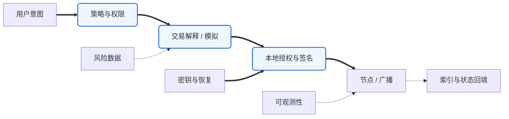
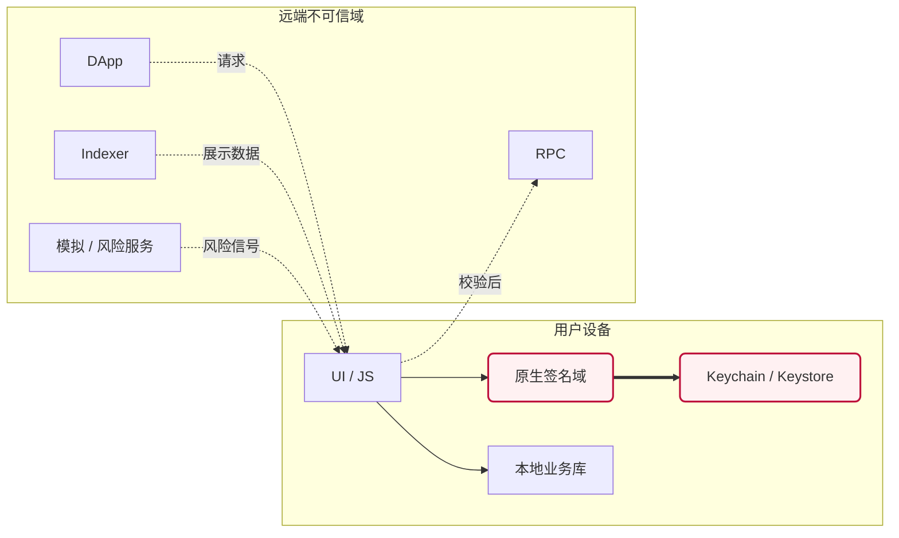
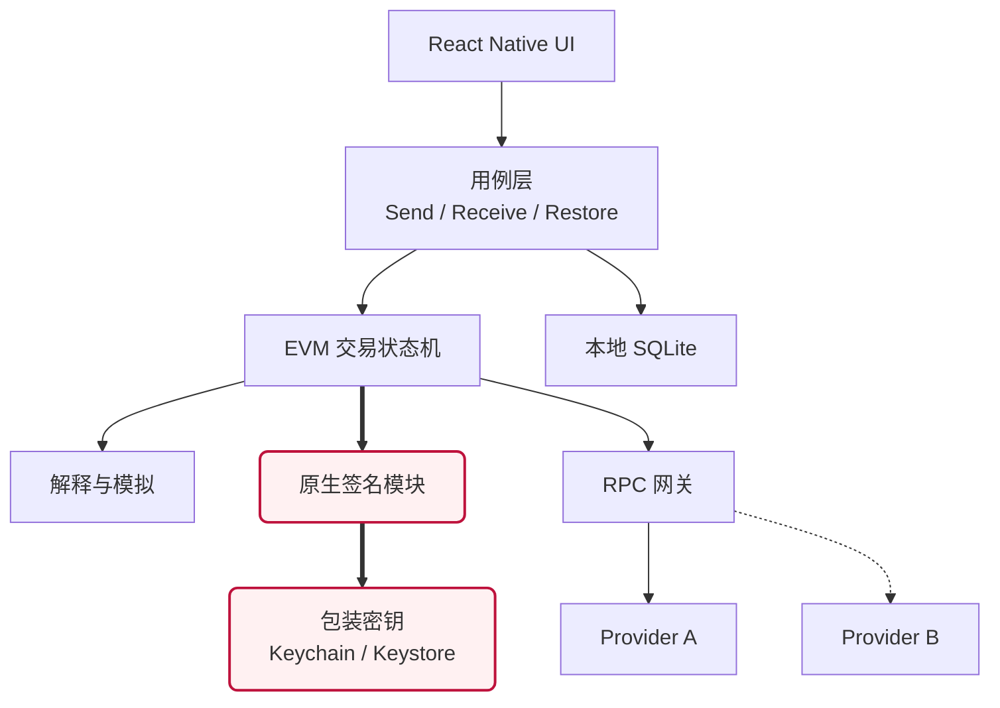

# 构建加密钱包的技术栈：从密钥容器到可信交易代理

> [!abstract] 结论先行
> 钱包的本质不是“展示资产余额的 App”，而是一个把**人的意图**安全地编译、解释并授权为**不可逆链上状态变化**的系统。技术栈的首要目标不是支持最多的链，而是缩小可信计算基（Trusted Computing Base, TCB）、让每一笔签名可解释、让恢复路径真的可用。首版应从“单链、单账户、收发、可验证恢复”开始。

## 一、先界定：你到底在造哪一种钱包

“加密钱包”至少包含四种差异极大的产品：

| 类型 | 谁控制最终签名权 | 核心难题 | 典型形态 |
|---|---|---|---|
| 非托管软件钱包 | 用户设备上的密钥 | 端侧密钥安全、交易可读性、恢复 | MetaMask、Rainbow、BlueWallet |
| 智能合约钱包 | 合约验证逻辑与一个或多个签名者 | 合约升级、Bundler/Paymaster、跨链部署 | Safe、ERC-4337 钱包 |
| MPC/企业钱包 | 多方共同生成签名 | 协议安全、成员治理、灾难恢复、审计 | 机构金库、交易平台 |
| 硬件/冷钱包 | 独立硬件内签名 | 固件、供应链、可信显示、设备协议 | Ledger、Trezor、Coldcard |

本文默认目标是：**非托管、移动端优先、EVM 起步、未来可扩展到多链和智能账户**。这不是唯一正确方向，但它最适合用小团队验证产品价值。

> [!warning] 合规边界
> “代码非托管”不自动等于“业务非托管”。法币出入金、代付 Gas、交易路由、制裁筛查、遥测数据和地区分发都可能引入监管义务；上线前需要针对目标司法辖区做专项法律评估。

## 二、宏观视角：钱包是五个系统叠在一起



这张图揭示了三个常被混淆的事实：

1. **签名不等于理解。** 密码学只能证明“某把钥匙签过”，不能证明用户理解了 calldata、授权额度或代理合约的真实效果。
2. **余额不是链上原生真相的简单读取。** 原生币、ERC-20、NFT、DeFi 仓位、未确认交易都需要节点、日志索引和缓存共同重建。
3. **恢复才是最终产品。** 创建钱包只发生一次，恢复发生在用户最焦虑的时刻；没有演练过的备份不算备份。

因此，钱包最重要的产品指标不应只是 DAU 和交易量，还应包括：交易误签率、模拟覆盖率、恢复成功率、RPC 差异告警率和签名路径崩溃率。

## 三、先建立威胁模型：安全不是一个形容词

在决定技术栈以前，必须先定义威胁模型（Threat Model）：**保护什么资产、攻击者拥有什么能力、哪些风险接受、哪些风险绝不接受。**

这是必要的，因为“更安全”不是一个可以无限优化的单变量。例如，把每次签名都放进硬件设备会提高密钥隔离，却会降低移动支付成功率；把所有 RPC 都换成自建节点能减少第三方依赖，却引入节点维护、同步错误和地域可用性问题。没有威胁模型，团队会在安全口号之间摇摆，最后既昂贵又不一致。

### 3.1 要保护的不是一种“密钥”，而是多类资产

| 资产 | 泄漏或篡改后果 | 推荐保护等级 |
|---|---|---|
| 熵、助记词、种子、扩展私钥 | 可永久接管全部派生账户 | 最高；不得进入通用业务层 |
| 单账户私钥、会话密钥 | 接管单账户或限定时间内的权限 | 最高或高；按权限范围分级 |
| PIN、包装密钥、恢复因子 | 解锁本地密钥或辅助恢复 | 高；不能与密文放在同一信任域 |
| 未签名交易、交易意图 | 被替换会导致“所见非所签” | 高完整性要求，不一定要求保密 |
| 地址、余额、交易历史 | 隐私画像、钓鱼和定向攻击 | 中高；尤其防止跨账户关联 |
| RPC/API 凭据 | 服务滥用、配额耗尽、数据关联 | 中；它不是钱包私钥，但仍需隔离 |
| Token 图标、名称、价格 | 欺骗展示、诱导签名 | 低机密性、高真实性要求 |

这里最重要的区分是：**机密性（Confidentiality）和完整性（Integrity）不是一回事。** 收款地址可以公开，但必须防篡改；交易 calldata 未必秘密，却必须保证确认页展示的内容与最终签名字节完全一致。

### 3.2 典型攻击者

1. **远程攻击者**：控制钓鱼站、恶意 DApp、DNS、深链或消息入口。
2. **恶意依赖与供应链**：被接管的 npm 包、预编译原生库、CI Action、更新渠道。
3. **不诚实基础设施**：RPC、Indexer、模拟器或价格源返回错误、延迟或选择性结果。
4. **设备侧攻击者**：拿到已锁或已解锁手机，利用 root/jailbreak、调试、辅助功能或覆盖层。
5. **内部人员**：能访问构建系统、发布证书、后台配置、遥测平台或远程开关。
6. **用户自己**：抄错助记词、选错网络、误解授权、永久丢失恢复材料。

> [!important] 必要性判断
> 钱包安全设计不是只防“黑客偷私钥”。更多真实事故来自用户签署了自己没理解的权限、恢复材料不可用、RPC 状态错误、前端供应链被污染，或发布渠道被接管。因此密钥保护只是安全系统的一部分。

### 3.3 信任边界（Trust Boundary）

信任边界表示数据跨过此处后，不能继续沿用原来的安全假设：



边界存在的必要性在于：如果 UI、DApp 请求、RPC 返回值和签名模块处于同一信任等级，那么任意一个展示层漏洞都能直接变成资产漏洞。边界不是画图，而要落实为不同进程/语言模块、受限接口、数据复制规则和独立测试。

## 四、密钥体系的术语与原理：从随机数到地址

很多钱包设计错误源于把“助记词、种子、私钥、地址”当成同一个东西。正确链路是：

```text
密码学安全随机数（Entropy）
        │ BIP-39 编码 + checksum
        ▼
助记词（Mnemonic Sentence） ── 可选 passphrase
        │ PBKDF2-HMAC-SHA512
        ▼
种子（Seed，通常 64 bytes）
        │ BIP-32 HMAC 派生
        ▼
主扩展私钥（Master Extended Private Key）
        │ 派生路径 m / purpose' / coin' / account' / change / index
        ▼
子私钥 ──椭圆曲线标量乘法──> 公钥 ──哈希/编码──> 地址
```

### 4.1 熵（Entropy）为什么必须由机器生成

熵是不可预测性的度量。BIP-39 的 12 个英文单词通常编码 128 bit 原始熵和 4 bit 校验和；24 个词通常对应 256 bit 熵和 8 bit 校验和。单词只是二进制随机数的传输格式。

人类选择词语会形成“脑钱包（Brainwallet）”：语言具有模式、偏好和公开语料，攻击者可以用字典、歌词、名言和泄漏密码高效枚举。必要的设计不是提醒用户“选复杂一点”，而是**禁止用户自行创作助记词**，只接受 CSPRNG 生成或标准导入。

### 4.2 助记词不是种子

BIP-39 先把熵和短校验和映射为 2048 词表中的索引，再使用 PBKDF2-HMAC-SHA512 将助记词与可选 passphrase 派生为 512 bit seed。

这一区分很重要：

- 助记词是人类备份材料；seed 是后续确定性派生的二进制输入。
- 同一组助记词配不同 passphrase 会得到完全不同且形式上都合法的钱包。
- 忘记 passphrase 没有“密码错误”提示，只会恢复到另一个空钱包。
- BIP-39 校验和主要用于发现抄写错误，不是密码学防篡改，也不提供纠错能力。

因此 passphrase 不应作为首版默认功能。它提升了离线备份被盗后的安全性，却显著提高永久自锁风险。只有当产品能把“助记词”和“passphrase”作为两个独立恢复因子教育、验证并演练时，才值得开放。

### 4.3 HD 钱包为什么存在

分层确定性钱包（Hierarchical Deterministic Wallet, HD Wallet）解决的是备份扩张问题：如果每创建一个地址就独立生成一把私钥，用户需要持续更新备份；BIP-32 允许从一个根确定性派生大量子密钥，所以一次根备份可以覆盖未来账户。

扩展密钥（Extended Key）不仅包含私钥或公钥，还包含链码（Chain Code）。链码为派生提供额外输入，使同一父密钥能够安全地产生不同子树。`xprv` 能派生私钥与公钥；`xpub` 通常只能派生非硬化子公钥，但会暴露整个子树的地址关联和未来收款地址，因此它也是敏感隐私材料。

### 4.4 硬化派生（Hardened Derivation）

路径中的撇号，例如 `44'`，表示硬化派生。普通派生允许从父扩展公钥推导子公钥，适合 watch-only 系统；但在部分威胁条件下，“父 xpub + 某个普通子私钥”会危及父扩展私钥。硬化派生切断了这种公钥侧派生能力，用可观察性换取更强隔离。

必要性不是“全部硬化最好”，而是按责任分层：账户以上通常硬化以隔离币种和账户；收款/找零地址需要 watch-only 扫描时保留普通派生能力。

### 4.5 派生路径不是装饰元数据

BIP-44 路径形式为：

```text
m / purpose' / coin_type' / account' / change / address_index
```

同一助记词在不同路径下会生成不同地址。若钱包只备份助记词却不记录账户模型、路径和脚本类型，恢复软件可能“拥有钥匙却找不到资产”。因此恢复描述必须至少包含：标准、币种、账户索引、路径、地址/脚本类型和发现策略。Bitcoin Descriptor 的价值之一，就是比“只有一个 seed”更完整地描述怎样构造和扫描钱包。

### 4.6 地址不是账户本身

地址通常是公钥或脚本承诺的编码，主要用于定位资产控制条件。它不是私钥的加密版本，通常不能从地址反推出公钥，更不能反推出私钥。

地址校验必须是链感知的：检查编码、校验和、网络、长度和地址类型。仅用正则匹配 `0x...` 会漏掉 EIP-55 校验、错误网络和零地址等语义问题。

## 五、三种账户模型：不要制造虚假的“多链统一”

### 5.1 EVM 外部拥有账户（Externally Owned Account, EOA）

EOA 由私钥直接控制，状态中包含余额和 nonce。交易大体表达为：

```text
from + nonce + chainId + to + value + calldata + gas 参数 + signature
```

Nonce 是发送账户的顺序号，主要用于排序和防重放。它带来的工程后果是：同一账户并发发送交易时，后续 nonce 会被前一笔卡住；替换/加速交易必须复用 nonce 并提高费用；多个设备同时使用同一账户会产生竞争。

因此 Nonce Manager 不是一个 `getTransactionCount()` 包装器，而是一个并发协调模块，至少区分链上 confirmed nonce、本地 pending nonce、远端 mempool 视图和被替换交易。

### 5.2 Bitcoin UTXO 模型

Bitcoin 没有“账户余额”这一共识对象。钱包拥有的是一组未花费交易输出（Unspent Transaction Output, UTXO）的花费条件：

```text
余额 = Σ 可花费 UTXO
支付 = 选择若干输入 → 创建收款输出 + 找零输出 + 手续费
```

Coin Selection 会影响费用、隐私和后续可用性；找零地址管理错误可能直接丢币；RBF、CPFP、dust、确认数和链重组也与 EVM 完全不同。PSBT（Partially Signed Bitcoin Transaction）把构造、补充元数据、多个签名者签名和最终化拆开，特别适合硬件钱包、多签和离线流程。

这解释了为什么“统一成 `sendTransaction()`”是不够的：共同层可以描述支付意图，但 Bitcoin 适配器必须保留 UTXO 选择、找零、脚本和 PSBT 语义，否则 UI 无法解释实际隐私与费用后果。

### 5.3 智能合约账户（Smart Contract Account）

智能账户把“什么算有效授权”从固定私钥规则变成链上代码。ERC-4337 使用 UserOperation、Bundler、EntryPoint 和可选 Paymaster，在不修改共识层交易类型的前提下实现账户抽象（Account Abstraction, AA）。

它能支持多签、Passkey、批量操作、限额、会话密钥、社交恢复和代付 Gas；代价是新增：

- 账户合约与升级代理风险；
- Bundler 的可用性与审查；
- Paymaster 的策略、资金和隐私；
- 不同链部署地址与版本一致性；
- UserOperation 模拟和 Gas 估算复杂度；
- 恢复规则本身被错误配置的风险。

所以 AA 不是“更高级的 EOA”，而是把简单密钥风险换成可编程策略风险。只有当恢复、Gas 抽象或细粒度权限能显著改善目标用户体验时，这个交换才值得。

> [!summary] 可以统一什么，不能统一什么
> 可以统一：用户意图、资产描述、风险解释、审批策略、签名者接口和生命周期状态。不能强行统一：nonce 与 UTXO、Gas 与 feerate、地址与脚本、EOA 交易与 UserOperation、链重组与最终性规则。

## 六、推荐的分层架构

### 6.1 密钥域（Key Domain）

职责只有四件事：生成熵、派生账户、签名、恢复。它不应知道余额、代币价格、DApp、埋点或 UI。

- 使用操作系统 CSPRNG 生成熵；不要自己设计随机算法。
- 助记词（Mnemonic）是密钥的可移植编码，不是“密码”。应用 PIN 也不是助记词的替代品。
- iOS Secure Enclave / Android StrongBox 更现实的用途通常是保存或操作**设备绑定的包装密钥（wrapping key）**，用它加密钱包种子；不要假设任意 secp256k1 私钥都能直接导入硬件安全模块。
- 生物识别只是本地解锁信号，不是恢复因子，也不能抵抗已解锁设备上的所有恶意软件。
- 解密后的种子只在最短生命周期内进入内存；日志、崩溃报告、剪贴板、截图、系统备份和分析 SDK 全部视为泄漏面。

端侧存储推荐采用“信封加密（Envelope Encryption）”：随机生成数据加密密钥（DEK）加密 seed，再用 Keychain/Keystore 中的设备绑定包装密钥（KEK）加密 DEK。这样可以轮换 PIN 或存储格式，而不必直接重新处理根秘密。

```text
用户认证 ──允许使用──> 硬件/系统保护的 KEK
                               │ 解包
加密 seed <── AES-GCM ── DEK <─┘
                         │
                         └─短暂解密→ 派生/签名 → 清理内存
```

AES-GCM 等 AEAD（Authenticated Encryption with Associated Data）同时提供机密性和完整性；关联数据可绑定 walletId、schemaVersion 与设备域，防止密文被调包到另一上下文。PIN 不应直接作为加密密钥，应经过带随机 salt 的内存困难 KDF；但在移动端，PIN 空间很小，真正抵抗离线暴力破解的关键仍是硬件/系统密钥和尝试次数限制。

Apple Secure Enclave 只支持设备内生成的 P-256 密钥，无法导入既有 secp256k1 钱包私钥；Android StrongBox 也只支持有限算法且设备覆盖、性能不同。因此跨链钱包的现实通用方案通常是让安全硬件保护 KEK，而不是声称所有链上签名都在安全硬件内完成。

### 6.2 协议域（Protocol Domain）

把每条链建模为适配器，而不是让 UI 直接调用零散 SDK：

```text
ChainAdapter
├── deriveAddress(account, path)
├── syncAccount(cursor)
├── buildUnsigned(intent, chainState)
├── explain(unsignedTx)
├── simulate(unsignedTx)
├── sign(unsignedTx, signer)
└── broadcast(signedTx)
```

关键是让 `build → explain → simulate → approve → sign → broadcast` 成为显式状态机。交易在任一步发生网络、nonce、fee 或 chainId 变化，都必须退回重新解释和授权，不能悄悄修改后继续签名。

### 6.3 数据域（Data Domain）

- RPC 提供规范链数据，但第三方节点是可撒谎、可审查、可宕机的依赖。
- Indexer 提供历史、Token、NFT 与搜索体验，但其结果应标注最终性和来源。
- Price/metadata 属于不可信展示数据，绝不能改变签名语义。
- 本地数据库保存账户、交易状态和缓存；私钥材料与普通业务数据必须分库存储、分密钥加密。

### 6.4 交互域（Interaction Domain）

交易确认页应回答人真正关心的五件事：

- 我在什么网络上？
- 谁将得到什么资产或权限？
- 最大损失是多少？
- 这笔操作是否可撤销，授权是否无限？
- 模拟与链上执行之间还有哪些不确定性？

“显示十六进制 calldata + 一个确认按钮”不是专业模式，而是把解析责任转嫁给用户。

### 6.5 策略与权限模块（Policy & Permission）

策略模块决定“这项请求是否允许进入签名流程”，它位于 DApp/业务请求和签名器之间。典型策略包括：允许的 chainId、账户、方法、单笔限额、每日限额、会话有效期、是否允许盲签、是否允许无限授权。

为什么不能把策略写进 UI 条件判断？因为 UI 是展示层，可能有多个入口：WalletConnect、深链、扫码、通知、内置 DApp。若每个入口各自判断，会产生策略漂移。策略必须接受规范化后的 `Intent`，返回结构化的 `allow / deny / require_step_up` 和理由；UI 只负责展示决定。

### 6.6 交易意图模块（Transaction Intent）

意图不是交易字节，而是用户想完成的业务动作，例如：

```text
Transfer(asset=USDC, amount=100, recipient=alice.eth)
Approve(token=USDC, spender=Router, limit=100)
Swap(input=ETH, output=USDC, minReceive=...)
```

引入意图层的必要性是防止协议细节过早污染产品逻辑。同一个“转 100 USDC”在 EOA、智能账户批处理和不同链上会编码成不同字节，但它们都应保留同一组用户承诺。构造完成后必须把交易反向解释回意图并比较，这叫**往返一致性（Round-trip Consistency）**：

```text
用户意图 ─build─> 未签名交易 ─explain─> 解释结果
   └──────────────── 必须语义等价 ────────────────┘
```

如果 build 与 explain 共用同一段错误逻辑，测试仍可能一起错。因此关键交易要使用独立解码器、Golden Vector，甚至不同实现做差分测试。

### 6.7 解释与模拟模块（Explain & Simulate）

**解释**是静态分析：解析目标地址、函数选择器、参数、资产变化和授权对象。**模拟**是动态执行：在某个区块状态上执行调用，观察返回值、revert 和预期状态变化。

二者必须同时存在：

- 只有解释，不知道合约实际分支与外部调用结果；
- 只有模拟，无法证明远端模拟器没有撒谎，也无法保证执行前状态不变；
- 代理合约、delegatecall、MEV、区块变化和可升级逻辑都可能使模拟与最终执行不同。

因此模拟结果只能表达为：“基于区块 N 和服务 S，预计发生 X”，不能表达为“绝对安全”。模拟失败时必须进入降级状态，而不是自动跳过风险提示。

### 6.8 签名模块（Signer）

签名器的理想接口很窄：输入已经冻结并可哈希的签名负载、账户引用和授权证明，输出签名或拒绝。它不负责联网、查价格、解析域名或决定费用。

窄接口必要性来自最小权限（Least Privilege）：签名器一旦能自己联网或修改交易，它既能读取秘密又能改变资产目的地，破坏职责分离。应将“构造者”和“签名者”看成相互校验的两方，即使它们部署在同一设备。

### 6.9 网络与广播模块（Network & Broadcast）

广播不是一次 HTTP POST，而是带幂等语义的状态迁移。客户端应先本地计算交易哈希，再向一个或多个节点提交；节点返回的哈希必须与本地一致。超时不表示失败——节点可能已经接收交易，因此重试必须发送完全相同的签名交易，不能重新构造并消耗新 nonce。

推荐状态：

```text
draft → built → explained → approved → signed
                                  │
                                  ▼
                    submitted → pending → confirmed
                         │           ├→ replaced
                         │           ├→ dropped
                         │           └→ reorged → pending
                         └→ submission_unknown
```

`submission_unknown` 很重要：网络超时造成的是“不知道是否成功”，而不是确定失败。错误模型如果只有 success/failure，UI 很容易诱导用户重复付款。

### 6.10 同步与索引模块（Sync & Indexing）

链节点优化的是共识与执行，不是钱包查询体验。代币转账历史通常来自事件日志，NFT 和 DeFi 仓位需要额外解析，本地 pending 交易又尚未成为链上最终状态。所以钱包显示的是多个来源合并后的**物化视图（Materialized View）**。

每条记录至少需要来源、观察区块、最终性状态和更新时间。缓存项不能只有 `value`，还应有 `provenance + blockRef + freshness`。这样 RPC 与 Indexer 冲突时，系统才能解释“为什么显示这个结果”，而不是任意以后返回者覆盖前者。

### 6.11 DApp 会话与权限模块（Session & Permission）

WalletConnect 不是“扫二维码后转发 RPC”这么简单。会话至少绑定：来源身份、允许的账户、链命名空间、方法、事件、建立时间和过期时间。配对（Pairing）只建立通信关系；会话（Session）才定义具体权限，两者不能混为“已连接”。

权限必须使用最小授权和可撤销原则：DApp 申请 Ethereum 签名权限，不代表自动获得全部链、全部账户和永久访问。钱包应提供权限中心，让用户看到“谁、何时、能用哪个账户做什么”，并支持单会话撤销、自动过期和账户切换后的重新授权。

必要性来自**混淆代理问题（Confused Deputy Problem）**：钱包拥有签名能力，DApp 会诱导它代表用户执行动作。如果钱包只验证消息格式、不验证请求者权限与上下文，它就会成为被借用权限的代理人。

### 6.12 恢复模块（Recovery）

恢复模块不是设置页里的导入表单，而是一个独立安全子系统。它要回答：

- 用户丢失设备后还剩哪些因子？
- 钱包公司停止服务后能否恢复？
- 恢复的是密钥、账户策略，还是完整资产发现信息？
- 因子被盗和因子丢失分别如何处理？
- 恢复动作本身能否绕过日常签名策略？

EOA 助记词恢复简单、可移植，但单点丢失与单点泄漏并存；云备份改善可用性，却把云账户变成攻击面；Shamir/MPC/社交恢复消除单一材料，却引入份额发现、成员变更、阈值配置和服务可用性。恢复方案不是功能叠加，而是威胁模型重写。

### 6.13 可观测性模块（Observability）

普通应用希望采集更多上下文，钱包必须遵循**隐私预算（Privacy Budget）**：只采集定位故障所需的最小数据，并假设遥测平台最终可能泄漏。

绝不记录助记词、私钥、PIN、解密材料和完整签名请求；地址、交易哈希、IP、设备 ID 组合后可以建立金融画像，也应散列、截断、采样或在端侧聚合。安全事件需要可审计，但审计日志自身不能成为用户资产地图。

### 6.14 模块接口应该传什么

接口设计应使用领域类型阻止无效状态，而不是到处传 string：

```text
ChainId ≠ NetworkName
ChecksummedAddress ≠ RawString
AtomicAmount ≠ DecimalDisplayAmount
UnsignedTx ≠ ApprovedTx ≠ SignedTx
BlockRef = { number, hash }
SimulationResult = { blockRef, provider, effects, confidence }
```

特别要区分原子单位（Atomic Unit）和展示小数。链上整数 `1000000` 对 6 decimals Token 是 1.0，对 18 decimals Token 则完全不同。禁止用二进制浮点数处理资产金额；应使用大整数保存原子单位，在展示边界做明确舍入。

### 6.15 错误模型：失败、不确定和被拒绝

钱包错误至少分为：

- `ValidationError`：本地输入无效，可安全修正；
- `PolicyDenied`：策略拒绝，不应自动重试；
- `UserRejected`：用户拒绝，不是系统异常；
- `TransientNetworkError`：可带退避重试；
- `SubmissionUnknown`：可能已广播，先查询再重试；
- `ChainReverted`：链上执行失败，但交易可能已消耗费用；
- `StateConflict`：nonce、UTXO、blockhash 等已过期，需要重建并重新批准；
- `SecurityInvariantViolation`：所见与所签不一致，应立即停止并上报本地安全事件。

这个分类必要，因为“捕获异常后重试”在支付系统里可能造成重复付款，“失败后重新 build”又可能让旧批准覆盖新交易。错误类型必须决定是否可重试、是否重新授权、是否保留签名和如何向用户解释。

### 6.16 测试体系：证明安全不变量

钱包测试不是只证明函数返回预期值，而是证明跨模块不变量：

| 层级 | 主要方法 | 要证明的事情 |
|---|---|---|
| 密码学 | 官方向量、Golden Vector | 派生、序列化、签名与标准一致 |
| 属性测试 | Property-based / Fuzzing | 任意输入不会越界、崩溃或产生歧义 |
| 差分测试 | 两套独立实现比较 | 编码、解码、费用和地址结果一致 |
| 状态机测试 | Model-based Testing | 非法状态转换永远不可达 |
| 合约测试 | 本地链、fork、恶意合约 | approve、代理、revert、重入展示正确 |
| 故障注入 | 超时、重组、节点撒谎、进程终止 | 系统保持幂等并正确表达不确定性 |
| 端到端 | 真实设备与恢复演练 | 生物识别、备份、升级、换机路径可用 |
| 供应链 | SBOM、签名校验、可复现构建 | 发布物确实来自审查过的源代码 |

最关键的安全不变量包括：未经批准不得签名；批准后负载变化必须失效；秘密不得跨出密钥域；相同签名交易重试不得产生第二笔付款；恢复得到的首批地址必须与创建时一致。

## 七、技术栈建议：把成熟组件当砖，不把整仓库当地基

| 层 | 极简首选 | 成长后选项 | 设计判断 |
|---|---|---|---|
| 移动 UI | React Native + TypeScript | 原生 Swift/Kotlin | RN 便于快速迭代；密钥与签名仍放原生/FFI 边界 |
| EVM 数据/编码 | `viem` | 自建类型化协议层 | API 清晰、类型严格；不要让它直接持有长期密钥 |
| 多链签名内核 | 暂不引入或仅封装 EVM | Trust Wallet Core | Wallet Core 支持大量链和审计材料，但不负责节点通信、余额和广播 |
| Bitcoin | 不进首版 | BDK + Rust FFI | Descriptor、PSBT、链源分离比“复用 EVM 抽象”更符合 Bitcoin 模型 |
| DApp 连接 | 第二阶段加入 WalletConnect WalletKit | 自定义深链仅作补充 | 会话命名空间、权限、过期和重放必须显式建模 |
| 智能账户 | 第三阶段评估 Safe/ERC-4337 | 自研账户合约仅在强需求下 | AA 带来恢复、批处理和 Gas 抽象，也引入合约、Bundler、Paymaster 新信任面 |
| 本地存储 | SQLite + OS Keychain/Keystore 包装密钥 | SQLCipher / 独立安全进程 | 数据分类优先于“全盘都加密”的口号 |
| 后端 | 薄 RPC 代理 + 健康检查 | 自建节点、Indexer、多提供商仲裁 | 后端不能签名；先做限流、链 ID 校验、重试与观测 |
| 测试 | 单元 + Golden Vector + 本地链 E2E | 模糊测试、差分测试、设备农场 | 钱包必须验证“签了什么”，而不只是 UI 能否点通 |

### 值得研究的 GitHub 项目

1. [Trust Wallet Core](https://github.com/trustwallet/wallet-core)：跨平台、多链密码学与签名内核；适合研究统一 FFI 和链注册表。它明确不处理节点通信、余额查询和广播，所以不能把它等同于完整钱包。
2. [MetaMask Mobile](https://github.com/MetaMask/metamask-mobile)：大型 React Native 钱包，控制器覆盖账户、网络、交易、资产与权限。价值在于观察复杂度如何增长；其 60+ 控制器也提醒我们不要复制成熟产品的全部历史包袱。
3. [Rainbow](https://github.com/rainbow-me/rainbow)：产品化较强的 EVM React Native 钱包，适合研究交互、缓存和移动工程，但 GPL-3.0 许可证会影响闭源复用方式。
4. [BlueWallet](https://github.com/BlueWallet/BlueWallet)：React Native Bitcoin 钱包，适合研究 Electrum、PSBT、RBF、术语一致性与 watch-only；不要拿它的 UTXO 设计硬套 EVM。
5. [Bitcoin Dev Kit](https://github.com/bitcoindevkit/bdk)：Rust 的 descriptor-based Bitcoin 组件，明确拆分钱包、链状态与 Esplora/Electrum/Core RPC 数据源，是“协议内聚、基础设施可替换”的好例子。
6. [Bitcoin Core HWI](https://github.com/bitcoin-core/HWI)：统一硬件钱包交互接口；适合桌面端或服务端协调 PSBT，不适合直接成为移动 MVP 的主依赖。
7. [WalletConnect Monorepo](https://github.com/WalletConnect/walletconnect-monorepo)：研究 Wallet 与 DApp 之间的会话、命名空间和消息协议。注意其许可证、云 Project ID 和中继依赖。
8. [Safe Core SDK](https://github.com/safe-global/safe-core-sdk)：研究多签、模块化智能账户和 ERC-4337 集成；适合后续账户抽象阶段。

> [!tip] 开源复用原则
> 先复用经过审查的**窄组件**，再借鉴完整产品的架构。每个依赖至少检查：许可证、活跃度、发布签名、审计范围、原生二进制供应链、升级策略、可替换性。Star 数不是安全证明，审计也不是永久免责书。

## 八、设计哲学

### 1. 最小可信计算基，而不是最少代码

少写代码不必然更安全。正确目标是让“能够接触明文种子或改变待签内容”的代码尽可能小、稳定、可审计。UI、价格、通知、DApp 浏览器和遥测不应进入这一区域。

必要性来自攻击面的乘法效应：一个模块同时拥有“读秘密、改交易、发网络”三种能力时，单点失陷即可完成盗币链路。拆分后，攻击者至少要跨越多个独立边界。TCB 的评价标准不是目录名称，而是：谁能读取明文、谁能改变签名负载、谁能批准使用密钥。

### 2. 把远端都当作可能撒谎

RPC、Indexer、Token List、模拟服务、域名解析和价格源都可能错误或恶意。策略不是完全不用它们，而是：

- 返回值做 chainId、区块高度、格式和金额边界校验；
- 关键读取允许多提供商比对；
- 模拟结果是风险信号，不是安全证明；
- 广播前后用交易哈希和签名内容本地核对。

这不是要求所有远端结果都做昂贵共识，而是按损失半径选择验证强度：价格显示可以容忍短暂错误；chainId、nonce 和交易哈希必须本地验证；高价值余额或合约代码可以跨提供商比对。把验证预算投向会改变签名决定的数据。

### 3. 安全状态必须可见

网络切换、账户切换、合约授权、无限 allowance、代理升级、域名解析与模拟失败都要在确认界面显式表达。安全不应依赖用户阅读 FAQ。

必要性来自人的认知模型：用户批准的是“给 Alice 100 USDC”，不是“对地址 0xA0b8... 调用 selector 0xa9059cbb”。系统若不能把机器语义还原成人类语义，就无法获得有意义的知情授权（Informed Consent）。视觉层级应优先展示资产损失和权限变化，而不是 Gas、哈希等工程字段。

### 4. 可恢复性优先于“无感”

云备份、社交恢复和 Passkey 能改善体验，但会重画威胁模型。首版先把离线助记词恢复做对，并要求用户完成一次恢复校验；后续每引入一种恢复方式，都要写清：谁能恢复、需要几个因子、设备全丢后怎么办、服务停运后怎么办。

钱包的安全目标同时包含“不让别人拿走”和“不让自己永久失去”。前者推动更强隔离，后者推动冗余恢复，两者天然冲突。恢复设计必须同时衡量盗取概率与永久丢失概率，不能只追求其中一个。

### 5. 链抽象只能停在共同语义层

EVM 的账户/nonce/gas、Bitcoin 的 UTXO/coin selection/change/PSBT、Solana 的 recent blockhash/account model 并不相同。可以统一“意图、解释、授权、状态机”，但不要强行统一底层交易模型，否则抽象最终会泄漏并制造安全事故。

好抽象隐藏偶然复杂度，保留本质差异。若统一接口导致 Bitcoin 找零、EVM allowance 或 Solana account metas 无处表达，它不是简化，而是信息丢失。判断方法是：协议特有的风险能否穿过抽象层抵达确认页和策略引擎。

### 6. 默认拒绝盲签（Blind Signing）

不能解码或模拟的交易，不应伪装成普通确认。可以提供受控的专家逃生口，但要显示原始目标、方法选择器、value、chainId、风险原因，并让策略层允许完全禁用。

拒绝盲签的必要性来自签名不可否认性与执行不可逆性：系统一旦让用户在缺乏语义的情况下批准，后续任何风险提示都已失去意义。专家模式只能显露更多事实，不能成为绕过安全模型的快捷键。

### 7. 所见即所签（What You See Is What You Sign）

确认页不能展示一个对象、签名器却接收另一个可变对象。进入审批后应冻结规范化交易，计算 digest，并让解释结果引用该 digest。若费用、nonce、目标、calldata 或 chainId 改变，原批准自动失效。

这个原则必要，是因为异步系统中“检查时”和“使用时”之间存在 TOCTOU（Time-of-check to Time-of-use）竞态。RPC 刷新、后台任务、React 状态更新或恶意 DApp 都可能在确认与签名之间改值。

### 8. 安全降级必须失败关闭（Fail Closed）

ABI 缺失、模拟超时、风险服务不可用、硬件密钥不可访问时，系统不应悄悄退回低安全路径。默认应阻止或显著升级确认要求；只有明确、可审计的产品策略才能允许继续。

失败关闭的代价是降低可用性，但钱包操作往往不可逆。合理做法是区分读取路径和签名路径：余额服务故障可以展示陈旧标记，签名解释故障则应阻止普通用户继续。

### 9. 可替换基础设施，不可漂移安全语义

RPC、Indexer、模拟服务和价格源都应通过端口适配器替换；交易语义、风险分类与审批规则必须保留在本地可测试的领域层。否则更换供应商会悄悄改变安全行为。

### 10. 复杂度必须由风险或用户价值支付

多链、MPC、AA、Bridge 和内置 DApp 浏览器都会扩大状态空间与攻击面。每个新模块上线前必须回答：它解决哪个已验证需求？新增哪些信任方？失败时最大损失是什么？是否有更窄方案？没有明确答案就延后。

## 九、极简落地方案：四到六周验证版

### 产品范围

只支持一条低成本 EVM 网络，并包含：

- 创建/导入一个助记词钱包；
- 展示原生币与少量 allowlist Token；
- 收款二维码；
- 原生币与 ERC-20 转账；
- EIP-1559 费用估算、nonce 管理；
- 转账前 `eth_call` 模拟和明确的人类可读摘要；
- 本地加密、PIN/生物识别解锁；
- 助记词备份与恢复演练；
- 交易历史和失败状态。

明确不做：内置 DApp 浏览器、Swap、跨链桥、NFT、法币入口、云备份、社交恢复、WalletConnect、智能账户、多链。

### 最小架构



推荐边界：TypeScript 只拿到派生地址和签名结果，不拿长期明文种子；原生模块负责解包、派生、签名和清零临时缓冲区。服务端只做代理、限流和观测，不保存助记词、不代签。

### 四个里程碑

1. **密钥闭环**：生成、备份、恢复、锁定、错误 PIN、设备重启；用官方测试向量验证派生地址和签名。
2. **交易闭环**：构造、解释、模拟、确认、签名、广播、pending/confirmed/failed 状态迁移。
3. **故障闭环**：RPC 超时、错误 chainId、nonce 冲突、费用突变、重组、重复点击、进程被杀后恢复。
4. **安全闭环**：依照 OWASP MASVS 的 STORAGE、CRYPTO、AUTH、NETWORK、PLATFORM、CODE、RESILIENCE、PRIVACY 分组做检查；完成外部移动安全测试和依赖审计后再接主网。

### 首版验收底线

- 任何日志、埋点、崩溃文件和系统备份中都找不到种子、私钥、PIN 或完整敏感签名载荷；
- UI 所展示的 recipient、amount、token、chainId 与最终签名字节可由自动化测试证明一致；
- 应用在签名前检测链、nonce、fee 或 calldata 变化并强制重新确认；
- 在无后台服务、换手机的情况下，用户能仅靠标准恢复材料找回资产；
- 使用测试网和最小金额完成真实设备灾难恢复演练；
- 第三方依赖锁版本、生成 SBOM、开启 secret scanning，并制定高危漏洞升级 SLA；
- 发布构建可追踪，签名密钥与 CI 权限最小化；核心原生库尽可能支持可复现构建。

## 十、最常见的失败模式

1. **首版多链。** 表面是多加几个 RPC，实际是成倍增加地址、派生、费用、最终性、序列化和恢复测试矩阵。
2. **把助记词存进通用状态管理。** Redux、调试工具、持久化插件和崩溃采集很容易复制它。
3. **只保护静态数据。** 解锁后明文驻留时间过长、截图/剪贴板/键盘缓存泄漏同样危险。
4. **相信单一 RPC。** 错误余额、错误 nonce、选择性广播会直接损害用户。
5. **模拟成功就承诺安全。** 区块状态、MEV、可升级合约和外部调用可能在执行前变化。
6. **用“专业用户”合理化盲签。** 专业用户也无法靠肉眼可靠解释任意 calldata。
7. **一开始就自研密码学或账户合约。** 除非差异化价值就在这里，否则审计成本和永久资产风险远高于收益。
8. **把审计当终点。** 依赖升级、配置、CI、运营后台和新功能都会让旧审计迅速失效。

## 十一、演进路线

```text
阶段 0：Watch-only 原型，验证 RPC、同步和交易解释
阶段 1：单链 EOA 收发，建立密钥与恢复可信基线
阶段 2：WalletConnect + 权限中心 + allowance 管理
阶段 3：第二种“不同模型”的链；用它检验适配器是否真实有效
阶段 4：智能账户、Passkey、Gas sponsorship、社交恢复
阶段 5：自建节点/Indexer、多提供商仲裁、硬件钱包与机构策略
```

第二条链最好故意选择与 EVM 不同的模型（例如 Bitcoin），而不是再加一个 EVM 网络。若架构能容纳 UTXO、PSBT 和 coin selection，才说明“多链抽象”不是换 logo。

## 十二、术语表：建立团队的共同语言

| 术语 | 准确定义 | 常见误解 |
|---|---|---|
| 钱包（Wallet） | 管理账户控制权、构造/解释/授权交易并同步状态的系统 | 钱包里“存着币” |
| 熵（Entropy） | 用于产生密钥材料的不可预测随机比特 | 任意随机字符串都够安全 |
| 助记词（Mnemonic） | 对随机熵和校验和的人类可抄写编码 | 助记词就是私钥或密码 |
| 种子（Seed） | 从助记词等材料派生出的确定性钱包根输入 | 所有协议中的 seed 含义完全相同 |
| 私钥（Private Key） | 产生有效数字签名的秘密标量 | 可以安全发给客服验证身份 |
| 公钥（Public Key） | 可验证签名、由私钥单向计算得到的公开点 | 地址总是等于公钥 |
| 地址（Address） | 公钥或脚本承诺的链特定编码标识 | 地址本身持有资产 |
| HD Wallet | 从一个根确定性派生密钥树的钱包 | 只要有助记词，路径不重要 |
| 派生路径（Derivation Path） | 在 HD 密钥树中定位节点的规则 | 只是 UI 备注 |
| xpub | 含公钥与链码的扩展公钥，可观察一棵地址子树 | 公开不会造成任何风险 |
| 签名（Signature） | 对确定消息产生的密码学授权证明 | 签名能证明用户理解内容 |
| Nonce | EVM 账户交易顺序与防重放参数 | 单纯的随机数 |
| Gas | EVM 执行资源计量单位 | Gas 与法币费用完全等价 |
| UTXO | 尚未被花费的交易输出 | Bitcoin 账户中的余额字段 |
| PSBT | 支持多阶段补充和签名的 Bitcoin 交易容器 | 已经可以广播的交易 |
| calldata | EVM 调用目标合约的原始输入字节 | 用户天然能够理解的数据 |
| Allowance | Token 持有者授权 spender 可代扣的上限 | 一次性转账许可 |
| EIP-712 | 带域隔离的结构化签名编码标准 | 只要结构化显示就安全 |
| 交易模拟（Simulation） | 基于某个链状态预测调用结果 | 对最终执行的安全保证 |
| 最终性（Finality） | 交易被逆转的概率降到协议/产品可接受程度 | 一进区块就绝对不可逆 |
| 重组（Reorg） | 节点切换到另一条更优规范链，已见区块被替换 | 节点数据库偶发显示错误 |
| TCB | 一旦失陷就能破坏系统安全保证的软硬件集合 | 整个 App 的代码量 |
| 包装密钥（Wrapping Key） | 专门加密其他密钥材料的密钥 | 钱包签名私钥本身 |
| 账户抽象（AA） | 将账户验证与执行规则变为可编程逻辑 | 自动消除私钥和安全问题 |
| Bundler | 收集 UserOperation 并提交 EntryPoint 的参与者 | 区块链共识验证者 |
| Paymaster | 按策略为 UserOperation 支付 Gas 的合约/服务 | 无条件免费 Gas |
| 盲签（Blind Signing） | 用户无法获得足够语义解释时直接签署原始负载 | 专业用户功能 |

## 十三、设计决策的必要性分级

### 必须：缺失会直接破坏资产安全假设

- 密钥域与 UI/网络域隔离；
- CSPRNG、标准派生和官方测试向量；
- 待签字节与确认页展示的语义绑定；
- chainId、nonce、金额、地址和 calldata 本地校验；
- 恢复材料离线验证和真实恢复演练；
- 日志、剪贴板、截图、备份、崩溃采集的敏感数据治理；
- 签名后本地计算哈希、幂等广播和不确定状态处理；
- 发布签名、依赖锁定和供应链最小权限。

### 应该：规模扩大后显著降低事故与维护成本

- 显式交易状态机，而非散落布尔变量；
- Intent/Build/Explain 分层和往返一致性测试；
- 多 RPC 健康检查与关键结果交叉验证；
- 统一策略引擎和会话权限中心；
- 缓存携带来源、区块引用和新鲜度；
- SBOM、差分测试、模糊测试、故障注入和设备农场；
- 隐私预算与可撤销遥测开关。

### 可选：需求成立后才引入

- 多链、WalletConnect、内置 DApp 浏览器；
- Swap、Bridge、NFT 与复杂 DeFi 仓位；
- 云备份、MPC、社交恢复、Passkey；
- ERC-4337、Paymaster、会话密钥；
- 自建节点、Indexer 和硬件钱包支持。

分级的必要性在于防止“最佳实践清单”无限膨胀。安全工程的成熟表现不是把所有技术都用上，而是能证明：每项复杂度对应哪个威胁、由谁维护、如何验证、何时可以移除。

## 十四、最终建议

如果只有一个原则：**先把签名之前的理解做深，再把签名之后的链做宽。**

小团队最稳妥的起点不是 fork MetaMask，也不是立即接入 100 条链，而是：React Native 做交互；原生隔离种子和签名；`viem` 处理单一 EVM 链的类型化 RPC 与编码；薄 RPC 网关做可靠性；用本地链、测试向量、故障注入和真实设备恢复演练建立可信闭环。等用户愿意持续使用“安全收发”之后，再按 WalletConnect → 第二链 → 智能账户的顺序扩张。

钱包业务最终竞争的不是“支持多少资产”，而是三种信任：用户相信自己看懂了、相信软件签的正是所见、相信多年后还能恢复。技术栈应服务于这三件事。

## 参考资料

- [Trust Wallet Core](https://github.com/trustwallet/wallet-core) 与 [Wallet Core Usage Guide](https://github.com/trustwallet/developer/blob/master/wallet-core/wallet-core-usage.md)
- [MetaMask Mobile](https://github.com/MetaMask/metamask-mobile)
- [Rainbow Wallet](https://github.com/rainbow-me/rainbow)
- [BlueWallet](https://github.com/BlueWallet/BlueWallet)
- [Bitcoin Dev Kit](https://github.com/bitcoindevkit/bdk)
- [Bitcoin Core HWI](https://github.com/bitcoin-core/HWI)
- [WalletConnect Monorepo](https://github.com/WalletConnect/walletconnect-monorepo)
- [Safe Core SDK](https://github.com/safe-global/safe-core-sdk)
- [ERC-4337 Specification](https://eips.ethereum.org/EIPS/eip-4337)
- [OWASP Mobile Application Security Verification Standard](https://mas.owasp.org/MASVS/)
- [OWASP Mobile Application Security Cheat Sheet](https://cheatsheetseries.owasp.org/cheatsheets/Mobile_Application_Security_Cheat_Sheet.html)
- [NIST Key Management Guidelines](https://csrc.nist.gov/Projects/Key-Management/Key-Management-Guidelines)
- [BIP-32：Hierarchical Deterministic Wallets](https://github.com/bitcoin/bips/blob/master/bip-0032.mediawiki)
- [BIP-39：Mnemonic Code](https://github.com/bitcoin/bips/blob/master/bip-0039.mediawiki)
- [BIP-44：Multi-Account Hierarchy](https://github.com/bitcoin/bips/blob/master/bip-0044.mediawiki)
- [EIP-712：Typed Structured Data Hashing and Signing](https://eips.ethereum.org/EIPS/eip-712)
- [Apple：Protecting Keys with the Secure Enclave](https://developer.apple.com/documentation/Security/protecting-keys-with-the-secure-enclave)
- [Android Keystore and StrongBox](https://developer.android.com/privacy-and-security/keystore)
