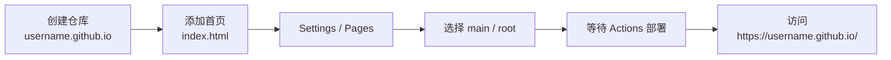

# 申请并部署 `username.github.io` 个人主页完整指南

`username.github.io` 是 GitHub Pages 提供的个人主页地址。只要你的 GitHub 用户名是 `username`，并创建一个名为 `username.github.io` 的仓库，就可以把静态网页部署到：

```text
https://username.github.io/
```

它适合用来放个人主页、作品集、简历、项目文档、学习笔记索引等静态内容。所谓“申请”，本质上不是单独提交审核，而是创建一个符合 GitHub Pages 规则的仓库，并在仓库里启用 Pages 发布。

## 一、申请前准备

开始前需要准备三件事：

1. 一个 GitHub 账号。
2. 一个明确的 GitHub 用户名，例如 `octocat`。
3. 一份可以公开访问的网页内容，例如 `index.html`、`index.md` 或 `README.md`。

注意：GitHub Pages 站点发布后会公开出现在互联网。即使某些付费计划允许从私有仓库发布 Pages，站点内容本身仍可能被外部访问。因此，不要把密码、密钥、内网地址、未公开文档或个人隐私信息放进去。

## 二、创建 `username.github.io` 仓库

登录 GitHub 后，按下面步骤创建仓库：

1. 点击右上角的 `+`。
2. 选择 `New repository`。
3. 在 `Owner` 中选择你的个人账号。
4. 仓库名填写：

```text
username.github.io
```

把 `username` 替换成你的 GitHub 用户名。例如用户名是 `octocat`，仓库名就必须是：

```text
octocat.github.io
```

这里有几个容易踩坑的点：

- 仓库名必须和 GitHub 用户名完全对应。
- 如果用户名包含大写字母，仓库名里要使用小写形式。
- 这是用户站点仓库，不是普通项目站点仓库，所以访问地址是根域名形式：`https://username.github.io/`。
- 如果使用 GitHub Free，通常需要使用公开仓库来发布 GitHub Pages。

创建仓库时建议勾选 `Add a README file`，这样仓库创建后马上有一个基础文件，后续也更容易确认 Pages 是否能正常构建。

## 三、添加首页文件

GitHub Pages 会寻找入口文件。最常见的入口文件有三种：

- `index.html`
- `index.md`
- `README.md`

如果你只想快速验证部署，可以在仓库根目录新建一个 `index.html`：

```html
<!doctype html>
<html lang="zh-CN">
  <head>
    <meta charset="utf-8" />
    <meta name="viewport" content="width=device-width, initial-scale=1" />
    <title>我的个人主页</title>
  </head>
  <body>
    <h1>Hello, GitHub Pages</h1>
    <p>这是我的 username.github.io 个人主页。</p>
  </body>
</html>
```

提交这个文件到默认分支，通常是 `main`。

如果你想写 Markdown，也可以创建 `index.md`：

```markdown
# 我的个人主页

欢迎来到我的 `username.github.io`。

- 作品集
- 学习笔记
- 联系方式
```

## 四、开启 GitHub Pages 部署

进入刚创建的仓库，按下面步骤启用 Pages：

1. 打开仓库页面。
2. 点击 `Settings`。
3. 在左侧找到 `Pages`。
4. 在 `Build and deployment` 区域，把 `Source` 选择为 `Deploy from a branch`。
5. 在分支下拉框中选择 `main`。
6. 文件夹选择 `/(root)`。
7. 点击 `Save`。

配置完成后，GitHub 会自动创建一次 Pages 部署任务。你可以进入仓库的 `Actions` 页面查看构建和部署状态。

如果你的网站不是直接把静态文件放在仓库根目录，而是需要通过 Vite、Astro、Next.js 静态导出、Hugo 等工具构建，那么更推荐选择 `GitHub Actions` 作为发布源，让工作流先构建产物，再部署到 GitHub Pages。

## 五、访问你的站点

部署完成后，访问：

```text
https://username.github.io/
```

也可以在仓库的 `Settings` → `Pages` 页面里点击 `Visit site`。

首次发布或修改后，GitHub Pages 可能需要几分钟才会更新。官方文档说明，推送变更后最多可能需要约 10 分钟才能发布；如果过了很久仍没有变化，再检查构建日志和 Pages 配置。

## 六、常见问题排查

### 1. 打开后是 404

优先检查：

- 仓库名是否是 `username.github.io`。
- `username` 是否和 GitHub 用户名一致。
- Pages 发布源是否选择了正确分支。
- 发布文件夹是否选择了 `/(root)` 或实际存放站点文件的目录。
- 根目录是否存在 `index.html`、`index.md` 或 `README.md`。
- `Actions` 页面里 Pages 部署任务是否失败。

### 2. 页面没有更新

可以按这个顺序检查：

1. 确认代码已经 push 到 GitHub。
2. 打开 `Actions`，确认 Pages workflow 已经执行成功。
3. 等待几分钟后强制刷新浏览器。
4. 如果使用了自定义域名，再检查 DNS 缓存和 HTTPS 状态。

### 3. 构建失败

如果你使用 Jekyll 或其他静态站点生成器，构建失败通常来自：

- 配置文件格式错误。
- 依赖版本不兼容。
- Markdown 或模板语法错误。
- 构建输出目录不符合 Pages workflow 配置。

最直接的排查方式是打开 `Actions` 的失败记录，阅读红色报错日志，从第一条真实错误开始修。

### 4. CSS 或图片加载失败

个人站点 `username.github.io` 部署在根路径，资源路径通常可以从 `/` 开始写。但如果你后来把同一套站点部署到项目站点，例如 `https://username.github.io/repo/`，就要额外处理 base path。

对于个人主页仓库，常见写法是：

```html
<link rel="stylesheet" href="/style.css" />

```

### 5. Repository rename 不可用，或用户名被占用

这是最常见、也最容易误解的一类问题。

`username.github.io` 不是一个可以随便申请的全局站点名。它必须和 GitHub 账号名匹配：

```text
GitHub 用户名: username
Pages 仓库名: username.github.io
访问地址: https://username.github.io/
```

所以如果你想申请的 `username` 已经被别人注册为 GitHub 用户名，就不能直接创建 `username.github.io` 作为自己的用户站点。即使你在自己的账号下创建类似仓库，也不会获得那个用户名对应的根站点地址。

遇到这种情况，有四种可行方案：

1. 使用你当前 GitHub 用户名对应的地址，例如 `your-current-name.github.io`。
2. 创建项目站点，例如仓库名叫 `homepage`，访问地址变成 `https://your-current-name.github.io/homepage/`。
3. 绑定自定义域名，例如 `example.com` 或 `blog.example.com`，这样对外展示时就不依赖 GitHub 用户名。
4. 如果你确实拥有目标品牌名，可以尝试联系 GitHub Support 了解用户名释放或商标相关流程，但这不是 Pages 部署流程的一部分，也不能保证成功。

如果 `Repository rename` 按钮不可用，通常优先检查：

- 当前账号是否有该仓库的管理员权限。
- 目标仓库名是否已经在同一个账号或组织下存在。
- 仓库是否属于组织，且组织权限限制了重命名。
- 你输入的目标名是否符合 `当前账号名.github.io` 的用户站点规则。

实用建议：如果只是为了对外展示个人主页，最稳的做法是先用当前用户名完成部署，再绑定一个自己的域名。这样以后即使 GitHub 用户名变化，对外入口也可以保持稳定。

### 6. `username.github.io` 自动跳转到旧域名

如果访问 `https://username.github.io/` 时自动跳转到一个旧域名，通常说明这个 Pages 站点仍然配置了旧的 `Custom domain`，或者发布源里还残留 `CNAME` 文件。

按下面顺序重置：

1. 进入 `username.github.io` 仓库。
2. 打开 `Settings` → `Pages`。
3. 在 `Custom domain` 区域点击 `Remove`，移除旧域名。
4. 回到代码页，检查发布源根目录是否存在 `CNAME` 文件。
5. 如果有 `CNAME` 文件，并且里面写的是旧域名，删除这个文件并提交。
6. 打开 `Actions`，等待 Pages 重新部署完成。
7. 重新访问 `https://username.github.io/`。

如果仍然跳转，再继续检查：

- 浏览器缓存：换无痕窗口、换浏览器，或清理该站点缓存。
- DNS 缓存：旧域名 DNS 可能仍指向 GitHub Pages，但这通常影响旧域名访问，不应该让 `username.github.io` 永久跳转。
- 仓库来源：确认你改的是个人站点仓库 `username.github.io`，不是某个项目站点仓库。
- 构建产物：如果使用静态站点生成器，检查构建后的 HTML 里是否写死了旧域名，例如 `<meta http-equiv="refresh">`、JavaScript `location.href`、canonical URL 或站点配置里的 `baseURL`。

可以用命令查看当前跳转链：

```bash
curl -I https://username.github.io/
```

如果响应里出现类似下面的头，就说明服务器侧仍在跳转：

```text
HTTP/2 301
location: https://old-domain.example/
```

重置后，`curl -I` 应该不再返回旧域名作为 `location`。

## 七、可选：绑定自定义域名

如果你有自己的域名，例如：

```text
example.com
```

可以在仓库的 `Settings` → `Pages` → `Custom domain` 中填写域名，然后根据 GitHub 的提示去域名服务商处配置 DNS。

常见方案：

- 根域名：`example.com`
- 子域名：`www.example.com`
- 技术博客：`blog.example.com`

配置自定义域名后，还要等待 DNS 生效，并确认 Pages 页面中的 HTTPS 选项可用。生产使用时建议开启 HTTPS 强制访问。

## 八、推荐的最小发布流程

如果只是想快速拥有一个个人主页，可以按这个最小流程走：



这条路径足够简单，也方便后续升级：先用一个静态 `index.html` 上线，等个人内容稳定后，再迁移到 Astro、VitePress、Hugo、Jekyll 或其他静态站点生成器。

## 参考资料

- GitHub Docs: [Creating a GitHub Pages site](https://docs.github.com/en/pages/getting-started-with-github-pages/creating-a-github-pages-site)
- GitHub Docs: [Configuring a publishing source for your GitHub Pages site](https://docs.github.com/en/pages/getting-started-with-github-pages/configuring-a-publishing-source-for-your-github-pages-site)
- GitHub Docs: [About custom domains and GitHub Pages](https://docs.github.com/en/pages/configuring-a-custom-domain-for-your-github-pages-site/about-custom-domains-and-github-pages)
