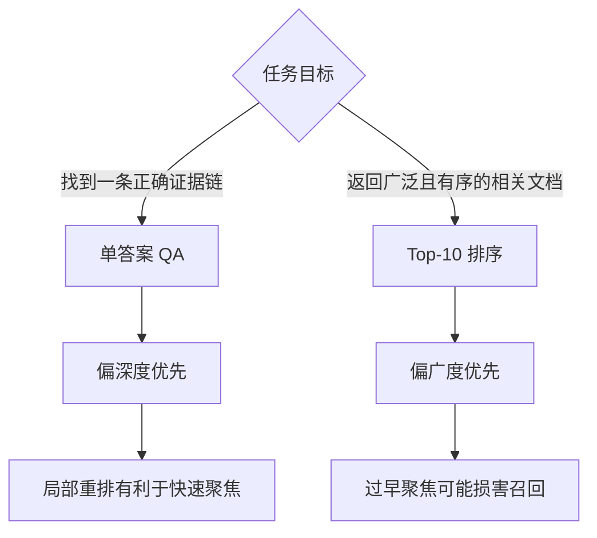

# 相关性不只选文档：RARG 与 Agentic Search 执行先验

> [!abstract] 一句话摘要
> 这篇论文最重要的贡献，不是又发明了一个向量检索器，而是重新安排了**相关性 (Relevance)** 在 Agent 搜索中的岗位：它不只负责“把哪些内容交给模型”，还负责“从哪里开始、先搜索哪些文件、哪些局部命中先进入有限的观察窗口”。作者把这种作用称为**执行先验 (Execution Prior)**。

> [!info] 论文信息与证据边界
> - 论文：*A New Role for Relevance: Guiding Corpus Interaction in Agentic Search*
> - 作者：Jiangnan Li、Yuqing Li、Mo Yu、Jinchao Zhang、Jie Zhou
> - 版本：arXiv:2607.24223v1，官方元数据显示提交于 **2026-07-27 09:56 UTC**
> - 本文检索截止：**2026-07-30**
> - 主要依据：论文原文、官方代码仓库及 DCI、RISE、DR-DCI、BRIGHT、BrowseComp-Plus 等原始论文/官方实现
> - 截至检索日，论文非常新，尚未发现独立复现或后续研究。本文会严格区分“作者报告”“可由代码交叉验证的事实”“本文推演”和“仍未解决的缺口”。

关联记录：[[GitHub Daily/GitHub-Trending-日报-2026-07-30]]

---

## 0. 先给结论：这篇论文到底说了什么？

把整个工作压缩成一句白话：

> 当 Agent 只能看到有限数量的搜索结果时，相关性排序不应只决定“候选有哪些”，还应决定“搜索程序先执行什么”以及“模型先看到什么”。

论文将这套方法称为 **RARG**，把语义相关性注入 Agent 与本地语料交互的三个阶段：

1. **RARG：先搜索哪些文档**  
   向量模型把文档路径排好序，`ripgrep` 按该顺序扫描。
2. **RARG+：从哪里开始搜索**  
   在搜索开始前，向 Agent 提供 10 个高度相关的短段落作为入口。
3. **RARG++：哪些局部命中先可见**  
   从最多 500 个 `rg` 命中中再次语义重排，只把前 30 或 60 个交给 Agent。

实验给出两个看似矛盾、实则非常重要的结果：

- 在**单答案问答** BrowseComp-Plus 上，RARG++ 最好：更快聚焦通常有利。
- 在**Top-10 文档排序** BRIGHT 上，RARG+ 最好，RARG++ 反而退步：过早聚焦会伤害广泛召回。

因此，这篇论文真正值得带走的不是“RARG++ 永远最好”，而是：

> **相关性控制的粒度必须与任务的搜索形状匹配。** 单答案验证偏深度优先；Top-k 排序偏广度优先。

---

# 第一部分：故事线——Agent 在十万份文件里找一个人

## 1. 主角与困境：会思考的 Agent，为何仍在语料库里迷路？

想象一个任务：

> 找出某位数学家。他在 1983 年取得数学博士学位，后来成为 AMS Fellow；他与另外两人合写过论文，其中一位获得 Rollo Davidson Prize，另一位在 1990 年代发表过一篇标题以 “Line” 结尾的论文。

答案是 **Russell David Lyons**。但问题没有直接给出姓名，需要跨多份简历、奖项记录和论文页面建立证据链。

传统搜索系统通常先找出 top-k 文档，再把它们交给大模型。问题是：

- “整篇文档语义相似”不代表其中有决定性证据；
- 关键证据可能只是一句局部文字；
- 多跳问题中，后续需要的文档往往要等第一个实体被发现后才知道；
- 上下文和工具输出都有预算，匹配太多时后面的内容会被截断。

于是出现两种极端：

| 路线 | 优点 | 核心缺陷 |
|---|---|---|
| 传统 RAG | 高效地给出少量候选 | top-k 太早决定边界，可能丢失长尾证据 |
| 直接语料交互 DCI | Agent 可用 `rg`、`Read`、脚本自由探索 | 没有全局方向感，容易在海量文件中盲搜 |

RARG 要解决的正是这个矛盾：

> 能否保留 DCI 的细粒度探索能力，同时给搜索过程装上一只“相关性罗盘”？

## 2. 旧路：相关性通常只做两件事

在论文之前，相关性大多扮演两个角色。

### 2.1 内容筛选器

传统 **检索增强生成 (Retrieval-Augmented Generation, RAG)**：

```text
问题 → 检索器 → top-k 文档/片段 → LLM 回答
```

相关性决定哪些内容进入上下文。这很高效，但 top-k 是一道硬门：门外的文档通常不会再被 Agent 触及。

### 2.2 工作空间建造者

RISE 等方法不只返回片段，而是先检索一批文件，构成 Agent 后续可探索的**有界工作空间 (Bounded Workspace)**。

这比一次性 top-k 更灵活，但相关性主要仍在“交互开始之前”发挥作用：空间建好后，Agent 如何在其中搜索，排序信号往往没有继续传递。

## 3. 转折：排序信息为什么会在工具调用处丢失？

假设检索器已经把 10,000 个路径按相关性排好：

```text
rank 1   doc_A.txt
rank 2   doc_B.txt
...
rank 9999 doc_Z.txt
```

Agent 接着运行：

```bash
rg "Russell|Lyons" corpus/
```

如果 `rg` 并行扫描整个目录，最终输出顺序受线程调度、文件大小和 I/O 完成时间影响。上一步辛苦得到的相关性排序，到工具执行层就消失了。

而工具输出又有硬上限。若只保留前 30 条命中，那么“哪些命中先完成”实际上决定了“Agent 能看到什么”。这不是展示层细节，而是搜索策略的一部分。

这就是论文的关键洞见：

> **排序不是一个静态列表属性；在预算受限的 Agent 系统中，排序必须一路传播到执行顺序与输出截断。**

---

# 第二部分：统一心智模型

## 4. 从“选内容”到“调度计算”

可以把一次 Agent 搜索拆成四层：


读图方式：

- **候选空间**回答“允许搜索哪些文档”；
- **遍历顺序**回答“先在哪些文档执行工具”；
- **局部匹配**回答“文件中哪些行命中”；
- **观察窗口**回答“预算有限时模型实际看到哪些命中”。

传统检索多在第一层使用相关性。RARG 把相关性继续传到第二层；RARG++ 又传到第四层。

### 4.1 三个控制问题

| 变体 | 相关性回答的问题 | 技术机制 |
|---|---|---|
| RARG | 先搜索哪些文档？ | 有序 scope + `rg -j1` |
| RARG+ | 从哪里开始？ | top-10 相关段落初始化 |
| RARG++ | 哪些局部匹配先可见？ | match-level reranking |

### 4.2 核心不变量

论文的核心机制依赖三个不变量：

1. **顺序保持不变量**：文档级相关性顺序必须能影响实际扫描顺序。
2. **预算对齐不变量**：输出被截断时，优先保留的应是任务相关性更高的结果，而不是偶然更早完成的结果。
3. **交互自由度不变量**：相关性只是先验，不应把 Agent 永久锁死在第一次检索结果中；Agent 仍可更换查询、建立新 scope、读取上下文并验证假设。

但第三条不是绝对的：默认 scope 最多 10,000 个路径，仍然构成候选边界。因此 RARG 更准确的描述是：

> 在较大的、按相关性排序的候选空间内进行直接语料交互，而不是完全无限制的全语料 DCI。

---

# 第三部分：RARG、RARG+、RARG++ 逐层拆解

## 5. 基础 RARG：让 `rg` 按相关性顺序工作

### 5.1 第一步：`embed_recall` 只生成路径 scope

Agent 首先用原问题调用：

```text
embed_recall(scope_query)
```

检索器将文档按 embedding 相似度排序，把最多 10,000 个路径写入临时文件：

```text
/tmp/scope_0.txt
```

基础 RARG 不直接返回正文，只返回 scope 文件及其查询映射。相关性在这里主要是**控制通道**，不是证据内容。

### 5.2 第二步：用有序路径驱动 `rg`

概念命令如下：

```bash
cat /tmp/scope_0.txt | xargs -d '\n' rg -j1 "PATTERN"
```

其中 `-j1` 强制 `ripgrep` 单线程运行。作者通过命令改写确保 `rg` 调用带上该参数，从而尽量让输出顺序跟随输入路径顺序。

### 5.3 局部状态推演

```text
embedding 排名：
  1. A.txt  相似度 0.91
  2. B.txt  相似度 0.86
  3. C.txt  相似度 0.74

有序扫描：
  A.txt → 无匹配
  B.txt → 命中 2 条
  C.txt → 命中 8 条

输出预算：最多 3 条

Agent 实际看到：
  B.txt 的 2 条 + C.txt 的第 1 条
```

如果改成并行扫描，C.txt 可能先完成，3 条预算全部被 C 占满；B 中更相关的两条证据反而不可见。

### 5.4 关键取舍

`-j1` 同时带来收益与成本：

- 收益：顺序确定、可提前停止、相关性真正控制可见结果；
- 成本：放弃 `rg` 的多线程吞吐，真实 wall-clock 延迟可能增加。

因此论文更有力地证明了“交互步数减少”，并没有完整证明“端到端延迟更低”。

## 6. RARG+：给冷启动一个入口

基础 RARG 虽然知道先扫哪些文档，但 Agent 一开始仍要猜搜索词。多跳任务中，原问题可能只有间接描述，没有关键实体姓名。

RARG+ 增加**入口点初始化 (Entry-Point Initialization)**：

1. 取 scope 排名前若干文档；
2. 切成 400–1,000 字符的段落；
3. 对段落重新编码并与 scope query 计算相关性；
4. 返回得分最高的 10 个段落。

这些段落用 `<qr_paragraph>` 包裹，直接进入 Agent 初始观察。

> [!note] 严谨措辞
> 因为 RARG+ 会返回段落，所以“相关性完全不再是内容通道”只适用于基础 RARG。RARG+ 是“执行先验 + 小规模初始化内容”的混合设计。

初始化段落的价值不是替 Agent 回答，而是把状态从：

```text
我不知道该搜哪个人
```

推进到：

```text
Russell Lyons 很可能是候选；现在验证博士年份、奖项、合著关系
```

这叫**信息状态跃迁**：搜索从开放式发现转成目标明确的验证。

## 7. RARG++：把相关性注入局部匹配

即使相关文档排在前面，一个宽泛正则仍可能产生大量命中。RARG++ 再增加一层：对 `rg` 的局部结果重排。

### 7.1 两级候选

```text
文档级候选：最多 10,000 个路径
        ↓ 有序 rg
局部匹配池：最多 M = 500 条
        ↓ 语义重排
模型可见：BC+ 30 条 / BRIGHT 60 条
```

### 7.2 重排查询如何构造

默认不是让 Agent 额外生成一段自然语言，而是规则组合：

```text
全局 scope query
+ 当前 rg pattern 提取出的局部关键词
```

概念形式：

```text
Query: [原问题或当前 scope 问题]
RG focus: [当前正则中的关键词]
```

这样同时保留：

- **全局意图**：最终想解决什么问题；
- **局部意图**：这一次 `rg` 正在查什么。

若只用全局问题，局部命中可能无法区分；若只用正则词，又容易失去多跳任务的整体目标。

### 7.3 为什么生成式变体更快却更差？

作者还测试了由 Agent 显式生成 `rerank_query` 的版本。GPT-5.4-mini 下：

- 默认 RARG++：84% accuracy，23.9 tools；
- 生成式 RARG++：75% accuracy，17.8 tools。

它更快，却错得更多。作者认为显式生成重排查询扰动了模型熟悉的 Bash/`rg` 行为，形成训练—评测鸿沟。更一般地说：

> 更少调用可能意味着更高效，也可能意味着过早收敛。只有同时保持正确性，收敛速度才有意义。

---

# 第四部分：贯穿案例——为什么 T7 能提前到 T2？

## 8. BrowseComp-Plus Query 229

正确答案是 **Russell David Lyons**。需要联合验证博士年份、AMS Fellow、合著者奖项和另一位合著者的论文标题。

论文附录给出的压缩轨迹：

| 方法 | 总轮数 | 工具数 | 首次出现完整姓名 |
|---|---:|---:|---:|
| RARG | 17 | 33 | T7 |
| RARG+ | 11 | 18 | T2 |
| RARG++ | 10 | 10 | T2 |

### 8.1 RARG：方向正确，但冷启动仍慢

RARG 已在较相关文档中搜索，但 Agent 前几轮仍在奖项获得者和潜在合著者之间探索。直到 T7，它才看到 Lyons 的简历信息：1983 年获得数学博士学位。

### 8.2 RARG+：入口段落改变问题性质

初始化段落使 Lyons 的 CV 很早进入视野。到 T2，Agent 已经不再问“Person A 是谁”，而是在问“Lyons 是否满足其余约束”。

### 8.3 RARG++：压缩后续验证

match-level reranking 让后续几次搜索更快暴露高价值局部命中，因此工具数进一步降到 10。

> [!warning] 案例不能替代总体实验
> 这条轨迹很好地解释机制，却不能单独证明 RARG++ 普遍优越。它是一个定性案例；总体结论仍要看完整表格，而且 BRIGHT 上 RARG++ 并非最佳。

---

# 第五部分：实验结果及正确读法

## 9. BrowseComp-Plus：100K 文档上的单答案问答

### 9.1 GPT-5.4-mini

| 方法 | Accuracy | Turns | Tools |
|---|---:|---:|---:|
| RISE | 78% | 24.3 | 28.7 |
| DCI | 78% | 48.8 | 99.1 |
| RARG | 80% | 18.2 | 29.8 |
| RARG+ | 81% | 20.2 | 29.6 |
| **RARG++** | **84%** | **17.6** | **23.9** |
| RARG++ generative | 75% | 15.8 | 17.8 |

这里支持的结论是：在该 100-query 样本、该模型和该运行设置下，RARG++ 同时取得更高准确率和较少工具调用。

但 84% 对 78% 只有 6 道题之差，论文没有报告逐题配对显著性检验、bootstrap 置信区间或重复 API 运行方差。它是有吸引力的初步证据，不是统计上已经封口的定论。

### 9.2 换模型后，效率结论并不完全保持

GPT-5.4-nano：

| 方法 | Accuracy | Tools |
|---|---:|---:|
| RISE | 68% | 28.7 |
| DCI | 71% | 126.5 |
| RARG++ | **79%** | 36.1 |

RARG++ 准确率更高，但工具数 **36.1 高于 RISE 的 28.7**。因此不能笼统写成“RARG++ 总是工具更少”。

GPT-5.4：

| 方法 | Accuracy | Tools |
|---|---:|---:|
| RISE | 82% | 34.30 |
| RARG++ | **91%** | **25.43** |

该配置下优势再次出现，但 RISE 的 thinking effort 没有清楚注明，比较仍需谨慎。

## 10. 从 100K 扩到 1M：不是无损扩展，而是相对更稳

| 方法 | 100K Accuracy | 1M Accuracy | 变化 |
|---|---:|---:|---:|
| RISE-BM25 | 77% | 69% | -8 |
| RARG | 80% | 78% | -2 |
| RARG+ | 81% | 78% | -3 |
| RARG++ | 84% | 79% | -5 |

RARG++ 在 1M 上仍比论文复现的 RISE-BM25 高 10 点，但自身也从 84% 降到 79%。所以应说“相对更稳”，不能说“规模增加不影响 RARG”。

新增的 900K 文档是较长的 FineWeb-Edu 干扰文档，会制造大量偶然词面匹配。这不是所有真实语料扩容的代表，因此不能直接外推到动态 Web、多语言语料或企业知识库。

> [!danger] 跨论文冲突：RISE 的 1M 结果
> RARG 论文报告 RISE-BM25 在 1M 上为 69%；RISE 原论文/官方仓库则报告相近设置从 77% 升到 81%。目前缺少完全一致的 corpus manifest、hash、索引与逐题输出，无法裁决差异来自语料采样、导出、文档长度还是运行版本。本文保留冲突，不把“领先 10 点”视为已独立确认的稳定事实。

## 11. BRIGHT：RARG++ 为什么反而不是最佳？

论文只评估 BRIGHT 的四个领域，共 423 个查询，并非完整 12 域：

| 方法 | 平均 nDCG@10 | Biology | Earth Science | Economics | Robotics |
|---|---:|---:|---:|---:|---:|
| DCI | 48.43 | 62.05 | 54.94 | 37.13 | 39.59 |
| RISE-BM25 | 41.60 | 50.27 | 47.80 | 33.65 | 34.67 |
| NeMo Agent | 52.89 | 65.15 | 61.85 | **39.05** | 45.49 |
| RARG | 51.75 | 63.87 | 60.54 | 38.50 | 44.07 |
| **RARG+** | **53.36** | **66.70** | **62.16** | 37.23 | **47.34** |
| RARG++ | 50.55 | 61.65 | 61.32 | 36.14 | 43.10 |

反直觉结果：**更细的匹配重排并没有更好。**

原因可用搜索形状解释：



在问答中，只要找到并验证一条正确链路即可；在 nDCG@10 中，需要尽可能覆盖多个相关文档并把它们排好。RARG++ 把观察预算集中在少量局部匹配上，可能过早剪掉有用分支。

这也是全文最重要的反例：

> 相关性指导越细，并不必然越好；控制强度必须服从任务目标。

## 12. 工具调用数为什么不是成本？

论文用 tool calls 描述效率前沿，但不同工具并不同价：

- NeMo 一次 Search 可返回 20 篇完整文档；
- RARG 的 `embed_recall` 主要返回路径；
- `Read`、`Bash`、Search 的信息量不同；
- `rg -j1` 牺牲并行吞吐；
- embedding、FAISS 检索、最多 500 条匹配重排需要额外计算；
- 论文未统一报告 wall-clock、GPU 小时、索引成本、能耗或美元成本。

所以可确定的是：RARG 常能减少某些配置中的**交互步骤**；尚不能确定它在所有环境中都降低端到端成本。

---

# 第六部分：实现细节——真正决定结果的系统工程

## 13. 方法不是一个排序公式，而是一套组合系统

论文使用 DCI-Agent-Lite，最大 100 turns，并修改上下文管理：

- Level-3 compaction；
- 从保留最近 12 turns 改为最近 40 个 tool results；
- compaction threshold 提高到 230K；
- 旧工具结果替换为 `[cleared]`；
- scope 与 query 的映射长期保留；
- RARG+ 初始化段落会在压缩时清除。

因此性能来自如下组合，而非单独来自 embedding 排名：

```text
embedding 质量
+ Agent 指令遵循
+ scope 构造
+ shell 命令改写
+ rg 单线程顺序
+ 输出截断
+ match reranking
+ context compaction
+ backbone 推理能力
```

### 13.1 不同粒度需要不同 embedding

| 场景 | 文档排序/初始化段落 | 短匹配重排 |
|---|---|---|
| BrowseComp-Plus | Qwen3-Embedding-4B | Qwen3-Embedding-4B |
| BRIGHT | llama-nv-embed-reasoning-3b | Qwen3-Embedding-4B |

作者发现 NV 模型适合 BRIGHT 的文档级排序，但短文本匹配重排较差，于是局部层切回 Qwen3。这说明：

> “相关性”不是一个与粒度无关的标量；长文档、段落和单行匹配可能需要不同表征模型。

### 13.2 输出预算参数

| 参数 | BrowseComp-Plus | BRIGHT |
|---|---:|---:|
| 单次 `rg` 最多返回 | 30 条 | 60 条 |
| 单条最大字符数 | 1,000 | 500 |
| RARG++ 候选池 | 500 | 500 |
| RARG++ 最终保留 | 30 | 60 |

当结果被截断时，排序策略就变成了资源分配策略。所谓 relevance，在这里不仅是“判断相似”，还是“给谁分配稀缺观察容量”。

---

# 第七部分：博导式审稿——这篇论文最值得追问什么？

## 14. 贡献是否成立？

成立，而且概念上很干净：论文识别出检索排序在 Agent 工具链中会被执行层和截断层丢失，并提出从文档顺序、入口点和局部命中三个层次传播相关性信号。

它不是新的 embedding 模型，也不是新的文本匹配算法；创新主要在**接口、调度与观察预算**的联合设计。

## 15. 最根本的预设是什么？

论文隐含的根本预设是：

> embedding 排名虽不完美，但足以作为一个“软先验”；只要不把它变成过早的硬过滤，排序收益会大于排序偏差。

这个预设在实验中获得方向性支持，但还没有覆盖以下极端：

- 关键证据在 embedding 排名极低或 scope 外；
- 查询需要先发现新实体才能形成有效语义检索词；
- 语料包含恶意或误导文本；
- 多语言、代码、表格和扫描 PDF 混合；
- 长尾证据需要广度探索，而局部重排持续强化头部偏见。

## 16. 论文没有证明什么？

### 16.1 没有证明统计稳健性

BrowseComp-Plus 只使用 100-query sample。论文未报告：

- paired significance；
- bootstrap confidence interval；
- 多随机种子；
- 多次独立 API run；
- 830 个问题的完整 BC+ 评估。

84% 对 78% 是值得追踪的信号，但不能仅凭点估计宣布普遍胜出。

### 16.2 没有证明开放世界泛化

实验是固定、可文件化的闭集语料，不等同于：

- 开放 Web；
- 实时变化的数据；
- 受访问权限控制的企业语料；
- 需要调用异构 API 的研究 Agent。

### 16.3 没有证明端到端更便宜

没有统一测量 wall-clock、GPU、索引、重排和美元成本。

### 16.4 没有证明 RARG++ 普遍最佳

BRIGHT 已经给出反例；生成式 RARG++ 又说明“更少调用”可能牺牲正确率。

### 16.5 没有充分讨论生产安全

Agent 可以生成 Bash，语料也可能是不可信输入。论文限制了全语料 `ls/find`，但没有系统评估：

- shell command injection；
- prompt injection；
- 路径逃逸；
- 超大正则或灾难性资源消耗；
- 沙箱与只读文件系统；
- 每次工具调用的 CPU、内存和超时配额。

这不否定 benchmark 贡献，但限制了直接生产部署。

## 17. 可复现性判断：部分可复现

官方仓库 `LeqsNaN/RARG` 以 MIT 许可公开，提供 Python/Shell 代码、prompt、运行脚本、100K 语料获取/构造、FAISS 索引和 judge 流程。

但完整复现仍依赖：

- proprietary GPT-5.x；
- GPT-5.1 LLM judge；
- 单 H20 GPU 或同级环境；
- 完整 corpus/index 资产；
- 1M FineWeb 样本及其准确 manifest；
- Linux/GNU 工具行为。

特别是 `xargs -d` 属于 GNU 风格，macOS 的 BSD `xargs` 不原生提供同等参数，跨平台复现需要替代实现。

---

# 第八部分：如何迁移到工程系统

## 18. 通用设计原则

论文可抽象为一句工程原则：

> 当执行结果会被预算截断时，排序信号必须传播到执行调度，而不能只停留在候选生成阶段。

### 18.1 代码库搜索

传统方式：先向量找文件，再由 Agent 任意 grep。

可迁移设计：

1. 按 query 对文件或 symbol 排序；
2. 按 blast radius、调用关系和语义相关性决定遍历顺序；
3. 对 grep/reference matches 二次重排；
4. 在固定 token budget 下优先返回高价值定义和调用点。

但代码搜索还应加入结构先验：definition、caller、callee、test、recently changed，不能只靠文本 embedding。

### 18.2 日志调查

先验可以来自：

- 时间接近故障点；
- trace/span 关系；
- error severity；
- 服务拓扑距离；
- 语义相关性。

搜索工具应优先扫描高风险服务与时间窗，而不是把所有日志并行倾倒后再截断。

### 18.3 数据库诊断

将“相关性作为执行先验”类比为查询优化器：

- 候选表类似 scope；
- join order 类似文档遍历顺序；
- predicate pushdown 类似局部匹配过滤；
- LIMIT 下的 top-k pushdown 类似观察预算分配。

类比边界：数据库优化器依赖代价模型与精确算子语义；RARG 的 embedding score 只是经验性软先验，不能提供同等级正确性保证。

### 18.4 Agent Memory

分层 memory retrieval 可采用：

1. 相关性决定优先扫描哪些 memory block；
2. 时间、实体和来源可信度共同调整顺序；
3. 局部 fact match 再重排；
4. 始终保留探索长尾或切换 scope 的通道，避免记忆回音室。

## 19. 选型矩阵

| 任务形状 | 推荐策略 | 原因 |
|---|---|---|
| 单一事实、单证据 | RARG+ 或 RARG++ | 快速形成候选并验证 |
| 多跳单答案 | RARG++，但保留回退 | 局部重排可加速证据链收敛 |
| Top-k 排序/高召回 | RARG 或 RARG+ | 避免局部过早聚焦 |
| embedding 可靠性低 | sparse+dense hybrid + 多 scope | 单一 dense prior 风险高 |
| 工具延迟远高于模型延迟 | 评估并行扫描 | `-j1` 可能得不偿失 |
| 安全敏感生产环境 | 沙箱化结构工具，不直接开放 Bash | 控制命令与资源风险 |

## 20. 如果我要继续做这项研究

优先实验应是：

1. 在完整 830-query BC+ 上做逐题配对 bootstrap；
2. 发布 corpus/index hash、manifest 和逐题轨迹；
3. 统一测量 wall-clock、GPU 时间、token、美元成本；
4. 对比 `rg -j1`、有序并行扫描、分块并行 + 稳定归并；
5. 研究动态控制：根据任务判断使用 RARG+ 还是 RARG++；
6. 引入 diversity-aware reranking，缓解局部结果同质化；
7. 测试 scope 外探索和低排名证据恢复；
8. 评估恶意文档、prompt injection 与 shell 沙箱；
9. 扩展到完整 BRIGHT、多语言、代码和企业私有语料；
10. 使用开源 LLM 和多种 embedding 模型复现。

---

# 第九部分：附录——理解论文所需的基础知识

## 附录 A：什么是“相关性”？

**相关性 (Relevance)** 不是客观存在于文档中的单一属性，而是相对于查询、任务和使用阶段的关系。

至少要区分：

1. **主题相关**：文档谈论同一主题；
2. **证据相关**：文档包含回答问题所需的证据；
3. **行动相关**：这个结果能帮助 Agent 决定下一步；
4. **排序相关**：它应该比其他候选更早出现；
5. **任务相关**：对单答案有用，不一定对 top-k 召回有用。

RARG 的贡献是把相关性从“内容属性”扩展为“行动调度信号”。

## 附录 B：RAG、Agentic Retrieval 与 DCI

### B.1 传统 RAG

```text
Query → Retriever → top-k chunks → LLM → Answer
```

优点：简单、高吞吐、上下文可控。  
缺点：检索是一次性的，后续推理难以修正早期漏召回。

### B.2 Agentic Retrieval

Agent 可循环执行：

```text
检索 → 阅读 → 形成假设 → 改写查询 → 再检索 → 验证
```

它改善了多跳问题，但许多系统仍依赖固定的 retriever 接口：Agent 能改查询，却不能自由组合底层语料操作。

### B.3 直接语料交互 DCI

**直接语料交互 (Direct Corpus Interaction, DCI)** 把语料暴露成文件，让 Agent 使用 `grep/rg`、`Read` 和脚本做细粒度探索。

核心收益：

- 精确关键词定位；
- 可读取命中上下文；
- 可组合多个约束；
- 搜索过程可被 Agent 自适应控制。

核心缺陷：

- 缺乏全局相关性先验；
- 大语料中容易盲搜；
- 宽泛关键词导致输出爆炸；
- 工具结果压缩后可能遗忘早期证据。

### B.4 相关方法位置

| 方法 | 相关性的主要角色 | Agent 如何交互 |
|---|---|---|
| Pi-Serini | BM25 排序与深度召回 | search / browse / read |
| DCI | 很少提供全局先验 | Bash / Read 直接搜索 |
| RISE | 构造静态有界工作空间 | 工作目录 + shell，可加 TOC |
| DR-DCI | 动态扩张持久工作空间 | `pull(query, topK)` + 局部 DCI |
| RARG | scope + 遍历顺序 | `embed_recall` + ordered `rg` |
| RARG+ | 再加初始化段落 | 更快获得搜索入口 |
| RARG++ | 再加局部匹配重排 | 控制 observation budget |

## 附录 C：BM25——为什么词面检索仍然重要？

BM25 是经典稀疏检索方法。典型形式：

$$
\operatorname{score}(q,d)=
\sum_{t\in q}
\operatorname{IDF}(t)
\frac{f(t,d)(k_1+1)}
{f(t,d)+k_1(1-b+b|d|/\operatorname{avgdl})}
$$

直觉：

- $\operatorname{IDF}(t)$：词越稀有，区分力越强；
- $f(t,d)$：词在文档中出现越多通常越相关，但收益逐渐饱和；
- $b$：校正文档长度；
- $k_1$：控制词频饱和速度。

BM25 特别擅长：

- 人名、编号、错误码；
- API、类名和精确术语；
- 查询与文档有明显词面重合的场景。

它不擅长：

- 同义改写；
- 没有词面重合的语义关系；
- 必须推理后才知道哪个文档相关的问题。

RARG 不是简单地宣告 dense 胜过 BM25。事实上，RISE 的 harness 更适配 BM25，而不同任务也可能需要 sparse+dense hybrid。

## 附录 D：Dense Embedding——把语义映射为向量

Dense retriever 把查询和文档编码为向量：

$$
\mathbf{q}=E(q), \qquad \mathbf{d}=E(d)
$$

再用点积或余弦相似度排序：

$$
\operatorname{sim}(q,d)=
\frac{\mathbf{q}\cdot\mathbf{d}}
{\|\mathbf{q}\|\|\mathbf{d}\|}
$$

优势：即使字面不同，也可能发现语义相关内容。  
风险：

- 长文档向量会稀释局部证据；
- “语义相似”不等于“足以回答”；
- 模型有领域偏差；
- top-k 可能把低排名但关键的证据截掉；
- 不同粒度的文本需要不同表征能力。

RARG 的思路是把 dense score 从硬过滤器降级为软先验：它指导先后顺序，但仍让 Agent 使用精确工具验证。

## 附录 E：Reranking——为什么要先召回再精排？

完整地对百万文档做昂贵语义推理不现实，所以常采用两阶段：

```text
低成本召回大量候选 → 高成本模型精排少量候选
```

RARG++ 的特殊之处在于：精排对象不是完整文档，而是 `rg` 产生的局部匹配。

好处：

- 聚焦真正包含关键词的局部证据；
- 降低进入模型的噪声；
- 在固定输出预算下提高高价值命中的可见概率。

风险：

- 候选池之前已丢失的结果无法恢复；
- 过度聚焦造成结果同质化；
- 重排查询构造错误会放大偏差；
- 对高召回任务，精排可能过早剪枝。

## 附录 F：`ripgrep`、`xargs` 与 `-j1`

`ripgrep`（命令 `rg`）是高性能文本搜索工具，默认会并行处理文件。`xargs` 可以把路径列表变成后续命令的参数。

RARG 的关键命令意图：

```bash
cat scope.txt | xargs -d '\n' rg -j1 "pattern"
```

含义：

1. 按顺序读取 `scope.txt` 中的路径；
2. 把路径传给 `rg`；
3. 单线程扫描，减少并行完成顺序造成的乱序；
4. 在收集足够结果后提前停止。

这不是“让 `rg` 搜得更准”，而是“让相关性排名决定谁先被搜、谁先占用输出预算”。

## 附录 G：观察预算与上下文压缩

### G.1 观察预算

Agent 不可能无限读取工具输出。预算可能表现为：

- 最大行数；
- 最大字符数；
- token window；
- 最大工具调用数；
- 最大 wall-clock；
- context compaction threshold。

因此，搜索系统不只是在做 relevance ranking，还在做**预算分配 (Budget Allocation)**。

### G.2 上下文压缩

长任务中，旧工具结果会被压缩或清除，以给新信息让路。论文保留 scope-query 映射，却允许初始化段落被清除，体现了两类状态：

- **控制状态**：后续行动仍依赖，应该长久保存；
- **内容状态**：完成冷启动后价值下降，可以回收。

这个区分可迁移到 Agent Memory：长期保留决策、索引和来源指针，短期保留大块观察文本。

### G.3 与 Lost in the Middle 的关系

“Lost in the Middle”研究表明，长上下文中证据位置会影响模型利用效果，常出现两端较好、中间较差的位置偏差。这支持一个一般动机：不能只把越来越多内容塞进上下文。

但它并不直接证明 RARG 的 ordered `rg` 是唯一或最佳解法；它只是说明“内容顺序和可见位置很重要”。

## 附录 H：nDCG@10 怎么读？

BRIGHT 使用 **归一化折损累计增益 (Normalized Discounted Cumulative Gain, nDCG)**。

$$
DCG@10=\sum_{i=1}^{10}\frac{2^{rel_i}-1}{\log_2(i+1)}
$$

$$
nDCG@10=\frac{DCG@10}{IDCG@10}
$$

它奖励：

- 相关文档进入前 10；
- 高相关文档排得更靠前；
- 用理想排序归一化后，可跨查询比较。

nDCG@10 衡量排序质量，不等同于问答正确率。因此不能把 BC+ 的 84% accuracy 与 BRIGHT 的 53.36 nDCG 直接比较大小。

## 附录 I：BrowseComp-Plus 与 BRIGHT 测的不是同一件事

### I.1 BrowseComp-Plus

- 固定闭集 Web 语料；
- 提供 gold/evidence documents 与 hard negatives；
- 目标是回答复杂、多跳、单答案问题；
- 本论文仅使用 100-query sample；
- 使用 GPT-5.1 LLM-as-judge。

它比动态 Web API 更可控，但仍不是开放世界研究；数据构造也带有模型和搜索引擎参与产生的偏差。

### I.2 BRIGHT

BRIGHT 测试 reasoning-intensive retrieval，目标是把相关文档排进 top-10。完整 benchmark 有 12 个领域、1,384 个查询；本文只跑 biology、earth science、economics、robotics 四域，共 423 个查询。

所以准确表述应是：

> RARG+ 在作者选择的四个 BRIGHT 子域平均值上取得最佳结果。

不能直接扩大为“在完整 BRIGHT 上全面领先”。

## 附录 J：如何判断 84% 对 78% 是否可信？

如果 100 道题中一个方法答对 84 道、另一个答对 78 道，仅看 6 点差距还不够。

应至少知道：

1. 两种方法错的是不是同一批题；
2. 多次运行是否稳定；
3. judge 是否一致；
4. 差值的置信区间；
5. prompt、thinking effort、预算是否等价。

因为是同一组问题，最合适的是逐题**配对分析**，例如 McNemar test 或 paired bootstrap，而不是只比较两个独立比例。

论文未提供这些结果，因此应把“RARG++ 在这次评估中领先”视为已报告事实，把“它稳定且普遍优于基线”视为尚未证实的推断。

## 附录 K：复现检查清单

### 数据

- [ ] 记录 corpus 来源、版本、采样随机种子
- [ ] 发布 corpus manifest 与 hash
- [ ] 记录文档切分和路径命名规则
- [ ] 提供 100K 与 1M 的差异清单

### 索引

- [ ] embedding 模型精确版本
- [ ] pooling、归一化和相似度函数
- [ ] FAISS index 类型与参数
- [ ] 文档/段落切分参数
- [ ] index hash

### Agent

- [ ] 模型版本与 thinking effort
- [ ] 系统 prompt 和工具 schema
- [ ] 最大 turns、输出预算、超时
- [ ] compaction 策略与 threshold
- [ ] shell rewrite 规则

### 评估

- [ ] 逐题输出与证据轨迹
- [ ] judge prompt、模型与重复评判
- [ ] 多次运行方差
- [ ] paired bootstrap / significance
- [ ] wall-clock、token、GPU、美元成本

### 安全

- [ ] 只读沙箱
- [ ] 命令白名单或结构化搜索工具
- [ ] 路径规范化与逃逸防护
- [ ] CPU/内存/输出/超时配额
- [ ] prompt injection 测试

## 附录 L：理解检验

### L.1 白话复述

为什么“把文档排好序”还不够？

参考答案：因为后续搜索工具可能并行乱序，输出又会被截断；如果排序没有传播到执行层，模型看到的仍可能是偶然先完成的低价值结果。

### L.2 逐步推演

若相关文档排名第二，但一个低相关大文件产生 1,000 条匹配，而工具只返回 30 条：

- 并行无重排时，30 条可能全来自大文件；
- ordered scan 可使高排名文档先被检查；
- match reranking 可进一步选择与全局问题更相关的局部匹配。

### L.3 边界判断

什么情况下 RARG++ 可能比 RARG+ 差？

参考答案：当任务需要广泛召回多个不同相关文档时，局部重排可能把预算集中在同一主题或同一证据链上，降低多样性与召回。

### L.4 迁移题

在代码库中查一个跨模块 bug，你会用哪些先验决定搜索顺序？

可考虑：错误堆栈、调用图距离、最近改动、符号定义、测试失败位置、语义相关性。关键不是只生成一个 top-k 文件列表，而是让这些先验继续影响 caller traversal、grep matches 和有限输出的排序。

---

# 第十部分：最终评价

## 21. 我对论文的总体判断

### 最有价值的贡献

它把一个常被忽略的系统事实说清楚了：

> 在 Agent 搜索中，“相关性排序”必须成为贯穿候选生成、执行调度、局部匹配和观察预算的控制信号。

这个视角比具体的 `rg -j1` 技巧更普遍，可迁移到代码搜索、日志诊断、数据库调查、多工具研究和 memory retrieval。

### 证据强度

- 对方法定义与实现机制：**高置信度**；
- 对特定实验配置中的改进：**中高置信度**；
- 对统计稳健性、通用优越性：**中低置信度**；
- 对生产效率、开放世界泛化和安全性：**尚未充分验证**。

### 最应避免的误读

1. RARG 不是“dense retrieval 替代 grep”；而是 dense prior 调度 grep。
2. RARG++ 不是所有任务的最佳变体。
3. 工具调用更少不等于端到端成本更低。
4. 1M 上领先 RISE 的幅度存在跨论文冲突。
5. 当前结果来自小样本、闭集语料和特定 GPT-5.x 系统，尚无独立复现。

### 三句话收束

1. **RAG 决定看什么，RARG 进一步决定先做什么。**
2. **当观察预算有限时，执行顺序本身就是检索算法。**
3. **越强的聚焦不总是越好：单答案需要深度，排序任务需要广度。**

---

# 参考资料

## 原始论文与官方实现

1. Li, J. et al. [A New Role for Relevance: Guiding Corpus Interaction in Agentic Search](https://arxiv.org/html/2607.24223)（arXiv:2607.24223）
2. [LeqsNaN/RARG](https://github.com/LeqsNaN/RARG)（官方代码仓库）
3. [Beyond Semantic Similarity: Rethinking Retrieval for Agentic Search via Direct Corpus Interaction](https://arxiv.org/abs/2605.05242)
4. [DCI-Agent-Lite](https://github.com/DCI-Agent/DCI-Agent-Lite)
5. [Towards Retrieving Interaction Spaces for Agentic Search](https://arxiv.org/html/2606.06880)
6. [texttron/RISE](https://github.com/texttron/RISE)
7. [DR-DCI: Scaling Direct Corpus Interaction via Dynamic Workspace Expansion](https://arxiv.org/abs/2606.14885)
8. [Rethinking Agentic Search with Pi-Serini](https://arxiv.org/abs/2605.10848)

## 数据集、检索与上下文

9. [BRIGHT: A Realistic and Challenging Benchmark for Reasoning-Intensive Retrieval](https://arxiv.org/abs/2407.12883)
10. [BrowseComp-Plus](https://arxiv.org/html/2508.06600)
11. [NVIDIA NeMo Retriever Agentic Pipeline](https://github.com/NVIDIA/NeMo-Retriever/blob/main/retrieval-bench/submissions/bright_agentic.md)
12. Robertson, S. et al. [The Probabilistic Relevance Framework: BM25 and Beyond](https://dl.acm.org/doi/10.1561/1500000019)
13. Liu, N. F. et al. [Lost in the Middle: How Language Models Use Long Contexts](https://aclanthology.org/2024.tacl-1.9/)

> [!note] 当前性说明
> “截至 2026-07-30 未发现独立复现”是时间受限的公开检索结论，不等于绝对不存在。后续若出现正式版本、复现实验或作者修订，应重新核对本文中的性能数字、1M 冲突与实现细节。
