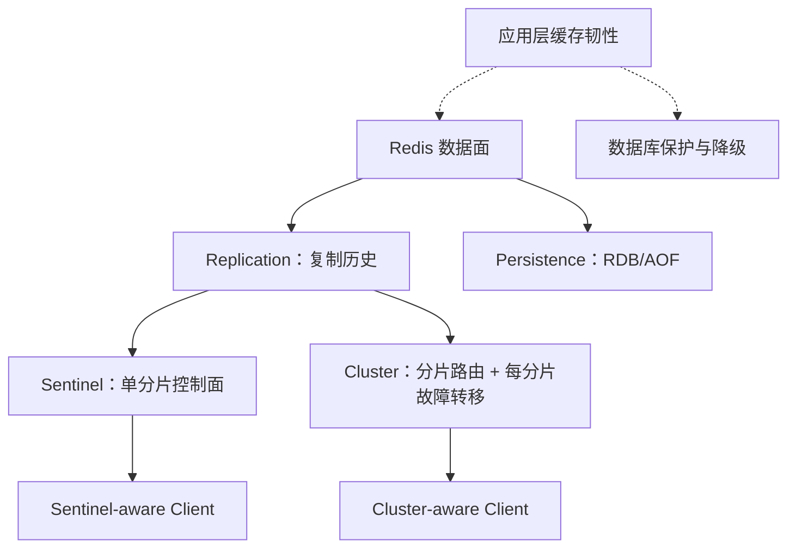
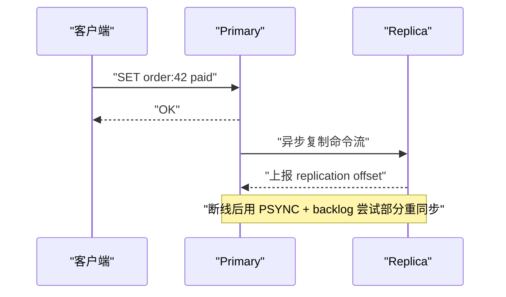
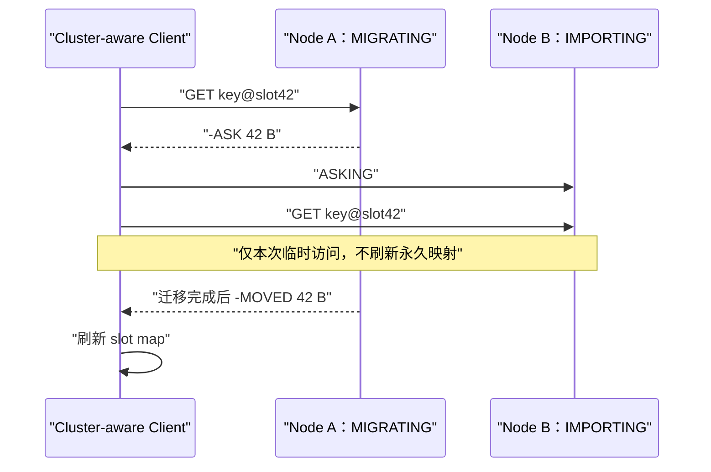
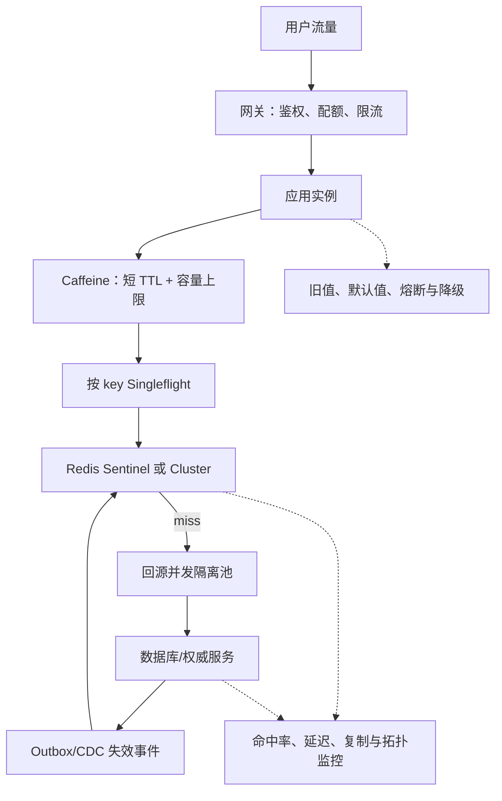

# 缓存穿透、击穿与雪崩：Redis 高可用的三道坎与 Sentinel、Cluster 工程实践

> [!abstract] 一句话理解
> **穿透**是“本来就没有的数据反复绕过缓存”，**击穿**是“一个热点数据失效时并发回源”，**雪崩**是“缓存保护层大面积失效后，流量以正反馈方式压垮下游”。Redis 主从复制、Sentinel 与 Cluster 提高的是缓存服务自身的可用性，却不会自动解决这三类应用层放大效应。真正可靠的系统必须同时建设：**请求治理、缓存重建、一致性、复制持久化、故障转移、分片路由和降级保护**。

> [!info] 阅读范围与证据边界
> 本文以 Redis OSS 为主线，深入解释缓存穿透、击穿、雪崩，以及 Redis replication、Sentinel、Redis Cluster 的设计哲学、算法机制和生产实践。协议事实依据截至 **2026-08-17** 核对的 Redis 官方文档；缓存韧性部分参考 Amazon Builders' Library、Azure Cache-Aside 与 Meta 缓存一致性实践。不同托管 Redis 服务会改变运维界面、持久化和故障转移语义，部署前仍须核对实际产品与客户端版本。文中的阈值选择和架构组合是工程方法，不是脱离业务负载的固定答案。

关联阅读：[[一致性哈希-设计理念-算法机制与工程最佳实践-深入讲解|一致性哈希：设计理念、算法机制与工程最佳实践]]、[[Gossip 与 Raft：从概率传播到多数派共识的设计哲学与工程实践]]

## 1. 先纠正标题：这不是 Redis 一个人的“三道坎”

“缓存穿透、击穿、雪崩”是中文工程社区常用分类，不是 Redis 协议规范中的三个正式状态。它们描述的是**应用、缓存与权威数据源之间的失效模式**：

| 问题 | 失效范围 | 核心矛盾 | 典型可观测现象 |
|---|---|---|---|
| 缓存穿透（Cache Penetration） | 大量不存在或高度离散的 key | 无效请求无法被缓存吸收 | miss 高、DB 查询多、返回多为不存在 |
| 缓存击穿（Cache Breakdown / Stampede） | 单个或少量热点 key | 同一时刻只有一份数据需要重建，却产生大量重复回源 | 某个 key 到期后 DB QPS 瞬时尖峰 |
| 缓存雪崩（Cache Avalanche） | 大量 key、节点或整个缓存层 | 缓存保护能力整体下降，回源与超时形成正反馈 | 命中率骤降、DB 连接耗尽、超时扩散 |

它们不是互斥分类。一场事故可能按如下链路演化：

```text
大量 key 同时失效
      │
      ▼
热点 key 出现并发重建（击穿）
      │
      ▼
DB 变慢 → 回源请求堆积 → 超时重试
      │
      ▼
Redis 和应用线程池也被拖慢
      │
      ▼
更多请求绕过缓存 → 全链路雪崩
```

所以“给 TTL 加随机数”不是完整答案。它只针对“不同 key 的到期时间过度相关”这一种诱因，无法解决 Redis 不可达、部署冷启动、热点迁移、容量淘汰、数据库退化或客户端重试风暴。

## 2. 最小知识依赖：缓存究竟在保护什么

理解三类问题前，需要先建立四层模型：

1. **权威数据源（Source of Truth）**：数据库、远程服务或持久化存储，正确但通常更慢、更贵；
2. **共享缓存（Distributed Cache）**：例如 Redis，跨应用实例共享，容量和网络成本可控；
3. **进程内缓存（Local Cache）**：例如 Caffeine，速度最快，但每个实例有独立副本；
4. **请求保护层**：限流、并发上限、熔断、负载丢弃和降级结果。


缓存的核心价值不只是“快”，而是把下游从高频、重复、可复用的读取中隔离出来。于是缓存可靠性的核心不变量是：

> **缓存失效时，进入权威数据源的并发量必须仍然有界。**

如果系统只有在 99% 命中率下才稳定，那么它不是高可用系统，只是在正常路径上很快。

## 3. 缓存穿透：为什么“不存在”也需要被记住

### 3.1 机制

典型读路径如下：

```text
GET cache[key] → miss → SELECT ... WHERE id = key → no row
```

如果“不存在”没有缓存表达，每次请求都会重复查询数据库。攻击者还可批量生成随机 ID，使普通热点缓存完全派不上用场。

穿透的本质是：

> **缓存只记住存在的数据，却没有记住“已确认不存在”这一事实。**

### 3.2 第一层防线：输入校验与访问控制

先在最便宜的位置拒绝明显非法请求：

- ID 格式、长度、范围、校验位；
- 租户和权限边界；
- API 网关按用户、IP、租户和资源维度限流；
- 防止攻击者枚举整个 key-space。

Bloom Filter 不是鉴权机制。它只能回答“这个元素可能存在吗”，不能回答“这个用户有权访问吗”。

### 3.3 第二层防线：缓存空值（Negative Caching）

数据库确认不存在后，写入一个显式哨兵值：

```text
product:40442 = <NOT_FOUND>, TTL = 60s
```

下一次请求直接返回不存在。空值 TTL 通常短于正常对象，因为新对象可能稍后被创建。

它的代价是：

- 新建对象在负缓存过期前可能暂时不可见；
- 大量随机 key 会污染 Redis；
- “无权限”和“不存在”若共用同一结果，可能造成安全与语义错误；
- 下游临时错误不能随意缓存成“不存在”。

因此负缓存应区分 `NOT_FOUND`、`FORBIDDEN`、`UPSTREAM_ERROR`，并分别设计 TTL 与可见范围。

### 3.4 第三层防线：布隆过滤器（Bloom Filter）

Bloom Filter 用 $m$ 位 bit array 和 $k$ 个哈希函数表达集合。插入元素时设置多个 bit；查询时，只要任一 bit 为 0，就能确定元素**一定不在集合**；所有 bit 都为 1 时，只能说**可能在集合**。

```text
key ──h1──▶ bit[3]  = 1
    ├─h2──▶ bit[17] = 1     全为 1：可能存在
    └─h3──▶ bit[29] = 1     任一为 0：一定不存在
```

其假阳性概率近似为：

$$
p \approx \left(1-e^{-kn/m}\right)^k
$$

其中 $n$ 为已插入元素数。对给定 $m,n$，最佳哈希函数数量近似：

$$
k \approx \frac{m}{n}\ln 2
$$

Bloom Filter 的设计哲学是：**允许少量无害的假阳性，以极小内存换取“绝不假阴性”的快速排除能力。**但“绝不假阴性”只在过滤器同步正确、哈希协议一致的前提下成立。若数据库新增了对象而过滤器未更新，应用会把真实对象误拦在数据库之前。

生产上要明确：

- 过滤器如何全量构建与增量更新；
- 重建时如何双版本切换；
- 标准 Bloom Filter 不擅长删除，是否改用 Counting Bloom Filter；
- 假阳性率、bit 使用率与更新延迟如何监控；
- 过滤器不可用时是 fail-open 还是 fail-closed。

> [!warning] 常见误区
> Bloom Filter 只减少“明显不存在”的回源。假阳性仍会访问数据库；合法但未缓存的数据也必须回源。它不能替代负缓存、限流与数据库容量保护。

## 4. 缓存击穿：一份数据为什么会被重建一万次

### 4.1 最小事故推演

假设 `product:42` 每秒承受 10,000 次读取，在某时刻过期：

```text
T0: key 存在，10,000 QPS 都命中 Redis
T1: key 过期
T1+: 10,000 个请求几乎同时观察到 miss
T1+: 10,000 个请求同时查询数据库
T2: 多个请求重复写回同一份数据
```

这不是缓存容量问题，而是**并发控制问题**。系统真正需要的工作量是一次回源，却执行了一万次。

### 4.2 请求合并（Request Coalescing / Singleflight）

为每个 key 维护一个“正在加载”的共享任务：

```text
第一个 miss：成为 loader → 查询 DB → 填充缓存
后续 miss：等待同一个 future，或返回旧值/快速失败
```

关键不是一把全局锁，而是**按 key 隔离**。否则 `product:42` 的重建会阻塞 `product:99`。

进程内 singleflight 只能合并一个应用实例中的请求。若有 100 个实例，最坏仍可能产生 100 次回源。可进一步组合：

- L1 进程内 singleflight；
- Redis `SET lock_key token NX PX lease` 形成跨实例租约；
- 数据库侧回源并发 semaphore；
- 热点 key 的后台刷新。

必须设计的边界包括：等待超时、loader 取消、失败是否共享、负结果是否缓存、锁租约多长、回源卡死时谁接管。否则压力只是从数据库连接池搬到锁等待队列。

### 4.3 为什么“加分布式锁就绝对安全”是错的

正确的 Redis 锁至少要：

1. 使用 `SET key token NX PX ttl` 原子加锁；
2. 用随机所有者 token 标识持有者；
3. 释放时通过 Lua 比较 token 后删除，避免误删他人锁。

但仍存在：

- 回源时间超过租约，第二个持有者进入；
- JVM Stop-The-World 或进程暂停导致租约过期；
- 续约线程失败；
- loader 已失去锁，却继续把旧结果写回；
- 锁服务自身故障或网络延迟；
- 锁只串行化重建，不保证数据库事务与缓存一致。

如果旧 loader 仍可能产生副作用，需要 fencing token 或对象版本检查，而不是只看“拿到过锁”。

### 4.4 逻辑过期：用短时陈旧换取稳定延迟

对可以容忍旧值的热点数据，把“何时刷新”与“何时不可再服务”拆开：

```json
{
  "data": "...",
  "softExpireAt": "...",
  "hardExpireAt": "...",
  "version": 812
}
```

- `now < softExpireAt`：正常返回；
- `softExpireAt <= now < hardExpireAt`：返回旧值，并由一个请求异步刷新；
- `now >= hardExpireAt`：阻塞重建、回源或降级失败。

这就是 stale-while-revalidate 的思想。它把热点到期从“所有人停下来等新值”改成“绝大多数人继续使用稍旧值，一个人更新”。

代价是明确的陈旧窗口。因此余额、库存扣减、权限撤销等路径不能未经分析直接使用旧值。缓存策略必须服从业务正确性，而不是反过来。

## 5. 缓存雪崩：相关性比单个失败更危险

雪崩的核心不是“很多 key 过期”这一个动作，而是：

> **原本被缓存吸收的负载，在相近时间内相关地落向同一批有限资源，并因超时、重试和队列堆积形成正反馈。**

典型诱因包括：

- 大量 key 使用相同 TTL 或同一批次导入；
- Redis 主节点故障、网络隔离、DNS/TLS 问题；
- 全量 `FLUSHDB`、错误淘汰策略或内存打满；
- 应用扩容后 L1 缓存集体冷启动；
- Cluster resharding 期间客户端路由异常；
- 热点流量突增；
- 数据库本身进入 brownout，回源越来越慢；
- 客户端无退避重试，失败请求指数级放大。

### 5.1 TTL 随机抖动（Jitter）

设基础 TTL 为 $T$，可使用：

$$
TTL = T + U(-\Delta, +\Delta)
$$

或只增加正向抖动。目的不是让 TTL “更随机”，而是降低不同 key 到期时间的相关性。

但 jitter 解决不了同一个热点 key 的并发重建，也解决不了 Redis 整体不可用。前者需要 singleflight/逻辑过期，后者需要多级缓存、限流与降级。

### 5.2 多级缓存与预热

L1 Caffeine 可在 Redis 短暂故障时吸收热点读；预热可降低部署和扩容后的冷启动 miss。但它们都引入新的问题：

- 每个实例的 L1 数据可能不同；
- 失效通知可能丢失；
- 扩容实例仍是空缓存；
- 预热可能把冷数据装入内存；
- Redis 恢复后若所有实例同时刷新，可能发生第二次冲击。

预热应按真实热点、速率受控，并设置 ready gate：缓存尚未达到最低保护能力时，不要一次性接入全部流量。

### 5.3 最后的防线：限流、熔断与负载丢弃

当缓存已经无法保护数据库时，目标应从“服务所有请求”切换为“保护系统不被拖垮”：

- 限制每个接口、租户、key 的回源 QPS；
- 限制全局和按 key 的回源并发；
- 数据库超时后快速熔断，避免长队列；
- 对低优先级请求返回降级数据或旧值；
- 禁止无限重试，使用有上限的指数退避与 jitter；
- 保留核心交易链路，主动丢弃非核心流量。

这不是失败，而是把不可控的全面崩溃变成可控的部分降级。

## 6. 三类问题的组合治理矩阵

| 手段 | 穿透 | 击穿 | 雪崩 | 主要代价 |
|---|---:|---:|---:|---|
| 参数校验/鉴权 | 强 | 弱 | 中 | 规则维护 |
| 空值缓存 | 强 | 中 | 中 | 新数据短时不可见、内存污染 |
| Bloom Filter | 强 | 弱 | 中 | 假阳性、同步与重建成本 |
| singleflight | 弱 | 强 | 中 | 等待队列、单实例边界 |
| 分布式租约 | 弱 | 强 | 中 | 租约、暂停和 fencing 问题 |
| 逻辑过期/旧值服务 | 弱 | 强 | 强 | 短时陈旧、刷新状态机 |
| TTL jitter | 弱 | 弱 | 强 | 过期时刻不可完全预测 |
| L1 本地缓存 | 中 | 中 | 强 | 跨实例一致性、冷启动 |
| 限流/熔断/降级 | 中 | 中 | 强 | 主动牺牲部分可用性或新鲜度 |
| Sentinel/Cluster | 间接 | 间接 | 缓解 Redis 节点故障诱因 | 不解决应用层 miss 放大 |

> [!important] 设计原则
> 不要寻找“一招通吃”。最可靠的方案是分层组合：**入口过滤 + 负缓存 + 按 key 合并 + 软硬 TTL + 随机过期 + 回源并发上限 + 降级**。

## 7. 缓存一致性：没有雪崩，也可能读错数据

### 7.1 Cache-Aside 的真实语义

典型读路径：

1. 读缓存；
2. miss 时读数据库；
3. 把结果写入缓存。

典型写路径：

1. 提交数据库事务；
2. 删除缓存。

通常推荐“先更新数据库，再删除缓存”，因为先删缓存后更新数据库会出现：另一个读请求在数据库尚未更新时读到旧值并重新填入缓存。

但正确顺序也不是原子事务：

- DB 提交成功，`DEL` 失败；
- 慢读在写事务之前读到旧值，却在删除之后才写回；
- 其他写入者绕过缓存失效链路；
- 消息通知丢失或重复。

因此 Cache-Aside 通常是**最终一致**，TTL 是失效遗漏的安全网，而不是一致性证明。

### 7.2 延迟双删为什么只是补偿性启发式

“更新 DB → 删除缓存 → sleep → 再删一次”试图覆盖慢查询晚到的窗口。但固定 delay 无法覆盖：

- 不可预测的长尾延迟；
- 事务提交与读取快照时序；
- 进程在第二次删除前崩溃；
- 删除请求丢失；
- 多地域链路与消费积压。

更稳健的方向是：

- Transactional Outbox + 可重放失效事件；
- CDC 订阅数据库变更；
- 消费端幂等与重试；
- 对象版本号，拒绝旧值覆盖新值；
- 读时校验版本或关键字段；
- 对强正确性路径绕过缓存或读取权威源。

### 7.3 用版本号阻止“旧请求晚到”

```text
DB version = 82
缓存重建请求 A 读到 version 81（很慢）
缓存重建请求 B 读到 version 82（先写入）
A 晚到：若无版本检查，会把 82 覆盖成 81
```

若缓存写入使用“仅当 incomingVersion >= cachedVersion 才更新”，便可阻止时间倒流。Meta 的缓存一致性实践所强调的核心也是：不是只传播 value，还要传播可比较的版本。

## 8. Redis 高可用的分层模型

Redis 的“高可用”至少包含五件彼此正交的事：

| 层次 | 解决的问题 | Redis 机制 |
|---|---|---|
| 数据冗余 | 一个进程挂了，是否还有副本 | replication |
| 持久化与恢复 | 所有进程都重启后，数据从哪里恢复 | RDB / AOF / 备份 |
| 自动故障转移 | 谁判断主节点故障、谁提升副本 | Sentinel 或 Cluster failover |
| 水平扩展 | 单主内存与写吞吐不够怎么办 | Redis Cluster 分片 |
| 应用连续性 | 客户端能否找到新主、处理重定向 | Sentinel-aware / Cluster-aware client |



“有两个副本”不等于“自动高可用”；“有 Sentinel”不等于“零丢数据”；“上 Cluster”也不等于“解决缓存雪崩”。

## 9. Redis 复制：高可用的数据面基础

Redis 基础复制采用 primary-replica 模型，默认是异步复制。主节点向客户端返回 `OK` 时，写入可能尚未到达副本。

Redis 使用 `(replication ID, offset)` 标识一条复制历史及其位置：

- replication ID 区分不同数据历史；
- offset 随复制流字节推进；
- 副本重连时通过 `PSYNC oldId oldOffset` 请求续传；
- backlog 覆盖缺口时执行部分重同步；
- backlog 不足或历史不匹配时执行全量同步。



### 9.1 backlog 是时间窗口，不只是一个内存参数

可用一个容量直觉估算：

$$
backlogBytes \ge peakWriteBytesPerSecond \times toleratedDisconnectSeconds \times safetyFactor
$$

若 backlog 太小，短暂网络抖动也会退化成 full resync，触发 RDB 生成、fork/COW、网络传输和副本加载，反过来放大延迟。

### 9.2 `WAIT` 与 `WAITAOF` 的边界

`WAIT replicas timeout` 等待指定数量副本确认已处理当前连接此前写入的复制 offset。它能显著降低故障转移丢写概率，但不能保证被提升的正好是这些副本，也不保证已经 fsync。

`WAITAOF` 自 Redis 7.2 起可等待本地及指定数量副本把此前写入 fsync 到 AOF。它增强耐久确认，但仍没有解决故障转移选择、网络分区和全局顺序，因此不能把 Redis 变成 Raft 式强一致系统。

> [!warning] 调用不等于满足
> 客户端必须检查 `WAIT` / `WAITAOF` 返回的确认数量是否达到目标。超时返回较小数字时，业务要决定失败、重试还是接受较弱耐久性。

## 10. RDB、AOF、复制与备份不能互相替代

- **RDB**：周期性快照，恢复快，但可能丢失上次快照后的数据；
- **AOF**：记录写操作，常见 `everysec` 策略仍有理论丢失窗口；
- **复制**：提供在线副本，但错误删除、逻辑损坏和空主重启也会传播；
- **备份**：用于跨故障域、跨时间恢复，必须定期验证可恢复性。

一个危险配置是：主节点关闭持久化，同时由进程管理器自动重启。主节点以空数据集快速启动，Sentinel 可能尚未完成切换，副本随后跟随空主并被清空。

高可用关注 RTO，持久化与备份关注 RPO；两者都必须通过演练验证，而不是看配置文件推断。

## 11. Redis Sentinel：单分片的分布式控制面

Sentinel 用于非 Cluster 模式。它提供监控、通知、自动故障转移和主节点服务发现。数据仍是一整份，写入和内存上限仍由单个 primary 承担。

### 11.1 为什么需要多个 Sentinel

单个观察者无法区分：

- Redis primary 真挂了；
- 自己到 primary 的网络坏了；
- 自己事件循环长时间停顿；
- 自己所在机房被隔离。

多个 Sentinel 通过独立观察降低单点误判，并用多数授权约束故障转移。

### 11.2 SDOWN、ODOWN、quorum 与 majority

1. **SDOWN（Subjectively Down）**：单个 Sentinel 在超时内未得到有效响应；
2. **ODOWN（Objectively Down）**：足够数量 Sentinel 同意 master 不可达，数量由 `quorum` 配置；
3. **failover 授权**：执行切换的 Sentinel 还必须获得已知 Sentinel 的多数派授权。

假设 5 个 Sentinel、`quorum=2`：

```text
2 个 Sentinel 同意 → 可以进入 ODOWN
至少 3 个 Sentinel 可通信并授权 → 才能真正执行 failover
```

所以 `quorum` 不是“选举票数”。实际门槛至少是 majority；若 quorum 被设置得高于 majority，还要满足更高的 quorum。

### 11.3 故障转移状态机


副本选择会考虑断连状态、`replica-priority`、复制进度等；priority 为 0 的副本不会被提升。`parallel-syncs` 控制切换后同时重配置多少副本：越大，收敛更快，但多个副本同时全量同步时，读能力与资源压力也更大。

配置纪元（Configuration Epoch）为每次故障转移生成唯一版本，使各 Sentinel 最终向更高版本配置收敛。

### 11.4 TILT：先怀疑自己的时钟

Sentinel 若观察到本地时钟大幅跳变或事件循环长时间停顿，会进入 TILT 保护状态：继续收集信息，但暂时抑制可能导致错误拓扑变更的主动动作。它体现了一个成熟故障检测器的哲学：

> **在无法判断是远端故障还是本地观察失真时，先避免做不可逆切换。**

代价是实际故障恢复可能变慢，因此应监控 TILT、主机时钟、CPU starvation 和长暂停。

### 11.5 客户端是 Sentinel 架构的一部分

客户端必须：

1. 配置多个 Sentinel 地址；
2. 按 master name 查询当前 primary；
3. 验证返回节点角色；
4. 在连接错误、角色变化或故障转移后重新发现；
5. 清理连接池中的旧主连接；
6. 正确处理认证、TLS、NAT 与地址通告。

服务端切主成功但客户端仍固定连接旧 IP，业务仍然不可用。

### 11.6 Sentinel 不能消灭脑裂丢写

网络分区时，旧 primary 可能继续接受旧客户端写入；多数派一侧提升新 primary。分区恢复后，旧主被改成新主的 replica，其独有写入被覆盖。

`min-replicas-to-write` 与 `min-replicas-max-lag` 可让失去足够健康副本的 primary 主动拒写，缩小隔离写窗口，但代价是网络抖动时降低写可用性。这是明确的 CAP 取舍，不是免费增强。

## 12. Redis Cluster：分片、复制与控制面的组合

当数据量或写吞吐超过单 primary 能力时，Redis Cluster 把 key-space 划分为固定的 16384 个 hash slots：

$$
slot = CRC16(key) \bmod 16384
$$

若 key 有 hash tag，例如 `user:{42}:profile`，只对 `{42}` 计算槽位，可让相关 key 共置，从而执行同槽多 key 操作。

> [!warning] Redis Cluster 不使用经典一致性哈希环
> 它使用固定 slots 作为 `key → node` 的稳定间接层。扩缩容时 `key → slot` 不变，运维系统显式迁移 slot。可参考 [[一致性哈希-设计理念-算法机制与工程最佳实践-深入讲解#8.2.3 Redis Cluster：固定槽位把 key 与物理节点解耦|Redis Cluster 固定槽位机制]]。

### 12.1 为什么固定 16384 slots

固定 slots 的设计哲学是把两个变化解耦：

```text
Key ──固定 CRC16──▶ Slot ──可变拓扑映射──▶ Primary ──异步复制──▶ Replica
```

节点扩缩容只改变 `slot → node`，不改变哈希算法。运维者可以控制迁移哪些槽、迁移速率和目标节点。但槽位均匀不等于字节、QPS 或大 key 均匀，仍需根据真实负载再平衡。

## 13. MOVED、ASK 与在线迁移状态机

客户端把请求发到错误节点时：

- `MOVED`：槽位权威 owner 已经改变，应访问新节点并刷新 slot map；
- `ASK`：槽位正在迁移，只把**下一次请求**临时发到目标节点，并先发送 `ASKING`；不要永久修改本地映射。

迁移期间：

- 源节点处于 `MIGRATING`；key 尚在源节点时继续服务，key 已迁走时返回 `ASK`；
- 目标节点处于 `IMPORTING`；只有收到 `ASKING` 后才临时接受该槽请求；
- 迁移完成后更新权威槽归属，旧节点开始返回 `MOVED`。



客户端若把 ASK 当 MOVED，会在槽位尚未完整迁移时把后续请求错误地永久路由到目标节点。

## 14. Cluster Bus、Gossip 与故障检测

Cluster 节点通过全互连 Cluster Bus 交换心跳、节点视图、slot bitmap、故障报告与 epoch。Gossip 用于加速状态传播，但单次 PING 超时不会直接完成切主：

- `PFAIL`：本节点认为对方可能故障；
- `FAIL`：聚合足够 primary 的故障报告后形成集群级判断；
- primary 的 replica 才能进入选举；
- 多数 primary 为候选 replica 授权；
- 获胜 replica 取得更高 `configEpoch` 并接管 slots。

对于同一 slot，更高 `configEpoch` 的 owner 获胜，这称为 **last failover wins**。它解决的是拓扑配置冲突，不会合并两个 primary 上业务 value 的分叉。

Cluster Bus 端口必须在节点之间双向可达。只开放客户端端口会出现“每个 Redis 进程看起来存活，但集群控制面无法通信”的故障。

## 15. Cluster 的分区行为：可用，但不是强一致

Redis Cluster 默认异步复制，官方目标是可接受程度的写安全（acceptable degree of write safety），而非零丢失。

最小反例：

```text
Client → Primary: SET k v     Primary 返回 OK
Primary 在复制给 Replica 前宕机
Replica 被提升
新 Primary 中没有 k=v
```

网络分区时，少数分区中的 primary 可能在 `cluster-node-timeout` 窗口内继续接受部分写入；超过窗口且无法联系多数 primary 后会停止服务。多数分区若仍能覆盖 slots，并且每个故障 primary 有可提升 replica，则可恢复可用。

`cluster-node-timeout` 越短，隔离写窗口和故障发现时间越短，但抖动误判概率更高；越长则误判更少，但恢复与拒写更慢。它必须依据网络 P99/P999、暂停时间和故障演练设置，不能复制“万能值”。

`cluster-require-full-coverage`、replica validity 等配置也在可用性与陈旧/不完整风险之间做取舍。修改前必须明确业务希望“部分槽继续服务”还是“任何槽不可用就整体停止”。

## 16. Replica Migration：修复副本分布，不是数据再平衡

若一个 primary 有多个 replicas，而另一个 primary 已失去所有 replica，Cluster 可让一份 replica 迁移到 orphaned primary，提高下一次故障的可恢复性。

它不会：

- 重新均衡 slots 或业务数据；
- 恢复已经丢失的 slot 数据；
- 在 primary 与唯一 replica 同时故障时凭空创建副本。

跨机架或可用区部署时，应验证自动 replica migration 不会破坏原有故障域布局。

## 17. Sentinel 与 Cluster 怎么选

| 维度 | 主从复制 | Sentinel + 主从 | Redis Cluster |
|---|---|---|---|
| 数据分片 | 否 | 否 | 是，16384 slots |
| 单主写瓶颈 | 存在 | 存在 | 多分片水平扩展 |
| 自动故障转移 | 不内建 | Sentinel 协调 | Cluster 内建 |
| 客户端能力 | 主地址 | Sentinel 服务发现 | slot map、MOVED/ASK |
| 多 key 操作 | 正常 | 正常 | 通常要求同 slot |
| 控制面 | 人工/外部 | 独立 Sentinel | Cluster Bus |
| 默认复制 | 异步 | 异步 | 异步 |
| 已确认写丢失 | 可能 | 可能 | 可能 |
| 运维复杂度 | 低 | 中 | 高 |

实用决策顺序：

1. 单个 primary 能否容纳数据集和峰值写入？
2. 若能，是否只需要自动故障转移？是则优先 Sentinel 或托管服务等价能力；
3. 若单主容量或写吞吐确实不足，才选择 Cluster；
4. 业务是否依赖跨 key 事务、Lua 或批处理？若依赖，能否通过 hash tag 安全共置？
5. 客户端是否正确支持拓扑刷新、MOVED、ASK、重试和连接池清理？
6. 业务 RPO 是否允许异步复制窗口内丢写？若不允许，应重新评估 Redis 在该路径中是否承担权威存储角色。

不要因为“要高可用”就直接上 Cluster。Cluster 解决的是**高可用 + 水平分片**，代价是路由、跨槽限制、在线迁移和更复杂控制面。

## 18. 端到端生产架构：把爆炸半径限制在每一层



这张图的关键不变量是：

- 随机 key 在入口与负缓存层被吸收；
- 同一个热点 key 的回源并发有界；
- Redis 整体不可用时，数据库仍有独立并发上限；
- 缓存一致性失败可通过事件重放和 TTL 修复；
- Sentinel/Cluster 切换后，客户端能重新发现拓扑；
- 所有层都有可观测信号，而不是只监控 Redis `PING`。

## 19. Java 工程实现要点

在 Java/Spring 体系中，组件名称不是保证，关键是语义：

### 19.1 本地请求合并

可使用 `ConcurrentHashMap<K, CompletableFuture<V>>`、Caffeine async loader 或框架 singleflight 机制，但必须保证：

- future 完成后清理 map，避免内存泄漏；
- loader 失败也要完成 future；
- 等待者有超时与取消；
- 按 key 合并而非全局锁；
- 不无限缓存异常结果。

### 19.2 Redis 分布式锁

若使用 Redisson 等库，也要确认看门狗、租约、可重入与故障语义。业务写入仍应带版本或 fencing token。不要把“库提供了 lock API”推导为强一致。

### 19.3 Lettuce/Jedis/Redisson 客户端

核对：

- Sentinel 多地址发现与连接池刷新；
- Cluster topology refresh；
- MOVED/ASK 处理；
- DNS、NAT、TLS 和认证；
- 命令是否幂等，重试会不会重复写；
- pipeline、事务和 Lua 是否跨槽；
- 故障切换期间的最大重试次数、退避与超时预算。

客户端重试必须受到端到端 deadline 约束。一次请求经过三层各重试 3 次，最坏可能放大成 27 次下游调用。

## 20. 可观测性：从命中率看到控制面

只监控 Redis 实例存活远远不够。至少覆盖五层：

| 层次 | 指标 | 回答的问题 |
|---|---|---|
| 应用缓存 | hit/miss/negative-hit、按 key 热点、stale serve | 缓存是否仍在吸收流量 |
| 回源保护 | origin QPS、singleflight waiters、重建耗时/失败、限流量 | miss 是否被放大 |
| Redis 资源 | CPU、内存、fragmentation、evicted/expired keys、P99、slowlog、blocked clients | 缓存节点是否退化 |
| 复制持久化 | replica lag、offset、backlog、full/partial resync、fork/COW、AOF fsync latency | 故障转移候选是否新鲜、恢复是否伤害服务 |
| 控制面 | Sentinel SDOWN/ODOWN/CKQUORUM/TILT/failover；Cluster state、PFAIL/FAIL、slot coverage、MOVED/ASK、configEpoch | 拓扑是否正在变化或失去多数派 |

告警应围绕变化和因果链，而非孤立阈值。例如：

```text
命中率下降 + origin QPS 上升 + DB P99 上升
    比
Redis keyspace_misses 单独升高
    更接近真实雪崩风险
```

对热点 key，应观察单 key QPS、重建频率、value 大小和 loader 延迟。对 Cluster，应同时看 slot 数、字节、QPS 和大 key，不能只看“每节点槽位数量相等”。

## 21. 故障演练：成功切主不是唯一验收标准

建议演练以下场景：

1. 不存在 key 的突发枚举，验证负缓存/Bloom Filter/限流；
2. 单个热点 key 到期，验证回源并发是否有界；
3. 一批 key 同时到期，验证 jitter 与降级；
4. Redis 完全不可达，验证数据库是否被保护；
5. Bloom Filter 增量更新停止，验证新建对象是否被误拦；
6. replica 延迟、backlog 不足和 full resync；
7. Sentinel 失去多数派、primary 网络分区、旧主客户端仍写入；
8. Sentinel failover 后客户端连接池是否刷新；
9. Cluster 少数分区与 `cluster-node-timeout`；
10. resharding 中断、ASK/MOVED 风暴、热点大 key 迁移；
11. AOF/RDB 恢复与异地备份恢复；
12. 应用扩容导致 L1 全部冷启动。

每次演练应记录：

- RTO、RPO 和实际丢写窗口；
- 客户端错误率与恢复时间；
- 数据库峰值回源 QPS；
- 命中率与重建并发；
- 是否触发预期告警；
- 旧 primary 是否正确收敛；
- 是否需要人工介入，以及回滚步骤。

## 22. 常见误区与反例

### 误区 1：缓存空值设 5 分钟就够了

固定 5 分钟没有普适性。应依据对象创建后可见性、攻击速率、内存预算和业务语义决定，并增加随机抖动。

### 误区 2：Bloom Filter 能彻底阻止穿透

假阳性仍会回源；同步失败还可能制造假阴性。它只是概率型前置过滤器。

### 误区 3：加锁后绝对不会击穿

租约过期、进程暂停、跨实例范围和 loader 失败仍会产生重复重建。需要超时、旧值、版本与回源并发上限。

### 误区 4：逻辑过期比物理过期更高级

它只是用陈旧性换稳定性，不适合不能读旧值的数据。

### 误区 5：雪崩就是 TTL 相同

缓存节点故障、冷启动、淘汰、网络问题和下游 brownout 同样能触发雪崩。

### 误区 6：Sentinel quorum=2，两个 Sentinel 就能切主

quorum 用于 ODOWN；真正 failover 仍需多数 Sentinel 授权。生产上通常至少部署 3 个并跨独立故障域。

### 误区 7：Sentinel 或 Cluster 能保证零丢写

Redis 默认异步复制。`WAIT`/`WAITAOF` 可降低风险，但不能提供共识协议的强一致保证。

### 误区 8：Cluster 就是一致性哈希

Cluster 是固定 16384 slots + 显式迁移 + 客户端重定向，不是经典哈希环。

### 误区 9：Cluster 的 last failover wins 会合并业务冲突

它只选择更高 `configEpoch` 的 slot owner，不合并 value。失败一侧未复制写入可能丢失。

### 误区 10：有多级缓存就不怕 Redis 挂

若 L1 同时冷启动、容量不足或失效通知错误，仍会回源。必须对“缓存完全不可用”做容量和降级演练。

## 23. 落地检查表

### 应用与缓存策略

- [ ] 明确定义穿透、击穿、雪崩的本系统口径；
- [ ] 非法输入、权限和随机 key 在入口受控；
- [ ] 负缓存区分不存在、无权限与临时错误；
- [ ] Bloom Filter 有版本、增量更新、重建与降级策略；
- [ ] 热点 key 使用按 key singleflight 或逻辑过期；
- [ ] loader 有超时、并发上限和失败共享策略；
- [ ] TTL 有业务依据，并对跨 key 相关性加 jitter；
- [ ] Redis 不可用时数据库仍受并发与 QPS 保护；
- [ ] Cache-Aside 失效事件可重试、幂等、可回放；
- [ ] 对不能接受旧值的路径显式绕过 stale 策略。

### Redis 数据安全

- [ ] 持久化策略与 RPO 一致；
- [ ] 备份跨故障域并定期恢复验证；
- [ ] backlog 按峰值写入率和断连窗口配置；
- [ ] 监控复制 offset、full resync、fork 与 AOF fsync；
- [ ] 使用 `WAIT`/`WAITAOF` 时检查返回确认数；
- [ ] primary 关闭持久化时，已评估自动重启灾难链。

### Sentinel

- [ ] 至少 3 个 Sentinel，跨独立故障域；
- [ ] 理解 quorum 与 majority 的区别；
- [ ] 持续执行/监控 `SENTINEL CKQUORUM`；
- [ ] 客户端支持 Sentinel 发现并清理旧连接；
- [ ] 配置并演练 `min-replicas-*` 的可用性代价；
- [ ] 监控 SDOWN、ODOWN、TILT 与 failover 全流程。

### Cluster

- [ ] 业务确实需要水平分片，而非只需要自动切主；
- [ ] key 设计符合 hash tag 和跨槽约束；
- [ ] 客户端正确处理 MOVED、ASK、ASKING；
- [ ] Cluster Bus 全互通；
- [ ] primary 与 replica 跨故障域放置；
- [ ] 监控 slot coverage、PFAIL/FAIL、configEpoch 与迁移进度；
- [ ] resharding 有速率限制、暂停门和回滚方案；
- [ ] 已演练少数分区、双故障和客户端陈旧路由。

## 24. 最终心法：高可用不是“永不失效”，而是“失效不放大”

穿透、击穿和雪崩表面上分别对应“坏 key”“热点 key”“很多 key”，底层却共享同一个系统性问题：**失效成本没有被限制，导致本可局部处理的事件向下游扩散。**

Redis 高可用机制也遵循同样的设计哲学：

1. replication 用历史 ID 与 offset 限制重同步成本；
2. Sentinel 用多观察者、quorum、多数授权与配置纪元限制错误切主；
3. Cluster 用固定 slots 限制扩缩容的路由变化，用 PFAIL/FAIL 与 configEpoch 限制拓扑冲突；
4. 应用层用负缓存、singleflight、软硬 TTL 和限流限制 miss 的爆炸半径。

> [!tip] 最终结论
> **Redis 高可用的核心不是保证缓存永远命中、节点永远不挂，而是让 key 不存在、热点过期、节点故障、网络分区和扩缩容发生时，系统仍能把额外工作量、数据风险和恢复时间控制在已知边界内。**

## 25. 思考题

1. 如果 Bloom Filter 的假阳性率是 1%，攻击者每秒发送 100 万个随机 key，数据库仍会承受多少理论回源？还缺哪一层保护？
2. 100 个应用实例都使用进程内 singleflight，为什么一个热点 key 最坏仍会产生 100 次数据库查询？
3. 逻辑过期能消除热点重建延迟，为什么它不能用于权限撤销？
4. 5 个 Sentinel、quorum=2 时，只剩 2 个 Sentinel 可通信，为什么能形成 ODOWN 线索却不能自动切主？
5. Redis Cluster 中 ASK 与 MOVED 如果被客户端混淆，会在在线迁移时造成什么错误？
6. `WAIT 1` 已返回成功，为什么 failover 后写入仍可能丢失？
7. 命中率从 99% 降到 90% 看似只下降 9 个百分点，为什么数据库回源量可能变为原来的 10 倍？
8. 如果 Redis 完全不可用时数据库只能承受正常回源量的 2 倍，系统应如何决定主动降级比例？

## 参考资料与证据边界

### Redis 官方文档

1. [High availability with Redis Sentinel](https://redis.io/docs/latest/operate/oss_and_stack/management/sentinel/)：SDOWN/ODOWN、quorum 与多数授权、故障转移、配置纪元、TILT 和分区边界。
2. [Sentinel client specification](https://redis.io/docs/latest/develop/reference/sentinel-clients/)：客户端发现当前 primary、角色验证与重连接口。
3. [Redis Cluster specification](https://redis.io/docs/latest/operate/oss_and_stack/reference/cluster-spec/)：16384 slots、Cluster Bus、Gossip、PFAIL/FAIL、MOVED/ASK、configEpoch、last failover wins 与写安全边界。
4. [Scale with Redis Cluster](https://redis.io/docs/latest/operate/oss_and_stack/management/scaling/)：Cluster 生产拓扑、hash tag、扩缩容和可用性配置。
5. [Redis replication](https://redis.io/docs/latest/operate/oss_and_stack/management/replication/)：异步复制、replication ID/offset、PSYNC、backlog、部分与全量重同步。
6. [Redis persistence](https://redis.io/docs/latest/operate/oss_and_stack/management/persistence/)：RDB、AOF 与数据恢复边界。
7. [WAIT](https://redis.io/docs/latest/commands/wait/) 与 [WAITAOF](https://redis.io/docs/latest/commands/waitaof/)：复制确认、fsync 确认及非强一致边界。
8. [Distributed locks with Redis](https://redis.io/docs/latest/develop/clients/patterns/distributed-locks/)：所有者 token、租约和安全释放模式。
9. [Redis cache-aside with redis-py](https://redis.io/docs/latest/develop/use-cases/cache-aside/redis-py/)：热点 key 过期与 cache stampede 示例。

### 生产工程资料

10. Amazon Builders' Library, [Caching challenges and strategies](https://aws.amazon.com/builders-library/caching-challenges-and-strategies/)：缓存负载放大、请求合并、旧值服务、故障演练与下游保护。
11. Microsoft Azure Architecture Center, [Cache-Aside pattern](https://learn.microsoft.com/en-us/azure/architecture/patterns/cache-aside)：Cache-Aside 的适用条件与最终一致边界。
12. Meta Engineering, [Cache made consistent](https://engineering.fb.com/2022/06/08/core-infra/cache-made-consistent/)：基于版本的缓存一致性与乱序更新处理。
13. Redis Engineering, [Cache Consistency: Strategies to Keep Data Fresh](https://redis.io/blog/cache-consistency-strategies/)：缓存失效与一致性策略；属于工程文章，权重低于 Redis 协议和命令文档。

### 边界说明

- 本文资料核对截止日为 2026-08-17，不绑定未经独立核验的“最新 Redis OSS 版本号”。命令和配置常量应按实际 Redis tag、`redis.conf`、`sentinel.conf` 与客户端版本再次确认。
- “缓存穿透、击穿、雪崩”没有统一标准组织定义；本文已明确采用的工程口径。英文资料更常使用 negative caching、cache stampede、thundering herd、cache avalanche 等术语，边界可能不同。
- `WAITAOF` 自 Redis 7.2 起提供；旧版本或托管服务未必支持。
- 延迟双删是经验性补偿，不是 Redis 官方一致性协议。
- TTL、jitter、backlog、`cluster-node-timeout`、Sentinel quorum、副本数等参数必须根据 QPS、对象大小、长尾延迟、网络故障模型、RPO/RTO 和演练结果确定，本文刻意不给出脱离负载的固定万能值。
