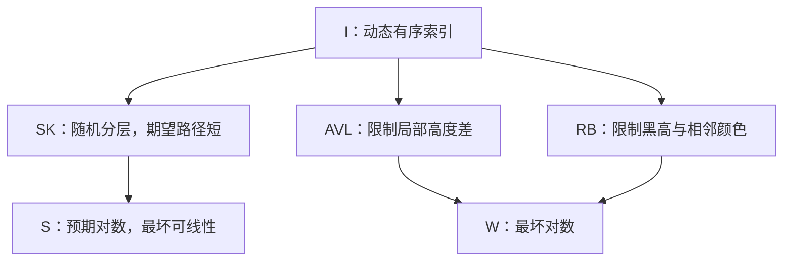
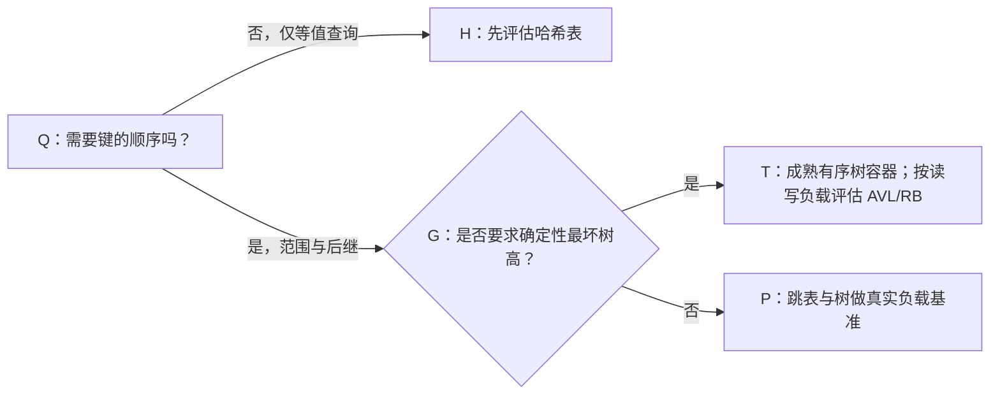

# 跳表、AVL 树与红黑树：概率平衡、旋转与工程选型

> [!abstract] 先记住一句话
> 三者都要让**不断增删的数据保持有序，还能迅速找到某个值或一段范围**。跳表（Skip List）让少数节点随机承担“快速路”，换来**期望**的对数时间；AVL 树（AVL Tree）严格限制每个节点的左右高度差；红黑树（Red-Black Tree）允许更松的局部形状，但限制所有根到叶路径的相对长度。后两者提供**最坏情况**的对数时间保证。它们是内存有序索引的候选，不是无条件替代哈希表或磁盘 B+ 树。[1][2][3]

**读者与证据边界**：面向知道数组、链表和二叉搜索树基本概念的读者；不预设概率论或旋转算法知识。稳定算法结论依原论文、大学课程材料和 CLRS 教科书；工程实例按文中标出的 Redis 7.4 源码、Java 21 API、Linux 6.8 文档及 LevelDB `main` 源码核验（后者分支并非不可变快照）。公开资料核验日期：**2026-09-28**。下文标注“工程推导”的选型建议，不是某产品的性能承诺。

关联阅读：[[tech-knowledge/LSM-Tree — 把随机写变顺序写，B+Tree 在写密集场景下的竞争对手|LSM-Tree 与内存表]]、[[tech-knowledge/一致性哈希-设计理念-算法机制与工程最佳实践-深入讲解|有序坐标上的后继查询]]。

## 1. 为什么需要它们：从一条长队说起

设有有序键 `10, 20, 30, 40, 50, 60, 70`。我们要同时支持：找 `50`、插入 `35`、删除 `40`、取 `[30, 60]` 中的全部键，以及找“不小于 37 的第一个键”。

- **有序数组**：二分定位快，但插入中间要搬移元素，最坏 $O(n)$。
- **普通有序链表**：插入位置找到后接线容易，但定位最坏 $O(n)$。
- **普通二叉搜索树**：用“左小右大”缩小搜索范围；如果按 `10,20,30,...` 插入，树可能退化成链，仍是 $O(n)$。
- **哈希表**：精确键检索常有良好的期望时间，但单凭散列位置不能直接给出排序、`ceiling` 和连续区间。

共同任务是：**维护顺序，同时防止定位路径随着数据增大而过长**。跳表用随机分层避免频繁全局重排；AVL 和红黑树用不同强度的不变量修复退化。



图中的 `SK` 是概率平衡，不是“所有操作都保证快”；`AVL` 与 `RB` 保证树高。三条路都要先定义键的**一致、稳定的全序比较规则**，才能正确做区间查询。

## 2. 跳表：给有序链表修几层“快速路”

### 2.1 最小模型和一次真实查找

想象地铁：底层每站都停，上层只停少数换乘站。从最高层往右走，发现下一站会越过目标就下楼；到最底层时得到第一个不小于目标的节点。这只是类比：真实结构是**一个节点可同时出现在多层，并在每一层保存指向下一个同层节点的指针**，不是每层复制完整数据。[1]

```text
SK：查找 50（箭头表示同层前向指针）
L3  HEAD ───────────────→ 40
L2  HEAD ─→ 20 ─────────→ 40 ─→ 60
L1  HEAD ─→ 10 → 20 → 30 → 40 → 50 → 60 → 70
                               ↑从 40 下到 L1 再向右到 50
```

在 `L3` 到达 `40`；`L2` 的下一个是 `60`，已经超过 `50`，因此下降；在 `L1` 前进到 `50`。**不可变条件**：底层含全部键且有序；任一上层节点也在所有更低层出现；同层指针始终指向更大的下一个键。按这种条件运行，下一层不会漏掉本该找到的键。

插入 `35` 时，沿搜索路径记下每层最后一个小于 `35` 的前驱：`L3=HEAD`、`L2=20`、`L1=30`。若随机得到新节点高度为 2，就在 `L1` 将 `30→40` 改为 `30→35→40`，在 `L2` 将 `20→40` 改为 `20→35→40`；`L3` 不变。删除则只重接该节点出现过的各层。这里的“只改少数指针”**不意味着整个操作是 $O(1)$**，因为找前驱仍需搜索。[1]

### 2.2 为什么通常快，又为何不能保证每次都快

Pugh 的模型从第 1 层起，让节点以概率 $p$ 继续升一层（$0<p<1$）。若各次抛签独立，$P(\text{高度}\ge i)=p^{i-1}$；第 $i$ 层节点的期望密度约是 $p^{i-1}$。高层更稀疏，因而每层跳过更长的区段：在允许足够多层、$p$ 固定且随机层级独立等前提下，查找、插入和删除的**期望**时间是 $O(\log n)$。一旦所有节点碰巧都只在底层，一次查找仍可能是 $O(n)$；“随机输入”不是要求，随机性来自建表时选层。[1]

指针账本也能自己推：一个节点的期望前向指针数是 $1+p+p^2+\cdots=1/(1-p)$；$n$ 个节点期望为 $n/(1-p)$，**只计算前向指针**，不是内存字节数。若最高层截为 $M$，每节点该期望是 $(1-p^M)/(1-p)$，另需表头及键值开销。固定小 $M$ 而让 $n$ 无界增长时，不能把上述 $O(\log n)$ 的渐近推导无条件照搬：顶层可能变得太拥挤。工程实现需要结合容量上界配置层数与随机参数。[1]

> [!warning] 费曼反问
> 如果当前跳表已经建成且所有节点都只有一层，对它发起一百万次相同查找会“因平均值”突然变快吗？不会。期望是对随机生成结构（或相应概率过程）而言，不是对一个已固定的坏结构重复查询后自动获得的保证。

## 3. AVL 树：把“长歪了”变成可检测的局部违规

二叉搜索树（Binary Search Tree, BST）仍保持左子树键小、右子树键大；AVL 额外要求**每个节点**的左右子树高度差绝对值不超过 1。约定空树高度 $-1$、叶高度 $0$，定义 $BF(v)=h(\mathrm{right}(v))-h(\mathrm{left}(v))$，则合法的平衡因子（Balance Factor）仅为 $-1,0,1$。其他教材可能反过来定义正负号，不影响算法。[2]

依次插入 `30,10,20`：

```text
AVL：LR 双旋的局部状态
插入后              左旋 10 后         右旋 30 后
    30                  30                 20
   /                   /                  /  \
 10                   20                 10  30
   \                 /
   20               10
```

关键不是“旋转让图好看”，而是旋转**保留中序序列 `10,20,30`**，同时缩短过深的那侧。`30` 的左孩子 `10` 向右长，属于 LR（左—右）失衡：先对 `10` 左旋，再对 `30` 右旋。LL/RR 则只需一次对应方向的单旋；左右镜像的 RL 与 LR 同理。插入后自下而上检查祖先：标准插入算法在最低失衡点完成一次单旋或一次双旋，局部子树恢复插入前高度，不必对更高祖先继续旋转；但高度更新及搜索路径仍占 $O(\log n)$。**删除不同**：修复一处后子树可能继续变矮，还可能沿祖先级联修复。[2]

为什么严格平衡保证短路径？高度为 $h$ 的 AVL 树，要使节点尽量少，可让两个孩子分别取高度 $h-1$ 和 $h-2$；于是 $N(h)=1+N(h-1)+N(h-2)$，并有 $N(0)=1,N(1)=2$。它按斐波那契数增长，故若只有 $n$ 个节点，树高只能是 $O(\log n)$，不论插入顺序如何，查找、插入、删除的**最坏情况**都是 $O(\log n)$。[2]

类比中的警戒线：AVL 不是“整棵树左右两边差不多高”就够了；要求**每一个节点的每个局部子树**都合规。例如根节点两边高度相近，不代表左子树深处没有违规节点。

## 4. 红黑树：不要求每个节点都一样“端正”

红黑树也是 BST，但给节点加颜色。采用 CLRS 的五条规则：[3]

1. 每个节点为红或黑；
2. 根为黑；
3. 每个空孩子视作黑色 NIL 叶（不是存储真实键的叶）；
4. 红节点的孩子必须为黑，因而不能有连续红节点；
5. 从任一节点到其**后代 NIL 叶**的所有路径含相同数量的黑节点（黑高）。

从同一个节点到 NIL 的最短路径含某个数目的黑节点；因为没有相邻红节点，最长路径至多在黑节点之间各插入一个红节点，长度不超过最短路径的两倍。由黑高对子树节点数的归纳，还可得 $h\le 2\log_2(n+1)$，于是定位和更新的最坏情况仍为 $O(\log n)$。**红黑树并不保证左右子树高度差至多 1**，这是与 AVL 的关键分歧。[3]

例如依次插入 `10,20,30`，按常见插入修复算法，第三步让红色 `20→30` 与父色冲突；围绕 `10` 左旋并重新着色，得到根 `20(黑)`，左右 `10(红)`、`30(红)`。另一类情况（红叔节点）先变色，冲突可能向上移动。删除要考虑被移除的黑节点对黑高的影响，按兄弟颜色及其孩子颜色分类修复；不是“总旋转一次就好”。针对 CLRS 所述标准算法，插入修复最多 2 次基本旋转、删除修复最多 3 次，但变色和向上回溯仍可能花 $O(\log n)$ 时间；其他变体不能照抄旋转上限。[3][4]

## 5. 一张表看清“复杂度相同”掩盖了什么

令 $n$ 为元素数、$k$ 为返回结果数；假设一次键比较为常数时间，标准 BST 使用指针/栈进行有序后继遍历。下表的范围成本是“先定位下界再连续取 $k$ 个”的**算法层面推导**，不含网络与序列化。[1][2][3]

| 对比 | 跳表 | AVL | 红黑树 |
| --- | --- | --- | --- |
| 平衡依据 | 随机层级，依赖概率模型 | 每个节点左右高度差至多 1 | 红色不相邻、路径黑高相同 |
| 单键查找/更新 | 期望 $O(\log n)$；最坏 $O(n)$ | 最坏 $O(\log n)$ | 最坏 $O(\log n)$ |
| 定位后取连续 $k$ 个 | 期望 $O(\log n+k)$，底层前进 | 最坏 $O(\log n+k)$，中序后继 | 最坏 $O(\log n+k)$，中序后继 |
| 增删的局部工作 | 改对应层的链；仍须定位 | 改 BST 链并更新高度，删除可级联旋转 | 改 BST 链并修颜色/旋转，修复可回溯 |
| 实现与空间关注 | 随机源、层数与多级前向指针 | 高度/平衡因子、旋转正确性 | 颜色、NIL、修复分支；具体节点内存依实现 |
| 更适合强调 | 简明的有序链及概率性能 | 严格的查找路径上界 | 最坏对数保证及成熟有序容器 |

**不能仅靠表格宣布谁更快**：高成本字符串比较会改变常数；若一次比较成本记为 $C$，定位阶段应把“对数次比较”乘上 $C$。缓存局部性、内存分配、范围比例、键长和线程争用同样重要。AVL 更严格，可能为查找缩短路径，却不推出所有读场景都快于红黑树；“跳表不旋转”也不推出其写入必然快于两种树。重复键是**容器策略**，不是三种结构的名字决定：可以拒绝、覆盖、为键添加唯一序号或把值聚合为列表；先定义稳定的比较顺序及重复键语义。[1][2][3]

## 6. 三个可核验的工程案例

### 6.1 Redis 7.4：排名集合需要“按成员找”与“按分数排”

Redis 7.4 的**跳表编码**有序集合同时使用哈希表（成员到分数）和跳表（按分数排序）；跳表源码支持相同分数，按成员字符串进一步打破同分次序，并设有多层跨度等实现细节。因此“成员唯一”与“分数可以重复”不矛盾。一个示例是排行榜：`ZADD board 95 alice 87 bob 95 carol`，可按分数取区间，再用成员查其分数；真正的排序关系是 `(score, member)`，而非只用 score。[5][6]

**反例边界**：Redis 的**每个** sorted set 都是跳表？否。官方文档记载，Redis ≥7.0 的小型有序集合可采用 `listpack` 紧凑编码，示例默认阈值 `zset-max-listpack-entries 128` 和 `zset-max-listpack-value 64`，超过配置阈值可转成常规编码；≤6.2 的对应配置名为 `zset-max-ziplist-*`。这些阈值可配置，运行中的实例需结合版本、配置和 `OBJECT ENCODING` 判断；不要用 Redis 的常规表示推断所有小集合的物理布局。[5][7]

### 6.2 Java 21 TreeMap：有序映射的现成红黑树

Java SE 21 API 明确说 `TreeMap` 是基于红黑树的 `NavigableMap`，对 `get/put/remove/containsKey` 提供对数时间；`ceilingEntry` 支持“从某键起第一个不小于它的条目”，`subMap` 是区间**视图**，不是强行复制出新的数组。业务如按时间戳 `(时间, 唯一ID)` 建索引，可使用 `TreeMap` 查下一条与限定范围；若键只用时间戳，重复时间如何处理必须事先定义。[8][9]

这里的隐患比“会不会旋转”更接近生产：比较器认为相等的两个键，`TreeMap` 会把它们视作同一映射键；若比较关系与 `equals` 不一致，可能违反 `Map` 的一般契约。另外，`TreeMap` **不是同步容器**；并发结构修改需另行协调，不能把红黑树的高度保证误当线程安全保证。[8]

### 6.3 LevelDB MemTable：跳表不等于“并发问题已解决”

LevelDB 的 `MemTable` 代码把内部 `Table` 定义为 `SkipList`；其跳表源码提供定位到第一个不小于目标键的迭代器。它明确规定**写入需外部同步**，节点直到整表销毁才释放，以便读者在规定的生存期内访问。这是一个好反例：**选用跳表并不自动带来无锁写入或通用节点删除**。若你的应用频繁单独删节点、要求立即回收内存，不能照搬这份实现。[10]

Linux 6.8 的官方 rbtree 文档另提供内核实例和插入/删除旋转上界；文中提及的某些具体子系统是历史背景，不能在没有逐项核验当前源码时声称它们今天仍沿用同一实现。[4] 本文未找到足够可靠的一手资料证明某个特定产品以 AVL 承担某个生产组件，故不虚构“AVL 产品案例”。

## 7. 最佳实践：先写清查询契约，再选结构

1. **先判定任务是不是有序的**：只有精确键查找且无需相邻/区间时先考虑哈希表；大量磁盘页和持久化写放大不是这三种内存结构单独解决的问题，需另看 [[tech-knowledge/LSM-Tree — 把随机写变顺序写，B+Tree 在写密集场景下的竞争对手|LSM/B+ 树]]。
2. **明确保证类别**：要硬性的最坏查找延迟上界，不能以随机跳表的期望界替代；若允许概率尾部且实现更简单更重要，可测量跳表。AVL 与红黑树也不是硬实时端到端保证：分配、锁等待、I/O 不在树高证明内。
3. **先选成熟容器，再考虑自研**：Java 业务已有 `TreeMap`，通常不应为了“理论上更平衡”无基准重写 AVL；遇到产品内置结构（Redis、LevelDB），先尊重版本、编码、并发和生命周期条件。
4. **建立语义及测试契约**：检查比较器传递性、一致性、重复键、缺失键、范围开闭区间；对自研结构用随机插入/删除、升序插入、降序插入及反复删根验证有序性和每步不变量，别只测均匀随机输入。
5. **测真正成本**：在目标负载上比较读写比例、$p50/p99$ 延迟、比较次数、内存字节/元素、范围结果大小及并发争用。跳表调 $p/M$ 时测空间与尾延迟；树的旋转次数只是一个诊断指标，不是性能结论。



这张图是工程**决策起点**，不是替任一具体系统拍板的选型定理。还应检查磁盘模型、现成 API 与并发协议。

## 8. 用三个问题验收自己是否真的理解

1. 升序插入让普通 BST 退化时，跳表和 AVL 分别把“防退化责任”交给了谁？答：前者交给独立随机层级（仍有坏样本），后者靠每节点高度约束与旋转修复。
2. 红黑树两个 NIL 路径黑节点数相等，能推出两条路径**完全一样长**吗？不能；可在黑节点间插入红节点，但不能出现连续红节点，所以只保证比例界。
3. 若 `TreeMap` 中两个不同业务对象被比较器判为相等，`put` 后能保留两条映射吗？不能依赖它保留两条；应把唯一 ID 纳入比较键，或重新设计值的聚合策略。[8]

**压缩复述**：跳表靠随机“高速路”得到期望快；AVL 把每处局部高度差限制到 1；红黑树用颜色与黑高换取更松的形状和最坏对数界。最有价值的迁移能力不是背颜色案例，而是：**先找顺序不变量 → 再问复杂度是期望还是最坏 → 最后核对具体产品的编码、比较器与并发边界**。

## 参考资料与断言边界

- [1] William Pugh, *Skip Lists: A Probabilistic Alternative to Balanced Trees* (1990)，原论文、随机层级/期望分析与空间指针数：[University of Maryland PDF](https://ftp.cs.umd.edu/pub/skipLists/skiplists.pdf)。
- [2] University of Maryland, *CMSC 420 Lecture 5: AVL Trees* (2022)，平衡条件、斐波那契高度证明及增删修复：[课程 PDF](https://www.cs.umd.edu/class/spring2022/cmsc420-0101/Lects/lect05-avl.pdf)。
- [3] Cormen et al., *Introduction to Algorithms*, 3rd ed., Chapter 13，红黑树五性质、高度及修复算法：[大学教学托管的章节 PDF](https://koclab.cs.ucsb.edu/teaching/cs130a/docx/07-redblack-chapter.pdf)。
- [4] Linux kernel, *Red-black Trees (rbtree) in Linux*，所引为 [6.8 文档](https://docs.kernel.org/6.8/core-api/rbtree.html)；页面署名于 2007 年，具体子系统当今使用情况不据此推断。
- [5] Redis 7.4 [src/t_zset.c](https://github.com/redis/redis/blob/7.4/src/t_zset.c)，跳表编码、同分排序、哈希表与跳表并用；7.4 为分支引用，非固定提交。
- [6] Redis 官方 [Sorted sets](https://redis.io/docs/latest/develop/data-types/sorted-sets/)，成员与分数语义及范围操作。
- [7] Redis 官方 [Memory optimization](https://redis.io/docs/latest/operate/oss_and_stack/management/optimization/memory-optimization/)，不同版本的小集合编码与配置阈值。
- [8] Oracle, [TreeMap — Java SE 21](https://docs.oracle.com/en/java/javase/21/docs/api/java.base/java/util/TreeMap.html)，红黑树、对数操作、比较器与同步边界。
- [9] Oracle, [NavigableMap — Java SE 21](https://docs.oracle.com/en/java/javase/21/docs/api/java.base/java/util/NavigableMap.html)，`ceilingEntry` 与范围视图语义。
- [10] LevelDB [db/memtable.h](https://github.com/google/leveldb/blob/main/db/memtable.h) 与 [db/skiplist.h](https://github.com/google/leveldb/blob/main/db/skiplist.h)，数据结构与同步/节点生命周期；`main` 为可变分支。

**证据分层**：结构性质、时间界与高度证明依据 [1]–[3]；Redis/Java/LevelDB 的具体行为依据相应官方文档及所示源码分支；比较器成本、决策图和测试清单为在上述机制上的**工程推导**，须在目标版本与真实负载中验证。范围 $O(\log n+k)$ 为“定位＋逐个取后继”的算法推导，不是任意 API 或编码模式的性能保证。